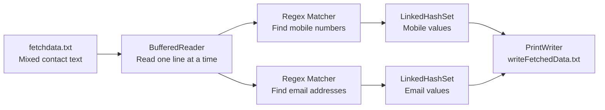
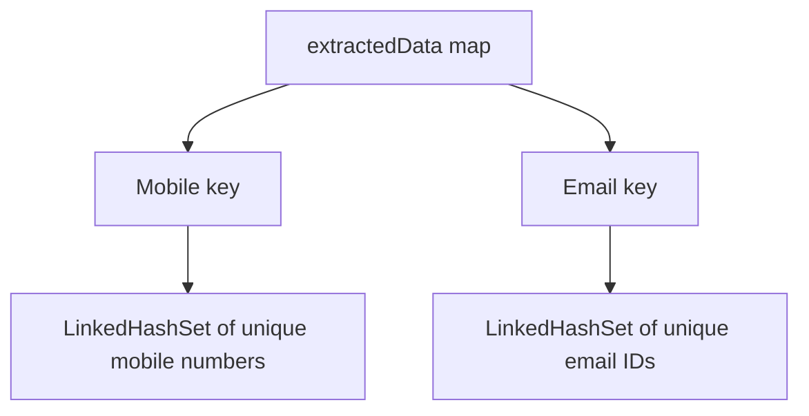
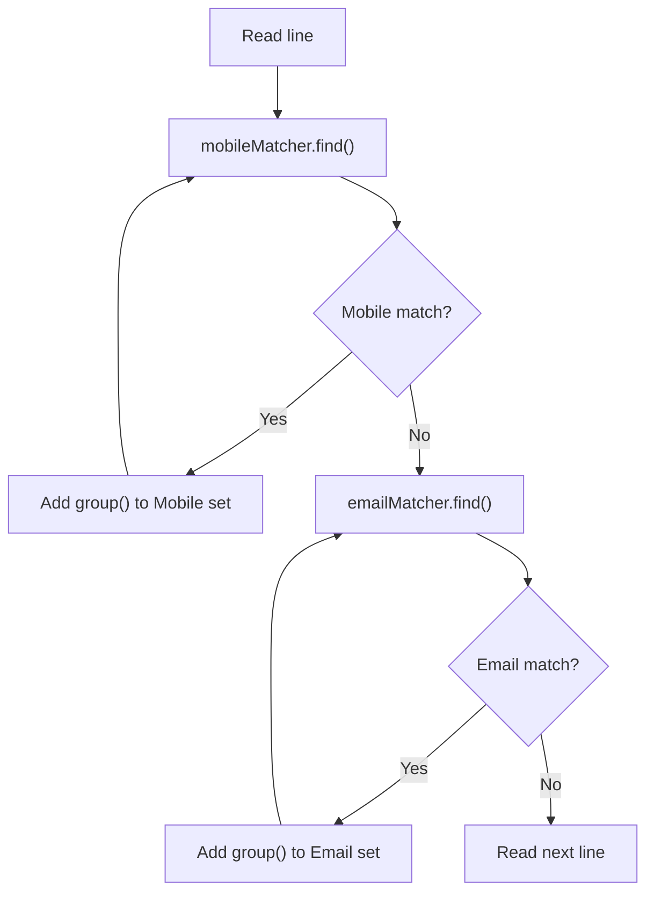

# Extracting Mobile Numbers and Email IDs from a File
//Ctrl and click a Markdown link to open its target.
<!-- TOC -->
- [Extracting Mobile Numbers and Email IDs from a File](#extracting-mobile-numbers-and-email-ids-from-a-file)
    - [Files Used](#files-used)
    - [Step-by-Step Execution](#step-by-step-execution)
    - [Example Output](#example-output)
    - [Run the Program](#run-the-program)
    - [Error Handling](#error-handling)
<!-- /TOC -->

**Source:** [FetchMobileNumandEmailFromFile.java](../../../demo/src/main/java/com/regularExpressions/FetchMobileNumandEmailFromFile.java)

This program reads mixed text from `fetchdata.txt`, finds mobile numbers and email IDs with regular expressions, stores them in collections, and writes the extracted values to `writeFetchedData.txt`.



## Files Used

| File                                                                                                                     | Purpose                                                                              |
| ------------------------------------------------------------------------------------------------------------------------ | ------------------------------------------------------------------------------------ |
| [fetchdata.txt](../../../demo/sample-data/file-operations/fetchdata.txt)                                                 | Input file containing names, text, phone numbers, and email IDs.                     |
| [writeFetchedData.txt](../../../demo/sample-data/file-operations/writeFetchedData.txt)                                   | Output file containing only extracted mobile numbers and email IDs.                  |
| [fileBasicMethods.java](../../../demo/src/main/java/com/javaIOPackage/baseMethodsInFileOperations/fileBasicMethods.java) | Provides `sampleDataPath(...)` to build a stable path to files inside `sample-data`. |

## Step-by-Step Execution

### 1. `main()` creates the input and output paths

```java
String inputFilePath = sampleDataPath("file-operations", "fetchdata.txt").toString();
String outputFilePath = sampleDataPath("file-operations", "writeFetchedData.txt").toString();
```

`sampleDataPath(...)` builds the path relative to the project structure. This avoids relying on a plain relative filename such as `fetchdata.txt`, which may fail when the program is launched from a different folder.

### 2. `main()` calls the extraction method

```java
Map<String, Set<String>> extractedData =
        fetchMobileNumandEmailFromFile(inputFilePath, outputFilePath);
```

The method returns a map containing both result collections:

```text
{
  Mobile = [mobile-number-1, mobile-number-2, ...],
  Email = [email-1, email-2, ...]
}
```

### 3. Create collections for the results

```java
Map<String, Set<String>> extractedData = new LinkedHashMap<>();
extractedData.put("Mobile", new LinkedHashSet<>());
extractedData.put("Email", new LinkedHashSet<>());
```

| Collection      | Reason for use                                                            |
| --------------- | ------------------------------------------------------------------------- |
| `LinkedHashMap` | Stores the categories in insertion order: `Mobile` followed by `Email`.   |
| `LinkedHashSet` | Removes duplicates and preserves the order in which each value was found. |



### 4. Open files safely

```java
try (PrintWriter writer = new PrintWriter(outputFilePath);
     BufferedReader reader = new BufferedReader(new FileReader(inputFilePath))) {
```

This is a **try-with-resources** block. Java closes both the reader and writer automatically, including when an `IOException` occurs.

- `BufferedReader` reads the input one line at a time.
- `PrintWriter` writes the final extracted values into the output file.

### 5. Create the regular expressions

```java
String regxMobileNumber = "(0|91)?[7-9][0-9]{9}";
String regxEmail = "[A-Za-z0-9+_.-]+@[A-Za-z0-9.-]+";
```

| Pattern                           | Explanation                                                                                                              |
| --------------------------------- | ------------------------------------------------------------------------------------------------------------------------ |
| `(0                               | 91)?[7-9][0-9]{9}`                                                                                                       | Optional `0` or `91` prefix, followed by a first digit from `7` to `9`, followed by nine digits. |
| `[A-Za-z0-9+_.-]+@[A-Za-z0-9.-]+` | Finds an email-like value anywhere in a line. It accepts letters, digits, and common email symbols before and after `@`. |

The email pattern does not use `^` and `$`. Those anchors would require the whole line to be only an email, but the input uses text such as `Email: priya.sharma@example.com`.

### 6. Read and inspect every line

```java
while ((line = reader.readLine()) != null) {
```

The loop continues until `readLine()` returns `null`, which means the end of the input file has been reached.

For every line, the program creates two matchers:

```java
java.util.regex.Matcher mobileMatcher = mobilePattern.matcher(line);
java.util.regex.Matcher emailMatcher = emailPattern.matcher(line);
```

### 7. Extract matches into collections

```java
while (mobileMatcher.find()) {
    extractedData.get("Mobile").add(mobileMatcher.group());
}
```

`find()` searches for each occurrence within the line. `group()` returns the text that matched. The email loop uses the same process and adds matches to the `Email` set.



### 8. Write collections to the output file

After all input lines are read, the program writes each collection:

```java
for (String mobileNumber : extractedData.get("Mobile")) {
    writer.println("Mobile: " + mobileNumber);
}
```

The email loop works in the same way. Because `LinkedHashSet` preserves insertion order, the output file lists matches in the order they appeared in `fetchdata.txt`.

## Example Output

The current sample input produces:

```text
Mobile: 9876543210
Mobile: 919812345678
Mobile: 8765432109
Mobile: 7987654321
Mobile: 09876543210
Email: priya.sharma@example.com
Email: arjun.mehta@company.org
Email: neha.patel_25@mail.net
Email: rahul.kumar+training@example.co.in
Email: aisha.khan@demo.io
Email: helpdesk@example.com
```

## Run the Program

From the project root:

```bash
cd demo
mvn clean verify
java -cp target/classes com.regularExpressions.FetchMobileNumandEmailFromFile
```

The console prints the returned `Map`. The extracted values are also written to [writeFetchedData.txt](../../../demo/sample-data/file-operations/writeFetchedData.txt).

## Error Handling

```java
catch (IOException e) {
    e.printStackTrace();
}
```

`IOException` covers issues such as a missing input file, an unreadable file, or a location where Java cannot write the output file.
