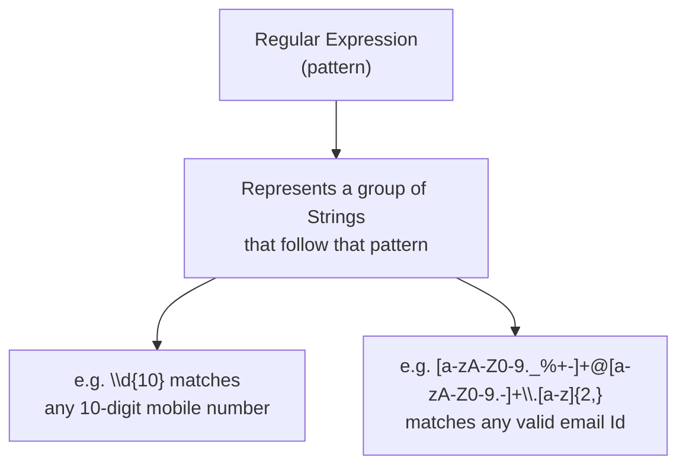
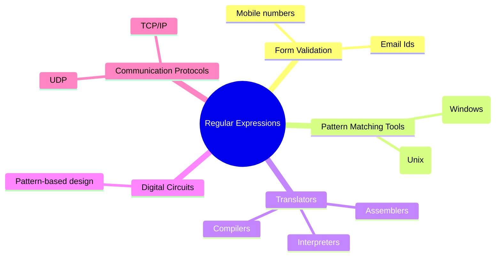
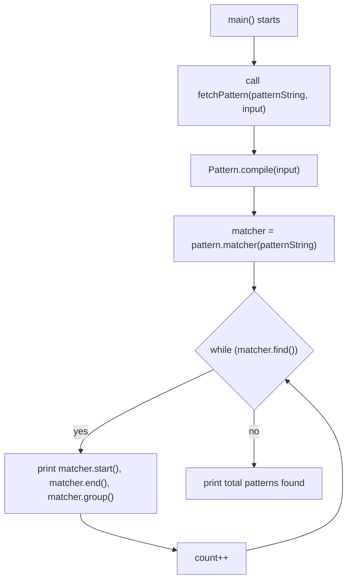
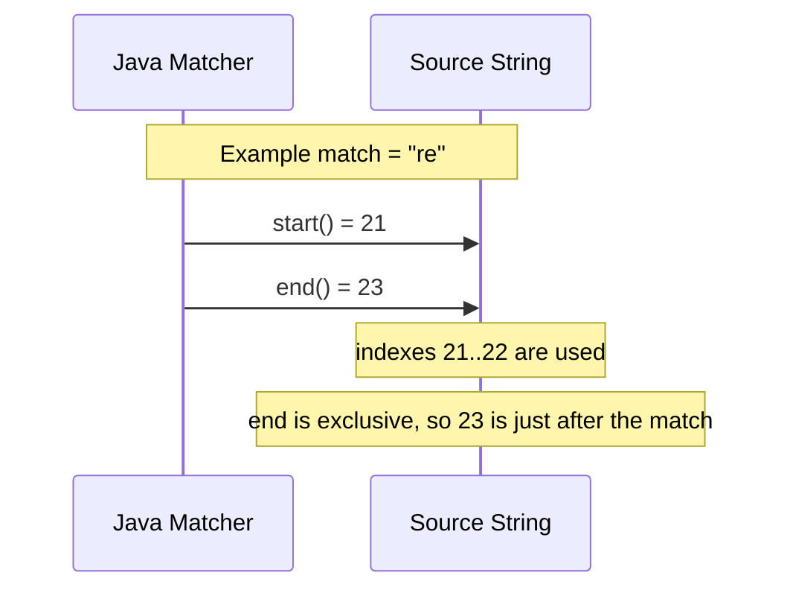
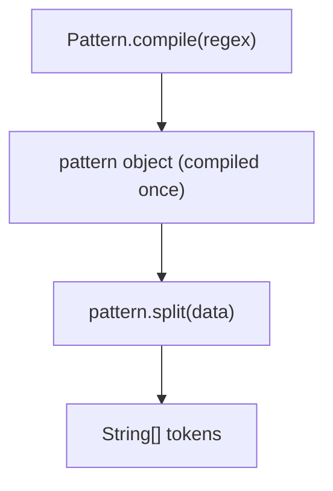
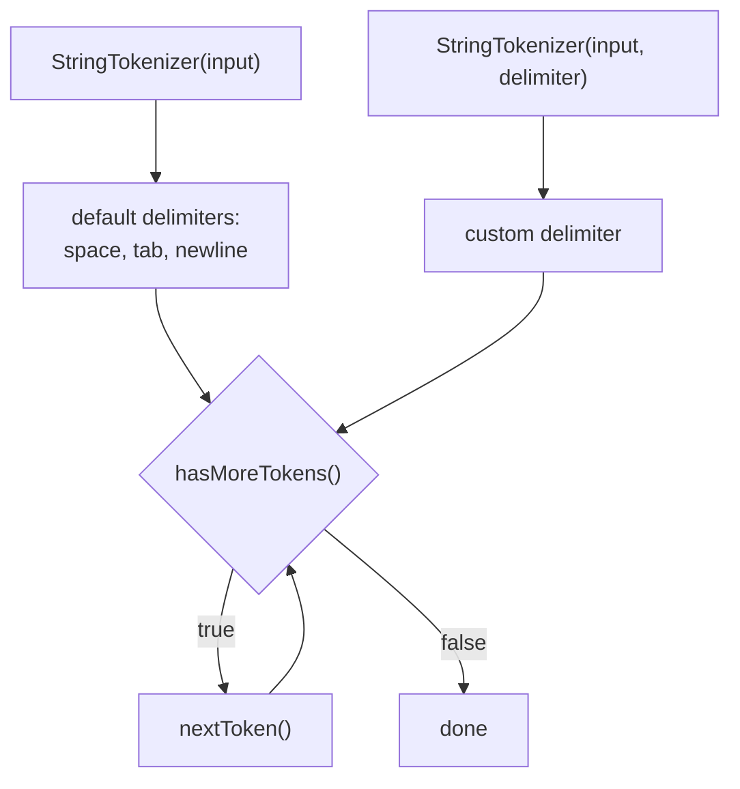
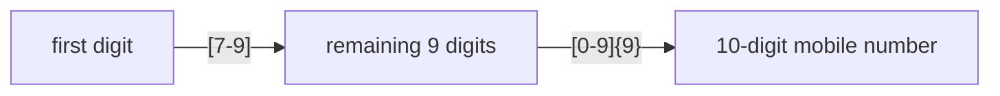
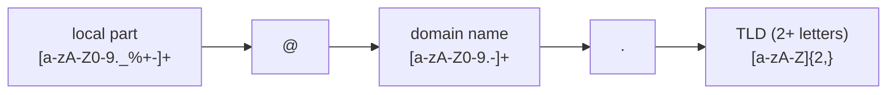

# Regular Expressions — Basics

**File:** [regularExpressionBasics.java](../../../demo/src/main/java/com/regularExpressions/regularExpressionBasics.java)

## 📌 Concept

> A regular expression represents a **group of Strings that follow a particular pattern**, instead of a single fixed String. It lets you validate or match many possible inputs (e.g. "any valid mobile number") with one compact rule.



### Main application areas

1. **Form/input validation** — e.g. mobile numbers, email addresses.
2. **Pattern-matching applications** — e.g. `Ctrl+F` (Windows), `grep` (Unix).
3. **Building translators** — e.g. assemblers, compilers, interpreters (tokenizing source text against lexical patterns).
4. **Designing digital circuits** — pattern-based state/transition specifications used in digital circuit design.
5. **Communication protocols** — specifying valid message/packet formats, e.g. TCP/IP, UDP.



## � Execution Summary of the Program

This file demonstrates the core idea of regex matching using `Pattern` and `Matcher`.

### Program flow



### What the program does

- `Pattern.compile(input)` creates a regex pattern from the `input` text.
- `pattern.matcher(patternString)` tries to find matches inside the larger string.
- `matcher.find()` keeps scanning until no more matches remain.
- For every match, Java prints:
  - `matcher.start()` → index where the match starts
  - `matcher.end()` → index just after the match ends
  - `matcher.group()` → the actual matched text
- `count` stores how many matches were found.

### Why `start()` and `end()` behave like this

Java uses a half-open range for match boundaries:

- `start()` is inclusive
- `end()` is exclusive

So if a match is found at index `21` and ends at `23`, the matched text is from index `21` and `22`.



### Example interpretation

```text
match found: re
start = 21
end = 23
actual characters used = indexes 21 to 22
```

So the formula is:

```text
match length = end - start
```

For example:

```text
23 - 21 = 2
```

This explains why the output can look like:

```text
21===23===re
```

Even though the actual match is only two characters long.

public static Pattern complie(String target)

We can use matcher Object to check trhe given pattern in the target String
We can create a matcher Object by using matcher() of Pattern class

Public Matcher matecher(String target)

## Important Methods of Matcher class 
> boolean find()
It attempts to find next match and returns true if it is available 
> int start() 
Returns the start index of the match 
> int end()
Returns end + 1 index of the match 
> String group()
It returns the matched pattern 

# NOTE 
> Pattern and matcher classes present in java.util.regex package 
and introduced in 1.4 V 

## 🔗 Related Files
- [regularExpressionBasics.java](../../../demo/src/main/java/com/regularExpressions/regularExpressionBasics.java) — source file implementing the regex scanning logic.

# character classes 

>[abc] => either 'a' or 'b' or 'c'

>[^abc] => any character except 'a', 'b' or 'c' (negation)

>[a-z] => any character from 'a' to 'z' (lowercase range)

>[A-Z] => any character from 'A' to 'Z' (uppercase range)

>[a-zA-Z] => any character from 'a' to 'z' or 'A' to 'Z' (a letter, either case)

>[0-9] => any digit from '0' to '9'

>[a-d[m-p]] => union: either 'a' to 'd' or 'm' to 'p'

>[a-z&&[def]] => intersection: only 'd', 'e' or 'f' (letters common to both classes)

>[a-z&&[^bc]] => subtraction: 'a' to 'z' except 'b' and 'c'

>[a-z&&[^m-p]] => subtraction: 'a' to 'z' except 'm' to 'p'

# predefined character classes

>. => any character (except line terminator)

>\d => any digit, same as [0-9]

>\D => any non-digit, same as [^0-9]

>\s => any whitespace character (space, tab, newline), same as [ \t\n\x0B\f\r]

>\S => any non-whitespace character, same as [^\s]

>\w => any word character, same as [a-zA-Z_0-9]

>\W => any non-word character, same as [^\w]

# quantifiers

>X? => X occurs zero or one time (optional)

>X* => X occurs zero or more times

>X+ => X occurs one or more times

>X{n} => X occurs exactly n times

>X{n,} => X occurs at least n times

>X{n,m} => X occurs at least n but not more than m times

# boundary matchers

>^ => matches at the beginning of a line

>$ => matches at the end of a line

>\b => matches a word boundary

>\B => matches a non-word boundary

>\A => matches at the beginning of the input

>\Z => matches at the end of the input, before the final line terminator (if any)

>\z => matches at the very end of the input

# logical operators

>XY => X followed by Y (concatenation)

>X|Y => either X or Y (alternation)

>(X) => X as a capturing group

# back references

>\n => matches whatever was matched by the n-th capturing group (e.g. \1 refers to group 1)

---

# Regular Expressions — Pattern Class

**File:** [splitMethod.java](../../../demo/src/main/java/com/regularExpressions/patternClass/splitMethod.java)

## split()

We can use `Pattern` class' `split()` method to split the target String according to a particular regex pattern.

```java
public String[] split(CharSequence input)
```

This is more powerful than `String.split()` because the pattern is compiled once (via `Pattern.compile()`) and can be reused across multiple `split()` calls efficiently.



### Two ways to split a String

| Approach | Method | Notes |
|---|---|---|
| `String` class | `input.split(regex)` | Compiles the regex internally on every call |
| `Pattern` class | `Pattern.compile(regex).split(input)` | Compile once, reuse the pattern multiple times — better for repeated splitting |

### Example

```java
Pattern pattern = Pattern.compile("\\s+");   // split by one-or-more whitespace
String[] result = pattern.split("This is an example string");
// => ["This", "is", "an", "example", "string"]

Pattern dotPattern = Pattern.compile("[.]"); // split by literal dot
String[] parts = dotPattern.split("www.durgajobs.com");
// => ["www", "durgajobs", "com"]
```

> ⚠️ Note the dot is wrapped in a character class `[.]` (or escaped as `\\.`) — an unescaped `.` in regex means "any character", not a literal dot.

---

# StringTokenizer

**Files:**
- [stringTokenizer.java](../../../demo/src/main/java/com/regularExpressions/stringTokenizer/stringTokenizer.java)
- [mobileNumber.java](../../../demo/src/main/java/com/regularExpressions/stringTokenizer/mobileNumber.java)

## 📌 Concept

> `StringTokenizer` is a class **specially designed for tokenization** — breaking a String into smaller pieces ("tokens") based on delimiter characters.

- Present in the `java.util` package.
- Considered a **legacy class** — for new code, `String.split()` or `Pattern`/`Matcher` are generally preferred, but `StringTokenizer` is still simple and fast for basic delimiter-based splitting.



## Key methods

> `StringTokenizer(String input)`
Creates a tokenizer using the **default delimiters** — space, tab, newline, carriage return, form feed.

> `StringTokenizer(String input, String delimiter)`
Creates a tokenizer using a **custom delimiter** string.

> `boolean hasMoreTokens()`
Returns `true` if there are still tokens left to read.

> `String nextToken()`
Returns the next token and advances the tokenizer.

### Example — default delimiter

```java
StringTokenizer tokenizer = new StringTokenizer("This is an example string");
while (tokenizer.hasMoreTokens()) {
    System.out.println(tokenizer.nextToken());
}
// This
// is
// an
// example
// string
```

### Example — custom delimiter

```java
StringTokenizer tokenizer = new StringTokenizer("19-09-2015", "-");
while (tokenizer.hasMoreTokens()) {
    System.out.println(tokenizer.nextToken());
}
// 19
// 09
// 2015
```

---

## 🔥 Real-world regex — validating a mobile number

**Requirement:** design a regex representing all valid 10-digit mobile numbers.

**Rules:**
1. Every number must contain **exactly 10 digits**.
2. The **first digit** must be `7`, `8`, or `9`.



| Pattern | Meaning |
|---|---|
| `[7-9][0-9]{9}` | Plain 10-digit number starting with 7, 8, or 9 |
| `0?[7-9][0-9]{9}` | Allows an optional leading `0` → 11 digits total (e.g. trunk prefix) |
| `(0\|91)?[7-9][0-9]{9}` | Allows an optional `0` **or** `91` STD/ISD prefix → up to 12 digits total |

## 🔥 Real-world regex — validating an email Id

**Rules:**
1. Should contain exactly **one `@`** symbol.
2. Should have a **domain name** after `@`.
3. Can contain alphanumeric characters, dots, and underscores **before** `@`.

```text
[a-zA-Z0-9._%+-]+@[a-zA-Z0-9.-]+\.[a-zA-Z]{2,}
```



| Part | Regex | Meaning |
|---|---|---|
| Local part | `[a-zA-Z0-9._%+-]+` | Letters, digits, dot, underscore, `%`, `+`, `-` (one or more) |
| Separator | `@` | Literal `@` symbol |
| Domain | `[a-zA-Z0-9.-]+` | Letters, digits, dot, hyphen (one or more) |
| Dot | `\.` | Literal dot before the TLD |
| TLD | `[a-zA-Z]{2,}` | At least 2 letters, e.g. `com`, `in`, `org` |

## 🔗 Related Files
- [splitMethod.java](../../../demo/src/main/java/com/regularExpressions/patternClass/splitMethod.java) — `Pattern.split()` vs `String.split()`.
- [stringTokenizer.java](../../../demo/src/main/java/com/regularExpressions/stringTokenizer/stringTokenizer.java) — default and custom delimiter tokenization.
- [mobileNumber.java](../../../demo/src/main/java/com/regularExpressions/stringTokenizer/mobileNumber.java) — mobile 
number and email regex design notes.

# Regular expression to represent YAVA language Identifiers 

>Rules 

Allowed characters are 

1. a-z , A-Z, 0-9, #, $
2. length of identifier should be atleast 2 
3. the first character should be lower case alphabet symbol from a to k 
4. second character should be a digit divisible by 3 (0,3,6,9)

[a-k][0369][a-zA-Z0-9#$]* 