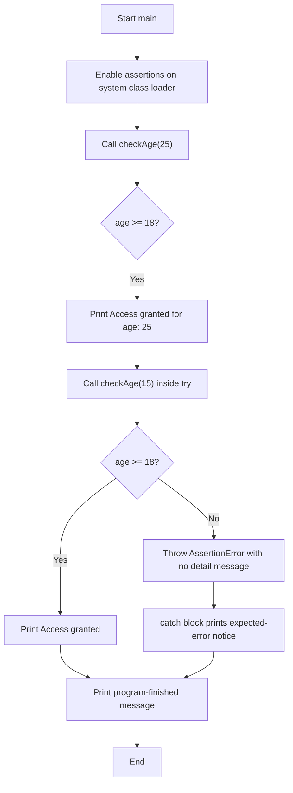
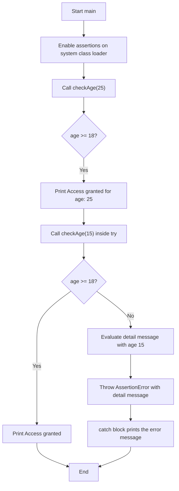

# Table of Contents

- [Table of Contents](#table-of-contents)
  - [Introduction](#introduction)
  - [Why use assertions?](#why-use-assertions)
  - [The `assert` keyword](#the-assert-keyword)
    - [Using `assert` as an identifier in older Java](#using-assert-as-an-identifier-in-older-java)
  - [Types of assert statements](#types-of-assert-statements)
    - [Simple assert statement](#simple-assert-statement)
    - [Augmented assert statement](#augmented-assert-statement)
  - [Enabling assertions in these examples](#enabling-assertions-in-these-examples)
  - [Simple assert example: execution summary](#simple-assert-example-execution-summary)
    - [Simple assert execution flow](#simple-assert-execution-flow)
    - [Simple assert console output](#simple-assert-console-output)
  - [Augmented assert example: execution summary](#augmented-assert-example-execution-summary)
    - [Augmented assert execution flow](#augmented-assert-execution-flow)
    - [Augmented assert console output](#augmented-assert-console-output)
  - [Comparison](#comparison)
  - [When to use assertions](#when-to-use-assertions)
- [various possible runtime flags](#various-possible-runtime-flags)

## Introduction

Assertions let a program check assumptions made by its code. They are useful during development and testing for detecting conditions that should never occur if the program is working correctly.

An assertion is not a replacement for validating input from users or external systems. Assertions are disabled by default unless enabled for the relevant class loader.

## Why use assertions?

Print statements such as `System.out.println` can help with temporary debugging, but they run whenever that code is reached and must often be removed or managed later. Assertions provide checks that can be enabled during development and testing and disabled when they are not needed.

The main purpose of assertions is to validate assumptions made by the code while debugging. After fixing a bug, developers do not have to remove assertion statements: they can remain in the code and be enabled or disabled for a run. Assertions are disabled by default.

When an enabled assertion condition is false, Java throws an `AssertionError`. This makes a failed assumption visible instead of allowing execution to continue as though the assumption were true. Assertions are mainly useful in development and test environments, not as a substitute for production input validation or error handling.

## The `assert` keyword

`assert` became a Java keyword in Java 1.4. From Java 1.4 onward, it cannot be used as an identifier, such as a variable name.

### Using `assert` as an identifier in older Java

This example does not compile with modern Java because `assert` is a keyword:

```java
class Test {
    public static void main(String[] args) {
        int assert = 10;
        System.out.println(assert);
    }
}
```

In the early Java versions when `assert` was not yet a keyword, a source-compatible compiler could accept it as an identifier. Historically, the compiler's `-source` option selected the Java language version used to interpret source code; old examples used commands such as:

```text
javac -source 1.2 Test.java
javac -source 1.3 Test.java
```

These are historical examples, not commands for current JDKs: modern `javac` no longer supports Java 1.2 or 1.3 source levels. Code that uses `assert` as an identifier should be renamed when moving to Java 1.4 or later.

## Types of assert statements

Java has two forms of the assert statement: simple and augmented (also called assert-with-message).

### Simple assert statement

```java
assert condition;
```

The condition must be a boolean expression:

1. If assertions are enabled and the condition is `true`, the assumption is satisfied and the rest of the program continues normally.
2. If assertions are enabled and the condition is `false`, the assumption has failed. Java throws an `AssertionError` without a detail message, and normal execution stops unless the error is caught.
3. After investigating the failure, fix the underlying problem. The assertion can remain in the code for future debugging.
4. If assertions are disabled, the assertion statement has no effect.

### Augmented assert statement

```java
assert condition : detailExpression;
```

The condition must be a boolean expression. The detail expression can be any expression that produces a value; a `String` is commonly used to explain the failure:

1. If assertions are enabled and the condition is `true`, the assumption is satisfied and execution continues.
2. If assertions are enabled and the condition is `false`, Java throws an `AssertionError` with the detail expression's value as its error detail. The detail expression is evaluated only on this failure path.
3. The detail can provide useful context for diagnosing the failed assumption.
4. If assertions are disabled, the assertion statement has no effect.

## Enabling assertions in these examples

Both example programs enable assertions in code before calling `AssertionChecker`:

```java
ClassLoader.getSystemClassLoader().setDefaultAssertionStatus(true);
```

Assertion status must be set before the checker class is initialized. This lets the examples run without an assertion-enabling command-line option.

## Simple assert example: execution summary

The [simple assertion example](../../../demo/src/main/java/com/assertions/simpleAssert/assertionBasics.java) enables assertions, checks age `25`, and then checks age `15` inside a `try` block. Its [checker](../../../demo/src/main/java/com/assertions/simpleAssert/AssertionChecker.java) uses `assert age >= 18;` with no detail message.

The first call passes and prints the access-granted message. The second call fails its assertion, so Java throws an `AssertionError` before that print statement. The `catch` block handles the error, prints a short explanation, and allows the program to finish.

### Simple assert execution flow



### Simple assert console output

```text
--- Starting Assertion Test ---
Access granted for age: 25
Caught expected AssertionError for age below 18.

--- Program finished execution safely ---
```

## Augmented assert example: execution summary

The [augmented assertion example](../../../demo/src/main/java/com/assertions/augumentedAssert/assertionBasics.java) enables assertions, checks age `25`, and then checks age `15` inside a `try` block. Its [checker](../../../demo/src/main/java/com/assertions/augumentedAssert/AssertionChecker.java) uses `assert age >= 18 : ...;` to include a detail message.

The first call passes and prints the access-granted message. On the second call, the condition is false, so Java throws an `AssertionError` containing the message and the supplied age (`15`). The `catch` block prints that message, then the program finishes.

### Augmented assert execution flow



### Augmented assert console output

```text
Access granted for age: 25
Caught expected assertion: Access denied: age must be 18 or older. Provided: 15
```

## Comparison

| Form      | Example                             | Error detail when the condition fails   |
| --------- | ----------------------------------- | --------------------------------------- |
| Simple    | `assert age >= 18;`                 | No detail message is supplied           |
| Augmented | `assert age >= 18 : "Age: " + age;` | Includes the supplied detail expression |

## When to use assertions

Use assertions for internal assumptions and conditions that indicate a programming defect if they are false. Do not rely on them to reject invalid external input, because assertions may be disabled in another runtime environment.

>assert(b):e;

1. e will be executed if and only if first argument is false i.e if the first argument is true then secodn argument won't be evaluated 
class Test{

  public static void main(String[] args)
  {
     int x = 10;

     assert(x ==10); ++x;

     System.out.println(x);
  }
}

>assert(b):e;

2. For the second argument we can take method call but void return type method call is not allowed otherwise we will get compile time error 

class Test{

  public static void main(String[] args)
  {
     int x = 10;

     assert(x ==10); m1();

     System.out.println(x);
  }

  public static int m1()
  {
    return 777;
  }
}

after enabling the assert we will get the ouput as 

RuntimeException: AssertionError:777

If we use return type as void then we will compile time error 
'void' type not allowed here 

NOTE : among 2 versions of assertions it is recommended to use augumented version because it provides more information for debugging 

# various possible runtime flags

1. -ea | -enableassertions
   To enable assertions in every non-system class(our own classes)
2. -da | -disableassertions
   To disable assertions in every non-system class 
3. -esa | -enablesystemassertions
   To enable assertions in every system class(pre-defined classes)
4. -dsa | --disablesystemassertions 
   To disable assertions in every system class(pre-defined classes)
