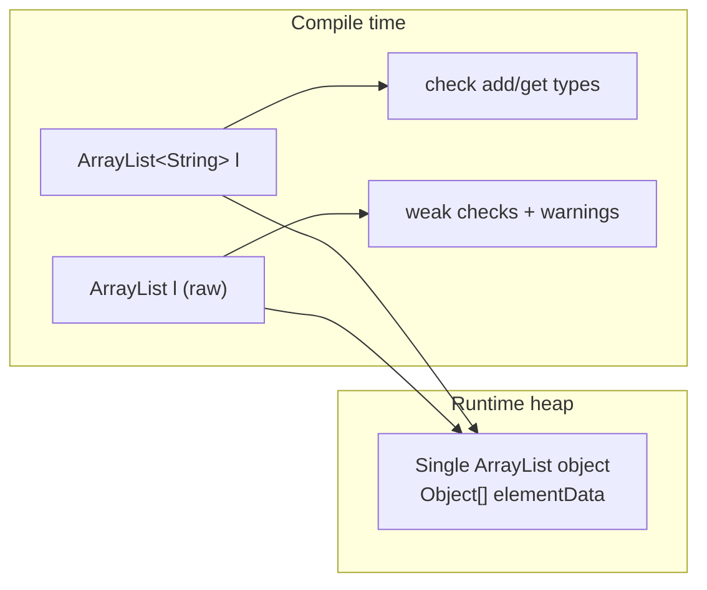
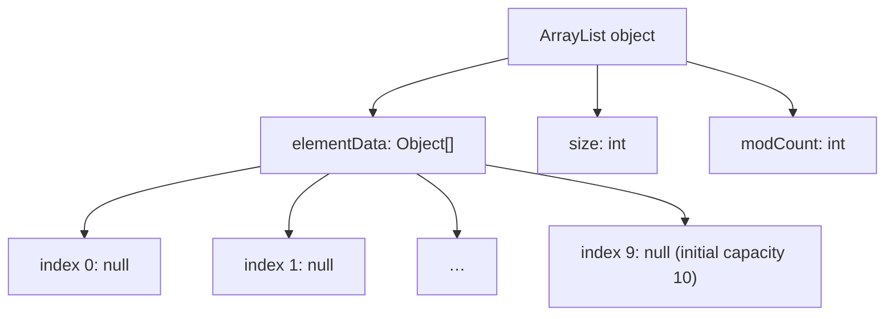
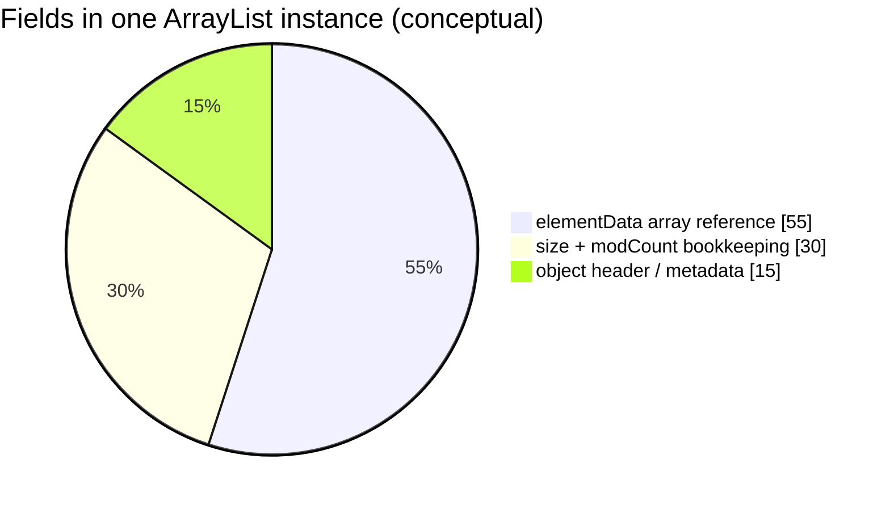
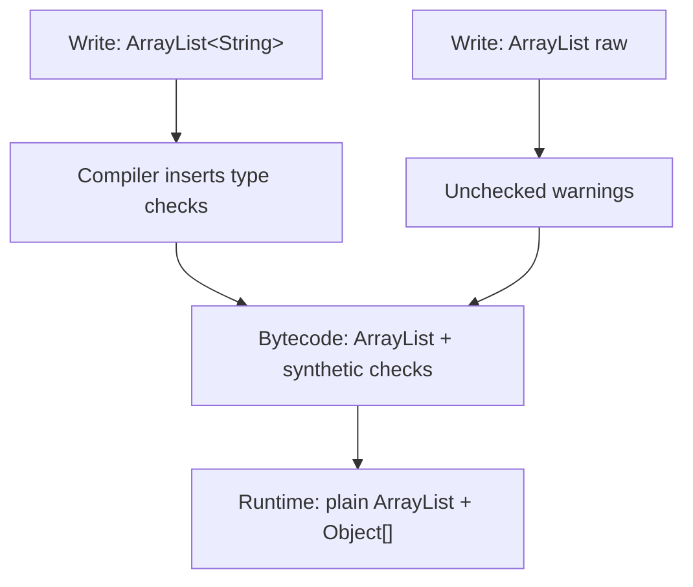
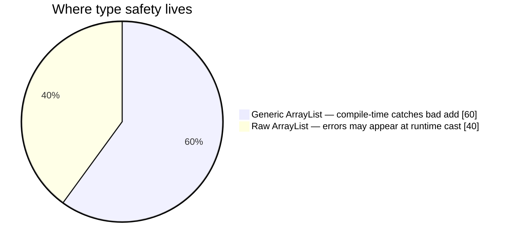
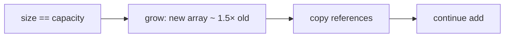
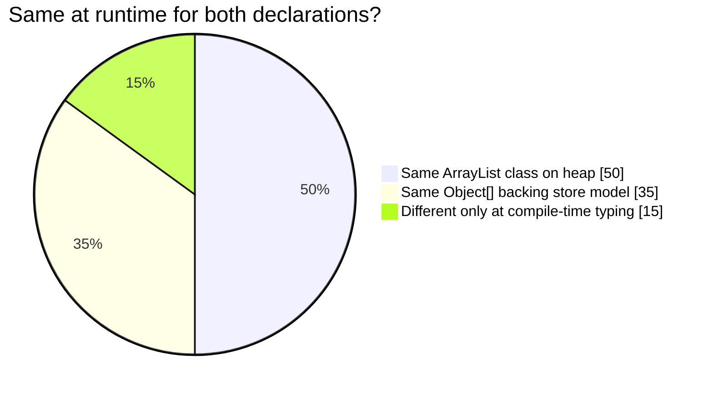
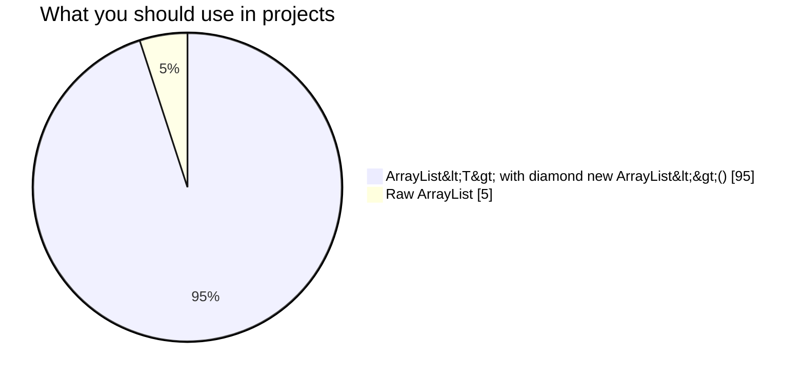

# `ArrayList<String>` vs `ArrayList` (raw): internals and generics

> Copy-friendly guide. Runnable demos: [`arrayList.java`](../../../demo/src/main/java/com/collection/list/arrayList.java) · List hub: [list.md](list.md)

This explains:

1. **What is inside** every `new ArrayList()` on the heap (same physical structure for generic and raw).
2. **What differs** between `ArrayList<String> l = new ArrayList<String>()` and `ArrayList l = new ArrayList()` at **compile time** vs **runtime**.

---

## Guide map

| Section | Topic |
| ------- | ----- |
| [Two declarations](#two-declarations-side-by-side) | Generic vs raw syntax |
| [Runtime object (same for both)](#runtime-internal-structure-one-heap-object) | `elementData`, `size`, `modCount` |
| [Compile-time vs runtime](#compile-time-vs-runtime-type-erasure) | Type erasure flow |
| [`add` / `get` flows](#operation-flows-add-and-get) | Checked vs unchecked |
| [Pie charts](#summary-pie-charts) | Safety and memory model |
| [Examples](#code-examples) | Copy-paste samples |

---

## Two declarations side by side

```java
ArrayList<String> l1 = new ArrayList<String>();  // generic (preferred)
ArrayList         l2 = new ArrayList();          // raw type (avoid in new code)
```

Modern style (same as first line):

```java
ArrayList<String> l1 = new ArrayList<>();
```

| | `ArrayList<String> l = new ArrayList<String>()` | `ArrayList l = new ArrayList()` |
| --- | ----------------------------------------------- | ------------------------------- |
| **Variable type** | `ArrayList<String>` — compiler knows element type **String** | **Raw** `ArrayList` — no type parameter on variable |
| **Heap class** | `java.util.ArrayList` | **Same** `java.util.ArrayList` |
| **Bytecode / generics** | Compile-time checks; type args **erased** at runtime | **Unchecked** warnings; compiler treats list as “old-style” |
| **`l.add("hi")`** | OK | OK (but raw style) |
| **`l.add(42)`** | **Compile error** | **Allowed** (unsafe — integer in list you treat as strings) |
| **`String s = l.get(0)`** | OK without cast | Needs **cast**: `(String) l.get(0)` |
| **Recommendation** | **Always use** in new code | Legacy / interop only |



---

## Runtime internal structure (one heap object)

After **`new ArrayList()`** or **`new ArrayList<String>()`**, the JVM creates **one** `ArrayList` instance. Generics do **not** create a separate “String ArrayList” class.

### Logical layout (JDK `ArrayList`)

```text
ArrayList instance (heap)
┌─────────────────────────────────────────────┐
│  elementData  ──►  Object[]  (length ≥ capacity)
│  size         ──►  int (number of elements used, 0 at start)
│  modCount     ──►  int (structural change counter for iterators)
└─────────────────────────────────────────────┘

Default no-arg constructor:
  capacity starts at DEFAULT_CAPACITY (10) for the empty array growth path
  size = 0
```



### After `l.add("A"); l.add("B");` (whether `l` is generic or raw)

```text
elementData (conceptual):
  [0]="A"  [1]="B"  [2]=null … 
size = 2
```

**Important:** At runtime the array is **`Object[]`**. A `String` reference is stored in an `Object` slot (polymorphism). There is **no** `String[]` inside `ArrayList<String>` at runtime.



---

## Compile time vs runtime (type erasure)

Java **erases** type parameters when generating bytecode.  
`ArrayList<String>` and raw `ArrayList` both become **`ArrayList`** at runtime.

```mermaid
sequenceDiagram
  participant Dev as Source code
  participant Comp as javac
  participant JVM as JVM runtime

  Dev->>Comp: ArrayList&lt;String&gt; l = new ArrayList&lt;&gt;();
  Comp->>Comp: Type-check add/get as String
  Comp->>JVM: class files with raw ArrayList + casts where needed
  JVM->>JVM: new ArrayList() — one class only
  Note over JVM: No field "String" stored on ArrayList object
```



| Phase | `ArrayList<String>` | Raw `ArrayList` |
| ----- | ------------------- | --------------- |
| **Compile** | `add` must be `String` (or subtype) | `add` accepts **any** `Object` |
| **Runtime class** | `ArrayList` | `ArrayList` |
| **Array in memory** | `Object[]` | `Object[]` |
| **Iterator typing** | `Iterator<String>` | `Iterator` (raw) |

---

## Operation flows: `add` and `get`

### `ArrayList<String> l = new ArrayList<>();`

```mermaid
flowchart TD
  ADD["l.add(\"hello\")"] --> C1{"Compiler: is String?"}
  C1 -- Yes --> M1["ArrayList.add(E e)"]
  M1 --> G1["ensure capacity"]
  G1 --> W1["elementData[size++] = reference"]
  GET["String s = l.get(0)"] --> M2["get(0) returns Object"]
  M2 --> C2["implicit cast to String (compiler-inserted)"]
```

### `ArrayList l = new ArrayList();` then misuse

```mermaid
flowchart TD
  ADD["l.add(100)"] --> OK["Compiles — Integer stored in Object[]"]
  ADD2["l.add(\"text\")"] --> OK2["Also compiles"]
  GET["String s = (String) l.get(0)"] --> RUN["Runtime: ClassCastException if slot holds Integer"]
```



---

## Growth (same for generic and raw)

When `size` exceeds capacity, `ArrayList` allocates a **new** larger `Object[]`, copies references, and points `elementData` to the new array.



Typical default: start from **empty array** or grow from capacity **10** depending on constructor path; growth policy is implementation detail of `ArrayList.grow()`.

---

## Code examples

### Generic (recommended)

```java
import java.util.ArrayList;

public class GenericArrayListExample {
    public static void main(String[] args) {
        ArrayList<String> l = new ArrayList<String>();
        // same as: new ArrayList<>();

        l.add("alpha");
        l.add("beta");
        // l.add(1);     // COMPILE-TIME ERROR

        String first = l.get(0);
        System.out.println(first);
        System.out.println("size=" + l.size());
    }
}
```

### Raw (legacy — shows same runtime structure, weaker types)

```java
import java.util.ArrayList;

public class RawArrayListExample {
    public static void main(String[] args) {
        ArrayList l = new ArrayList();  // raw type

        l.add("alpha");
        l.add(99);  // compiles — unsafe

        String first = (String) l.get(0);  // cast required
        // String bad = (String) l.get(1); // ClassCastException at runtime

        System.out.println(first);
    }
}
```

### Proof: same runtime class

```java
System.out.println(new ArrayList<String>().getClass());
System.out.println(new ArrayList().getClass());
// both print: class java.util.ArrayList
```

---

## Summary pie charts





---

## Quick reference table

| Question | Answer |
| -------- | ------ |
| Is internal memory layout different? | **No** — same `ArrayList` + `Object[]` + `size` + `modCount` |
| Does `ArrayList<String>` store `String[]`? | **No** — still `Object[]` after erasure |
| Why use generics? | **Compile-time** type safety, fewer casts, clearer APIs |
| Why avoid raw `ArrayList`? | **Unchecked** operations → possible `ClassCastException` later |

---

## See also

- [list.md — ArrayList execution flow](list.md#arraylist--complete-execution-flow-arraylistjava)
- [collections.md](collections.md) — Java Collections hub
