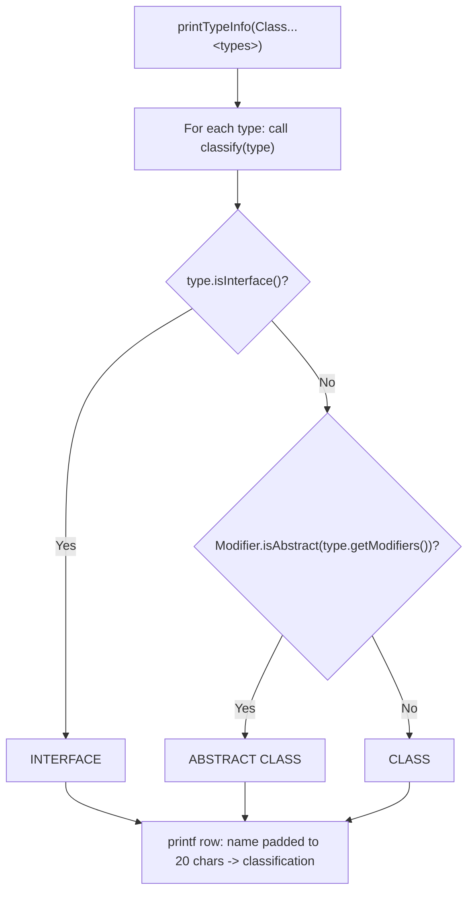

# Collection base classes (`collectionBaseClasses` package)

> `CollectionTypeInspector`, shared `*Demo` dispatchers, and constructor overview.
>
> [← Back to Java Collections Guide](collections.md)

---

## Constructors for all collection data structures

The following methods demonstrate the constructors for each data structure. Ctrl+click a method name to open its Java implementation:

| Dispatcher | Package | Role |
| ---------- | ------- | ---- |
| [`listDemo.java`](../../../demo/src/main/java/com/collection/list/listDemo.java) | `list` | `listCollectionType`, `listConstructors` — ArrayList, LinkedList, Vector, Stack |
| [`setDemo.java`](../../../demo/src/main/java/com/collection/set/setDemo.java) | `set` | `setCollectionType`, `setConstructors`, `setComparator` — HashSet, TreeSet, NavigableSet, … |
| [`queueDemo.java`](../../../demo/src/main/java/com/collection/collectionBaseClasses/queueDemo.java) | `collectionBaseClasses` | `queueCollectionType`, `queueConstructors` — LinkedList-as-Queue, ArrayDeque, PriorityQueue |
| [`mapDemo.java`](../../../demo/src/main/java/com/collection/map/mapDemo.java) | `map` | `mapCollectionType`, `mapConstructors`, `mapLoadFactor` — HashMap, TreeMap, NavigableMap, … |
| [`synchornizedCollections.java`](../../../demo/src/main/java/com/collection/collectionBaseClasses/synchornizedCollections.java) | `collectionBaseClasses` | Legacy synchronized wrapper examples |

Constructor entry points (same pattern: `*Constructors(String type)` in each dispatcher):

- [List — `listConstructors`](../../../demo/src/main/java/com/collection/list/listDemo.java) → see [List guide](list.md)
- [Set — `setConstructors`](../../../demo/src/main/java/com/collection/set/setDemo.java) → see [Set guide](set.md)
- [Queue — `queueConstructors`](../../../demo/src/main/java/com/collection/collectionBaseClasses/queueDemo.java) → see [Queue guide](queue.md)
- [Map — `mapConstructors`](../../../demo/src/main/java/com/collection/map/mapDemo.java) → see [Map guide](map.md)

[`printDefaultCapacitySummary`](../../../demo/src/main/java/com/collection/collectionBaseClasses/CollectionTypeInspector.java) reflects public API names and capacity rules for a requested type (used from launchers such as `navigableSet`, `arrayList`, `arrayDeque`).

## Checking Whether a Collection Type Is a Class or an Interface

**File:** [`CollectionTypeInspector.java`](../../../demo/src/main/java/com/collection/collectionBaseClasses/CollectionTypeInspector.java)

Every `listDemo`, `setDemo`, `queueDemo`, and `mapDemo` method calls `CollectionTypeInspector.printTypeInfo(...)` before running its methods/cursors. It uses `java.lang.reflect` to classify each supplied type as `INTERFACE`, `ABSTRACT CLASS`, or `CLASS`, and prints a boxed, column-aligned table.



### The formatting line — `CollectionTypeInspector.java` line 15

> 🔎 **Highlighted line:** [`CollectionTypeInspector.java#L15`](../../../demo/src/main/java/com/collection/collectionBaseClasses/CollectionTypeInspector.java#L15)

```java
System.out.printf("  %-20s -> %s%n", type.getSimpleName(), classify(type));
```

This is a `printf`-style formatted print: a format string containing placeholders, followed by the arguments that fill them in, in order.

| Format piece | Meaning                                                                                |
| ------------ | -------------------------------------------------------------------------------------- |
| `  `         | Two literal spaces of indentation before the column starts.                            |
| `%-20s`      | Insert a `String`, left-justified (`-`), padded to a minimum width of `20` characters. |
| ` -> `       | Literal arrow separating the two columns.                                              |
| `%s`         | Insert the second `String`, with no padding.                                           |
| `%n`         | Platform-specific newline (safer than a hardcoded `\n`).                               |

| Argument               | Fills placeholder | Value comes from                                                                        |
| ---------------------- | ----------------- | --------------------------------------------------------------------------------------- |
| `type.getSimpleName()` | first `%-20s`     | The unqualified name, e.g. `ArrayList` instead of `java.util.ArrayList`.                |
| `classify(type)`       | second `%s`       | The private helper method that returns `"INTERFACE"`, `"ABSTRACT CLASS"`, or `"CLASS"`. |

For `ArrayList.class`, this line prints:

```text
  ArrayList            -> CLASS
```

The `%-20s` width of `20` keeps every row's `->` arrow aligned in the same column, even when class names have very different lengths (for example `Set` vs. `LinkedHashSet`).

### Example output

```text
----- Type Classification -----
  ArrayList            -> CLASS
  List                 -> INTERFACE
--------------------------------
```

