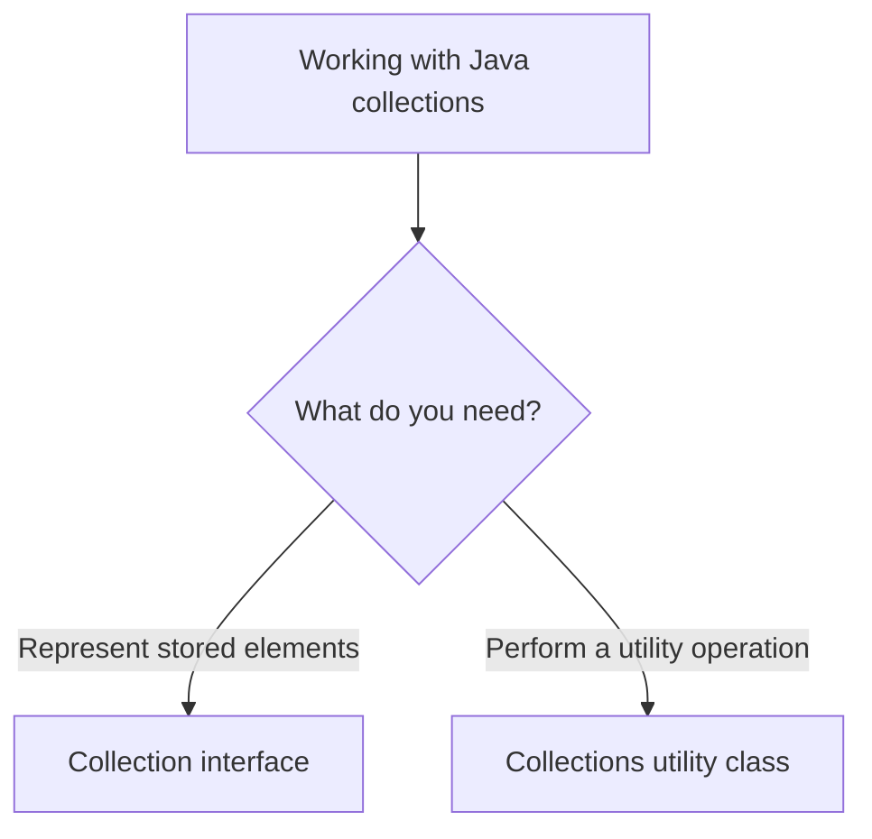
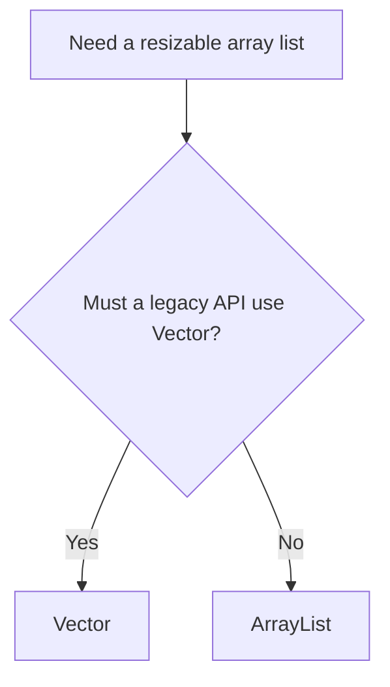
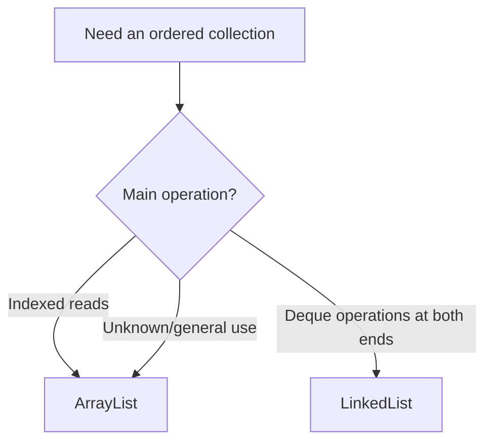
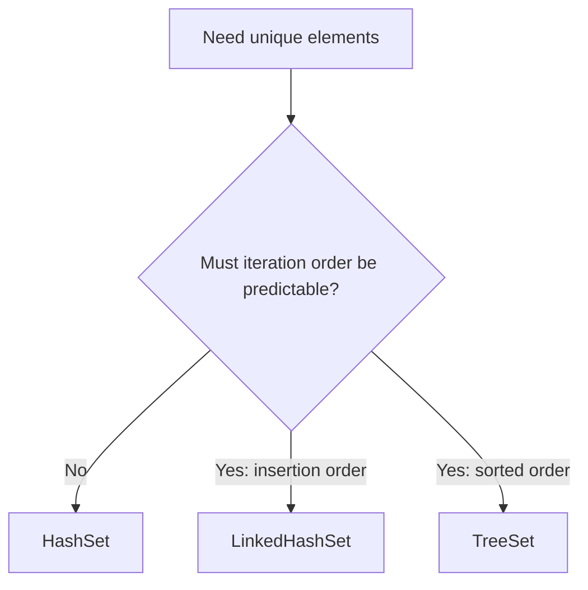
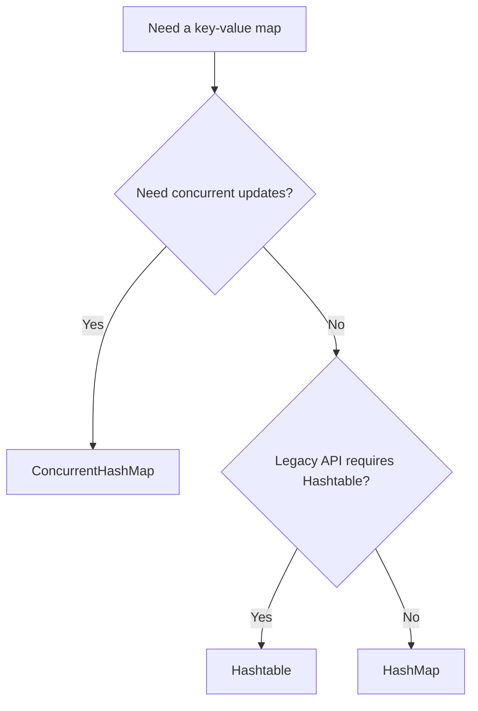

# Differences in Java Collections

> **Java Collections comparison guide** — use this page to choose the correct collection type quickly and understand the trade-offs behind that choice.

> **Preview tip:** Open this page in **Markdown Preview** (`Ctrl+Shift+V`) and use `Ctrl+click` to navigate comparisons.

A single, visual reference page for the collection comparisons covered in this project. Each topic follows the same easy-to-scan format:

1. **One-line answer** — the fastest recommendation.
2. **Quick choice** — pick the appropriate type for a requirement.
3. **Decision flow** — follow the choice visually.
4. **Side-by-side differences** — compare every important behavior.
5. **Practical guidance** — apply the comparison in real code.

## Start here

| Choose a comparison                                         | Use it when you want to know...                                         |
| ----------------------------------------------------------- | ----------------------------------------------------------------------- |
| [**Collection vs Collections**](#collection-vs-collections) | Whether you need the collection interface or the static utility class.  |
| [**ArrayList vs Vector**](#arraylist-vs-vector)             | Which resizable-array list is appropriate, especially for legacy code.  |
| [**ArrayList vs LinkedList**](#arraylist-vs-linkedlist)     | Which list fits indexed access, end operations, or a deque.             |
| [**HashSet vs LinkedHashSet**](#hashset-vs-linkedhashset)   | Whether unique elements need predictable insertion-order iteration.     |
| [**HashMap vs Hashtable**](#hashmap-vs-hashtable)           | Which hash-based map to use, including `null` and concurrency behavior. |

> **Tip:** Open this file in **Markdown Preview** (`Ctrl+Shift+V`) for clean rendered tables and diagrams. Use `Ctrl+click` on a link to jump straight to a comparison.

---

<!-- TOC -->
- [Differences in Java Collections](#differences-in-java-collections)
  - [Start here](#start-here)
  - [Collection vs Collections](#collection-vs-collections)
    - [Quick choice](#quick-choice)
    - [Side-by-side differences](#side-by-side-differences)
    - [Practical guidance](#practical-guidance)
  - [ArrayList vs Vector](#arraylist-vs-vector)
    - [Quick choice](#quick-choice-1)
    - [Side-by-side differences](#side-by-side-differences-1)
    - [Practical guidance](#practical-guidance-1)
  - [ArrayList vs LinkedList](#arraylist-vs-linkedlist)
    - [Quick choice](#quick-choice-2)
    - [Side-by-side differences](#side-by-side-differences-2)
    - [Practical guidance](#practical-guidance-2)
  - [HashSet vs LinkedHashSet](#hashset-vs-linkedhashset)
    - [Quick choice](#quick-choice-3)
    - [Side-by-side differences](#side-by-side-differences-3)
    - [Shared behavior](#shared-behavior)
    - [Practical guidance](#practical-guidance-3)
  - [For a visual decision flow and an expanded `HashSet` comparison, see HashSet vs LinkedHashSet — Quick Comparison.](#for-a-visual-decision-flow-and-an-expanded-hashset-comparison-see-hashset-vs-linkedhashset--quick-comparison)
  - [comparable vs comparator](#comparable-vs-comparator)
  - [Core Differences](#core-differences)
  - [Advanced \& Structural Differences](#advanced--structural-differences)
  - [Comprehensive Breakdown of Advanced Concepts](#comprehensive-breakdown-of-advanced-concepts)
    - [1. The Strategy Pattern vs. Intrinsic Behavior](#1-the-strategy-pattern-vs-intrinsic-behavior)
    - [2. Fluent Chaining (Sorting by Multiple Fields)](#2-fluent-chaining-sorting-by-multiple-fields)
    - [3. Null Handling Flexibility](#3-null-handling-flexibility)
  - [Real-World Rule of Thumb](#real-world-rule-of-thumb)
  - [HashMap vs Hashtable](#hashmap-vs-hashtable)
    - [Quick choice](#quick-choice-4)
    - [Side-by-side differences](#side-by-side-differences-4)
    - [Shared behavior](#shared-behavior-1)
    - [See the null difference](#see-the-null-difference)
    - [Practical guidance](#practical-guidance-4)
- [Comprehensive Comparison: HashMap vs. Hashtable in Java](#comprehensive-comparison-hashmap-vs-hashtable-in-java)
  - [1. Quick Summary (The Core Differences)](#1-quick-summary-the-core-differences)
  - [2. Exhaustive Comparison Matrix](#2-exhaustive-comparison-matrix)
  - [3. Deep-Dive Architectural Differences](#3-deep-dive-architectural-differences)
    - [A. Memory \& Indexing Mechanics](#a-memory--indexing-mechanics)
    - [B. Structural Collision Handling (Java 8+ Optimization)](#b-structural-collision-handling-java-8-optimization)
    - [C. The Null-Pointer Trap](#c-the-null-pointer-trap)
  - [4. Modern Production Alternatives](#4-modern-production-alternatives)
- [Deep Dive Comparison: HashMap vs LinkedHashMap](#deep-dive-comparison-hashmap-vs-linkedhashmap)
  - [Technical Comparison Matrix](#technical-comparison-matrix)
  - [Detailed Architectural Differences](#detailed-architectural-differences)
    - [1. Underlying Data Structure](#1-underlying-data-structure)
    - [2. Iteration Mechanics](#2-iteration-mechanics)
    - [3. Configuring Access Order](#3-configuring-access-order)
    - [4. Null Key and Null Value Tolerance](#4-null-key-and-null-value-tolerance)
  - [Code Example Comparison](#code-example-comparison)
  - [Core Summary: When to Choose Which?](#core-summary-when-to-choose-which)
<!-- /TOC -->

> **Contents:** The table of contents below is also clickable. It includes each comparison and its Quick choice, differences, and guidance sections.

---

## Collection vs Collections

> **One-line answer:** `Collection` is an interface used to represent a group of elements; `Collections` is a utility class containing static methods that work with collections.

### Quick choice

| If you need...                                          | Use                                                | Why                                                        |
| ------------------------------------------------------- | -------------------------------------------------- | ---------------------------------------------------------- |
| A variable type for a group of elements                 | `Collection<E>`                                    | It is the root interface for common collection operations. |
| Sorting, reversing, searching, or wrapping a collection | `Collections`                                      | Its static utility methods perform those operations.       |
| A collection object to store values                     | An implementation such as `ArrayList` or `HashSet` | Interfaces cannot be instantiated directly.                |



### Side-by-side differences

| Topic        | `Collection`                                                                                           | `Collections`                                                                                |
| ------------ | ------------------------------------------------------------------------------------------------------ | -------------------------------------------------------------------------------------------- |
| Type         | Interface.                                                                                             | Utility class.                                                                               |
| Package      | `java.util.Collection`                                                                                 | `java.util.Collections`                                                                      |
| Purpose      | Represents a group of objects as one unit.                                                             | Provides static helper methods for collection objects.                                       |
| Instances    | You cannot instantiate the interface directly. Use an implementation such as `ArrayList` or `HashSet`. | You do not instantiate it; its constructor is private.                                       |
| Examples     | `add()`, `remove()`, `contains()`, `size()`, `iterator()`                                              | `sort()`, `reverse()`, `shuffle()`, `binarySearch()`, `max()`, `min()`, `synchronizedList()` |
| Relationship | Root interface for `List`, `Set`, and `Queue`.                                                         | Works with collections; it is not part of the collection-interface hierarchy.                |

```java
Collection<String> names = new ArrayList<>();
names.add("Ram");
Collections.sort((List<String>) names);
```

> Use **`Collection`** as a type for a group of elements; use **`Collections`** to perform utility operations on a collection.

### Practical guidance

1. Declare APIs with `Collection<E>` when they accept any kind of collection.
2. Instantiate a concrete implementation, such as `new ArrayList<>()`.
3. Call `Collections` methods directly through the class name; do not create an instance.

---

## ArrayList vs Vector

> **One-line answer:** prefer `ArrayList` for new code; use `Vector` only when an older API specifically requires it.

### Quick choice

| If you need...                                    | Choose                                                | Why                                                               |
| ------------------------------------------------- | ----------------------------------------------------- | ----------------------------------------------------------------- |
| A normal resizable, indexed list                  | `ArrayList`                                           | It is the modern, lower-overhead default.                         |
| Compatibility with legacy code that uses `Vector` | `Vector`                                              | It preserves the required legacy API.                             |
| A thread-safe list for new code                   | A purpose-appropriate synchronized or concurrent list | `Vector` method synchronization is rarely the best modern design. |



### Side-by-side differences

| Topic              | `ArrayList<E>`                                                                 | `Vector<E>`                                                                                                            |
| ------------------ | ------------------------------------------------------------------------------ | ---------------------------------------------------------------------------------------------------------------------- |
| Status             | Modern general-purpose list.                                                   | Legacy list retained for compatibility.                                                                                |
| Internal structure | Resizable array.                                                               | Resizable array.                                                                                                       |
| Thread safety      | Not synchronized.                                                              | Individual methods are synchronized.                                                                                   |
| Concurrent use     | External synchronization is needed if multiple threads structurally modify it. | Method-level synchronization makes individual operations thread-safe, but compound operations still need coordination. |
| Performance        | Usually faster because there is no synchronization cost.                       | Usually slower because synchronized methods add overhead.                                                              |
| Capacity growth    | Grows by approximately 50% when necessary.                                     | Doubles by default, or grows by the configured `capacityIncrement`.                                                    |
| Default capacity   | An empty `ArrayList` allocates its default backing array on first addition.    | `10`.                                                                                                                  |
| Legacy cursor      | No `Enumeration`.                                                              | Has `elements()`, which returns a legacy `Enumeration`.                                                                |
| Recommended use    | Default choice for a resizable, indexed list.                                  | Prefer only when maintaining older APIs that require `Vector`.                                                         |

> For new thread-safe list code, prefer explicit locking, `Collections.synchronizedList(...)`, or a concurrent collection suited to the workload rather than choosing `Vector` by default.

### Practical guidance

1. Use `ArrayList` unless a real requirement says otherwise.
2. Do not treat `Vector` synchronization as complete multi-step thread safety.
3. Use `CopyOnWriteArrayList`, locking, or another concurrent design when the workload requires it.

---

## ArrayList vs LinkedList

> **One-line answer:** choose `ArrayList` for indexed access and general use; choose `LinkedList` mainly for deque operations at the beginning or end.

### Quick choice

| If you need...                                   | Choose              | Why                                                             |
| ------------------------------------------------ | ------------------- | --------------------------------------------------------------- |
| Frequent `get(index)` or `set(index, value)`     | `ArrayList`         | It provides direct $O(1)$ indexed access.                       |
| A FIFO queue, deque, or efficient end operations | `LinkedList`        | It implements `Deque` and has $O(1)$ operations at both ends.   |
| Frequent middle changes by index                 | Usually `ArrayList` | A `LinkedList` still needs $O(n)$ traversal to find that index. |



### Side-by-side differences

| Topic                        | `ArrayList<E>`                                                        | `LinkedList<E>`                                                                                |
| ---------------------------- | --------------------------------------------------------------------- | ---------------------------------------------------------------------------------------------- |
| Internal structure           | Resizable array.                                                      | Doubly linked nodes.                                                                           |
| Indexed read: `get(index)`   | $O(1)$ direct access.                                                 | $O(n)$ traversal from the nearest end.                                                         |
| Replace: `set(index, value)` | $O(1)$.                                                               | $O(n)$ to reach the node.                                                                      |
| Append: `add(value)`         | $O(1)$ amortized.                                                     | $O(1)$.                                                                                        |
| Insert/remove in the middle  | $O(n)$ because later elements shift.                                  | Finding by index is $O(n)$; linking/unlinking after the node is reached is $O(1)$.             |
| End operations               | `addLast()` is efficient; removing the first element shifts values.   | Efficient at both ends: `addFirst()`, `addLast()`, `removeFirst()`, `removeLast()` are $O(1)$. |
| Memory                       | Lower per-element overhead; it stores element references in an array. | Higher per-element overhead; each node stores the element plus previous/next links.            |
| Random access                | Implements `RandomAccess`.                                            | Does not implement `RandomAccess`.                                                             |
| Queue/deque support          | A `List`; not a `Deque`.                                              | Implements both `List` and `Deque`.                                                            |
| Recommended use              | Frequent indexed reads and appends.                                   | Deque-style operations at the beginning/end; do not choose it for frequent indexed access.     |

> Do not assume `LinkedList` is automatically faster for “insertions and deletions.” It is beneficial when you already have the node position or when operations occur at the ends; searching for a middle index is still linear.

### Practical guidance

1. Start with `ArrayList` for most list requirements.
2. Select `LinkedList` when its `Deque` operations are central to the design.
3. Avoid repeatedly calling `get(index)` inside a loop on a `LinkedList`.

---

## HashSet vs LinkedHashSet

> **One-line answer:** choose `HashSet` when order does not matter; choose `LinkedHashSet` when elements must be returned in insertion order.

### Quick choice

| If you need...                                     | Choose          | Why                                            |
| -------------------------------------------------- | --------------- | ---------------------------------------------- |
| Unique elements with the lowest practical overhead | `HashSet`       | It does not maintain insertion-order links.    |
| Unique elements with predictable insertion order   | `LinkedHashSet` | It preserves insertion order during iteration. |
| Unique elements in sorted order                    | `TreeSet`       | Neither hash-based set sorts elements.         |



### Side-by-side differences

| Topic                                             | `HashSet<E>`                                                    | `LinkedHashSet<E>`                                                                                 |
| ------------------------------------------------- | --------------------------------------------------------------- | -------------------------------------------------------------------------------------------------- |
| Inheritance                                       | Extends `AbstractSet<E>`.                                       | Extends `HashSet<E>`.                                                                              |
| Internal structure                                | Hash table, backed by `HashMap` in current JDK implementations. | Hash table plus links between entries, backed by `LinkedHashMap` in current JDK implementations.   |
| Iteration order                                   | No guarantee. Do not depend on the displayed order.             | Insertion order is preserved.                                                                      |
| Re-adding an existing element                     | `add()` returns `false`; the set does not change.               | Same; the element keeps its original insertion position.                                           |
| Sorted order                                      | No.                                                             | No. Use `TreeSet` if elements must be sorted.                                                      |
| `Iterator`, `forEach`, and stream encounter order | Unspecified.                                                    | Insertion order.                                                                                   |
| Java 21 sequenced API                             | Does not implement `SequencedSet`.                              | Implements `SequencedSet`, including `addFirst()`, `getFirst()`, `removeLast()`, and `reversed()`. |
| `add`, `contains`, `remove`                       | $O(1)$ average time.                                            | $O(1)$ average time, with small link-maintenance overhead.                                         |
| Iteration cost                                    | Usually $O(\text{size} + \text{capacity})$.                     | $O(\text{size})$.                                                                                  |
| Memory use                                        | Lower per-entry overhead.                                       | Higher per-entry overhead for the entry links.                                                     |
| Recommended use                                   | Fast uniqueness/membership checks where order does not matter.  | Stable output, stable tests, logs, and de-duplicating input while retaining its order.             |

### Shared behavior

| Property      | Both classes                                                                             |
| ------------- | ---------------------------------------------------------------------------------------- |
| Duplicates    | Not allowed; `add()` returns `false` for an existing equal element.                      |
| Matching rule | Uses consistent `hashCode()` and `equals()` implementations.                             |
| `null`        | Allow one `null` element.                                                                |
| Defaults      | Initial capacity `16`; load factor `0.75`; first resize threshold $16 \times 0.75 = 12$. |
| Thread safety | Not synchronized.                                                                        |
| Iterators     | Fail-fast on a best-effort basis.                                                        |
| Equality      | Ignores iteration order; equal element sets are equal.                                   |

> **Quick rule:** choose `HashSet` for lower-overhead unordered uniqueness; choose `LinkedHashSet` whenever insertion-order iteration matters.

### Practical guidance

1. Use `HashSet` for fast membership checks when output order is irrelevant.
2. Use `LinkedHashSet` for stable logs, stable tests, and order-preserving de-duplication.
3. Choose `TreeSet`, not either hash-based set, when sorting is required.

For a visual decision flow and an expanded `HashSet` comparison, see [HashSet vs LinkedHashSet — Quick Comparison](hashset-vs-linkedhashset.md).
----

## comparable vs comparator

1. for predefined comparable classes default natural sorting or already available If we are not satisfied with the default natural sorting then 
   we can define our own sortign by using comparator.
2. for pre-defined non-comparable classes( like StringBuffer) default natural sorting order not already available then we can define our own sorting 
   by using comparator 
3. for our own classes like employee, the person who is writing the class is responsible to define default natural sorting order by implementing 
   comparable interface
4. The person who is using our class, if he is not satisfied with default natural sorting order then he can define his own sorting by using comparator
---


Here is a comprehensive breakdown of the differences between **`Comparable`** and **`Comparator`** in Java, ranging from basic mechanics to advanced architectural design patterns.

---

## Core Differences

| Feature                 | `Comparable`                                                                              | `Comparator`                                                                               |
| :---------------------- | :---------------------------------------------------------------------------------------- | :----------------------------------------------------------------------------------------- |
| **Purpose**             | Defines the **natural/default sorting order** for a class.                                | Defines **alternate, custom sorting orders** for a class.                                  |
| **Package**             | `java.lang`                                                                               | `java.util`                                                                                |
| **Method to Override**  | `public int compareTo(T o)`                                                               | `public int compare(T o1, T o2)`                                                           |
| **Class Modification**  | You **must modify** the original class to implement it.                                   | You **do not modify** the original class. You build a separate helper class.               |
| **Number of Arguments** | Takes **one** object parameter (compares `this` to `o`).                                  | Takes **two** object parameters (compares `o1` to `o2`).                                   |
| **Flexibility**         | **Single sorting logic**. If you sort by ID, you cannot easily switch to sorting by Name. | **Multiple sorting logics**. You can create one for Name, one for ID, one for Salary, etc. |
| **TreeSet Usage**       | `new TreeSet<>()`<br>*(Uses the class's default logic)*                                   | `new TreeSet<>(new MyComparator())`<br>*(Passes custom logic into the constructor)*        |

---

## Advanced & Structural Differences

| Feature Dimension               | `Comparable`                                                                                                                                                        | `Comparator`                                                                                                                                             |
| :------------------------------ | :------------------------------------------------------------------------------------------------------------------------------------------------------------------ | :------------------------------------------------------------------------------------------------------------------------------------------------------- |
| **Design Strategy**             | **Intrusive:** It modifies the core data model. The object controls its own sorting logic.                                                                          | **Non-Intrusive:** It separates data from logic. It acts as an external utility or strategy pattern.                                                     |
| **Modification Rights**         | **Requires Source Access:** You cannot use it if the class belongs to a third-party library or JDK (e.g., you cannot change how `java.lang.String` sorts natively). | **No Source Access Needed:** You can sort any class from any library by writing an external comparator.                                                  |
| **Memory & Object Lifecycle**   | **Zero Overhead:** No extra objects are created. The sorting logic is baked directly into the data objects themselves.                                              | **Potential Overhead:** Requires instantiating a helper object (or dummy object) to execute the sort, though lambdas mitigate this.                      |
| **Functional Interface Status** | **Not a Functional Interface:** It does not qualify for direct lambda shorthand (`@FunctionalInterface` is absent).                                                 | **Is a Functional Interface:** It contains exactly one abstract method (`compare`), making it fully compatible with Java 8+ lambdas.                     |
| **Chaining & Composition**      | **No Built-in Chaining:** You cannot easily combine multiple `Comparable` rules together out of the box.                                                            | **Powerful Chaining:** Supports built-in utility methods like `.thenComparing()` to sort by Name, then by Age if names match.                            |
| **Null Safety / Customization** | **High Risk of Crashes:** If `this` or the passed object is `null`, it easily triggers a `NullPointerException`.                                                    | **Built-in Null Handling:** Offers built-in helper methods like `Comparator.nullsFirst()` or `Comparator.nullsLast()` to gracefully handle missing data. |

---

## Comprehensive Breakdown of Advanced Concepts

### 1. The Strategy Pattern vs. Intrinsic Behavior
* **Comparable** represents **intrinsic identity**. An object says, *"This is who I am naturally compared to others."* For example, a `Date` object naturally sorts chronologically.
* **Comparator** represents the **Strategy Pattern**. It allows you to inject different algorithms dynamically at runtime depending on what the user clicks on a screen.

### 2. Fluent Chaining (Sorting by Multiple Fields)
If you use `Comparator`, you can chain multiple sorting rules together in a single, readable line. `Comparable` does not easily allow this.

```java
// Sorts by name first; if names are identical, it automatically sorts by empId
Comparator<employeeBase> multiSort = Comparator
                                        .comparing((employeeBase e) -> e.name)
                                        .thenComparingInt(e -> e.empId);
```

### 3. Null Handling Flexibility
If your data collection contains `null` values, a regular `Comparable` implementation will break. `Comparator` provides elegant wrappers to put nulls at the absolute beginning or end of your sorted collection.

```java
// Safely sorts names even if some employee names are completely null
Comparator<employeeBase> safeSort = Comparator.nullsLast(
    Comparator.comparing(e -> e.name)
);
```

---

## Real-World Rule of Thumb
* Implement **`Comparable`** on your domain class for its **standard, default sort** (like `empId`).
* Create separate **`Comparator`** instances whenever a user needs to toggle sorting on a UI table (e.g., clicking a column header to **"Sort by Name"** or **"Sort by Salary"**).

## HashMap vs Hashtable

> **One-line answer:** use `HashMap` for most modern maps; `Hashtable` is a legacy synchronized map that rejects `null` keys and values. For modern concurrent maps, prefer `ConcurrentHashMap`.

### Quick choice

| If you need...                                          | Choose              | Why                                                                         |
| ------------------------------------------------------- | ------------------- | --------------------------------------------------------------------------- |
| A normal, fast key-value map                            | `HashMap`           | It is the standard general-purpose map.                                     |
| Compatibility with an old API that requires `Hashtable` | `Hashtable`         | It provides the legacy API and behavior.                                    |
| Safe concurrent access in new code                      | `ConcurrentHashMap` | It scales substantially better than synchronizing every `Hashtable` method. |
| A map that permits a `null` key or `null` values        | `HashMap`           | `Hashtable` rejects all `null` keys and values.                             |



### Side-by-side differences

| Topic                         | `HashMap<K, V>`                                                                                        | `Hashtable<K, V>`                                                                             |
| ----------------------------- | ------------------------------------------------------------------------------------------------------ | --------------------------------------------------------------------------------------------- |
| Status                        | Modern general-purpose map, introduced in Java 1.2.                                                    | Legacy class, introduced in Java 1.0.                                                         |
| Inheritance                   | Extends `AbstractMap<K, V>` and implements `Map<K, V>`.                                                | Extends legacy `Dictionary<K, V>` and implements `Map<K, V>`.                                 |
| Thread safety                 | Not synchronized.                                                                                      | Individual public methods are synchronized.                                                   |
| Concurrent performance        | Fast in single-threaded code, but external coordination is required for concurrent structural changes. | Typically slower under concurrent access because one monitor serializes operations.           |
| Modern concurrent alternative | Use `ConcurrentHashMap` when multiple threads update/read the map.                                     | `ConcurrentHashMap` is normally preferable to `Hashtable` for new concurrent code.            |
| `null` key                    | Allows one `null` key.                                                                                 | Rejects `null` keys with `NullPointerException`.                                              |
| `null` values                 | Allows multiple `null` values.                                                                         | Rejects `null` values with `NullPointerException`.                                            |
| Iteration order               | No key iteration-order guarantee.                                                                      | No key iteration-order guarantee.                                                             |
| Main operation time           | `put`, `get`, and `remove` are $O(1)$ on average.                                                      | The same average $O(1)$ hashing model, plus synchronization overhead.                         |
| Default initial capacity      | `16`; default load factor `0.75`; initial threshold $16 \times 0.75 = 12$.                             | `11`; default load factor `0.75`; initial threshold is $\lfloor 11 \times 0.75 \rfloor = 8$.  |
| Growth rule                   | Normally doubles table capacity when resizing.                                                         | Grows using $2 \times \text{old capacity} + 1$.                                               |
| Traversal API                 | `keySet()`, `values()`, `entrySet()`, plus fail-fast iterators.                                        | The same map views and iterators; also exposes legacy `keys()` and `elements()` enumerations. |
| Recommended use               | Default choice when order and built-in synchronization are not required.                               | Only for legacy compatibility; avoid it for new code.                                         |

### Shared behavior

| Property      | Both classes                                                                                                     |
| ------------- | ---------------------------------------------------------------------------------------------------------------- |
| Key rule      | Keys are unique; putting an existing key replaces its value.                                                     |
| Value rule    | Values may be duplicated.                                                                                        |
| Matching rule | Keys use consistent `hashCode()` and `equals()` implementations.                                                 |
| Ordering      | Neither guarantees iteration order; use `LinkedHashMap` for insertion/access order or `TreeMap` for sorted keys. |
| Serialization | Both implement `Serializable`.                                                                                   |
| Iterators     | Iterators are fail-fast on a best-effort basis.                                                                  |

### See the null difference

```java
Map<String, Integer> hashMap = new HashMap<>();
hashMap.put(null, 1);          // Allowed
hashMap.put("missing", null); // Allowed

Map<String, Integer> hashtable = new Hashtable<>();
hashtable.put(null, 1);        // Throws NullPointerException
hashtable.put("missing", null); // Throws NullPointerException
```

### Practical guidance

1. Start with `HashMap` for ordinary key-value storage.
2. Use `ConcurrentHashMap` instead of `Hashtable` for new concurrent code.
3. Use `LinkedHashMap` when iteration order must be predictable, or `TreeMap` when keys must be sorted.
4. Avoid `null` in shared or concurrent map APIs even when using `HashMap`; it makes absence and error handling less clear.

> **Quick rule:** `HashMap` is the modern default; `Hashtable` is primarily a compatibility class.

# Comprehensive Comparison: HashMap vs. Hashtable in Java

This document provides a highly detailed, production-grade technical comparison between `java.util.HashMap` and `java.util.Hashtable`. 

---

## 1. Quick Summary (The Core Differences)

The fundamental difference lies in **thread safety, performance, and API age**. `HashMap` is a modern, non-synchronized, high-performance collection that allows nulls. `Hashtable` is an obsolete legacy class from Java 1.0 where all methods are synchronized, making it a major performance bottleneck.

---

## 2. Exhaustive Comparison Matrix

| Technical Metric             | `java.util.HashMap`                                      | `java.util.Hashtable`                                      |
| :--------------------------- | :------------------------------------------------------- | :--------------------------------------------------------- |
| **Thread Safety**            | ❌ **No** (Not thread-safe)                               | **Yes** (Thread-safe)                                      |
| **Performance Speed**        | ⚡ **High** (No synchronization overhead)                 | 🐌 **Low** (Heavy object-level locking overhead)            |
| **Null Keys**                | **Allowed** (Maximum 1 key, stored at bucket index 0)    | ❌ **Strictly Forbidden** (Throws `NullPointerException`)   |
| **Null Values**              | **Allowed** (Multiple)                                   | ❌ **Strictly Forbidden** (Throws `NullPointerException`)   |
| **Superclass**               | `java.util.AbstractMap`                                  | `java.util.Dictionary` (Legacy abstract class)             |
| **Framework Origin**         | Java 1.2 (Modern Collections Framework)                  | Java 1.0 (Pre-collections legacy)                          |
| **Default Initial Capacity** | **16**                                                   | **11**                                                     |
| **Default Load Factor**      | 0.75                                                     | 0.75                                                       |
| **Resizing Formula**         | `capacity * 2` (Always a power of 2)                     | `(capacity * 2) + 1` (Ensures prime-like spacing)          |
| **Index Calculation**        | Bitwise AND: `(n - 1) & hash` (Extremely fast)           | Modulo: `(hash & 0x7FFFFFFF) % length` (Slower)            |
| **Traversal Mechanics**      | `Iterator`                                               | `Iterator` and legacy `Enumeration`                        |
| **Iteration Behavior**       | **Fail-fast** (Throws `ConcurrentModificationException`) | **Fail-safe** (`Enumeration`) / **Fail-fast** (`Iterator`) |
| **Worst-Case Search Time**   | **O(log n)** (Optimized via treeification in Java 8)     | **O(n)** (Standard singly-linked list traversal)           |

---

## 3. Deep-Dive Architectural Differences

### A. Memory & Indexing Mechanics
* **HashMap Strategy:** Uses bitwise operations for lightning-fast bucket mapping. Because the capacity is forced to be a power of two, `(n - 1) & hash` functions as a highly efficient modulo operation.
* **Hashtable Strategy:** Relies on true modulo mathematical operations `(hash % length)`. It enforces an odd/prime-ish capacity growth formula `(capacity * 2) + 1` to try and naturally scatter hash codes across buckets without masking functions.

### B. Structural Collision Handling (Java 8+ Optimization)
* **HashMap Treeification:** When a single bucket length exceeds a threshold of **8** and the total map capacity is at least **64**, `HashMap` dynamically structurally transforms that bucket from a singly-linked list into a **Balanced Red-Black Tree**. This protects against HashDoS attacks and drops lookup times from $O(n)$ down to $O(\log n)$.
* **Hashtable Stagnation:** `Hashtable` was never retrofitted with treeification. A heavily congested bucket remains a standard singly-linked list indefinitely, decaying search performance strictly to $O(n)$.

### C. The Null-Pointer Trap
* `HashMap` explicitly intercepts `null` keys:
  ```java
  static final int hash(Object key) {
      return (key == null) ? 0 : (h = key.hashCode()) ^ (h >>> 16);
  }
  ```
* `Hashtable` executes `.hashCode()` directly against incoming objects without checking for null nulls, instantly exploding into a `NullPointerException` if a key or value is missing.

---

## 4. Modern Production Alternatives

Since `Hashtable` is universally considered deprecated by code quality tools, use these alternatives instead:

1. **Single-Threaded Use Cases:** Always default to `HashMap`.
2. **Highly Concurrent Use Cases:** Use `java.util.concurrent.ConcurrentHashMap`. It avoids global locks entirely by locking individual buckets (lock stripping), allowing hundreds of threads to execute simultaneous reads and writes.
3. **Legacy Interface Adaptation:** If a legacy API demands an absolute synchronized Map ecosystem, generate a wrapper using `Collections.synchronizedMap(new HashMap<>())`.

# Deep Dive Comparison: HashMap vs LinkedHashMap

The **primary difference** between `HashMap` and `LinkedHashMap` in Java is **iteration order**: `HashMap` makes no guarantees about the order of elements during iteration, whereas `LinkedHashMap` maintains a predictable, predictable order (typically insertion order) using an underlying doubly-linked list.

Below is a comprehensive breakdown of all differences across implementation details, performance metrics, and behavior.

---

## Technical Comparison Matrix

| Feature / Metric                     | `HashMap`                                                     | `LinkedHashMap`                                                               |
| :----------------------------------- | :------------------------------------------------------------ | :---------------------------------------------------------------------------- |
| **Ordering**                         | No guaranteed order; can change over time.                    | Predictable order (Insertion-order or Access-order).                          |
| **Data Structure**                   | Hash table (Array of Buckets + Node chains/Red-Black Trees).  | Hash table + Doubly-linked list running through all entries.                  |
| **Memory Footprint**                 | Low (Stores only key, value, hash, and next pointer).         | High (Requires two additional pointers per node for `before` and `after`).    |
| **Time Complexity (put/get/remove)** | O(1) average time.                                            | O(1) average time (slightly higher constant factors due to pointer upkeep).   |
| **Iteration Performance**            | Proportional to capacity: $O(\text{capacity} + \text{size})$. | Proportional to size only: $O(\text{size})$. Faster iteration on sparse maps. |
| **Inheritance Relation**             | Implements `Map` interface directly.                          | Extends `HashMap` class directly.                                             |
| **LRU Cache Capability**             | Not supported natively.                                       | Built-in support by overriding `removeEldestEntry()` in access-order mode.    |

---

## Detailed Architectural Differences

### 1. Underlying Data Structure
* **`HashMap`**: Utilizes an array of buckets. When a collision occurs, entries are chained into a linked list or transformed into a balanced Red-Black Tree (if the bucket size exceeds the threshold).
* **`LinkedHashMap`**: Inherits the structural blueprint of `HashMap` but wraps each node inside a doubly-linked list. Every entry retains pointers to its predecessor and successor, irrespective of which bucket the entry sits in.

### 2. Iteration Mechanics
* **`HashMap` iteration**: Iterates through the bucket array sequentially, then jumps into the individual linked list/tree of each bucket. If the capacity is high but the element count is low, it wastes time scanning empty buckets.
* **`LinkedHashMap` iteration**: Ignores the bucket array entirely during iteration. It begins at the `head` pointer of the doubly-linked list and follows the `after` pointers straight to the `tail`, ensuring maximum efficiency for sparse tables.

### 3. Configuring Access Order
While `HashMap` has only one operational mode, `LinkedHashMap` provides a special 3-argument constructor that lets you switch from standard **insertion-order** to **access-order**:

```java
LinkedHashMap<K, V> lruMap = new LinkedHashMap<>(initialCapacity, loadFactor, true);
```
When the last boolean flag is set to `true`, querying an item via `get()` or modifying it via `put()` automatically detaches the item from its current spot in the linked list and pushes it to the tail. This layout makes it incredibly easy to build a custom Least Recently Used (LRU) Cache by overriding `removeEldestEntry()`.

### 4. Null Key and Null Value Tolerance
Both classes belong to the Java Collections Framework and behave identically with null values:
* Exactly **one null key** is permitted.
* **Multiple null values** are fully supported.

---

## Code Example Comparison

The code snippet below illustrates how iteration orders diverge under normal usage:

```java
import java.util.HashMap;
import java.util.LinkedHashMap;
import java.util.Map;

public class MapComparison {
    public static void main(String[] args) {
        // 1. HashMap Setup
        Map<String, Integer> hashMap = new HashMap<>();
        hashMap.put("Apple", 1);
        hashMap.put("Banana", 2);
        hashMap.put("Orange", 3);

        System.out.println("--- HashMap Iteration (Unpredictable Order) ---");
        for (Map.Entry<String, Integer> entry : hashMap.entrySet()) {
            System.out.println(entry.getKey() + ": " + entry.getValue());
        }

        // 2. LinkedHashMap Setup
        Map<String, Integer> linkedHashMap = new LinkedHashMap<>();
        linkedHashMap.put("Apple", 1);
        linkedHashMap.put("Banana", 2);
        linkedHashMap.put("Orange", 3);

        System.out.println("\n--- LinkedHashMap Iteration (Guaranteed Insertion Order) ---");
        for (Map.Entry<String, Integer> entry : linkedHashMap.entrySet()) {
            System.out.println(entry.getKey() + ": " + entry.getValue());
        }
    }
}
```

---

## Core Summary: When to Choose Which?

* **Choose `HashMap` when** memory footprints must be kept tight, and the order of elements has zero impact on your application logic. It offers slightly better execution speeds during insertion and mass retrieval.
* **Choose `LinkedHashMap` when** you need predictable iteration sequences, copy operations that reflect structural history, or when you are implementing cache eviction patterns like LRU.
