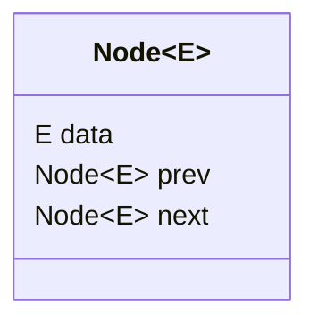
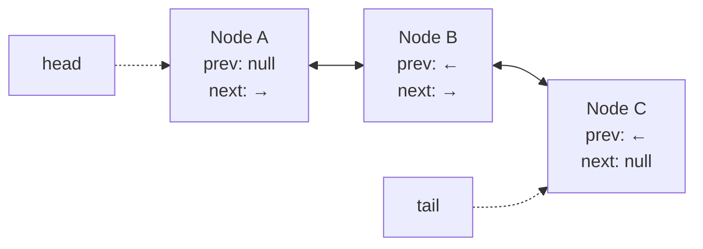
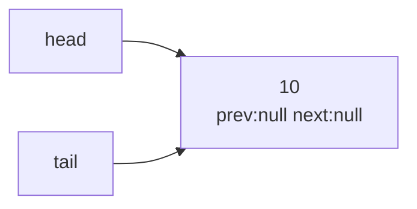
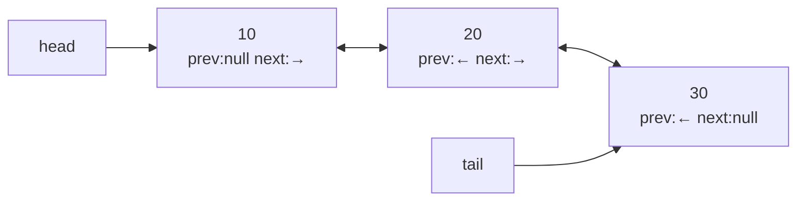
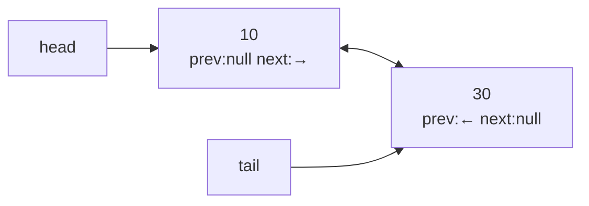

# Doubly Linked List — Step by Step

> A visual study guide to node links, traversal, deletion, and Java's `LinkedList` implementation.

> **Preview tip:** Open this page in **Markdown Preview** (`Ctrl+Shift+V`) to follow each linked-list diagram.

<!-- TOC -->
- [Doubly Linked List — Step by Step](#doubly-linked-list--step-by-step)
  - [What is a Doubly Linked List](#what-is-a-doubly-linked-list)
  - [Structure](#structure)
  - [Step-by-Step Example: Building the list [10, 20, 30]](#step-by-step-example-building-the-list-10-20-30)
    - [Step 1 — Insert 10 (empty list)](#step-1--insert-10-empty-list)
    - [Step 2 — Insert 20 at the end](#step-2--insert-20-at-the-end)
    - [Step 3 — Insert 30 at the end](#step-3--insert-30-at-the-end)
    - [Step 4 — Traverse forward](#step-4--traverse-forward)
    - [Step 5 — Traverse backward](#step-5--traverse-backward)
    - [Step 6 — Delete the middle node (20)](#step-6--delete-the-middle-node-20)
  - [Time Complexity Summary](#time-complexity-summary)
  - [Java's `LinkedList` as a Doubly Linked List](#javas-linkedlist-as-a-doubly-linked-list)
<!-- /TOC -->

## What is a Doubly Linked List

A doubly linked list is a linear data structure made up of **nodes**, where each node stores:

1. `data` — the value held by the node
2. `next` — a reference to the following node
3. `prev` — a reference to the preceding node

Unlike a singly linked list (only `next`), the `prev` reference lets you traverse the list in both directions — forward and backward — without needing to restart from the head.



## Structure



- `head` points to the first node (its `prev` is `null`).
- `tail` points to the last node (its `next` is `null`).
- Each internal node links to both its neighbors, forming a two-way chain.

## Step-by-Step Example: Building the list [10, 20, 30]

### Step 1 — Insert 10 (empty list)



- Create `Node(10)`.
- Since the list is empty, `head` and `tail` both point to this node.
- `prev` and `next` of this node are `null`.

### Step 2 — Insert 20 at the end


- Create `Node(20)`.
- Old tail (`10`).`next` = `Node(20)`.
- `Node(20)`.`prev` = old tail (`10`).
- `tail` is updated to point to `Node(20)`.

### Step 3 — Insert 30 at the end



- Create `Node(30)`.
- Old tail (`20`).`next` = `Node(30)`.
- `Node(30)`.`prev` = old tail (`20`).
- `tail` is updated to point to `Node(30)`.

### Step 4 — Traverse forward

Start at `head`, follow `next` until it becomes `null`:

```
10 -> 20 -> 30 -> null
```

### Step 5 — Traverse backward

Start at `tail`, follow `prev` until it becomes `null`:

```
30 -> 20 -> 10 -> null
```

### Step 6 — Delete the middle node (20)



To remove `Node(20)`:

1. `Node(20).prev.next = Node(20).next` → `10.next = 30`
2. `Node(20).next.prev = Node(20).prev` → `30.prev = 10`
3. `Node(20)` is now unreferenced and eligible for garbage collection.

This is the key advantage of a doubly linked list: deleting a known node takes **O(1)** time because both neighbors are directly reachable, no traversal needed to find the previous node (unlike a singly linked list).

## Time Complexity Summary

| Operation                     | Complexity |
| ----------------------------- | ---------- |
| Access by index               | O(n)       |
| Insert/remove at head or tail | O(1)       |
| Insert/remove at a known node | O(1)       |
| Search by value               | O(n)       |

## Java's `LinkedList` as a Doubly Linked List

`java.util.LinkedList` is a ready-made doubly linked list implementation of `List` and `Deque`.

```java
package com.collections.list;

import java.util.LinkedList;
import java.util.Iterator;
import java.util.ListIterator;

public class internalProcessOfLinkedList {

    public void demonstrateDoublyLinkedList() {
        LinkedList<Integer> list = new LinkedList<>();

        // Step 1-3: insert at the end
        list.addLast(10);
        list.addLast(20);
        list.addLast(30);
        System.out.println("List: " + list);

        // Step 4: traverse forward
        Iterator<Integer> forward = list.iterator();
        System.out.print("Forward: ");
        while (forward.hasNext()) {
            System.out.print(forward.next() + " ");
        }
        System.out.println();

        // Step 5: traverse backward using ListIterator
        ListIterator<Integer> backward = list.listIterator(list.size());
        System.out.print("Backward: ");
        while (backward.hasPrevious()) {
            System.out.print(backward.previous() + " ");
        }
        System.out.println();

        // Step 6: delete the middle node (value 20)
        list.remove(Integer.valueOf(20));
        System.out.println("After removing 20: " + list);
    }

    public static void main(String[] args) {
        new internalProcessOfLinkedList().demonstrateDoublyLinkedList();
    }
}
```

**Expected output:**

```text
List: [10, 20, 30]
Forward: 10 20 30 
Backward: 30 20 10 
After removing 20: [10, 30]
```
