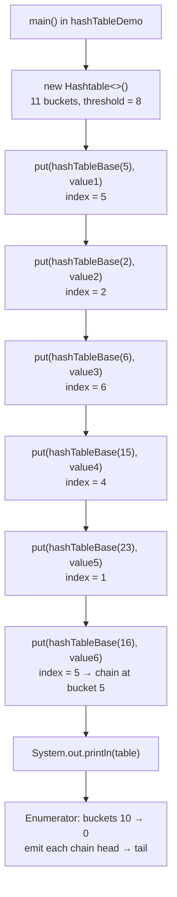
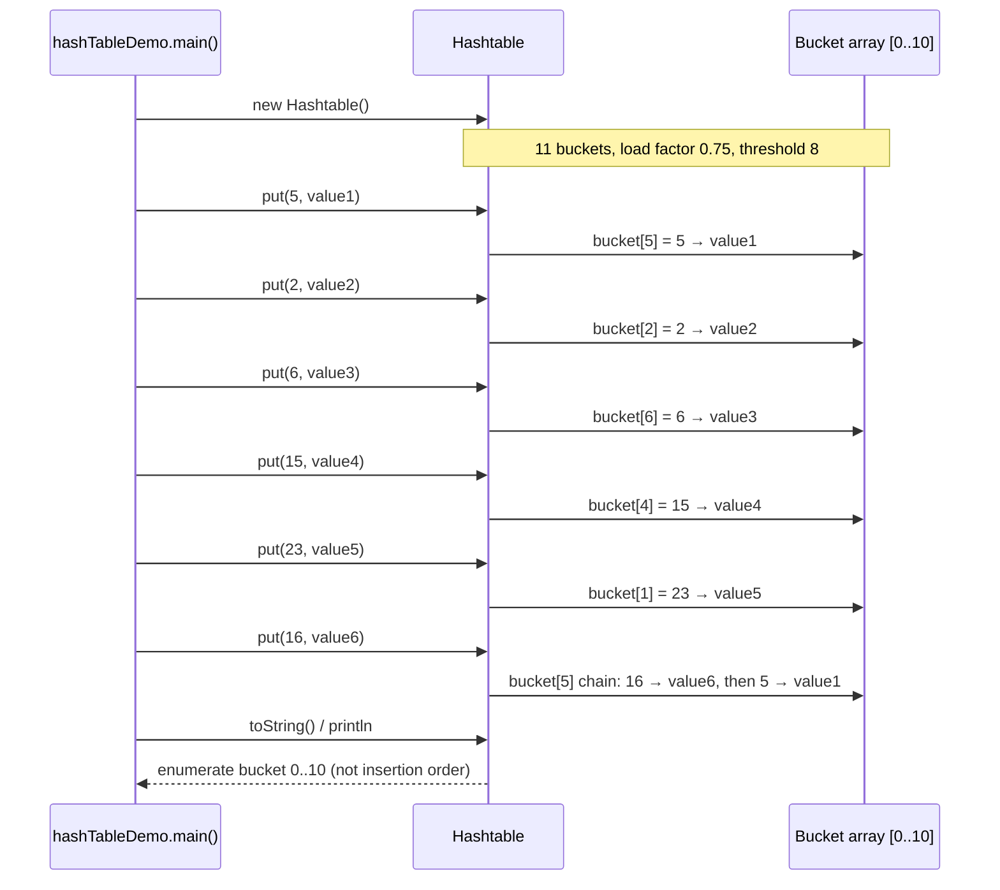
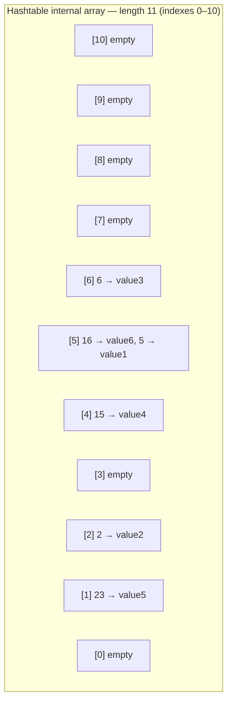
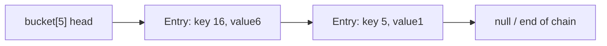
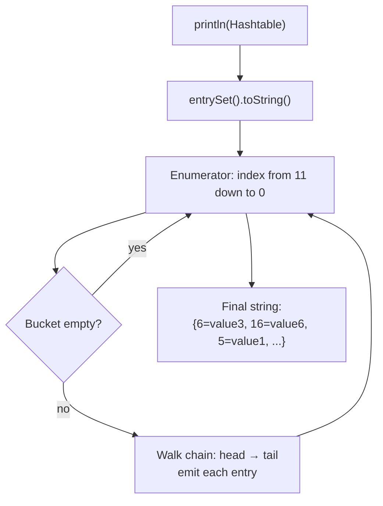

# Hashtable (`hashTable` package)

> Bucket flow for `hashTableDemo.java` — moved from the monolithic guide (not duplicated).
>
> [← Back to Java Collections Guide](collections.md)

---

**Related code:** [`hashTable/basicflow/hashTableDemo.java`](../../../demo/src/main/java/com/collection/hashTable/basicflow/hashTableDemo.java) (this document), [`map/hashTable.java`](../../../demo/src/main/java/com/collection/map/hashTable.java) (runs `mapDemo` for Hashtable).

## Hashtable — complete execution flow (`hashTableDemo.java`)

This section follows the runnable demo that shows **how many buckets exist**, **where each entry lands**, and **why `println` order is not insertion order**.

### Source files

| File                                                                                                     | Role                                                                                                         |
| -------------------------------------------------------------------------------------------------------- | ------------------------------------------------------------------------------------------------------------ |
| [hashTableDemo.java](../../../demo/src/main/java/com/collection/hashTable/basicflow/hashTableDemo.java) | Creates a `Hashtable`, inserts six keys, prints the table                                                    |
| [hashTableBase.java](../../../demo/src/main/java/com/collection/hashTable/basicflow/hashTableBase.java) | Key type: stores `int i`, overrides `hashCode()` to return `i`, overrides `toString()` to return `i` as text |
| [hashTable.java](../../../demo/src/main/java/com/collection/map/hashTable.java)                         | Optional entry point that runs the broader `Hashtable` map demo via `mapDemo`                                |

`hashTableDemo` uses **custom keys** so bucket indices are predictable. In real code, `hashCode()` is rarely equal to a small integer, but the **bucket formula is the same**.

### Default bucket table and load factor

For `new Hashtable<>()` (no-arg constructor), the JDK uses:

| Setting               | Default value | Meaning in this demo                                       |
| --------------------- | ------------- | ---------------------------------------------------------- |
| **Number of buckets** | **11**        | Internal array length; valid bucket indexes are **0 … 10** |
| **Load factor**       | **0.75**      | Rehash when `size` exceeds `capacity × load factor`        |
| **Rehash threshold**  | **8**         | `11 × 0.75 = 8` (integer truncation)                       |

Six `put` operations are performed, so `size = 6` and **no rehash** occurs. The table stays at **11 buckets**.

### How a key picks a bucket

For each `put(key, value)`:

1. Call `key.hashCode()` → for `hashTableBase`, this is the field `i`.
2. Compute `index = (hashCode & 0x7FFFFFFF) % table.length` → with length **11**, this is `i % 11` for non-negative `i`.
3. If the bucket is empty, store the entry there.
4. If the bucket already has entries (**collision**), link the new entry into a **chain** at that bucket (separate chaining).
5. If `size` exceeds the threshold, **rehash** into a larger bucket array (not triggered in this demo).

| `put` order | Key (`hashTableBase`) | `hashCode()` | `index = hash % 11` | Value                            |
| ----------- | --------------------- | ------------ | ------------------- | -------------------------------- |
| 1           | `5`                   | 5            | **5**               | `value1`                         |
| 2           | `2`                   | 2            | **2**               | `value2`                         |
| 3           | `6`                   | 6            | **6**               | `value3`                         |
| 4           | `15`                  | 15           | **4**               | `value4`                         |
| 5           | `23`                  | 23           | **1**               | `value5`                         |
| 6           | `16`                  | 16           | **5**               | `value6` (collides with key `5`) |

> `Hashtable` does **not** allow `null` keys or `null` values. The commented line `table.put("durga", null)` would throw `NullPointerException`.

### End-to-end execution flow





### Bucket allocation after all `put` calls

Logical view of the **11 buckets** (only **6** hold data; **5** are empty). See [Whiteboard view of the 11 buckets](#whiteboard-view-of-the-11-buckets) for the same layout as a classroom diagram.

| Bucket index | Contents (head → tail of chain) | Notes                                  |
| ------------ | ------------------------------- | -------------------------------------- |
| 0            | —                               | empty                                  |
| 1            | `23=value5`                     |                                        |
| 2            | `2=value2`                      |                                        |
| 3            | —                               | empty                                  |
| 4            | `15=value4`                     |                                        |
| 5            | `16=value6` → `5=value1`        | **collision**; two keys share bucket 5 |
| 6            | `6=value3`                      |                                        |
| 7–10         | —                               | empty                                  |

### Whiteboard view of the 11 buckets

The diagram below matches the usual classroom sketch: a **vertical array of 11 slots** (indexes **0** at the bottom through **10** at the top), each `put` landing at `hashCode % 11`, with **bucket 5** holding two entries after a collision.


The whiteboard uses a `Temp` key (`hashCode()` returns `i`) and values **A–F**. This repo’s [hashTableDemo.java](../../../demo/src/main/java/com/collection/hashTable/basicflow/hashTableDemo.java) is the same logic with [hashTableBase](../../../demo/src/main/java/com/collection/hashTable/basicflow/hashTableBase.java) keys and `value1`–`value6`:

| Classroom (`Temp` + letter) | This demo (`hashTableBase` + value)    | `hash % 11` → bucket                         |
| --------------------------- | -------------------------------------- | -------------------------------------------- |
| `put(new Temp(5), "A")`     | `put(new hashTableBase(5), "value1")`  | **5**                                        |
| `put(new Temp(2), "B")`     | `put(new hashTableBase(2), "value2")`  | **2**                                        |
| `put(new Temp(6), "C")`     | `put(new hashTableBase(6), "value3")`  | **6**                                        |
| `put(new Temp(15), "D")`    | `put(new hashTableBase(15), "value4")` | **4** (`15 % 11 = 4`)                        |
| `put(new Temp(23), "E")`    | `put(new hashTableBase(23), "value5")` | **1** (`23 % 11 = 1`)                        |
| `put(new Temp(16), "F")`    | `put(new hashTableBase(16), "value6")` | **5** (`16 % 11 = 5`, collides with key `5`) |

**ASCII bucket table** (same layout as the photo: index on the left, entries inside the array):

```text
 index │  entries in this bucket (after all six put operations)
───────┼──────────────────────────────────────────────────────────
  10   │
   9   │
   8   │
   7   │
   6   │  6=value3          (classroom: 6=C)
   5   │  5=value1, 16=value6   ← collision (classroom: 5=A, 16=F)   16%11=5
   4   │  15=value4         (classroom: 15=D)                      15%11=4
   3   │
   2   │  2=value2          (classroom: 2=B)
   1   │  23=value5         (classroom: 23=E)                      23%11=1
   0   │
```

**How `println` scans this picture**

- **Top → bottom:** bucket indexes from **10 down to 0** (skip empty slots).
- **Within a bucket (collision chain):** walk from **chain head → tail**. For bucket **5**, the head is key **16** (`value6` / **F**), then key **5** (`value1` / **A**). That is why output shows `16=…` before `5=…`, not the order you called `put`.

Partial `System.out.println(h)` on the whiteboard: `{6=C, 16=F, 5=A, …}` — same traversal as this demo’s `{6=value3, 16=value6, 5=value1, …}`.



### Collision chaining at bucket 5

Keys **5** and **16** both map to bucket **5** because `5 % 11 = 5` and `16 % 11 = 5`.



When `get(16)` or `get(5)` runs, `Hashtable` walks the chain at bucket 5 and compares keys with `equals()` (and hash). Here keys are distinct objects, so both entries remain reachable.

### How `println` walks the table

`System.out.println(table)` uses the map's `entrySet()` iterator. It does **not** print in insertion order.

In the JDK `Hashtable` implementation, the internal enumerator walks bucket indexes from **high to low** (`table.length` down to `0`). At each non-empty bucket it walks the collision chain from **head to tail**.

For this demo, that produces this print order:

| Step | Bucket scanned | Entries emitted              |
| ---- | -------------- | ---------------------------- |
| 1    | 6              | `6=value3`                   |
| 2    | 5              | `16=value6`, then `5=value1` |
| 3    | 4              | `15=value4`                  |
| 4    | 2              | `2=value2`                   |
| 5    | 1              | `23=value5`                  |

Buckets **0**, **3**, and **7–10** are empty and are skipped.



> **Takeaway:** insertion order was `5 → 2 → 6 → 15 → 23 → 16`, but the printed order follows **internal bucket traversal**, not the order you called `put`.

### Verified program output

```text
Hashtable: {6=value3, 16=value6, 5=value1, 15=value4, 2=value2, 23=value5}
```

This matches the bucket walk described above. The line is **not** sorted by key and **not** insertion order.

### Run the demo

From the `demo` module:

```bash
cd demo
javac -d target/classes -sourcepath src/main/java \
  src/main/java/com/collection/hashTable/basicflow/hashTableBase.java \
  src/main/java/com/collection/hashTable/basicflow/hashTableDemo.java
java -cp target/classes com.collection.hashTable.basicflow.hashTableDemo
```

For the broader `Hashtable` map API demo (constructors, load factor, iterators), run:

```bash
java -cp target/classes com.collection.map.hashTable
```


---


