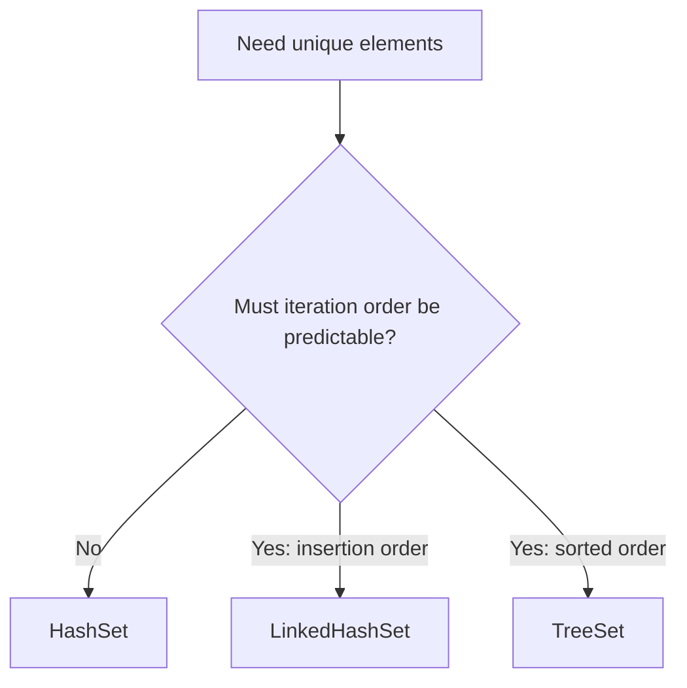

# HashSet vs LinkedHashSet — Quick Comparison

Use this page as a fast reference when deciding between Java's two common hash-based `Set` implementations.

> **One-line answer:** choose `HashSet` when element order does not matter; choose `LinkedHashSet` when you need the elements to be returned in the order they were inserted.

## Quick choice

| If you need...                                      | Choose           | Why                                                   |
| --------------------------------------------------- | ---------------- | ----------------------------------------------------- |
| Unique elements and the smallest practical overhead | `HashSet`        | It does not maintain insertion-order links.           |
| Unique elements in a predictable order              | `LinkedHashSet`  | It preserves insertion order during iteration.        |
| Unique elements in sorted order                     | `TreeSet`        | Neither `HashSet` nor `LinkedHashSet` sorts elements. |
| A set suitable for concurrent updates               | A concurrent set | Neither `HashSet` nor `LinkedHashSet` is thread-safe. |



## Side-by-side differences

| Topic                                             | `HashSet<E>`                                                                         | `LinkedHashSet<E>`                                                                                                                  |
| ------------------------------------------------- | ------------------------------------------------------------------------------------ | ----------------------------------------------------------------------------------------------------------------------------------- |
| **Order**                                         | No iteration-order guarantee.                                                        | Preserves insertion order.                                                                                                          |
| **Internal design**                               | Hash table, backed by `HashMap` in current JDK implementations.                      | Hash table plus a linked chain between entries, backed by `LinkedHashMap` in current JDK implementations.                           |
| **Adding an existing element**                    | The element remains; `add()` returns `false`.                                        | Same result; the existing element keeps its original position.                                                                      |
| **Sorted?**                                       | No.                                                                                  | No.                                                                                                                                 |
| **`Iterator`, `forEach`, stream encounter order** | Unspecified. Do not write code that depends on it.                                   | Insertion order.                                                                                                                    |
| **Java 21 sequenced methods**                     | Does not implement `SequencedSet`.                                                   | Implements `SequencedSet`: `addFirst()`, `addLast()`, `getFirst()`, `getLast()`, `removeFirst()`, `removeLast()`, and `reversed()`. |
| **`add`, `contains`, `remove`**                   | $O(1)$ average time.                                                                 | $O(1)$ average time; link maintenance adds a small constant cost.                                                                   |
| **Iteration**                                     | Usually $O(\text{size} + \text{capacity})$. Empty hash-table buckets can be visited. | $O(\text{size})$. Iteration follows entry links.                                                                                    |
| **Memory**                                        | Lower overhead per entry.                                                            | Higher overhead per entry because it stores links to neighboring entries.                                                           |
| **Best for**                                      | Membership testing, removing duplicates, and unordered data.                         | Stable output, stable tests, logs, UI display order, and removing duplicates while retaining input order.                           |

## What both classes have in common

| Property                 | Behavior in both                                                                                             |
| ------------------------ | ------------------------------------------------------------------------------------------------------------ |
| Duplicates               | Not allowed. `add(value)` returns `false` when an equal value already exists.                                |
| Duplicate rule           | Uses `hashCode()` and `equals()`. Custom element classes must implement them correctly and consistently.     |
| `null`                   | One `null` element is allowed.                                                                               |
| Default initial capacity | `16` buckets.                                                                                                |
| Default load factor      | `0.75`; the first resize threshold is $16 \times 0.75 = 12$.                                                 |
| Constructors             | No-argument, initial-capacity, capacity-and-load-factor, and collection-copy constructors.                   |
| Thread safety            | Not synchronized and not safe for concurrent structural modification without coordination.                   |
| Iterators                | Fail-fast on a best-effort basis. Modify during iteration only through `Iterator.remove()`.                  |
| Interfaces               | Implement `Set`, `Cloneable`, and `Serializable`; neither implements `RandomAccess`.                         |
| Equality                 | Set equality ignores order. Sets with the same elements compare equal even if their iteration order differs. |

## See the order difference

```java
Set<String> hashSet = new HashSet<>();
hashSet.add("Banana");
hashSet.add("Apple");
hashSet.add("Cherry");
System.out.println(hashSet);       // Order is unspecified.

Set<String> linkedHashSet = new LinkedHashSet<>();
linkedHashSet.add("Banana");
linkedHashSet.add("Apple");
linkedHashSet.add("Cherry");
System.out.println(linkedHashSet); // [Banana, Apple, Cherry]
```

## Practical guidance

1. Start with `HashSet` when no caller needs a stable order.
2. Move to `LinkedHashSet` when the order of input must survive de-duplication.
3. Do **not** use either when the requirement is sorting; use `TreeSet` or sort a copied collection instead.
4. Size either set appropriately when the expected number of elements is known, which reduces rehashing.

> **Remember:** `LinkedHashSet` is not a sorted set—it is an insertion-ordered `HashSet` with extra links.
