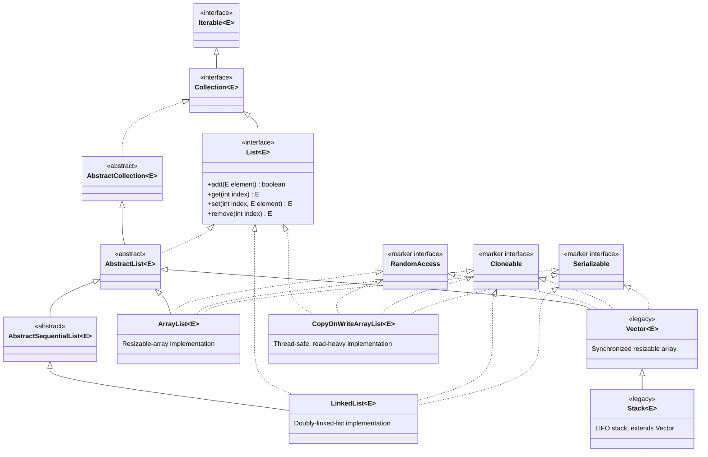
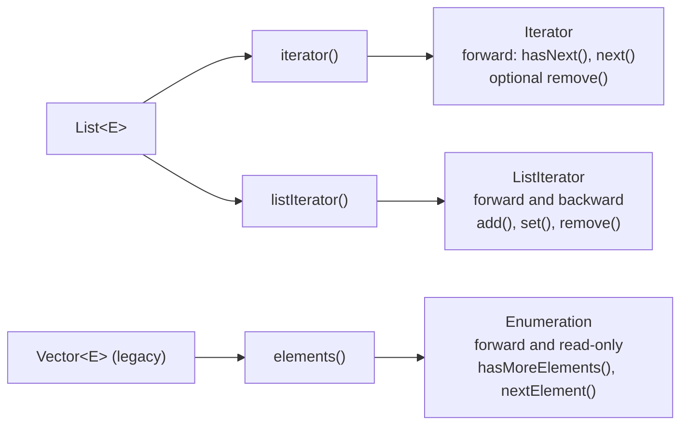
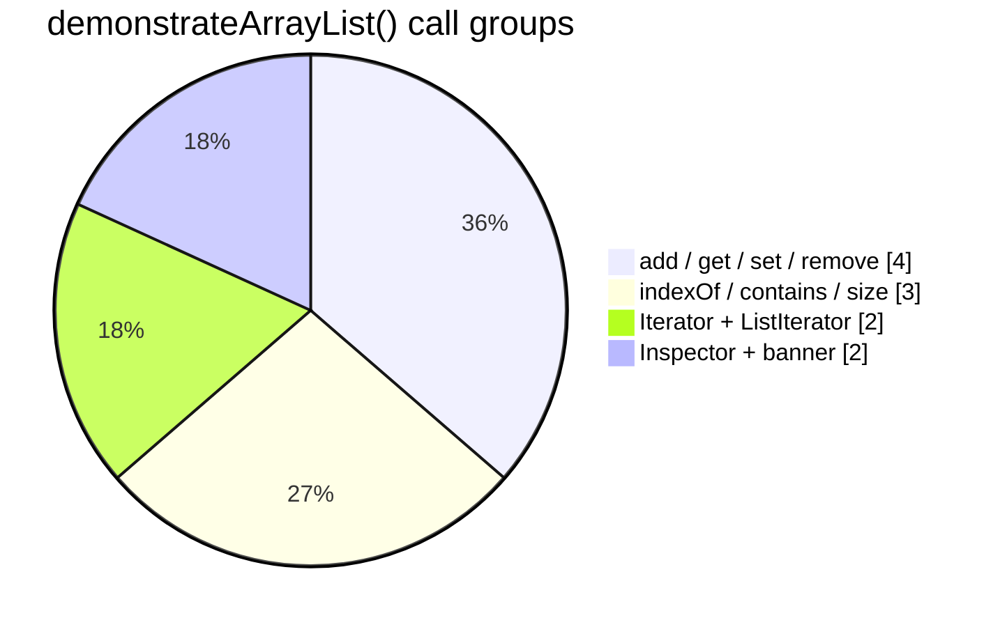

# List (`list` package)

> List hierarchy, methods, cursors; flagship demo: `arrayList.java`.
>
> [← Back to Java Collections Guide](collections.md)

---

## List Interface

It is the child interface of collection, if we want to represent a group of individual objects with as a single entity 
where duplicates are allowed and insertion order must be preserved. Then we should go for List

## List Interface Hierarchy

The following diagram shows the main interfaces, abstract classes, concrete implementations, and legacy classes related to `java.util.List`. A solid arrow means **extends** and a dashed arrow means **implements**.

### ArrayList

`ArrayList` is the best choice for retrieval operations because `ArrayList` implements the `RandomAccess` interface.

`ArrayList` is the worst choice if the frequent operation is insertion and deletion in the middle.

### Difference between ArrayList and Vector

| Topic           | `ArrayList`                                                                                                   | `Vector`                                                                                            |
| --------------- | ------------------------------------------------------------------------------------------------------------- | --------------------------------------------------------------------------------------------------- |
| Synchronization | Every method present in `ArrayList` is non-synchronized.                                                      | Every method present in `Vector` is synchronized.                                                   |
| Thread safety   | At a time, multiple threads are allowed to operate on an `ArrayList` object, and hence it is not thread-safe. | At a time, only one thread is allowed to operate on a `Vector` object, and hence it is thread-safe. |
| Performance     | Relatively high performance because threads are not required to wait to operate on an `ArrayList` object.     | Relatively low performance because threads are required to wait to operate on a `Vector` object.    |
| Version         | Introduced in 1.2 v and it is non-legacy.                                                                     | Introduced in 1.0 v and it is legacy.                                                               |

By default, `ArrayList` is non-synchronized, but we can get a synchronized version of an `ArrayList` object by using the `synchronizedList()` method of the `Collections` class:

```java
public static List synchronizedList(List l)
```

Refer to this example: [synchornizedCollections.java](../../../demo/src/main/java/com/collections/collectionBaseClasses/synchornizedCollections.java) in the collections folder.

```java
ArrayList l = new ArrayList();
List l1 = Collections.synchronizedList(l);
// l is non-synchronized
// l1 is synchronized
```

Similarly, we can get synchronized versions of `Set` and `Map` objects by using the following methods of the `Collections` class:

```java
public static Set synchronizedSet(Set s)
public static Map synchronizedMap(Map m)
```

### LinkedList

- The underlying data structure is a doubly linked list.
- Insertion order is preserved.
- Duplicate objects are allowed.
- Heterogeneous objects are allowed.
- `null` insertion is possible.
- `LinkedList` implements `Serializable` and `Cloneable` interfaces but not `RandomAccess`.
- `LinkedList` is the best choice if the frequent operation is insertion or deletion in the middle.
- `LinkedList` is the worst choice if the frequent operation is retrieval.

#### Constructors

| Constructor                                    | Description                                                         |
| ---------------------------------------------- | ------------------------------------------------------------------- |
| `LinkedList l = new LinkedList();`             | Creates an empty list object.                                       |
| `LinkedList l = new LinkedList(Collection c);` | Creates an equivalent `LinkedList` object for the given collection. |

#### LinkedList class-specific methods

Usually we can use `LinkedList` to develop stacks and queues. To provide support for this requirement, the `LinkedList` class defines the following specific methods:

| Method                    | Description                            |
| ------------------------- | -------------------------------------- |
| `void addFirst(Object o)` | Inserts an element at the beginning.   |
| `void addLast(Object o)`  | Inserts an element at the end.         |
| `Object getFirst()`       | Returns the first element.             |
| `Object getLast()`        | Returns the last element.              |
| `Object removeFirst()`    | Removes and returns the first element. |
| `Object removeLast()`     | Removes and returns the last element.  |

### Difference between ArrayList and LinkedList

| Topic          | `ArrayList`                                                                           | `LinkedList`                                                                                                              |
| -------------- | ------------------------------------------------------------------------------------- | ------------------------------------------------------------------------------------------------------------------------- |
| Data structure | Internally uses a resizable array data structure.                                     | Internally uses a doubly linked list data structure.                                                                      |
| Best for       | Retrieval operations.                                                                 | Insertion or deletion in the middle.                                                                                      |
| Worst for      | Insertion or deletion in the middle because it requires shifting of elements.         | Retrieval because it does not support index-based access; it has to traverse from the beginning or end.                   |
| `RandomAccess` | Implements `RandomAccess`, so any random element can be accessed with the same speed. | Does not implement `RandomAccess`, so random access performance is poor.                                                  |
| Memory usage   | Consumes less memory because it just holds the elements.                              | Consumes more memory because for every element it has to hold data, a previous-node reference, and a next-node reference. |
| Version        | Introduced in 1.2 v and it is non-legacy.                                             | Introduced in 1.2 v and it is non-legacy.                                                                                 |

Refer to this example: [internalProcessOfLinkedList.java](../../../demo/src/main/java/com/collections/list/internalProcessOfLinkedList.java) in the list folder.

                                                
 


### Modern implementations

- **`ArrayList`**: usually the default choice for indexed access and appending elements.
- **`LinkedList`**: also implements `Deque`; useful when frequent insertions/removals occur at the ends of the list.

### Legacy classes

- **`Vector`**: a synchronized, resizable array retained for backward compatibility. Prefer `ArrayList` unless its legacy synchronization behavior is specifically required.
- **`Stack`**: a LIFO stack that extends `Vector`. Prefer `Deque`, for example `ArrayDeque`, for new stack implementations.

> `CopyOnWriteArrayList` is another `List` implementation in `java.util.concurrent`. It is designed for thread-safe, read-heavy situations and does not extend `AbstractList`.

## List Methods

`List<E>` includes the methods inherited from `Collection<E>` and adds index-based operations. In Java 21, `List` also inherits ordered-end operations from `SequencedCollection<E>`. Indexes start at `0`; an index used to **read, replace, or remove** must be from `0` through `size() - 1`, while an index used to **insert** may also be `size()`.

### Index-based List operations

| Method                                        | Definition                                                                                                                                                                                        |
| --------------------------------------------- | ------------------------------------------------------------------------------------------------------------------------------------------------------------------------------------------------- |
| `E get(int index)`                            | Returns the element at `index`.                                                                                                                                                                   |
| `E set(int index, E element)`                 | Replaces the element at `index` and returns the element that was replaced.                                                                                                                        |
| `void add(int index, E element)`              | Inserts an element before the current element at `index`. Existing elements at and after that position shift right.                                                                               |
| `boolean add(E element)`                      | Appends an element to the end of the list and returns `true` if it changed.                                                                                                                       |
| `E remove(int index)`                         | Removes and returns the element at `index`. Remaining elements shift left.                                                                                                                        |
| `boolean remove(Object value)`                | Removes the first occurrence equal to `value`; returns whether an element was removed.                                                                                                            |
| `int indexOf(Object value)`                   | Returns the index of the first matching value, or `-1` when absent.                                                                                                                               |
| `int lastIndexOf(Object value)`               | Returns the index of the last matching value, or `-1` when absent.                                                                                                                                |
| `List<E> subList(int fromIndex, int toIndex)` | Returns a backed view containing positions `fromIndex` (inclusive) through `toIndex` (exclusive). Structural changes to the original list outside that view make later view operations undefined. |
| `ListIterator<E> listIterator()`              | Returns a bidirectional cursor positioned before index `0`.                                                                                                                                       |
| `ListIterator<E> listIterator(int index)`     | Returns a bidirectional cursor positioned before the specified `index`.                                                                                                                           |
| `void replaceAll(UnaryOperator<E> operator)`  | Replaces every element with the result of applying `operator`; a default method.                                                                                                                  |
| `void sort(Comparator<? super E> comparator)` | Sorts the list in place. Passing `null` uses natural ordering; a default method.                                                                                                                  |

### `Collection` operations available on every List

| Method                                                      | Definition                                                              |
| ----------------------------------------------------------- | ----------------------------------------------------------------------- |
| `int size()`                                                | Returns the number of elements.                                         |
| `boolean isEmpty()`                                         | Returns `true` when `size()` is `0`.                                    |
| `boolean contains(Object value)`                            | Tests whether a matching value is present.                              |
| `Iterator<E> iterator()`                                    | Returns the standard forward-only cursor.                               |
| `Object[] toArray()`                                        | Copies list elements into a new `Object[]`.                             |
| `<T> T[] toArray(T[] array)`                                | Copies elements into a compatible array, reusing it when large enough.  |
| `boolean addAll(Collection<? extends E> values)`            | Appends all values from a collection; returns whether the list changed. |
| `boolean addAll(int index, Collection<? extends E> values)` | Inserts all values before `index`; this overload is declared by `List`. |
| `boolean containsAll(Collection<?> values)`                 | Tests whether every supplied value is present.                          |
| `boolean removeAll(Collection<?> values)`                   | Removes every element that also occurs in `values`.                     |
| `boolean retainAll(Collection<?> values)`                   | Keeps only elements that occur in `values`.                             |
| `void clear()`                                              | Removes all elements.                                                   |
| `boolean removeIf(Predicate<? super E> filter)`             | Removes elements matching the predicate; a default method.              |
| `Spliterator<E> spliterator()`                              | Returns a spliterator for sequential or parallel traversal.             |
| `Stream<E> stream()`                                        | Returns a sequential stream of the elements.                            |
| `Stream<E> parallelStream()`                                | Returns a parallel stream of the elements.                              |
| `boolean equals(Object other)`                              | Tests list equality: same size and equal elements in the same order.    |
| `int hashCode()`                                            | Returns the hash code defined consistently with `equals()`.             |

### Java 21 ordered-end methods

These methods are inherited from `SequencedCollection<E>`, which `List<E>` extends in Java 21.

| Method                     | Definition                                                           |
| -------------------------- | -------------------------------------------------------------------- |
| `E getFirst()`             | Returns the first element; throws `NoSuchElementException` if empty. |
| `E getLast()`              | Returns the last element; throws `NoSuchElementException` if empty.  |
| `void addFirst(E element)` | Inserts an element at index `0`.                                     |
| `void addLast(E element)`  | Appends an element at the end.                                       |
| `E removeFirst()`          | Removes and returns the first element.                               |
| `E removeLast()`           | Removes and returns the last element.                                |
| `List<E> reversed()`       | Returns a reverse-ordered view backed by the original list.          |

### Static factory methods

| Method                                        | Definition                                                                                          |
| --------------------------------------------- | --------------------------------------------------------------------------------------------------- |
| `List.of()`                                   | Creates an unmodifiable list. Overloads accept zero or more elements; `null` elements are rejected. |
| `List.copyOf(Collection<? extends E> values)` | Creates an unmodifiable list containing the supplied values; `null` elements are rejected.          |

> Methods that modify a list can throw `UnsupportedOperationException` for an unmodifiable or fixed-size list, such as a list made with `List.of(...)` or `Arrays.asList(...)`.

## List Cursors

A **cursor** moves through a collection and reads, and sometimes modifies, its elements. Java provides `Iterator` for all collections, `ListIterator` specifically for lists, and the legacy `Enumeration` cursor for `Vector`.

For complete runnable examples, use the Ctrl+clickable section links: [`Iterator<E>`](cursors.md#1-iteratore), [`ListIterator<E>`](cursors.md#2-listiteratore), [`Enumeration<E>`](cursors.md#3-enumeratione), and [`Spliterator<E>`](cursors.md#4-spliteratore). The complete guide is [Cursors in Java Collections](cursors.md), and the source is [cursors.java](../../../demo/src/main/java/com/collections/cursors.java).

| Cursor            | Obtained from         | Direction            | Can modify?                      | Definition                                                                      |
| ----------------- | --------------------- | -------------------- | -------------------------------- | ------------------------------------------------------------------------------- |
| `Iterator<E>`     | `list.iterator()`     | Forward only         | `remove()` only                  | Standard cursor available for every `Collection`.                               |
| `ListIterator<E>` | `list.listIterator()` | Forward and backward | `add()`, `set()`, and `remove()` | List-specific cursor that knows its position.                                   |
| `Enumeration<E>`  | `vector.elements()`   | Forward only         | No                               | Legacy read-only cursor for `Vector` and older APIs; it is not a `List` method. |

### `Iterator<E>` methods

| Method                                              | Definition                                                                                                     |
| --------------------------------------------------- | -------------------------------------------------------------------------------------------------------------- |
| `boolean hasNext()`                                 | Returns whether another element exists in the forward direction.                                               |
| `E next()`                                          | Returns the next element and advances the cursor. Throws `NoSuchElementException` if there is no next element. |
| `void remove()`                                     | Removes the last element returned by `next()`. It can be called only once per successful `next()` call.        |
| `void forEachRemaining(Consumer<? super E> action)` | Applies `action` to all remaining elements; a default method.                                                  |

### `ListIterator<E>` additional methods

`ListIterator` inherits every `Iterator` method and adds the following operations.

| Method                  | Definition                                                                              |
| ----------------------- | --------------------------------------------------------------------------------------- |
| `boolean hasPrevious()` | Returns whether an element exists in the backward direction.                            |
| `E previous()`          | Returns the previous element and moves the cursor backward.                             |
| `int nextIndex()`       | Returns the index that a following `next()` would return.                               |
| `int previousIndex()`   | Returns the index that a following `previous()` would return, or `-1` at the beginning. |
| `void add(E element)`   | Inserts an element at the cursor position.                                              |
| `void set(E element)`   | Replaces the last element returned by `next()` or `previous()`.                         |
| `void remove()`         | Removes the last element returned by `next()` or `previous()`.                          |

### Legacy `Enumeration<E>` methods

| Method                      | Definition                                                                 |
| --------------------------- | -------------------------------------------------------------------------- |
| `boolean hasMoreElements()` | Returns whether another element is available.                              |
| `E nextElement()`           | Returns the next element. Throws `NoSuchElementException` if none remains. |



> Do not structurally modify a normal list directly while iterating over it. Use `Iterator.remove()` or `ListIterator` methods instead; otherwise a fail-fast iterator commonly throws `ConcurrentModificationException`.

---

## Vector 

1. The underlying data structure is resizeble or growable array 
2. Insertion order is preserved 
3. Duplicates are allowed.
4. Heterogeneous objects are allowed
5. null insertion is possible 
6. It implements Serializable ,Cloneable and RandomAccess interfaces
7. Every method present in the vector is synchronized and hence vector object is thread safe

Constructors

>Vector v = new Vector();

>Vector v = new Vector(int initialCapacity);

Creates an empty vector object with specified initial capacity 

>Vector v = new Vector(int initialCapacity, int incrementalCapacity);

>Vector v = new Vector(Collection c);

Creates an equivalent vector Object for the given collection this constructor meant for interconvertion between
collection objects

---


---

## List constructor examples

```java
new ArrayList<>();
new ArrayList<>(20);
new ArrayList<>(collection);

new LinkedList<>();
new LinkedList<>(collection);

new Vector<>();
new Vector<>(20);
new Vector<>(20, 5);
new Vector<>(collection);


```
---

## Stack 

It is the child class of vector , it is a specially designed class for last in firsat out order(LIFO) 

Constructor 

Stack s = new Stack<>();


`Stack` has only its no-argument constructor. It inherits the vector-based storage behavior from `Vector`.


---

## ArrayList — complete execution flow (`arrayList.java`)

[`arrayList.java`](../../../demo/src/main/java/com/collections/list/arrayList.java) extends [`listDemo`](../../../demo/src/main/java/com/collections/list/listDemo.java) and runs **`demonstrateList("ArrayList")`** plus **`printDefaultCapacitySummary("ArrayList")`**.

The core logic lives in **`listDemo.demonstrateArrayList()`** (not duplicated here in full — see [List Methods](#list-methods) and [List Cursors](#list-cursors) above).

### Launcher flow

```mermaid
flowchart TD
  M["arrayList.main"] --> D["demonstrateList(\"ArrayList\")"]
  D --> T1["listCollectionType → demonstrateArrayList()"]
  D --> T2["listConstructors → demonstrateArrayListConstructors()"]
  M --> S["printDefaultCapacitySummary(\"ArrayList\")"]
```



| Step | Method in `demonstrateArrayList()` | Notes |
| ---- | ----------------------------------- | ----- |
| 1 | `printTypeInfo(ArrayList, List)` | Class vs interface |
| 2 | `new ArrayList<>()` + `add` / `add(1, "Sita")` | Insertion order; indexed insert shifts $O(n)$ |
| 3 | `get`, `set`, `indexOf`, `contains`, `size` | Random access $O(1)$ |
| 4 | `remove("Sita")` | Search + shift |
| 5 | `iterator()` | Forward-only cursor |
| 6 | `listIterator()` | Forward then backward |

### Run

```bash
cd demo && mvn -q exec:java -Dexec.mainClass=com.collections.list.arrayList
```
