# Map (`map` package)

> Map hierarchy, views, **NavigableMap** / `navigableMap.java`, and `mapDemo` launchers.
>
> [← Back to Java Collections Guide](collections.md)

---

### `map` folder launchers (all extend `mapDemo`)

| File | `main` runs |
| ---- | ----------- |
| [`hashMap.java`](../../../demo/src/main/java/com/collections/map/hashMap.java) | `demonstrateMap("HashMap")` |
| [`linkedHashMap.java`](../../../demo/src/main/java/com/collections/map/linkedHashMap.java) | `demonstrateMap("LinkedHashMap")` |
| [`treeMap.java`](../../../demo/src/main/java/com/collections/map/treeMap.java) | `demonstrateMap("TreeMap")` |
| [`sortedMap.java`](../../../demo/src/main/java/com/collections/map/sortedMap.java) | `demonstrateMap("SortedMap")` |
| [`navigableMap.java`](../../../demo/src/main/java/com/collections/map/navigableMap.java) | `demonstrateMap("NavigableMap")` — **full walkthrough below** |
| [`hashTable.java`](../../../demo/src/main/java/com/collections/map/hashTable.java) | Hashtable via `mapDemo` (see also [Hashtable bucket demo](hashTable.md)) |

Shared implementation: [`mapDemo.java`](../../../demo/src/main/java/com/collections/map/mapDemo.java) (`mapCollectionType`, `mapConstructors`, …).

## Map constructor examples

```java
new HashMap<>();
new HashMap<>(20);
new HashMap<>(20, 0.80f);
new HashMap<>(map);

new LinkedHashMap<>();
new LinkedHashMap<>(20);
new LinkedHashMap<>(20, 0.80f);
new LinkedHashMap<>(20, 0.80f, true); // access-order mode
new LinkedHashMap<>(map);

new TreeMap<>();
new TreeMap<>(Comparator.reverseOrder());
new TreeMap<>(map);
new TreeMap<>(sortedMap);

new Hashtable<>();
new Hashtable<>(20);
new Hashtable<>(20, 0.80f);
new Hashtable<>(map);
```

The integer argument controls initial capacity, the `float` argument controls load factor, and the collection/map argument copies entries from an existing object.

---

---

## Map (I)

Map is not child interface of Collection (I) , if we want to represent a group objects as Key Value pairs 
then we should go for map.Duplicate Keys are not allowed but Values can be duplicated.

## Map Interface Hierarchy


- [Map constructors — `mapConstructors(String)`](../../../demo/src/main/java/com/collections/map/mapDemo.java)
- 
`Map` is separate from `Collection`: it stores a mapping from each unique key to one value. A solid arrow means **extends** and a dashed arrow means **implements**.

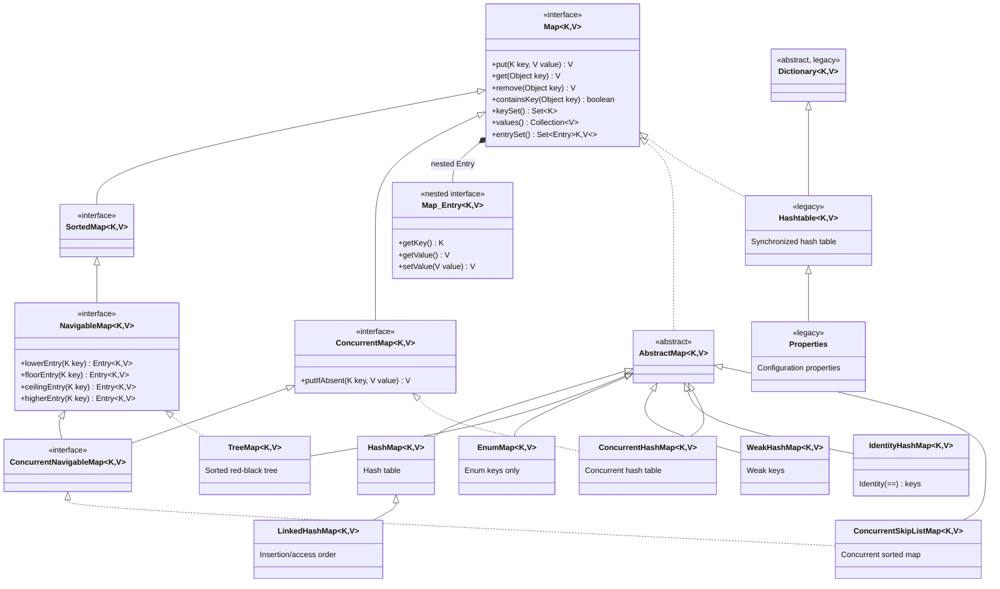

### Interfaces

- **`Map<K, V>`**: base key-value interface.
- **`Map.Entry<K, V>`**: nested interface representing one key-value pair, normally accessed through `entrySet()`.
- **`SortedMap<K, V>`**: map whose keys remain sorted.
- It is the child interface of Map interface if we want to represent a group of Key value pairs according to some        - sorting of Keys then we should go for SortedMap
- In SortedMap the sorting should be based on Key but not based on Value.
- **`NavigableMap<K, V>`**: sorted map with closest-match operations such as `lowerEntry()` and `ceilingEntry()`.
- It is the child interface of SortedMap it defines several methods for navigation purposes its implementation class is 
- TreeMap
- **`ConcurrentMap<K, V>`**: map with atomic concurrent operations such as `putIfAbsent()`.
- **`ConcurrentNavigableMap<K, V>`**: concurrent map with sorted-key navigation.

### Classes

- **`AbstractMap`**: skeletal base class that reduces work when creating a custom map.
- **`HashMap`**: usual general-purpose map; does not guarantee key iteration order and permits one `null` key.
- **`LinkedHashMap`**: preserves insertion order by default; access order can support LRU-style caches.
- **`TreeMap`**: keeps keys sorted by natural order or a `Comparator`.
- **`EnumMap`**: compact, efficient map when every key belongs to one enum type.
- **`WeakHashMap`**: removes an entry after its key is no longer strongly referenced; useful for metadata caches.
- **`IdentityHashMap`**: compares keys using `==`, not `equals()`; use only when identity comparison is required.
- **`ConcurrentHashMap`**: high-concurrency hash map; does not permit `null` keys or values.
- **`ConcurrentSkipListMap`**: concurrent, sorted `NavigableMap`; does not permit `null` keys or values.
- **`Dictionary`**: legacy abstract predecessor of `Map`.
- **`Hashtable`**: synchronized legacy map. Prefer `ConcurrentHashMap` in new concurrent code.
- **`Properties`**: legacy `Hashtable` subclass for configuration properties; use `getProperty()` and `setProperty()` for string properties.

## Map Collection Views

`Map` itself is not a `Collection`, but it exposes three backed collection views. Changes made through these views update the original map.

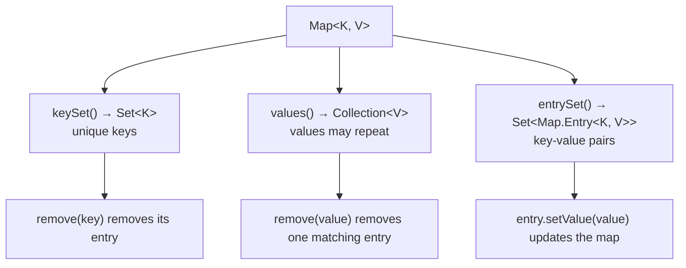

> Adding directly to these views is unsupported because a map needs both a key and a value. Use `map.put(key, value)` to add an entry.

## Choosing a Map Implementation

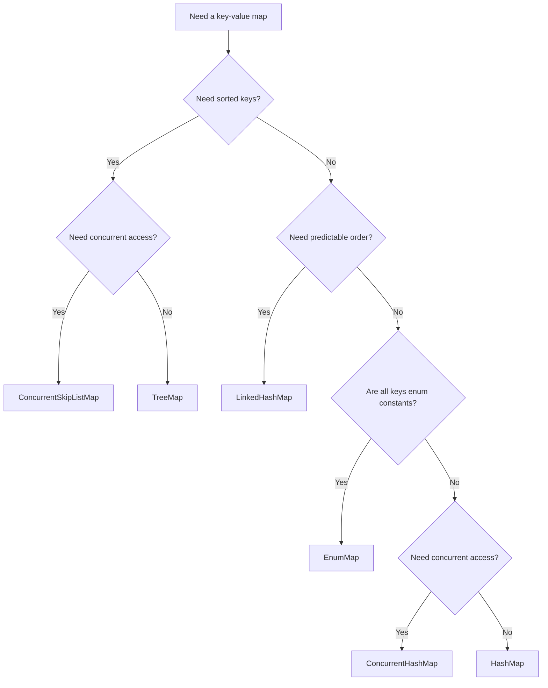

---

## NavigableMap — complete execution flow (`navigableMap.java`)

`NavigableMap<K, V>` extends `SortedMap<K, V>` with **nearest-key navigation** on entries (`lowerEntry`, `floorEntry`, `ceilingEntry`, `higherEntry`), **descending views**, and **inclusive range** `subMap` / `headMap` / `tailMap` overloads. The usual implementation is **`TreeMap`** (red-black tree, $O(\log n)$ per operation).

[`navigableMap.java`](../../../demo/src/main/java/com/collections/map/navigableMap.java) extends [`mapDemo`](../../../demo/src/main/java/com/collections/map/mapDemo.java) and runs the NavigableMap demo from `main`.

### Source files

| File | Role |
| ---- | ---- |
| [navigableMap.java](../../../demo/src/main/java/com/collections/map/navigableMap.java) | `main`: `demonstrateMap("NavigableMap")` + map capacity summaries |
| [mapDemo.java](../../../demo/src/main/java/com/collections/map/mapDemo.java) | **`demonstrateNavigableMap()`** and other map demos |
| [treeMap.java](../../../demo/src/main/java/com/collections/map/treeMap.java) | Optional entry point for `TreeMap` only |
| [sortedMap.java](../../../demo/src/main/java/com/collections/map/sortedMap.java) | `SortedMap` demo (`demonstrateSortedMap`) — overlap with range views |

### End-to-end execution flow

```mermaid
flowchart TD
  A["main() in navigableMap"] --> B["demonstrateMap(\"NavigableMap\")"]
  B --> C["mapCollectionType → demonstrateNavigableMap()"]
  B --> D["mapConstructors → see note below"]
  A --> E["printDefaultCapacitySummary(HashMap, LinkedHashMap, TreeMap, Hashtable)"]
  C --> F["new TreeMap; put Ram, Shyam, Geeta"]
  F --> G["get, firstKey, lastKey, remove Geeta"]
  G --> H["ceilingEntry/lowerEntry, subMap, floorKey, floorEntry"]
  H --> I["pollFirstEntry, pollLastEntry, comparator, iterator"]
```

```mermaid
sequenceDiagram
  participant NM as navigableMap.main()
  participant MD as mapDemo
  participant TM as TreeMap
  participant CTI as CollectionTypeInspector

  NM->>MD: demonstrateMap("NavigableMap")
  MD->>MD: mapCollectionType → demonstrateNavigableMap()
  MD->>CTI: printTypeInfo(TreeMap, NavigableMap, SortedMap, Map)
  MD->>TM: put × 3; get; firstKey/lastKey; remove
  MD->>TM: navigation + poll methods
  MD->>MD: mapConstructors("NavigableMap")
  NM->>CTI: printDefaultCapacitySummary (4 map types)
```

Reference — full `demonstrateNavigableMap()` body ([`mapDemo.java`](../../../demo/src/main/java/com/collections/map/mapDemo.java)):

```java
private static void demonstrateNavigableMap() {
    System.out.println("===== NavigableMap (TreeMap) =====");
    CollectionTypeInspector.printTypeInfo(TreeMap.class, NavigableMap.class, SortedMap.class, Map.class);
    CollectionTypeInspector.printDefaultInitialCapacity("TreeMap");
    NavigableMap<String, Integer> map = new TreeMap<>();

    map.put("Ram", 25);
    map.put("Shyam", 30);
    map.put("Geeta", 28);
    System.out.println("After put() (stored in sorted key order): " + map);

    System.out.println("get(\"Shyam\"): " + map.get("Shyam"));
    System.out.println("firstKey(): " + map.firstKey());
    System.out.println("lastKey(): " + map.lastKey());

    map.remove("Geeta");
    System.out.println("After remove(\"Geeta\"): " + map);

    System.out.println("subMap(\"Ram\", \"Shyam\") [to exclusive]: "
            + map.ceilingEntry("Ram").getKey() + " to " + map.lowerEntry("Shyam").getKey());
    System.out.println("subMap(\"Ram\", true, \"Shyam\", true) [both inclusive]: "
            + map.subMap("Ram", true, "Shyam", true));
    System.out.println("headMap(\"Shyam\") [keys < Shyam]: " + map.floorKey("Shyam"));
    System.out.println("tailMap(\"Ram\") [keys >= Ram]: " + map.floorEntry("Ram").getKey());
    System.out.println("floorEntry(\"Ram\"): " + map.pollFirstEntry().getKey());
    System.out.println("ceilingEntry(\"Ram\"): " + map.pollLastEntry().getKey());
    System.out.println("comparator(): " + map.comparator());

    System.out.println("Iterator over entrySet() (sorted order):");
    Iterator<Map.Entry<String, Integer>> iterator = map.entrySet().iterator();
    while (iterator.hasNext()) {
        Map.Entry<String, Integer> entry = iterator.next();
        System.out.println("  " + entry.getKey() + " = " + entry.getValue());
    }
    // ... closing println ...
}
```

---

### `navigableMap.java` — launcher methods

```mermaid
flowchart TD
  M["main(args)"] --> D["demonstrateMap(\"NavigableMap\")"]
  M --> S["printDefaultCapacitySummary(4 map types)"]
  D --> T1["mapCollectionType → demonstrateNavigableMap()"]
  D --> T2["mapConstructors(\"NavigableMap\")"]
```

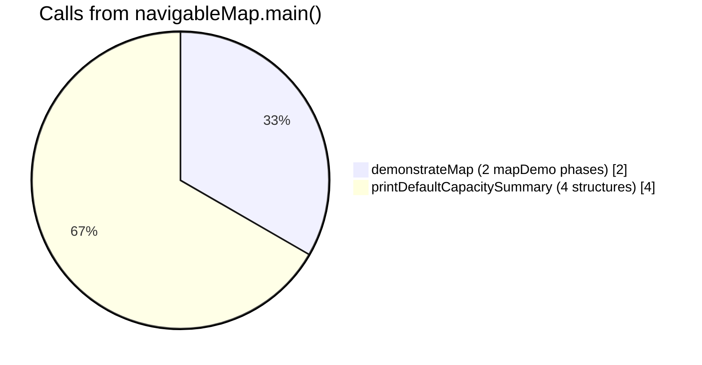

| Method in `navigableMap.java` | What it does |
| ----------------------------- | ------------ |
| **`demonstrateMap(String collectionType)`** | `mapCollectionType` + `mapConstructors`; calls `mapLoadFactor` only for HashMap / LinkedHashMap / Hashtable |
| **`main(String[] args)`** | `demonstrateMap("NavigableMap")` then inspector summaries for **HashMap, LinkedHashMap, TreeMap, Hashtable** |

---

### `demonstrateNavigableMap()` — every statement explained

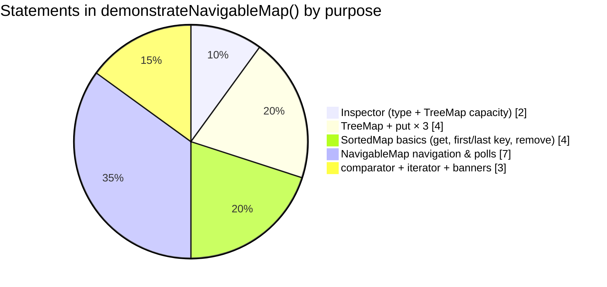

#### Execution order (numbered)

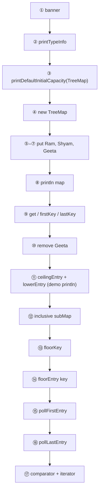

Sorted key order after three `put` calls: **`Geeta` → `Ram` → `Shyam`** (natural `String` order).

| Step | Code | Result / effect |
| ---- | ---- | ----------------- |
| ① | Section `println` | Header: `===== NavigableMap (TreeMap) =====` |
| ② | `printTypeInfo(TreeMap, NavigableMap, SortedMap, Map)` | `TreeMap` = CLASS; others = INTERFACE |
| ③ | `printDefaultInitialCapacity("TreeMap")` | No fixed buckets — **one tree node per entry** |
| ④ | `new TreeMap<>()` | Empty `NavigableMap` implementation |
| ⑤–⑦ | `put("Ram",25)`, `put("Shyam",30)`, `put("Geeta",28)` | `{Geeta=28, Ram=25, Shyam=30}` |
| ⑧ | `println(map)` | Same map string (sorted key order) |
| ⑨ | `get("Shyam")` | `30` |
| ⑨ | `firstKey()` / `lastKey()` | `Geeta` / `Shyam` (`SortedMap`) |
| ⑩ | `remove("Geeta")` | `{Ram=25, Shyam=30}` |
| ⑪ | `ceilingEntry("Ram")` + `lowerEntry("Shyam")` | Prints **`Ram to Ram`** (labels say `subMap` but code uses **entry** navigation APIs) |
| ⑫ | `subMap("Ram", true, "Shyam", true)` | `{Ram=25, Shyam=30}` — **both endpoints inclusive** |
| ⑬ | `floorKey("Shyam")` | `Shyam` (key exists → floor is the key itself) |
| ⑭ | `floorEntry("Ram").getKey()` | `Ram` |
| ⑮ | `pollFirstEntry()` | **Removes** smallest entry; prints key **`Ram`**; map → `{Shyam=30}` |
| ⑯ | `pollLastEntry()` | **Removes** largest entry; prints key **`Shyam`**; map → `{}` |
| ⑰ | `comparator()` | `null` (natural ordering) |
| ⑰ | `entrySet` iterator | **No lines** — map is empty after polls |

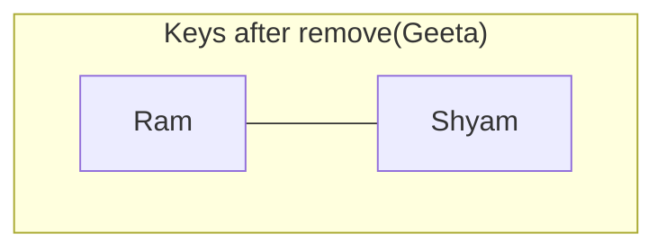

#### NavigableMap entry methods used in the demo

| Method | Argument | Demo output | Meaning |
| ------ | -------- | ----------- | ------- |
| **`ceilingEntry(key)`** | `"Ram"` | entry for `Ram` | Smallest key **≥ `Ram`** |
| **`lowerEntry(key)`** | `"Shyam"` | entry for `Ram` | Greatest key **strictly less than** `Shyam` |
| **`floorKey(key)`** | `"Shyam"` | `Shyam` | Greatest key **≤ `Shyam`** |
| **`floorEntry(key)`** | `"Ram"` | key `Ram` | Greatest key **≤ `Ram`** (entry view) |
| **`pollFirstEntry()`** | — | removes & returns `Ram` | **`SortedMap`/`NavigableMap` poll** — mutates map |
| **`pollLastEntry()`** | — | removes & returns `Shyam` | Removes highest entry |

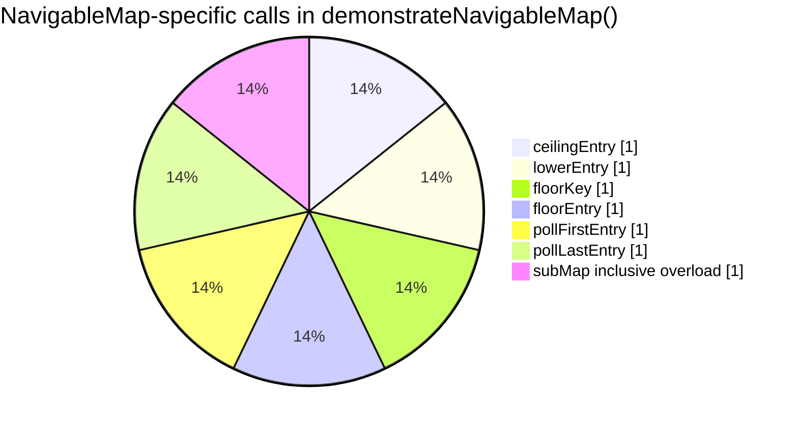

> **Console labels vs methods:** two `println` lines use the text `floorEntry` / `ceilingEntry` but the code calls **`pollFirstEntry()`** and **`pollLastEntry()`**, which **remove** entries. That is why the final iterator prints nothing.

#### Parallel: key-only vs entry APIs

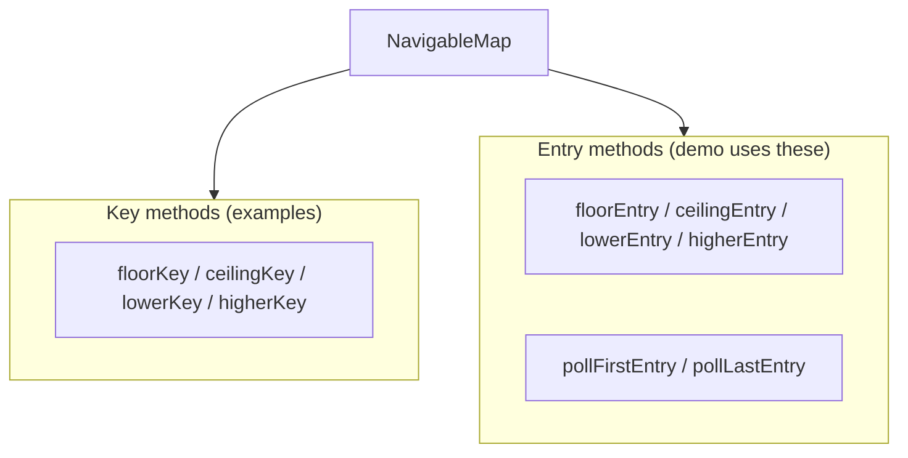

Related APIs **not** called in this demo: `descendingMap()`, `navigableKeySet()`, `higherEntry`, `ceilingKey`, etc. They appear in the **TreeMap** public-method list from `printDefaultCapacitySummary`.

---

### `mapConstructors("NavigableMap")` behavior

`mapConstructors` in [`mapDemo.java`](../../../demo/src/main/java/com/collections/map/mapDemo.java) has **no `case "NavigableMap"`** (or `"SortedMap"`), so the switch **falls through to `default`** and runs **`demonstrateHashMapConstructors()`**.

```mermaid
flowchart TD
  MC["mapConstructors(\"NavigableMap\")"] --> SW{"switch collectionType"}
  SW --> DEF["default → demonstrateHashMapConstructors()"]
```

That is why the log after the NavigableMap block shows **`HashMap(): {}`** and related lines — not `TreeMap()` constructors. For TreeMap constructors, run [`treeMap.java`](../../../demo/src/main/java/com/collections/map/treeMap.java) or extend the switch with `NavigableMap` → `demonstrateTreeMapConstructors()`.

---

### `printDefaultCapacitySummary` from `navigableMap.main`

```java
CollectionTypeInspector.printDefaultCapacitySummary("HashMap", "LinkedHashMap", "TreeMap", "Hashtable");
```

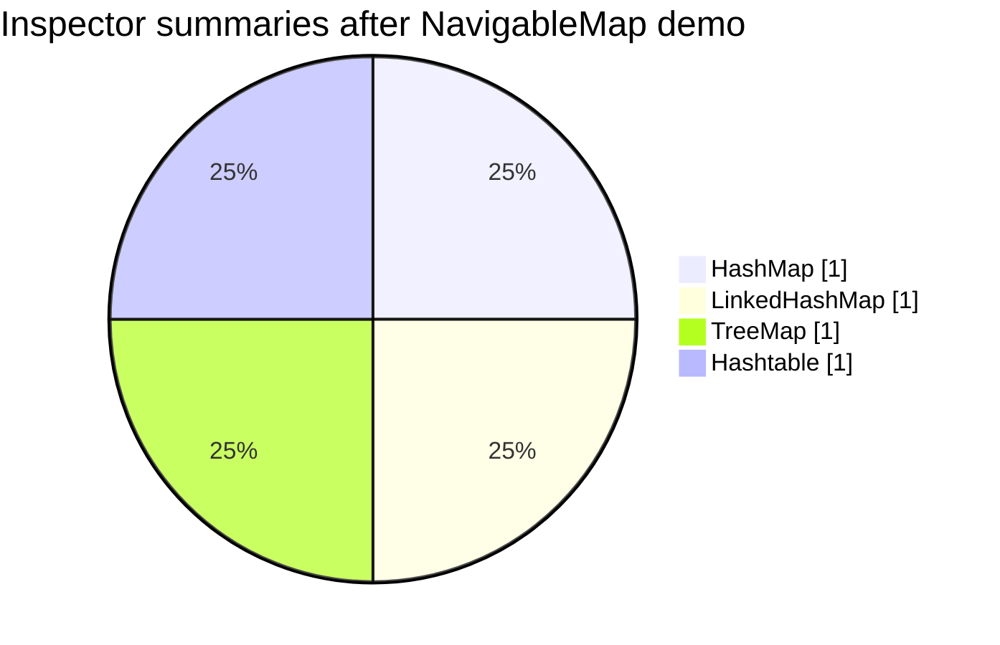

Each block prints **type**, **capacity / load factor** (where applicable), **public methods**, and a **one-line summary**. The **TreeMap** list includes full **`NavigableMap`** surface: `ceilingEntry`, `descendingMap`, `pollFirstEntry`, `subMap`, `tailMap`, …

To print **`NavigableMap`** as the interface summary, pass `"NavigableMap"` (supported in [`CollectionTypeInspector`](../../../demo/src/main/java/com/collections/collectionBaseClasses/CollectionTypeInspector.java)).

---

### What `NavigableMap` adds beyond `SortedMap`

| Layer | Responsibility |
| ----- | ---------------- |
| **`Map`** | `put` / `get` / `remove`; entry, key, and value views |
| **`SortedMap`** | `firstKey` / `lastKey`; classic `subMap` / `headMap` / `tailMap` |
| **`NavigableMap`** | `*Entry` and `*Key` nearest-match pairs; `descendingMap`; inclusive range overloads; `pollFirstEntry` / `pollLastEntry` |
| **`TreeMap`** | Standard implementation used in the demo |

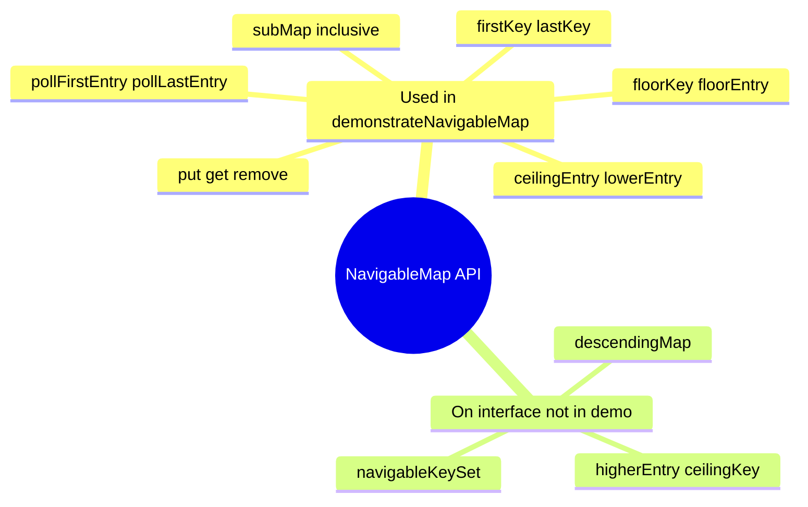

---

### Verified NavigableMap output

```text
===== NavigableMap (TreeMap) =====
----- Type Classification -----
  TreeMap              -> CLASS
  NavigableMap         -> INTERFACE
  SortedMap            -> INTERFACE
  Map                  -> INTERFACE
--------------------------------
After put() (stored in sorted key order): {Geeta=28, Ram=25, Shyam=30}
get("Shyam"): 30
firstKey(): Geeta
lastKey(): Shyam
After remove("Geeta"): {Ram=25, Shyam=30}
subMap("Ram", "Shyam") [to exclusive]: Ram to Ram
subMap("Ram", true, "Shyam", true) [both inclusive]: {Ram=25, Shyam=30}
headMap("Shyam") [keys < Shyam]: Shyam
tailMap("Ram") [keys >= Ram]: Ram
floorEntry("Ram"): Ram
ceilingEntry("Ram"): Shyam
comparator(): null
Iterator over entrySet() (sorted order):
```

*(Iterator body empty — map empty after `pollFirstEntry` / `pollLastEntry`.)*

### Run the NavigableMap demo

```bash
cd demo
mvn -q exec:java -Dexec.mainClass=com.collections.map.navigableMap
```

Main class: `com.collections.map.navigableMap`.

> **Also see:** [`demonstrateSortedMap()`](../../../demo/src/main/java/com/collections/map/mapDemo.java) for `SortedMap` range views without poll/entry navigation; [`Hashtable` execution flow](hashTable.md) for bucket-based maps.

---


