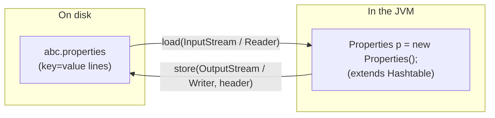
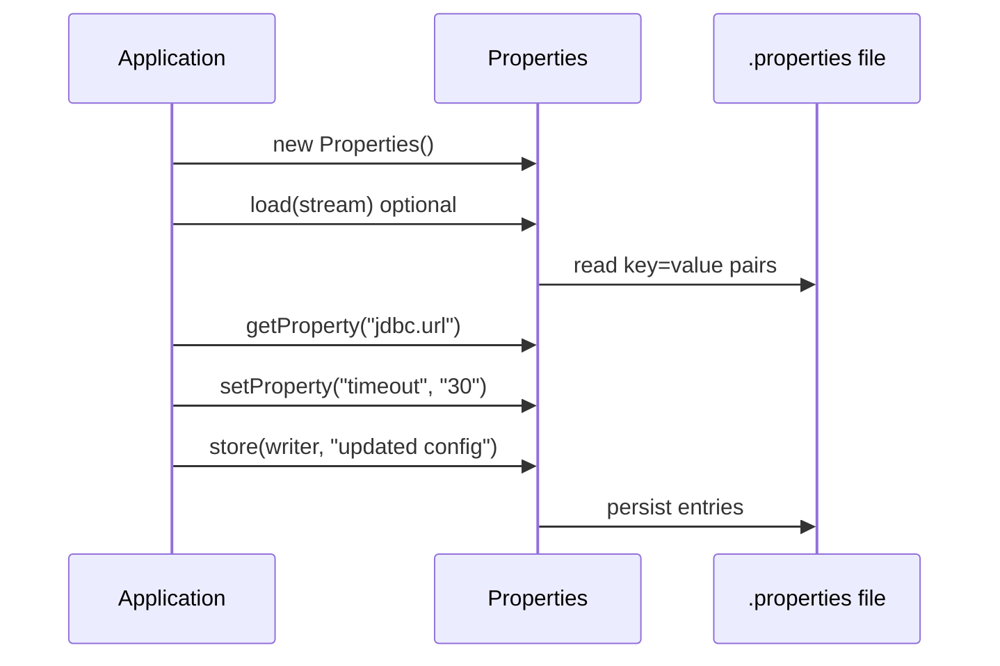
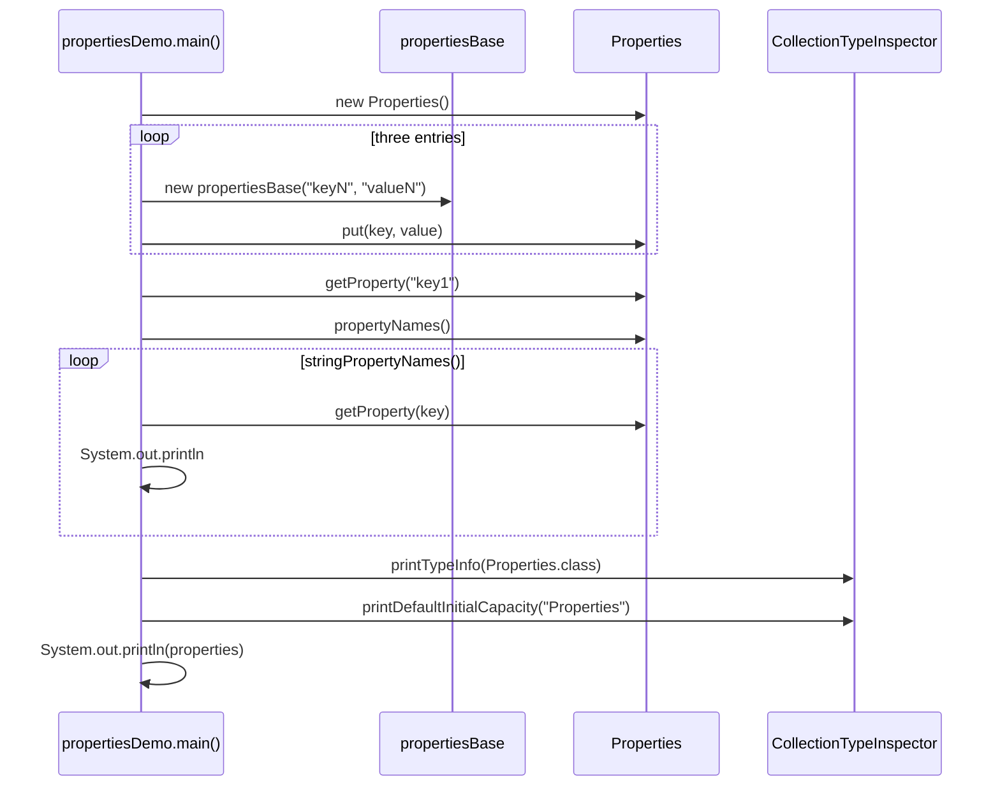
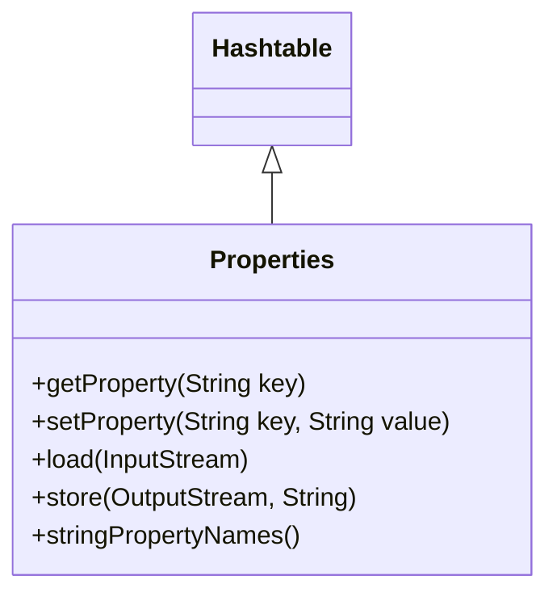

# Properties (`properties` package)

> `propertiesDemo.java` execution flow and load/store diagrams.
>
> [← Back to Java Collections Guide](collections.md)

---

## Properties

`java.util.Properties` is a **legacy `Hashtable` subclass** used for **configuration**: usernames, passwords, URLs, and other values that change more often than compiled code should.

Unlike a general `HashMap` or `Hashtable`, the API is oriented toward **string keys and string values** (`getProperty`, `setProperty`, `stringPropertyNames`).

### Why use a properties file?

| Problem with hard-coding                                                                                                                                   | Properties-file approach                                                                                                                           |
| ---------------------------------------------------------------------------------------------------------------------------------------------------------- | -------------------------------------------------------------------------------------------------------------------------------------------------- |
| Changing a username, password, mail id, or mobile number in source forces **recompile**, **rebuild**, and often **redeploy** (sometimes a server restart). | Store those values in a **`.properties` file** on disk or in the classpath.                                                                        |
| Frequent config changes create **business impact** for the client.                                                                                         | Update the file and **redeploy** (or reload) without changing Java source.                                                                         |
| Any map type allows non-`String` keys/values.                                                                                                              | For `Properties`, keys and values are treated as **strings** (use `getProperty` / `setProperty` rather than arbitrary objects in production code). |

### Properties file and the `Properties` object (`load` / `store`)

Configuration is usually kept in a **text file** (for example `abc.properties` or this repo’s [`propertiesDemo.properties`](../../../propertiesDemo.properties)). At runtime you hold the same data in a **`Properties` object** in memory.




| Direction         | Method                                                       | What happens                                                                             |
| ----------------- | ------------------------------------------------------------ | ---------------------------------------------------------------------------------------- |
| **File → object** | `load(InputStream)` or `load(Reader)`                        | Reads `key=value` lines (and `#` / `!` comments) from the file into the in-memory table. |
| **Object → file** | `store(OutputStream, comments)` or `store(Writer, comments)` | Writes the current entries back to a file, optionally with a header comment line.        |

Typical lifecycle:



> In [`propertiesDemo.java`](../../../demo/src/main/java/com/collections/properties/propertiesDemo.java), the `store(...)` call is **commented out** so the demo stays read-only in CI; uncomment it locally to regenerate [`propertiesDemo.properties`](../../../propertiesDemo.properties).

---

### Complete execution flow (`propertiesDemo.java`)

This section walks through **what `main` actually runs** in the demo: in-memory `put`s, string-only access helpers, reflection output, and optional file I/O shown in comments.

#### Source files

| File                                                                                              | Role                                                                         |
| ------------------------------------------------------------------------------------------------- | ---------------------------------------------------------------------------- |
| [propertiesDemo.java](../../../demo/src/main/java/com/collections/properties/propertiesDemo.java) | `main`: populate `Properties`, print entries, inspect type                   |
| [propertiesBase.java](../../../demo/src/main/java/com/collections/properties/propertiesBase.java) | Small helper holding `key` / `value` strings used when calling `put`         |
| [propertiesDemo.properties](../../../propertiesDemo.properties)                                   | Example file produced when `store()` is enabled (sample on disk in the repo) |

#### End-to-end flow

```mermaid
flowchart TD
  A["main() in propertiesDemo"] --> B["new Properties()<br/>11 buckets, load factor 0.75 (Hashtable defaults)"]
  B --> C["put key1/value1, key2/value2, key3/value3<br/>via propertiesBase getters"]
  C --> D["Commented: setProperty(null) → NPE<br/>Commented: store() → propertiesDemo.properties<br/>Commented: notify() → IllegalMonitorStateException"]
  D --> E["getProperty(\"key1\")"]
  E --> F["propertyNames() (legacy Enumeration)"]
  F --> G["for each key in stringPropertyNames():<br/>println key = getProperty(key)"]
  G --> H["CollectionTypeInspector.printTypeInfo / printDefaultInitialCapacity"]
  H --> I["println(properties)"]
```



#### Step-by-step summary

| Step | Code                                  | Effect                                                                                                                                                                                                 |
| ---- | ------------------------------------- | ------------------------------------------------------------------------------------------------------------------------------------------------------------------------------------------------------ |
| 1    | `new Properties()`                    | Empty table with the same default capacity as `Hashtable` (**11** buckets, load factor **0.75**).                                                                                                      |
| 2    | `properties.put(...)` × 3             | Inserts `key1`→`value1`, `key2`→`value2`, `key3`→`value3`. Keys and values are `String`s obtained from [`propertiesBase`](../../../demo/src/main/java/com/collections/properties/propertiesBase.java). |
| 3    | Commented `setProperty("key4", null)` | Would throw **`NullPointerException`** — `Properties` does not allow `null` keys or values (inherited from `Hashtable`).                                                                               |
| 4    | Commented `store(FileWriter, ...)`    | Would write all entries to **`propertiesDemo.properties`** with a header comment (see sample file in repo root).                                                                                       |
| 5    | Commented `notify()`                  | Would throw **`IllegalMonitorStateException`** — `Properties` is not a monitor; `wait`/`notify` are for thread coordination on synchronized objects.                                                   |
| 6    | `getProperty("key1")`                 | Returns `"value1"` (result not printed).                                                                                                                                                               |
| 7    | `propertyNames()`                     | Legacy **`Enumeration`** of keys; demo calls it without using the result (contrast with `stringPropertyNames()` below).                                                                                |
| 8    | `stringPropertyNames()` loop          | Prints each `key = value` line using the **string-only** API (preferred in modern code).                                                                                                               |
| 9    | `CollectionTypeInspector`             | Reports `Properties` as a **CLASS** extending **`Properties`** / `Hashtable`, and prints default bucket capacity.                                                                                      |
| 10   | `System.out.println(properties)`      | Prints the map’s `toString()` — order follows internal `Hashtable` enumeration, **not** insertion order.                                                                                               |

#### Relationship to `Hashtable`



Because `Properties` **extends `Hashtable`**, it inherits synchronized methods and **does not preserve insertion order** in `println` output — the same idea as [`hashTableDemo`](../../../demo/src/main/java/com/collections/hashTable/basicflow/hashTableDemo.java).

#### Verified program output

```text
key1 = value1
key2 = value2
key3 = value3
----- Type Classification -----
  Properties           -> CLASS
  Properties           -> CLASS
--------------------------------
----- Default Initial Capacity -----
  Properties: 11 buckets, load factor 0.75
  Formula: resize threshold = 11 * 0.75 = 8; new capacity = old capacity * 2 + 1
-------------------------------------
Properties: {key1=value1, key2=value2, key3=value3}
```

### Run the properties demo

From the `demo` module (Maven) or compile `propertiesDemo` and `propertiesBase` with `CollectionTypeInspector` on the classpath:

```bash
cd demo
mvn -q exec:java -Dexec.mainClass=com.collections.properties.propertiesDemo
```

Main class: `com.collections.properties.propertiesDemo`.


