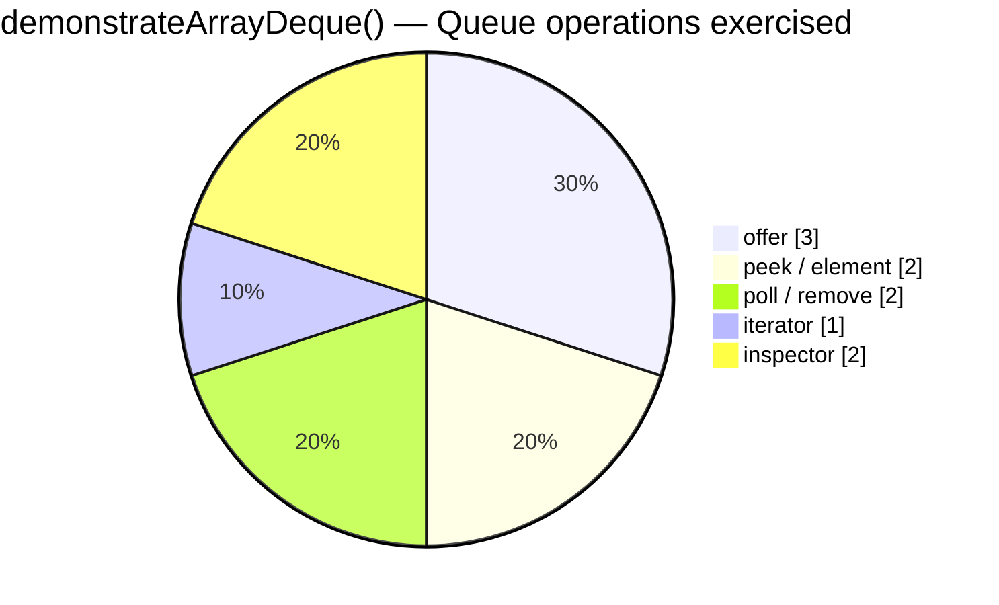

# Queue (`queue` package)

> Queue interfaces and constructor examples; flagship demo: `arrayDeque.java`.
>
> [← Back to Java Collections Guide](collections.md)

---

## Queue constructor examples

```java
new LinkedList<>();
new LinkedList<>(collection);

new ArrayDeque<>();
new ArrayDeque<>(20);
new ArrayDeque<>(collection);

new PriorityQueue<>();
new PriorityQueue<>(20);
new PriorityQueue<>(Comparator.reverseOrder());
new PriorityQueue<>(20, Comparator.reverseOrder());
new PriorityQueue<>(collection);
new PriorityQueue<>(priorityQueue);
new PriorityQueue<>(sortedSet);
```

`LinkedList` can act as both a `List` and a `Queue`. `PriorityQueue` also provides copy constructors for another `PriorityQueue` and a `SortedSet`.

---

## Queue (I)

`Queue` is a child interface of `Collection` used to hold elements before processing. Most queue implementations process elements in **FIFO** (first-in, first-out) order. However, some implementations use a different ordering rule: for example, `PriorityQueue` processes the highest-priority element first.

Before sending a mail all mailId's we have to store in some data structure in which order we added mailId's in the same 
order only mail should be delivered.For this requirement Queue is best choice

`Queue` provides paired operations: one method throws an exception when it cannot complete the operation, while the other returns a special value instead.

| Operation         | Throws exception | Returns special value      |
| ----------------- | ---------------- | -------------------------- |
| Insert an element | `add(e)`         | `offer(e)` returns `false` |
| Remove the head   | `remove()`       | `poll()` returns `null`    |
| Inspect the head  | `element()`      | `peek()` returns `null`    |

> Most Queue implementations do not permit `null` elements because `poll()` and `peek()` use `null` to indicate that the queue is empty.

- [Queue constructors — `queueConstructors(String)`](../../../demo/src/main/java/com/collection/collectionBaseClasses/queueDemo.java)
- 
## Queue Interface Hierarchy

The diagram includes the public Queue-related interfaces and standard JDK implementations. A solid arrow means **extends** and a dashed arrow means **implements**.

```mermaid
classDiagram
  direction TB

  class Iterable~E~ {
    <<interface>>
  }

  class Collection~E~ {
    <<interface>>
  }

  class Queue~E~ {
    <<interface>>
    +add(E element) boolean
    +offer(E element) boolean
    +remove() E
    +poll() E
    +element() E
    +peek() E
  }

  class Deque~E~ {
    <<interface>>
    Double-ended queue
    +addFirst(E element)
    +addLast(E element)
    +pollFirst() E
    +pollLast() E
  }

  class BlockingQueue~E~ {
    <<interface>>
    +put(E element)
    +take() E
  }

  class BlockingDeque~E~ {
    <<interface>>
    Blocking double-ended queue
  }

  class TransferQueue~E~ {
    <<interface>>
    +transfer(E element)
  }

  class AbstractCollection~E~ {
    <<abstract>>
  }

  class AbstractQueue~E~ {
    <<abstract>>
  }

  class ArrayDeque~E~ {
    Resizable-array deque
  }

  class LinkedList~E~ {
    Doubly-linked list and deque
  }

  class PriorityQueue~E~ {
    Priority-heap queue
  }

  class ConcurrentLinkedQueue~E~ {
    Non-blocking concurrent FIFO queue
  }

  class ConcurrentLinkedDeque~E~ {
    Non-blocking concurrent deque
  }

  class ArrayBlockingQueue~E~ {
    Bounded blocking FIFO queue
  }

  class LinkedBlockingQueue~E~ {
    Optionally bounded blocking FIFO queue
  }

  class PriorityBlockingQueue~E~ {
    Unbounded blocking priority queue
  }

  class DelayQueue~E~ {
    Delayed-element blocking queue
  }

  class SynchronousQueue~E~ {
    Zero-capacity hand-off queue
  }

  class LinkedBlockingDeque~E~ {
    Optionally bounded blocking deque
  }

  class LinkedTransferQueue~E~ {
    Non-blocking transfer queue
  }

  Iterable~E~ <|-- Collection~E~
  Collection~E~ <|-- Queue~E~
  Queue~E~ <|-- Deque~E~
  Queue~E~ <|-- BlockingQueue~E~
  Deque~E~ <|-- BlockingDeque~E~
  BlockingQueue~E~ <|-- BlockingDeque~E~
  BlockingQueue~E~ <|-- TransferQueue~E~

  Collection~E~ <|.. AbstractCollection~E~
  AbstractCollection~E~ <|-- AbstractQueue~E~
  Queue~E~ <|.. AbstractQueue~E~
  AbstractCollection~E~ <|-- ArrayDeque~E~
  AbstractQueue~E~ <|-- PriorityQueue~E~
  AbstractQueue~E~ <|-- ConcurrentLinkedQueue~E~
  AbstractCollection~E~ <|-- ConcurrentLinkedDeque~E~
  AbstractQueue~E~ <|-- ArrayBlockingQueue~E~
  AbstractQueue~E~ <|-- LinkedBlockingQueue~E~
  AbstractQueue~E~ <|-- PriorityBlockingQueue~E~
  AbstractQueue~E~ <|-- DelayQueue~E~
  AbstractQueue~E~ <|-- SynchronousQueue~E~
  AbstractQueue~E~ <|-- LinkedBlockingDeque~E~
  AbstractQueue~E~ <|-- LinkedTransferQueue~E~

  Deque~E~ <|.. ArrayDeque~E~
  Deque~E~ <|.. LinkedList~E~
  Deque~E~ <|.. ConcurrentLinkedDeque~E~
  Queue~E~ <|.. PriorityQueue~E~
  Queue~E~ <|.. ConcurrentLinkedQueue~E~
  BlockingQueue~E~ <|.. ArrayBlockingQueue~E~
  BlockingQueue~E~ <|.. LinkedBlockingQueue~E~
  BlockingQueue~E~ <|.. PriorityBlockingQueue~E~
  BlockingQueue~E~ <|.. DelayQueue~E~
  BlockingQueue~E~ <|.. SynchronousQueue~E~
  BlockingDeque~E~ <|.. LinkedBlockingDeque~E~
  TransferQueue~E~ <|.. LinkedTransferQueue~E~
```



### Choosing a Queue implementation

- **`ArrayDeque`**: the usual choice for a FIFO queue, deque, or stack in single-threaded code. It is generally preferred over the legacy `Stack` class.
- **`LinkedList`**: implements both `List` and `Deque`; use it when those linked-list characteristics are specifically useful.
- **`PriorityQueue`**: use when processing must follow natural ordering or a `Comparator`, rather than FIFO order.
- **`ArrayBlockingQueue`** and **`LinkedBlockingQueue`**: use for producer-consumer workflows where a capacity limit and blocking behavior are useful.
- **`ConcurrentLinkedQueue`** and **`ConcurrentLinkedDeque`**: use for non-blocking, thread-safe operations.
- **`SynchronousQueue`**: use for direct hand-off between a producer and a consumer; it never stores an element.
- **`DelayQueue`**: use when an element must not be retrieved until its delay expires.
- **`LinkedTransferQueue`**: use when producers may need to wait until consumers receive an element.

> The legacy `Stack` class is not a `Queue` implementation. For new LIFO stack code, use `Deque`, normally `ArrayDeque`.

---


---

# 1.5 v enhancements  (Queue Interface)

1. It is the child interface of Collection 
   a. Prority Queue
   b. Blocking queue 
      1)Priority Blocking Queue
      2)Linked Blocking Queue
2. If we want to represent a group of individual objects prior to processing then we should for Queue
   Example: before sending SMS message all mobile numbers we have to store in some data structure in which order we added the mobilenumbers 
   in the same order only message should be sent.For this FIFO(first in first out) requirement queue is the best choice
3. Usually queue follows FIFO order but based on our requirement we can implement out own priority order also(prioroty queue)
4. From 1.5 version onwards linkedlist class also implements queue interface, linkedlist based implemenation always follws FIFO

# PriorityQueue

1. If we want to represent a group of individual objects prior to processing according to some priority then we should go for priority queue
2. The priority can be either default natural sorting order or customized sorting order defined by comparator 
3. Insertion order is not preserved and it is based on some priority 
4. Duplicate objects are not allowed 
5. If we are depending on default natural sorting order compulsory the objects should be homogeneous and comparable otherwise we will get runtime 
   Exception saying ClassCastException
6. If we are defininig our own sorting by comparator then objects need not be homogeneous and comparable 
7. null is not allowed even as the first element insertion also.

# Constructors 

>PriorityQueue pq = new PriorityQueue();
 Creates an empty priority queue with default initial capacity 11 and all objects wil be inserted according to default natural sorting order

>PriorityQueue pq = new PriorityQueue(int initialcapacity);
>PriorityQueue pq = new PriorityQueue(int initialcapacity, Comparator s);
>PriorityQueue pq = new PriorityQueue(SortedSet s );
>PriorityQueue pq = new PriorityQueue(Collection c);

NOTE: some platforms won't provide proper support for thread priorites and priorityqueue


---

## ArrayDeque — complete execution flow (`arrayDeque.java`)

[`arrayDeque.java`](../../../demo/src/main/java/com/collection/queue/arrayDeque.java) calls **`demonstrateQueue("ArrayDeque")`** then **`printDefaultCapacitySummary`** for LinkedList, ArrayDeque, and PriorityQueue.

Implementation: [`queueDemo.demonstrateArrayDeque()`](../../../demo/src/main/java/com/collection/collectionBaseClasses/queueDemo.java).

### Launcher flow

```mermaid
flowchart TD
  M["arrayDeque.main"] --> D["demonstrateQueue(\"ArrayDeque\")"]
  D --> T1["queueCollectionType → demonstrateArrayDeque()"]
  D --> T2["queueConstructors → demonstrateArrayDequeConstructors()"]
  M --> S["printDefaultCapacitySummary(LinkedList, ArrayDeque, PriorityQueue)"]
```



| Method | Role in demo |
| ------ | ------------- |
| `offer` | Add at tail (FIFO), $O(1)$ amortized |
| `peek` / `element` | Inspect head; `element` throws if empty |
| `poll` / `remove` | Remove head; `remove` throws if empty |
| `iterator` | Head-to-tail traversal |

> **Also in this repo:** [`priroityQueue.java`](../../../demo/src/main/java/com/collection/queue/priroityQueue.java) → `demonstratePriorityQueue()` (heap order, not FIFO). See [Queue Interface Hierarchy](#queue-interface-hierarchy) above.

### Run

```bash
cd demo && mvn -q exec:java -Dexec.mainClass=com.collection.queue.arrayDeque
```
