# Set (`set` package)

> Set hierarchy, HashSet, and **NavigableSet** / `navigableSet.java` walkthrough.
>
> [← Back to Java Collections Guide](collections.md)

---

## Set constructor examples


```java
new HashSet<>();
new HashSet<>(20);
new HashSet<>(20, 0.80f);
new HashSet<>(collection);

new LinkedHashSet<>();
new LinkedHashSet<>(20);
new LinkedHashSet<>(20, 0.80f);
new LinkedHashSet<>(collection);

new TreeSet<>();
new TreeSet<>(Comparator.reverseOrder());
new TreeSet<>(collection);
new TreeSet<>(sortedSet);
```

`TreeSet` accepts a comparator for custom ordering and a `SortedSet` to preserve its sorted-source behavior.

---

## Set (I) Interface

1.It is the child interface of collection 
2.If we want to represent a group of individual objects as a single entity where duplicates are not allowed and insertion 
  order not required then we should go for Set.

- [Set constructors — `setConstructors(String)`](../../../demo/src/main/java/com/collection/set/setDemo.java)

## Set Interface Hierarchy

The following diagram shows the public, general-purpose Set interfaces and implementations. A solid arrow means **extends** and a dashed arrow means **implements**.


Collection(I)
     \
     Set(I)
     /     \
  HashSet  SortedSet(I)
     |            \
  LinkedHashSet   NavigableSet(I)
                              \
                              TreeSet(I)

1. Set is child interface of collection 
2. If we want to represent a group of individual objects as a single entity where duplicates are not allowed 
   and insertion order not preseved.

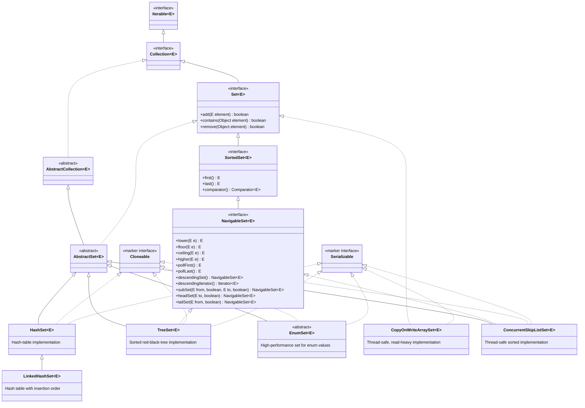

### Common implementations

- **`HashSet`**: the usual choice when unique elements are needed and no iteration order is required.
- **`LinkedHashSet`**: preserves insertion order while preventing duplicates.
- **`TreeSet`**: keeps elements sorted in their natural order or by a supplied `Comparator`.
- **`EnumSet`**: the most efficient choice when every element belongs to one enum type. Create it through factory methods such as `EnumSet.of(...)`; it cannot be instantiated directly.

### Thread-safe implementations

- **`CopyOnWriteArraySet`**: best for read-heavy sets with infrequent updates.
- **`ConcurrentSkipListSet`**: a sorted, concurrent `NavigableSet` for multi-threaded code.

> `BitSet` is not a `Set` implementation. It stores bits efficiently and has a different API. Sets returned by `Map.keySet()` are also views rather than separately declared, general-purpose Set implementation classes.

### HashSet (C)

1. The underlying datastrutcure is Hashtable 
2. Duplicate objects are not allowed 
3. Insertion order is not preserved and it is based on hashcode of objects
4. Null insetion possible but only one time
5. Heterogenous Objects are allowed
6. Implements Serializable, Cloneable but not RandomAccess interface
7. HashSet is the best choice if our ferquent operation is Search operation
  
**NOTE : In HashSet duplicates are not allowed if we are trying to insert duplicates then we won't get any compile-time or 
run-time errors and add method returns simply returns false.**

>HashSet h = new HashSet();

creates an empty HashSet Object with default initial capacity 16 and default fill ratio 0.75

>HashSet h = new HashSet(int initialcapacity);

creates an empty HashSet Object with specified initial capacity and default fill ratio 0.75

>HashSet h = new HashSet(int initialcapacity, float fillratio);

>HashSet h = new HashSet(Collection c);

Creates an equivalent HashSet for the given collection 

### Fill Ratio | Load Factor

After filling how much ratio a new hashSet obejct will be created, this ratio is called fill ratio or load factor 
ex: fill ratio 0.75 means after filling 75% ratio a new HashSet Object will be created

## HashSet vs LinkedHashSet

> For a cleaner, single-page comparison table and a selection guide, see **[HashSet vs LinkedHashSet — Quick Comparison](hashset-vs-linkedhashset.md)**.

`LinkedHashSet<E>` extends `HashSet<E>`. Both prevent duplicates, use `hashCode()` and `equals()` to identify matching elements, and use a hash-table lookup model. The key difference is that `LinkedHashSet` also maintains links between entries, giving it a predictable encounter order.

| Aspect                           | `HashSet<E>`                                                                                                   | `LinkedHashSet<E>`                                                                                                                                         |
| -------------------------------- | -------------------------------------------------------------------------------------------------------------- | ---------------------------------------------------------------------------------------------------------------------------------------------------------- |
| Inheritance                      | Extends `AbstractSet<E>`.                                                                                      | Extends `HashSet<E>`.                                                                                                                                      |
| Internal structure               | Hash table; current JDKs back it with a `HashMap`.                                                             | Hash table plus links between entries; current JDKs back it with a `LinkedHashMap`.                                                                        |
| Iteration / encounter order      | **No order guarantee.** Order can change after resizing or across JVM versions.                                | **Insertion order is preserved.** Re-adding an existing element does not move it to the end.                                                               |
| Sorting                          | Does not sort elements.                                                                                        | Does not sort elements; it preserves insertion order. Use `TreeSet` for sorted order.                                                                      |
| `Iterator` and `forEach` order   | Unspecified encounter order.                                                                                   | Insertion encounter order.                                                                                                                                 |
| Java 21 sequenced API            | Does not implement `SequencedSet`.                                                                             | Implements `SequencedSet`; provides `addFirst`, `addLast`, `getFirst`, `getLast`, `removeFirst`, `removeLast`, and `reversed`.                             |
| Main operation time              | `add`, `contains`, and `remove` are $O(1)$ on average; collisions can make an operation slower.                | Same average $O(1)$ operations, with a small extra cost to maintain links.                                                                                 |
| Iteration time                   | Typically proportional to **size + table capacity**, because empty buckets may be visited.                     | Proportional to **size**, because iteration follows the linked entries; helpful for a sparse, oversized set.                                               |
| Memory use                       | Lower per-entry memory overhead.                                                                               | Higher per-entry memory overhead for before/after entry links.                                                                                             |
| Initial capacity and load factor | Default capacity is `16` and default load factor is `0.75`; initial resize threshold is $16 \times 0.75 = 12$. | Uses the same capacity and load-factor rules.                                                                                                              |
| Constructors                     | `HashSet()`, `HashSet(int)`, `HashSet(int, float)`, `HashSet(Collection)`.                                     | `LinkedHashSet()`, `LinkedHashSet(int)`, `LinkedHashSet(int, float)`, `LinkedHashSet(Collection)`; Java 21 also has `LinkedHashSet.newLinkedHashSet(int)`. |
| Best use                         | Uniqueness and fast membership checks when display/iteration order does not matter.                            | Stable insertion-order output, logs, predictable tests, or de-duplicating input without rearranging it.                                                    |

### Shared properties

- **Duplicates:** `add(element)` returns `false` when an equal element already exists; no exception is thrown.
- **Null:** both allow one `null` element.
- **Custom objects:** duplicate detection requires correct, consistent `equals()` and `hashCode()` methods.
- **Thread safety:** neither is synchronized. For concurrent modification, use external synchronization, `Collections.synchronizedSet(...)`, or an appropriate concurrent set.
- **Iterators:** both are fail-fast on a best-effort basis. Do not structurally modify the set during iteration except through `Iterator.remove()`.
- **Interfaces:** both implement `Set`, `Cloneable`, and `Serializable`; neither implements `RandomAccess`.
- **Equality:** set equality ignores iteration order. A `HashSet` and `LinkedHashSet` containing the same elements are equal.

```java
Set<String> hashSet = new HashSet<>();
hashSet.add("Banana");
hashSet.add("Apple");
hashSet.add("Cherry");
// Iteration order is unspecified.

Set<String> linkedHashSet = new LinkedHashSet<>();
linkedHashSet.add("Banana");
linkedHashSet.add("Apple");
linkedHashSet.add("Cherry");
// Always iterates as: [Banana, Apple, Cherry]
```

> **Rule of thumb:** use `HashSet` for the lowest-overhead unordered set. Choose `LinkedHashSet` when users, tests, files, or APIs need stable insertion-order output. Neither class provides sorted order.


### SortedSet (I)

It is the child interface of Set if we want to represent a group of individual objects as a single entity where 
duplicates are not allowed and all objects should be inserted according to some sorting order then we should go for Sorted Set 

---

> **Concept (Java 6):** `NavigableSet` and `NavigableMap` extend the sorted interfaces with **navigation** methods (`lower`, `floor`, `ceiling`, `higher`, descending views, and inclusive range overloads). `TreeSet` / `TreeMap` are the usual implementations.

---

## NavigableSet — complete execution flow (`navigableSet.java`)

`NavigableSet<E>` extends `SortedSet<E>` with **nearest-match lookups** and **descending views** on a sorted unique set. The usual implementation is **`TreeSet`** (red-black tree, $O(\log n)$ per operation).

[`navigableSet.java`](../../../demo/src/main/java/com/collection/set/navigableSet.java) is a thin launcher: it calls [`setDemo`](../../../demo/src/main/java/com/collection/set/setDemo.java) with type `"NavigableSet"`, then prints a **capacity / API summary** via [`CollectionTypeInspector`](../../../demo/src/main/java/com/collection/collectionBaseClasses/CollectionTypeInspector.java).

### Source files

| File                                                                                   | Role                                                                                     |
| -------------------------------------------------------------------------------------- | ---------------------------------------------------------------------------------------- |
| [navigableSet.java](../../../demo/src/main/java/com/collection/set/navigableSet.java) | `main`: `demonstrateSet("NavigableSet")` + `printDefaultCapacitySummary("NavigableSet")` |
| [setDemo.java](../../../demo/src/main/java/com/collection/set/setDemo.java)           | `demonstrateNavigableSet()`, TreeSet constructors, comparator demos                      |
| [treeSet.java](../../../demo/src/main/java/com/collection/set/treeSet.java)           | Optional entry point focused on `TreeSet` only                                           |

### End-to-end execution flow

```mermaid
flowchart TD
  A["main() in navigableSet"] --> B["demonstrateSet(\"NavigableSet\")"]
  B --> C["setCollectionType → demonstrateNavigableSet()"]
  B --> D["setConstructors → demonstrateTreeSetConstructors()"]
  B --> E["setComparator → demonstrateTreeSetComparator()"]
  C --> F["new TreeSet&lt;&gt;(); add Apple, Banana, Cherry, Mango"]
  F --> G["lower / floor / ceiling / higher"]
  G --> H["descendingSet() and inclusive subSet(...)"]
  A --> I["printDefaultCapacitySummary(\"NavigableSet\")"]
  I --> J["Type info, capacity note, public methods list, behavior summary"]
```

```mermaid
sequenceDiagram
  participant NS as navigableSet.main()
  participant SD as setDemo
  participant TS as TreeSet
  participant CTI as CollectionTypeInspector

  NS->>SD: demonstrateSet("NavigableSet")
  SD->>SD: setCollectionType → demonstrateNavigableSet()
  SD->>CTI: printTypeInfo(NavigableSet, SortedSet, TreeSet)
  SD->>TS: new TreeSet(); add × 4
  SD->>TS: lower, floor, ceiling, higher
  SD->>TS: descendingSet(), subSet(Banana, true, Mango, false)
  SD->>SD: setConstructors → TreeSet constructor examples
  SD->>SD: setComparator → natural / reverse / custom Comparator
  NS->>CTI: printDefaultCapacitySummary("NavigableSet")
  CTI-->>NS: methods + summary for NavigableSet interface
```

Reference implementation of the core demo ( [`setDemo.java`](../../../demo/src/main/java/com/collection/set/setDemo.java) lines 169–188):

```java
private static void demonstrateNavigableSet() {
    System.out.println("===== NavigableSet (implemented by TreeSet) =====");
    CollectionTypeInspector.printTypeInfo(NavigableSet.class, SortedSet.class, TreeSet.class);
    CollectionTypeInspector.printDefaultInitialCapacity("NavigableSet");
    NavigableSet<String> set = new TreeSet<>();
    set.add("Apple");
    set.add("Banana");
    set.add("Cherry");
    set.add("Mango");
    System.out.println("Elements in natural sorted order: " + set);
    System.out.println("lower(\"Cherry\"): " + set.lower("Cherry"));
    System.out.println("floor(\"Cherry\"): " + set.floor("Cherry"));
    System.out.println("ceiling(\"Coconut\"): " + set.ceiling("Coconut"));
    System.out.println("higher(\"Cherry\"): " + set.higher("Cherry"));
    System.out.println("descendingSet(): " + set.descendingSet());
    System.out.println("subSet(\"Banana\", true, \"Mango\", false): "
            + set.subSet("Banana", true, "Mango", false));
    System.out.println("Core characteristic: NavigableSet adds nearest-match searches and descending views.");
}
```

---

### `navigableSet.java` — launcher methods

[`navigableSet.java`](../../../demo/src/main/java/com/collection/set/navigableSet.java) does **not** reimplement set logic; it **inherits** [`setDemo`](../../../demo/src/main/java/com/collection/set/setDemo.java) and only wires `main`.

```mermaid
flowchart TD
  M["main(args)"] --> D["demonstrateSet(\"NavigableSet\")"]
  M --> S["CollectionTypeInspector.printDefaultCapacitySummary(\"NavigableSet\")"]
  D --> T1["setCollectionType → demonstrateNavigableSet()"]
  D --> T2["setConstructors → demonstrateTreeSetConstructors()"]
  D --> T3["setComparator → demonstrateTreeSetComparator()"]
```

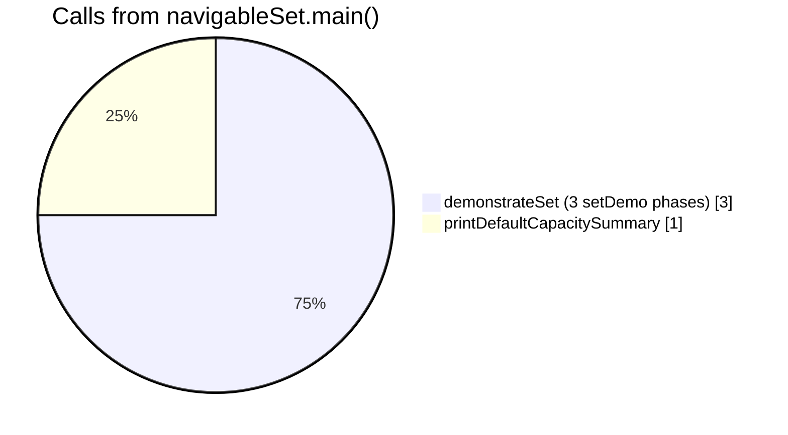

| Method in `navigableSet.java`               | What it does                                                        | Delegates to                                                         |
| ------------------------------------------- | ------------------------------------------------------------------- | -------------------------------------------------------------------- |
| **`demonstrateSet(String collectionType)`** | Runs type demo, constructors, and comparator lab for the given name | `setCollectionType`, `setConstructors`, `setComparator` on `setDemo` |
| **`main(String[] args)`**                   | Entry point for the collections demo                                | `demonstrateSet("NavigableSet")` then inspector summary              |

| `demonstrateSet("NavigableSet")` step | `setDemo` switch branch                | Private method executed                |
| ------------------------------------- | -------------------------------------- | -------------------------------------- |
| 1                                     | `setCollectionType` → `"NavigableSet"` | **`demonstrateNavigableSet()`**        |
| 2                                     | `setConstructors` → `"NavigableSet"`   | **`demonstrateTreeSetConstructors()`** |
| 3                                     | `setComparator` → `"NavigableSet"`     | **`demonstrateTreeSetComparator()`**   |

---

### `demonstrateNavigableSet()` — every statement explained

This function is the **heart** of the NavigableSet demo: it builds a `TreeSet` as a `NavigableSet`, populates it, then exercises **each NavigableSet-specific API** used in this project.

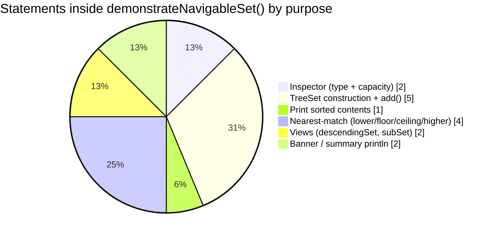

#### Execution order (numbered)

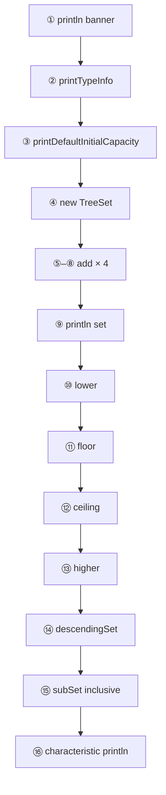

| Step | Source line                                   | Call                                    | Role                                                                                 |
| ---- | --------------------------------------------- | --------------------------------------- | ------------------------------------------------------------------------------------ |
| ①    | `println(...)`                                | `System.out.println`                    | Section header in the console                                                        |
| ②    | `printTypeInfo(...)`                          | `CollectionTypeInspector.printTypeInfo` | Shows `NavigableSet` = interface, `SortedSet` = interface, `TreeSet` = class         |
| ③    | `printDefaultInitialCapacity("NavigableSet")` | Inspector                               | Explains **no hash buckets** — tree stores one node per element                      |
| ④    | `new TreeSet<>()`                             | `TreeSet` constructor                   | Creates empty **red-black tree** implementing `NavigableSet`                         |
| ⑤–⑧  | `set.add(...)` × 4                            | `NavigableSet.add` / `TreeSet.add`      | Inserts strings; duplicates ignored; each insert $O(\log n)$                         |
| ⑨    | `println(set)`                                | `Collection.toString()`                 | Prints **`[Apple, Banana, Cherry, Mango]`** — always **sorted**, not insertion order |
| ⑩    | `set.lower("Cherry")`                         | `NavigableSet.lower`                    | Strictly smaller neighbor → **`Banana`**                                             |
| ⑪    | `set.floor("Cherry")`                         | `NavigableSet.floor`                    | Less-or-equal neighbor → **`Cherry`** (member)                                       |
| ⑫    | `set.ceiling("Coconut")`                      | `NavigableSet.ceiling`                  | Greater-or-equal neighbor → **`Mango`** (`Coconut` absent)                           |
| ⑬    | `set.higher("Cherry")`                        | `NavigableSet.higher`                   | Strictly greater neighbor → **`Mango`**                                              |
| ⑭    | `set.descendingSet()`                         | `NavigableSet.descendingSet`            | Live view **`[Mango, Cherry, Banana, Apple]`**                                       |
| ⑮    | `set.subSet("Banana", true, "Mango", false)`  | `NavigableSet.subSet`                   | Range view **`[Banana, Cherry]`**                                                    |
| ⑯    | final `println`                               | —                                       | One-line concept summary                                                             |

#### ② `CollectionTypeInspector.printTypeInfo(NavigableSet, SortedSet, TreeSet)`

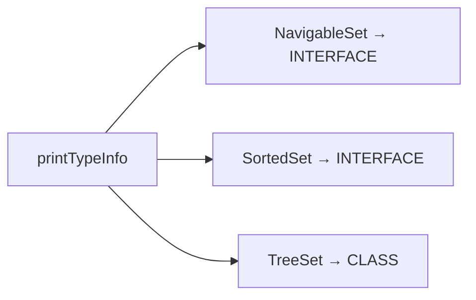

Uses reflection so you see **interface vs implementation** before any elements are added.

#### ③ `printDefaultInitialCapacity("NavigableSet")`

| Message                                | Meaning                                                         |
| -------------------------------------- | --------------------------------------------------------------- |
| *no fixed initial capacity*            | Unlike `HashSet(16)`, `TreeSet` does not preallocate 16 buckets |
| *red-black tree node for each element* | Memory grows with **one tree node per unique element**          |

#### ④ `NavigableSet<String> set = new TreeSet<>();`

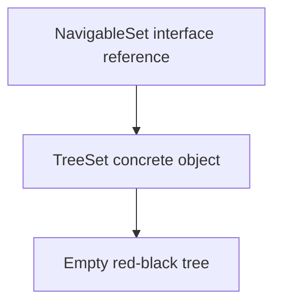

You compile against **`NavigableSet`**; at runtime the object is **`TreeSet`**, the JDK’s standard `NavigableSet` implementation.

#### ⑤–⑧ `set.add("Apple" | "Banana" | "Cherry" | "Mango")`

| `add` call      | Insertion order in code | Position in sorted tree | Returns |
| --------------- | ----------------------- | ----------------------- | ------- |
| `add("Apple")`  | 1st                     | smallest                | `true`  |
| `add("Banana")` | 2nd                     | 2nd                     | `true`  |
| `add("Cherry")` | 3rd                     | 3rd                     | `true`  |
| `add("Mango")`  | 4th                     | largest                 | `true`  |

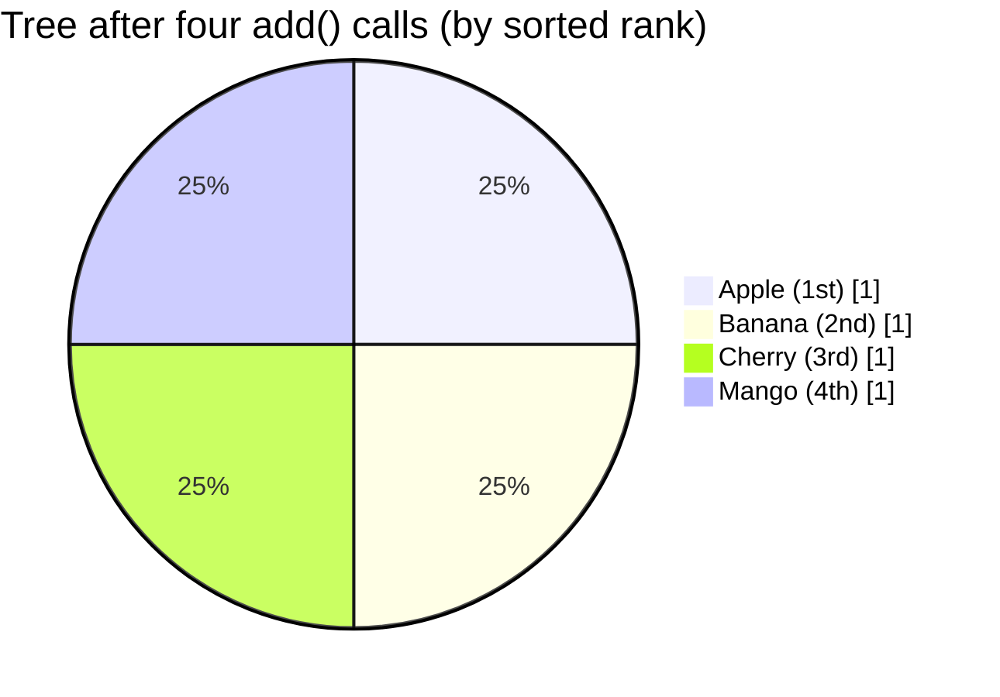

`add` comes from `Collection` / `Set`: if the element is already present (per `compareTo` / `Comparator`), `add` returns **`false`** and the set is unchanged.

#### ⑨ `System.out.println("Elements in natural sorted order: " + set)`

Implicitly calls the set’s **`toString()`**, which prints entries in **ascending sort order** (natural `String` order here). Iteration order is **not** guaranteed to match the order you called `add`.

#### ⑩ `set.lower("Cherry")` → `Banana`

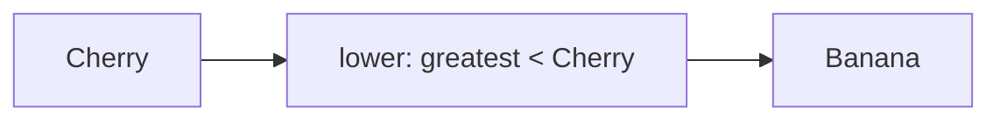

| API            | Comparator relation                        | Demo result |
| -------------- | ------------------------------------------ | ----------- |
| **`lower(e)`** | largest element **strictly less than** `e` | `Banana`    |

#### ⑪ `set.floor("Cherry")` → `Cherry`

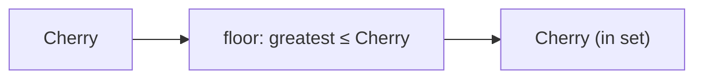

| API            | Comparator relation       | Demo result |
| -------------- | ------------------------- | ----------- |
| **`floor(e)`** | largest element **≤ `e`** | `Cherry`    |

#### ⑫ `set.ceiling("Coconut")` → `Mango`

`"Coconut"` is **not** in the set. `ceiling` finds the **smallest element ≥ `Coconut`**.

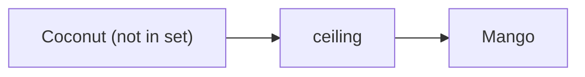

| API              | Comparator relation        | Demo result |
| ---------------- | -------------------------- | ----------- |
| **`ceiling(e)`** | smallest element **≥ `e`** | `Mango`     |

#### ⑬ `set.higher("Cherry")` → `Mango`

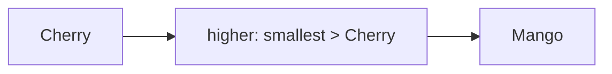

| API             | Comparator relation                            | Demo result |
| --------------- | ---------------------------------------------- | ----------- |
| **`higher(e)`** | smallest element **strictly greater than** `e` | `Mango`     |

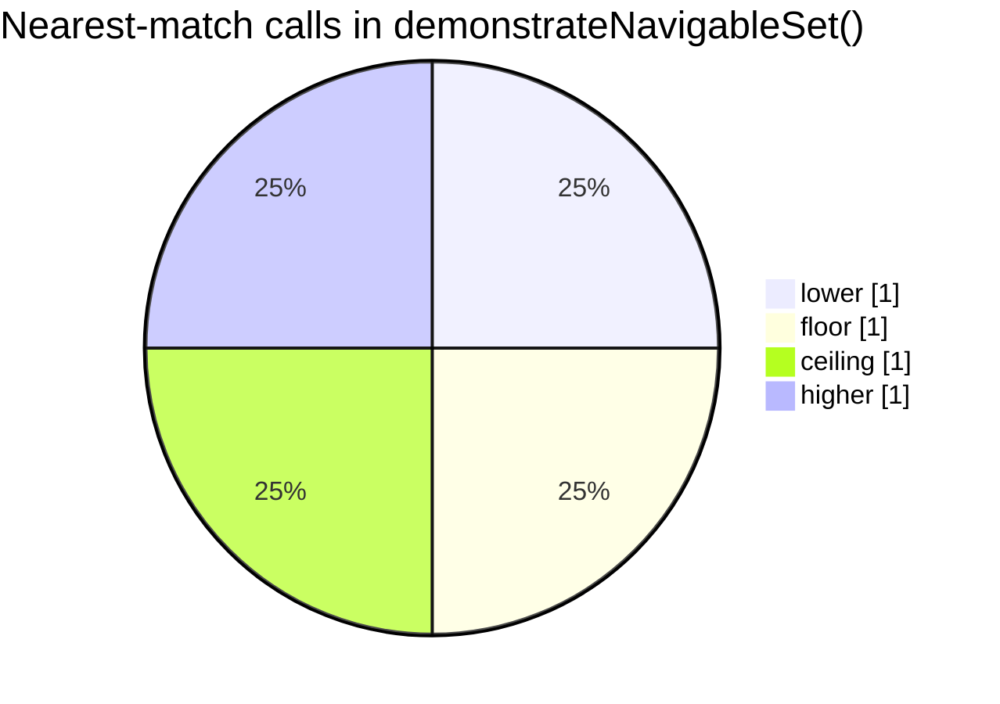

#### ⑭ `set.descendingSet()` → `[Mango, Cherry, Banana, Apple]`

| Method                | Returns                                     | Backing store                                 |
| --------------------- | ------------------------------------------- | --------------------------------------------- |
| **`descendingSet()`** | `NavigableSet` **view** with reversed order | Same `TreeSet`; updates are visible both ways |

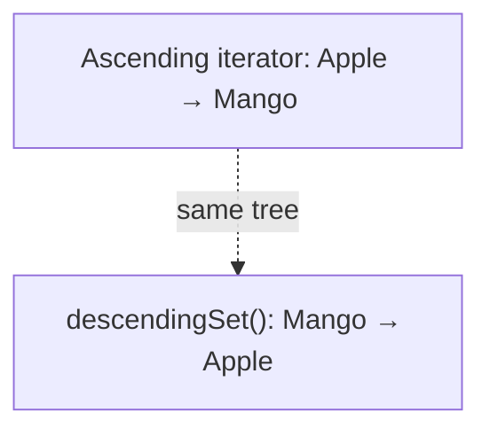

Related API (not called in this demo): **`descendingIterator()`** — iterator over the descending view.

#### ⑮ `set.subSet("Banana", true, "Mango", false)` → `[Banana, Cherry]`

NavigableSet overload: **control inclusivity** at both ends.

| Parameter       | Value      | Effect             |
| --------------- | ---------- | ------------------ |
| `fromElement`   | `"Banana"` | Start at Banana    |
| `fromInclusive` | `true`     | **Include** Banana |
| `toElement`     | `"Mango"`  | Stop before Mango  |
| `toInclusive`   | `false`    | **Exclude** Mango  |

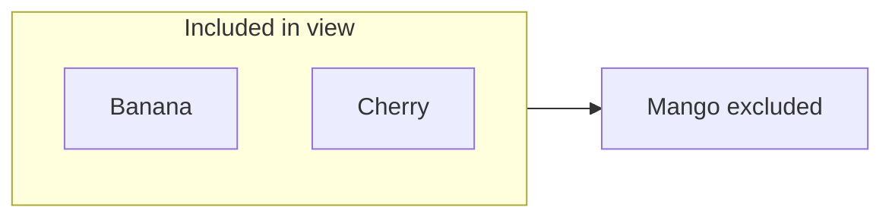

Classic `SortedSet.subSet(from, to)` uses **exclusive** `to`; this overload is why `NavigableSet` is used for precise ranges.

---

### `demonstrateTreeSetConstructors()` (called from launcher)

Runs immediately after `demonstrateNavigableSet()` because `navigableSet.demonstrateSet` calls `setConstructors("NavigableSet")`.

| Statement                                  | Constructor demonstrated | Printed idea                                |
| ------------------------------------------ | ------------------------ | ------------------------------------------- |
| `new TreeSet<>()`                          | No-arg                   | Empty sorted set `{}`                       |
| `new TreeSet<>(Comparator.reverseOrder())` | `TreeSet(Comparator)`    | Empty set ready for **reverse** sort        |
| `new TreeSet<>(source)`                    | `TreeSet(Collection)`    | Copies `Set.of("B","A")` → sorted `[A, B]`  |
| `new TreeSet<>(sortedSource)`              | `TreeSet(SortedSet)`     | Copies existing `SortedSet` with same order |

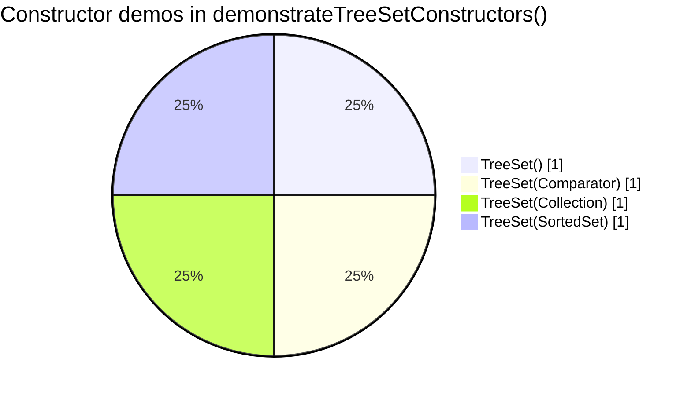

---

### `demonstrateTreeSetComparator()` (called from launcher)

Shows how **`Comparator`** defines sort order and how **`TreeSet` treats `compare == 0` as duplicate**.

| Block            | Methods used                                                                                           | Purpose                                                           |
| ---------------- | ------------------------------------------------------------------------------------------------------ | ----------------------------------------------------------------- |
| Natural order    | `new TreeSet<>()`, `add`, `comparator()`                                                               | `[Apple, Banana, Cherry]`; `comparator()` is **`null`** (natural) |
| Reverse          | `TreeSet<>(Comparator.reverseOrder())`, `addAll`                                                       | `[Cherry, Banana, Apple]`                                         |
| Length then name | `Comparator.comparingInt(length).thenComparing(...)`, `add`, `first()`, `last()`, `subSet("C","Java")` | Custom total order; **`first`/`last`** from `SortedSet`           |
| Length only      | `TreeSet<>(comparingInt(length))`, `add("Ruby")` after `"Java"`                                        | **`add` returns false** — same length ⇒ compare 0 ⇒ duplicate     |

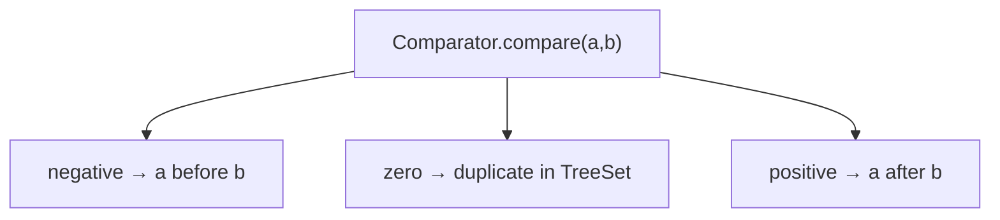

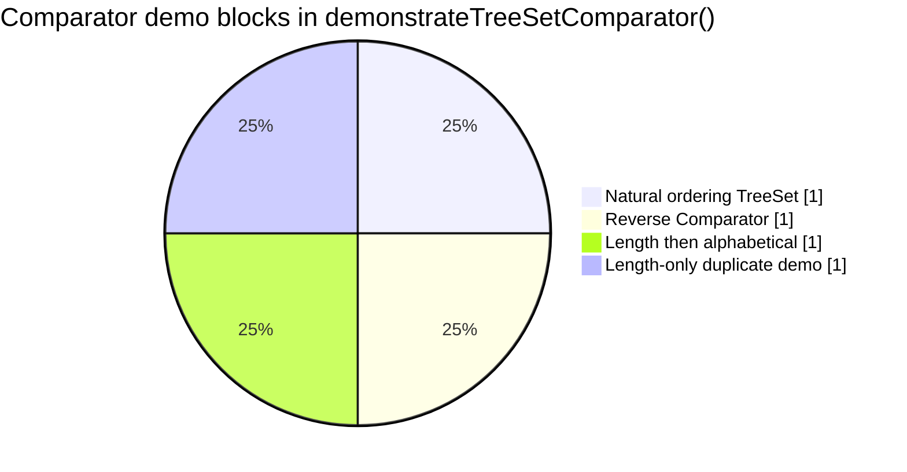

---

### `printDefaultCapacitySummary("NavigableSet")`

Called from **`navigableSet.main`** after `demonstrateSet` finishes.

```mermaid
sequenceDiagram
  participant Main as navigableSet.main
  participant CTI as CollectionTypeInspector
  Main->>CTI: printDefaultCapacitySummary("NavigableSet")
  CTI->>CTI: printTypeInfo(NavigableSet.class)
  CTI->>CTI: printDefaultInitialCapacity
  CTI->>CTI: printPublicMethods (all NavigableSet API names)
  CTI->>CTI: printBehaviorSummary
```

| Inspector step                | Output                                                                                                                     |
| ----------------------------- | -------------------------------------------------------------------------------------------------------------------------- |
| `printTypeInfo`               | `NavigableSet → INTERFACE`                                                                                                 |
| `printDefaultInitialCapacity` | Tree / no bucket table                                                                                                     |
| `printPublicMethods`          | Alphabetical list: `add()`, `ceiling()`, `descendingSet()`, `floor()`, `higher()`, `lower()`, `pollFirst()`, `subSet()`, … |
| `printBehaviorSummary`        | *SortedSet interface with nearest-match and descending-view operations*                                                    |

---

### What `NavigableSet` adds beyond `SortedSet`

```mermaid
flowchart LR
  subgraph inherited ["From SortedSet + Collection"]
    S1["first() / last()"]
    S2["comparator()"]
    S3["headSet / tailSet / subSet"]
    S4["add / remove / contains / iterator …"]
  end
  subgraph nav ["NavigableSet-only navigation"]
    N1["lower / floor / ceiling / higher"]
    N2["pollFirst / pollLast"]
    N3["descendingSet / descendingIterator"]
    N4["headSet / tailSet / subSet with inclusive flags"]
  end
  SortedSet["SortedSet"] --> inherited
  NavigableSet["NavigableSet"] --> inherited
  NavigableSet --> nav
  TreeSet["TreeSet (class)"] --> NavigableSet
```

| Layer              | Responsibility                                                                                                    |
| ------------------ | ----------------------------------------------------------------------------------------------------------------- |
| **`Set`**          | No duplicates; `add` / `remove` / `contains`                                                                      |
| **`SortedSet`**    | Total ordering; `first` / `last`; range views with **exclusive** upper bounds on classic overloads                |
| **`NavigableSet`** | **Closest element** queries; **descending** set view; range views with **explicit inclusive/exclusive** endpoints |
| **`TreeSet`**      | Concrete red-black tree implementation used in the demo                                                           |

Methods used in **`demonstrateNavigableSet()`** are documented step-by-step in [`demonstrateNavigableSet() — every statement explained`](#demonstratenavigableset--every-statement-explained). Other APIs on the interface (for example `pollFirst`, `headSet(to, inclusive)`) appear in the inspector list from [`printDefaultCapacitySummary`](#printdefaultcapacitysummarynavigableset).

```mermaid
mindmap
  root((NavigableSet API))
    Used in demonstrateNavigableSet
      add
      lower floor ceiling higher
      descendingSet
      subSet with flags
    Used in comparator demo
      comparator first last subSet
    On interface not in demo
      pollFirst pollLast
      descendingIterator
      headSet tailSet inclusive overloads
```

### Verified NavigableSet output

Excerpt from running `com.collection.set.navigableSet` (full log includes constructor and comparator blocks):

```text
===== NavigableSet (implemented by TreeSet) =====
----- Type Classification -----
  NavigableSet         -> INTERFACE
  SortedSet            -> INTERFACE
  TreeSet              -> CLASS
--------------------------------
Elements in natural sorted order: [Apple, Banana, Cherry, Mango]
lower("Cherry"): Banana
floor("Cherry"): Cherry
ceiling("Coconut"): Mango
higher("Cherry"): Mango
descendingSet(): [Mango, Cherry, Banana, Apple]
subSet("Banana", true, "Mango", false): [Banana, Cherry]
Core characteristic: NavigableSet adds nearest-match searches and descending views.
===== NavigableSet Details =====
----- Summary -----
  SortedSet interface with nearest-match and descending-view operations; TreeSet implements it.
```

### Run the NavigableSet demo

```bash
cd demo
mvn -q exec:java -Dexec.mainClass=com.collection.set.navigableSet
```

Main class: `com.collection.set.navigableSet`.

> **Also see:** [`sortedSet.java`](../../../demo/src/main/java/com/collection/set/sortedSet.java) for `first` / `last` / classic `headSet` & `tailSet` without nearest-match APIs; [`treeSet.java`](../../../demo/src/main/java/com/collection/set/treeSet.java) for the concrete class demo.

---


