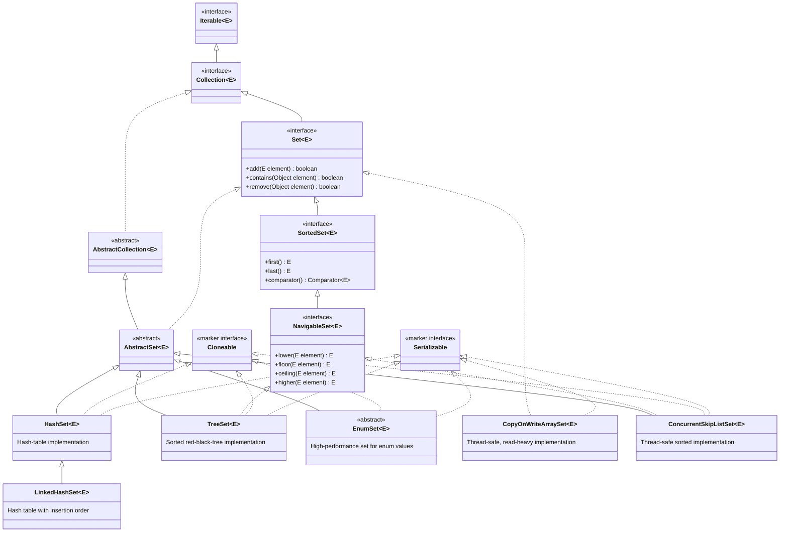

# Introduction 

<!-- TOC -->
- [Introduction](#introduction)
- [Collections](#collections)
- [Collection Definition](#collection-definition)
- [Collection Framework](#collection-framework)
- [9 key interfaces of Collection Framework](#9-key-interfaces-of-collection-framework)
- [Collection vs Collections](#collection-vs-collections)
- [List Interface](#list-interface)
  - [List Interface Hierarchy](#list-interface-hierarchy)
    - [Modern implementations](#modern-implementations)
    - [Legacy classes](#legacy-classes)
- [Set(I) Interface](#seti-interface)
  - [Set Interface Hierarchy](#set-interface-hierarchy)
    - [Common implementations](#common-implementations)
    - [Thread-safe implementations](#thread-safe-implementations)
- [SortedSet (I)](#sortedset-i)
- [Queue(I)](#queuei)
  - [Queue Interface Hierarchy](#queue-interface-hierarchy)
    - [Choosing a Queue implementation](#choosing-a-queue-implementation)
- [MAP (I)](#map-i)
<!-- /TOC -->

An array is an indexed collection of fixed number of homogeneous data elements 

The main advantage of arrays is we can represent multiple values by using single variable so that readability of the 
code will be improved

>limitations of arrays 

1.Arrays are fixed in size i.e once we create an array there is no chance of increasing or decreasing the size 
  based on our requirement due to this, to use arrays concept compulsory we should know the size in advance which may 
  not possible always.
2.Array can hold only homogeneous datatype elements 
  Student[] s = new Student[10000];
  s[0] = new Student(); valid 
  s[1] = new Customer(); 
  incompatible types | found : customer | required : Student
  We can solve this problem by using object type arrays 
  Object[] a = new Object[10000];
  a[0] = new Student(); |Valid
  a[1] = new Customer();|Valid
3.Arrays concept is not implemented based on some standard data structures and hence ready made method support 
  is not available, for every requirement we have to write the code explicitly which increases complexity of 
  programming.

# Collections 

1.Collections are growable in nature i.e based on our requirement we can increase or decrease the size 
2.Collections can hold both homgeneous and heterogeneous elements 
3.Every collection class is implemented based on some stanadard data structure, hence for every requirement ready made 
  method support is available
4.Being a programmer we are responsible to use those methods and we are not responsible to implement those methods

# Collection Definition 

If we want to represent a group of individual objects as a single entity then we should go for collection 

# Collection Framework 

It contains several classes and interfaces which can be used to represent a group of individual objects as a single entity 

# 9 key interfaces of Collection Framework 

1.Collection(I)
  a.If we want to represent a group of individual objects as a single entity then we should go for collection
  b.It defines the most coomon methods which are applicable for any coolection object 
  c.In general collection Interface is considered as root interface of collection Framework 
  d.There is no concvrete class which implements collection interace directly
2.List
3.Set
4.SortedSet
5.NavigableSet
6.Queue
7.Map
8.SortedMap
9.NavigableMap

# Collection vs Collections 

Collection is a interface , if we want to represent a group of individual objects as a single entity then we should go for collection 

Collections is an utility class present in java.util package to define several utility methods for collection objects 
(like sorting, searching etc.)

# List Interface

It is the child interface of collection, if we want to represent a group of individual objects with as a single entity 
where duplicates are allowed and insertion order must be preserved. Then we should go for List

## List Interface Hierarchy

The following diagram shows the main interfaces, abstract classes, concrete implementations, and legacy classes related to `java.util.List`. A solid arrow means **extends** and a dashed arrow means **implements**.

```mermaid
classDiagram
  direction TB

  class Iterable~E~ {
    <<interface>>
  }

  class Collection~E~ {
    <<interface>>
  }

  class List~E~ {
    <<interface>>
    +add(E element) boolean
    +get(int index) E
    +set(int index, E element) E
    +remove(int index) E
  }

  class RandomAccess {
    <<marker interface>>
  }- [Introduction](#introduction)
- [Collections](#collections)
- [Collection Definition](#collection-definition)
- [Collection Framework](#collection-framework)
- [9 key interfaces of Collection Framework](#9-key-interfaces-of-collection-framework)
- [Collection vs Collections](#collection-vs-collections)
- [List Interface](#list-interface)
  - [List Interface Hierarchy](#list-interface-hierarchy)
    - [Modern implementations](#modern-implementations)
    - [Legacy classes](#legacy-classes)
- [Set(I) Interface](#seti-interface)
  - [Set Interface Hierarchy](#set-interface-hierarchy)
    - [Common implementations](#common-implementations)
    - [Thread-safe implementations](#thread-safe-implementations)
- [SortedSet (I)](#sortedset-i)
- [Queue(I)](#queuei)
  - [Queue Interface Hierarchy](#queue-interface-hierarchy)
    - [Choosing a Queue implementation](#choosing-a-queue-implementation)
- [MAP (I)](#map-i)


  class Cloneable {
    <<marker interface>>
  }

  class Serializable {
    <<marker interface>>
  }

  class AbstractCollection~E~ {
    <<abstract>>
  }

  class AbstractList~E~ {
    <<abstract>>
  }

  class AbstractSequentialList~E~ {
    <<abstract>>
  }

  class ArrayList~E~ {
    Resizable-array implementation
  }

  class LinkedList~E~ {
    Doubly-linked-list implementation
  }

  class Vector~E~ {
    <<legacy>>
    Synchronized resizable array
  }

  class Stack~E~ {
    <<legacy>>
    LIFO stack; extends Vector
  }

  class CopyOnWriteArrayList~E~ {
    Thread-safe, read-heavy implementation
  }

  Iterable~E~ <|-- Collection~E~
  Collection~E~ <|-- List~E~
  Collection~E~ <|.. AbstractCollection~E~
  AbstractCollection~E~ <|-- AbstractList~E~
  AbstractList~E~ <|-- AbstractSequentialList~E~
  AbstractList~E~ <|-- ArrayList~E~
  AbstractSequentialList~E~ <|-- LinkedList~E~
  AbstractList~E~ <|-- Vector~E~
  Vector~E~ <|-- Stack~E~

  List~E~ <|.. AbstractList~E~
  List~E~ <|.. LinkedList~E~
  List~E~ <|.. CopyOnWriteArrayList~E~
  RandomAccess <|.. ArrayList~E~
  RandomAccess <|.. Vector~E~
  RandomAccess <|.. CopyOnWriteArrayList~E~
  Cloneable <|.. ArrayList~E~
  Cloneable <|.. LinkedList~E~
  Cloneable <|.. Vector~E~
  Cloneable <|.. CopyOnWriteArrayList~E~
  Serializable <|.. ArrayList~E~
  Serializable <|.. LinkedList~E~
  Serializable <|.. Vector~E~
  Serializable <|.. CopyOnWriteArrayList~E~
```

### Modern implementations

- **`ArrayList`**: usually the default choice for indexed access and appending elements.
- **`LinkedList`**: also implements `Deque`; useful when frequent insertions/removals occur at the ends of the list.

### Legacy classes

- **`Vector`**: a synchronized, resizable array retained for backward compatibility. Prefer `ArrayList` unless its legacy synchronization behavior is specifically required.
- **`Stack`**: a LIFO stack that extends `Vector`. Prefer `Deque`, for example `ArrayDeque`, for new stack implementations.

> `CopyOnWriteArrayList` is another `List` implementation in `java.util.concurrent`. It is designed for thread-safe, read-heavy situations and does not extend `AbstractList`.

# Set(I) Interface

1.It is the child interface of collection 
2.If we want to represent a group of individual objects as a single entity where duplicates are not allowed and insertion 
  order not required then we should go for Set.

## Set Interface Hierarchy

The following diagram shows the public, general-purpose Set interfaces and implementations. A solid arrow means **extends** and a dashed arrow means **implements**.



### Common implementations

- **`HashSet`**: the usual choice when unique elements are needed and no iteration order is required.
- **`LinkedHashSet`**: preserves insertion order while preventing duplicates.
- **`TreeSet`**: keeps elements sorted in their natural order or by a supplied `Comparator`.
- **`EnumSet`**: the most efficient choice when every element belongs to one enum type. Create it through factory methods such as `EnumSet.of(...)`; it cannot be instantiated directly.

### Thread-safe implementations

- **`CopyOnWriteArraySet`**: best for read-heavy sets with infrequent updates.
- **`ConcurrentSkipListSet`**: a sorted, concurrent `NavigableSet` for multi-threaded code.

> `BitSet` is not a `Set` implementation. It stores bits efficiently and has a different API. Sets returned by `Map.keySet()` are also views rather than separately declared, general-purpose Set implementation classes.

# SortedSet (I)

It is the child interface of Set if we want to represent a group of individual objects as a single entity where 
duplicates are not allowed and all objects should be inserted according to some sorting order then we should go for Sorted Set 

# Queue(I)

`Queue` is a child interface of `Collection` used to hold elements before processing. Most queue implementations process elements in **FIFO** (first-in, first-out) order. However, some implementations use a different ordering rule: for example, `PriorityQueue` processes the highest-priority element first.

Before sending a mail all mailId's we have to store in some data structure in which order we added mailId's in the same 
order only mail should be delivered.For this requirement Queue is best choice

`Queue` provides paired operations: one method throws an exception when it cannot complete the operation, while the other returns a special value instead.

| Operation         | Throws exception | Returns special value      |
| ----------------- | ---------------- | -------------------------- |
| Insert an element | `add(e)`         | `offer(e)` returns `false` |
| Remove the head   | `remove()`       | `poll()` returns `null`    |
| Inspect the head  | `element()`      | `peek()` returns `null`    |

> Most Queue implementations do not permit `null` elements because `poll()` and `peek()` use `null` to indicate that the queue is empty.

## Queue Interface Hierarchy

The diagram includes the public Queue-related interfaces and standard JDK implementations. A solid arrow means **extends** and a dashed arrow means **implements**.

```mermaid
classDiagram
  direction TB

  class Iterable~E~ {
    <<interface>>
  }

  class Collection~E~ {
    <<interface>>
  }

  class Queue~E~ {
    <<interface>>
    +add(E element) boolean
    +offer(E element) boolean
    +remove() E
    +poll() E
    +element() E
    +peek() E
  }

  class Deque~E~ {
    <<interface>>
    Double-ended queue
    +addFirst(E element)
    +addLast(E element)
    +pollFirst() E
    +pollLast() E
  }

  class BlockingQueue~E~ {
    <<interface>>
    +put(E element)
    +take() E
  }

  class BlockingDeque~E~ {
    <<interface>>
    Blocking double-ended queue
  }

  class TransferQueue~E~ {
    <<interface>>
    +transfer(E element)
  }

  class AbstractCollection~E~ {
    <<abstract>>
  }

  class AbstractQueue~E~ {
    <<abstract>>
  }

  class ArrayDeque~E~ {
    Resizable-array deque
  }

  class LinkedList~E~ {
    Doubly-linked list and deque
  }

  class PriorityQueue~E~ {
    Priority-heap queue
  }

  class ConcurrentLinkedQueue~E~ {
    Non-blocking concurrent FIFO queue
  }

  class ConcurrentLinkedDeque~E~ {
    Non-blocking concurrent deque
  }

  class ArrayBlockingQueue~E~ {
    Bounded blocking FIFO queue
  }

  class LinkedBlockingQueue~E~ {
    Optionally bounded blocking FIFO queue
  }

  class PriorityBlockingQueue~E~ {
    Unbounded blocking priority queue
  }

  class DelayQueue~E~ {
    Delayed-element blocking queue
  }

  class SynchronousQueue~E~ {
    Zero-capacity hand-off queue
  }

  class LinkedBlockingDeque~E~ {
    Optionally bounded blocking deque
  }

  class LinkedTransferQueue~E~ {
    Non-blocking transfer queue
  }

  Iterable~E~ <|-- Collection~E~
  Collection~E~ <|-- Queue~E~
  Queue~E~ <|-- Deque~E~
  Queue~E~ <|-- BlockingQueue~E~
  Deque~E~ <|-- BlockingDeque~E~
  BlockingQueue~E~ <|-- BlockingDeque~E~
  BlockingQueue~E~ <|-- TransferQueue~E~

  Collection~E~ <|.. AbstractCollection~E~
  AbstractCollection~E~ <|-- AbstractQueue~E~
  Queue~E~ <|.. AbstractQueue~E~
  AbstractCollection~E~ <|-- ArrayDeque~E~
  AbstractQueue~E~ <|-- PriorityQueue~E~
  AbstractQueue~E~ <|-- ConcurrentLinkedQueue~E~
  AbstractCollection~E~ <|-- ConcurrentLinkedDeque~E~
  AbstractQueue~E~ <|-- ArrayBlockingQueue~E~
  AbstractQueue~E~ <|-- LinkedBlockingQueue~E~
  AbstractQueue~E~ <|-- PriorityBlockingQueue~E~
  AbstractQueue~E~ <|-- DelayQueue~E~
  AbstractQueue~E~ <|-- SynchronousQueue~E~
  AbstractQueue~E~ <|-- LinkedBlockingDeque~E~
  AbstractQueue~E~ <|-- LinkedTransferQueue~E~

  Deque~E~ <|.. ArrayDeque~E~
  Deque~E~ <|.. LinkedList~E~
  Deque~E~ <|.. ConcurrentLinkedDeque~E~
  Queue~E~ <|.. PriorityQueue~E~
  Queue~E~ <|.. ConcurrentLinkedQueue~E~
  BlockingQueue~E~ <|.. ArrayBlockingQueue~E~
  BlockingQueue~E~ <|.. LinkedBlockingQueue~E~
  BlockingQueue~E~ <|.. PriorityBlockingQueue~E~
  BlockingQueue~E~ <|.. DelayQueue~E~
  BlockingQueue~E~ <|.. SynchronousQueue~E~
  BlockingDeque~E~ <|.. LinkedBlockingDeque~E~
  TransferQueue~E~ <|.. LinkedTransferQueue~E~
```



### Choosing a Queue implementation

- **`ArrayDeque`**: the usual choice for a FIFO queue, deque, or stack in single-threaded code. It is generally preferred over the legacy `Stack` class.
- **`LinkedList`**: implements both `List` and `Deque`; use it when those linked-list characteristics are specifically useful.
- **`PriorityQueue`**: use when processing must follow natural ordering or a `Comparator`, rather than FIFO order.
- **`ArrayBlockingQueue`** and **`LinkedBlockingQueue`**: use for producer-consumer workflows where a capacity limit and blocking behavior are useful.
- **`ConcurrentLinkedQueue`** and **`ConcurrentLinkedDeque`**: use for non-blocking, thread-safe operations.
- **`SynchronousQueue`**: use for direct hand-off between a producer and a consumer; it never stores an element.
- **`DelayQueue`**: use when an element must not be retrieved until its delay expires.
- **`LinkedTransferQueue`**: use when producers may need to wait until consumers receive an element.

> The legacy `Stack` class is not a `Queue` implementation. For new LIFO stack code, use `Deque`, normally `ArrayDeque`.

# MAP (I)

Map is not child interface of Collection (I) 


