# Java Collections Guide

> A practical study guide to Java collection interfaces, implementations, constructors, methods, cursors, capacities, and selection rules.

> **Tip:** Open this file in **Markdown Preview** (`Ctrl+Shift+V`) to view formatted tables, diagrams, and clickable links.

---

## Introduction 

<!-- TOC -->
- [Java Collections Guide](#java-collections-guide)
  - [Introduction](#introduction)
  - [Collections](#collections)
  - [Collection Definition](#collection-definition)
  - [Collection Framework](#collection-framework)
  - [9 key interfaces of Collection Framework](#9-key-interfaces-of-collection-framework)
  - [Collection vs Collections](#collection-vs-collections)
  - [RandomAccess Interface](#randomaccess-interface)
  - [List Interface](#list-interface)
  - [List Interface Hierarchy](#list-interface-hierarchy)
    - [ArrayList](#arraylist)
    - [Difference between ArrayList and Vector](#difference-between-arraylist-and-vector)
    - [LinkedList](#linkedlist)
    - [Difference between ArrayList and LinkedList](#difference-between-arraylist-and-linkedlist)
    - [Modern implementations](#modern-implementations)
    - [Legacy classes](#legacy-classes)
  - [List Methods](#list-methods)
    - [Index-based List operations](#index-based-list-operations)
    - [`Collection` operations available on every List](#collection-operations-available-on-every-list)
    - [Java 21 ordered-end methods](#java-21-ordered-end-methods)
    - [Static factory methods](#static-factory-methods)
  - [List Cursors](#list-cursors)
    - [`Iterator<E>` methods](#iteratore-methods)
    - [`ListIterator<E>` additional methods](#listiteratore-additional-methods)
    - [Legacy `Enumeration<E>` methods](#legacy-enumeratione-methods)
  - [Vector](#vector)
  - [Constructors for all collection data structures](#constructors-for-all-collection-data-structures)
  - [List constructor examples](#list-constructor-examples)
  - [Stack](#stack)
  - [Set constructor examples](#set-constructor-examples)
  - [Queue constructor examples](#queue-constructor-examples)
  - [Map constructor examples](#map-constructor-examples)
  - [Hashtable — complete execution flow (`hashTableDemo.java`)](#hashtable--complete-execution-flow-hashtabledemojava)
    - [Source files](#source-files)
    - [Default bucket table and load factor](#default-bucket-table-and-load-factor)
    - [How a key picks a bucket](#how-a-key-picks-a-bucket)
    - [End-to-end execution flow](#end-to-end-execution-flow)
    - [Bucket allocation after all `put` calls](#bucket-allocation-after-all-put-calls)
    - [Whiteboard view of the 11 buckets](#whiteboard-view-of-the-11-buckets)
    - [Collision chaining at bucket 5](#collision-chaining-at-bucket-5)
    - [How `println` walks the table](#how-println-walks-the-table)
    - [Verified program output](#verified-program-output)
    - [Run the demo](#run-the-demo)
  - [Set (I) Interface](#set-i-interface)
  - [Set Interface Hierarchy](#set-interface-hierarchy)
    - [Common implementations](#common-implementations)
    - [Thread-safe implementations](#thread-safe-implementations)
    - [HashSet (C)](#hashset-c)
    - [Fill Ratio | Load Factor](#fill-ratio--load-factor)
  - [HashSet vs LinkedHashSet](#hashset-vs-linkedhashset)
    - [Shared properties](#shared-properties)
    - [SortedSet (I)](#sortedset-i)
  - [Queue (I)](#queue-i)
  - [Queue Interface Hierarchy](#queue-interface-hierarchy)
    - [Choosing a Queue implementation](#choosing-a-queue-implementation)
  - [Map (I)](#map-i)
  - [Map Interface Hierarchy](#map-interface-hierarchy)
    - [Interfaces](#interfaces)
    - [Classes](#classes)
  - [Map Collection Views](#map-collection-views)
  - [Choosing a Map Implementation](#choosing-a-map-implementation)
  - [Checking Whether a Collection Type Is a Class or an Interface](#checking-whether-a-collection-type-is-a-class-or-an-interface)
    - [The formatting line — `CollectionTypeInspector.java` line 15](#the-formatting-line--collectiontypeinspectorjava-line-15)
    - [Example output](#example-output)
<!-- /TOC -->

> **Quick navigation:** for a focused, side-by-side comparison reference, open [Differences in Java Collections](differences-in-collections.md).

An array is an indexed collection of a fixed number of homogeneous data elements.

The main advantage of arrays is that we can represent multiple values by using a single variable, so the readability of the code will be improved.

### Limitations of arrays

1. Arrays are fixed in size. Once we create an array, there is no chance of increasing or decreasing the size based on our requirement. Because of this, to use the array concept we must know the size in advance, which may not always be possible.
2. An array can hold only homogeneous data-type elements.

   ```java
   Student[] s = new Student[10000];
   s[0] = new Student(); // valid
   s[1] = new Customer(); // incompatible types | found: Customer | required: Student
   ```

   We can solve this problem by using object-type arrays:

   ```java
   Object[] a = new Object[10000];
   a[0] = new Student(); // valid
   a[1] = new Customer(); // valid
   ```

3. The array concept is not implemented based on a standard data structure, so ready-made method support is not available. For every requirement we have to write the code explicitly, which increases the complexity of programming.

---

## Collections

1. Collections are growable in nature; based on our requirement we can increase or decrease the size.
2. Collections can hold both homogeneous and heterogeneous elements.
3. Every collection class is implemented based on some standard data structure, so ready-made method support is available for every requirement.
4. As programmers, we are responsible for using those methods; we are not responsible for implementing them.
5. Usually we can use collections to hold and transfer objects from one location to another location (container). To support this requirement, every collection class by default implements `Serializable` and `Cloneable` interfaces.
6. `ArrayList` and `Vector` classes implement the `RandomAccess` interface so that any random element can be accessed with the same speed.

## Collection Definition

If we want to represent a group of individual objects as a single entity, then we should go for a collection.

## Collection Framework

It contains several classes and interfaces that can be used to represent a group of individual objects as a single entity.

## 9 key interfaces of Collection Framework 

1. `Collection` (I)
   - If we want to represent a group of individual objects as a single entity then we should go for collection.
   - It defines the most coomon methods which are applicable for any coolection object.
   - In general collection Interface is considered as root interface of collection Framework.
   - There is no concvrete class which implements collection interace directly.
2. `List`
3. `Set`
4. `SortedSet`
5. `NavigableSet`
6. `Queue`
7. `Map`
8. `SortedMap`
9. `NavigableMap`

## Collection vs Collections

`Collection` is an interface. If we want to represent a group of individual objects as a single entity, then we should go for a collection.

`Collections` is a utility class present in the `java.util` package used to define several utility methods for collection objects (like sorting, searching, and so on).

## RandomAccess Interface

`RandomAccess` is present in the `java.util` package. It does not contain any methods; it is a marker interface where the required ability is provided automatically by the JVM.

---

## List Interface

It is the child interface of collection, if we want to represent a group of individual objects with as a single entity 
where duplicates are allowed and insertion order must be preserved. Then we should go for List

## List Interface Hierarchy

The following diagram shows the main interfaces, abstract classes, concrete implementations, and legacy classes related to `java.util.List`. A solid arrow means **extends** and a dashed arrow means **implements**.

### ArrayList

`ArrayList` is the best choice for retrieval operations because `ArrayList` implements the `RandomAccess` interface.

`ArrayList` is the worst choice if the frequent operation is insertion and deletion in the middle.

### Difference between ArrayList and Vector

| Topic | `ArrayList` | `Vector` |
| ----- | ----------- | -------- |
| Synchronization | Every method present in `ArrayList` is non-synchronized. | Every method present in `Vector` is synchronized. |
| Thread safety | At a time, multiple threads are allowed to operate on an `ArrayList` object, and hence it is not thread-safe. | At a time, only one thread is allowed to operate on a `Vector` object, and hence it is thread-safe. |
| Performance | Relatively high performance because threads are not required to wait to operate on an `ArrayList` object. | Relatively low performance because threads are required to wait to operate on a `Vector` object. |
| Version | Introduced in 1.2 v and it is non-legacy. | Introduced in 1.0 v and it is legacy. |

By default, `ArrayList` is non-synchronized, but we can get a synchronized version of an `ArrayList` object by using the `synchronizedList()` method of the `Collections` class:

```java
public static List synchronizedList(List l)
```

Refer to this example: [synchornizedCollections.java](../../../demo/src/main/java/com/collections/collectionBaseClasses/synchornizedCollections.java) in the collections folder.

```java
ArrayList l = new ArrayList();
List l1 = Collections.synchronizedList(l);
// l is non-synchronized
// l1 is synchronized
```

Similarly, we can get synchronized versions of `Set` and `Map` objects by using the following methods of the `Collections` class:

```java
public static Set synchronizedSet(Set s)
public static Map synchronizedMap(Map m)
```

### LinkedList

- The underlying data structure is a doubly linked list.
- Insertion order is preserved.
- Duplicate objects are allowed.
- Heterogeneous objects are allowed.
- `null` insertion is possible.
- `LinkedList` implements `Serializable` and `Cloneable` interfaces but not `RandomAccess`.
- `LinkedList` is the best choice if the frequent operation is insertion or deletion in the middle.
- `LinkedList` is the worst choice if the frequent operation is retrieval.

#### Constructors

| Constructor | Description |
| ----------- | ----------- |
| `LinkedList l = new LinkedList();` | Creates an empty list object. |
| `LinkedList l = new LinkedList(Collection c);` | Creates an equivalent `LinkedList` object for the given collection. |

#### LinkedList class-specific methods

Usually we can use `LinkedList` to develop stacks and queues. To provide support for this requirement, the `LinkedList` class defines the following specific methods:

| Method | Description |
| ------ | ----------- |
| `void addFirst(Object o)` | Inserts an element at the beginning. |
| `void addLast(Object o)` | Inserts an element at the end. |
| `Object getFirst()` | Returns the first element. |
| `Object getLast()` | Returns the last element. |
| `Object removeFirst()` | Removes and returns the first element. |
| `Object removeLast()` | Removes and returns the last element. |

### Difference between ArrayList and LinkedList

| Topic | `ArrayList` | `LinkedList` |
| ----- | ----------- | ------------ |
| Data structure | Internally uses a resizable array data structure. | Internally uses a doubly linked list data structure. |
| Best for | Retrieval operations. | Insertion or deletion in the middle. |
| Worst for | Insertion or deletion in the middle because it requires shifting of elements. | Retrieval because it does not support index-based access; it has to traverse from the beginning or end. |
| `RandomAccess` | Implements `RandomAccess`, so any random element can be accessed with the same speed. | Does not implement `RandomAccess`, so random access performance is poor. |
| Memory usage | Consumes less memory because it just holds the elements. | Consumes more memory because for every element it has to hold data, a previous-node reference, and a next-node reference. |
| Version | Introduced in 1.2 v and it is non-legacy. | Introduced in 1.2 v and it is non-legacy. |

Refer to this example: [internalProcessOfLinkedList.java](../../../demo/src/main/java/com/collections/list/internalProcessOfLinkedList.java) in the list folder.

                                                
 
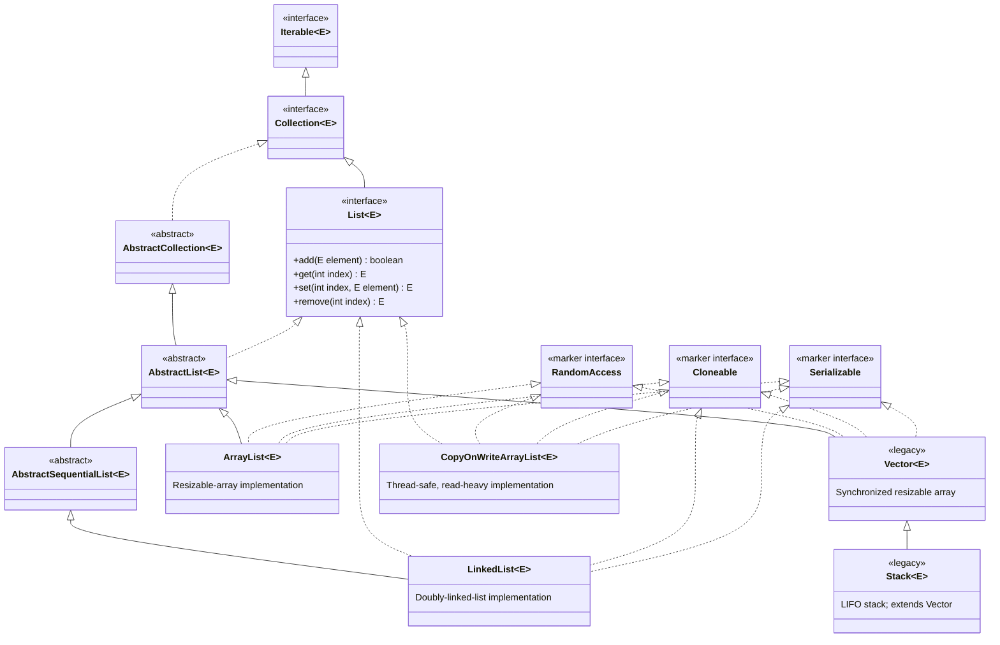

### Modern implementations

- **`ArrayList`**: usually the default choice for indexed access and appending elements.
- **`LinkedList`**: also implements `Deque`; useful when frequent insertions/removals occur at the ends of the list.

### Legacy classes

- **`Vector`**: a synchronized, resizable array retained for backward compatibility. Prefer `ArrayList` unless its legacy synchronization behavior is specifically required.
- **`Stack`**: a LIFO stack that extends `Vector`. Prefer `Deque`, for example `ArrayDeque`, for new stack implementations.

> `CopyOnWriteArrayList` is another `List` implementation in `java.util.concurrent`. It is designed for thread-safe, read-heavy situations and does not extend `AbstractList`.

## List Methods

`List<E>` includes the methods inherited from `Collection<E>` and adds index-based operations. In Java 21, `List` also inherits ordered-end operations from `SequencedCollection<E>`. Indexes start at `0`; an index used to **read, replace, or remove** must be from `0` through `size() - 1`, while an index used to **insert** may also be `size()`.

### Index-based List operations

| Method                                        | Definition                                                                                                                                                                                        |
| --------------------------------------------- | ------------------------------------------------------------------------------------------------------------------------------------------------------------------------------------------------- |
| `E get(int index)`                            | Returns the element at `index`.                                                                                                                                                                   |
| `E set(int index, E element)`                 | Replaces the element at `index` and returns the element that was replaced.                                                                                                                        |
| `void add(int index, E element)`              | Inserts an element before the current element at `index`. Existing elements at and after that position shift right.                                                                               |
| `boolean add(E element)`                      | Appends an element to the end of the list and returns `true` if it changed.                                                                                                                       |
| `E remove(int index)`                         | Removes and returns the element at `index`. Remaining elements shift left.                                                                                                                        |
| `boolean remove(Object value)`                | Removes the first occurrence equal to `value`; returns whether an element was removed.                                                                                                            |
| `int indexOf(Object value)`                   | Returns the index of the first matching value, or `-1` when absent.                                                                                                                               |
| `int lastIndexOf(Object value)`               | Returns the index of the last matching value, or `-1` when absent.                                                                                                                                |
| `List<E> subList(int fromIndex, int toIndex)` | Returns a backed view containing positions `fromIndex` (inclusive) through `toIndex` (exclusive). Structural changes to the original list outside that view make later view operations undefined. |
| `ListIterator<E> listIterator()`              | Returns a bidirectional cursor positioned before index `0`.                                                                                                                                       |
| `ListIterator<E> listIterator(int index)`     | Returns a bidirectional cursor positioned before the specified `index`.                                                                                                                           |
| `void replaceAll(UnaryOperator<E> operator)`  | Replaces every element with the result of applying `operator`; a default method.                                                                                                                  |
| `void sort(Comparator<? super E> comparator)` | Sorts the list in place. Passing `null` uses natural ordering; a default method.                                                                                                                  |

### `Collection` operations available on every List

| Method                                                      | Definition                                                              |
| ----------------------------------------------------------- | ----------------------------------------------------------------------- |
| `int size()`                                                | Returns the number of elements.                                         |
| `boolean isEmpty()`                                         | Returns `true` when `size()` is `0`.                                    |
| `boolean contains(Object value)`                            | Tests whether a matching value is present.                              |
| `Iterator<E> iterator()`                                    | Returns the standard forward-only cursor.                               |
| `Object[] toArray()`                                        | Copies list elements into a new `Object[]`.                             |
| `<T> T[] toArray(T[] array)`                                | Copies elements into a compatible array, reusing it when large enough.  |
| `boolean addAll(Collection<? extends E> values)`            | Appends all values from a collection; returns whether the list changed. |
| `boolean addAll(int index, Collection<? extends E> values)` | Inserts all values before `index`; this overload is declared by `List`. |
| `boolean containsAll(Collection<?> values)`                 | Tests whether every supplied value is present.                          |
| `boolean removeAll(Collection<?> values)`                   | Removes every element that also occurs in `values`.                     |
| `boolean retainAll(Collection<?> values)`                   | Keeps only elements that occur in `values`.                             |
| `void clear()`                                              | Removes all elements.                                                   |
| `boolean removeIf(Predicate<? super E> filter)`             | Removes elements matching the predicate; a default method.              |
| `Spliterator<E> spliterator()`                              | Returns a spliterator for sequential or parallel traversal.             |
| `Stream<E> stream()`                                        | Returns a sequential stream of the elements.                            |
| `Stream<E> parallelStream()`                                | Returns a parallel stream of the elements.                              |
| `boolean equals(Object other)`                              | Tests list equality: same size and equal elements in the same order.    |
| `int hashCode()`                                            | Returns the hash code defined consistently with `equals()`.             |

### Java 21 ordered-end methods

These methods are inherited from `SequencedCollection<E>`, which `List<E>` extends in Java 21.

| Method                     | Definition                                                           |
| -------------------------- | -------------------------------------------------------------------- |
| `E getFirst()`             | Returns the first element; throws `NoSuchElementException` if empty. |
| `E getLast()`              | Returns the last element; throws `NoSuchElementException` if empty.  |
| `void addFirst(E element)` | Inserts an element at index `0`.                                     |
| `void addLast(E element)`  | Appends an element at the end.                                       |
| `E removeFirst()`          | Removes and returns the first element.                               |
| `E removeLast()`           | Removes and returns the last element.                                |
| `List<E> reversed()`       | Returns a reverse-ordered view backed by the original list.          |

### Static factory methods

| Method                                        | Definition                                                                                          |
| --------------------------------------------- | --------------------------------------------------------------------------------------------------- |
| `List.of()`                                   | Creates an unmodifiable list. Overloads accept zero or more elements; `null` elements are rejected. |
| `List.copyOf(Collection<? extends E> values)` | Creates an unmodifiable list containing the supplied values; `null` elements are rejected.          |

> Methods that modify a list can throw `UnsupportedOperationException` for an unmodifiable or fixed-size list, such as a list made with `List.of(...)` or `Arrays.asList(...)`.

## List Cursors

A **cursor** moves through a collection and reads, and sometimes modifies, its elements. Java provides `Iterator` for all collections, `ListIterator` specifically for lists, and the legacy `Enumeration` cursor for `Vector`.

For complete runnable examples, use the Ctrl+clickable section links: [`Iterator<E>`](cursors.md#1-iteratore), [`ListIterator<E>`](cursors.md#2-listiteratore), [`Enumeration<E>`](cursors.md#3-enumeratione), and [`Spliterator<E>`](cursors.md#4-spliteratore). The complete guide is [Cursors in Java Collections](cursors.md), and the source is [cursors.java](../../../demo/src/main/java/com/collections/cursors.java).

| Cursor            | Obtained from         | Direction            | Can modify?                      | Definition                                                                      |
| ----------------- | --------------------- | -------------------- | -------------------------------- | ------------------------------------------------------------------------------- |
| `Iterator<E>`     | `list.iterator()`     | Forward only         | `remove()` only                  | Standard cursor available for every `Collection`.                               |
| `ListIterator<E>` | `list.listIterator()` | Forward and backward | `add()`, `set()`, and `remove()` | List-specific cursor that knows its position.                                   |
| `Enumeration<E>`  | `vector.elements()`   | Forward only         | No                               | Legacy read-only cursor for `Vector` and older APIs; it is not a `List` method. |

### `Iterator<E>` methods

| Method                                              | Definition                                                                                                     |
| --------------------------------------------------- | -------------------------------------------------------------------------------------------------------------- |
| `boolean hasNext()`                                 | Returns whether another element exists in the forward direction.                                               |
| `E next()`                                          | Returns the next element and advances the cursor. Throws `NoSuchElementException` if there is no next element. |
| `void remove()`                                     | Removes the last element returned by `next()`. It can be called only once per successful `next()` call.        |
| `void forEachRemaining(Consumer<? super E> action)` | Applies `action` to all remaining elements; a default method.                                                  |

### `ListIterator<E>` additional methods

`ListIterator` inherits every `Iterator` method and adds the following operations.

| Method                  | Definition                                                                              |
| ----------------------- | --------------------------------------------------------------------------------------- |
| `boolean hasPrevious()` | Returns whether an element exists in the backward direction.                            |
| `E previous()`          | Returns the previous element and moves the cursor backward.                             |
| `int nextIndex()`       | Returns the index that a following `next()` would return.                               |
| `int previousIndex()`   | Returns the index that a following `previous()` would return, or `-1` at the beginning. |
| `void add(E element)`   | Inserts an element at the cursor position.                                              |
| `void set(E element)`   | Replaces the last element returned by `next()` or `previous()`.                         |
| `void remove()`         | Removes the last element returned by `next()` or `previous()`.                          |

### Legacy `Enumeration<E>` methods

| Method                      | Definition                                                                 |
| --------------------------- | -------------------------------------------------------------------------- |
| `boolean hasMoreElements()` | Returns whether another element is available.                              |
| `E nextElement()`           | Returns the next element. Throws `NoSuchElementException` if none remains. |

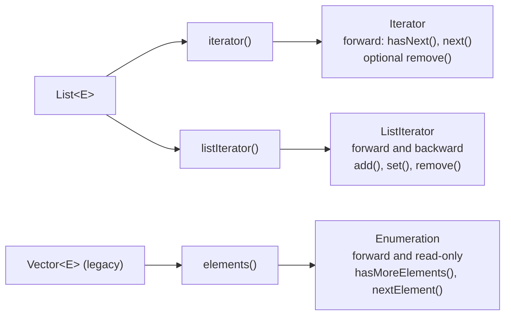

> Do not structurally modify a normal list directly while iterating over it. Use `Iterator.remove()` or `ListIterator` methods instead; otherwise a fail-fast iterator commonly throws `ConcurrentModificationException`.

---

## Vector 

1. The underlying data structure is resizeble or growable array 
2. Insertion order is preserved 
3. Duplicates are allowed.
4. Heterogeneous objects are allowed
5. null insertion is possible 
6. It implements Serializable ,Cloneable and RandomAccess interfaces
7. Every method present in the vector is synchronized and hence vector object is thread safe

Constructors

>Vector v = new Vector();

>Vector v = new Vector(int initialCapacity);

Creates an empty vector object with specified initial capacity 

>Vector v = new Vector(int initialCapacity, int incrementalCapacity);

>Vector v = new Vector(Collection c);

Creates an equivalent vector Object for the given collection this constructor meant for interconvertion between
collection objects

---

## Constructors for all collection data structures

The following methods demonstrate the constructors for each data structure. Ctrl+click a method name to open its Java implementation:

- [List constructors — `listConstructors(String)`](../../../demo/src/main/java/com/collections/list/listDemo.java)

## List constructor examples

```java
new ArrayList<>();
new ArrayList<>(20);
new ArrayList<>(collection);

new LinkedList<>();
new LinkedList<>(collection);

new Vector<>();
new Vector<>(20);
new Vector<>(20, 5);
new Vector<>(collection);


```
---

## Stack 

It is the child class of vector , it is a specially designed class for last in firsat out order(LIFO) 

Constructor 

Stack s = new Stack<>();


`Stack` has only its no-argument constructor. It inherits the vector-based storage behavior from `Vector`.

## Set constructor examples


```java
new HashSet<>();
new HashSet<>(20);
new HashSet<>(20, 0.80f);
new HashSet<>(collection);

new LinkedHashSet<>();
new LinkedHashSet<>(20);
new LinkedHashSet<>(20, 0.80f);
new LinkedHashSet<>(collection);

new TreeSet<>();
new TreeSet<>(Comparator.reverseOrder());
new TreeSet<>(collection);
new TreeSet<>(sortedSet);
```

`TreeSet` accepts a comparator for custom ordering and a `SortedSet` to preserve its sorted-source behavior.

## Queue constructor examples

```java
new LinkedList<>();
new LinkedList<>(collection);

new ArrayDeque<>();
new ArrayDeque<>(20);
new ArrayDeque<>(collection);

new PriorityQueue<>();
new PriorityQueue<>(20);
new PriorityQueue<>(Comparator.reverseOrder());
new PriorityQueue<>(20, Comparator.reverseOrder());
new PriorityQueue<>(collection);
new PriorityQueue<>(priorityQueue);
new PriorityQueue<>(sortedSet);
```

`LinkedList` can act as both a `List` and a `Queue`. `PriorityQueue` also provides copy constructors for another `PriorityQueue` and a `SortedSet`.

## Map constructor examples

```java
new HashMap<>();
new HashMap<>(20);
new HashMap<>(20, 0.80f);
new HashMap<>(map);

new LinkedHashMap<>();
new LinkedHashMap<>(20);
new LinkedHashMap<>(20, 0.80f);
new LinkedHashMap<>(20, 0.80f, true); // access-order mode
new LinkedHashMap<>(map);

new TreeMap<>();
new TreeMap<>(Comparator.reverseOrder());
new TreeMap<>(map);
new TreeMap<>(sortedMap);

new Hashtable<>();
new Hashtable<>(20);
new Hashtable<>(20, 0.80f);
new Hashtable<>(map);
```

The integer argument controls initial capacity, the `float` argument controls load factor, and the collection/map argument copies entries from an existing object.

---

## Hashtable — complete execution flow (`hashTableDemo.java`)

This section follows the runnable demo that shows **how many buckets exist**, **where each entry lands**, and **why `println` order is not insertion order**.

### Source files

| File | Role |
| ---- | ---- |
| [hashTableDemo.java](../../../demo/src/main/java/com/collections/hashTable/basicflow/hashTableDemo.java) | Creates a `Hashtable`, inserts six keys, prints the table |
| [hashTableBase.java](../../../demo/src/main/java/com/collections/hashTable/basicflow/hashTableBase.java) | Key type: stores `int i`, overrides `hashCode()` to return `i`, overrides `toString()` to return `i` as text |
| [hashTable.java](../../../demo/src/main/java/com/collections/map/hashTable.java) | Optional entry point that runs the broader `Hashtable` map demo via `mapDemo` |

`hashTableDemo` uses **custom keys** so bucket indices are predictable. In real code, `hashCode()` is rarely equal to a small integer, but the **bucket formula is the same**.

### Default bucket table and load factor

For `new Hashtable<>()` (no-arg constructor), the JDK uses:

| Setting | Default value | Meaning in this demo |
| ------- | ------------- | -------------------- |
| **Number of buckets** | **11** | Internal array length; valid bucket indexes are **0 … 10** |
| **Load factor** | **0.75** | Rehash when `size` exceeds `capacity × load factor` |
| **Rehash threshold** | **8** | `11 × 0.75 = 8` (integer truncation) |

Six `put` operations are performed, so `size = 6` and **no rehash** occurs. The table stays at **11 buckets**.

### How a key picks a bucket

For each `put(key, value)`:

1. Call `key.hashCode()` → for `hashTableBase`, this is the field `i`.
2. Compute `index = (hashCode & 0x7FFFFFFF) % table.length` → with length **11**, this is `i % 11` for non-negative `i`.
3. If the bucket is empty, store the entry there.
4. If the bucket already has entries (**collision**), link the new entry into a **chain** at that bucket (separate chaining).
5. If `size` exceeds the threshold, **rehash** into a larger bucket array (not triggered in this demo).

| `put` order | Key (`hashTableBase`) | `hashCode()` | `index = hash % 11` | Value |
| ----------- | --------------------- | ------------ | ------------------- | ----- |
| 1 | `5` | 5 | **5** | `value1` |
| 2 | `2` | 2 | **2** | `value2` |
| 3 | `6` | 6 | **6** | `value3` |
| 4 | `15` | 15 | **4** | `value4` |
| 5 | `23` | 23 | **1** | `value5` |
| 6 | `16` | 16 | **5** | `value6` (collides with key `5`) |

> `Hashtable` does **not** allow `null` keys or `null` values. The commented line `table.put("durga", null)` would throw `NullPointerException`.

### End-to-end execution flow

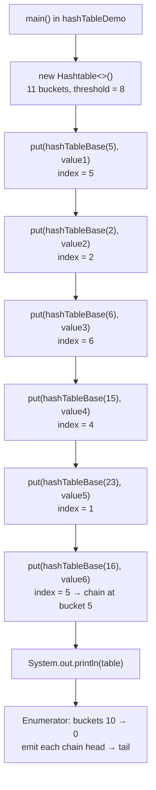

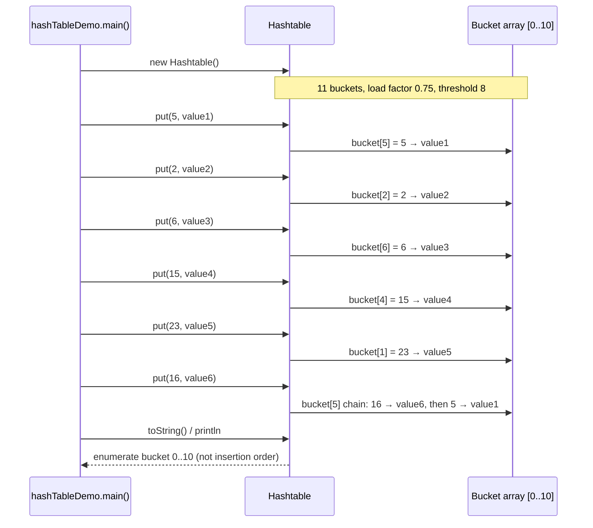

### Bucket allocation after all `put` calls

Logical view of the **11 buckets** (only **6** hold data; **5** are empty). See [Whiteboard view of the 11 buckets](#whiteboard-view-of-the-11-buckets) for the same layout as a classroom diagram.

| Bucket index | Contents (head → tail of chain) | Notes |
| ------------ | --------------------------------- | ----- |
| 0 | — | empty |
| 1 | `23=value5` | |
| 2 | `2=value2` | |
| 3 | — | empty |
| 4 | `15=value4` | |
| 5 | `16=value6` → `5=value1` | **collision**; two keys share bucket 5 |
| 6 | `6=value3` | |
| 7–10 | — | empty |

### Whiteboard view of the 11 buckets

The diagram below matches the usual classroom sketch: a **vertical array of 11 slots** (indexes **0** at the bottom through **10** at the top), each `put` landing at `hashCode % 11`, with **bucket 5** holding two entries after a collision.


The whiteboard uses a `Temp` key (`hashCode()` returns `i`) and values **A–F**. This repo’s [hashTableDemo.java](../../../demo/src/main/java/com/collections/hashTable/basicflow/hashTableDemo.java) is the same logic with [hashTableBase](../../../demo/src/main/java/com/collections/hashTable/basicflow/hashTableBase.java) keys and `value1`–`value6`:

| Classroom (`Temp` + letter) | This demo (`hashTableBase` + value) | `hash % 11` → bucket |
| --------------------------- | ----------------------------------- | -------------------- |
| `put(new Temp(5), "A")` | `put(new hashTableBase(5), "value1")` | **5** |
| `put(new Temp(2), "B")` | `put(new hashTableBase(2), "value2")` | **2** |
| `put(new Temp(6), "C")` | `put(new hashTableBase(6), "value3")` | **6** |
| `put(new Temp(15), "D")` | `put(new hashTableBase(15), "value4")` | **4** (`15 % 11 = 4`) |
| `put(new Temp(23), "E")` | `put(new hashTableBase(23), "value5")` | **1** (`23 % 11 = 1`) |
| `put(new Temp(16), "F")` | `put(new hashTableBase(16), "value6")` | **5** (`16 % 11 = 5`, collides with key `5`) |

**ASCII bucket table** (same layout as the photo: index on the left, entries inside the array):

```text
 index │  entries in this bucket (after all six put operations)
───────┼──────────────────────────────────────────────────────────
  10   │
   9   │
   8   │
   7   │
   6   │  6=value3          (classroom: 6=C)
   5   │  5=value1, 16=value6   ← collision (classroom: 5=A, 16=F)   16%11=5
   4   │  15=value4         (classroom: 15=D)                      15%11=4
   3   │
   2   │  2=value2          (classroom: 2=B)
   1   │  23=value5         (classroom: 23=E)                      23%11=1
   0   │
```

**How `println` scans this picture**

- **Top → bottom:** bucket indexes from **10 down to 0** (skip empty slots).
- **Within a bucket (collision chain):** walk from **chain head → tail**. For bucket **5**, the head is key **16** (`value6` / **F**), then key **5** (`value1` / **A**). That is why output shows `16=…` before `5=…`, not the order you called `put`.

Partial `System.out.println(h)` on the whiteboard: `{6=C, 16=F, 5=A, …}` — same traversal as this demo’s `{6=value3, 16=value6, 5=value1, …}`.

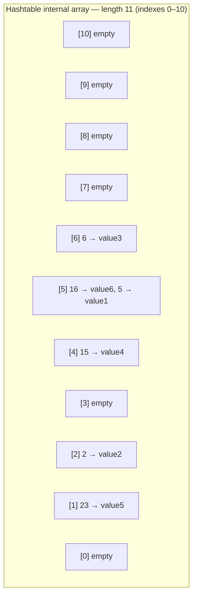

### Collision chaining at bucket 5

Keys **5** and **16** both map to bucket **5** because `5 % 11 = 5` and `16 % 11 = 5`.

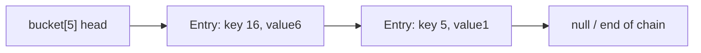

When `get(16)` or `get(5)` runs, `Hashtable` walks the chain at bucket 5 and compares keys with `equals()` (and hash). Here keys are distinct objects, so both entries remain reachable.

### How `println` walks the table

`System.out.println(table)` uses the map's `entrySet()` iterator. It does **not** print in insertion order.

In the JDK `Hashtable` implementation, the internal enumerator walks bucket indexes from **high to low** (`table.length` down to `0`). At each non-empty bucket it walks the collision chain from **head to tail**.

For this demo, that produces this print order:

| Step | Bucket scanned | Entries emitted |
| ---- | -------------- | --------------- |
| 1 | 6 | `6=value3` |
| 2 | 5 | `16=value6`, then `5=value1` |
| 3 | 4 | `15=value4` |
| 4 | 2 | `2=value2` |
| 5 | 1 | `23=value5` |

Buckets **0**, **3**, and **7–10** are empty and are skipped.

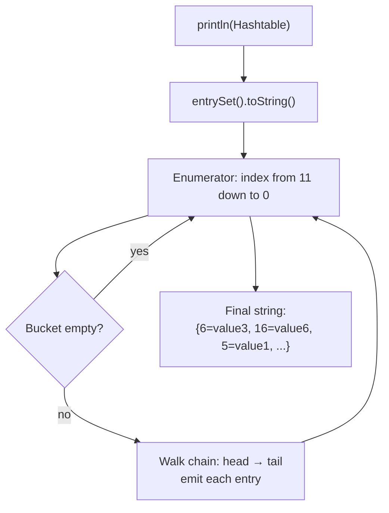

> **Takeaway:** insertion order was `5 → 2 → 6 → 15 → 23 → 16`, but the printed order follows **internal bucket traversal**, not the order you called `put`.

### Verified program output

```text
Hashtable: {6=value3, 16=value6, 5=value1, 15=value4, 2=value2, 23=value5}
```

This matches the bucket walk described above. The line is **not** sorted by key and **not** insertion order.

### Run the demo

From the `demo` module:

```bash
cd demo
javac -d target/classes -sourcepath src/main/java \
  src/main/java/com/collections/hashTable/basicflow/hashTableBase.java \
  src/main/java/com/collections/hashTable/basicflow/hashTableDemo.java
java -cp target/classes com.collections.hashTable.basicflow.hashTableDemo
```

For the broader `Hashtable` map API demo (constructors, load factor, iterators), run:

```bash
java -cp target/classes com.collections.map.hashTable
```


---

## Set (I) Interface

1.It is the child interface of collection 
2.If we want to represent a group of individual objects as a single entity where duplicates are not allowed and insertion 
  order not required then we should go for Set.

- [Set constructors — `setConstructors(String)`](../../../demo/src/main/java/com/collections/collectionBaseClasses/setDemo.java)

## Set Interface Hierarchy

The following diagram shows the public, general-purpose Set interfaces and implementations. A solid arrow means **extends** and a dashed arrow means **implements**.


Collection(I)
     \
     Set(I)
     /     \
  HashSet  SortedSet(I)
     |            \
  LinkedHashSet   NavigableSet(I)
                              \
                              TreeSet(I)

1. Set is child interface of collection 
2. If we want to represent a group of individual objects as a single entity where duplicates are not allowed 
   and insertion order not preseved.

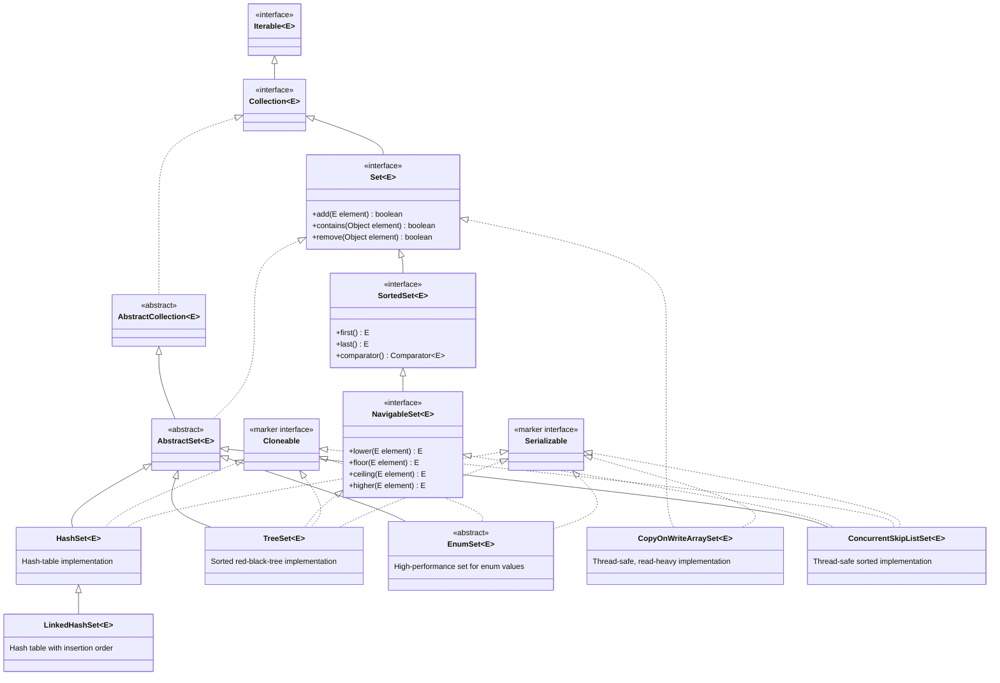

### Common implementations

- **`HashSet`**: the usual choice when unique elements are needed and no iteration order is required.
- **`LinkedHashSet`**: preserves insertion order while preventing duplicates.
- **`TreeSet`**: keeps elements sorted in their natural order or by a supplied `Comparator`.
- **`EnumSet`**: the most efficient choice when every element belongs to one enum type. Create it through factory methods such as `EnumSet.of(...)`; it cannot be instantiated directly.

### Thread-safe implementations

- **`CopyOnWriteArraySet`**: best for read-heavy sets with infrequent updates.
- **`ConcurrentSkipListSet`**: a sorted, concurrent `NavigableSet` for multi-threaded code.

> `BitSet` is not a `Set` implementation. It stores bits efficiently and has a different API. Sets returned by `Map.keySet()` are also views rather than separately declared, general-purpose Set implementation classes.

### HashSet (C)

1. The underlying datastrutcure is Hashtable 
2. Duplicate objects are not allowed 
3. Insertion order is not preserved and it is based on hashcode of objects
4. Null insetion possible but only one time
5. Heterogenous Objects are allowed
6. Implements Serializable, Cloneable but not RandomAccess interface
7. HashSet is the best choice if our ferquent operation is Search operation
  
**NOTE : In HashSet duplicates are not allowed if we are trying to insert duplicates then we won't get any compile-time or 
run-time errors and add method returns simply returns false.**

>HashSet h = new HashSet();

creates an empty HashSet Object with default initial capacity 16 and default fill ratio 0.75

>HashSet h = new HashSet(int initialcapacity);

creates an empty HashSet Object with specified initial capacity and default fill ratio 0.75

>HashSet h = new HashSet(int initialcapacity, float fillratio);

>HashSet h = new HashSet(Collection c);

Creates an equivalent HashSet for the given collection 

### Fill Ratio | Load Factor

After filling how much ratio a new hashSet obejct will be created, this ratio is called fill ratio or load factor 
ex: fill ratio 0.75 means after filling 75% ratio a new HashSet Object will be created

## HashSet vs LinkedHashSet

> For a cleaner, single-page comparison table and a selection guide, see **[HashSet vs LinkedHashSet — Quick Comparison](hashset-vs-linkedhashset.md)**.

`LinkedHashSet<E>` extends `HashSet<E>`. Both prevent duplicates, use `hashCode()` and `equals()` to identify matching elements, and use a hash-table lookup model. The key difference is that `LinkedHashSet` also maintains links between entries, giving it a predictable encounter order.

| Aspect                           | `HashSet<E>`                                                                                                   | `LinkedHashSet<E>`                                                                                                                                         |
| -------------------------------- | -------------------------------------------------------------------------------------------------------------- | ---------------------------------------------------------------------------------------------------------------------------------------------------------- |
| Inheritance                      | Extends `AbstractSet<E>`.                                                                                      | Extends `HashSet<E>`.                                                                                                                                      |
| Internal structure               | Hash table; current JDKs back it with a `HashMap`.                                                             | Hash table plus links between entries; current JDKs back it with a `LinkedHashMap`.                                                                        |
| Iteration / encounter order      | **No order guarantee.** Order can change after resizing or across JVM versions.                                | **Insertion order is preserved.** Re-adding an existing element does not move it to the end.                                                               |
| Sorting                          | Does not sort elements.                                                                                        | Does not sort elements; it preserves insertion order. Use `TreeSet` for sorted order.                                                                      |
| `Iterator` and `forEach` order   | Unspecified encounter order.                                                                                   | Insertion encounter order.                                                                                                                                 |
| Java 21 sequenced API            | Does not implement `SequencedSet`.                                                                             | Implements `SequencedSet`; provides `addFirst`, `addLast`, `getFirst`, `getLast`, `removeFirst`, `removeLast`, and `reversed`.                             |
| Main operation time              | `add`, `contains`, and `remove` are $O(1)$ on average; collisions can make an operation slower.                | Same average $O(1)$ operations, with a small extra cost to maintain links.                                                                                 |
| Iteration time                   | Typically proportional to **size + table capacity**, because empty buckets may be visited.                     | Proportional to **size**, because iteration follows the linked entries; helpful for a sparse, oversized set.                                               |
| Memory use                       | Lower per-entry memory overhead.                                                                               | Higher per-entry memory overhead for before/after entry links.                                                                                             |
| Initial capacity and load factor | Default capacity is `16` and default load factor is `0.75`; initial resize threshold is $16 \times 0.75 = 12$. | Uses the same capacity and load-factor rules.                                                                                                              |
| Constructors                     | `HashSet()`, `HashSet(int)`, `HashSet(int, float)`, `HashSet(Collection)`.                                     | `LinkedHashSet()`, `LinkedHashSet(int)`, `LinkedHashSet(int, float)`, `LinkedHashSet(Collection)`; Java 21 also has `LinkedHashSet.newLinkedHashSet(int)`. |
| Best use                         | Uniqueness and fast membership checks when display/iteration order does not matter.                            | Stable insertion-order output, logs, predictable tests, or de-duplicating input without rearranging it.                                                    |

### Shared properties

- **Duplicates:** `add(element)` returns `false` when an equal element already exists; no exception is thrown.
- **Null:** both allow one `null` element.
- **Custom objects:** duplicate detection requires correct, consistent `equals()` and `hashCode()` methods.
- **Thread safety:** neither is synchronized. For concurrent modification, use external synchronization, `Collections.synchronizedSet(...)`, or an appropriate concurrent set.
- **Iterators:** both are fail-fast on a best-effort basis. Do not structurally modify the set during iteration except through `Iterator.remove()`.
- **Interfaces:** both implement `Set`, `Cloneable`, and `Serializable`; neither implements `RandomAccess`.
- **Equality:** set equality ignores iteration order. A `HashSet` and `LinkedHashSet` containing the same elements are equal.

```java
Set<String> hashSet = new HashSet<>();
hashSet.add("Banana");
hashSet.add("Apple");
hashSet.add("Cherry");
// Iteration order is unspecified.

Set<String> linkedHashSet = new LinkedHashSet<>();
linkedHashSet.add("Banana");
linkedHashSet.add("Apple");
linkedHashSet.add("Cherry");
// Always iterates as: [Banana, Apple, Cherry]
```

> **Rule of thumb:** use `HashSet` for the lowest-overhead unordered set. Choose `LinkedHashSet` when users, tests, files, or APIs need stable insertion-order output. Neither class provides sorted order.


### SortedSet (I)

It is the child interface of Set if we want to represent a group of individual objects as a single entity where 
duplicates are not allowed and all objects should be inserted according to some sorting order then we should go for Sorted Set 

---

## Queue (I)

`Queue` is a child interface of `Collection` used to hold elements before processing. Most queue implementations process elements in **FIFO** (first-in, first-out) order. However, some implementations use a different ordering rule: for example, `PriorityQueue` processes the highest-priority element first.

Before sending a mail all mailId's we have to store in some data structure in which order we added mailId's in the same 
order only mail should be delivered.For this requirement Queue is best choice

`Queue` provides paired operations: one method throws an exception when it cannot complete the operation, while the other returns a special value instead.

| Operation         | Throws exception | Returns special value      |
| ----------------- | ---------------- | -------------------------- |
| Insert an element | `add(e)`         | `offer(e)` returns `false` |
| Remove the head   | `remove()`       | `poll()` returns `null`    |
| Inspect the head  | `element()`      | `peek()` returns `null`    |

> Most Queue implementations do not permit `null` elements because `poll()` and `peek()` use `null` to indicate that the queue is empty.

- [Queue constructors — `queueConstructors(String)`](../../../demo/src/main/java/com/collections/collectionBaseClasses/queueDemo.java)
- 
## Queue Interface Hierarchy

The diagram includes the public Queue-related interfaces and standard JDK implementations. A solid arrow means **extends** and a dashed arrow means **implements**.

```mermaid
classDiagram
  direction TB

  class Iterable~E~ {
    <<interface>>
  }

  class Collection~E~ {
    <<interface>>
  }

  class Queue~E~ {
    <<interface>>
    +add(E element) boolean
    +offer(E element) boolean
    +remove() E
    +poll() E
    +element() E
    +peek() E
  }

  class Deque~E~ {
    <<interface>>
    Double-ended queue
    +addFirst(E element)
    +addLast(E element)
    +pollFirst() E
    +pollLast() E
  }

  class BlockingQueue~E~ {
    <<interface>>
    +put(E element)
    +take() E
  }

  class BlockingDeque~E~ {
    <<interface>>
    Blocking double-ended queue
  }

  class TransferQueue~E~ {
    <<interface>>
    +transfer(E element)
  }

  class AbstractCollection~E~ {
    <<abstract>>
  }

  class AbstractQueue~E~ {
    <<abstract>>
  }

  class ArrayDeque~E~ {
    Resizable-array deque
  }

  class LinkedList~E~ {
    Doubly-linked list and deque
  }

  class PriorityQueue~E~ {
    Priority-heap queue
  }

  class ConcurrentLinkedQueue~E~ {
    Non-blocking concurrent FIFO queue
  }

  class ConcurrentLinkedDeque~E~ {
    Non-blocking concurrent deque
  }

  class ArrayBlockingQueue~E~ {
    Bounded blocking FIFO queue
  }

  class LinkedBlockingQueue~E~ {
    Optionally bounded blocking FIFO queue
  }

  class PriorityBlockingQueue~E~ {
    Unbounded blocking priority queue
  }

  class DelayQueue~E~ {
    Delayed-element blocking queue
  }

  class SynchronousQueue~E~ {
    Zero-capacity hand-off queue
  }

  class LinkedBlockingDeque~E~ {
    Optionally bounded blocking deque
  }

  class LinkedTransferQueue~E~ {
    Non-blocking transfer queue
  }

  Iterable~E~ <|-- Collection~E~
  Collection~E~ <|-- Queue~E~
  Queue~E~ <|-- Deque~E~
  Queue~E~ <|-- BlockingQueue~E~
  Deque~E~ <|-- BlockingDeque~E~
  BlockingQueue~E~ <|-- BlockingDeque~E~
  BlockingQueue~E~ <|-- TransferQueue~E~

  Collection~E~ <|.. AbstractCollection~E~
  AbstractCollection~E~ <|-- AbstractQueue~E~
  Queue~E~ <|.. AbstractQueue~E~
  AbstractCollection~E~ <|-- ArrayDeque~E~
  AbstractQueue~E~ <|-- PriorityQueue~E~
  AbstractQueue~E~ <|-- ConcurrentLinkedQueue~E~
  AbstractCollection~E~ <|-- ConcurrentLinkedDeque~E~
  AbstractQueue~E~ <|-- ArrayBlockingQueue~E~
  AbstractQueue~E~ <|-- LinkedBlockingQueue~E~
  AbstractQueue~E~ <|-- PriorityBlockingQueue~E~
  AbstractQueue~E~ <|-- DelayQueue~E~
  AbstractQueue~E~ <|-- SynchronousQueue~E~
  AbstractQueue~E~ <|-- LinkedBlockingDeque~E~
  AbstractQueue~E~ <|-- LinkedTransferQueue~E~

  Deque~E~ <|.. ArrayDeque~E~
  Deque~E~ <|.. LinkedList~E~
  Deque~E~ <|.. ConcurrentLinkedDeque~E~
  Queue~E~ <|.. PriorityQueue~E~
  Queue~E~ <|.. ConcurrentLinkedQueue~E~
  BlockingQueue~E~ <|.. ArrayBlockingQueue~E~
  BlockingQueue~E~ <|.. LinkedBlockingQueue~E~
  BlockingQueue~E~ <|.. PriorityBlockingQueue~E~
  BlockingQueue~E~ <|.. DelayQueue~E~
  BlockingQueue~E~ <|.. SynchronousQueue~E~
  BlockingDeque~E~ <|.. LinkedBlockingDeque~E~
  TransferQueue~E~ <|.. LinkedTransferQueue~E~
```

### Choosing a Queue implementation

- **`ArrayDeque`**: the usual choice for a FIFO queue, deque, or stack in single-threaded code. It is generally preferred over the legacy `Stack` class.
- **`LinkedList`**: implements both `List` and `Deque`; use it when those linked-list characteristics are specifically useful.
- **`PriorityQueue`**: use when processing must follow natural ordering or a `Comparator`, rather than FIFO order.
- **`ArrayBlockingQueue`** and **`LinkedBlockingQueue`**: use for producer-consumer workflows where a capacity limit and blocking behavior are useful.
- **`ConcurrentLinkedQueue`** and **`ConcurrentLinkedDeque`**: use for non-blocking, thread-safe operations.
- **`SynchronousQueue`**: use for direct hand-off between a producer and a consumer; it never stores an element.
- **`DelayQueue`**: use when an element must not be retrieved until its delay expires.
- **`LinkedTransferQueue`**: use when producers may need to wait until consumers receive an element.

> The legacy `Stack` class is not a `Queue` implementation. For new LIFO stack code, use `Deque`, normally `ArrayDeque`.

---

## Map (I)

Map is not child interface of Collection (I) , if we want to represent a group objects as Key Value pairs 
then we should go for map.Duplicate Keys are not allowed but Values can be duplicated.

## Map Interface Hierarchy


- [Map constructors — `mapConstructors(String)`](../../../demo/src/main/java/com/collections/map/mapDemo.java)
- 
`Map` is separate from `Collection`: it stores a mapping from each unique key to one value. A solid arrow means **extends** and a dashed arrow means **implements**.

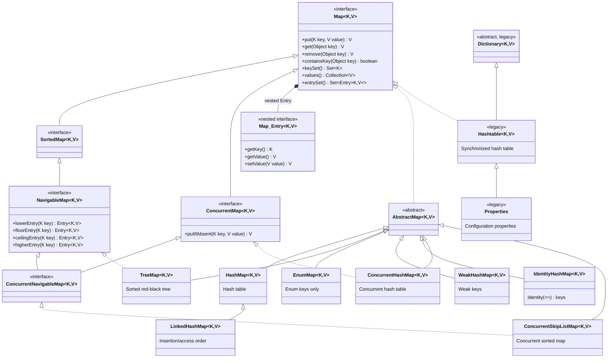

### Interfaces

- **`Map<K, V>`**: base key-value interface.
- **`Map.Entry<K, V>`**: nested interface representing one key-value pair, normally accessed through `entrySet()`.
- **`SortedMap<K, V>`**: map whose keys remain sorted.
- It is the child interface of Map interface if we want to represent a group of Key value pairs according to some        - sorting of Keys then we should go for SortedMap
- In SortedMap the sorting should be based on Key but not based on Value.
- **`NavigableMap<K, V>`**: sorted map with closest-match operations such as `lowerEntry()` and `ceilingEntry()`.
- It is the child interface of SortedMap it defines several methods for navigation purposes its implementation class is 
- TreeMap
- **`ConcurrentMap<K, V>`**: map with atomic concurrent operations such as `putIfAbsent()`.
- **`ConcurrentNavigableMap<K, V>`**: concurrent map with sorted-key navigation.

### Classes

- **`AbstractMap`**: skeletal base class that reduces work when creating a custom map.
- **`HashMap`**: usual general-purpose map; does not guarantee key iteration order and permits one `null` key.
- **`LinkedHashMap`**: preserves insertion order by default; access order can support LRU-style caches.
- **`TreeMap`**: keeps keys sorted by natural order or a `Comparator`.
- **`EnumMap`**: compact, efficient map when every key belongs to one enum type.
- **`WeakHashMap`**: removes an entry after its key is no longer strongly referenced; useful for metadata caches.
- **`IdentityHashMap`**: compares keys using `==`, not `equals()`; use only when identity comparison is required.
- **`ConcurrentHashMap`**: high-concurrency hash map; does not permit `null` keys or values.
- **`ConcurrentSkipListMap`**: concurrent, sorted `NavigableMap`; does not permit `null` keys or values.
- **`Dictionary`**: legacy abstract predecessor of `Map`.
- **`Hashtable`**: synchronized legacy map. Prefer `ConcurrentHashMap` in new concurrent code.
- **`Properties`**: legacy `Hashtable` subclass for configuration properties; use `getProperty()` and `setProperty()` for string properties.

## Map Collection Views

`Map` itself is not a `Collection`, but it exposes three backed collection views. Changes made through these views update the original map.

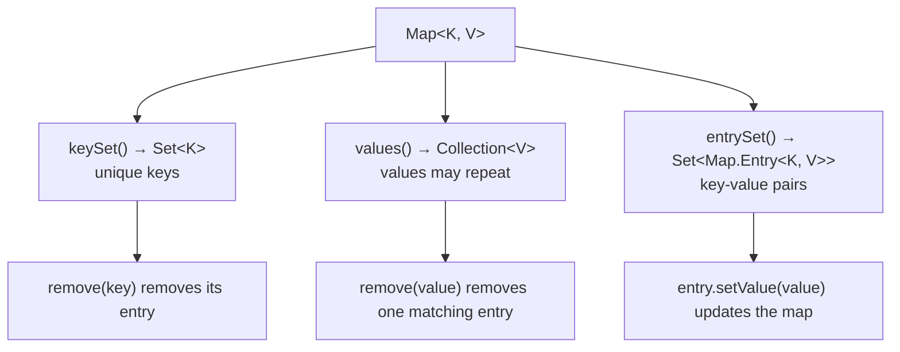

> Adding directly to these views is unsupported because a map needs both a key and a value. Use `map.put(key, value)` to add an entry.

## Choosing a Map Implementation

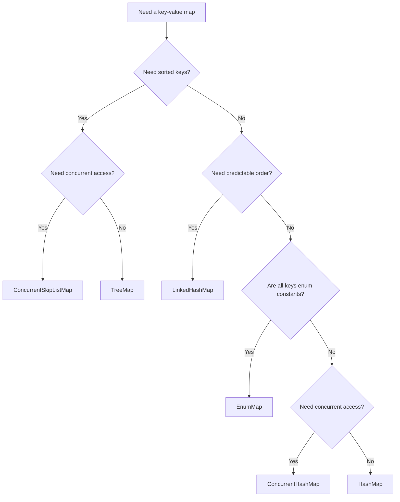

## Checking Whether a Collection Type Is a Class or an Interface

**File:** [`CollectionTypeInspector.java`](../../../demo/src/main/java/com/collections/collectionBaseClasses/CollectionTypeInspector.java)

Every `listDemo`, `setDemo`, `queueDemo`, and `mapDemo` method calls `CollectionTypeInspector.printTypeInfo(...)` before running its methods/cursors. It uses `java.lang.reflect` to classify each supplied type as `INTERFACE`, `ABSTRACT CLASS`, or `CLASS`, and prints a boxed, column-aligned table.

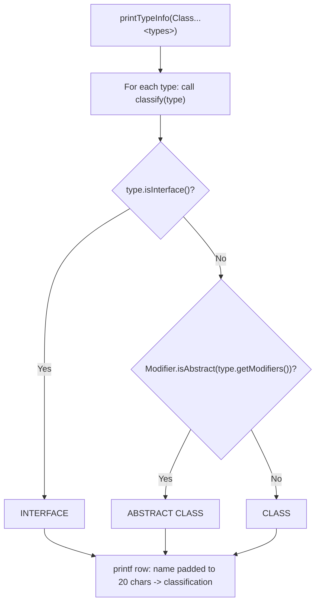

### The formatting line — `CollectionTypeInspector.java` line 15

> 🔎 **Highlighted line:** [`CollectionTypeInspector.java#L15`](../../../demo/src/main/java/com/collections/collectionBaseClasses/CollectionTypeInspector.java#L15)

```java
System.out.printf("  %-20s -> %s%n", type.getSimpleName(), classify(type));
```

This is a `printf`-style formatted print: a format string containing placeholders, followed by the arguments that fill them in, in order.

| Format piece | Meaning                                                                                |
| ------------ | -------------------------------------------------------------------------------------- |
| `  `         | Two literal spaces of indentation before the column starts.                            |
| `%-20s`      | Insert a `String`, left-justified (`-`), padded to a minimum width of `20` characters. |
| ` -> `       | Literal arrow separating the two columns.                                              |
| `%s`         | Insert the second `String`, with no padding.                                           |
| `%n`         | Platform-specific newline (safer than a hardcoded `\n`).                               |

| Argument               | Fills placeholder | Value comes from                                                                        |
| ---------------------- | ----------------- | --------------------------------------------------------------------------------------- |
| `type.getSimpleName()` | first `%-20s`     | The unqualified name, e.g. `ArrayList` instead of `java.util.ArrayList`.                |
| `classify(type)`       | second `%s`       | The private helper method that returns `"INTERFACE"`, `"ABSTRACT CLASS"`, or `"CLASS"`. |

For `ArrayList.class`, this line prints:

```text
  ArrayList            -> CLASS
```

The `%-20s` width of `20` keeps every row's `->` arrow aligned in the same column, even when class names have very different lengths (for example `Set` vs. `LinkedHashSet`).

### Example output

```text
----- Type Classification -----
  ArrayList            -> CLASS
  List                 -> INTERFACE
--------------------------------
```


