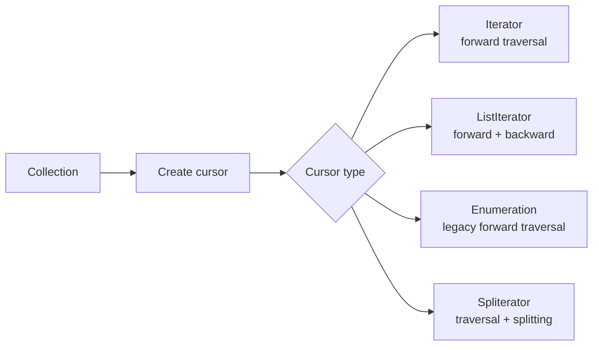
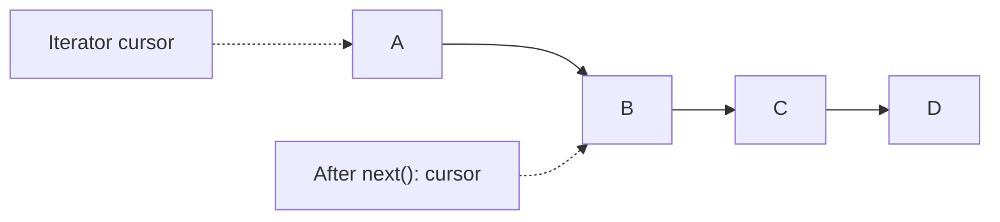
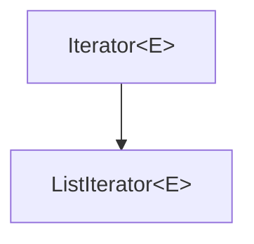
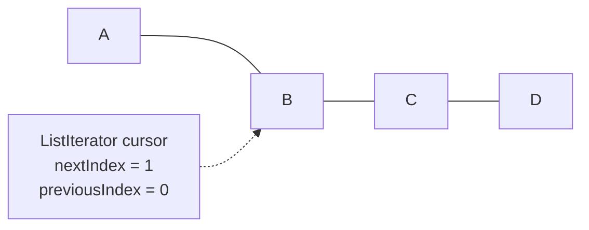
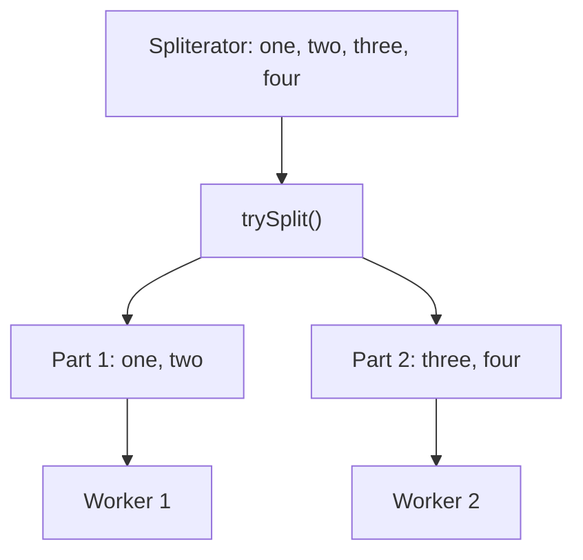
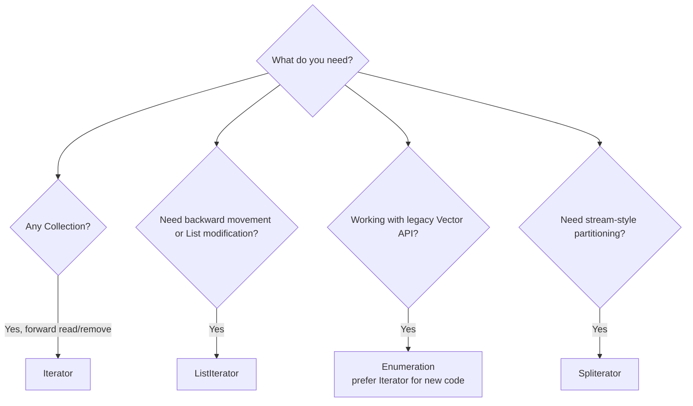

# Cursors in Java Collections

## Quick navigation

- [Cursors in Java Collections](#cursors-in-java-collections)
  - [Quick navigation](#quick-navigation)
  - [Source program](#source-program)
  - [What is a cursor?](#what-is-a-cursor)
  - [1. `Iterator<E>`](#1-iteratore)
    - [Main methods](#main-methods)
    - [Internal position](#internal-position)
    - [Safe removal process](#safe-removal-process)
  - [Limitations of `Iterator`](#limitations-of-iterator)
  - [2. `ListIterator<E>`](#2-listiteratore)
    - [Main methods](#main-methods-1)
    - [Cursor position model](#cursor-position-model)
    - [`set()`, `add()`, and `remove()` example](#set-add-and-remove-example)
  - [3. `Enumeration<E>`](#3-enumeratione)
  - [Limitations of `Enumeration`](#limitations-of-enumeration)
  - [4. `Spliterator<E>`](#4-spliteratore)
    - [Complete lambda expression equivalent](#complete-lambda-expression-equivalent)
  - [Cursor comparison](#cursor-comparison)
  - [Fail-fast behavior](#fail-fast-behavior)
  - [Complexity](#complexity)
  - [Choosing the right cursor](#choosing-the-right-cursor)
  - [Summary](#summary)

## Source program

The complete runnable example is available here:

[cursors.java](../../../demo/src/main/java/com/collections/cursors.java)

Run the class to see every example:

```text
Iterator forward: Asha Chitra Dinesh
After Iterator.remove(): [Asha, Chitra, Dinesh]
ListIterator after set() and add(): [Asha, Bharat, Bhavna, Chitra]
ListIterator backward: Chitra Bhavna Bharat Asha
Enumeration forward: one two three
Spliterator first part: one two
Spliterator second part: three four
```

## What is a cursor?

A cursor is an object that moves through a collection one element at a time. It remembers its current position and provides controlled access to the elements.

Without a cursor, removing an element inside a loop can cause `ConcurrentModificationException` or can skip elements. A cursor provides the correct operation for traversal and, when supported, modification.



## 1. `Iterator<E>`

`Iterator` is the general-purpose cursor for every `Collection`. It moves only from the beginning toward the end.

### Main methods

| Method                     | Purpose                                                |
| -------------------------- | ------------------------------------------------------ |
| `hasNext()`                | Checks whether another element is available.           |
| `next()`                   | Returns the next element and moves the cursor forward. |
| `remove()`                 | Removes the last element returned by `next()`.         |
| `forEachRemaining(action)` | Processes all elements still after the cursor.         |

### Internal position



The cursor starts before `A`. Every call to `next()` returns the next element and advances the cursor. `remove()` removes the element returned by the most recent `next()` call.

### Safe removal process

```java
Iterator<String> iterator = names.iterator();
while (iterator.hasNext()) {
    if (iterator.next().startsWith("B")) {
        iterator.remove();
    }
}
```

Do not call `names.remove(...)` directly inside this loop. Use `iterator.remove()` so the cursor can update its internal state safely.

## Limitations of `Iterator`

1. By using `Enumeration` and `Iterator`, we can always move only in the forward direction; we cannot move in the backward direction.
2. These are single-direction cursors, not bi-directional cursors.
3. By using `Iterator`, we can perform only read and remove operations; we cannot perform replacement and addition of new objects.
4. To overcome the above limitations, we should go for `ListIterator`.

## 2. `ListIterator<E>`

`ListIterator` is a specialized cursor for `List`. It extends `Iterator` and supports movement in both directions and list modifications.

`ListIterator` is the child interface of `Iterator`, and hence all methods present in `Iterator` are by default available to `ListIterator`.




### Main methods

| Method                            | Purpose                                                                 |
| --------------------------------- | ----------------------------------------------------------------------- |
| `hasNext()` / `next()`            | Checks and moves forward.                                               |
| `hasPrevious()` / `previous()`    | Checks and moves backward.                                              |
| `nextIndex()` / `previousIndex()` | Reports the indexes on either side of the cursor.                       |
| `add(element)`                    | Inserts before the element that would be returned by the next `next()`. |
| `set(element)`                    | Replaces the last element returned by `next()` or `previous()`.         |
| `remove()`                        | Removes the last element returned by `next()` or `previous()`.          |

### Cursor position model



The cursor is between elements, not on an element. If it is between `A` and `B`, `next()` returns `B`, while `previous()` returns `A`.

### `set()`, `add()`, and `remove()` example

```java
ListIterator<String> iterator = names.listIterator();
while (iterator.hasNext()) {
    if (iterator.next().equals("Bala")) {
        iterator.set("Bharat");
        iterator.add("Bhavna");
    }
}
```

Result:

```text
[Asha, Bharat, Bhavna, Chitra]
```

Important rules:

- `set()` requires a preceding successful `next()` or `previous()`.
- `add()` inserts at the current cursor position and resets the remove/set state.
- After `add()`, call `next()` or `previous()` before using `set()` or `remove()` again.

## 3. `Enumeration<E>`

`Enumeration` is a legacy cursor introduced for older classes such as `Vector` and `Hashtable`. It is read-only and moves only forward.

| Method              | Purpose                                |
| ------------------- | -------------------------------------- |
| `hasMoreElements()` | Checks whether another element exists. |
| `nextElement()`     | Returns the next element.              |

```java
Vector<String> values = new Vector<>(List.of("one", "two", "three"));
Enumeration<String> enumeration = values.elements();
while (enumeration.hasMoreElements()) {
    System.out.println(enumeration.nextElement());
}
```
## Limitations of `Enumeration`

1. We can apply the `Enumeration` concept only for legacy classes; it is not a universal cursor.
2. By using `Enumeration`, we can get only read access; we cannot perform remove operations.
3. To overcome the above limitations, we should go for `Iterator`.


For new code, prefer `Iterator` or `ListIterator` because they use the modern collection API and support safe removal where appropriate.

## 4. `Spliterator<E>`

`Spliterator` means **splittable iterator**. It traverses elements and can split its remaining work into two parts, which makes it useful for sequential and parallel streams.

| Method                     | Purpose                                                                 |
| -------------------------- | ----------------------------------------------------------------------- |
| `tryAdvance(action)`       | Processes one element if available.                                     |
| `forEachRemaining(action)` | Processes every remaining element.                                      |
| `trySplit()`               | Splits remaining elements and returns another spliterator, if possible. |
| `estimateSize()`           | Estimates the number of remaining elements.                             |
| `characteristics()`        | Reports properties such as ordered, sized, or sorted.                   |



The split is a work partition, not a copy intended for modifying the original collection.

### Complete lambda expression equivalent

This statement uses a lambda expression:

```java
secondHalf.forEachRemaining(value -> System.out.print(value + " "));
```

The full equivalent uses an anonymous implementation of the functional interface `Consumer<String>`:

```java
secondHalf.forEachRemaining(new java.util.function.Consumer<String>() {
  @Override
  public void accept(String value) {
    System.out.print(value + " ");
  }
});
```

Step by step:

1. `forEachRemaining(...)` expects one `Consumer<String>` object.
2. `Consumer<String>` has one abstract method: `accept(String value)`.
3. The lambda parameter `value` represents the current `String` element.
4. `System.out.print(value + " ")` is the body executed for each remaining element.
5. The lambda is shorter because Java infers the `String` type and the `Consumer` implementation.

These two forms perform the same operation. The lambda is the concise form; the anonymous class shows the complete object and method that the lambda represents.

## Cursor comparison

| Cursor         | Direction            | Can remove?                       | Can insert/set?                   | Typical source   |
| -------------- | -------------------- | --------------------------------- | --------------------------------- | ---------------- |
| `Iterator`     | Forward              | Yes, through `remove()`           | No                                | Any `Collection` |
| `ListIterator` | Forward and backward | Yes                               | Yes                               | `List`           |
| `Enumeration`  | Forward              | No                                | No                                | Legacy `Vector`  |
| `Spliterator`  | Forward; can split   | No direct structural modification | No direct structural modification | Any `Collection` |

## Fail-fast behavior

Most standard collection iterators detect structural modification made directly through the collection after the cursor is created and throw `ConcurrentModificationException` on a best-effort basis.

```java
List<String> values = new ArrayList<>(List.of("A", "B"));
for (String value : values) {
    values.remove(value);
}
```

Use the cursor's own modification method instead:

```java
Iterator<String> iterator = values.iterator();
while (iterator.hasNext()) {
    iterator.next();
    iterator.remove();
}
```

Fail-fast behavior is a bug-detection aid, not a synchronization mechanism. For concurrent access, choose an appropriate concurrent collection or synchronize according to the collection's contract.

## Complexity

| Operation                                         | `ArrayList` cursor                              | `LinkedList` cursor                     |
| ------------------------------------------------- | ----------------------------------------------- | --------------------------------------- |
| Move to next/previous node                        | `next()` is O(1)                                | `next()` and `previous()` are O(1)      |
| Find a value                                      | O(n)                                            | O(n)                                    |
| Remove after cursor reaches element               | Usually O(n) because later array elements shift | O(1) unlink after the node is reached   |
| Insert through `ListIterator` at current position | Usually O(n) because elements shift             | O(1) link after the position is reached |
| Jump directly to index                            | O(1) for `ArrayList`                            | O(n) for `LinkedList`                   |

The important distinction is that `LinkedList` does not make finding the middle position fast. It makes the actual link/unlink operation fast after the cursor has reached that position. If code repeatedly accesses indexes, `ArrayList` is usually the better choice.

## Choosing the right cursor



## Summary

- Use `Iterator` for safe forward traversal and removal.
- Use `ListIterator` when a list must be traversed in both directions or modified while traversing.
- Treat `Enumeration` as a legacy, read-only cursor.
- Use `Spliterator` when traversal may be split for stream or parallel processing.
- Never modify a collection directly while a normal cursor is traversing it; use the cursor's supported methods.