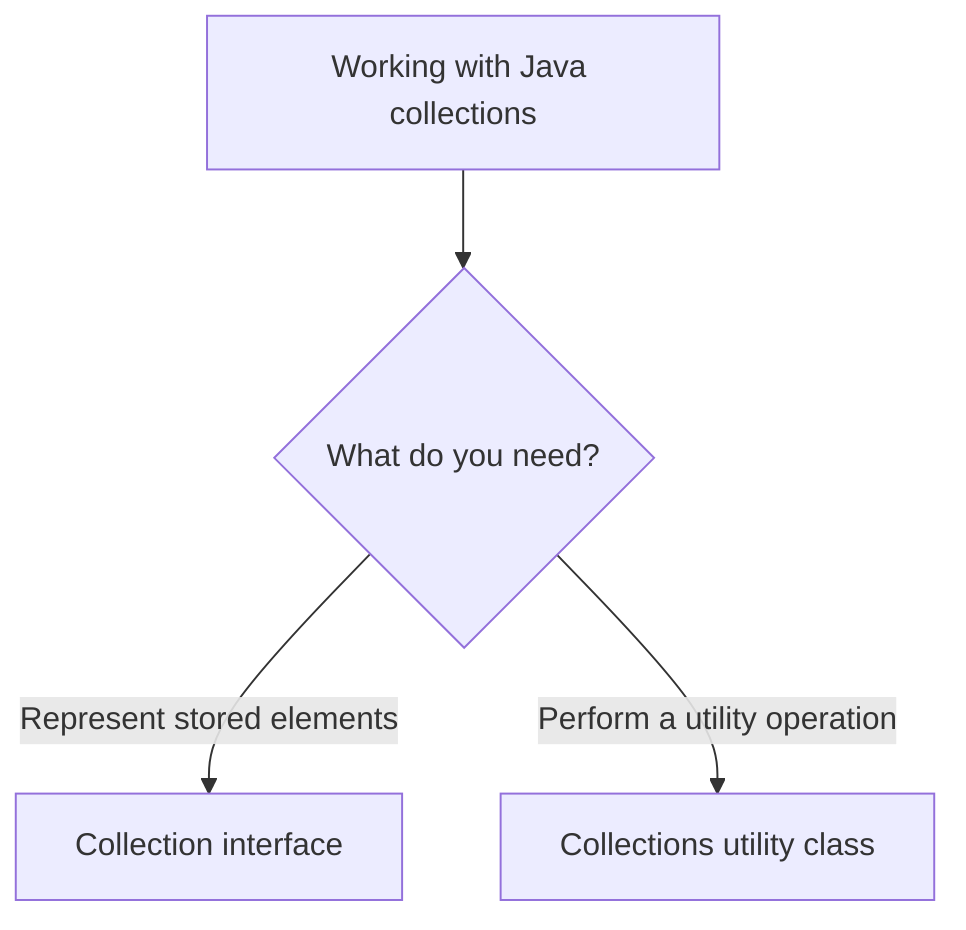
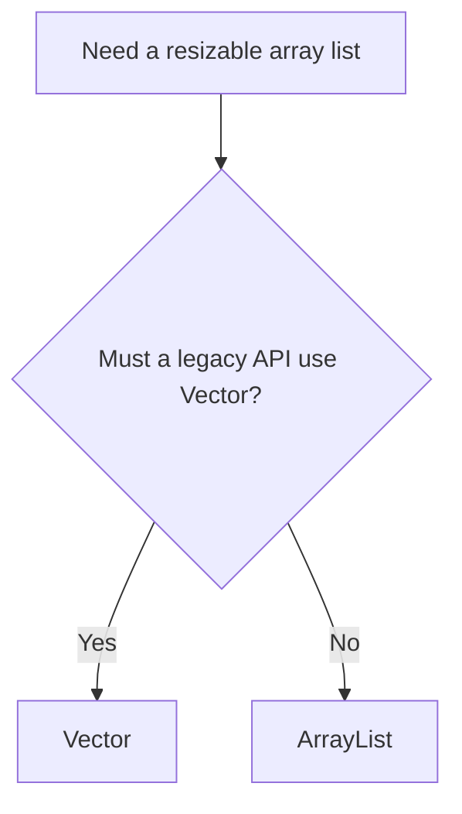
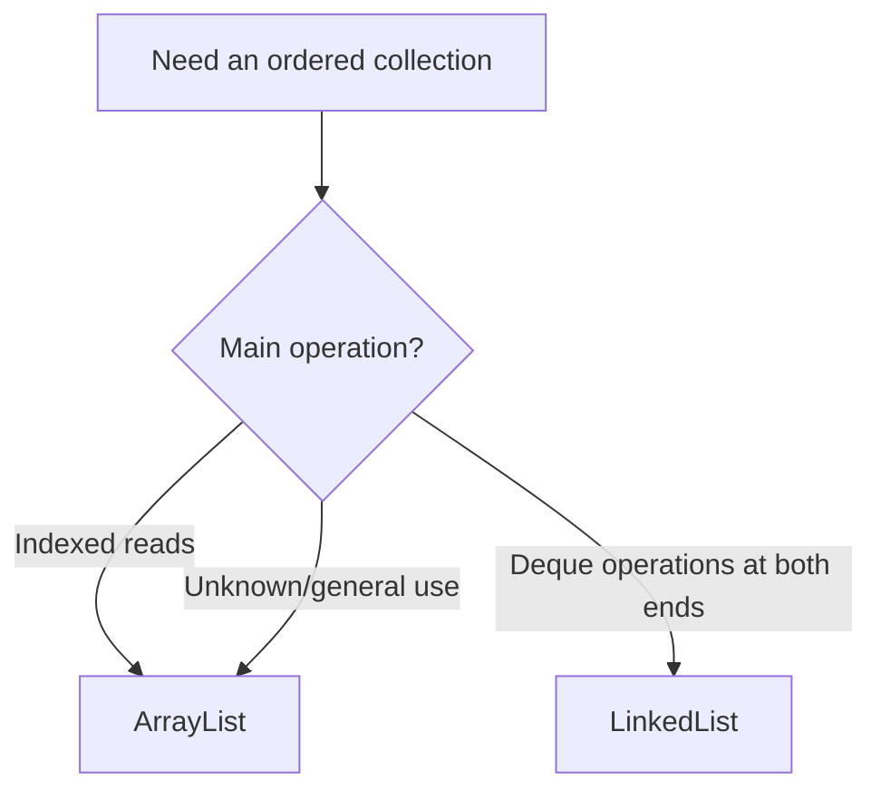
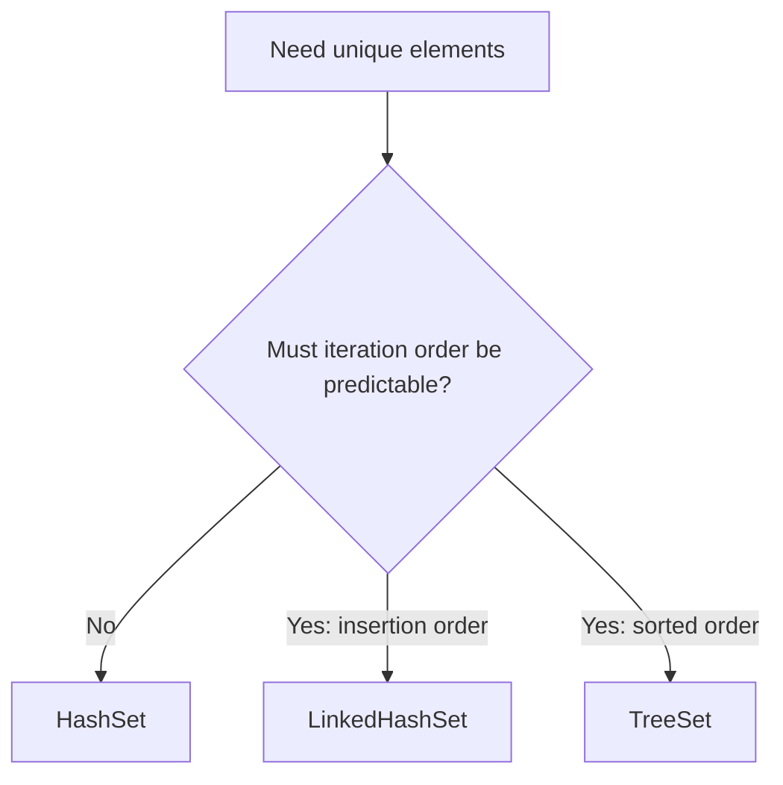
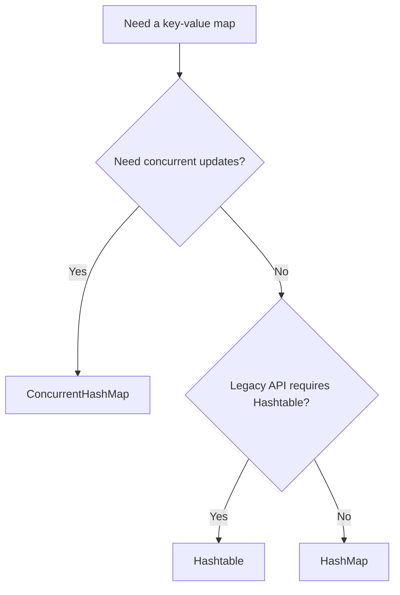

# Differences in Java Collections

> **Java Collections comparison guide** — use this page to choose the correct collection type quickly and understand the trade-offs behind that choice.

> **Preview tip:** Open this page in **Markdown Preview** (`Ctrl+Shift+V`) and use `Ctrl+click` to navigate comparisons.

A single, visual reference page for the collection comparisons covered in this project. Each topic follows the same easy-to-scan format:

1. **One-line answer** — the fastest recommendation.
2. **Quick choice** — pick the appropriate type for a requirement.
3. **Decision flow** — follow the choice visually.
4. **Side-by-side differences** — compare every important behavior.
5. **Practical guidance** — apply the comparison in real code.

## Start here

| Choose a comparison                                         | Use it when you want to know...                                         |
| ----------------------------------------------------------- | ----------------------------------------------------------------------- |
| [**Collection vs Collections**](#collection-vs-collections) | Whether you need the collection interface or the static utility class.  |
| [**ArrayList vs Vector**](#arraylist-vs-vector)             | Which resizable-array list is appropriate, especially for legacy code.  |
| [**ArrayList vs LinkedList**](#arraylist-vs-linkedlist)     | Which list fits indexed access, end operations, or a deque.             |
| [**HashSet vs LinkedHashSet**](#hashset-vs-linkedhashset)   | Whether unique elements need predictable insertion-order iteration.     |
| [**HashMap vs Hashtable**](#hashmap-vs-hashtable)           | Which hash-based map to use, including `null` and concurrency behavior. |

> **Tip:** Open this file in **Markdown Preview** (`Ctrl+Shift+V`) for clean rendered tables and diagrams. Use `Ctrl+click` on a link to jump straight to a comparison.

---

<!-- TOC -->
- [Differences in Java Collections](#differences-in-java-collections)
  - [Collection vs Collections](#collection-vs-collections)
    - [Quick choice](#quick-choice)
    - [Side-by-side differences](#side-by-side-differences)
    - [Practical guidance](#practical-guidance)
  - [ArrayList vs Vector](#arraylist-vs-vector)
    - [Quick choice](#quick-choice-1)
    - [Side-by-side differences](#side-by-side-differences-1)
    - [Practical guidance](#practical-guidance-1)
  - [ArrayList vs LinkedList](#arraylist-vs-linkedlist)
    - [Quick choice](#quick-choice-2)
    - [Side-by-side differences](#side-by-side-differences-2)
    - [Practical guidance](#practical-guidance-2)
  - [HashSet vs LinkedHashSet](#hashset-vs-linkedhashset)
    - [Quick choice](#quick-choice-3)
    - [Side-by-side differences](#side-by-side-differences-3)
    - [Shared behavior](#shared-behavior)
    - [Practical guidance](#practical-guidance-3)
  - [HashMap vs Hashtable](#hashmap-vs-hashtable)
    - [Quick choice](#quick-choice-4)
    - [Side-by-side differences](#side-by-side-differences-4)
    - [Practical guidance](#practical-guidance-4)
<!-- /TOC -->

> **Contents:** The table of contents below is also clickable. It includes each comparison and its Quick choice, differences, and guidance sections.

---

## Collection vs Collections

> **One-line answer:** `Collection` is an interface used to represent a group of elements; `Collections` is a utility class containing static methods that work with collections.

### Quick choice

| If you need...                                          | Use                                                | Why                                                        |
| ------------------------------------------------------- | -------------------------------------------------- | ---------------------------------------------------------- |
| A variable type for a group of elements                 | `Collection<E>`                                    | It is the root interface for common collection operations. |
| Sorting, reversing, searching, or wrapping a collection | `Collections`                                      | Its static utility methods perform those operations.       |
| A collection object to store values                     | An implementation such as `ArrayList` or `HashSet` | Interfaces cannot be instantiated directly.                |



### Side-by-side differences

| Topic        | `Collection`                                                                                           | `Collections`                                                                                |
| ------------ | ------------------------------------------------------------------------------------------------------ | -------------------------------------------------------------------------------------------- |
| Type         | Interface.                                                                                             | Utility class.                                                                               |
| Package      | `java.util.Collection`                                                                                 | `java.util.Collections`                                                                      |
| Purpose      | Represents a group of objects as one unit.                                                             | Provides static helper methods for collection objects.                                       |
| Instances    | You cannot instantiate the interface directly. Use an implementation such as `ArrayList` or `HashSet`. | You do not instantiate it; its constructor is private.                                       |
| Examples     | `add()`, `remove()`, `contains()`, `size()`, `iterator()`                                              | `sort()`, `reverse()`, `shuffle()`, `binarySearch()`, `max()`, `min()`, `synchronizedList()` |
| Relationship | Root interface for `List`, `Set`, and `Queue`.                                                         | Works with collections; it is not part of the collection-interface hierarchy.                |

```java
Collection<String> names = new ArrayList<>();
names.add("Ram");
Collections.sort((List<String>) names);
```

> Use **`Collection`** as a type for a group of elements; use **`Collections`** to perform utility operations on a collection.

### Practical guidance

1. Declare APIs with `Collection<E>` when they accept any kind of collection.
2. Instantiate a concrete implementation, such as `new ArrayList<>()`.
3. Call `Collections` methods directly through the class name; do not create an instance.

---

## ArrayList vs Vector

> **One-line answer:** prefer `ArrayList` for new code; use `Vector` only when an older API specifically requires it.

### Quick choice

| If you need...                                    | Choose                                                | Why                                                               |
| ------------------------------------------------- | ----------------------------------------------------- | ----------------------------------------------------------------- |
| A normal resizable, indexed list                  | `ArrayList`                                           | It is the modern, lower-overhead default.                         |
| Compatibility with legacy code that uses `Vector` | `Vector`                                              | It preserves the required legacy API.                             |
| A thread-safe list for new code                   | A purpose-appropriate synchronized or concurrent list | `Vector` method synchronization is rarely the best modern design. |



### Side-by-side differences

| Topic              | `ArrayList<E>`                                                                 | `Vector<E>`                                                                                                            |
| ------------------ | ------------------------------------------------------------------------------ | ---------------------------------------------------------------------------------------------------------------------- |
| Status             | Modern general-purpose list.                                                   | Legacy list retained for compatibility.                                                                                |
| Internal structure | Resizable array.                                                               | Resizable array.                                                                                                       |
| Thread safety      | Not synchronized.                                                              | Individual methods are synchronized.                                                                                   |
| Concurrent use     | External synchronization is needed if multiple threads structurally modify it. | Method-level synchronization makes individual operations thread-safe, but compound operations still need coordination. |
| Performance        | Usually faster because there is no synchronization cost.                       | Usually slower because synchronized methods add overhead.                                                              |
| Capacity growth    | Grows by approximately 50% when necessary.                                     | Doubles by default, or grows by the configured `capacityIncrement`.                                                    |
| Default capacity   | An empty `ArrayList` allocates its default backing array on first addition.    | `10`.                                                                                                                  |
| Legacy cursor      | No `Enumeration`.                                                              | Has `elements()`, which returns a legacy `Enumeration`.                                                                |
| Recommended use    | Default choice for a resizable, indexed list.                                  | Prefer only when maintaining older APIs that require `Vector`.                                                         |

> For new thread-safe list code, prefer explicit locking, `Collections.synchronizedList(...)`, or a concurrent collection suited to the workload rather than choosing `Vector` by default.

### Practical guidance

1. Use `ArrayList` unless a real requirement says otherwise.
2. Do not treat `Vector` synchronization as complete multi-step thread safety.
3. Use `CopyOnWriteArrayList`, locking, or another concurrent design when the workload requires it.

---

## ArrayList vs LinkedList

> **One-line answer:** choose `ArrayList` for indexed access and general use; choose `LinkedList` mainly for deque operations at the beginning or end.

### Quick choice

| If you need...                                   | Choose              | Why                                                             |
| ------------------------------------------------ | ------------------- | --------------------------------------------------------------- |
| Frequent `get(index)` or `set(index, value)`     | `ArrayList`         | It provides direct $O(1)$ indexed access.                       |
| A FIFO queue, deque, or efficient end operations | `LinkedList`        | It implements `Deque` and has $O(1)$ operations at both ends.   |
| Frequent middle changes by index                 | Usually `ArrayList` | A `LinkedList` still needs $O(n)$ traversal to find that index. |



### Side-by-side differences

| Topic                        | `ArrayList<E>`                                                        | `LinkedList<E>`                                                                                |
| ---------------------------- | --------------------------------------------------------------------- | ---------------------------------------------------------------------------------------------- |
| Internal structure           | Resizable array.                                                      | Doubly linked nodes.                                                                           |
| Indexed read: `get(index)`   | $O(1)$ direct access.                                                 | $O(n)$ traversal from the nearest end.                                                         |
| Replace: `set(index, value)` | $O(1)$.                                                               | $O(n)$ to reach the node.                                                                      |
| Append: `add(value)`         | $O(1)$ amortized.                                                     | $O(1)$.                                                                                        |
| Insert/remove in the middle  | $O(n)$ because later elements shift.                                  | Finding by index is $O(n)$; linking/unlinking after the node is reached is $O(1)$.             |
| End operations               | `addLast()` is efficient; removing the first element shifts values.   | Efficient at both ends: `addFirst()`, `addLast()`, `removeFirst()`, `removeLast()` are $O(1)$. |
| Memory                       | Lower per-element overhead; it stores element references in an array. | Higher per-element overhead; each node stores the element plus previous/next links.            |
| Random access                | Implements `RandomAccess`.                                            | Does not implement `RandomAccess`.                                                             |
| Queue/deque support          | A `List`; not a `Deque`.                                              | Implements both `List` and `Deque`.                                                            |
| Recommended use              | Frequent indexed reads and appends.                                   | Deque-style operations at the beginning/end; do not choose it for frequent indexed access.     |

> Do not assume `LinkedList` is automatically faster for “insertions and deletions.” It is beneficial when you already have the node position or when operations occur at the ends; searching for a middle index is still linear.

### Practical guidance

1. Start with `ArrayList` for most list requirements.
2. Select `LinkedList` when its `Deque` operations are central to the design.
3. Avoid repeatedly calling `get(index)` inside a loop on a `LinkedList`.

---

## HashSet vs LinkedHashSet

> **One-line answer:** choose `HashSet` when order does not matter; choose `LinkedHashSet` when elements must be returned in insertion order.

### Quick choice

| If you need...                                     | Choose          | Why                                            |
| -------------------------------------------------- | --------------- | ---------------------------------------------- |
| Unique elements with the lowest practical overhead | `HashSet`       | It does not maintain insertion-order links.    |
| Unique elements with predictable insertion order   | `LinkedHashSet` | It preserves insertion order during iteration. |
| Unique elements in sorted order                    | `TreeSet`       | Neither hash-based set sorts elements.         |



### Side-by-side differences

| Topic                                             | `HashSet<E>`                                                    | `LinkedHashSet<E>`                                                                                 |
| ------------------------------------------------- | --------------------------------------------------------------- | -------------------------------------------------------------------------------------------------- |
| Inheritance                                       | Extends `AbstractSet<E>`.                                       | Extends `HashSet<E>`.                                                                              |
| Internal structure                                | Hash table, backed by `HashMap` in current JDK implementations. | Hash table plus links between entries, backed by `LinkedHashMap` in current JDK implementations.   |
| Iteration order                                   | No guarantee. Do not depend on the displayed order.             | Insertion order is preserved.                                                                      |
| Re-adding an existing element                     | `add()` returns `false`; the set does not change.               | Same; the element keeps its original insertion position.                                           |
| Sorted order                                      | No.                                                             | No. Use `TreeSet` if elements must be sorted.                                                      |
| `Iterator`, `forEach`, and stream encounter order | Unspecified.                                                    | Insertion order.                                                                                   |
| Java 21 sequenced API                             | Does not implement `SequencedSet`.                              | Implements `SequencedSet`, including `addFirst()`, `getFirst()`, `removeLast()`, and `reversed()`. |
| `add`, `contains`, `remove`                       | $O(1)$ average time.                                            | $O(1)$ average time, with small link-maintenance overhead.                                         |
| Iteration cost                                    | Usually $O(\text{size} + \text{capacity})$.                     | $O(\text{size})$.                                                                                  |
| Memory use                                        | Lower per-entry overhead.                                       | Higher per-entry overhead for the entry links.                                                     |
| Recommended use                                   | Fast uniqueness/membership checks where order does not matter.  | Stable output, stable tests, logs, and de-duplicating input while retaining its order.             |

### Shared behavior

| Property      | Both classes                                                                             |
| ------------- | ---------------------------------------------------------------------------------------- |
| Duplicates    | Not allowed; `add()` returns `false` for an existing equal element.                      |
| Matching rule | Uses consistent `hashCode()` and `equals()` implementations.                             |
| `null`        | Allow one `null` element.                                                                |
| Defaults      | Initial capacity `16`; load factor `0.75`; first resize threshold $16 \times 0.75 = 12$. |
| Thread safety | Not synchronized.                                                                        |
| Iterators     | Fail-fast on a best-effort basis.                                                        |
| Equality      | Ignores iteration order; equal element sets are equal.                                   |

> **Quick rule:** choose `HashSet` for lower-overhead unordered uniqueness; choose `LinkedHashSet` whenever insertion-order iteration matters.

### Practical guidance

1. Use `HashSet` for fast membership checks when output order is irrelevant.
2. Use `LinkedHashSet` for stable logs, stable tests, and order-preserving de-duplication.
3. Choose `TreeSet`, not either hash-based set, when sorting is required.

For a visual decision flow and an expanded `HashSet` comparison, see [HashSet vs LinkedHashSet — Quick Comparison](hashset-vs-linkedhashset.md).

---

## HashMap vs Hashtable

> **One-line answer:** use `HashMap` for most modern maps; `Hashtable` is a legacy synchronized map that rejects `null` keys and values. For modern concurrent maps, prefer `ConcurrentHashMap`.

### Quick choice

| If you need...                                          | Choose              | Why                                                                         |
| ------------------------------------------------------- | ------------------- | --------------------------------------------------------------------------- |
| A normal, fast key-value map                            | `HashMap`           | It is the standard general-purpose map.                                     |
| Compatibility with an old API that requires `Hashtable` | `Hashtable`         | It provides the legacy API and behavior.                                    |
| Safe concurrent access in new code                      | `ConcurrentHashMap` | It scales substantially better than synchronizing every `Hashtable` method. |
| A map that permits a `null` key or `null` values        | `HashMap`           | `Hashtable` rejects all `null` keys and values.                             |



### Side-by-side differences

| Topic                         | `HashMap<K, V>`                                                                                        | `Hashtable<K, V>`                                                                             |
| ----------------------------- | ------------------------------------------------------------------------------------------------------ | --------------------------------------------------------------------------------------------- |
| Status                        | Modern general-purpose map, introduced in Java 1.2.                                                    | Legacy class, introduced in Java 1.0.                                                         |
| Inheritance                   | Extends `AbstractMap<K, V>` and implements `Map<K, V>`.                                                | Extends legacy `Dictionary<K, V>` and implements `Map<K, V>`.                                 |
| Thread safety                 | Not synchronized.                                                                                      | Individual public methods are synchronized.                                                   |
| Concurrent performance        | Fast in single-threaded code, but external coordination is required for concurrent structural changes. | Typically slower under concurrent access because one monitor serializes operations.           |
| Modern concurrent alternative | Use `ConcurrentHashMap` when multiple threads update/read the map.                                     | `ConcurrentHashMap` is normally preferable to `Hashtable` for new concurrent code.            |
| `null` key                    | Allows one `null` key.                                                                                 | Rejects `null` keys with `NullPointerException`.                                              |
| `null` values                 | Allows multiple `null` values.                                                                         | Rejects `null` values with `NullPointerException`.                                            |
| Iteration order               | No key iteration-order guarantee.                                                                      | No key iteration-order guarantee.                                                             |
| Main operation time           | `put`, `get`, and `remove` are $O(1)$ on average.                                                      | The same average $O(1)$ hashing model, plus synchronization overhead.                         |
| Default initial capacity      | `16`; default load factor `0.75`; initial threshold $16 \times 0.75 = 12$.                             | `11`; default load factor `0.75`; initial threshold is $\lfloor 11 \times 0.75 \rfloor = 8$.  |
| Growth rule                   | Normally doubles table capacity when resizing.                                                         | Grows using $2 \times \text{old capacity} + 1$.                                               |
| Traversal API                 | `keySet()`, `values()`, `entrySet()`, plus fail-fast iterators.                                        | The same map views and iterators; also exposes legacy `keys()` and `elements()` enumerations. |
| Recommended use               | Default choice when order and built-in synchronization are not required.                               | Only for legacy compatibility; avoid it for new code.                                         |

### Shared behavior

| Property      | Both classes                                                                                                     |
| ------------- | ---------------------------------------------------------------------------------------------------------------- |
| Key rule      | Keys are unique; putting an existing key replaces its value.                                                     |
| Value rule    | Values may be duplicated.                                                                                        |
| Matching rule | Keys use consistent `hashCode()` and `equals()` implementations.                                                 |
| Ordering      | Neither guarantees iteration order; use `LinkedHashMap` for insertion/access order or `TreeMap` for sorted keys. |
| Serialization | Both implement `Serializable`.                                                                                   |
| Iterators     | Iterators are fail-fast on a best-effort basis.                                                                  |

### See the null difference

```java
Map<String, Integer> hashMap = new HashMap<>();
hashMap.put(null, 1);          // Allowed
hashMap.put("missing", null); // Allowed

Map<String, Integer> hashtable = new Hashtable<>();
hashtable.put(null, 1);        // Throws NullPointerException
hashtable.put("missing", null); // Throws NullPointerException
```

### Practical guidance

1. Start with `HashMap` for ordinary key-value storage.
2. Use `ConcurrentHashMap` instead of `Hashtable` for new concurrent code.
3. Use `LinkedHashMap` when iteration order must be predictable, or `TreeMap` when keys must be sorted.
4. Avoid `null` in shared or concurrent map APIs even when using `HashMap`; it makes absence and error handling less clear.

> **Quick rule:** `HashMap` is the modern default; `Hashtable` is primarily a compatibility class.
