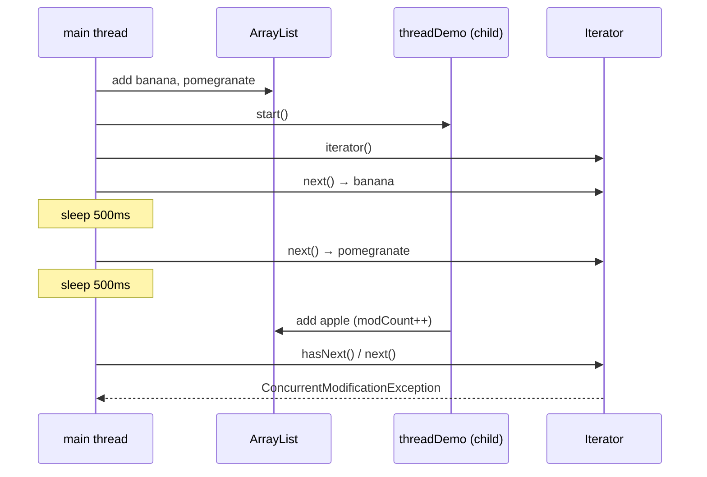
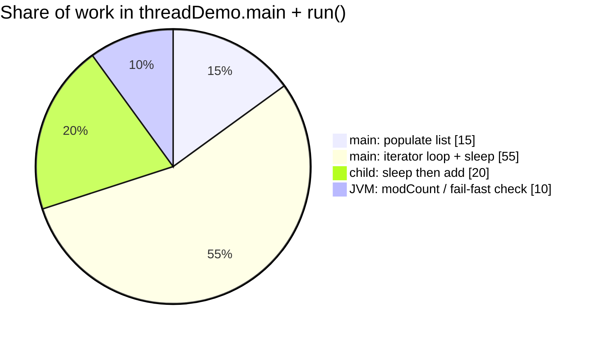
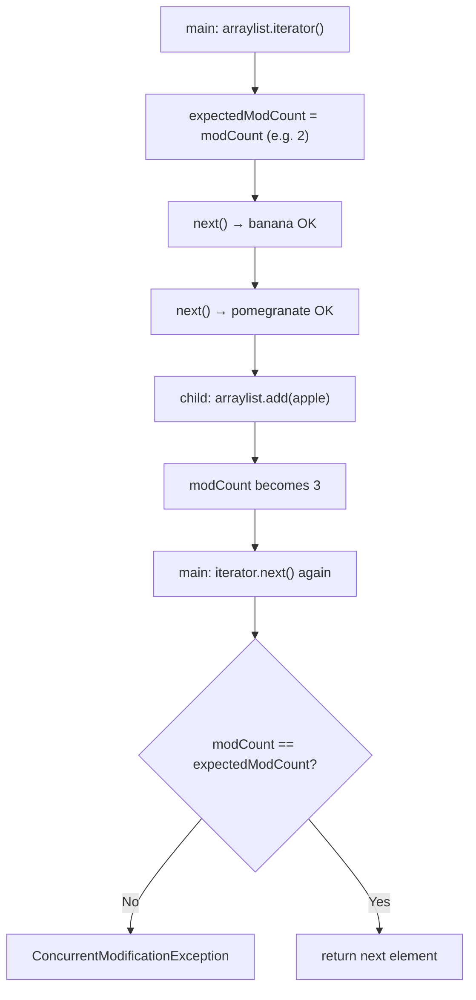
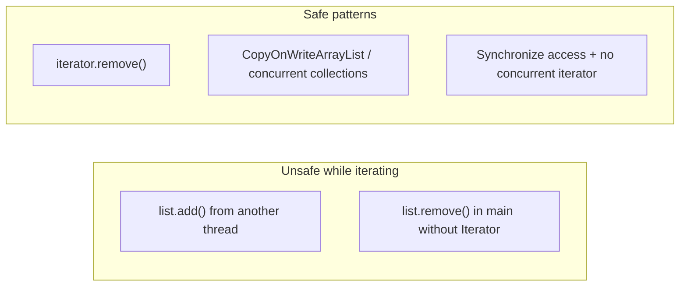

# Concurrent collections hub

| Guide | Topics |
| ----- | ------ |
| **This file** | `ConcurrentModificationException`, traditional vs concurrent collections |
| **[concurrentMap.md](concurrentMap.md)** | `concurrentMap` / `concurrentHashMap` demos, `ConcurrentMap` API, **ConcurrentHashMap buckets & internals** |

> Fail-fast demo: [`threadDemo.java`](../../../demo/src/main/java/com/concurrentCollection/ConcurrentModificationException/threadDemo.java) · Concurrent maps: [`concurrentMap.java`](../../../demo/src/main/java/com/concurrentCollection/concurrentMap/concurrentMap.java) · [`concurrentHashMap.java`](../../../demo/src/main/java/com/concurrentCollection/concurrentMap/concurrentHashMap.java)

---

## Why concurrent collections matter

| Issue                   | Non-concurrent collections                                              | `java.util.concurrent` collections                             |
| ----------------------- | ----------------------------------------------------------------------- | -------------------------------------------------------------- |
| Thread safety           | Most structures are **not** safe for unsynchronized multi-thread access | Designed for **concurrent** read/write                         |
| Legacy sync wrappers    | `Collections.synchronized*` locks the **whole** collection — see [bucket vs whole-map lock](concurrentMap.md#bucket-level-lock-vs-whole-collection-lock) | Per-bin locks / CAS (e.g. `ConcurrentHashMap`) — [same section](concurrentMap.md#bucket-level-lock-vs-whole-collection-lock) |
| Iterator + modification | **Fail-fast** `Iterator` → `ConcurrentModificationException`            | Iterators designed for weak consistency / no CME in many cases |

Point **3** is exactly what `threadDemo` demonstrates on a plain **`ArrayList`**.

---

## `threadDemo.java` — complete execution flow

### Source (reference)

```java
public class threadDemo extends Thread {
    static ArrayList<String> arraylist = new ArrayList<>();

    @Override
    public void run() {
        Thread.sleep(1000);
        arraylist.add("apple");  // structural modification from child thread
    }

    public static void main(String[] args) throws InterruptedException {
        arraylist.add("banana");
        arraylist.add("pomegranate");

        threadDemo t = new threadDemo();
        t.start();

        Iterator<String> iterator = arraylist.iterator();
        while (iterator.hasNext()) {
            String data = iterator.next();
            System.out.println(data);
            Thread.sleep(500);
        }
        System.out.println("Final array list: " + arraylist);
    }
}
```

### Roles

| Piece                                    | Role                                                           |
| ---------------------------------------- | -------------------------------------------------------------- |
| **`static ArrayList<String> arraylist`** | Shared list — **not** thread-safe                              |
| **`main`**                               | Fills list, starts child, iterates with **`Iterator`**         |
| **`threadDemo` (child `Thread`)**        | After 1s, **`add("apple")`** while main may still be iterating |
| **`Iterator`**                           | Fail-fast view; tracks **`expectedModCount`** at creation time |

### Timeline (two threads)

```mermaid
gantt
    title threadDemo timing (approximate)
    dateFormat X
    axisFormat %Ls

    section main
    add banana & pomegranate :0, 1
    iterator + next banana   :1, 500
    sleep                    :500, 500
    next pomegranate         :1000, 500
    sleep                    :1500, 500
    next (fails)             :2000, 1

    section child
    sleep 1000ms             :0, 1000
    add apple                :1000, 1
```





### Program phases



---

## How `ConcurrentModificationException` occurs (fail-fast)

`ArrayList` (and most `java.util` collections) use a **`modCount`** field: incremented on every **structural** change (`add`, `remove`, `clear`, …).

When you call **`iterator()`**, the iterator stores **`expectedModCount = modCount`**.

On each **`iterator.next()`** (and related operations), **`checkForComodification()`** runs:

```text
if (modCount != expectedModCount) → throw ConcurrentModificationException
```



| Event                    | `modCount` | Iterator `expectedModCount` | Result                         |
| ------------------------ | ---------- | --------------------------- | ------------------------------ |
| After 2 `add`s in `main` | 2          | —                           | —                              |
| `iterator()` created     | 2          | **2**                       | OK                             |
| `next()` × 2             | 2          | 2                           | Prints `banana`, `pomegranate` |
| Child `add("apple")`     | **3**      | 2 (stale)                   | List now has 3 elements        |
| Next `next()`            | 3 ≠ 2      | —                           | **Exception**                  |

> **Important:** The exception is thrown in the **thread that uses the iterator** (`main`), even though the **other thread** (`child`) performed the `add`. Any structural change—same thread or another—invalidates a fail-fast iterator unless you use **`iterator.remove()`** on that iterator.



---

## Verified output

```text
banana
pomegranate
Child thread is updating the list : 
Exception in thread "main" java.util.ConcurrentModificationException
    at java.base/java.util.ArrayList$Itr.checkForComodification(ArrayList.java:1095)
    at java.base/java.util.ArrayList$Itr.next(ArrayList.java:1049)
    at com.concurrentCollection.ConcurrentModificationException.threadDemo.main(threadDemo.java:35)
```

`Final array list:` is **not** printed — the loop never completes.

---

## Run the demo

```bash
cd demo
javac -d /tmp/thdemo src/main/java/com/concurrentCollection/ConcurrentModificationException/threadDemo.java
java -cp /tmp/thdemo com.concurrentCollection.ConcurrentModificationException.threadDemo
```

Or with Maven:

```bash
cd demo
mvn -q exec:java -Dexec.mainClass=com.concurrentCollection.ConcurrentModificationException.threadDemo
```

---

## Relation to concurrent collections

| Approach                       | CME on concurrent modification?                                              | Typical use                                  |
| ------------------------------ | ---------------------------------------------------------------------------- | -------------------------------------------- |
| `ArrayList` + `Iterator`       | **Yes** (fail-fast)                                                          | Single-threaded or fully synchronized access |
| `Collections.synchronizedList` | Still fail-fast iterator; **must sync** on list during iteration             | Legacy                                       |
| `CopyOnWriteArrayList`         | Iterator sees **snapshot**; no CME from adds                                 | Read-heavy, rare writes                      |
| `ConcurrentHashMap`            | **No** `ConcurrentModificationException` on iterator; weakly consistent view | Shared maps                                  |

This demo intentionally uses a **non-concurrent** `ArrayList` and two threads so the fail-fast rule is easy to see. For production multi-threaded code, prefer types from **`java.util.concurrent`** or explicit synchronization—not shared mutation during iteration.

---

## Why `java.util.concurrent` collections exist

1. **Traditional** structures (`ArrayList`, `HashMap`, …) are not safe for unsynchronized multi-thread access — you risk torn reads and corrupted internal state.
2. **Legacy thread-safe** types (`Vector`, `Hashtable`, `Collections.synchronized*`) lock the **whole** collection for many operations, so throughput drops when many threads compete.
3. **Fail-fast iterators** on ordinary collections throw **`ConcurrentModificationException`** when another thread (or the same thread) structurally modifies the collection during iteration — exactly what [`threadDemo`](../../../demo/src/main/java/com/concurrentCollection/ConcurrentModificationException/threadDemo.java) shows.
4. **`java.util.concurrent`** adds collections designed for **parallel** access (finer locking, CAS, or copy-on-write snapshots).

---

## Traditional vs concurrent collections

| Feature                       | Traditional Collections (e.g., `ArrayList`, `HashMap`)                                                                             | Concurrent Collections (e.g., `CopyOnWriteArrayList`, `ConcurrentHashMap`)                                             |
| :---------------------------- | :--------------------------------------------------------------------------------------------------------------------------------- | :--------------------------------------------------------------------------------------------------------------------- |
| **Thread Safety**             | **Not Thread-Safe**. Multiple threads modifying the collection simultaneously will cause data corruption or crashes.               | **Thread-Safe**. Built from the ground up to handle simultaneous reads and writes from multiple threads safely.        |
| **Iterator Behavior**         | **Fail-Fast**. Throws a `ConcurrentModificationException` immediately if the collection is structurally modified during iteration. | **Weakly Consistent / Fail-Safe**. Allows safe modification during iteration without throwing any exceptions.          |
| **Locking Mechanism**         | No internal locking mechanisms. (Legacy synchronized wrappers lock the **entire** collection).                                     | Uses **fine-grained locking** (like lock striping) or **lock-free algorithms** (like Compare-And-Swap/CAS).            |
| **Performance & Scalability** | High performance in single-threaded environments, but slows down completely if wrapped in manual synchronization locks.            | High performance and scalability in multi-threaded environments because threads rarely have to wait in line.           |
| **Memory Overhead**           | Low memory footprint. Only stores the actual data elements.                                                                        | Higher memory footprint (e.g., `CopyOnWriteArrayList` creates a brand new copy of the array on every write operation). |
| **Package Location**          | Found in the standard `java.util` package.                                                                                         | Found in the specialized `java.util.concurrent` package.                                                               |
| **Best Used For**             | Local variables, single-threaded applications, or data that never changes after initialization.                                    | Shared caches, producer-consumer queues, and high-throughput multi-threaded background workers.                        |

## Common concurrent collection types

| Type | Package role |
| ---- | ------------ |
| **`ConcurrentHashMap`** | Shared maps; bin-level locking / CAS — see **[concurrentMap.md](concurrentMap.md)** (constructors, `putIfAbsent`, **bucket internals**) |
| **`CopyOnWriteArrayList`** | Snapshot iterators; copy backing array on write |
| **`CopyOnWriteArraySet`** | Set view over copy-on-write list |
| **`ConcurrentSkipListMap` / `ConcurrentSkipListSet`** | Sorted concurrent navigable structures (also covered in [concurrentMap.md](concurrentMap.md) constructors) |
