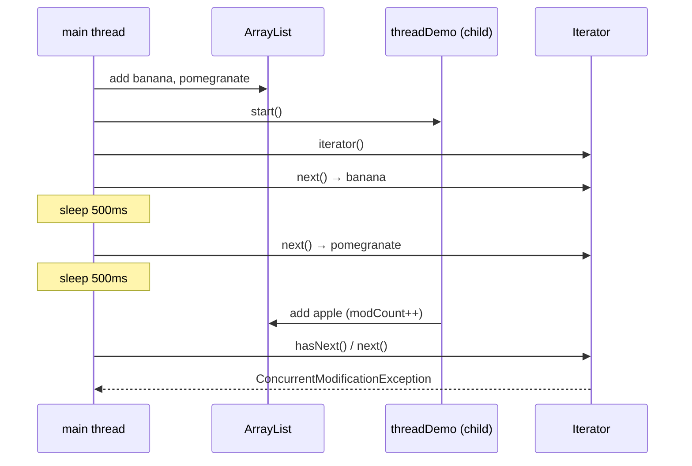
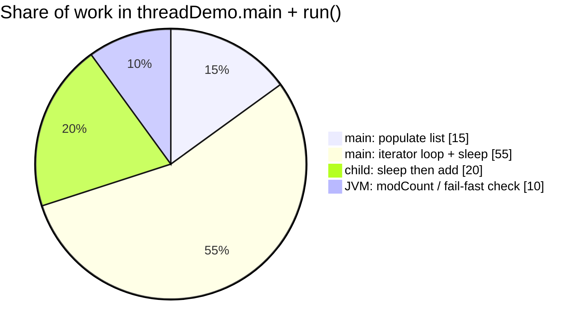
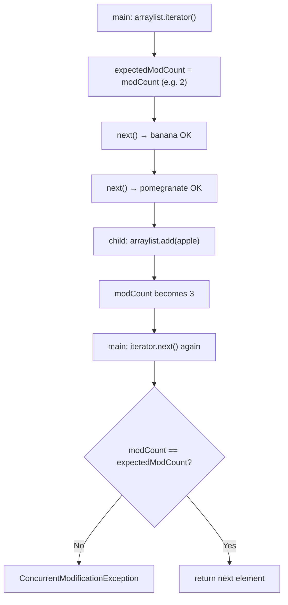
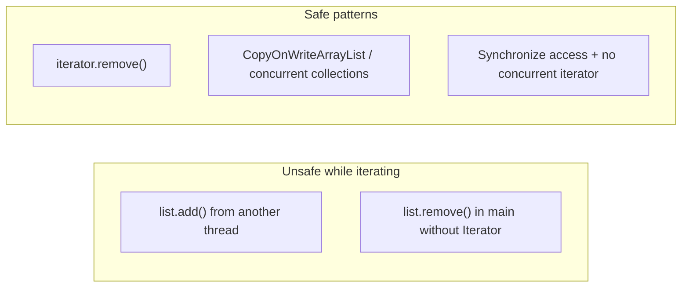

# Concurrent collections and `ConcurrentModificationException`

> Guide focused on fail-fast iteration vs structural changes. Runnable demo: [`threadDemo.java`](../../../demo/src/main/java/com/concurrentCollection/ConcurrentModificationException/threadDemo.java).

---

## Why concurrent collections matter

| Issue | Non-concurrent collections | `java.util.concurrent` collections |
| ----- | -------------------------- | ---------------------------------- |
| Thread safety | Most structures are **not** safe for unsynchronized multi-thread access | Designed for **concurrent** read/write |
| Legacy sync wrappers | `Collections.synchronized*` locks the **whole** collection | Finer-grained locking / CAS (e.g. `ConcurrentHashMap`) |
| Iterator + modification | **Fail-fast** `Iterator` → `ConcurrentModificationException` | Iterators designed for weak consistency / no CME in many cases |

Point **3** is exactly what `threadDemo` demonstrates on a plain **`ArrayList`**.

---

## `threadDemo.java` — complete execution flow

### Source (reference)

```java
public class threadDemo extends Thread {
    static ArrayList<String> arraylist = new ArrayList<>();

    @Override
    public void run() {
        Thread.sleep(1000);
        arraylist.add("apple");  // structural modification from child thread
    }

    public static void main(String[] args) throws InterruptedException {
        arraylist.add("banana");
        arraylist.add("pomegranate");

        threadDemo t = new threadDemo();
        t.start();

        Iterator<String> iterator = arraylist.iterator();
        while (iterator.hasNext()) {
            String data = iterator.next();
            System.out.println(data);
            Thread.sleep(500);
        }
        System.out.println("Final array list: " + arraylist);
    }
}
```

### Roles

| Piece | Role |
| ----- | ---- |
| **`static ArrayList<String> arraylist`** | Shared list — **not** thread-safe |
| **`main`** | Fills list, starts child, iterates with **`Iterator`** |
| **`threadDemo` (child `Thread`)** | After 1s, **`add("apple")`** while main may still be iterating |
| **`Iterator`** | Fail-fast view; tracks **`expectedModCount`** at creation time |

### Timeline (two threads)

```mermaid
gantt
    title threadDemo timing (approximate)
    dateFormat X
    axisFormat %Ls

    section main
    add banana & pomegranate :0, 1
    iterator + next banana   :1, 500
    sleep                    :500, 500
    next pomegranate         :1000, 500
    sleep                    :1500, 500
    next (fails)             :2000, 1

    section child
    sleep 1000ms             :0, 1000
    add apple                :1000, 1
```





### Program phases



---

## How `ConcurrentModificationException` occurs (fail-fast)

`ArrayList` (and most `java.util` collections) use a **`modCount`** field: incremented on every **structural** change (`add`, `remove`, `clear`, …).

When you call **`iterator()`**, the iterator stores **`expectedModCount = modCount`**.

On each **`iterator.next()`** (and related operations), **`checkForComodification()`** runs:

```text
if (modCount != expectedModCount) → throw ConcurrentModificationException
```



| Event | `modCount` | Iterator `expectedModCount` | Result |
| ----- | ---------- | ----------------------------- | ------ |
| After 2 `add`s in `main` | 2 | — | — |
| `iterator()` created | 2 | **2** | OK |
| `next()` × 2 | 2 | 2 | Prints `banana`, `pomegranate` |
| Child `add("apple")` | **3** | 2 (stale) | List now has 3 elements |
| Next `next()` | 3 ≠ 2 | — | **Exception** |

> **Important:** The exception is thrown in the **thread that uses the iterator** (`main`), even though the **other thread** (`child`) performed the `add`. Any structural change—same thread or another—invalidates a fail-fast iterator unless you use **`iterator.remove()`** on that iterator.



---

## Verified output

```text
banana
pomegranate
Child thread is updating the list : 
Exception in thread "main" java.util.ConcurrentModificationException
    at java.base/java.util.ArrayList$Itr.checkForComodification(ArrayList.java:1095)
    at java.base/java.util.ArrayList$Itr.next(ArrayList.java:1049)
    at com.concurrentCollection.ConcurrentModificationException.threadDemo.main(threadDemo.java:35)
```

`Final array list:` is **not** printed — the loop never completes.

---

## Run the demo

```bash
cd demo
javac -d /tmp/thdemo src/main/java/com/concurrentCollection/ConcurrentModificationException/threadDemo.java
java -cp /tmp/thdemo com.concurrentCollection.ConcurrentModificationException.threadDemo
```

Or with Maven:

```bash
cd demo
mvn -q exec:java -Dexec.mainClass=com.concurrentCollection.ConcurrentModificationException.threadDemo
```

---

## Relation to concurrent collections

| Approach | CME on concurrent modification? | Typical use |
| -------- | ------------------------------- | ----------- |
| `ArrayList` + `Iterator` | **Yes** (fail-fast) | Single-threaded or fully synchronized access |
| `Collections.synchronizedList` | Still fail-fast iterator; **must sync** on list during iteration | Legacy |
| `CopyOnWriteArrayList` | Iterator sees **snapshot**; no CME from adds | Read-heavy, rare writes |
| `ConcurrentHashMap` | **No** `ConcurrentModificationException` on iterator; weakly consistent view | Shared maps |

This demo intentionally uses a **non-concurrent** `ArrayList` and two threads so the fail-fast rule is easy to see. For production multi-threaded code, prefer types from **`java.util.concurrent`** or explicit synchronization—not shared mutation during iteration.
