# HashMap vs ConcurrentHashMap

> Runnable `ConcurrentHashMap` demo: [`concurrentHashMap.java`](../../../demo/src/main/java/com/concurrentCollection/concurrentMap/concurrentHashMap.java) · Deeper internals: [concurrentMap.md](concurrentMap.md) · Hub: [concurrentCollections.md](concurrentCollections.md)

---

## Guide map

| Section | Content |
| ------- | ------- |
| [Classroom comparison](#classroom-comparison-table) | Reference slide (image + table) |
| [Thread safety & performance](#thread-safety-and-performance) | When each map wins |
| [Iteration & CME](#iteration-while-another-thread-modifies) | Fail-fast vs fail-safe flows + hub examples |
| [Hub: iterator deep dive](concurrentCollections.md#fail-fast-vs-fail-safe-iterators-with-examples) | Runnable `ArrayList` / `HashMap` / CHM / COW examples |
| [Null rules](#null-keys-and-values) | `HashMap` allows; `ConcurrentHashMap` rejects |
| [Choose the right map](#which-map-should-you-use) | Decision flow + pie chart |

---

## Classroom comparison table

<p align="center">
  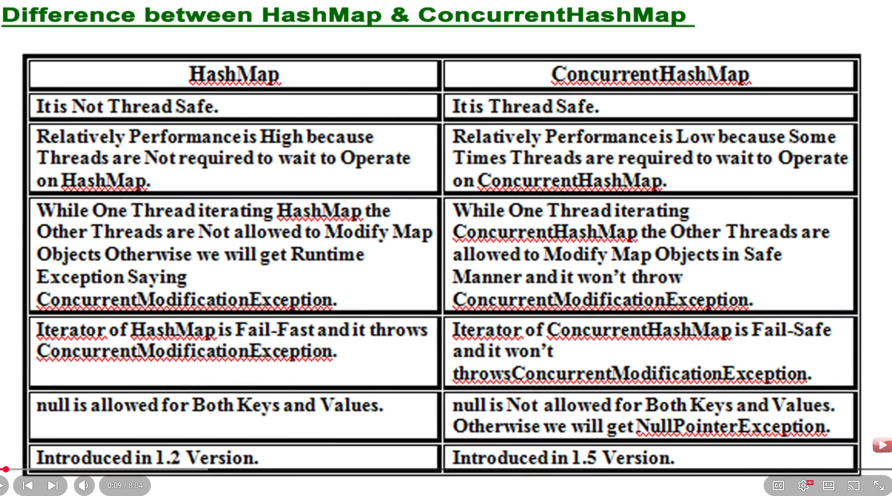
</p>

*Figure: interview-style comparison (expanded and clarified below).*

| Topic | `HashMap` | `ConcurrentHashMap` |
| ----- | --------- | ------------------- |
| **Thread safety** | **Not** thread-safe | **Thread-safe** for concurrent access |
| **Performance (slide)** | **Higher** in the **single-threaded** sense — no internal coordination | **Lower** per operation — threads may **wait** on bin/segment locks or CAS retries |
| **Performance (reality check)** | Fast alone; **unsafe** if multiple threads mutate without external sync | **Higher throughput** than `Collections.synchronizedMap(new HashMap<>())` when **many threads** update **different** keys — see [bucket vs whole-map lock](concurrentMap.md#bucket-level-lock-vs-whole-collection-lock) |
| **Modify while iterating** | Other threads must **not** structurally modify the map → **`ConcurrentModificationException`** (fail-fast iterator) | Other threads **may** update safely; iterator is **weakly consistent** (fail-safe in classroom terms) — **no CME** |
| **Iterator** | **Fail-fast** | **Fail-safe / weakly consistent** |
| **`null`** | **Allowed** for key and value (one `null` key max) | **`null` not allowed** — `NullPointerException` |
| **Since** | Java **1.2** | Java **1.5** (`java.util.concurrent`) |

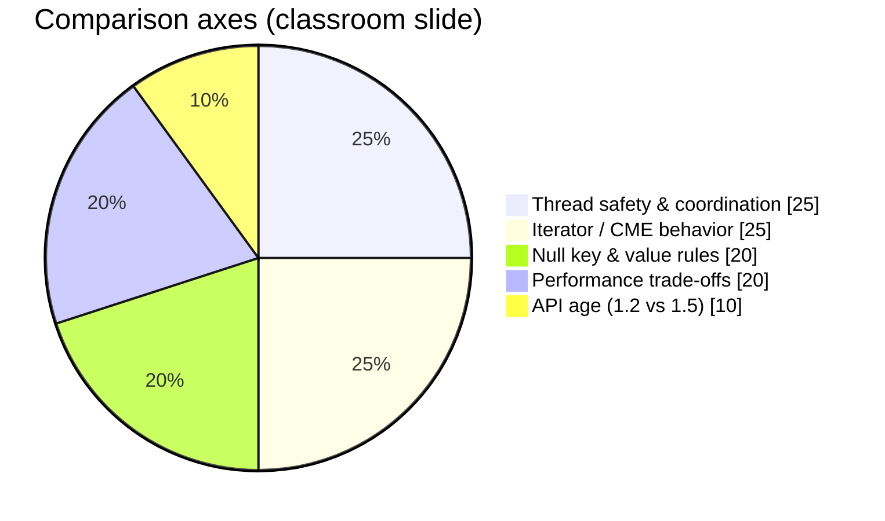

---

## Thread safety and performance

### Single-threaded vs multi-threaded

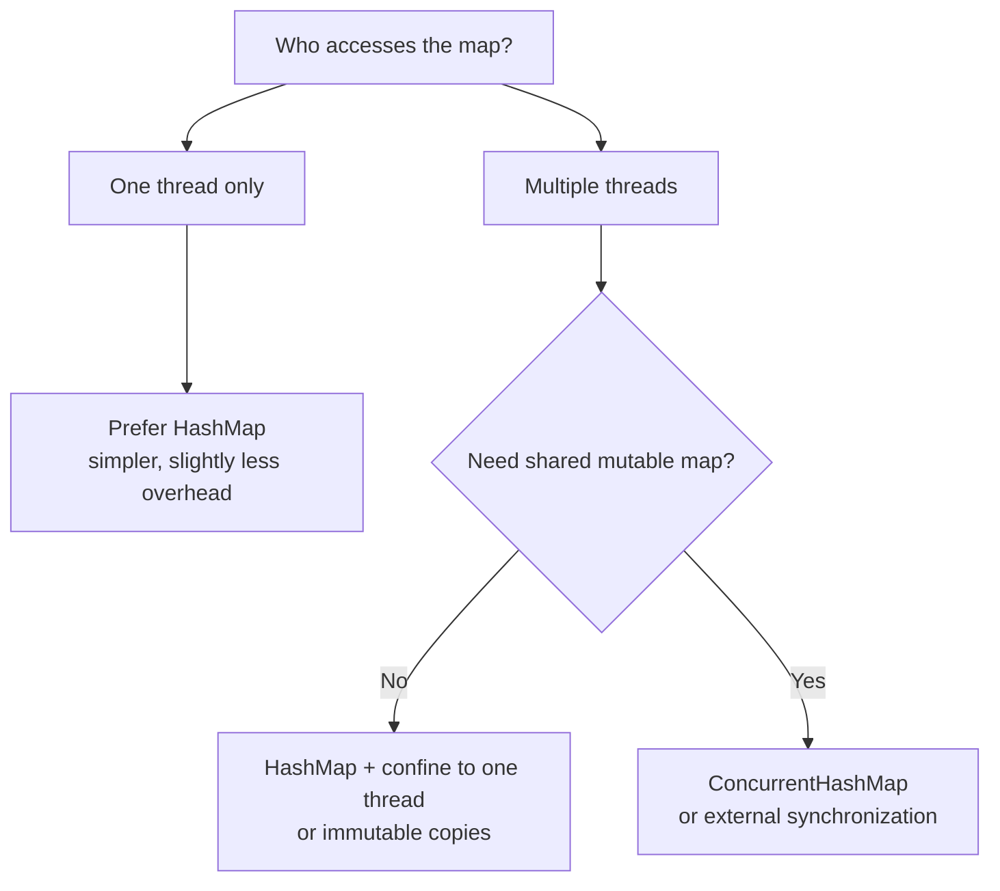

| Scenario | Better choice | Why |
| -------- | ------------- | ----- |
| Local variable, one thread | **`HashMap`** | No locking/CAS cost |
| Shared cache, many readers/writers | **`ConcurrentHashMap`** | Bin-level coordination vs locking entire `HashMap` |
| Shared map, rare writes | **`HashMap`** + `ReadWriteLock` or immutable snapshots | Sometimes simpler than CHM |
| Legacy “make HashMap thread-safe” | **`ConcurrentHashMap`** (new code) | `synchronizedMap` still **fail-fast** iterator + **whole-map** lock |

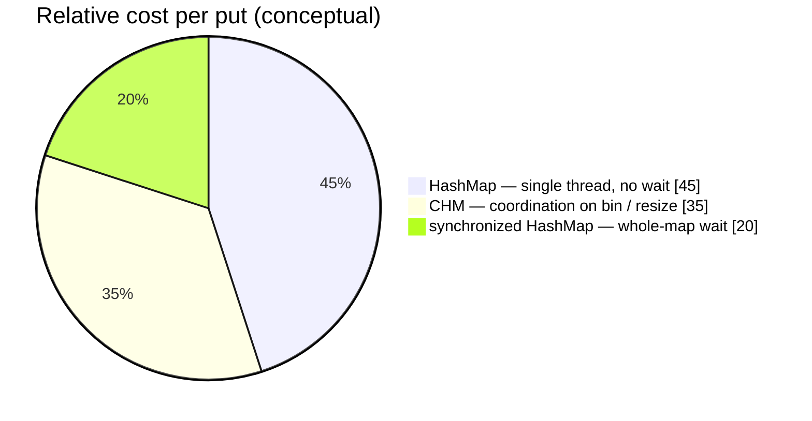

The slide’s “CHM performance is low” means **each operation may do more work** (atomic checks, bin locks). In **parallel**, CHM still wins over a globally locked `HashMap` because threads do not queue on **one** monitor for every key.

---

## Iteration while another thread modifies

Full lesson with **five runnable examples** (list, map, threads, `CopyOnWriteArrayList`): [Fail-fast vs fail-safe iterators](concurrentCollections.md#fail-fast-vs-fail-safe-iterators-with-examples) in the hub.

This section applies the same idea as [`threadDemo.java`](../../../demo/src/main/java/com/concurrentCollection/ConcurrentModificationException/threadDemo.java) on `ArrayList`, but for **maps**.

### Mini example — `HashMap` (fail-fast) vs `ConcurrentHashMap` (fail-safe)

```java
// Fail-fast: HashMap
Map<Integer, String> hm = new HashMap<>();
hm.put(1, "one");
var it = hm.entrySet().iterator();
it.next();
hm.put(2, "two");
it.next(); // ConcurrentModificationException

// Fail-safe: ConcurrentHashMap
Map<Integer, String> chm = new ConcurrentHashMap<>();
chm.put(1, "one");
var it2 = chm.entrySet().iterator();
it2.next();
chm.put(2, "two");
it2.next(); // OK — no CME
```

### `HashMap` — fail-fast

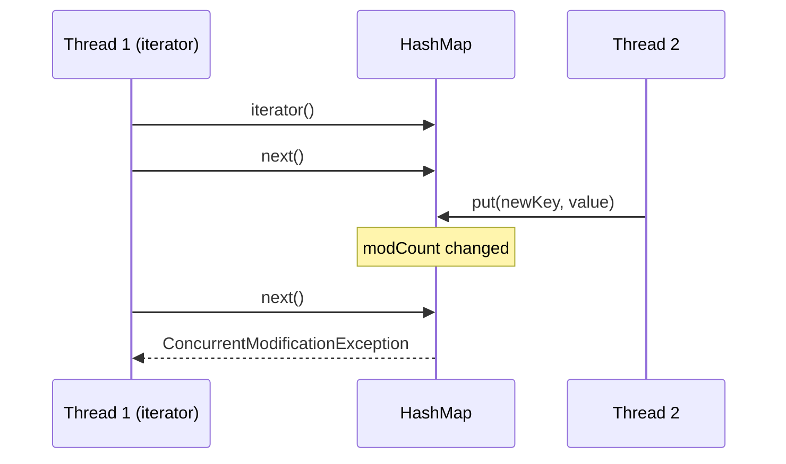

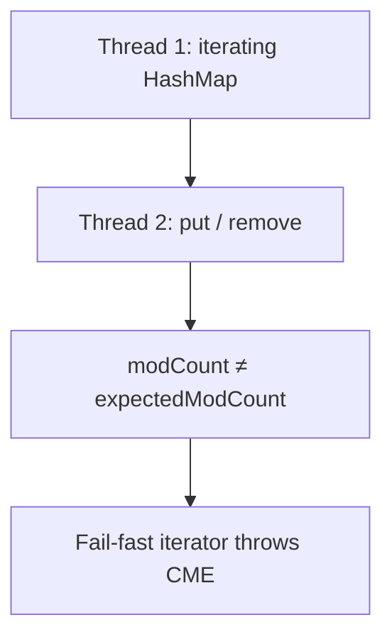

### `ConcurrentHashMap` — weakly consistent (fail-safe)

```mermaid
sequenceDiagram
  participant T1 as Thread 1 (iterator)
  participant CHM as ConcurrentHashMap
  participant T2 as Thread 2

  T1->>CHM: entrySet().iterator()
  T1->>CHM: next()
  T2->>CHM: put(newKey, value)
  T1->>CHM: next()
  Note over T1,CHM: may or may not see new entry; no CME
```

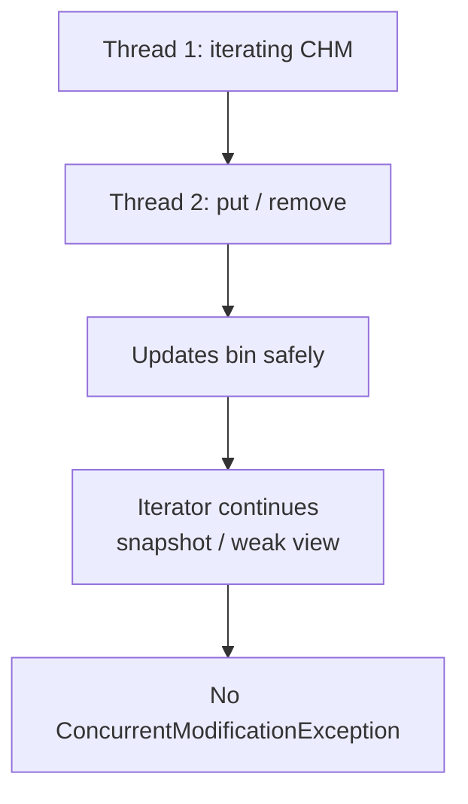

| | `HashMap` iterator | `ConcurrentHashMap` iterator |
| --- | ------------------ | --------------------------- |
| Sees concurrent adds? | N/A — **CME** first | **May** see some later entries |
| Guarantees | Fast-fail on structural change | No guarantee of full live view |
| Classroom name | **Fail-fast** | **Fail-safe** |

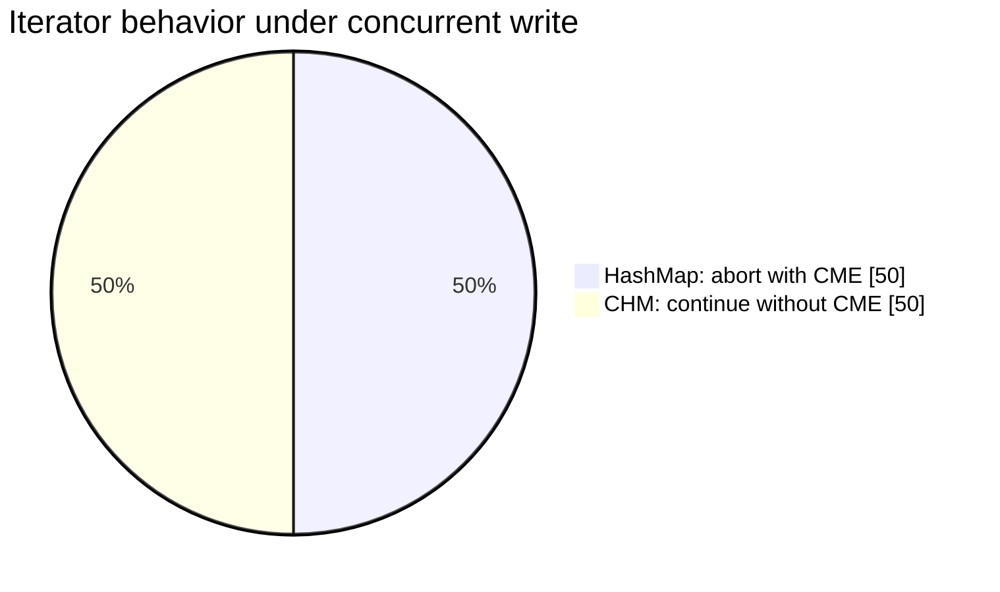

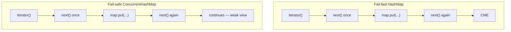

---

## Null keys and values

| | `HashMap` | `ConcurrentHashMap` |
| --- | --------- | ------------------- |
| `null` key | **One** `null` key allowed | **`NullPointerException`** |
| `null` value | Allowed | **`NullPointerException`** |

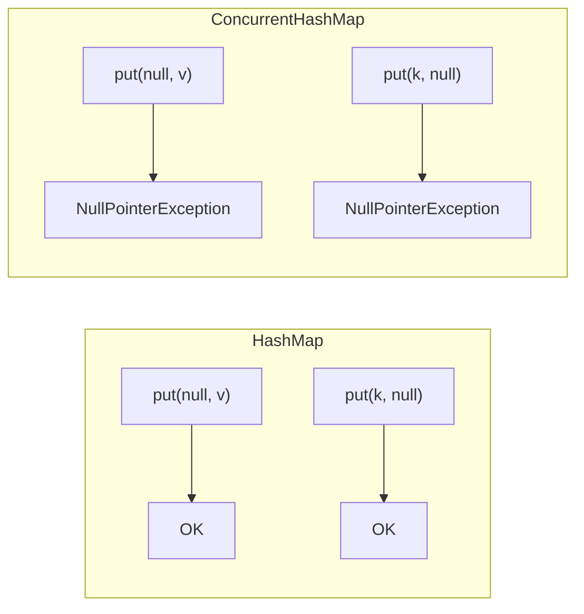

`ConcurrentHashMap` forbids `null` so **absence** is unambiguous in concurrent code (`get` returning `null` always means “no mapping”, not “mapped to null”).

---

## Which map should you use?

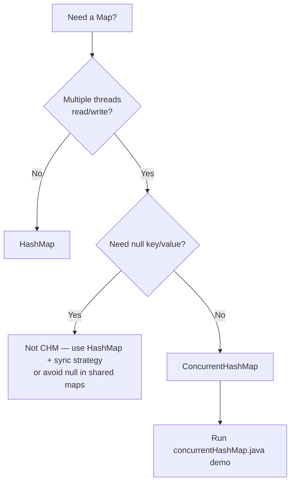

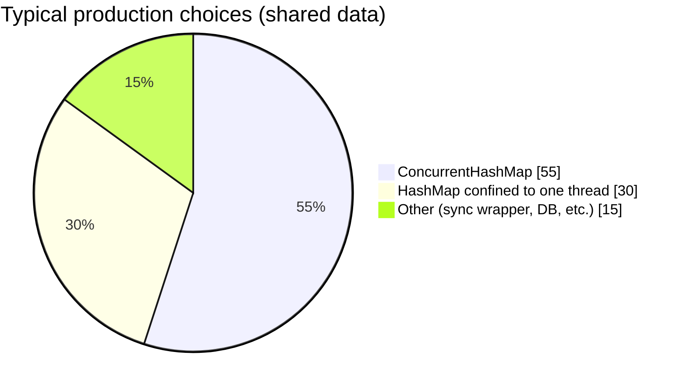

---

## Run the repo demo

```bash
cd demo
javac -d /tmp/chm \
  src/main/java/com/concurrentCollection/concurrentCollectionTypeInspector.java \
  src/main/java/com/concurrentCollection/concurrentMap/*.java
java -cp /tmp/chm com.concurrentCollection.concurrentMap.concurrentHashMap
```

---

## See also

- [concurrentMap.md](concurrentMap.md) — `ConcurrentMap` API, classroom CHM slide, **bucket internals**, constructors
- [concurrentCollections.md](concurrentCollections.md) — `threadDemo` / `ConcurrentModificationException`
- [map.md](../collection/map.md) — general `Map` hierarchy in the collection guides
