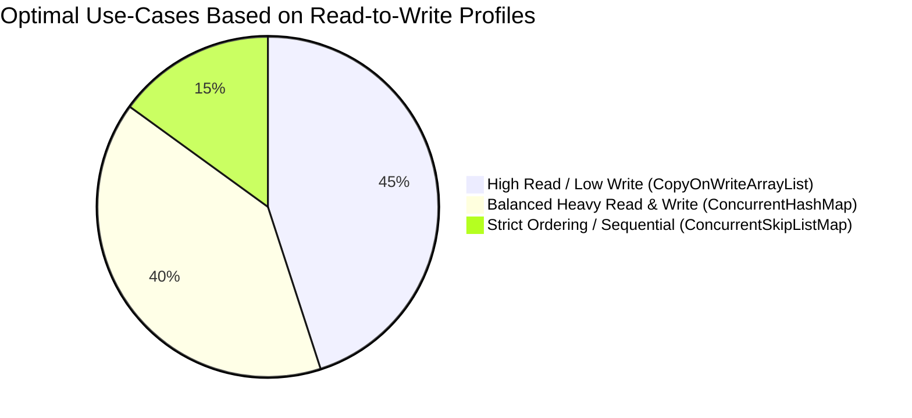

# Theory: Iterator and ListIterator Behavior in Java Concurrent Collections

When multiple threads interact with a collection, standard implementations (like `ArrayList` or `HashMap`) use **Fail-Fast Iterators**. Concurrent collections use **Weakly Consistent (Fail-Safe) Iterators**. 

Understanding how these iterators handle real-time modifications is critical for designing correct multi-threaded applications.

---

## 1. What Does "No Guarantee of Availability" Mean?

In a concurrent collection (e.g., `ConcurrentHashMap`, `CopyOnWriteArrayList`), if **Thread A** is iterating through the collection while **Thread B** is simultaneously updating it (adding, updating, or removing an element), there is **no guarantee** that Thread A's iterator will reflect Thread B's changes.

### The Trade-Off: Safety vs. Real-Time Accuracy
* **Safety (Guaranteed):** The iterator will **never** throw a `ConcurrentModificationException`. It will not crash or corrupt memory mid-loop.
* **Real-Time Accuracy (Not Guaranteed):** The iterator reflects the state of the collection *at the time the iterator was constructed*. It may or may not see modifications that happen after the loop has started.

---

## 2. Does This Apply to `ListIterator`?

**Yes. This rule applies equally to `ListIterator`.** 

`ListIterator` is an extended iterator interface designed specifically for list structures (allowing bidirectional traversal and element modification). In the `java.util.concurrent` package, the primary implementation of a thread-safe list is **`CopyOnWriteArrayList`**. 

When you invoke `list.listIterator()`, it behaves according to the **Snapshot Style** rules of concurrent collections.

---

## 3. How Different Concurrent Collections Handle Iterators

Concurrent collections manage consistency during iteration using two primary structural strategies:

### A. Snapshot Style (e.g., `CopyOnWriteArrayList` / `ListIterator`)
* **How it works:** When the `ListIterator` is created, it takes a reference to the underlying array exactly as it exists at that millisecond. 
* **The Mutation Rule:** If another thread adds or removes an element, `CopyOnWriteArrayList` creates a brand-new copy of the array for the update.
* **The Iterator Impact:** The `ListIterator` remains attached to the **old, original array snapshot**. Because of this, a `ListIterator` is **guaranteed NOT to see any updates** made by other threads after the loop begins.

### B. Weakly Consistent Style (e.g., `ConcurrentHashMap` / `Iterator`)
* **How it works:** The iterator travels directly through the live buckets/nodes of the hash map using volatile variables.
* **The Mutation Rule:** Threads update elements directly inside the map buckets using fine-grained locks or atomic operations.
* **The Iterator Impact:** If another thread modifies a bucket that the iterator **has already passed**, the iterator misses it. If a thread modifies a bucket that the iterator **has not reached yet**, the iterator *will* see the update. This depends entirely on thread scheduling and CPU cache timing, resulting in "no guarantee" of availability.

---

## 4. Summary Matrix: Fail-Fast vs. Weakly Consistent Iterators

| Feature                        | Fail-Fast Iterators (`ArrayList`, `HashMap`)             | Weakly Consistent Iterators / `ListIterator` (`ConcurrentHashMap`, `CopyOnWriteArrayList`)                                                                   |
| :----------------------------- | :------------------------------------------------------- | :----------------------------------------------------------------------------------------------------------------------------------------------------------- |
| **Concurrent Modification**    | Throws `ConcurrentModificationException` instantly.      | Allowed safely. No exceptions are thrown.                                                                                                                    |
| **Data State Checked**         | Checks a `modCount` flag on every single `.next()` call. | Traverses an immutable snapshot or reads live nodes atomically.                                                                                              |
| **Reflects Live Updates**      | No, it crashes instead.                                  | **Weakly**. May reflect them depending on timing, or won't reflect them at all (Snapshot).                                                                   |
| **Supports Iterator Mutators** | Supports `iterator.remove()`.                            | `CopyOnWriteArrayList`'s `ListIterator` does **not** support `remove()`, `set()`, or `add()` during loop execution (throws `UnsupportedOperationException`). |
# Comprehensive Guide: Thread Safety & Iterator Behavior in Java Concurrent Collections

When multiple threads interact with a collection, standard implementations use **Fail-Fast Iterators**, while concurrent collections use **Weakly Consistent (Fail-Safe) Iterators**. This guide explains their architectural differences, visibility semantics, and runtime behaviors.

---

## 1. High-Level Architectural Differences

### Memory Allocation & Lock Architecture
The diagram below contrasts how a legacy synchronized or traditional collection handles locks versus how modern concurrent collections isolate operations via fine-grained mechanisms (like lock striping or snapshots).

```mermaid
graph TD
    subgraph Traditional / Synchronized Wrapper
        A[Thread 1: Read/Write] -->|Locks ENTIRE Collection| B(HashMap / ArrayList)
        C[Thread 2: Read/Write] -->|Blocked / Must Wait| B
    end

    subgraph Concurrent Architecture (Fine-Grained)
        D[Thread 1: Write Bucket 1] -->|Locks Bucket 1 Only| E[Bucket 1]
        F[Thread 2: Write Bucket 5] -->|Locks Bucket 5 Only| G[Bucket 5]
        H[Thread 3: Read Bucket 3] -->|Lock-Free Read| I[Bucket 3]
    end
```

---

## 2. Weakly Consistent Iterators vs. ListIterator

In a concurrent collection (e.g., `ConcurrentHashMap`, `CopyOnWriteArrayList`), if **Thread A** iterates through the collection while **Thread B** simultaneously modifies it, there is **no guarantee** that Thread A's iterator will reflect Thread B's changes.

### The Breakdown of Guarantees
* **Safety (Guaranteed):** The iterator will **never** throw a `ConcurrentModificationException`. It will not crash or corrupt memory mid-loop.
* **Real-Time Availability (Not Guaranteed):** The iterator reflects the state of the collection *at the exact millisecond the iterator was constructed*. It may or may not see modifications that happen after the loop has started.

### How Different Structures Handle Iteration:
1. **Snapshot Style (`CopyOnWriteArrayList` / `ListIterator`):** 
   When the `ListIterator` is created, it takes a reference to the array snapshot. If another thread adds an element, the list duplicates its underlying array to a new space. The iterator stays attached to the **old snapshot** and is **guaranteed NOT to see the live update**.
2. **Weakly Consistent Style (`ConcurrentHashMap` / `Iterator`):** 
   The iterator travels directly through live nodes using volatile variables. If another thread modifies a bucket the iterator *has already passed*, the iterator misses it. If the modification happens *ahead* of the iterator's current position, it *will* see it.

---

## 3. Statistical Comparison: Read vs. Write Performance

The structural strategies dictate performance profiles. The chart below breaks down the typical optimal application use-case scenarios based on read-to-write ratios:



---

## 4. Complete Verification Example

This runnable Java class demonstrates the structural difference between `ArrayList` (which crashes) and `CopyOnWriteArrayList` (which executes safely via an isolated snapshot).

```java
import java.util.ArrayList;
import java.util.Iterator;
import java.util.ListIterator;
import java.util.concurrent.CopyOnWriteArrayList;

public class ConcurrentIteratorVerification {

    public static void main(String[] args) throws InterruptedException {
        System.out.println("=== 1. DEMONSTRATING FAIL-FAST CRASH (ArrayList) ===");
        try {
            simulateFailFast();
        } catch (Exception e) {
            System.out.println("Result: Caught expected exception -> " + e.getClass().getName());
        }

        System.out.println("\n=== 2. DEMONSTRATING SNAPSHOT SAFETY (CopyOnWriteArrayList) ===");
        simulateWeaklyConsistent();
    }

    private static void simulateFailFast() throws InterruptedException {
        ArrayList<String> list = new ArrayList<>();
        list.add("Apple");
        list.add("Banana");

        Thread modifier = new Thread(() -> {
            try { Thread.sleep(100); } catch (InterruptedException ignored) {}
            list.add("Cherry"); // Modifies structural state (modCount increments)
        });
        modifier.start();

        Iterator<String> it = list.iterator();
        while (it.hasNext()) {
            System.out.println("ArrayList Reading: " + it.next());
            Thread.sleep(200); // Allow modifier thread to execute write execution
        }
    }

    private static void simulateWeaklyConsistent() throws InterruptedException {
        CopyOnWriteArrayList<String> concurrentList = new CopyOnWriteArrayList<>();
        concurrentList.add("Apple");
        concurrentList.add("Banana");

        Thread modifier = new Thread(() -> {
            try { Thread.sleep(100); } catch (InterruptedException ignored) {}
            System.out.println("[Child Thread] Modifying list -> Adding 'Cherry'");
            concurrentList.add("Cherry"); 
        });
        modifier.start();

        // ListIterator takes a snapshot reference of the array containing [Apple, Banana]
        ListIterator<String> listIt = concurrentList.listIterator();
        while (listIt.hasNext()) {
            System.out.println("ListIterator Reading: " + listIt.next());
            Thread.sleep(200); 
        }

        modifier.join();
        System.out.println("Execution finished without crashing!");
        System.out.println("Final backing list contents: " + concurrentList);
    }
}
```

---

## 5. Summary Matrix: Traditional vs. Concurrent Iterators

| Evaluation Feature              | Fail-Fast Iterators (`ArrayList`, `HashMap`)                       | Weakly Consistent / Snapshot Iterators (`ConcurrentHashMap`, `CopyOnWriteArrayList`)                                                   |
| :------------------------------ | :----------------------------------------------------------------- | :------------------------------------------------------------------------------------------------------------------------------------- |
| **Concurrent Modification**     | Throws `ConcurrentModificationException` instantly.                | Allowed safely. No exceptions are thrown.                                                                                              |
| **Data Integrity Verification** | Compares expected `modCount` with actual state on every `.next()`. | Traverses immutable array views or accesses memory nodes atomically via volatile fields.                                               |
| **Visibility of Live Edits**    | Irrelevant (Crashes runtime execution).                            | **Weakly Consistent:** Depends on index position vs thread timing, or entirely isolated (Snapshot).                                    |
| **Iterator Mutation Support**   | Supports `iterator.remove()`.                                      | `CopyOnWriteArrayList` elements *cannot* be modified via `ListIterator.add()` or `.remove()` (throws `UnsupportedOperationException`). |
