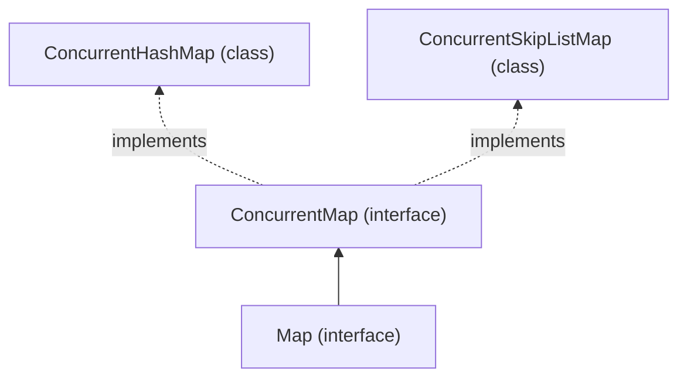
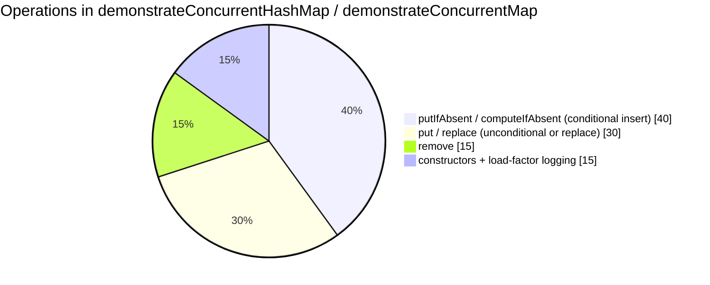
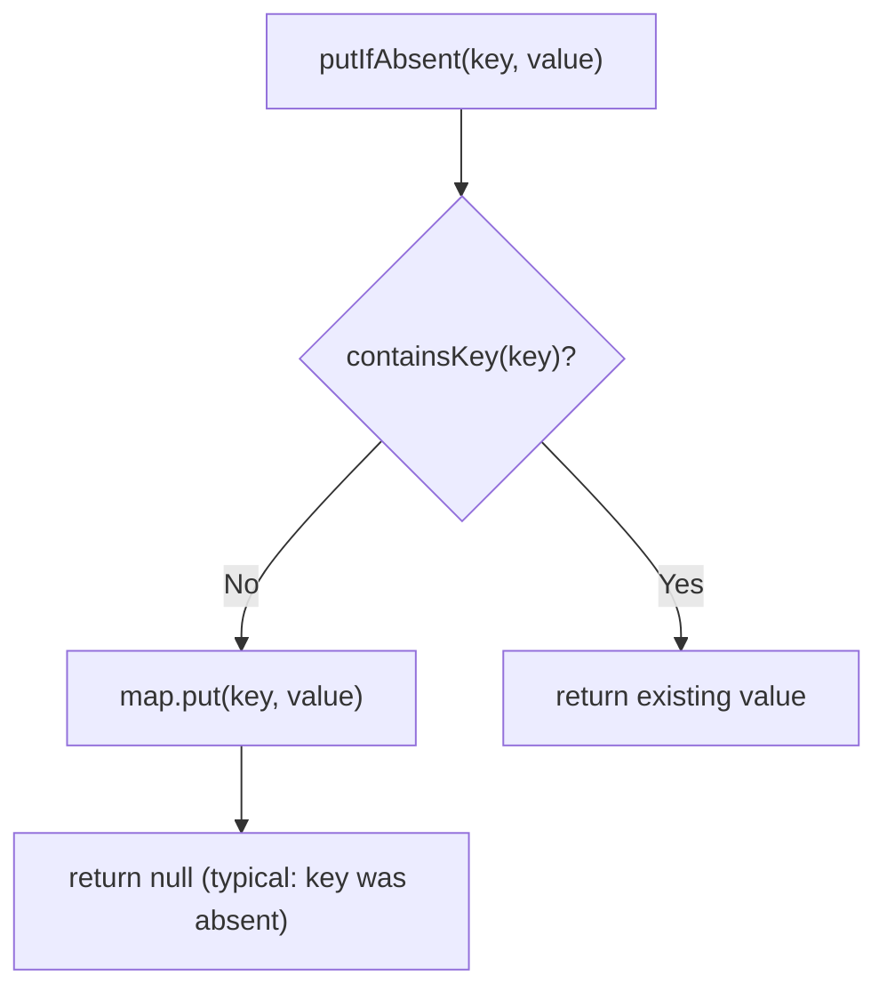
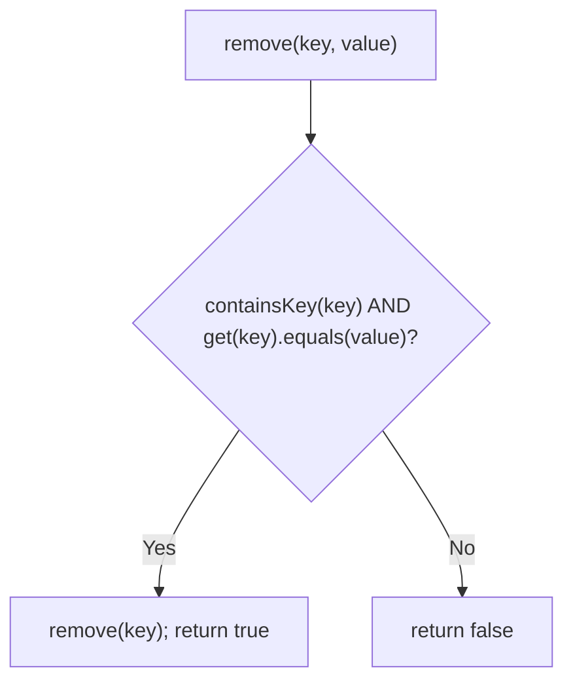
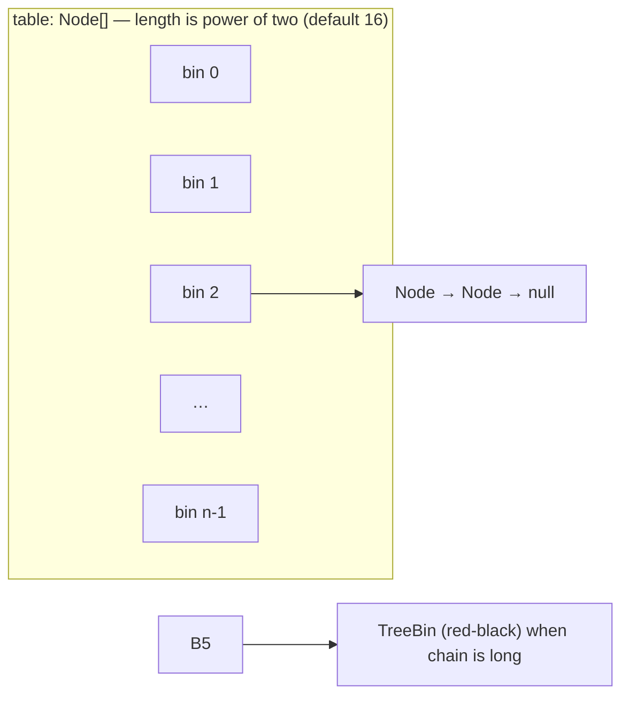
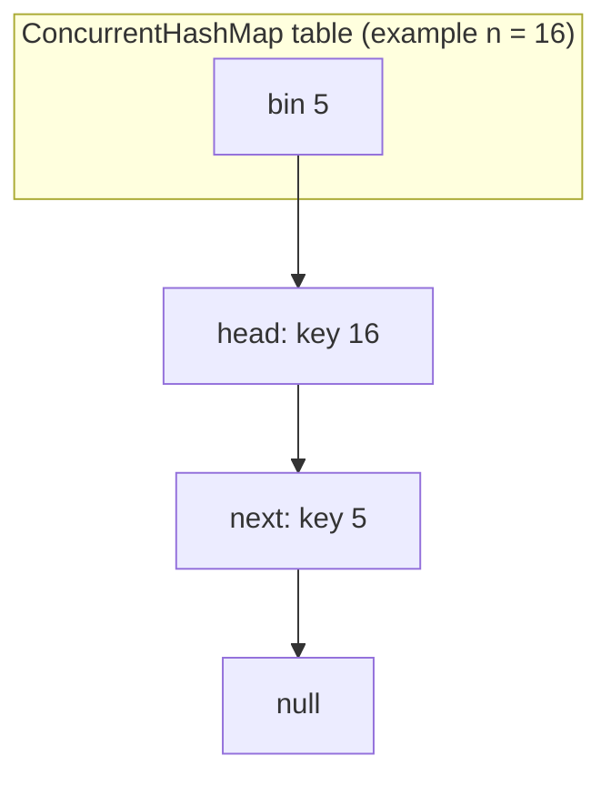
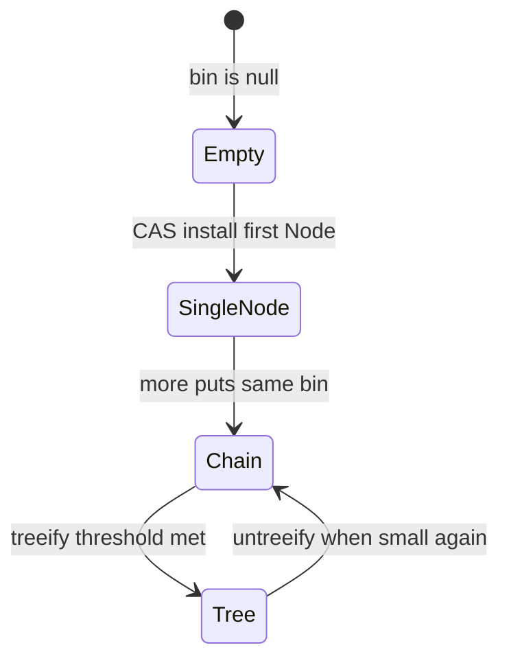
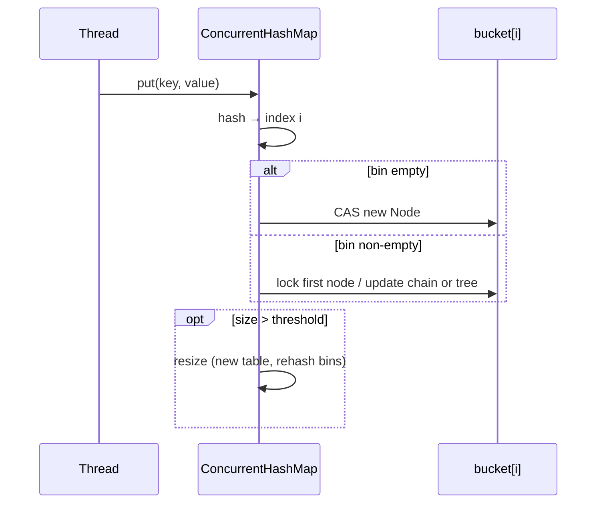
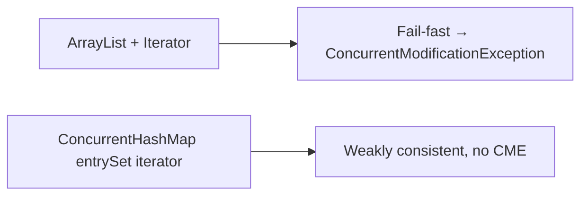

# ConcurrentMap and ConcurrentHashMap

> Runnable entry points: [`concurrentMap.java`](../../../demo/src/main/java/com/concurrentCollection/concurrentMap/concurrentMap.java) · [`concurrentHashMap.java`](../../../demo/src/main/java/com/concurrentCollection/concurrentMap/concurrentHashMap.java) · shared logic in [`concurrentMapDemo.java`](../../../demo/src/main/java/com/concurrentCollection/concurrentMap/concurrentMapDemo.java).

---

## Guide map

| Section | What you learn |
| ------- | -------------- |
| [Type hierarchy](#type-hierarchy-map--concurrentmap--concurrenthashmap) | `Map` → `ConcurrentMap` → `ConcurrentHashMap` |
| [Demo classes](#how-concurrentmapjava-and-concurrenthashmapjava-run) | Same pipeline, different `collectionType` string |
| [`ConcurrentMap` API](#concurrentmap-interface-atomic-check-then-act) | `putIfAbsent`, conditional `remove`, vs plain `put` |
| [Internal buckets](#concurrenthashmap-internal-structure-jdk-8) | Bucket array, chains, tree bins, CAS + bin locks |
| [Run commands](#run-the-demos) | Compile and execute both mains |

---

## Type hierarchy: `Map` → `ConcurrentMap` → `ConcurrentHashMap`

`ConcurrentMap` is an **interface** that extends `Map` and adds thread-safe **atomic** operations (for example “insert only if absent”). `ConcurrentHashMap` is the usual **concrete class** you assign to a `ConcurrentMap` reference.



### Reference slides (classroom notes)

<p align="center">
  
</p>

*Figure: hierarchy, `putIfAbsent` intent, and **`put()`** vs **`putIfAbsent()`** behavior.*

<p align="center">
  
</p>

*Figure: `put` overwrites; `putIfAbsent` skips when the key exists; **`remove(key, value)`** removes only when the mapped value matches.*

---

## How `concurrentMap.java` and `concurrentHashMap.java` run

Both classes are thin **launchers**. They extend `concurrentMapDemo` and call the same three-step pipeline with a different label:

```mermaid
flowchart TD
  subgraph launchers ["Entry-point classes"]
    M["concurrentMap.main()"]
    H["concurrentHashMap.main()"]
  end

  M --> P1["demonconcurrentMap(\"ConcurrentMap\")"]
  H --> P2["demonconcurrentMap(\"ConcurrentHashMap\")"]

  P1 --> S1["concurrentCollectionType(type)"]
  P2 --> S1
  S1 --> S2["concurrentConstructors(type)"]
  S2 --> S3["concurrentMapLoadFactor(type)"]
```

| Step | Method | `ConcurrentMap` | `ConcurrentHashMap` |
| ---- | ------ | --------------- | ------------------- |
| 1 | `concurrentCollectionType` | `demonstrateConcurrentMap()` — interface ref backed by **`new ConcurrentHashMap<>()`** | `demonstrateConcurrentHashMap()` — concrete map |
| 2 | `concurrentConstructors` | Shows **cannot** `new ConcurrentMap()`; uses `ConcurrentHashMap` and `ConcurrentSkipListMap` | Five constructors (default, capacity, copy, capacity + load factor, + concurrency level) |
| 3 | `concurrentMapLoadFactor` | Message: load factor **depends on implementation** | Default load factor **0.75** |

### Shared operation sequence (`demonstrateConcurrent*`)

Each demonstrate method runs the same **ConcurrentMap** API calls on a `ConcurrentHashMap` instance (even when the static type is `ConcurrentMap`):

```text
putIfAbsent("key1", "value1")
put("key2", "value2")
remove("key2")
replace("key1", "newValue1")
computeIfAbsent("key3", k -> "value3")
forEach entry → println
```



### Verified sample output (`concurrentHashMap`)

```text
key1=newValue1
key3=value3
ConcurrentHashMap: {key1=newValue1, key3=value3}
Demonstrating constructors for ConcurrentHashMap:
 -> Created empty ConcurrentHashMap (Default)
 ...
ConcurrentHashMap has a default load factor of 0.75
```

---

## `ConcurrentMap` interface: atomic check-then-act

These methods exist so you do **not** need `if (!map.containsKey(k)) map.put(k, v)` as two separate steps (which is unsafe under concurrency without external locking).

### 1) `V putIfAbsent(K key, V value)`

**Goal:** add the entry **only if the key is not already mapped**.



| Method | If key already exists |
| ------ | --------------------- |
| **`put(key, value)`** | **Replaces** old value; returns **old** value |
| **`putIfAbsent(key, value)`** | **Does not** replace; returns **existing** value |

**Classroom trace** (from slides; keys are `Integer`, values `String`):

```java
ConcurrentHashMap<Integer, String> m = new ConcurrentHashMap<>();
m.put(101, "Durga");
m.put(101, "Ravi");           // overwrite → {101=Ravi}
m.putIfAbsent(101, "Siva");   // key present → still {101=Ravi}
```

### 2) `boolean remove(Object key, Object value)`

**Goal:** remove the entry **only if** the key maps to **that exact value** (atomic compare-and-remove).



```java
m.put(101, "Durga");
m.remove(101, "Ravi");   // value mismatch → {101=Durga}
m.remove(101, "Durga");  // match → {}
```

### 3) Third common method (used in the demo)

`replace(K key, V value)` and **`computeIfAbsent`** are also defined on `ConcurrentMap` / implemented by `ConcurrentHashMap`; the demo calls `replace` and `computeIfAbsent` after the remove examples above.

---

## ConcurrentHashMap internal structure (JDK 8+)

Modern `ConcurrentHashMap` (Java 8 and later) is **not** segmented like the pre-Java-8 design. It is a **single array of bins** (similar in spirit to `HashMap`), with **fine-grained** synchronization per bin and **CAS** for many empty-bin inserts.

### High-level picture



| Part | Role |
| ---- | ---- |
| **`table`** | Array of bucket heads; index from spread hash and `(length - 1)` |
| **`Node`** | Singly linked list of entries in one bin (key, value, hash, `next`) |
| **`TreeBin` / tree nodes** | When a bin’s list grows past the threshold and the table is large enough, the bin becomes a **balanced tree** (like `HashMap` treeify) |
| **CAS** | Threads can often install the **first** node in an empty bin without locking the whole map |
| **Bin lock** | Updates to a non-empty bin typically **synchronize on the first node** of that bin (lock **striping** per bucket, not one global map lock) |

### How a key picks a bin

Same idea as `HashMap` (power-of-two length):

1. Compute `hash = spread(key.hashCode())` (XOR with high bits to reduce clustering).
2. **Bucket index** = `hash & (table.length - 1)` (equivalent to `hash % length` when length is a power of two).

```text
index = (spread(hashCode)) & (n - 1)     // n = table.length, e.g. 16 → indexes 0..15
```

### Whiteboard-style bucket array (conceptual)

After several `put` operations, many bins stay **null**; collisions form **chains** at one index; under heavy collision the chain may **treeify**.

```text
 index │  bin head (conceptual)
───────┼──────────────────────────────────────────
   0   │  null
   1   │  Node(23 → "v5") → null
   2   │  Node(2 → "v2") → null
   3   │  null
   4   │  Node(15 → "v4") → null
   5   │  Node(16 → "v6") → Node(5 → "v1") → null   ← chain (two keys, same bin)
   …   │  …
  15   │  null
```



> **Contrast with `Hashtable`:** one lock covered the whole table for writes; readers still paid synchronization cost. **ConcurrentHashMap** lets different threads update **different bins** in parallel. See also the [Hashtable bucket walkthrough](../collection/hashTable.md) for the older all-or-nothing locking model.

### Collision → list → tree

| Stage | Structure | Lookup cost in that bin |
| ----- | --------- | ------------------------ |
| Few keys in bin | Linked **`Node`** chain | O(chain length) |
| Chain length ≥ **8** and table size ≥ **64** | **`TreeBin`** (red-black) | O(log n) in that bin |



### `put` flow (simplified)



### Resize and load factor

| Constant (typical) | Meaning |
| ------------------ | ------- |
| Default **initial capacity** | **16** bins (power of two) |
| Default **load factor** | **0.75** — resize when `size > capacity × loadFactor` |
| **Treeify threshold** | **8** nodes in one bin (with minimum table size **64** for treeify) |

The demo’s constructor `new ConcurrentHashMap<>(128, 0.75f, 16)` sets **initial capacity**, **load factor**, and a **concurrency-level hint** (legacy parameter from older APIs; on JDK 8+ it still influences internal sizing expectations but the segment array is gone).

### Iteration vs `ArrayList` + CME

Iterators over `ConcurrentHashMap` are **weakly consistent**: they reflect the map at some point in time and **do not** throw `ConcurrentModificationException` when another thread updates the map. They may or may not see entries added during iteration.



---

## Relation to this repo’s demos

| File | `main` calls | Backing type in `demonstrate*` |
| ---- | ------------ | ------------------------------ |
| `concurrentMap.java` | `"ConcurrentMap"` | `ConcurrentMap<String,String> map = new ConcurrentHashMap<>()` |
| `concurrentHashMap.java` | `"ConcurrentHashMap"` | `ConcurrentHashMap<String,String> map = new ConcurrentHashMap<>()` |

[`concurrentCollectionTypeInspector.java`](../../../demo/src/main/java/com/concurrentCollection/concurrentCollectionTypeInspector.java) prints load-factor notes for the selected label when the launcher reaches step 3.

---

## Run the demos

```bash
cd demo
javac -d /tmp/cmap \
  src/main/java/com/concurrentCollection/concurrentCollectionTypeInspector.java \
  src/main/java/com/concurrentCollection/concurrentMap/*.java

java -cp /tmp/cmap com.concurrentCollection.concurrentMap.concurrentMap
java -cp /tmp/cmap com.concurrentCollection.concurrentMap.concurrentHashMap
```

---

## See also

- Hub: [concurrentCollections.md](concurrentCollections.md) — `threadDemo` and `ConcurrentModificationException`
- Legacy synchronized buckets: [hashTable.md](../collection/hashTable.md)
