# ConcurrentMap and ConcurrentHashMap

> Runnable entry points: [`concurrentMap.java`](../../../demo/src/main/java/com/concurrentCollection/concurrentMap/concurrentMap.java) · [`concurrentHashMap.java`](../../../demo/src/main/java/com/concurrentCollection/concurrentMap/concurrentHashMap.java) · shared logic in [`concurrentMapDemo.java`](../../../demo/src/main/java/com/concurrentCollection/concurrentMap/concurrentMapDemo.java).

---

## Guide map

| Section | What you learn |
| ------- | -------------- |
| [Classroom overview](#concurrenthashmap--classroom-overview) | Reads vs writes, concurrency level **16**, constructors |
| [Type hierarchy](#type-hierarchy-map--concurrentmap--concurrenthashmap) | `Map` → `ConcurrentMap` → `ConcurrentHashMap` |
| [Demo classes](#how-concurrentmapjava-and-concurrenthashmapjava-run) | Same pipeline, different `collectionType` string |
| [`ConcurrentMap` API](#concurrentmap-interface-atomic-check-then-act) | `putIfAbsent`, conditional `remove`, vs plain `put` |
| [Internal buckets](#concurrenthashmap-internal-structure-jdk-8) | Bucket array, chains, tree bins, CAS + bin locks |
| [Bucket lock vs whole-map lock](#bucket-level-lock-vs-whole-collection-lock) | `Hashtable` / `synchronizedMap` vs `ConcurrentHashMap` |
| [HashMap vs CHM](concurrentHashMap.md) | Classroom comparison slide, CME flows, null rules |
| [Run commands](#run-the-demos) | Compile and execute both mains |

---

## Type hierarchy: `Map` → `ConcurrentMap` → `ConcurrentHashMap`

`ConcurrentMap` is an **interface** that extends `Map` and adds thread-safe **atomic** operations (for example “insert only if absent”). `ConcurrentHashMap` is the usual **concrete class** you assign to a `ConcurrentMap` reference.

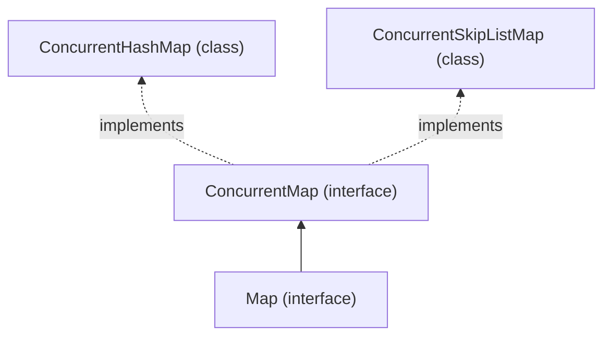

### Reference slides (classroom notes)

<p align="center">
  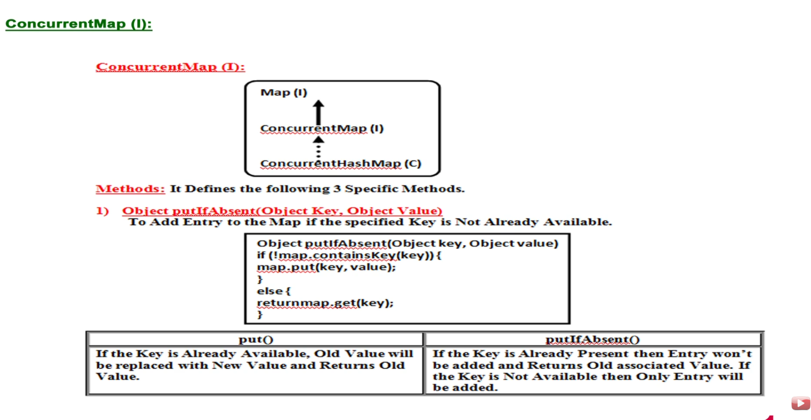
</p>

*Figure: hierarchy, `putIfAbsent` intent, and **`put()`** vs **`putIfAbsent()`** behavior.*

<p align="center">
  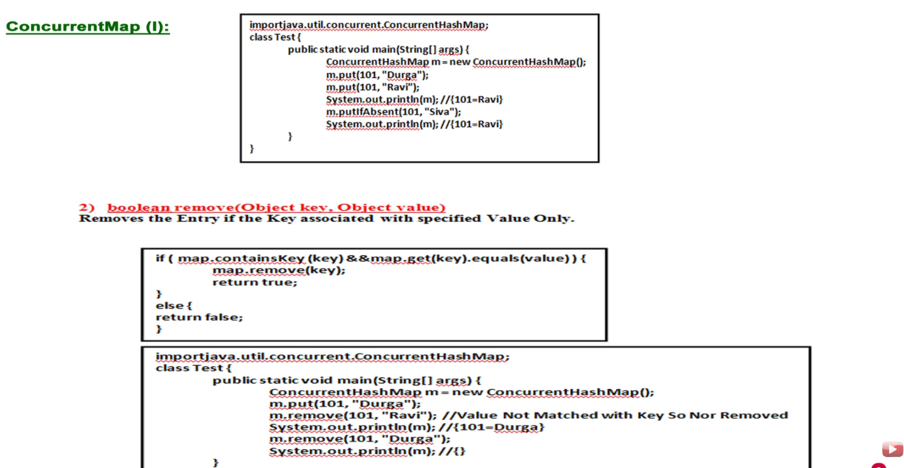
</p>

*Figure: `put` overwrites; `putIfAbsent` skips when the key exists; **`remove(key, value)`** removes only when the mapped value matches.*

---

## ConcurrentHashMap — classroom overview

The slide below is the **high-level story** for interviews: hash-table layout, **reads without locking the whole map**, **writes at bucket / portion level**, default **concurrency level 16**, no `null`, and iterators that do not throw `ConcurrentModificationException`.

<p align="center">
  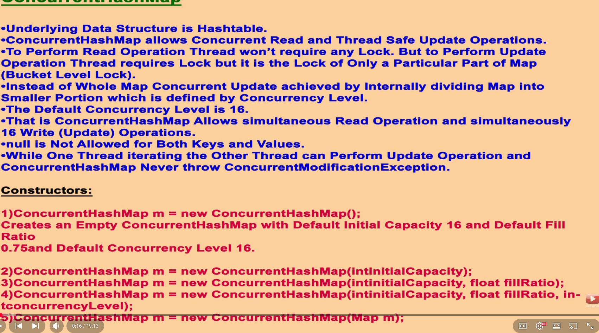
</p>

### Slide points → precise behavior

| Classroom note | Meaning |
| -------------- | ------- |
| Underlying DS is **Hashtable**-style | **Array of buckets** + chaining (like `Hashtable` / `HashMap`), **not** the legacy `java.util.Hashtable` class. `ConcurrentHashMap` is its own implementation in `java.util.concurrent`. |
| **Concurrent reads** + **thread-safe updates** | Many threads can read; structural updates are coordinated so the table stays consistent. |
| **Read:** no lock | Reads do **not** take the **whole-map** monitor (contrast `Hashtable`). Implementation uses `volatile`/safe publication so readers typically do not block writers on the entire table. |
| **Update:** **bucket-level lock** | Writers lock only the **relevant part** of the table (a **bin** in JDK 8+), not every other bucket. |
| **Concurrency level** (default **16**) | Constructor parameter: map is treated as **several portions** so up to **16 update paths** can proceed without all piling onto one global lock. **Java 7 and earlier:** literal **`Segment[]`** of that size. **Java 8+:** **per-bin** locking/CAS; `concurrencyLevel` is still a sizing hint in the API, but the mental model “~16 independent write lanes” remains useful. |
| **`null` key / value** | **Not allowed** — `NullPointerException` (stricter than `HashMap`). |
| **Iteration** | **Fail-safe / weakly consistent:** one thread may iterate while another updates; **no** `ConcurrentModificationException` (see [hub](concurrentCollections.md#threaddemojava--complete-execution-flow) for the fail-fast `ArrayList` case). |

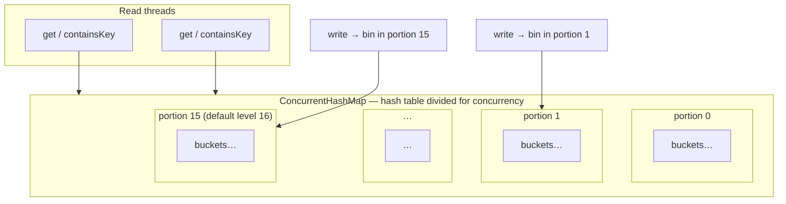

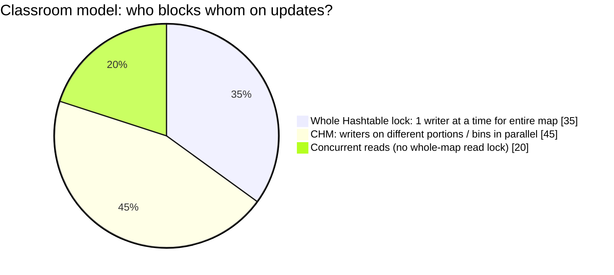

### Constructors (from slide + demo)

| # | Constructor | Defaults / notes |
| - | ----------- | ---------------- |
| 1 | `new ConcurrentHashMap<>()` | Initial capacity **16**, load factor **0.75**, concurrency level **16** |
| 2 | `new ConcurrentHashMap<>(initialCapacity)` | Custom starting bucket table size |
| 3 | `new ConcurrentHashMap<>(initialCapacity, fillRatio)` | Custom capacity + load factor |
| 4 | `new ConcurrentHashMap<>(initialCapacity, fillRatio, concurrencyLevel)` | e.g. demo uses `(128, 0.75f, 16)` — see [`demonstrateConcurrentHashMapConstructors`](../../../demo/src/main/java/com/concurrentCollection/concurrentMap/concurrentMapDemo.java) |
| 5 | `new ConcurrentHashMap<>(Map m)` | Copy mappings from an existing `Map` |

```java
// Slide-style defaults (constructor 1)
ConcurrentHashMap<Integer, String> m = new ConcurrentHashMap<>();

// Demo constructor 4 (concurrency level explicit)
ConcurrentHashMap<String, Integer> map5 = new ConcurrentHashMap<>(128, 0.75f, 16);
```

> **Bridge to internals:** [Internal structure (JDK 8+)](#concurrenthashmap-internal-structure-jdk-8) shows **bins, CAS, and treeify**. [Bucket-level lock vs whole-collection lock](#bucket-level-lock-vs-whole-collection-lock) contrasts `Hashtable` / `synchronizedMap` with this slide’s **portion / bucket** write model.

---

## How `concurrentMap.java` and `concurrentHashMap.java` run

Both classes are thin **launchers**. They extend `concurrentMapDemo` and call the same three-step pipeline with a different label:

```mermaid
flowchart TD
  subgraph launchers ["Entry-point classes"]
    M["concurrentMap.main()"]
    H["concurrentHashMap.main()"]
  end

  M --> P1["demonconcurrentMap(\"ConcurrentMap\")"]
  H --> P2["demonconcurrentMap(\"ConcurrentHashMap\")"]

  P1 --> S1["concurrentCollectionType(type)"]
  P2 --> S1
  S1 --> S2["concurrentConstructors(type)"]
  S2 --> S3["concurrentMapLoadFactor(type)"]
```

| Step | Method | `ConcurrentMap` | `ConcurrentHashMap` |
| ---- | ------ | --------------- | ------------------- |
| 1 | `concurrentCollectionType` | `demonstrateConcurrentMap()` — interface ref backed by **`new ConcurrentHashMap<>()`** | `demonstrateConcurrentHashMap()` — concrete map |
| 2 | `concurrentConstructors` | Shows **cannot** `new ConcurrentMap()`; uses `ConcurrentHashMap` and `ConcurrentSkipListMap` | Five constructors (default, capacity, copy, capacity + load factor, + concurrency level) |
| 3 | `concurrentMapLoadFactor` | Message: load factor **depends on implementation** | Default load factor **0.75** |

### Shared operation sequence (`demonstrateConcurrent*`)

Each demonstrate method runs the same **ConcurrentMap** API calls on a `ConcurrentHashMap` instance (even when the static type is `ConcurrentMap`):

```text
putIfAbsent("key1", "value1")
put("key2", "value2")
remove("key2")
replace("key1", "newValue1")
computeIfAbsent("key3", k -> "value3")
forEach entry → println
```

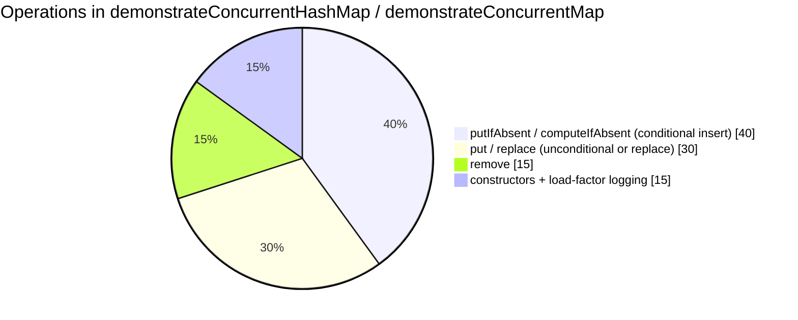

### Verified sample output (`concurrentHashMap`)

```text
key1=newValue1
key3=value3
ConcurrentHashMap: {key1=newValue1, key3=value3}
Demonstrating constructors for ConcurrentHashMap:
 -> Created empty ConcurrentHashMap (Default)
 ...
ConcurrentHashMap has a default load factor of 0.75
```

---

## `ConcurrentMap` interface: atomic check-then-act

These methods exist so you do **not** need `if (!map.containsKey(k)) map.put(k, v)` as two separate steps (which is unsafe under concurrency without external locking).

### 1) `V putIfAbsent(K key, V value)`

**Goal:** add the entry **only if the key is not already mapped**.

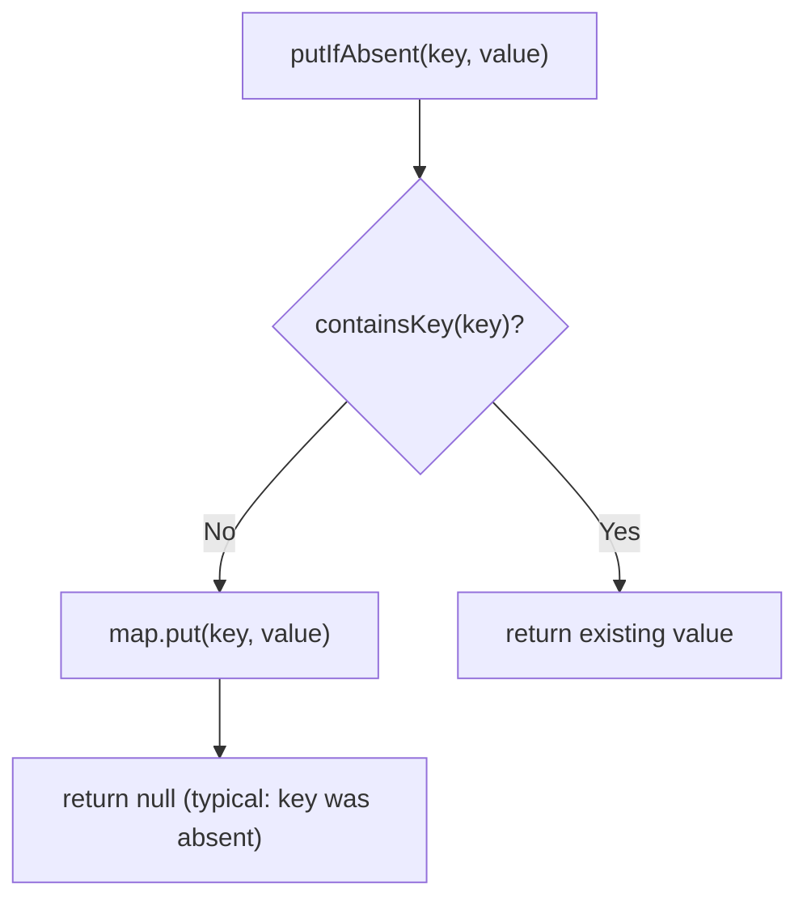

| Method | If key already exists |
| ------ | --------------------- |
| **`put(key, value)`** | **Replaces** old value; returns **old** value |
| **`putIfAbsent(key, value)`** | **Does not** replace; returns **existing** value |

**Classroom trace** (from slides; keys are `Integer`, values `String`):

```java
ConcurrentHashMap<Integer, String> m = new ConcurrentHashMap<>();
m.put(101, "Durga");
m.put(101, "Ravi");           // overwrite → {101=Ravi}
m.putIfAbsent(101, "Siva");   // key present → still {101=Ravi}
```

### 2) `boolean remove(Object key, Object value)`

**Goal:** remove the entry **only if** the key maps to **that exact value** (atomic compare-and-remove).

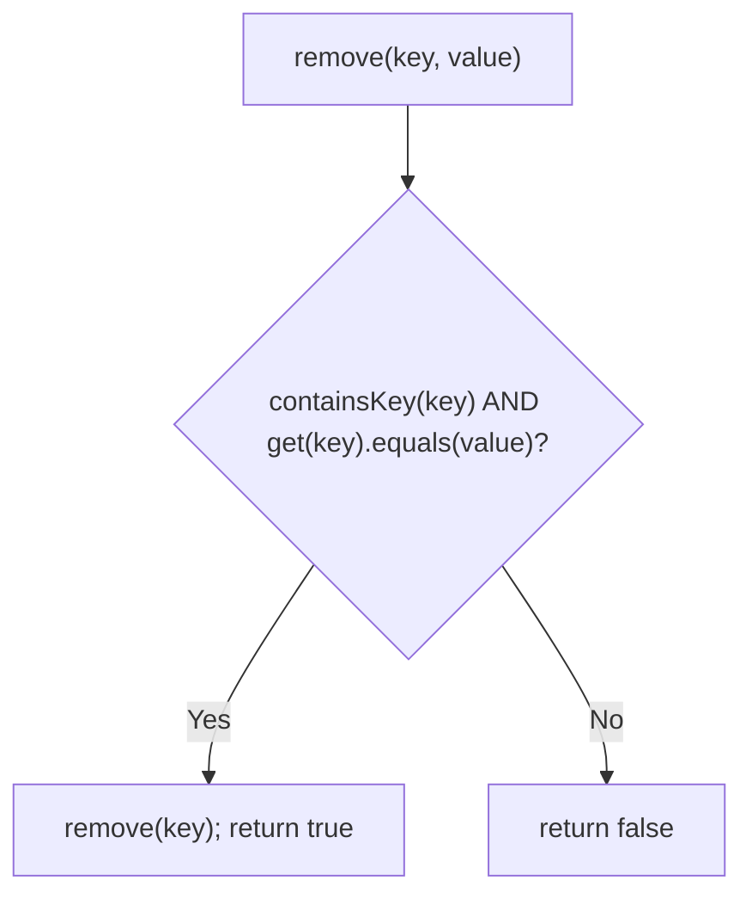

```java
m.put(101, "Durga");
m.remove(101, "Ravi");   // value mismatch → {101=Durga}
m.remove(101, "Durga");  // match → {}
```

### 3) Third common method (used in the demo)

`replace(K key, V value)` and **`computeIfAbsent`** are also defined on `ConcurrentMap` / implemented by `ConcurrentHashMap`; the demo calls `replace` and `computeIfAbsent` after the remove examples above.

---

## ConcurrentHashMap internal structure (JDK 8+)

Modern `ConcurrentHashMap` (Java 8 and later) is **not** segmented like the pre-Java-8 design. It is a **single array of bins** (similar in spirit to `HashMap`), with **fine-grained** synchronization per bin and **CAS** for many empty-bin inserts.

### High-level picture

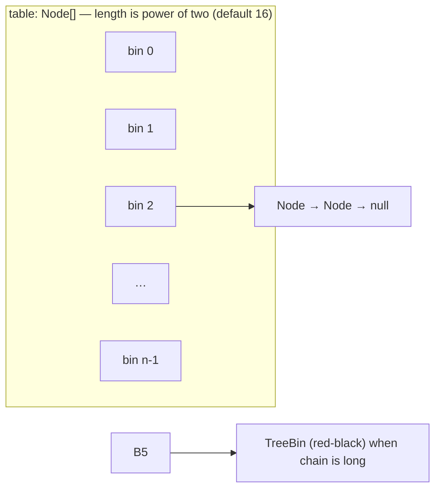

| Part | Role |
| ---- | ---- |
| **`table`** | Array of bucket heads; index from spread hash and `(length - 1)` |
| **`Node`** | Singly linked list of entries in one bin (key, value, hash, `next`) |
| **`TreeBin` / tree nodes** | When a bin’s list grows past the threshold and the table is large enough, the bin becomes a **balanced tree** (like `HashMap` treeify) |
| **CAS** | Threads can often install the **first** node in an empty bin without locking the whole map |
| **Bin lock** | Updates to a non-empty bin typically **synchronize on the first node** of that bin (lock **striping** per bucket, not one global map lock) |

### How a key picks a bin

Same idea as `HashMap` (power-of-two length):

1. Compute `hash = spread(key.hashCode())` (XOR with high bits to reduce clustering).
2. **Bucket index** = `hash & (table.length - 1)` (equivalent to `hash % length` when length is a power of two).

```text
index = (spread(hashCode)) & (n - 1)     // n = table.length, e.g. 16 → indexes 0..15
```

### Whiteboard-style bucket array (conceptual)

After several `put` operations, many bins stay **null**; collisions form **chains** at one index; under heavy collision the chain may **treeify**.

```text
 index │  bin head (conceptual)
───────┼──────────────────────────────────────────
   0   │  null
   1   │  Node(23 → "v5") → null
   2   │  Node(2 → "v2") → null
   3   │  null
   4   │  Node(15 → "v4") → null
   5   │  Node(16 → "v6") → Node(5 → "v1") → null   ← chain (two keys, same bin)
   …   │  …
  15   │  null
```

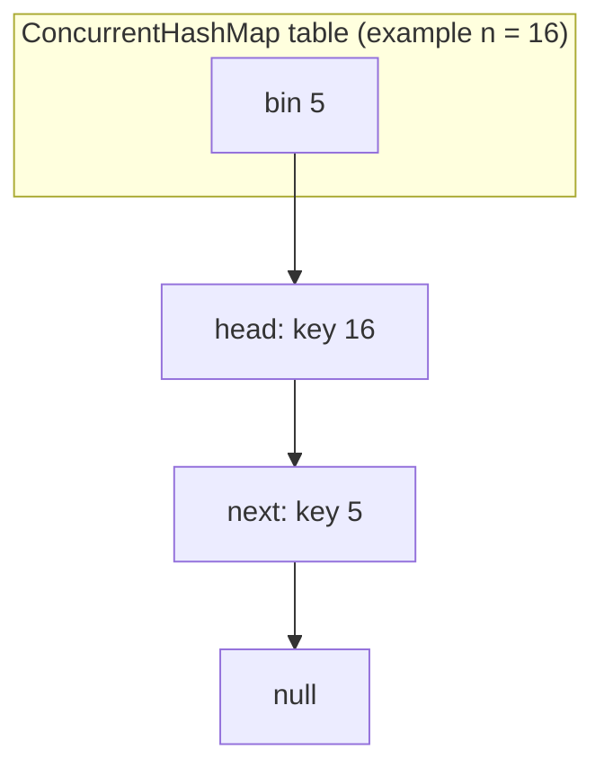

See **[Bucket-level lock vs whole-collection lock](#bucket-level-lock-vs-whole-collection-lock)** below for a side-by-side with `Hashtable` and `Collections.synchronizedMap`. Bucket layout details: [Hashtable bucket walkthrough](../collection/hashTable.md).

### Collision → list → tree

| Stage | Structure | Lookup cost in that bin |
| ----- | --------- | ------------------------ |
| Few keys in bin | Linked **`Node`** chain | O(chain length) |
| Chain length ≥ **8** and table size ≥ **64** | **`TreeBin`** (red-black) | O(log n) in that bin |

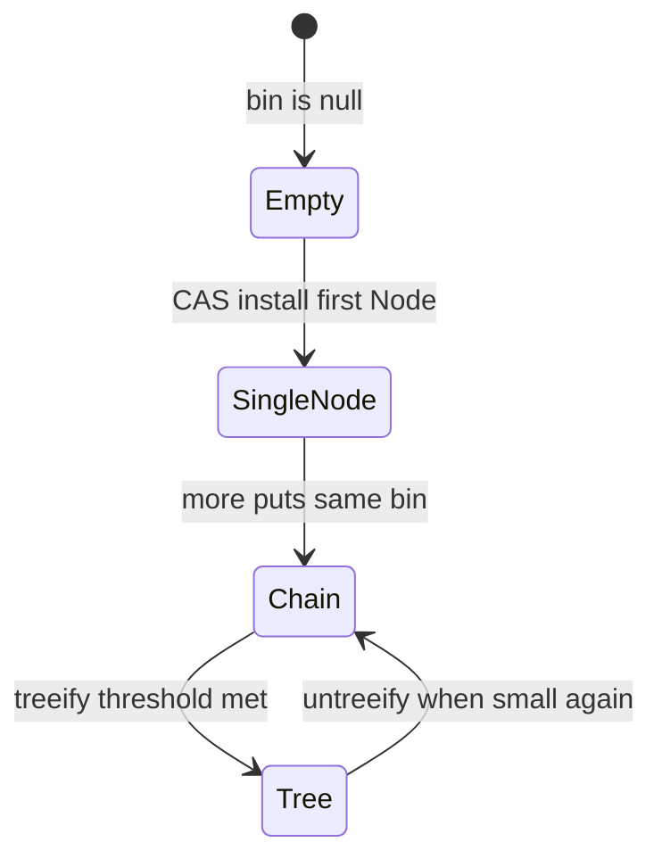

### `put` flow (simplified)

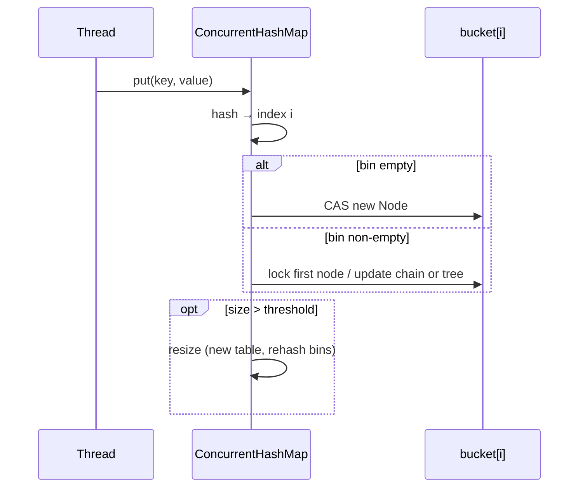

### Resize and load factor

| Constant (typical) | Meaning |
| ------------------ | ------- |
| Default **initial capacity** | **16** bins (power of two) |
| Default **load factor** | **0.75** — resize when `size > capacity × loadFactor` |
| **Treeify threshold** | **8** nodes in one bin (with minimum table size **64** for treeify) |

The demo’s constructor `new ConcurrentHashMap<>(128, 0.75f, 16)` sets **initial capacity**, **load factor**, and a **concurrency-level hint** (legacy parameter from older APIs; on JDK 8+ it still influences internal sizing expectations but the segment array is gone).

### Iteration vs `ArrayList` + CME

Iterators over `ConcurrentHashMap` are **weakly consistent**: they reflect the map at some point in time and **do not** throw `ConcurrentModificationException` when another thread updates the map. They may or may not see entries added during iteration.

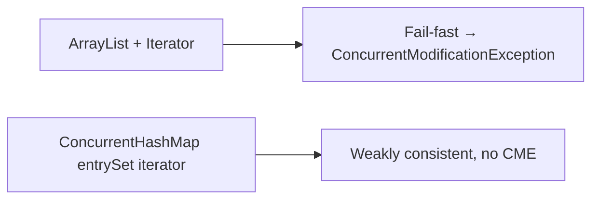

---

## Bucket-level lock vs whole-collection lock

The [classroom slide](#concurrenthashmap--classroom-overview) states the goal in one line: **do not lock the whole map for every update**—use **bucket-level** (portion-level) locks and allow **concurrent reads**, with default **concurrency level 16** for parallel writes.

Traditional thread-safe maps (`Hashtable`, `Collections.synchronizedMap(new HashMap<>())`) use **one monitor on the entire map object**. Almost every mutating method is `synchronized` on **`this`**, so **only one thread** can be inside those critical sections at a time—even when two threads touch **different keys** that live in **different buckets**.

`ConcurrentHashMap` matches the slide’s intent: **reads** avoid a global read lock; **writes** lock only the **relevant bin** (JDK 8+) or **segment** (JDK 7). Threads updating **different** bucket indexes can proceed **in parallel** (up to the practical limit implied by **concurrency level** and hash spread).

### Mental model (same 16-bin table)

```text
Traditional Hashtable / synchronizedMap
┌─────────────────────────────────────────────────────────────┐
│  ONE LOCK on the whole map object                           │
│  ┌───┬───┬───┬───┬───┬───┬───┬───┬───┬───┬───┬───┬───┬───┐ │
│  │ 0 │ 1 │ 2 │ 3 │ 4 │ 5 │ 6 │ 7 │ 8 │ 9 │10 │11 │12 │13 │…│ │
│  └───┴───┴───┴───┴───┴───┴───┴───┴───┴───┴───┴───┴───┴───┘ │
│  Thread A put → bin 2  and  Thread B put → bin 11         │
│  → B waits until A releases the ENTIRE map lock             │
└─────────────────────────────────────────────────────────────┘

ConcurrentHashMap (conceptual)
┌───┬───┬───┬───┬───┬───┬───┬───┬───┬───┬───┬───┬───┬───┬───┐
│ 0 │ 1 │ 2 │ 3 │ 4 │ 5 │ 6 │ 7 │ 8 │ 9 │10 │11 │12 │13 │14 │15│
└───┴─▲─┴───┴───┴─▲─┴───┴───┴───┴───┴─▲─┴───┴───┴───┴───┴───┘
      │           │                   │
   lock bin 2  lock bin 5         lock bin 11
   (only that   (only that         (only that
    chain)        chain)             chain)
  Thread A and Thread B on bins 2 and 11 → can run together
  Thread A and Thread C on same bin 5     → one waits on that bin
```

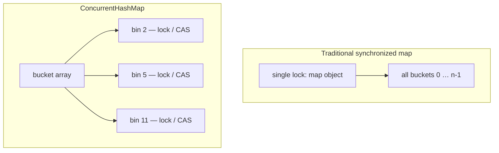

### Two threads, two different keys

Suppose **Thread A** does `put(keyA, …)` and **Thread B** does `put(keyB, …)`, and `keyA` and `keyB` hash to **different** indexes.

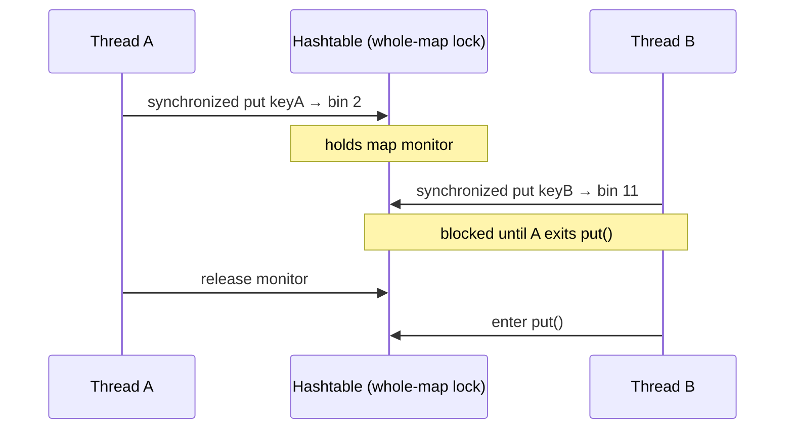

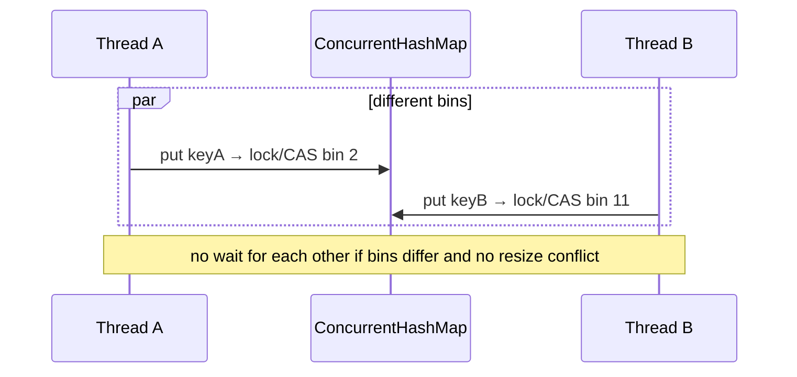

### Comparison table

| Aspect | Whole-collection lock (`Hashtable`, `synchronizedMap`, `Vector`, …) | Bucket-level / fine-grained (`ConcurrentHashMap`) |
| ------ | --------------------------------------------------------------------- | ------------------------------------------------- |
| **What is locked** | The **entire** collection instance (`synchronized (this)`) | Typically the **first node** of one **bin** (or CAS into an empty bin) |
| **Parallel puts on different keys** | **Serialized** — second thread waits on the map monitor | **Often parallel** if keys land in **different** bins |
| **Parallel puts on same bucket** | Still one-at-a-time (whole map) | Still one-at-a-time **for that bin** |
| **Read + write** | `Hashtable`: reads also synchronized; `synchronizedMap`: reads must use manual `synchronized(map)` during iteration per JDK docs | Reads often proceed without locking the whole table; writes touch only relevant bins |
| **Scalability** | Throughput **drops** as thread count grows (lock becomes a bottleneck) | Designed for **many threads** updating disjoint keys |
| **Iterator** | Fail-fast if unsynchronized read races with write (CME on non-concurrent structures) | Weakly consistent; no CME on iterator from concurrent updates |

### How much of the map is “hot” under contention?

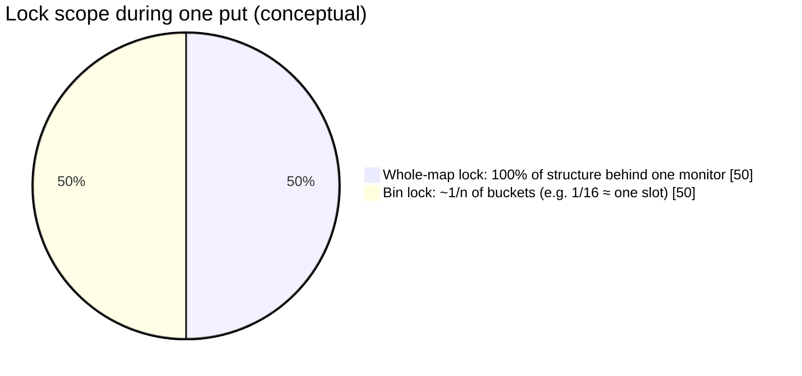

For a table of size **16**, a single `put` under **ConcurrentHashMap** usually contends on **one bin**, not all sixteen. Under **Hashtable**, that same `put` still acquires the lock that covers **every** bucket.

### `Collections.synchronizedMap` is still whole-map

Wrapping a `HashMap` does **not** add bucket striping:

```java
Map<K, V> m = Collections.synchronizedMap(new HashMap<>());
```

Every `put` / `remove` synchronizes on **`m`**. You also must manually synchronize on **`m`** while iterating, or risk `ConcurrentModificationException`. **`ConcurrentHashMap`** avoids that global iterator lock model for concurrent readers/writers.

### When bucket locking does not help

| Situation | Effect |
| --------- | ------ |
| **Many keys collide** into the same bin | Threads pile up on **one** bin lock (same as a hot global lock for those keys) |
| **Resize / rehash** | Must coordinate updating the **whole** table; threads may help transfer bins, but this is a global phase |
| **Bad hash distribution** | Few bins hold most entries → less parallelism |

### Takeaway

- **Traditional synchronized collections** = **one door** into the entire data structure; simple and correct, poor **multi-thread scalability**.
- **`ConcurrentHashMap`** = **many small doors** (per bucket); threads working on **different** buckets rarely block each other, which is why shared caches and concurrent registries prefer it over `Hashtable` or `synchronizedMap` in new code.

---

## Relation to this repo’s demos

| File | `main` calls | Backing type in `demonstrate*` |
| ---- | ------------ | ------------------------------ |
| `concurrentMap.java` | `"ConcurrentMap"` | `ConcurrentMap<String,String> map = new ConcurrentHashMap<>()` |
| `concurrentHashMap.java` | `"ConcurrentHashMap"` | `ConcurrentHashMap<String,String> map = new ConcurrentHashMap<>()` |

[`concurrentCollectionTypeInspector.java`](../../../demo/src/main/java/com/concurrentCollection/concurrentCollectionTypeInspector.java) prints load-factor notes for the selected label when the launcher reaches step 3.

---

## Run the demos

```bash
cd demo
javac -d /tmp/cmap \
  src/main/java/com/concurrentCollection/concurrentCollectionTypeInspector.java \
  src/main/java/com/concurrentCollection/concurrentMap/*.java

java -cp /tmp/cmap com.concurrentCollection.concurrentMap.concurrentMap
java -cp /tmp/cmap com.concurrentCollection.concurrentMap.concurrentHashMap
```

---

## See also

- [concurrentHashMap.md](concurrentHashMap.md) — **HashMap vs ConcurrentHashMap** (classroom comparison table + diagrams)
- Hub: [concurrentCollections.md](concurrentCollections.md) — `threadDemo` and `ConcurrentModificationException`
- Legacy synchronized buckets: [hashTable.md](../collection/hashTable.md)
