# CopyOnWriteArrayList

> Package: `java.util.concurrent` · Related: [fail-fast vs fail-safe iterators](concurrentCollections.md#fail-fast-vs-fail-safe-iterators-with-examples) · Hub: [concurrentCollections.md](concurrentCollections.md)

`CopyOnWriteArrayList` is a **thread-safe** `List` backed by an array. On **writes**, it **copies** the underlying array and swaps the reference so **readers** keep using the old snapshot without locking the whole list for every `get`.

---

## Guide map

| Section                                                  | Content                                        |
| -------------------------------------------------------- | ---------------------------------------------- |
| [Class hierarchy](#class-hierarchy)                      | `Collection` → `List` → `CopyOnWriteArrayList` |
| [Copy-on-write mechanism](#copy-on-write-mechanism)      | Clone on update; reads unaffected              |
| [Slide properties](#properties-from-classroom-notes)     | Ordering, nulls, interfaces, cost              |
| [Fail-safe iteration](#fail-safe-iteration-vs-arraylist) | No CME; iterator cannot remove                 |
| [ArrayList vs COW (slide)](#arraylist-vs-copyonwritearraylist-classroom-comparison) | Thread safety, iterator, remove, since 1.2 / 1.5 |
| [COW vs sync list vs Vector](#copyonwritearraylist-vs-synchronizedlist-vs-vector) | Three thread-safe list styles compared         |
| [Classroom execution (A,B,C + D)](#classroom-execution-add-after-iterator) | Slide program — full flow, output **A B C** |
| [`unsupportedOperationexception.java`](#unsupportedoperationexception-demo) | Why `iterator.remove()` throws               |
| [Multi-thread demo](#multi-thread-execution-copyonwritealdemo) | `copyOnWriteAlDemo` + timeline                 |
| [When to use](#when-to-use-copyonwritearraylist)         | Read-heavy / write-rare pie chart              |
| [Runnable example](#runnable-example)                    | Snapshot vs live list                          |

---

## Class hierarchy

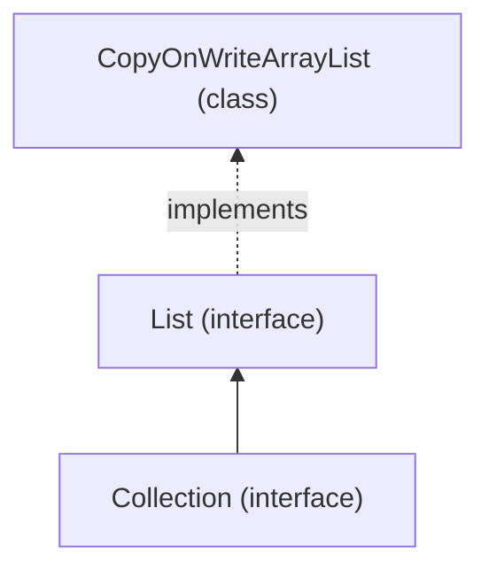
```mermaid
flowchart BT
  Coll["Collection (interface)"]
  List["List (interface)"]
  COW["CopyOnWriteArrayList (class)"]

  Coll --> List
  List -. implements .-> COW
```

<p align="center">
  
</p>

*Figure: classroom slide — thread-safe `ArrayList` style list; each update works on a **cloned** copy; JVM coordinates visibility of the new array reference.*

| Piece                      | Role                                                                      |
| -------------------------- | ------------------------------------------------------------------------- |
| **`List`**                 | Contract: ordered, indexed, allows duplicates                             |
| **`CopyOnWriteArrayList`** | **Thread-safe** implementation: **copy-on-write** for mutating operations |
| vs **`ArrayList`**         | **Not** thread-safe; fail-fast iterator; no copy on `add`                 |

---

## Copy-on-write mechanism

**Idea:** Readers traverse the **current array reference**. Writers **clone** the array, apply the change on the copy, then **publish** the new reference (safe publication so other threads see the new array).

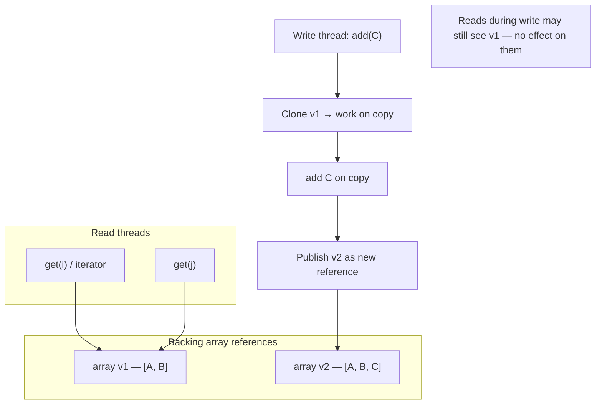
```mermaid
flowchart TD
  subgraph readers ["Read threads"]
    R1["get(i) / iterator"]
    R2["get(j)"]
  end

  subgraph memory ["Backing array references"]
    OLD["array v1 — [A, B]"]
    NEW["array v2 — [A, B, C]"]
  end

  W["Write thread: add(C)"] --> CLONE["Clone v1 → work on copy"]
  CLONE --> MUT["add C on copy"]
  MUT --> PUB["Publish v2 as new reference"]
  R1 --> OLD
  R2 --> OLD
  Note1["Reads during write may still see v1 — no effect on them"]
  PUB --> NEW
```

```text
Before add("C")          During write                    After publish
─────────────────        ─────────────                   ───────────────
 readers ──► [A,B]      writer clones [A,B]             readers ──► [A,B,C]
                          writes [A,B,C]
                          then swaps ref ───────────────►  (new readers see new array)
```

> **Slide point:** Because the update runs on a **cloned copy**, threads doing **read** operations are **not disturbed** by the in-progress write on the new copy until the reference is switched.

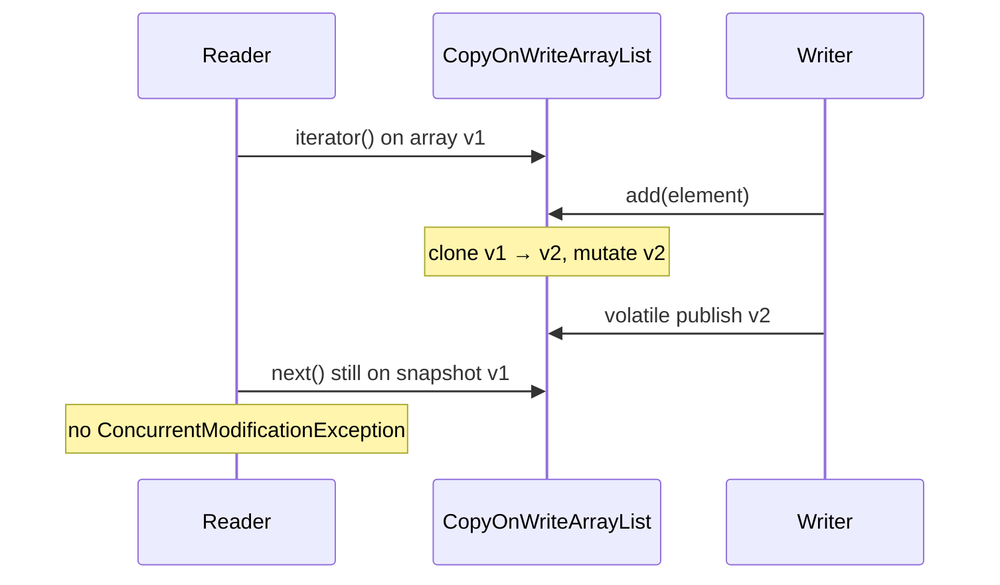
```mermaid
sequenceDiagram
  participant R as Reader
  participant COW as CopyOnWriteArrayList
  participant W as Writer

  R->>COW: iterator() on array v1
  W->>COW: add(element)
  Note over COW: clone v1 → v2, mutate v2
  W->>COW: volatile publish v2
  R->>COW: next() still on snapshot v1
  Note over R: no ConcurrentModificationException
```

### Read vs write cost

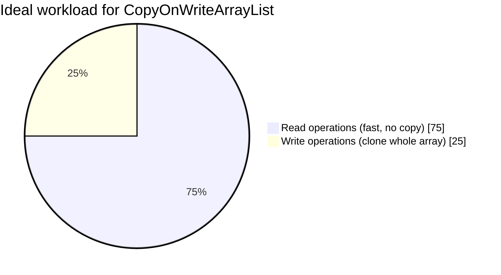
```mermaid
pie showData
    title Ideal workload for CopyOnWriteArrayList
    "Read operations (fast, no copy)" : 75
    "Write operations (clone whole array)" : 25
```

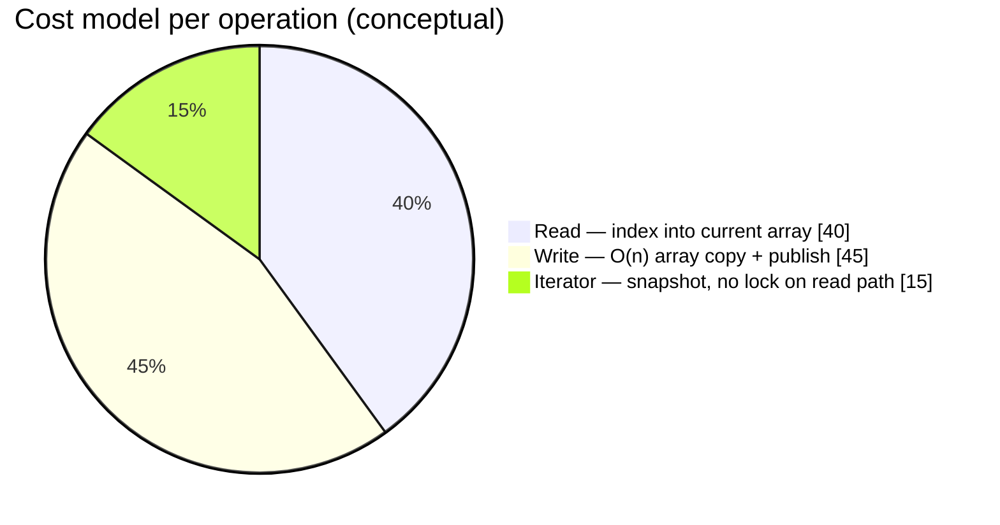
```mermaid
pie showData
    title Cost model per operation (conceptual)
    "Read — index into current array" : 40
    "Write — O(n) array copy + publish" : 45
    "Iterator — snapshot, no lock on read path" : 15
```

**Slide takeaway:** **Costly for frequent writes** (every update may copy the full backing array). **Best choice** when there are **many reads** and **few writes** (listener lists, snapshot configs, read-mostly caches).

---

## Properties (from classroom notes)

<p align="center">
  
</p>

| Property                   | Behavior                                                                                    |
| -------------------------- | ------------------------------------------------------------------------------------------- |
| **Update vs read**         | Update on **clone** → **no effect** on threads reading the **previous** array               |
| **Cost**                   | **High** for writes (copy per mutation) → use when **reads ≫ writes**                       |
| **Insertion order**        | **Preserved**                                                                               |
| **Duplicates**             | **Allowed**                                                                                 |
| **Heterogeneous elements** | **Allowed** (raw / `CopyOnWriteArrayList<Object>`)                                          |
| **`null`**                 | **Allowed**                                                                                 |
| **Extra interfaces**       | `Serializable`, `Cloneable`, `RandomAccess`                                                 |
| **Iterate + modify**       | Other threads may modify; **no** `ConcurrentModificationException` — **fail-safe** iterator |
| **Iterator `remove`**      | **Not supported** — `UnsupportedOperationException` (unlike `ArrayList`)                    |

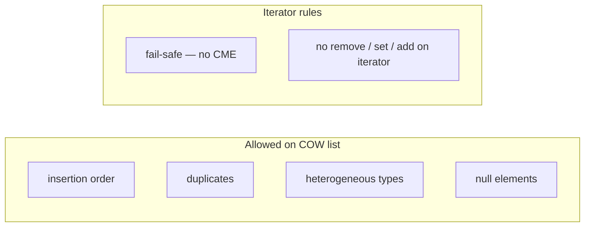
```mermaid
flowchart LR
  subgraph allowed ["Allowed on COW list"]
    O["insertion order"]
    D["duplicates"]
    H["heterogeneous types"]
    N["null elements"]
  end

  subgraph iterator ["Iterator rules"]
    FS["fail-safe — no CME"]
    NR["no remove / set / add on iterator"]
  end
```

---

## Fail-safe iteration vs `ArrayList`

|                                              | `ArrayList`                                       | `CopyOnWriteArrayList`                                                        |
| -------------------------------------------- | ------------------------------------------------- | ----------------------------------------------------------------------------- |
| Concurrent structural change while iterating | **`ConcurrentModificationException`** (fail-fast) | **Continues** (fail-safe / snapshot)                                          |
| `iterator.remove()`                          | **Supported**                                     | **`UnsupportedOperationException`**                                           |
| What iterator sees                           | Live list until CME                               | **Snapshot** at iterator creation (won’t see later adds on **that** iterator) |

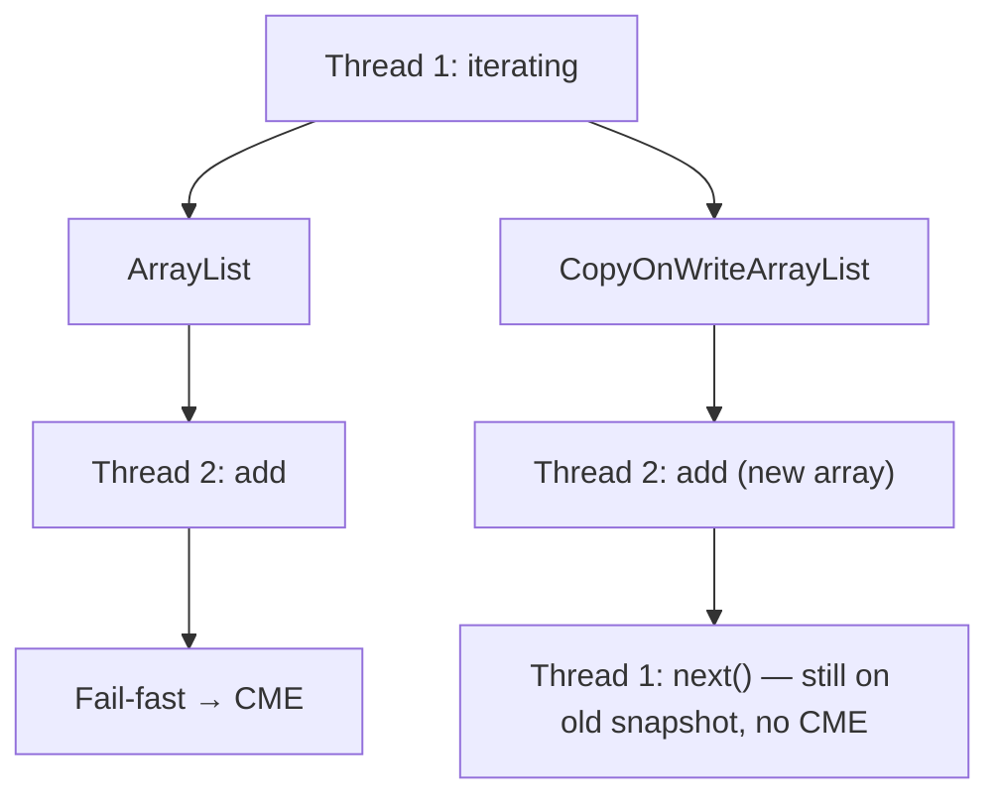
```mermaid
flowchart TD
  Start["Thread 1: iterating"]

  Start --> AL["ArrayList"]
  AL --> Mod["Thread 2: add"]
  Mod --> CME["Fail-fast → CME"]

  Start --> COW["CopyOnWriteArrayList"]
  COW --> Mod2["Thread 2: add (new array)"]
  Mod2 --> OK["Thread 1: next() — still on old snapshot, no CME"]
```

Deep dive with more examples: [Fail-fast vs fail-safe iterators](concurrentCollections.md#fail-fast-vs-fail-safe-iterators-with-examples) (Example 5 uses `CopyOnWriteArrayList`).

---

## ArrayList vs CopyOnWriteArrayList (classroom comparison)

<p align="center">
  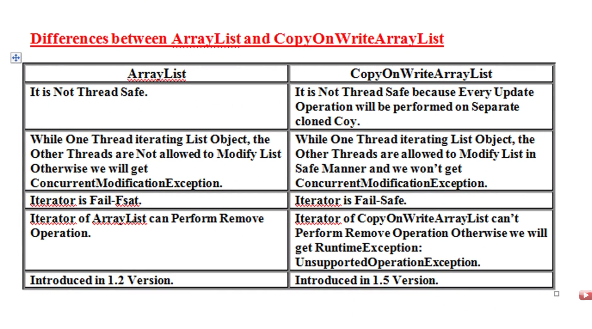
</p>

*Figure: classroom slide (clarified below — `CopyOnWriteArrayList` **is** thread-safe via copy-on-write, not “unsafe”).*

| Topic | `ArrayList` | `CopyOnWriteArrayList` |
| ----- | ----------- | ---------------------- |
| **Thread safety** | **Not** thread-safe for shared mutation | **Thread-safe** — each **update** clones the backing array; readers use current or snapshot refs |
| **Slide wording** | — | Slide says “not thread safe” while describing **cloned copy** updates → means **no single global lock**; the class **is** designed for concurrent access |
| **Modify while iterating** | Other threads (or same thread) must not structurally modify → **`ConcurrentModificationException`** | Other threads **may** modify; **no CME** — iterator uses **snapshot** |
| **Iterator type** | **Fail-fast** | **Fail-safe** (snapshot / weak view) |
| **`iterator.remove()`** | **Supported** (with fail-fast rules) | **`UnsupportedOperationException`** — use `list.remove(...)` |
| **Since** | Java **1.2** | Java **1.5** (`java.util.concurrent`) |

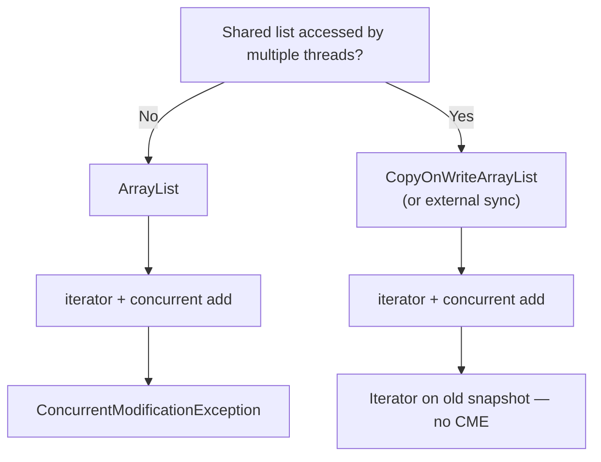
```mermaid
flowchart TD
  Q["Shared list accessed by multiple threads?"]
  Q -- No --> AL["ArrayList"]
  Q -- Yes --> COW["CopyOnWriteArrayList<br/>(or external sync)"]

  AL --> ALI["iterator + concurrent add"]
  ALI --> CME["ConcurrentModificationException"]

  COW --> COWI["iterator + concurrent add"]
  COWI --> SNAP["Iterator on old snapshot — no CME"]
```

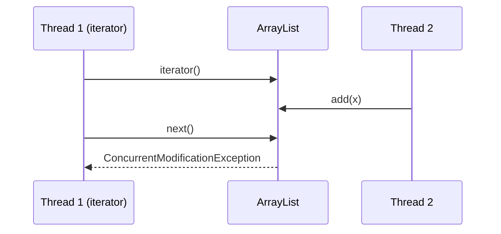
```mermaid
sequenceDiagram
  participant T1 as Thread 1 (iterator)
  participant AL as ArrayList
  participant T2 as Thread 2

  T1->>AL: iterator()
  T2->>AL: add(x)
  T1->>AL: next()
  AL-->>T1: ConcurrentModificationException
```

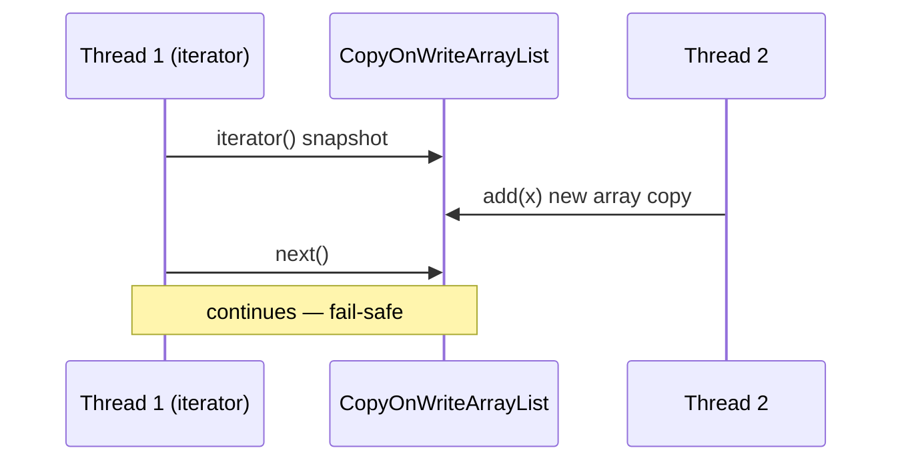
```mermaid
sequenceDiagram
  participant T1 as Thread 1 (iterator)
  participant COW as CopyOnWriteArrayList
  participant T2 as Thread 2

  T1->>COW: iterator() snapshot
  T2->>COW: add(x) new array copy
  T1->>COW: next()
  Note over T1,COW: continues — fail-safe
```

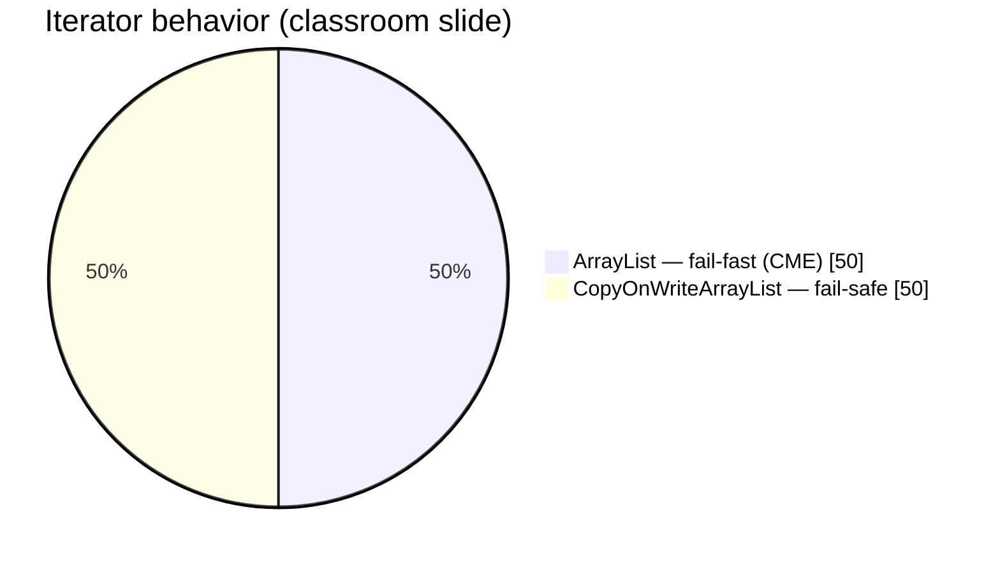
```mermaid
pie showData
    title Iterator behavior (classroom slide)
    "ArrayList — fail-fast (CME)" : 50
    "CopyOnWriteArrayList — fail-safe" : 50
```

---

## CopyOnWriteArrayList vs `synchronizedList()` vs `Vector`

Three ways to share a **thread-safe** `List`. Only **`CopyOnWriteArrayList`** uses **copy-on-write**; **`Collections.synchronizedList`** and **`Vector`** lock the **whole** list.

<p align="center">
  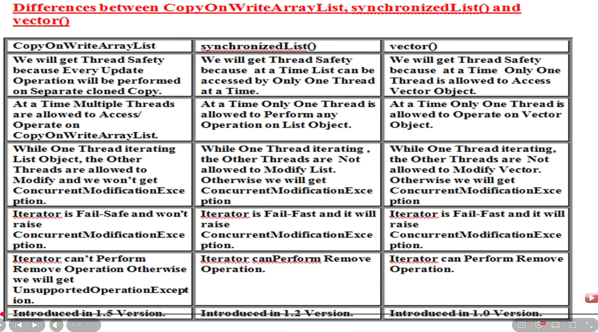
</p>

| Topic | `CopyOnWriteArrayList` | `Collections.synchronizedList(list)` | `Vector` |
| ----- | ---------------------- | ------------------------------------ | -------- |
| **How thread safety is achieved** | **Clone** backing array on each update; publish new ref | **One monitor** on wrapper — one thread in synced API at a time | **Synchronized** methods on **whole** `Vector` |
| **Concurrency** | **Many** threads can read; writes copy array; iterators on snapshots | **One** thread at a time for operations | **One** thread at a time |
| **Iterate + other thread modifies** | **Allowed** — **no** `ConcurrentModificationException` | **CME** if another thread modifies without syncing on same monitor | **CME** (fail-fast) |
| **Iterator** | **Fail-safe** | **Fail-fast** | **Fail-fast** |
| **`iterator.remove()`** | **`UnsupportedOperationException`** | **Supported** (sync rules apply) | **Supported** |
| **Since** | Java **1.5** | Java **1.2** | Java **1.0** (legacy) |

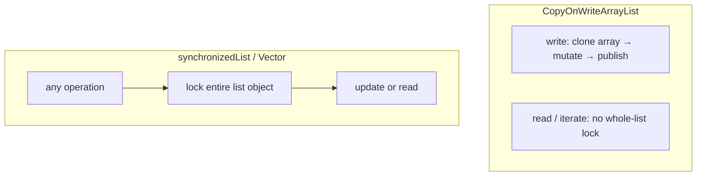
```mermaid
flowchart TB
  subgraph cow ["CopyOnWriteArrayList"]
    W1["write: clone array → mutate → publish"]
    R1["read / iterate: no whole-list lock"]
  end

  subgraph sync ["synchronizedList / Vector"]
    W2["any operation"]
    W2 --> L["lock entire list object"]
    L --> U2["update or read"]
  end
```

### Write path (flow)

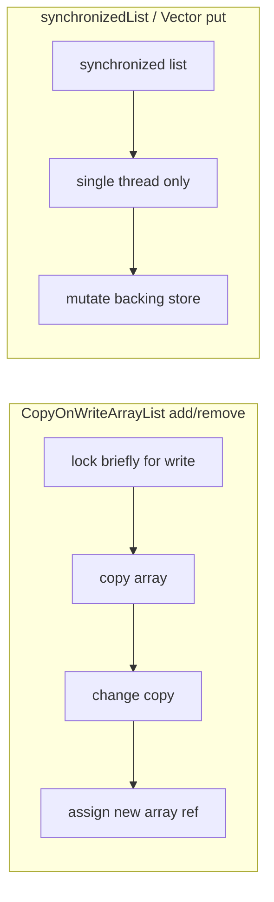
```mermaid
flowchart LR
  subgraph COWwrite ["CopyOnWriteArrayList add/remove"]
    A1["lock briefly for write"] --> A2["copy array"]
    A2 --> A3["change copy"]
    A3 --> A4["assign new array ref"]
  end

  subgraph Syncwrite ["synchronizedList / Vector put"]
    B1["synchronized list"] --> B2["single thread only"]
    B2 --> B3["mutate backing store"]
  end
```

### Iteration + concurrent modification

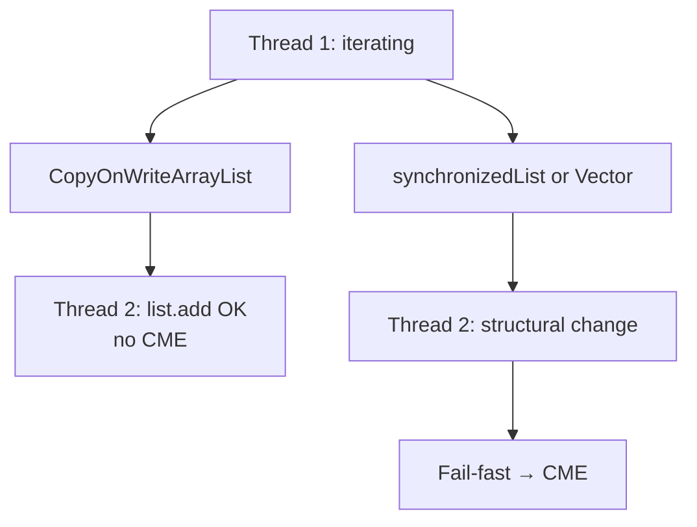
```mermaid
flowchart TD
  Iter["Thread 1: iterating"]

  Iter --> COWp["CopyOnWriteArrayList"]
  COWp --> OK["Thread 2: list.add OK<br/>no CME"]

  Iter --> Syncp["synchronizedList or Vector"]
  Syncp --> Bad["Thread 2: structural change"]
  Bad --> CME["Fail-fast → CME"]
```

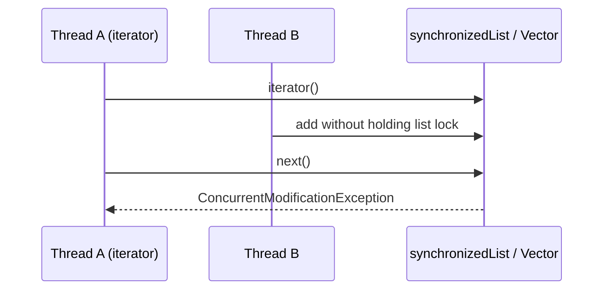
```mermaid
sequenceDiagram
  participant A as Thread A (iterator)
  participant B as Thread B
  participant L as synchronizedList / Vector

  A->>L: iterator()
  B->>L: add without holding list lock
  A->>L: next()
  L-->>A: ConcurrentModificationException
```

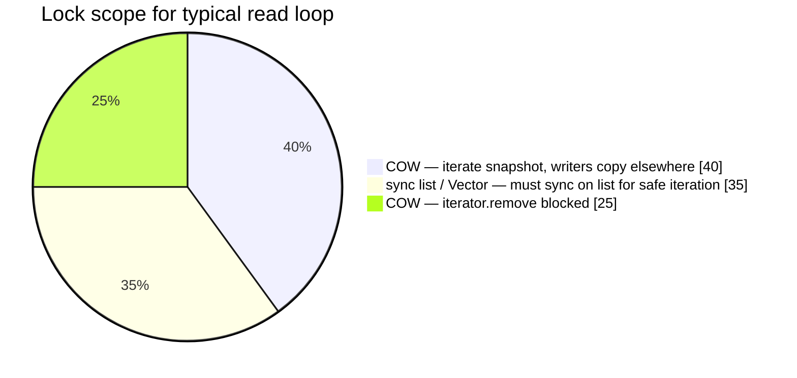
```mermaid
pie showData
    title Lock scope for typical read loop
    "COW — iterate snapshot, writers copy elsewhere" : 40
    "sync list / Vector — must sync on list for safe iteration" : 35
    "COW — iterator.remove blocked" : 25
```

### Iterator `remove`

| Call | `CopyOnWriteArrayList` | `synchronizedList` / `Vector` |
| ---- | ---------------------- | ------------------------------ |
| `iterator.remove()` | **`UnsupportedOperationException`** | Works if iteration is properly synchronized |
| Preferred remove | `list.remove(element)` | `iterator.remove()` or `list.remove` inside `synchronized (list)` |

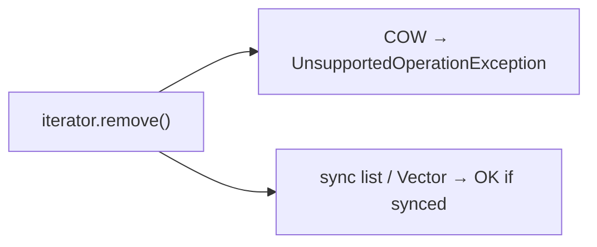
```mermaid
flowchart LR
  IR["iterator.remove()"] --> COW["COW → UnsupportedOperationException"]
  IR --> SV["sync list / Vector → OK if synced"]
```

### Which list to choose?

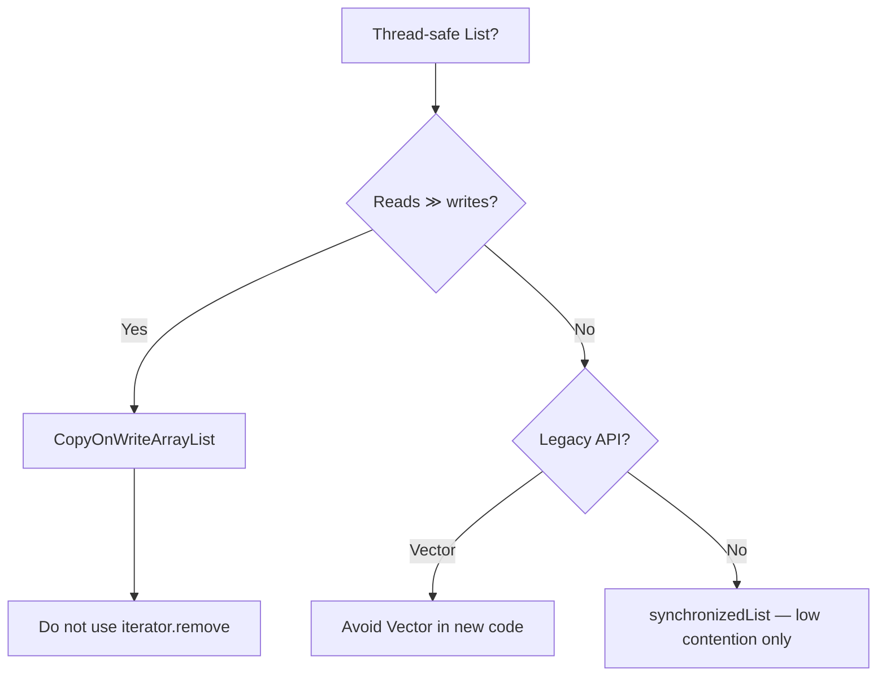
```mermaid
flowchart TD
  Need["Thread-safe List?"] --> Read{"Reads ≫ writes?"}
  Read -- Yes --> COW2["CopyOnWriteArrayList"]
  Read -- No --> Legacy{"Legacy API?"}
  Legacy -- Vector --> V["Avoid Vector in new code"]
  Legacy -- No --> SL["synchronizedList — low contention only"]
  COW2 --> NoItrRemove["Do not use iterator.remove"]
```

| Choose | When |
| ------ | ---- |
| **`CopyOnWriteArrayList`** | Many concurrent **reads** / iterations, rare **writes**, tolerate snapshot iterators |
| **`Collections.synchronizedList`** | Wrap existing `ArrayList`; low thread contention; manual sync during iteration |
| **`Vector`** | **Legacy only** — prefer COW or sync wrapper patterns in new code |

---

## Classroom execution: add after `iterator()`

Classic slide program: build list **A, B, C**, create **`iterator`**, then **`l.add("D")`**, then loop. Output is **A**, **B**, **C** only — **not D**.

<p align="center">
  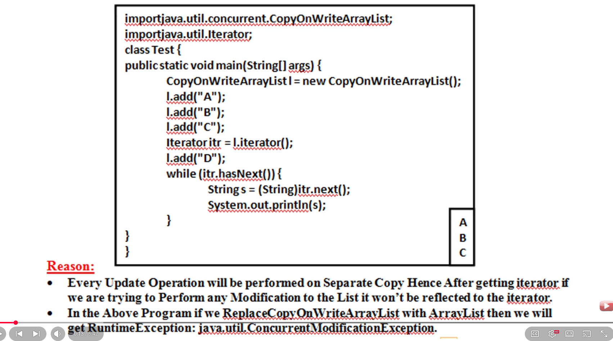
</p>

### Source (slide)

```java
import java.util.concurrent.CopyOnWriteArrayList;
import java.util.Iterator;

class Test {
    public static void main(String[] args) {
        CopyOnWriteArrayList<String> l = new CopyOnWriteArrayList<>();
        l.add("A");
        l.add("B");
        l.add("C");

        Iterator<String> itr = l.iterator();
        l.add("D"); // modification after iterator created

        while (itr.hasNext()) {
            String s = itr.next();
            System.out.println(s);
        }
    }
}
```

### Verified output

```text
A
B
C
```

### Execution summary (step by step)

| Step | What runs | Backing array / iterator |
| ---- | --------- | ------------------------- |
| 1 | `add("A")`, `add("B")`, `add("C")` | Live list → `[A, B, C]` |
| 2 | `itr = l.iterator()` | **`COWIterator` holds snapshot reference** to array `[A, B, C]` |
| 3 | `l.add("D")` | **Copy-on-write:** new array `[A, B, C, D]`; list ref updated; **iterator still points at old array** |
| 4 | `while (itr.hasNext())` / `next()` | Walks **snapshot** only → prints **A, B, C** |
| 5 | (after loop) | Live list is `[A, B, C, D]`; iterator never saw **D** |

### Reason (from slide)

1. Every **update** works on a **separate copy** of the array. After the iterator is created, later **`add`** changes the **live** list but **does not change the iterator’s snapshot**.
2. If you use **`ArrayList`** instead and call `add("D")` after `iterator()`, the next `next()` typically throws **`ConcurrentModificationException`** (fail-fast).

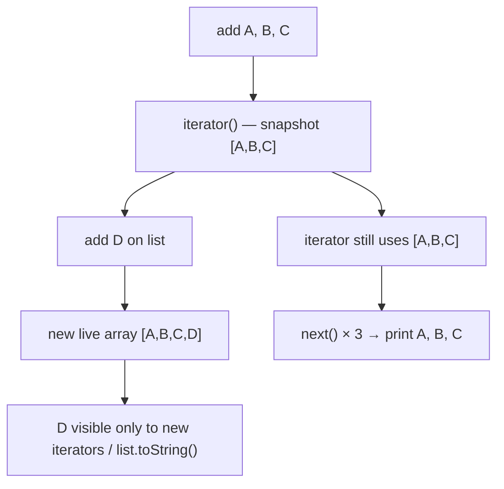
```mermaid
flowchart TD
  S1["add A, B, C"] --> S2["iterator() — snapshot [A,B,C]"]
  S2 --> S3["add D on list"]
  S3 --> S4["new live array [A,B,C,D]"]
  S2 --> S5["iterator still uses [A,B,C]"]
  S5 --> S6["next() × 3 → print A, B, C"]
  S4 --> S7["D visible only to new iterators / list.toString()"]
```

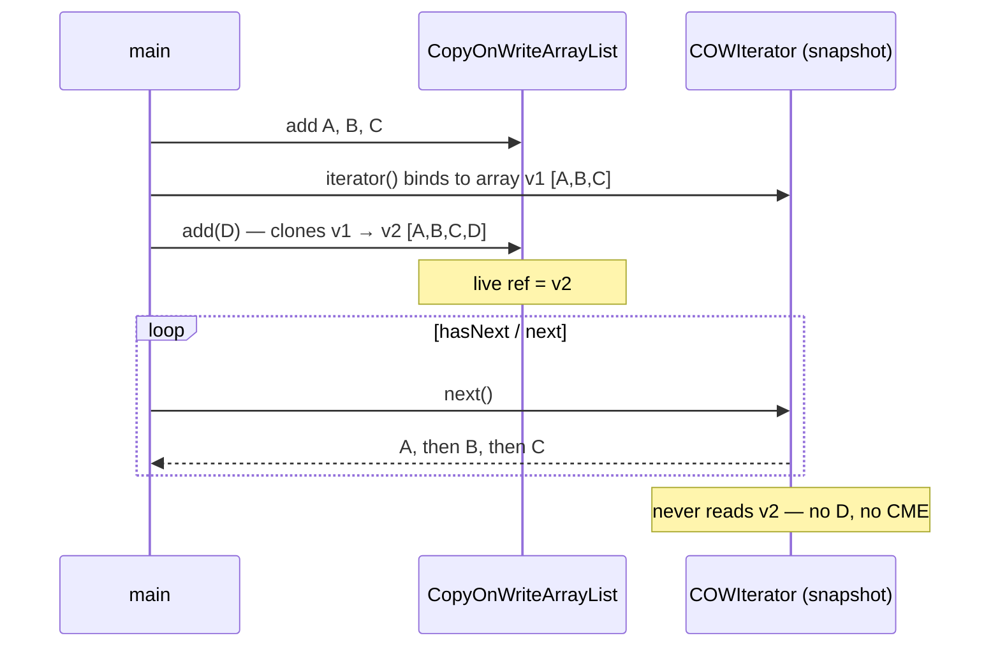
```mermaid
sequenceDiagram
  participant Main as main
  participant COW as CopyOnWriteArrayList
  participant It as COWIterator (snapshot)

  Main->>COW: add A, B, C
  Main->>It: iterator() binds to array v1 [A,B,C]
  Main->>COW: add(D) — clones v1 → v2 [A,B,C,D]
  Note over COW: live ref = v2
  loop hasNext / next
    Main->>It: next()
    It-->>Main: A, then B, then C
  end
  Note over It: never reads v2 — no D, no CME
```

```mermaid
flowchart LR
  subgraph cow ["CopyOnWriteArrayList"]
    A1["iterator created"] --> A2["add D"]
    A2 --> A3["print A B C — OK"]
  end

  subgraph al ["ArrayList (contrast)"]
    B1["iterator created"] --> B2["add D"]
    B2 --> B3["next() → ConcurrentModificationException"]
  end
```

```mermaid
pie showData
    title Elements seen by iterator after add(D)
    "Snapshot A, B, C" : 75
    "Live-only D (not on this iterator)" : 25
```

---

## `UnsupportedOperationException` demo

Runnable class: [`unsupportedOperationexception.java`](../../../demo/src/main/java/com/concurrentCollection/copyOnWriteArrayListClass/unsupportedOperationexception.java)

The list is **modifiable** via `coal.add(...)`, but **`Iterator.remove()`** is **not** supported on `CopyOnWriteArrayList` (snapshot iterator).

```mermaid
flowchart TD
  A["iterator() on COW list"] --> B["next() until element equals yashoda"]
  B --> C["iterator.remove()"]
  C --> D["CopyOnWriteArrayList$COWIterator.remove()"]
  D --> E["throw UnsupportedOperationException"]
```

| | `ArrayList` iterator | `CopyOnWriteArrayList` iterator |
| --- | ---------------------- | ------------------------------- |
| `remove()` | Updates backing list (with fail-fast rules) | **Always unsupported** — would break snapshot semantics |
| Fix | Use `list.remove(...)` or iterator.remove on `ArrayList` | Remove via **`list.remove(element)`**, not `iterator.remove()` |

Full walkthrough: [unsupportedOperationException.md](unsupportedOperationException.md).

---

## Multi-thread execution: `copyOnWriteAlDemo`

Demo: [`copyOnWriteAlDemo.java`](../../../demo/src/main/java/com/concurrentCollection/copyOnWriteArrayListClass/updationByoneThreadwhileOtherThreadExceution/copyOnWriteAlDemo.java) · child thread: [`childThreadBase.java`](../../../demo/src/main/java/com/concurrentCollection/copyOnWriteArrayListClass/updationByoneThreadwhileOtherThreadExceution/childThreadBase.java)

| Phase | Main thread | Child thread | `coal` (live) | Iterator snapshot |
| ----- | ----------- | ------------ | ------------- | ----------------- |
| Start | `add` panduraju, Maadhri | — | `[panduraju, Maadhri]` | — |
| T0 | `start()` child | sleeps 3000 ms | unchanged | — |
| T0 | `iterator()` | sleeping | unchanged | **`[panduraju, Maadhri]`** |
| T0–2s | loop + sleep 1s × 2 | sleeping | unchanged | prints both names |
| ~3s | may finish loop | `add("Kunti")` | **`[..., Kunti]`** | still old snapshot |
| End | prints `coal` | done | shows **Kunti** if child finished | loop never saw **Kunti** |

Without **`childThread.join()`**, main can print the final list **before** the child adds **Kunti** (race). Use **`join()`** when you need the final print to include the child’s update.

```mermaid
sequenceDiagram
  participant Main
  participant Child as childThreadBase
  participant coal as CopyOnWriteArrayList

  Main->>coal: add panduraju, Maadhri
  Main->>Child: start()
  Main->>coal: iterator() snapshot
  par main loop ~2s
    Main->>Main: print each element
  and child ~3s
    Child->>Child: sleep 3000
    Child->>coal: add Kunti (new array)
  end
  Main->>Main: println final coal (may need join() first)
```

---

## When to use `CopyOnWriteArrayList`

```mermaid
flowchart TD
  Q["Need a shared List?"]
  Q --> W{"Writes frequent?"}
  W -- Yes --> Other["Consider synchronized list,<br/>ConcurrentLinkedQueue, or lock"]
  W -- No --> R{"Reads dominate?"}
  R -- Yes --> COW["CopyOnWriteArrayList"]
  R -- No --> HM["Re-evaluate: CHM / sync / single-thread"]

  COW --> Ex["Examples: event listeners,<br/>read-mostly config snapshots"]
```

| Use COW                                            | Avoid COW                                           |
| -------------------------------------------------- | --------------------------------------------------- |
| Many **get** / iterate, rare **add** / **remove**  | Large list + **heavy** add/remove traffic           |
| Tolerance for **stale** iterator view              | Need iterator to see **every** live add immediately |
| Need **fail-safe** iteration without external sync | Need **`iterator.remove()`** during traversal       |

```mermaid
pie showData
    title Typical fit score
    "Great — read-heavy listener list" : 50
    "OK — occasional config refresh" : 30
    "Poor — high churn write workload" : 20
```

---

## Runnable example

Shows **snapshot** behavior: iterator does not see `"Cherry"` added by another thread during the loop, but the **live** list does.

```java
import java.util.ListIterator;
import java.util.concurrent.CopyOnWriteArrayList;

public class CopyOnWriteDemo {
    public static void main(String[] args) throws InterruptedException {
        CopyOnWriteArrayList<String> list = new CopyOnWriteArrayList<>();
        list.add("Apple");
        list.add("Banana");

        Thread t = new Thread(() -> {
            try { Thread.sleep(100); } catch (InterruptedException ignored) {}
            list.add("Cherry");
        });
        t.start();

        ListIterator<String> it = list.listIterator();
        while (it.hasNext()) {
            System.out.println("Iterator: " + it.next());
            Thread.sleep(200);
        }
        t.join();
        System.out.println("Live list: " + list); // [Apple, Banana, Cherry]
    }
}
```

```bash
cd /tmp && javac CopyOnWriteDemo.java && java CopyOnWriteDemo
```

**Expected pattern:** iterator prints **Apple**, **Banana** only; final line includes **Cherry**.

```mermaid
pie showData
    title What the iterator saw vs live list
    "Snapshot at iterator create (Apple, Banana)" : 67
    "Added after snapshot (Cherry) — live list only" : 33
```

### Iterator `remove` — not allowed

```java
CopyOnWriteArrayList<String> list = new CopyOnWriteArrayList<>();
list.add("x");
var it = list.iterator();
it.next();
it.remove(); // UnsupportedOperationException
```

---

## Compare with related types (quick reference)

| Type                             | Iterator                          | Write cost      | Best for                     |
| -------------------------------- | --------------------------------- | --------------- | ---------------------------- |
| **`ArrayList`**                  | Fail-fast                         | Low             | Single-threaded              |
| **`Vector` / synchronized list** | Fail-fast                         | Whole-list lock | Legacy                       |
| **`CopyOnWriteArrayList`**       | Fail-safe snapshot                | Copy array      | **Read-mostly** shared lists |
| **`ConcurrentHashMap`**          | Weakly consistent (map, not list) | Bin-level       | Shared maps                  |

See detailed slide tables: [ArrayList vs COW](#arraylist-vs-copyonwritearraylist-classroom-comparison), [COW vs sync vs Vector](#copyonwritearraylist-vs-synchronizedlist-vs-vector).

---

## See also

- [copyOnWriteArraySet.md](copyOnWriteArraySet.md) — same copy-on-write model for **Set**
- [unsupportedOperationException.md](unsupportedOperationException.md) — `iterator.remove()` internal flow
- [concurrentCollections.md](concurrentCollections.md) — hub, `threadDemo`, iterator examples
- [concurrentHashMap.md](concurrentHashMap.md) — concurrent maps and fail-safe map iteration

