# CopyOnWriteArrayList

> Package: `java.util.concurrent` · Related: [fail-fast vs fail-safe iterators](concurrentCollections.md#fail-fast-vs-fail-safe-iterators-with-examples) · Hub: [concurrentCollections.md](concurrentCollections.md)

`CopyOnWriteArrayList` is a **thread-safe** `List` backed by an array. On **writes**, it **copies** the underlying array and swaps the reference so **readers** keep using the old snapshot without locking the whole list for every `get`.

---

## Guide map

| Section                                                  | Content                                        |
| -------------------------------------------------------- | ---------------------------------------------- |
| [Class hierarchy](#class-hierarchy)                      | `Collection` → `List` → `CopyOnWriteArrayList` |
| [Copy-on-write mechanism](#copy-on-write-mechanism)      | Clone on update; reads unaffected              |
| [Slide properties](#properties-from-classroom-notes)     | Ordering, nulls, interfaces, cost              |
| [Fail-safe iteration](#fail-safe-iteration-vs-arraylist) | No CME; iterator cannot remove                 |
| [When to use](#when-to-use-copyonwritearraylist)         | Read-heavy / write-rare pie chart              |
| [Runnable example](#runnable-example)                    | Snapshot vs live list                          |

---

## Class hierarchy

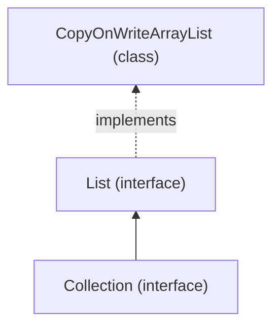

<p align="center">
  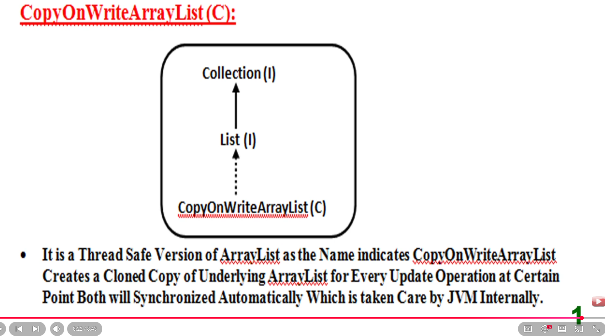
</p>

*Figure: classroom slide — thread-safe `ArrayList` style list; each update works on a **cloned** copy; JVM coordinates visibility of the new array reference.*

| Piece                      | Role                                                                      |
| -------------------------- | ------------------------------------------------------------------------- |
| **`List`**                 | Contract: ordered, indexed, allows duplicates                             |
| **`CopyOnWriteArrayList`** | **Thread-safe** implementation: **copy-on-write** for mutating operations |
| vs **`ArrayList`**         | **Not** thread-safe; fail-fast iterator; no copy on `add`                 |

---

## Copy-on-write mechanism

**Idea:** Readers traverse the **current array reference**. Writers **clone** the array, apply the change on the copy, then **publish** the new reference (safe publication so other threads see the new array).

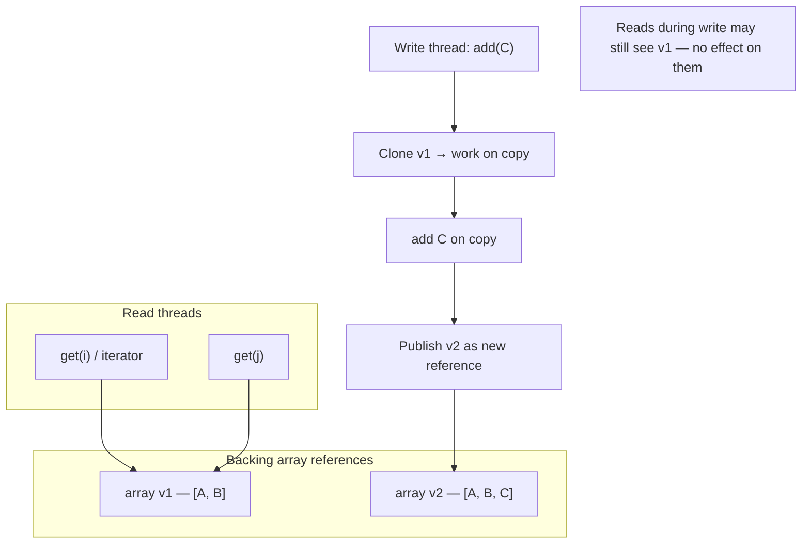

```text
Before add("C")          During write                    After publish
─────────────────        ─────────────                   ───────────────
 readers ──► [A,B]      writer clones [A,B]             readers ──► [A,B,C]
                          writes [A,B,C]
                          then swaps ref ───────────────►  (new readers see new array)
```

> **Slide point:** Because the update runs on a **cloned copy**, threads doing **read** operations are **not disturbed** by the in-progress write on the new copy until the reference is switched.

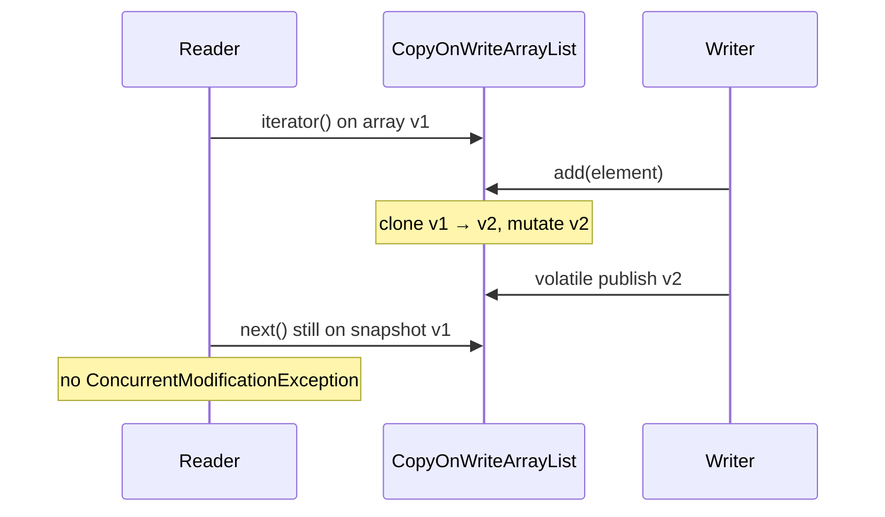

### Read vs write cost

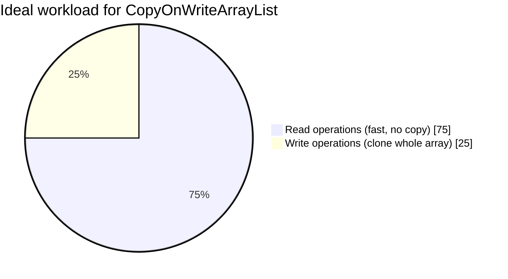

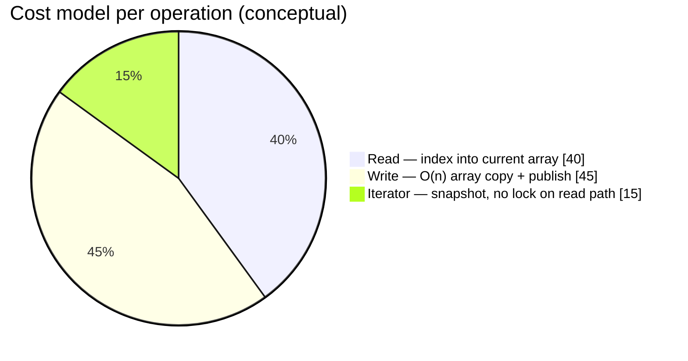

**Slide takeaway:** **Costly for frequent writes** (every update may copy the full backing array). **Best choice** when there are **many reads** and **few writes** (listener lists, snapshot configs, read-mostly caches).

---

## Properties (from classroom notes)

<p align="center">
  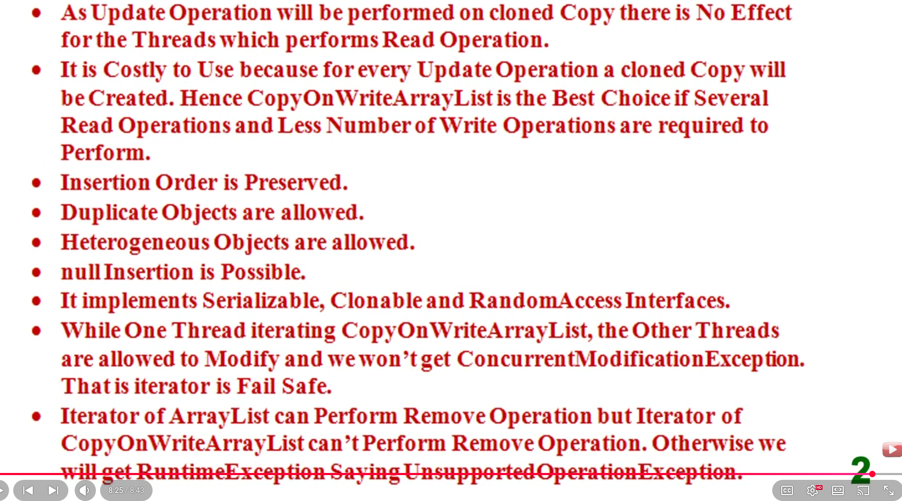
</p>

| Property                   | Behavior                                                                                    |
| -------------------------- | ------------------------------------------------------------------------------------------- |
| **Update vs read**         | Update on **clone** → **no effect** on threads reading the **previous** array               |
| **Cost**                   | **High** for writes (copy per mutation) → use when **reads ≫ writes**                       |
| **Insertion order**        | **Preserved**                                                                               |
| **Duplicates**             | **Allowed**                                                                                 |
| **Heterogeneous elements** | **Allowed** (raw / `CopyOnWriteArrayList<Object>`)                                          |
| **`null`**                 | **Allowed**                                                                                 |
| **Extra interfaces**       | `Serializable`, `Cloneable`, `RandomAccess`                                                 |
| **Iterate + modify**       | Other threads may modify; **no** `ConcurrentModificationException` — **fail-safe** iterator |
| **Iterator `remove`**      | **Not supported** — `UnsupportedOperationException` (unlike `ArrayList`)                    |

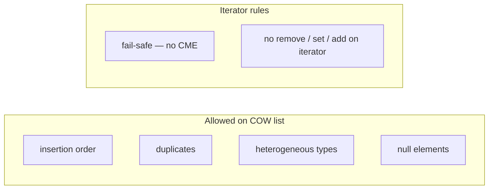

---

## Fail-safe iteration vs `ArrayList`

|                                              | `ArrayList`                                       | `CopyOnWriteArrayList`                                                        |
| -------------------------------------------- | ------------------------------------------------- | ----------------------------------------------------------------------------- |
| Concurrent structural change while iterating | **`ConcurrentModificationException`** (fail-fast) | **Continues** (fail-safe / snapshot)                                          |
| `iterator.remove()`                          | **Supported**                                     | **`UnsupportedOperationException`**                                           |
| What iterator sees                           | Live list until CME                               | **Snapshot** at iterator creation (won’t see later adds on **that** iterator) |

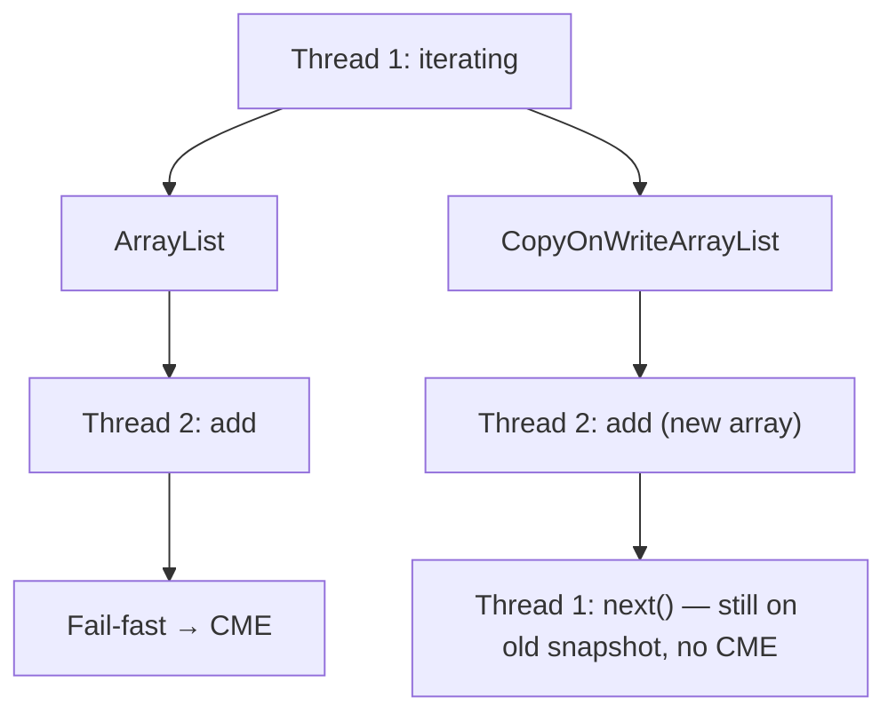

Deep dive with more examples: [Fail-fast vs fail-safe iterators](concurrentCollections.md#fail-fast-vs-fail-safe-iterators-with-examples) (Example 5 uses `CopyOnWriteArrayList`).

---

## When to use `CopyOnWriteArrayList`

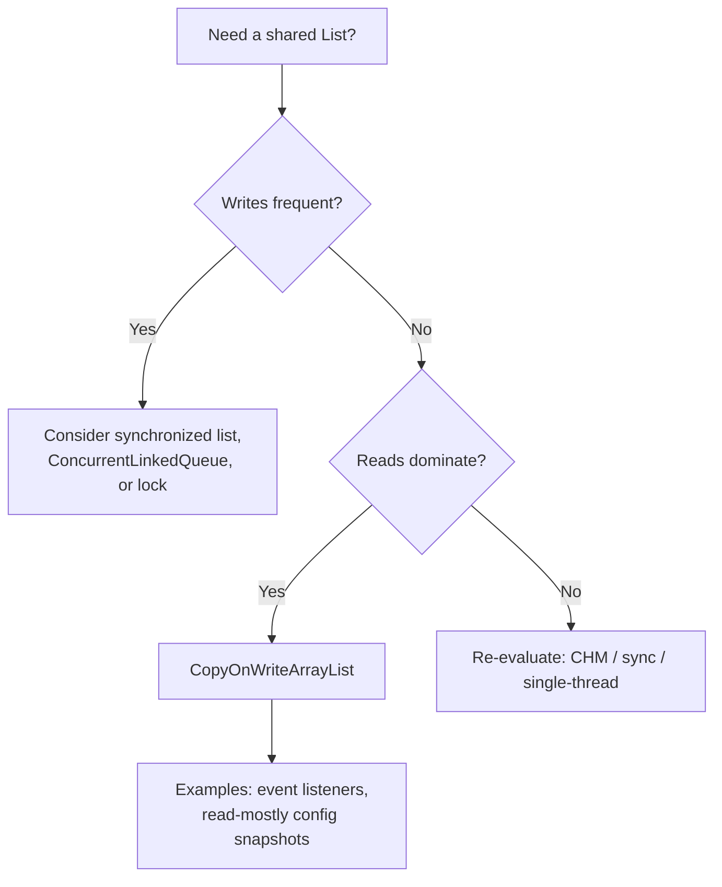

| Use COW                                            | Avoid COW                                           |
| -------------------------------------------------- | --------------------------------------------------- |
| Many **get** / iterate, rare **add** / **remove**  | Large list + **heavy** add/remove traffic           |
| Tolerance for **stale** iterator view              | Need iterator to see **every** live add immediately |
| Need **fail-safe** iteration without external sync | Need **`iterator.remove()`** during traversal       |

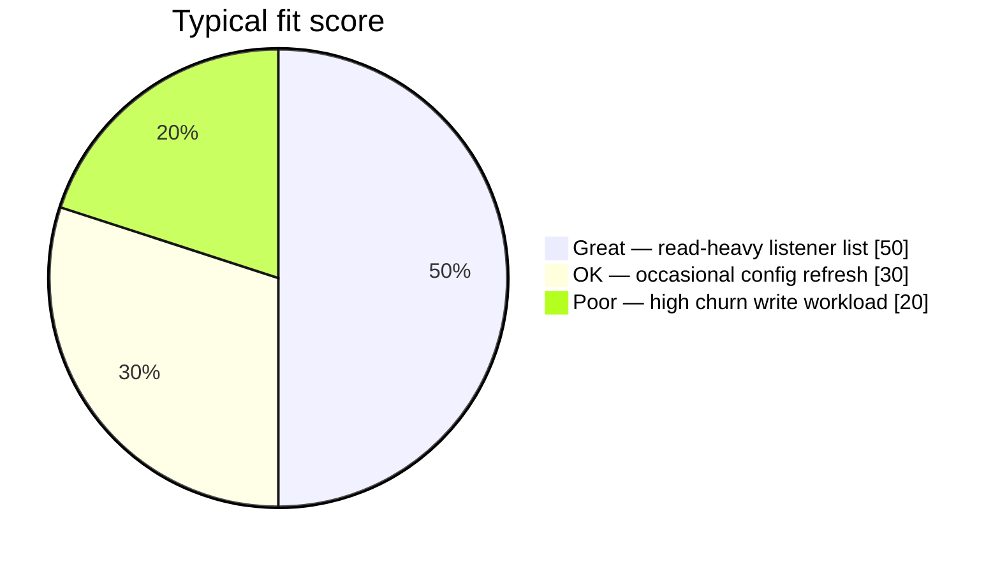

---

## Runnable example

Shows **snapshot** behavior: iterator does not see `"Cherry"` added by another thread during the loop, but the **live** list does.

```java
import java.util.ListIterator;
import java.util.concurrent.CopyOnWriteArrayList;

public class CopyOnWriteDemo {
    public static void main(String[] args) throws InterruptedException {
        CopyOnWriteArrayList<String> list = new CopyOnWriteArrayList<>();
        list.add("Apple");
        list.add("Banana");

        Thread t = new Thread(() -> {
            try { Thread.sleep(100); } catch (InterruptedException ignored) {}
            list.add("Cherry");
        });
        t.start();

        ListIterator<String> it = list.listIterator();
        while (it.hasNext()) {
            System.out.println("Iterator: " + it.next());
            Thread.sleep(200);
        }
        t.join();
        System.out.println("Live list: " + list); // [Apple, Banana, Cherry]
    }
}
```

```bash
cd /tmp && javac CopyOnWriteDemo.java && java CopyOnWriteDemo
```

**Expected pattern:** iterator prints **Apple**, **Banana** only; final line includes **Cherry**.

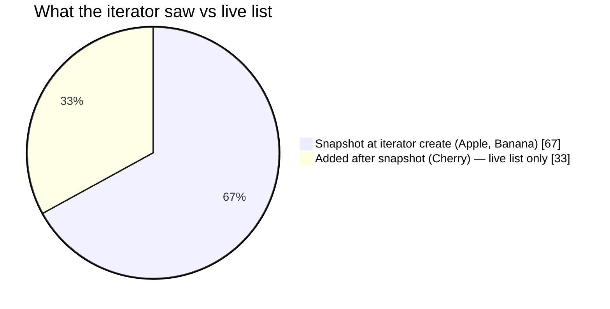

### Iterator `remove` — not allowed

```java
CopyOnWriteArrayList<String> list = new CopyOnWriteArrayList<>();
list.add("x");
var it = list.iterator();
it.next();
it.remove(); // UnsupportedOperationException
```

---

## Compare with related types

| Type                             | Iterator                          | Write cost      | Best for                     |
| -------------------------------- | --------------------------------- | --------------- | ---------------------------- |
| **`ArrayList`**                  | Fail-fast                         | Low             | Single-threaded              |
| **`Vector` / synchronized list** | Fail-fast                         | Whole-list lock | Legacy                       |
| **`CopyOnWriteArrayList`**       | Fail-safe snapshot                | Copy array      | **Read-mostly** shared lists |
| **`ConcurrentHashMap`**          | Weakly consistent (map, not list) | Bin-level       | Shared maps                  |

---

## See also

- [concurrentCollections.md](concurrentCollections.md) — hub, `threadDemo`, iterator examples
- [concurrentHashMap.md](concurrentHashMap.md) — concurrent maps and fail-safe map iteration
# Flow Analysis: Fixing Race Conditions in copyOnWriteAlDemo

When running `copyOnWriteAlDemo`, if the child thread sleeps for 3 seconds (`3000ms`) while the main thread's loop only takes 2 seconds (`2000ms`), the program will exit before the child thread ever adds the element. Adding **`childThread.join()`** forces the main thread to wait for the background update to complete.

---

## 1. Complete Source Code

### Class 1: `childThreadBase.java`
```java
import java.util.concurrent.CopyOnWriteArrayList;

public class childThreadBase extends Thread {

    // Keeping your exact static collection object variable
    public static CopyOnWriteArrayList<String> coal = new CopyOnWriteArrayList<String>();

    @Override
    public void run() {
        try {
            // Keeps your exact 3-second processing delay simulation
            Thread.sleep(3000);
        } catch (InterruptedException e) {
            System.out.println("Child thread interrupted.");
        }

        System.out.println("\n[Child Thread] Waking up and executing -> coal.add(\"Kunti\")");
        coal.add("Kunti");
    }
}
```

### Class 2: `copyOnWriteAlDemo.java`
```java
import java.util.Iterator;

public class copyOnWriteAlDemo {
    public static void main(String[] args) throws InterruptedException {

        // 1. Adding initial entries directly to your static 'coal' object
        childThreadBase.coal.add("panduraju");
        childThreadBase.coal.add("Maadhri");

        System.out.println("Main thread is running.");

        // 2. Initializing and starting your custom thread
        childThreadBase childThread = new childThreadBase();
        childThread.start();

        // 3. Capturing your Iterator from the 'coal' list instance
        Iterator<String> itr = childThreadBase.coal.iterator();

        // 4. Looping through the captured snapshot (Takes exactly 2 seconds)
        while (itr.hasNext()) {
            String element = itr.next();
            System.out.println("Main Thread is iterating List: " + element);
            Thread.sleep(1000); 
        }
        System.out.println("Main Thread has finished iterating the List.");

        // =====================================================================
        // THE FIX FOR THE FLAKY BEHAVIOR:
        // Forces the main thread to stop here and wait for the childThread 
        // to complete its 3-second sleep and execute its add() operation.
        // =====================================================================
        System.out.println("Main Thread waiting for Child Thread to add its element...");
        childThread.join(); 

        // 5. Printing the final collection showing your updated elements
        System.out.println("\nFinal state of coal: " + childThreadBase.coal);
    }
}
```

---

## 2. Program Execution Flowchart

This flowchart outlines the chronological execution blocks of your code, showing how `childThread.join()` holds the main thread execution line.

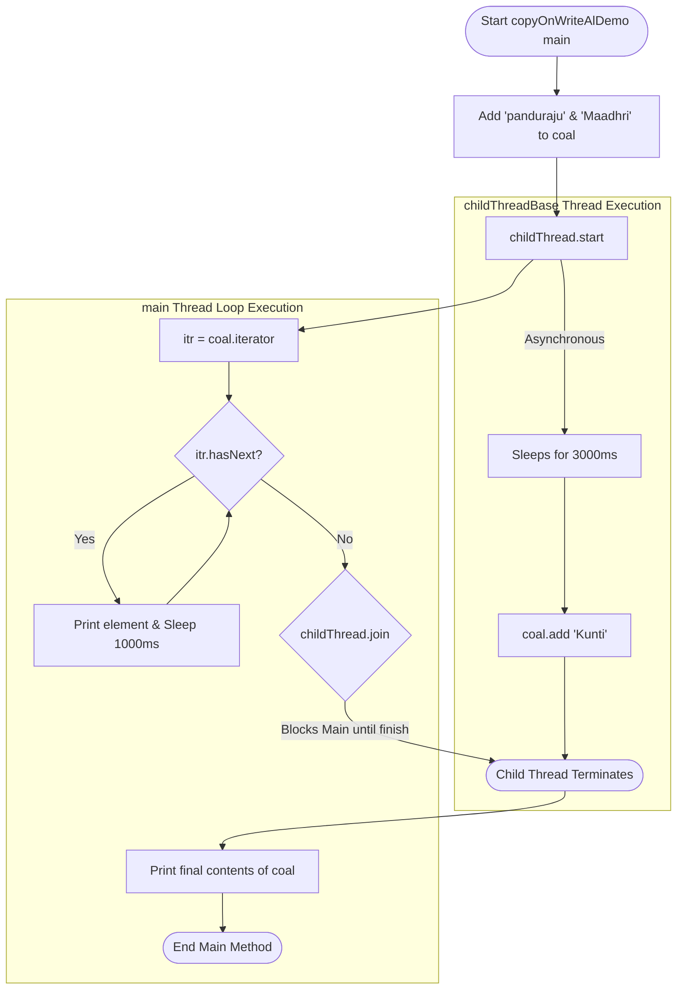

---

## 3. Simultaneous Timeline Interaction

This map plots why `"Kunti"` is hidden inside the iterator loop but visible inside the final string output representation.

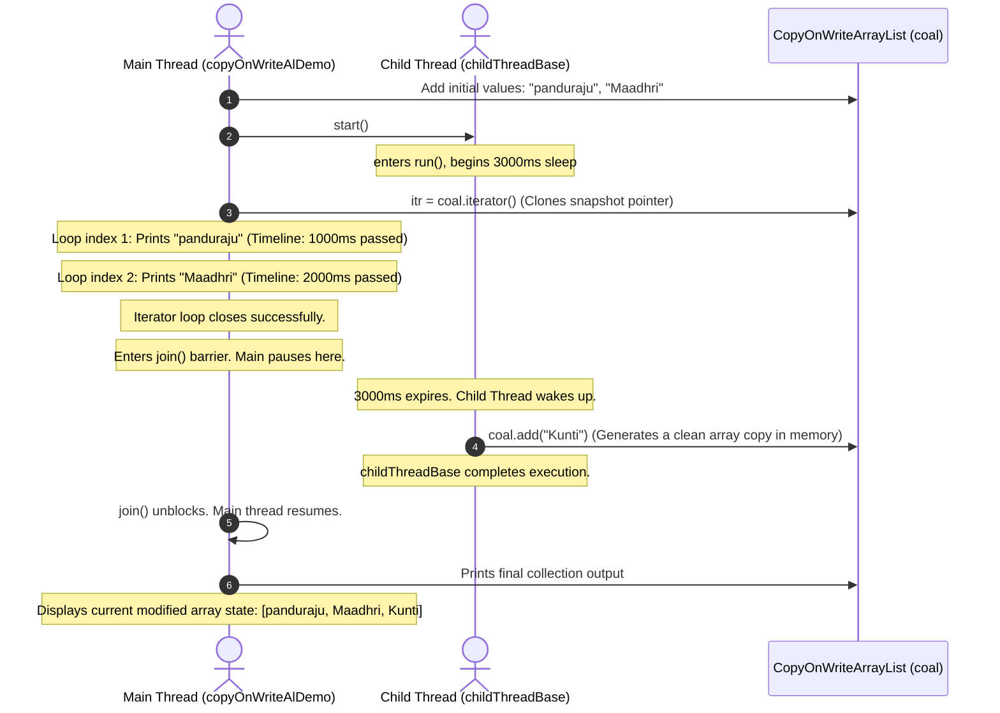

