# CopyOnWriteArraySet

> Package: `java.util.concurrent` · Backed by: [`CopyOnWriteArrayList`](copyOnWriteArrayList.md) · Hub: [concurrentCollections.md](concurrentCollections.md)

`CopyOnWriteArraySet` is a **thread-safe** `Set` implemented **on top of** `CopyOnWriteArrayList`. It uses the same **copy-on-write** idea: **reads** and **iterators** work on snapshots; **add** / **remove** clone the backing storage.

---

## Guide map

| Section | Content |
| ------- | ------- |
| [Class hierarchy](#class-hierarchy) | `Collection` → `Set` → `CopyOnWriteArraySet` |
| [How it works internally](#how-it-works-internally) | Delegates to `CopyOnWriteArrayList` |
| [Classroom properties](#classroom-properties-overview-slide) | Thread safety, order, duplicates, iterators |
| [vs `synchronizedSet`](#copyonwritearrayset-vs-synchronizedset) | Fail-safe vs fail-fast comparison slide |
| [Examples](#runnable-examples) | Add, iterate, duplicate, `iterator.remove` |
| [When to use](#when-to-use-copyonwritearrayset) | Read-heavy sets |

---

## Class hierarchy

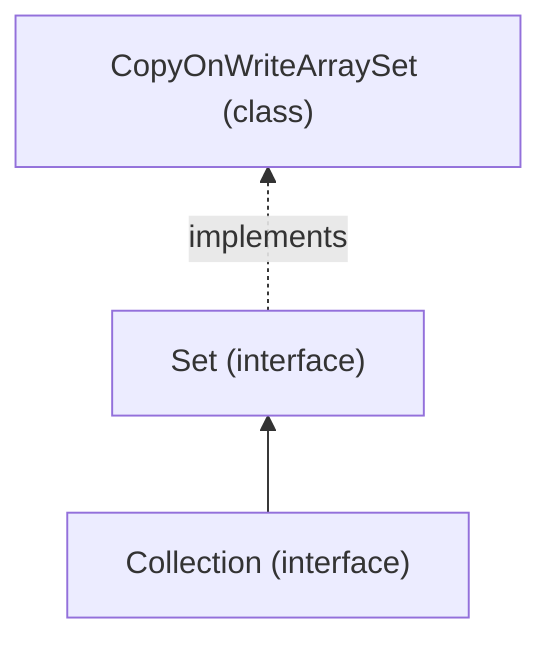

<p align="center">
  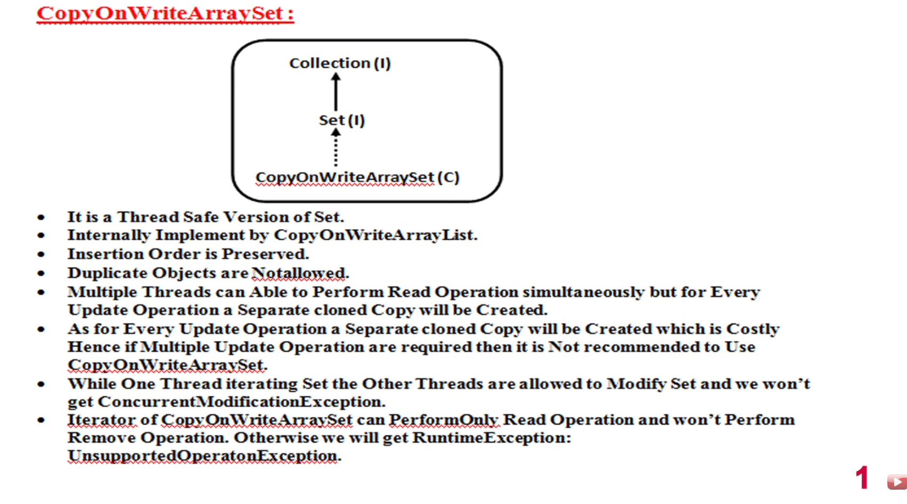
</p>

*Figure: classroom overview — thread-safe `Set`; copy-on-write updates; fail-safe iteration; iterator cannot remove.*

---

## How it works internally

`CopyOnWriteArraySet` does **not** use a hash table. It wraps a **`CopyOnWriteArrayList`** and enforces **Set** semantics (`add` ignores duplicates by checking `contains` before add).

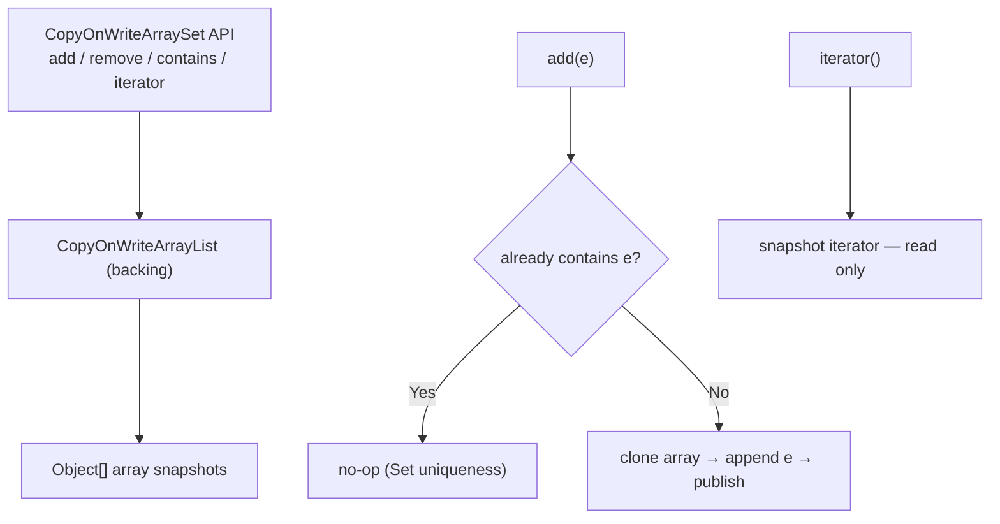

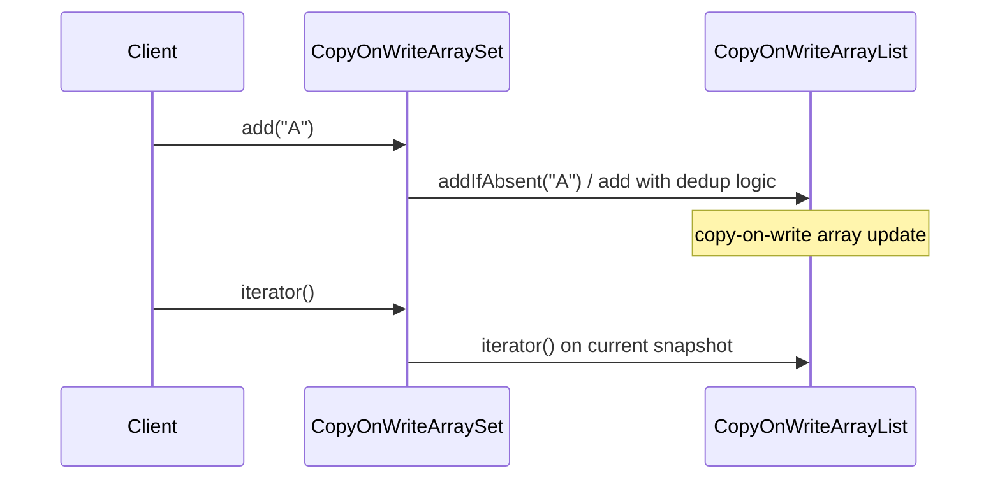

| Layer | Role |
| ----- | ---- |
| **`Set` interface** | No duplicate elements; `add` returns `false` if already present |
| **`CopyOnWriteArrayList`** | Stores elements in order; **clones** array on structural change |
| **Iterator** | **Fail-safe** snapshot; **`remove()`** → `UnsupportedOperationException` |

Same copy-on-write lessons as the list guide: [copyOnWriteArrayList.md — mechanism](copyOnWriteArrayList.md#copy-on-write-mechanism).

---

## Classroom properties (overview slide)

| Property | Behavior |
| -------- | -------- |
| **Thread safety** | Safe for concurrent **read**; **updates** on a **cloned copy** of the backing array |
| **Implementation** | **Internally** uses `CopyOnWriteArrayList` |
| **Insertion order** | **Preserved** in iteration (order of underlying list) |
| **Duplicates** | **Not allowed** — second `add` of same element has no effect |
| **Concurrent reads** | Multiple threads can **read** / iterate together |
| **Updates** | Each **add** / **remove** may **copy** the whole backing array — **costly** if updates are frequent |
| **Iterate + modify** | Another thread may **add** / **remove** — **no** `ConcurrentModificationException` |
| **Iterator** | **Read-only** — `iterator.remove()` → **`UnsupportedOperationException`** |

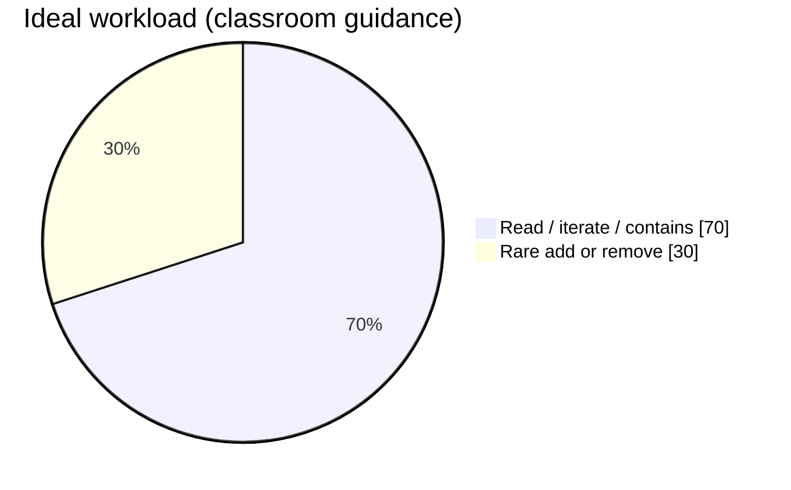

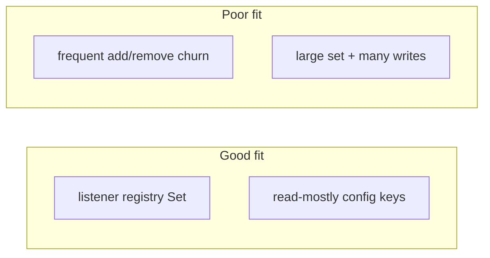

---

## CopyOnWriteArraySet vs `synchronizedSet()`

<p align="center">
  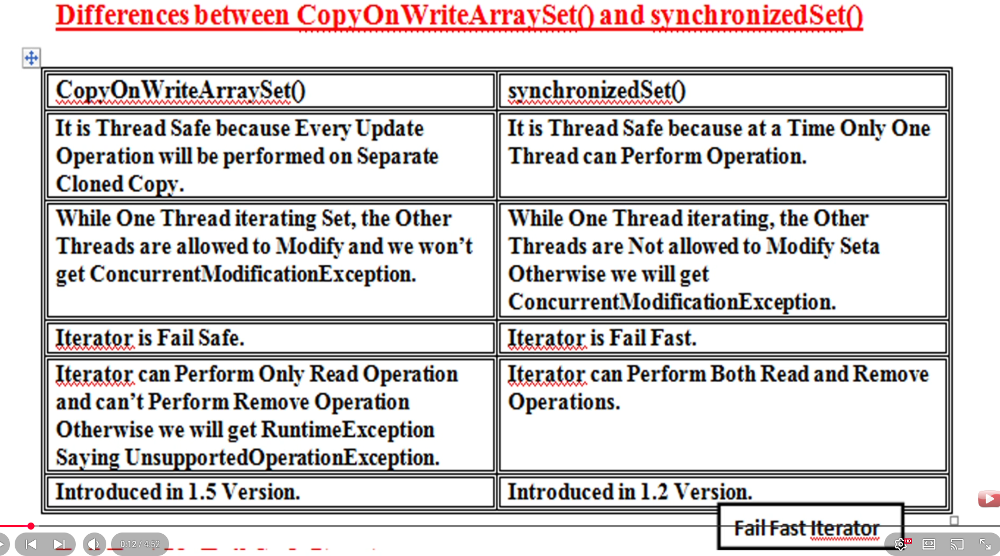
</p>

| Topic | `CopyOnWriteArraySet` | `Collections.synchronizedSet(set)` |
| ----- | --------------------- | -------------------------------- |
| **Thread safety** | **Copy-on-write** — update on **cloned** copy | **One thread at a time** on the wrapper monitor |
| **Iterate + other thread modifies** | **Allowed** — **no CME** | **Not** allowed without syncing → **CME** (fail-fast) |
| **Iterator** | **Fail-safe** (snapshot) | **Fail-fast** |
| **`iterator.remove()`** | **`UnsupportedOperationException`** (read-only iterator) | **Supported** when correctly synchronized |
| **Since** | Java **1.5** | Java **1.2** |

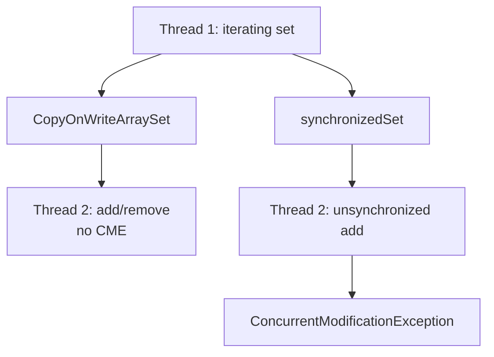

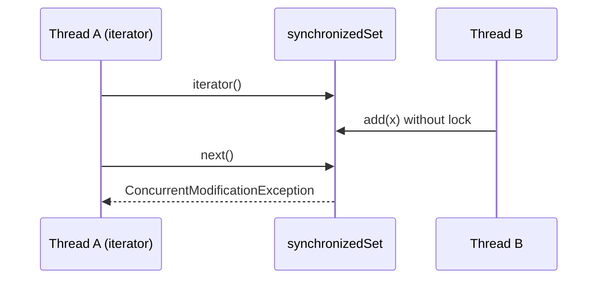

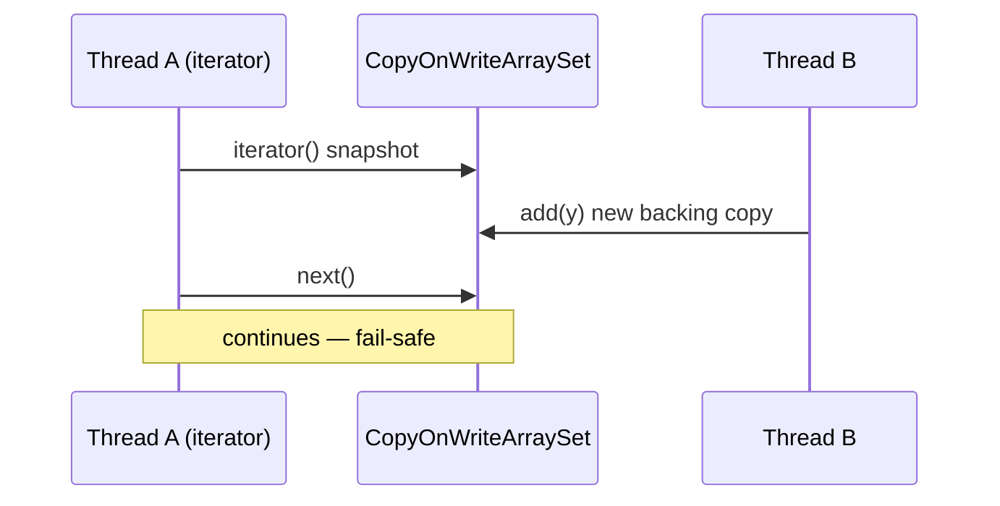

### Write path comparison

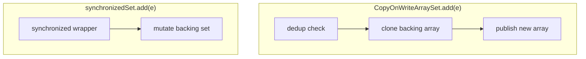

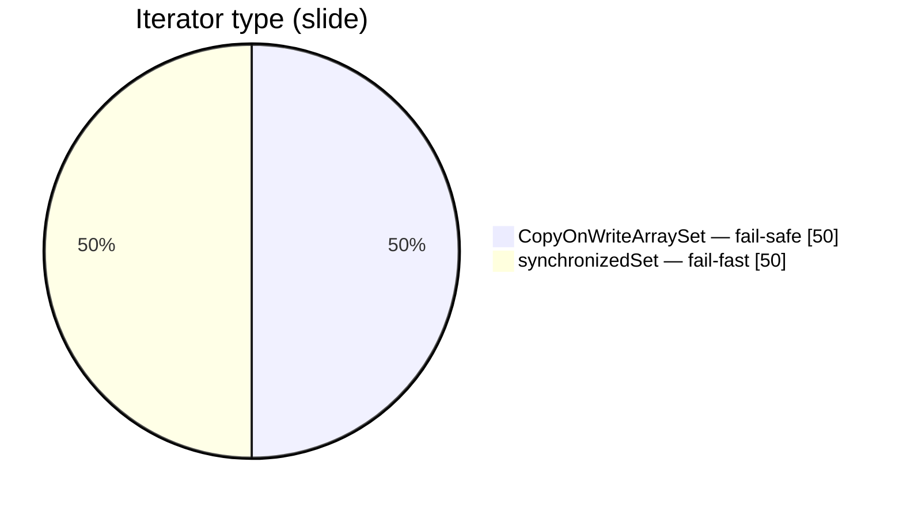

### Iterator `remove`

| Call | `CopyOnWriteArraySet` | `synchronizedSet` |
| ---- | --------------------- | ------------------- |
| `iterator.remove()` | **`UnsupportedOperationException`** | Allowed with proper `synchronized (set)` usage |
| Remove element | `set.remove(object)` | `set.remove` or iterator.remove inside sync block |

See also: [unsupportedOperationException.md](unsupportedOperationException.md) (same pattern on `CopyOnWriteArrayList` iterator).

---

## Runnable examples

### Basic add and uniqueness

```java
import java.util.concurrent.CopyOnWriteArraySet;

public class CowSetBasics {
    public static void main(String[] args) {
        CopyOnWriteArraySet<String> names = new CopyOnWriteArraySet<>();
        System.out.println(names.add("Arjuna"));   // true
        System.out.println(names.add("Bheema"));   // true
        System.out.println(names.add("Arjuna"));   // false — duplicate
        System.out.println(names);                 // [Arjuna, Bheema] — insertion order
    }
}
```

### Snapshot iteration (add after `iterator()`)

```java
import java.util.Iterator;
import java.util.concurrent.CopyOnWriteArraySet;

public class CowSetSnapshot {
    public static void main(String[] args) {
        CopyOnWriteArraySet<String> set = new CopyOnWriteArraySet<>();
        set.add("A");
        set.add("B");

        Iterator<String> it = set.iterator();
        set.add("C");  // live set updated; iterator snapshot unchanged

        while (it.hasNext()) {
            System.out.println(it.next());  // A, B only (not C on this iterator)
        }
        System.out.println("Live set: " + set);  // includes C
    }
}
```

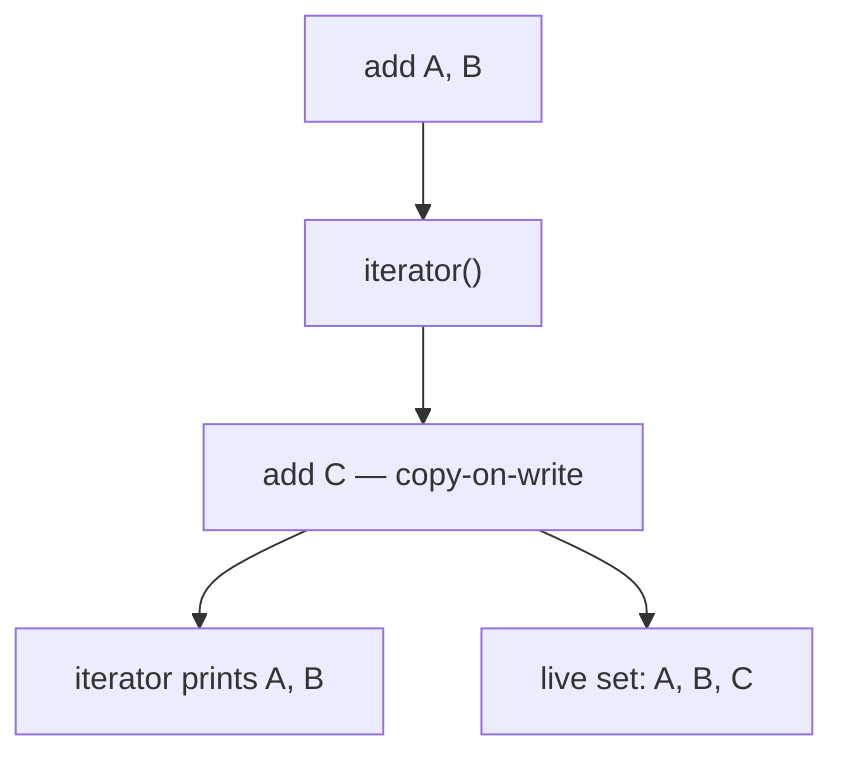

### `iterator.remove()` fails

```java
CopyOnWriteArraySet<String> set = new CopyOnWriteArraySet<>();
set.add("x");
Iterator<String> it = set.iterator();
it.next();
it.remove(); // UnsupportedOperationException
```

Use **`set.remove("x")`** instead.

---

## When to use `CopyOnWriteArraySet`

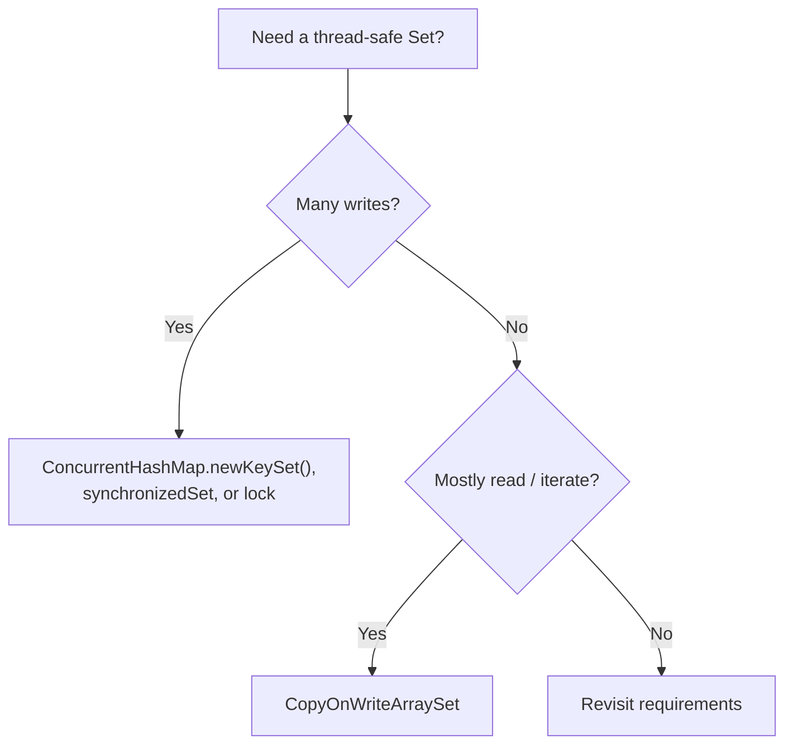

| Use `CopyOnWriteArraySet` | Avoid |
| ------------------------- | ----- |
| Small to medium **read-heavy** registries (listeners, tags) | **Large** sets with **frequent** updates |
| Need **fail-safe** iteration without external sync | Need **`iterator.remove()`** |
| Happy with **insertion-order** iteration | Need **hash-fast** `HashSet` performance |

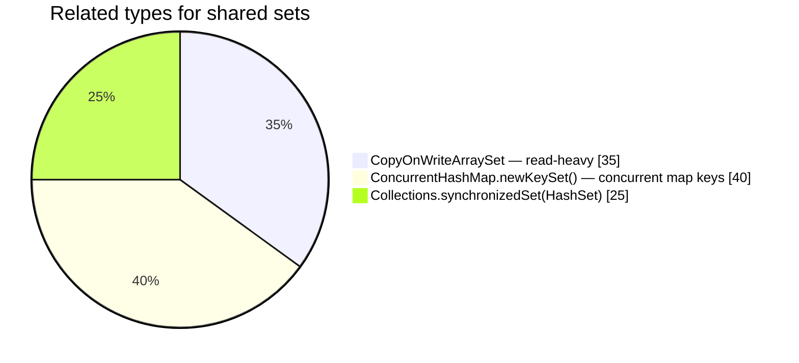

---

## See also

- [copyOnWriteArrayList.md](copyOnWriteArrayList.md) — copy-on-write mechanism, ArrayList / sync list comparisons
- [concurrentCollections.md](concurrentCollections.md) — fail-fast vs fail-safe hub
- [set.md](../collection/set.md) — general `Set` hierarchy in collection guides
