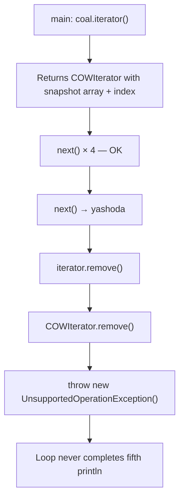
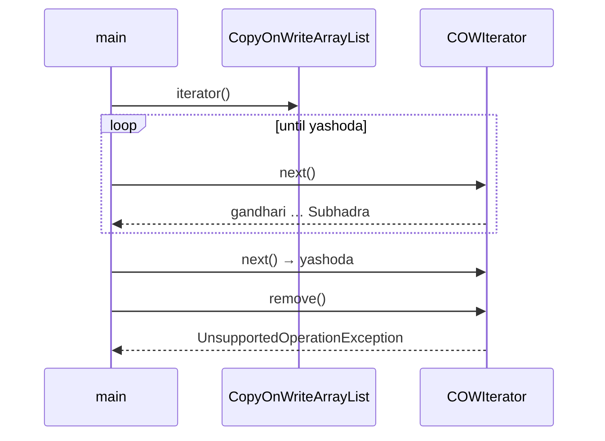
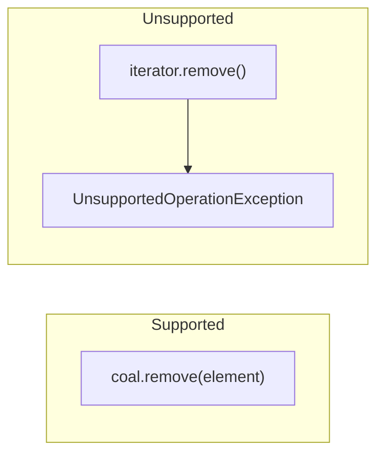
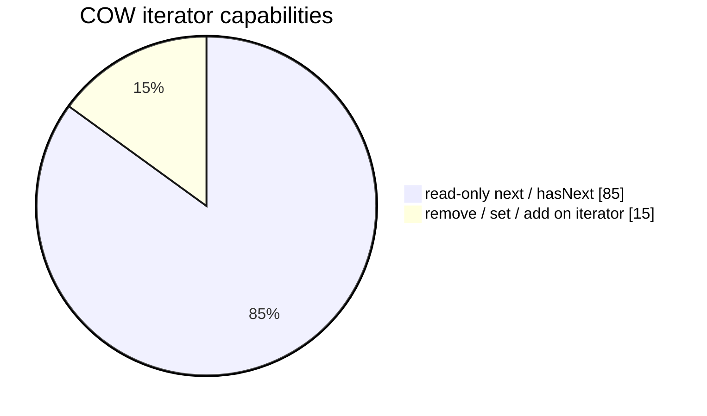

# `UnsupportedOperationException` on `CopyOnWriteArrayList` iterator

> Demo: [`unsupportedOperationexception.java`](../../../demo/src/main/java/com/concurrentCollection/copyOnWriteArrayListClass/unsupportedOperationexception.java) · List guide: [copyOnWriteArrayList.md](copyOnWriteArrayList.md)

---

## What the demo does

```java
CopyOnWriteArrayList<String> coal = new CopyOnWriteArrayList<>();
// ... add gandhari, kunti, draupadi, Subhadra, yashoda ...

Iterator<String> iterator = coal.iterator();
while (iterator.hasNext()) {
    String element = iterator.next();
    if (element.equals("yashoda"))
        iterator.remove();  // fails here
    System.out.println("Removed element: " + element);
}
```

The list itself is **not** unmodifiable — you can `coal.add(...)` / `coal.remove(...)`. Only **`iterator.remove()`** (and related iterator mutators) are forbidden.

---

## Verified stack trace

```text
Removed element: gandhari
Removed element: kunti
Removed element: draupadi
Removed element: Subhadra
Exception in thread "main" java.lang.UnsupportedOperationException
    at java.base/java.util.concurrent.CopyOnWriteArrayList$COWIterator.remove(CopyOnWriteArrayList.java:1208)
    at ...unsupportedOperationexception.demonstrateUnsupportedOperationException(...)
```

---

## Internal flow (why it throws)





### Design reason

| If `iterator.remove()` were allowed | Problem |
| ----------------------------------- | ------- |
| Mutate snapshot array in place | Breaks **copy-on-write** — other threads / iterators holding old snapshot see torn state |
| Mutate live array from iterator | Duplicates logic of `list.remove` and races with concurrent **add** (new copies) |

**Supported removal:** call **`coal.remove("yashoda")`** (or `removeIf`) on the **list**, not on the iterator.





---

## Compare with `ArrayList`

| Operation | `ArrayList` iterator | `CopyOnWriteArrayList` iterator |
| --------- | ------------------- | ------------------------------- |
| `next()` during other thread `add` | **CME** (fail-fast) | OK on **snapshot** |
| `remove()` | Supported (with modCount rules) | **`UnsupportedOperationException`** |

---

## Run

```bash
cd demo
javac -d /tmp/uoe src/main/java/com/concurrentCollection/copyOnWriteArrayListClass/unsupportedOperationexception.java
java -cp /tmp/uoe com.concurrentCollection.copyOnWriteArrayListClass.unsupportedOperationexception
```

---

## See also

- [Classroom A,B,C,D snapshot](copyOnWriteArrayList.md#classroom-execution-add-after-iterator)
- [Fail-fast vs fail-safe](concurrentCollections.md#fail-fast-vs-fail-safe-iterators-with-examples)
