# Java Enumeration (`enum`)

> Guide: named constants, **`Fruits`** architecture, reflection-style iteration, and **`Enum.valueOf`**.  
> Demos: [`Fruits.java`](../../../demo/src/main/java/com/advanced/enumeration/Fruits.java) · [`enumBasics.java`](../../../demo/src/main/java/com/enumeration/enumBasics.java) · [`enumConstructor.java`](../../../demo/src/main/java/com/enumeration/enumConstructor.java) · [Switch on enums](./switch.md)

> **Navigation:** Use **Ctrl+click** on Guide map / TOC links to jump to a section in preview.

## Guide map

| Jump to                                                                        | Topic                           |
| ------------------------------------------------------------------------------ | ------------------------------- |
| [Introduction](#introduction)                                                  | Why `enum`                      |
| [Rules of enum constants](#rules-of-enum-constants)                            | `public static final` objects   |
| [Fruits example (source)](#fruits-example-source)                              | Your enum in source             |
| [Internal architecture of `Fruits`](#internal-architecture-of-fruits)          | Class desugaring + memory       |
| [Printing enums and `toString()`](#printing-enums-and-tostring)                | `println` → `toString()` flow   |
| [EnumBasics — `iterateAllInEnums`](#enumbasics--iterateallinenums)             | `Class.getEnumConstants()` loop |
| [EnumBasics — `fetchSingleDataFromEnum`](#enumbasics--fetchsingledatafromenum) | `Enum.valueOf` lookup           |
| [Compilation flow](#compilation-flow)                                          | Source → bytecode               |
| [Enum constructor (`enumConstructor`)](#enum-constructor-enumconstructor)      | Why ctor runs 4× for one ref    |
| [Classroom slide (Beer → Fruits)](#classroom-slide-beer--fruits)               | Whiteboard reference            |
| [enum vs switch](#enum-vs-switch)                                              | Switch argument types           |
| [enum vs Inheritance](#enum-vs-inheritance)                                    | Why `extends` is forbidden      |

---

<!-- TOC -->
- [Java Enumeration (`enum`)](#java-enumeration-enum)
  - [Guide map](#guide-map)
  - [Introduction](#introduction)
  - [Rules of enum constants](#rules-of-enum-constants)
  - [Fruits example (source)](#fruits-example-source)
  - [Internal architecture of `Fruits`](#internal-architecture-of-fruits)
    - [Source vs compiler-generated shape (Fruits)](#source-vs-compiler-generated-shape-fruits)
    - [Memory layout (heap + static area)](#memory-layout-heap--static-area)
    - [Identity and comparison](#identity-and-comparison)
  - [Printing enums and `toString()`](#printing-enums-and-tostring)
    - [Demo code](#demo-code)
    - [End-to-end flow (`println` on an enum reference)](#end-to-end-flow-println-on-an-enum-reference)
    - [What `Enum.toString()` does internally](#what-enumtostring-does-internally)
    - [Pie charts — printing path](#pie-charts--printing-path)
    - [Reference variable vs printed text](#reference-variable-vs-printed-text)
  - [EnumBasics — `iterateAllInEnums`](#enumbasics--iterateallinenums)
    - [Point-by-point architecture](#point-by-point-architecture)
  - [EnumBasics — `fetchSingleDataFromEnum`](#enumbasics--fetchsingledatafromenum)
    - [Point-by-point architecture](#point-by-point-architecture-1)
    - [`iterateAllInEnums` vs `fetchSingleDataFromEnum`](#iterateallinenums-vs-fetchsingledatafromenum)
  - [Compilation flow](#compilation-flow)
  - [Enum constructor (`enumConstructor`)](#enum-constructor-enumconstructor)
    - [Demo program](#demo-program)
    - [Observed output](#observed-output)
    - [Point-by-point — why four constructor calls?](#point-by-point--why-four-constructor-calls)
    - [Compiler-generated shape (conceptual)](#compiler-generated-shape-conceptual)
    - [Class initialization timeline](#class-initialization-timeline)
    - [Flow diagrams and pie charts](#flow-diagrams-and-pie-charts)
  - [Classroom slide (Beer → Fruits)](#classroom-slide-beer--fruits)
  - [Run the demo](#run-the-demo)
- [enum vs switch](#enum-vs-switch)
- [enum vs Inheritance](#enum-vs-inheritance)
    - [Whiteboard — four forbidden `extends` patterns](#whiteboard--four-forbidden-extends-patterns)
    - [Compilation errors when a class extends an enum](#compilation-errors-when-a-class-extends-an-enum)
    - [Flow diagrams](#flow-diagrams)
    - [Classroom slide (inheritance restrictions)](#classroom-slide-inheritance-restrictions)
- [values()](#values)
- [enum and constrcutors](#enum-and-constrcutors)
<!-- /TOC -->

---

## Introduction

If we want to represent a group of named constants then we should go for enum

Example:

enum Month
{
    Jan,Feb...Dec;
}

enum temples
{
    Kaashi,tirupathi...Kanchi;
}

The main objective of enum is to define our own datatypes(enumerated datatypes)

Enum concept introduced in 1.5 version when compared with old languages enum java enum is more powerful

---

## Rules of enum constants

1. Every enum is internally implemented by using class concept
2. Every enum constant is always public static final
3. every enum constant represents an object of the type enum

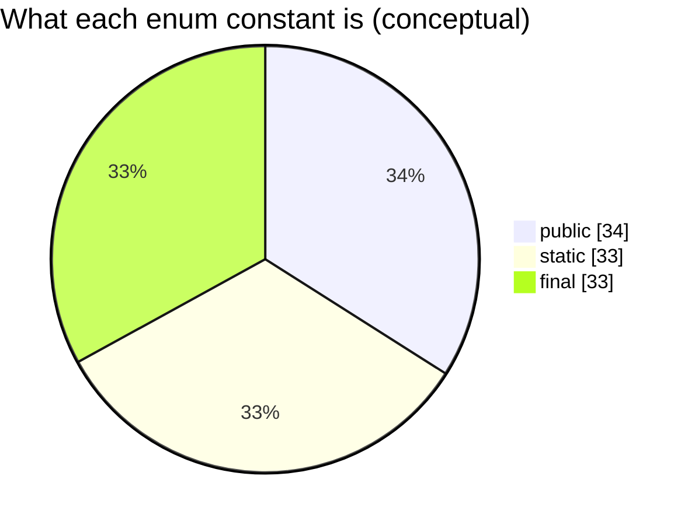
```mermaid
pie showData
    title What each enum constant is (conceptual)
    "public" : 34
    "static" : 33
    "final" : 33
```

---

## Fruits example (source)

```java
enum Fruits {
    mangoes, pomegrante;
}
```

Runnable copy (package `com.advanced.enumeration`): [`Fruits.java`](../../../demo/src/main/java/com/advanced/enumeration/Fruits.java).

| Constant     | Role at runtime                                      |
| ------------ | ---------------------------------------------------- |
| `mangoes`    | Single `Fruits` instance (singleton within the enum) |
| `pomegrante` | Another distinct `Fruits` instance                   |

---

## Internal architecture of `Fruits`

The compiler **does not** leave `enum` as a special keyword in the `.class` file. It **desugars** your `enum Fruits { ... }` into a **`final class Fruits`** that **extends `java.lang.Enum<Fruits>`**, with one **static final field** and **one heap object** per constant.

### Source vs compiler-generated shape (Fruits)

**What you write:**

```java
enum Fruits {
    mangoes, pomegrante;
}
```

**Conceptual equivalent (simplified — real bytecode also adds `values()`, `valueOf(String)`, etc.):**

```java
final class Fruits extends Enum<Fruits> {
    public static final Fruits mangoes = new Fruits("mangoes", 0);
    public static final Fruits pomegrante = new Fruits("pomegrante", 1);

    private Fruits(String name, int ordinal) {
        super(name, ordinal);
    }
}
```

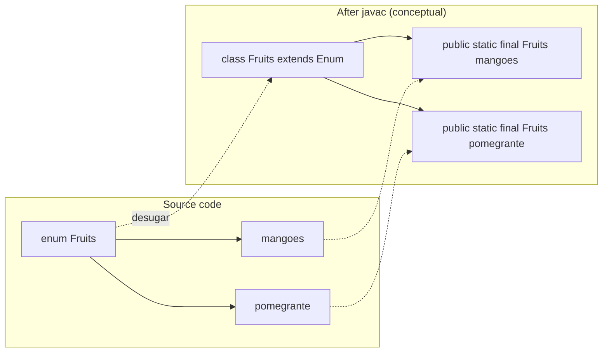
```mermaid
flowchart LR
  subgraph source ["Source code"]
    E["enum Fruits"]
    C1["mangoes"]
    C2["pomegrante"]
    E --> C1
    E --> C2
  end
  subgraph compiled ["After javac (conceptual)"]
    CL["class Fruits extends Enum"]
    F1["public static final Fruits mangoes"]
    F2["public static final Fruits pomegrante"]
    CL --> F1
    CL --> F2
  end
  E -.->|"desugar"| CL
  C1 -.-> F1
  C2 -.-> F2
```

### Memory layout (heap + static area)

Each constant is **`new Fruits(...)` once** when the enum class is initialized. References `Fruits.mangoes` and `Fruits.pomegrante` point to those two objects forever (same references for the life of the class loader).

```text
Method area / static storage              Heap
┌─────────────────────────────┐          ┌──────────────────┐
│ Fruits.mangoes    ───────────┼────────►│ Fruits instance  │  ordinal=0, name="mangoes"
└─────────────────────────────┘          └──────────────────┘
┌─────────────────────────────┐          ┌──────────────────┐
│ Fruits.pomegrante ───────────┼────────►│ Fruits instance  │  ordinal=1, name="pomegrante"
└─────────────────────────────┘          └──────────────────┘
```

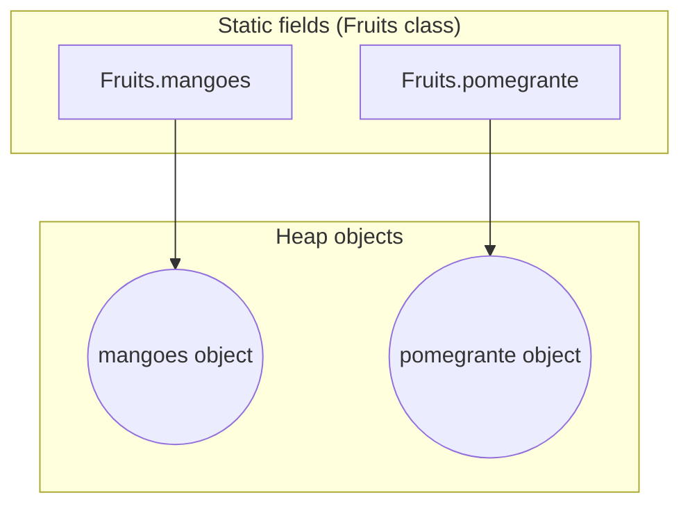
```mermaid
flowchart TB
  subgraph static ["Static fields (Fruits class)"]
    REF1["Fruits.mangoes"]
    REF2["Fruits.pomegrante"]
  end
  subgraph heap ["Heap objects"]
    O1(("mangoes object"))
    O2(("pomegrante object"))
  end
  REF1 --> O1
  REF2 --> O2
```

### Identity and comparison

- **`Fruits.mangoes == Fruits.mangoes`** is always `true` (same reference).
- **`==` between two enum constants of the same type** is safe and preferred; `equals()` delegates to identity for enums.
- **`ordinal()`** returns declaration order: `mangoes` → `0`, `pomegrante` → `1`.

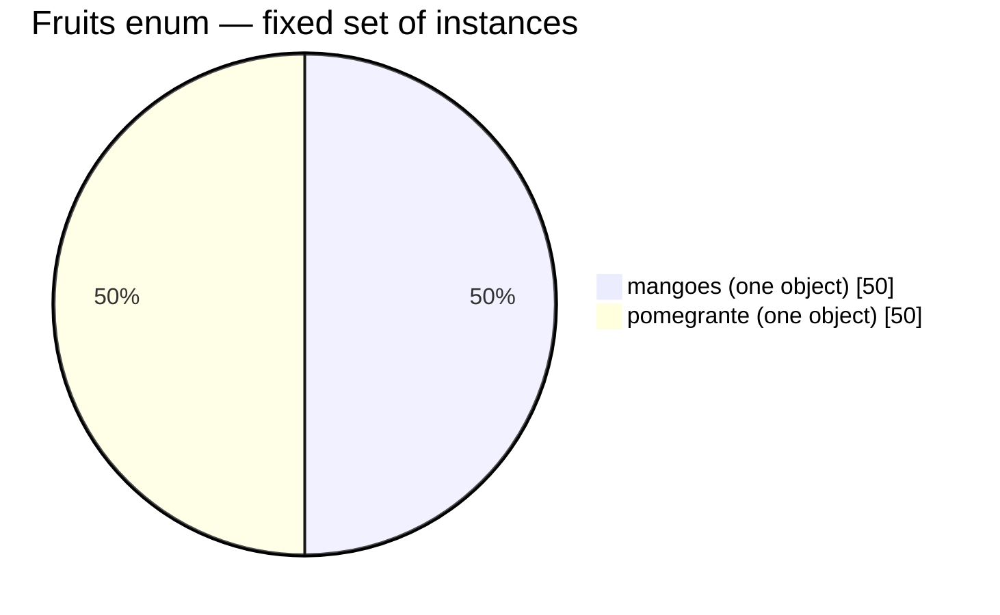
```mermaid
pie showData
    title Fruits enum — fixed set of instances
    "mangoes (one object)" : 50
    "pomegrante (one object)" : 50
```

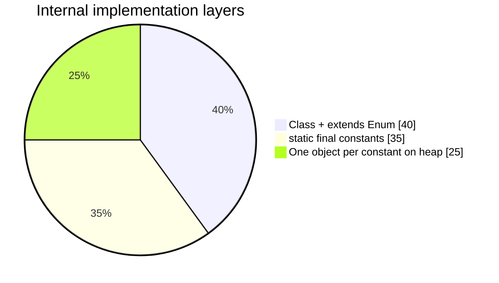
```mermaid
pie showData
    title Internal implementation layers
    "Class + extends Enum" : 40
    "static final constants" : 35
    "One object per constant on heap" : 25
```

---

## Printing enums and `toString()`

When you pass an enum **reference** to `System.out.println(...)`, you do **not** print the memory address. The JVM converts the object to text by calling **`toString()`** on that reference.

### Demo code

From [`Fruits.java`](../../../demo/src/main/java/com/advanced/enumeration/Fruits.java):

```java
System.out.println(Fruits.mangoes);
System.out.println(Fruits.pomegrante);
```

**Console:**

```text
mangoes
pomegrante
```

The output is the **constant name**, not `Fruits@hashcode`.

### End-to-end flow (`println` on an enum reference)

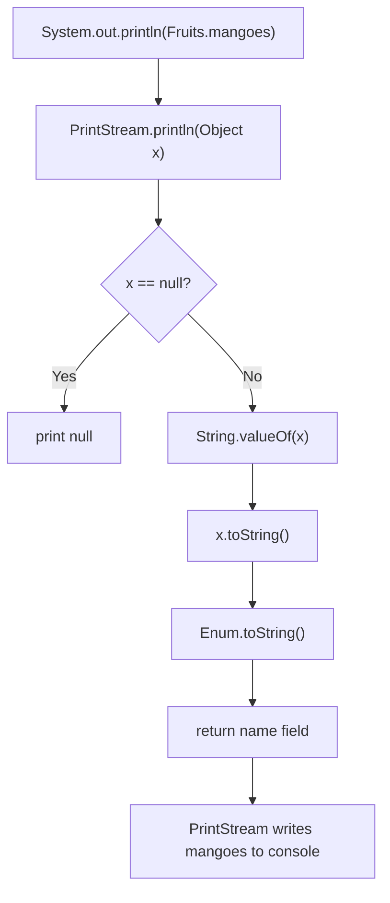
```mermaid
flowchart TD
  A["System.out.println(Fruits.mangoes)"] --> B["PrintStream.println(Object x)"]
  B --> C{"x == null?"}
  C -- Yes --> D["print null"]
  C -- No --> E["String.valueOf(x)"]
  E --> F["x.toString()"]
  F --> G["Enum.toString()"]
  G --> H["return name field"]
  H --> I["PrintStream writes mangoes to console"]
```

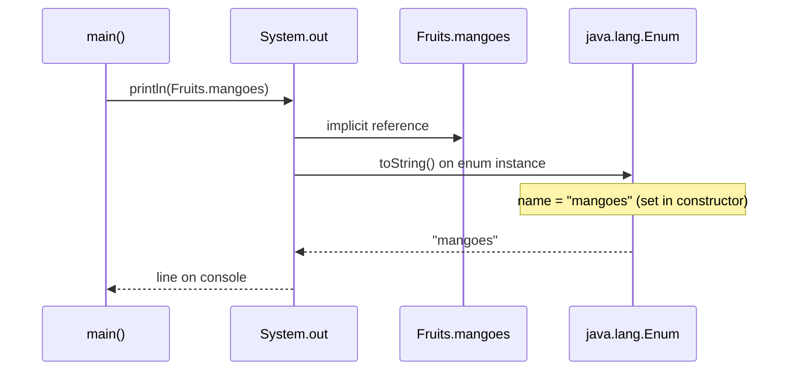
```mermaid
sequenceDiagram
  participant Main as main()
  participant Out as System.out
  participant Ref as Fruits.mangoes
  participant Enum as java.lang.Enum
  Main->>Out: println(Fruits.mangoes)
  Out->>Ref: implicit reference
  Out->>Enum: toString() on enum instance
  Note over Enum: name = "mangoes" (set in constructor)
  Enum-->>Out: "mangoes"
  Out-->>Main: line on console
```

### What `Enum.toString()` does internally

For every enum constant, the compiler passes the **identifier string** into the `Enum` superclass constructor:

```java
// conceptual — inside generated Fruits constructor for mangoes
super("mangoes", 0);  // name + ordinal
```

`java.lang.Enum` stores that `name` and **`toString()` returns it** (unless you override `toString()` in `Fruits`).

| Call                                 | Method actually used                          | Typical result            |
| ------------------------------------ | --------------------------------------------- | ------------------------- |
| `System.out.println(Fruits.mangoes)` | `Enum.toString()` → `"mangoes"`               | Constant name             |
| `Fruits.mangoes.name()`              | `Enum.name()`                                 | Same string, official API |
| `String.valueOf(Fruits.mangoes)`     | delegates to `toString()`                     | `"mangoes"`               |
| Concat: `"Pick " + Fruits.mangoes`   | `StringBuilder.append(Object)` → `toString()` | `"Pick mangoes"`          |

`Object.toString()` would look like `Fruits@1a2b3c4d`; enums **override** that so logs and UI show readable names.

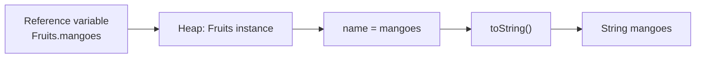
```mermaid
flowchart LR
  REF["Reference variable\nFruits.mangoes"] --> OBJ["Heap: Fruits instance"]
  OBJ --> NAME["name = mangoes"]
  NAME --> TS["toString()"]
  TS --> TXT["String mangoes"]
```

### Pie charts — printing path

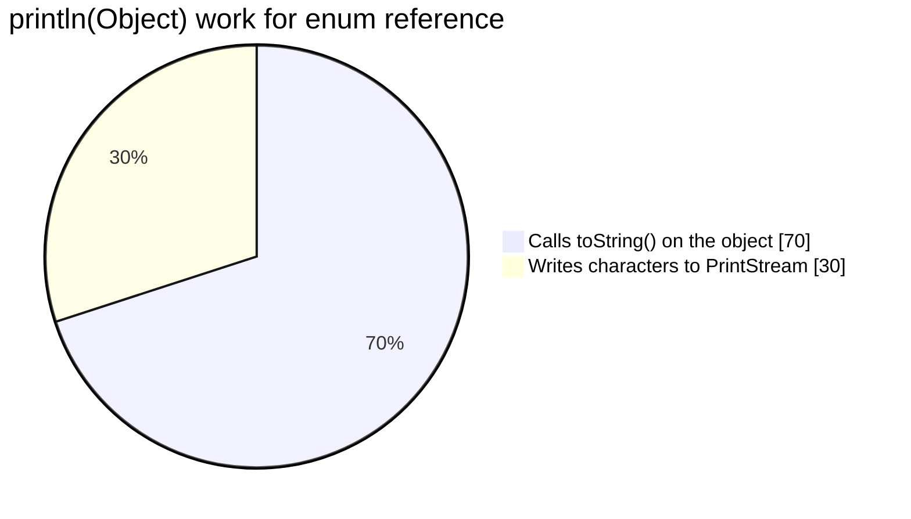
```mermaid
pie showData
    title println(Object) work for enum reference
    "Calls toString() on the object" : 70
    "Writes characters to PrintStream" : 30
```

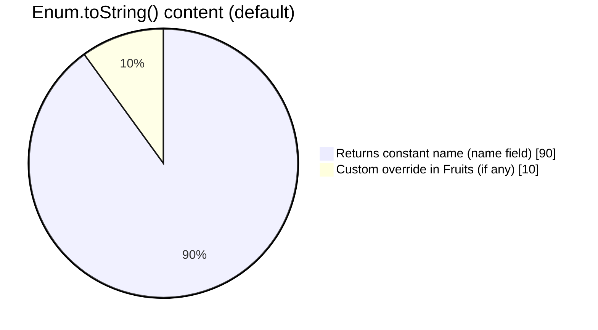
```mermaid
pie showData
    title Enum.toString() content (default)
    "Returns constant name (name field)" : 90
    "Custom override in Fruits (if any)" : 10
```

### Reference variable vs printed text

```text
Static field Fruits.mangoes  ──points to──►  [ Fruits object | name="mangoes" | ordinal=0 ]
                                                      │
                                           println ───┘
                                                      ▼
                                              toString() → "mangoes"
```

---

## EnumBasics — `iterateAllInEnums`

Program: [`enumBasics.java`](../../../demo/src/main/java/com/enumeration/enumBasics.java) (`Protein`, nested `food`, and generic helpers).

```java
public static <T extends Enum<T>> void iterateAllInEnums(Class<T> type) {
    System.out.println("--- Iterating " + type.getSimpleName() + " ---");
    for (T p : type.getEnumConstants()) {
        System.out.println(p);
    }
}
```

### Point-by-point architecture

| #   | Line / construct          | What happens internally                                                                                                                            |
| --- | ------------------------- | -------------------------------------------------------------------------------------------------------------------------------------------------- |
| 1   | `<T extends Enum<T>>`     | **Recursive generic bound:** `T` must be an enum type whose superclass is `Enum<T>` (e.g. `Protein`, `food`). Lets one method work for any enum.   |
| 2   | `Class<T> type`           | **Runtime token** for the enum class (e.g. `Protein.class`). JVM uses it to read static metadata compiled into that class.                         |
| 3   | `type.getSimpleName()`    | Reflection: returns short name (`Protein`, `food`) for the header line.                                                                            |
| 4   | `type.getEnumConstants()` | Returns **array of all enum instances** (compiler generated `values()` array, exposed via `Class`). Order = declaration order.                     |
| 5   | `for (T p : ...)`         | Enhanced for-loop over that array; each `p` is a **reference** to an existing singleton object (not `new` per iteration).                          |
| 6   | `System.out.println(p)`   | `println(Object)` → **`p.toString()`** → constant name (`whey`, `fruits`, …). See [Printing enums and `toString()`](#printing-enums-and-tostring). |

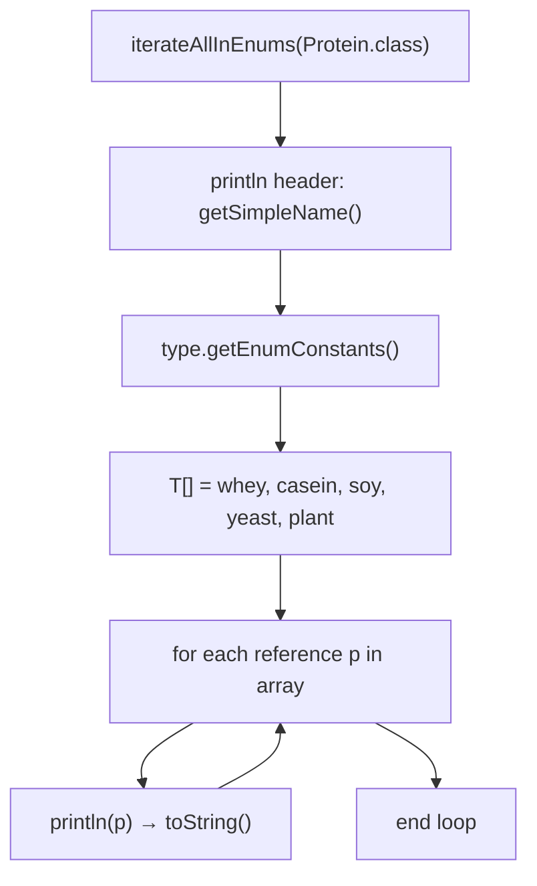
```mermaid
flowchart TD
  CALL["iterateAllInEnums(Protein.class)"] --> HDR["println header: getSimpleName()"]
  HDR --> GEC["type.getEnumConstants()"]
  GEC --> ARR["T[] = whey, casein, soy, yeast, plant"]
  ARR --> LOOP["for each reference p in array"]
  LOOP --> PLN["println(p) → toString()"]
  PLN --> LOOP
  LOOP --> DONE["end loop"]
```

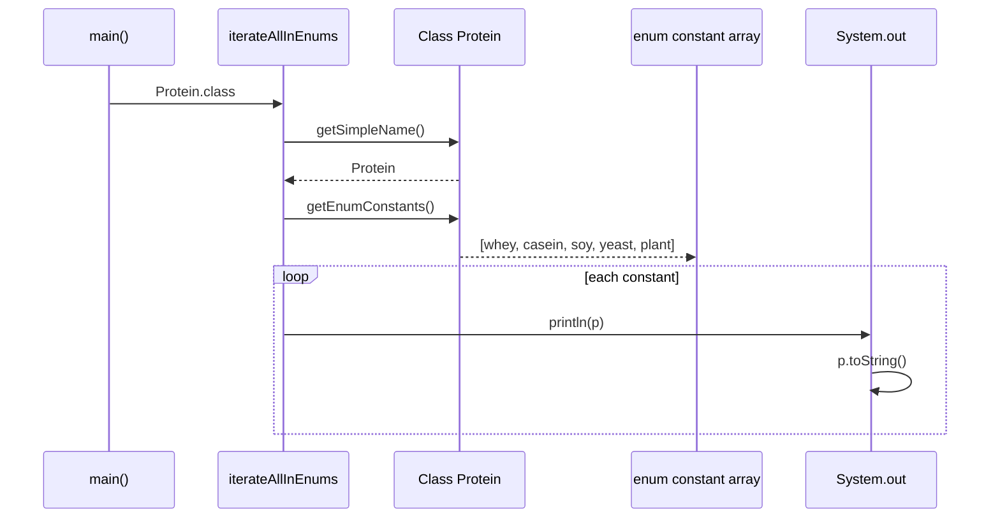
```mermaid
sequenceDiagram
  participant Main as main()
  participant Iter as iterateAllInEnums
  participant Cls as Class Protein
  participant Arr as enum constant array
  participant Out as System.out
  Main->>Iter: Protein.class
  Iter->>Cls: getSimpleName()
  Cls-->>Iter: Protein
  Iter->>Cls: getEnumConstants()
  Cls-->>Arr: [whey, casein, soy, yeast, plant]
  loop each constant
    Iter->>Out: println(p)
    Out->>Out: p.toString()
  end
```

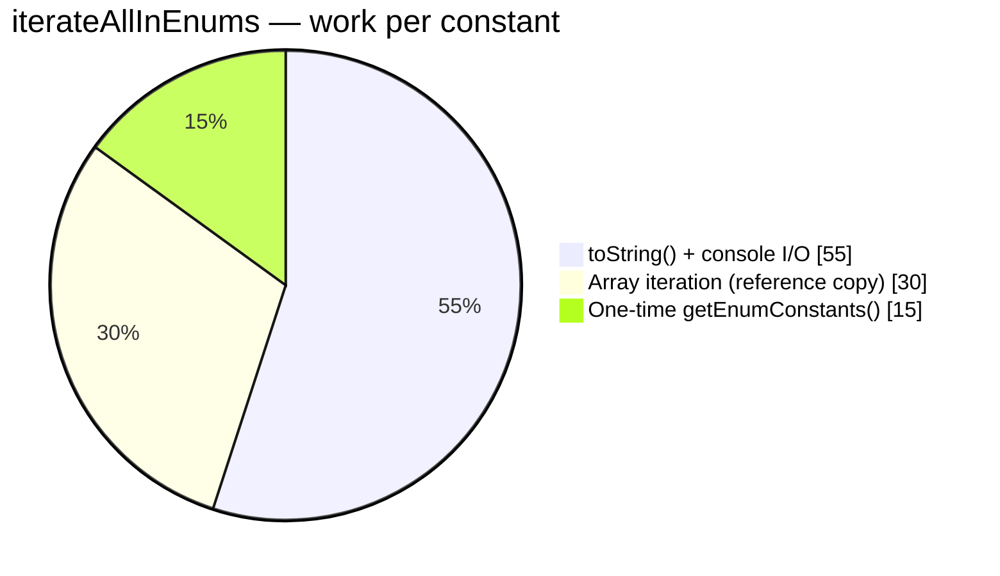
```mermaid
pie showData
    title iterateAllInEnums — work per constant
    "toString() + console I/O" : 55
    "Array iteration (reference copy)" : 30
    "One-time getEnumConstants()" : 15
```

**Call from `main`:** `iterateAllInEnums(Protein.class);` then `iterateAllInEnums(food.class);` — same method, different `Class<T>` → different constant sets.

---

## EnumBasics — `fetchSingleDataFromEnum`

```java
public static <T extends Enum<T>> void fetchSingleDataFromEnum(Class<T> enumClass, String name) {
    try {
        T p = Enum.valueOf(enumClass, name);
        System.out.println("Fetched: " + p);
    } catch (IllegalArgumentException e) {
        System.out.println("Error: " + name + " is not a constant in " + enumClass.getSimpleName());
    }
}
```

### Point-by-point architecture

| #   | Line / construct                   | What happens internally                                                                                                                                     |
| --- | ---------------------------------- | ----------------------------------------------------------------------------------------------------------------------------------------------------------- |
| 1   | `Class<T> enumClass`               | Which enum type to search (`Protein.class`, `food.class`, …).                                                                                               |
| 2   | `String name`                      | Exact constant **identifier** as text (`"whey"`, `"fruits"`). Case-sensitive.                                                                               |
| 3   | `Enum.valueOf(enumClass, name)`    | Delegates to compiler-generated **`enumClass.valueOf(name)`**, which maps name → **existing static instance** (lookup in internal map / switch, not `new`). |
| 4   | `T p`                              | Reference to the singleton constant on the heap.                                                                                                            |
| 5   | `println("Fetched: " + p)`         | String concat calls **`p.toString()`** → prints `Fetched: whey`.                                                                                            |
| 6   | `catch (IllegalArgumentException)` | Thrown when `name` is not a declared constant (e.g. typo or wrong enum class).                                                                              |

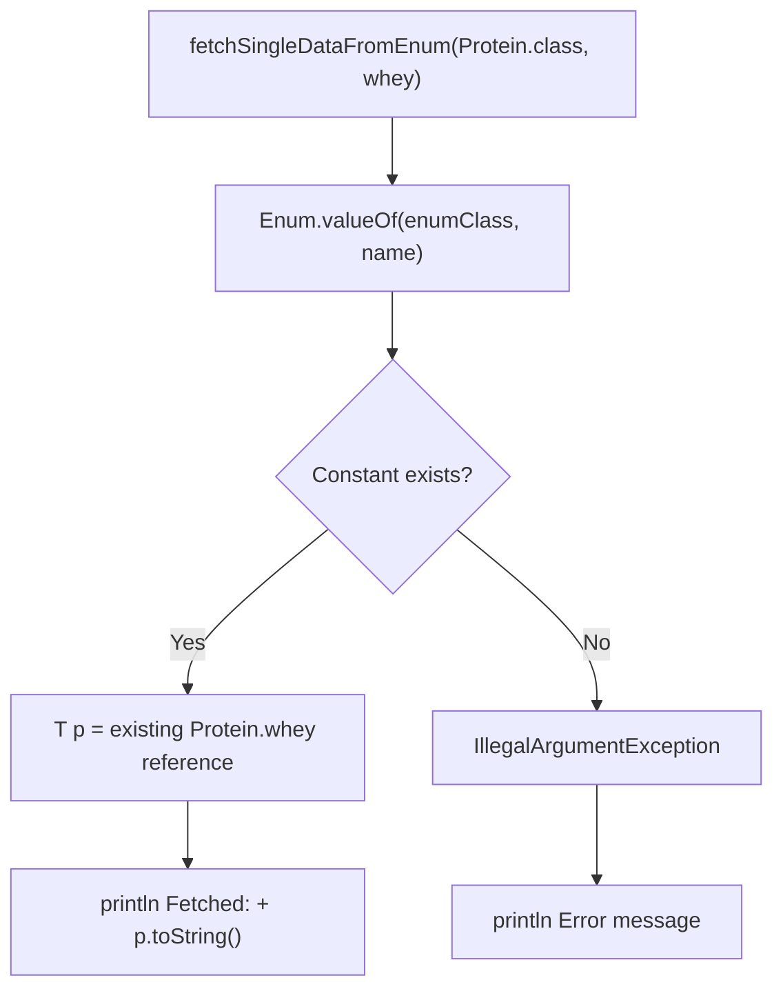
```mermaid
flowchart TD
  START["fetchSingleDataFromEnum(Protein.class, whey)"] --> VOF["Enum.valueOf(enumClass, name)"]
  VOF --> OK{"Constant exists?"}
  OK -- Yes --> REF["T p = existing Protein.whey reference"]
  REF --> OUT["println Fetched: + p.toString()"]
  OK -- No --> EX["IllegalArgumentException"]
  EX --> ERR["println Error message"]
```

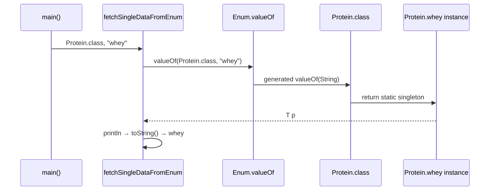
```mermaid
sequenceDiagram
  participant Main as main()
  participant Fetch as fetchSingleDataFromEnum
  participant EV as Enum.valueOf
  participant PC as Protein.class
  participant Inst as Protein.whey instance
  Main->>Fetch: Protein.class, "whey"
  Fetch->>EV: valueOf(Protein.class, "whey")
  EV->>PC: generated valueOf(String)
  PC->>Inst: return static singleton
  Inst-->>Fetch: T p
  Fetch->>Fetch: println → toString() → whey
```

### `iterateAllInEnums` vs `fetchSingleDataFromEnum`

|              | `iterateAllInEnums`      | `fetchSingleDataFromEnum`       |
| ------------ | ------------------------ | ------------------------------- |
| **API**      | `getEnumConstants()`     | `Enum.valueOf(class, name)`     |
| **Input**    | `Class<T>` only          | `Class<T>` + constant name      |
| **Output**   | All constants in order   | One constant or error           |
| **Use case** | Menus, listings, reports | Config keys, parsing user input |

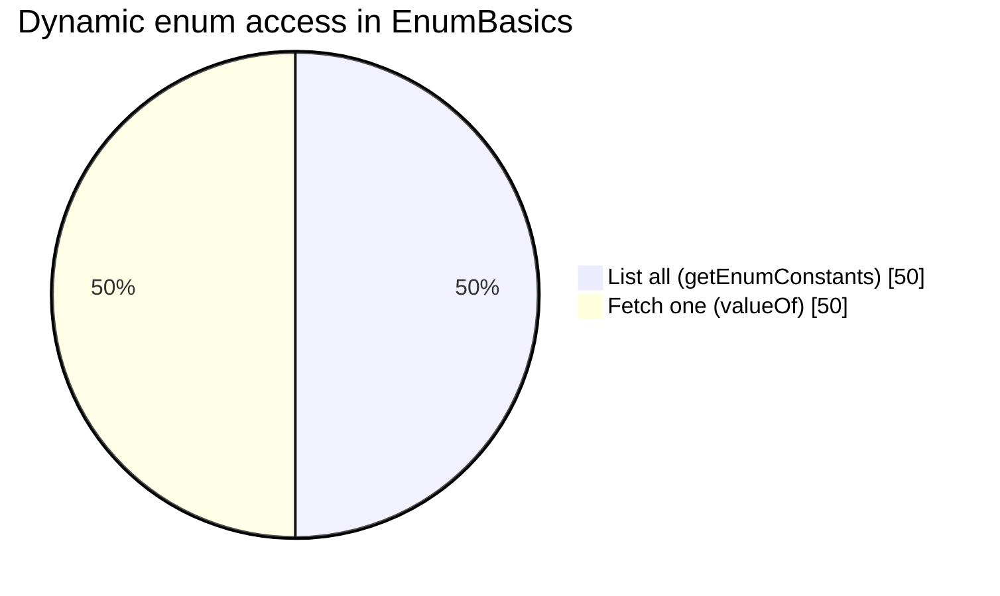
```mermaid
pie showData
    title Dynamic enum access in EnumBasics
    "List all (getEnumConstants)" : 50
    "Fetch one (valueOf)" : 50
```

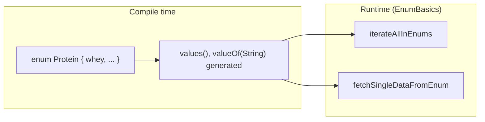
```mermaid
flowchart LR
  subgraph compile ["Compile time"]
    E1["enum Protein { whey, ... }"]
    E2["values(), valueOf(String) generated"]
  end
  subgraph runtime ["Runtime (EnumBasics)"]
    I["iterateAllInEnums"]
    F["fetchSingleDataFromEnum"]
  end
  E1 --> E2
  E2 --> I
  E2 --> F
```

---

## Compilation flow

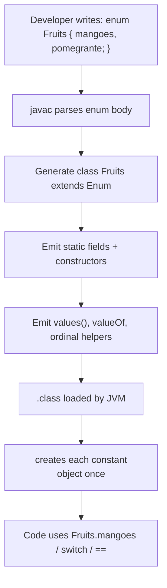
```mermaid
flowchart TD
  A["Developer writes: enum Fruits { mangoes, pomegrante; }"]
  B["javac parses enum body"]
  C["Generate class Fruits extends Enum"]
  D["Emit static fields + constructors"]
  E["Emit values(), valueOf, ordinal helpers"]
  F[".class loaded by JVM"]
  G["<clinit> creates each constant object once"]
  H["Code uses Fruits.mangoes / switch / == "]
  A --> B --> C --> D --> E --> F --> G --> H
```

| Phase          | What happens                                                            |
| -------------- | ----------------------------------------------------------------------- |
| **Compile**    | `enum` keyword removed; replaced by `class` + `Enum` subclass machinery |
| **Class load** | JVM runs static initializer: allocates each constant                    |
| **Use**        | References are stable singletons; no `new Fruits()` allowed in source   |

---

## Enum constructor (`enumConstructor`)

Program: [`enumConstructor.java`](../../../demo/src/main/java/com/enumeration/enumConstructor.java).

You assign **only** `pulses.rajma`, but the constructor body runs **four** times before `main` prints `End of main method`. That is expected: the JVM builds **every** enum constant when the enum class is first initialized.

### Demo program

```java
enum pulses {
    rajma, urad, moong, chana;

    pulses() {
        System.out.println("A pulse has been created.");
    }
}

public class enumConstructor {
    public static void main(String[] args) {
        pulses pl = pulses.rajma;
        System.out.println("End of main method");
    }
}
```

### Observed output

```text
A pulse has been created.
A pulse has been created.
A pulse has been created.
A pulse has been created.
End of main method
```

| Line | When it runs | Why |
| ---- | ------------ | --- |
| 1–4 | During **`pulses` class initialization** | One `println` per constant as each static instance is constructed |
| 5 | Inside **`main`** | Runs only after `pulses` is fully initialized |

### Point-by-point — why four constructor calls?

| # | Concept | Detail |
| - | ------- | ------ |
| 1 | **Constants are objects** | Each of `rajma`, `urad`, `moong`, `chana` is a **distinct object** on the heap (see [Rules of enum constants](#rules-of-enum-constants)). |
| 2 | **Static fields are created together** | The compiler emits `public static final pulses rajma = new pulses(...);` (and the same for every constant). All of these run inside the enum’s **static initializer** when the class is first used. |
| 3 | **First touch loads the whole enum** | Reading `pulses.rajma` in `main` forces the JVM to **initialize class `pulses`**. Initialization **must** create **all** constants—not only `rajma`. |
| 4 | **Constructor per constant** | Your `pulses() { ... }` is invoked **once per** `new pulses(...)` the compiler generated. Four constants ⇒ **four** constructor calls. |
| 5 | **Order** | Constants are created in **declaration order** (`rajma` → `urad` → `moong` → `chana`). |
| 6 | **No lazy per-use ctor** | Java does **not** construct `urad` only when you first reference `urad`. The set of constants is fixed at class-init time. |
| 7 | **`pl` is a reference** | `pulses pl = pulses.rajma` copies the **existing** reference; it does **not** run the constructor again. |

### Compiler-generated shape (conceptual)

```java
final class pulses extends Enum<pulses> {
    public static final pulses rajma = new pulses("rajma", 0);
    public static final pulses urad   = new pulses("urad", 1);
    public static final pulses moong  = new pulses("moong", 2);
    public static final pulses chana  = new pulses("chana", 3);

    private static final pulses[] $VALUES = { rajma, urad, moong, chana };

    private pulses(String name, int ordinal) {
        super(name, ordinal);
        System.out.println("A pulse has been created.");  // your constructor body
    }
    // values(), valueOf(String), ...
}
```

Each `new pulses(...)` runs your constructor body once → four lines of output.

### Class initialization timeline

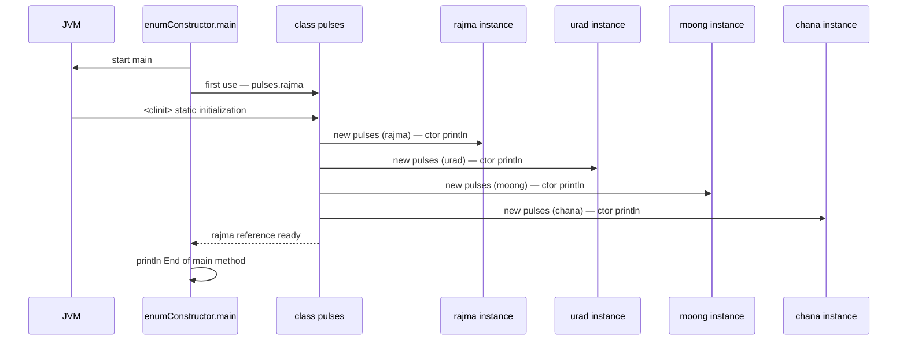
```mermaid
sequenceDiagram
  participant JVM
  participant Main as enumConstructor.main
  participant Pulses as class pulses
  participant R as rajma instance
  participant U as urad instance
  participant M as moong instance
  participant C as chana instance
  Main->>JVM: start main
  Main->>Pulses: first use — pulses.rajma
  JVM->>Pulses: <clinit> static initialization
  Pulses->>R: new pulses (rajma) — ctor println
  Pulses->>U: new pulses (urad) — ctor println
  Pulses->>M: new pulses (moong) — ctor println
  Pulses->>C: new pulses (chana) — ctor println
  Pulses-->>Main: rajma reference ready
  Main->>Main: println End of main method
```

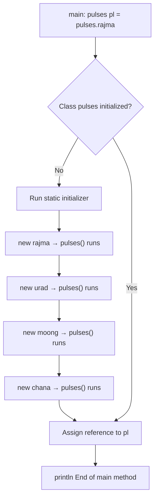
```mermaid
flowchart TD
  A["main: pulses pl = pulses.rajma"] --> B{"Class pulses initialized?"}
  B -- No --> C["Run static initializer"]
  C --> D["new rajma → pulses() runs"]
  D --> E["new urad → pulses() runs"]
  E --> F["new moong → pulses() runs"]
  F --> G["new chana → pulses() runs"]
  G --> H["Assign reference to pl"]
  B -- Yes --> H
  H --> I["println End of main method"]
```

### Flow diagrams and pie charts

**Where work happens for this program (one run):**

```mermaid
pie showData
    title Constructor executions at class-init
    "rajma" : 25
    "urad" : 25
    "moong" : 25
    "chana" : 25
```

```mermaid
pie showData
    title JVM time in main (conceptual)
    "pulses class initialization (4 ctors)" : 80
    "main body (assign + println)" : 20
```

**Reference vs construction:**

```mermaid
flowchart LR
  subgraph init ["Once per class load"]
    N1["new rajma"]
    N2["new urad"]
    N3["new moong"]
    N4["new chana"]
  end
  subgraph main ["main()"]
    REF["pl → rajma"]
    OUT["End of main method"]
  end
  N1 --> REF
  REF --> OUT
```

**Myth vs fact:**

| Myth | Fact |
| ---- | ---- |
| “I only used `rajma`, so only one ctor runs.” | First use of **any** constant initializes **all** constants. |
| “`pl = pulses.rajma` creates a new pulse.” | It reuses the **singleton** created at class-init. |
| “Enums are like `int` constants.” | They are **objects** with optional instance constructors. |

**Run:**

```bash
cd demo/src/main/java
javac com/enumeration/enumConstructor.java
java com.enumeration.enumConstructor
```

---

## Classroom slide (Beer → Fruits)

The same architecture shown in class for **`enum Beer { KF, RC; }`** applies directly to **`Fruits`**: each enum constant becomes **`public static final`** and **`new EnumType()`**.


| Slide (`Beer`)                                   | This guide (`Fruits`)                               |
| ------------------------------------------------ | --------------------------------------------------- |
| `KF`                                             | `mangoes`                                           |
| `RC`                                             | `pomegrante`                                        |
| `enum` → `class Beer`                            | `enum` → `class Fruits extends Enum<Fruits>`        |
| Arrows: constant → `static final` + `new Beer()` | Same: constant → `static final` + `new Fruits(...)` |

---

## Run the demo

**Fruits (static references):**

```bash
cd demo/src/main/java
javac com/advanced/enumeration/Fruits.java
java com.advanced.enumeration.Fruits
```

**EnumBasics (generic iteration + `valueOf`):**

```bash
javac com/enumeration/enumBasics.java
java com.enumeration.enumBasics
```

**Enum constructor (four ctor calls, one reference):**

```bash
javac com/enumeration/enumConstructor.java
java com.enumeration.enumConstructor
```

Example (`Fruits`):

```text
mangoes
pomegrante
true
class com.advanced.enumeration.Fruits
```

Example (`EnumBasics` — excerpt):

```text
--- Iterating Protein ---
whey
casein
...
--- Fetching Single Constants ---
Fetched: whey
Fetched: fruits
```

The last line of `Fruits` output shows runtime type is the enum class itself, not a separate “wrapper” type.

Every enum constant is always public static final and hence we can access enum constant by using enum name 

1. enum should be inside or outside of class but enum shouldnt be created inside a method (because static values not allowed in method)
if we are trying to decalre inside a method we will get compile time errror sayign "Enum tyupes must not be local"
2. If we declare enum outside of the class the applicable modifiers are public, default, strictfp
3. If we declare enum inside the class the applicable modifiers are public , default, strictfp,private,public and static.

# enum vs switch

1. until 1.4 version the allowed argument types for the switch statement are byte, short , char, int but from 1.5 version onwards corresponding 
wrapper classes and enum types are allowed 
2. from 1.7 version onwards Strign type also allowed
3. If we pass enum type as argument to switch statement then every case label should be valid enum constant otherwise we will get compile time   error

# enum vs Inheritance

1. Every enum is always direct child class of java.lang.enum and hence our enum can't extends any other enum ( because jave won't support for multiple inheritance)  
2. Every enum is always final implicitly and hence for enum we can't create child enum
3. because of above reasons we can conclude inheritance concept not applicable for enum explicitly and we can't use extends keyword for enum

The classroom whiteboard below expands each rule with **invalid code examples**, **compiler errors**, and **flow diagrams**.

### Whiteboard — four forbidden `extends` patterns

| #   | What you might write                      | Allowed? | Why (links to points 1–3 above)                                                                    |
| --- | ----------------------------------------- | -------- | -------------------------------------------------------------------------------------------------- |
| 1   | `enum X { }` then `enum Y extends X { }`  | **No**   | Enum is already a child of `java.lang.Enum` — no second parent enum (**point 1**).                 |
| 2   | `enum X extends java.lang.Enum { }`       | **No**   | `extends java.lang.Enum` is **implicit**; Java has no multiple inheritance (**point 1**).          |
| 3   | `class X { }` then `enum Y extends X { }` | **No**   | Enum may only extend `java.lang.Enum`, not an ordinary class (**point 3** — no `extends` on enum). |
| 4   | `enum X { }` then `class Y extends X { }` | **No**   | Enum is **`final`** — no child class or child enum (**point 2**).                                  |

**Point-by-point (same slide, reading left to right):**

1. **Enum → enum:** `enum Y extends X` does not compile. Constants belong to one closed enum type; there is no “sub-enum.”
2. **Enum → `java.lang.Enum` (explicit):** The compiler generates `final class X extends Enum<X>`. You cannot write `extends java.lang.Enum` yourself.
3. **Enum → ordinary class:** `enum Y extends X` fails even when `X` is a simple class — enums are not general subclasses.
4. **Class → enum:** `class Y extends X` when `X` is an enum fails with **cannot inherit from final `X`** and **enum types are not extensible**.

### Compilation errors when a class extends an enum

```java
enum X { }

class Y extends X { }  // compilation error
```

| Error                                    | Meaning                                               |
| ---------------------------------------- | ----------------------------------------------------- |
| **CE1:** `cannot inherit from final X`   | Desugared enum type is **`final`** (see **point 2**). |
| **CE2:** `enum types are not extensible` | Language rule: no type may subclass an enum.          |

### Flow diagrams

**Can this declaration use `extends`?**

```mermaid
flowchart TD
  START["Declaration uses extends"] --> KIND{"What is being declared?"}
  KIND -->|enum| ETARGET{"extends target?"}
  KIND -->|class| CTARGET{"extends target?"}
  ETARGET -->|another enum| BAD1["Compile error — point 1"]
  ETARGET -->|java.lang.Enum| BAD2["Compile error — already implicit"]
  ETARGET -->|ordinary class| BAD3["Compile error — point 3"]
  ETARGET -->|none| OK1["Valid enum"]
  CTARGET -->|enum type| BAD4["CE: final / not extensible — point 2"]
  CTARGET -->|class or Object| OK2["Valid class"]
```

**What the compiler does for every enum (implicit superclass):**

```mermaid
flowchart LR
  SRC["enum Fruits { mangoes, pomegrante; }"] --> COMP["javac desugaring"]
  COMP --> CLS["final class Fruits extends Enum of Fruits"]
  CLS --> CONST["static final Fruits mangoes, pomegrante"]
```

**Four patterns from the whiteboard:**

```mermaid
flowchart TB
  subgraph p1 ["1 — enum extends enum"]
    A1["enum X"] --> A2["enum Y extends X"]
    A2 --> X1["Not allowed"]
  end
  subgraph p2 ["2 — enum extends Enum"]
    B1["enum X extends java.lang.Enum"] --> X2["Not allowed"]
  end
  subgraph p3 ["3 — enum extends class"]
    C1["class X"] --> C2["enum Y extends X"]
    C2 --> X3["Not allowed"]
  end
  subgraph p4 ["4 — class extends enum"]
    D1["enum X"] --> D2["class Y extends X"]
    D2 --> X4["Not allowed — final / not extensible"]
  end
```

```mermaid
sequenceDiagram
  participant Dev as Developer
  participant Comp as javac
  participant Enum as enum X
  Dev->>Comp: class Y extends X
  Comp->>Enum: check superclass
  Enum-->>Comp: final, not extensible
  Comp-->>Dev: compilation failed
```

### Classroom slide (inheritance restrictions)

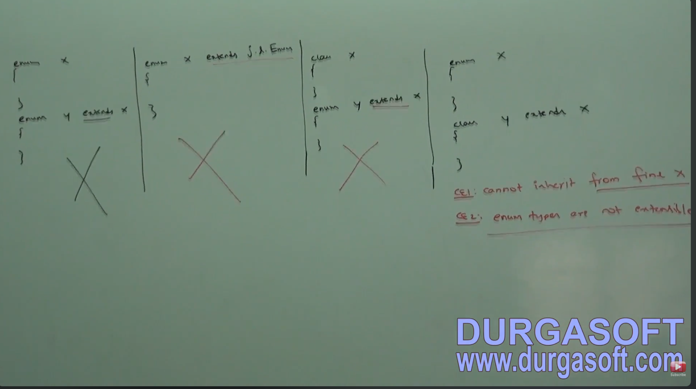

**Takeaway:** Prefer **composition** (fields, methods, interfaces) for extra behavior around enums—not subclassing. For `switch` on enums, see [enum vs switch](#enum-vs-switch) and [Switch with Enums](./switch.md).

1. Every enum in java is direct child class of java.lang.Enum and hence this class acts as base class for all java enums 
2. It is an abstract class and it is the dierect child class of object 
3. It implements serializable and comparable interfaces

# values() 

1. Every enum implicitly contaiusn values() to list out all values present inside enum 
2. value() is not present in java.lang.ENUM and Object classes enum keyword implicitly provides this method 
3. Inside enum order of constants is important and we can represent this order by using ordinal value 
4. We can find ordinal value of enum constant by using ordinal method 
   
In old languages enum we can take only constants but in java enum in addition to constants we can take methods, constructors , normal variables 
etc. Hence java enum is more powerful than old languages enum 

Even inside java enum we can declare main method and we can run enum class directly from command prompt 

NOTE: 
In addition to constants if we are taking any extra member like a method then list of constants should be in the first line and should ends with 
semicolon.

# enum and constrcutors

An enum can contain constructor enum constructor will be executed separately for every enum constant at the time of enum class loading 
automatically
