# Java Enumeration (`enum`)

> Guide: named constants, **`Fruits`** internal architecture, compile-time desugaring, and heap layout.  
> Demo: [`Fruits.java`](../../../demo/src/main/java/com/advanced/enumeration/Fruits.java)

> **Navigation:** Use **Ctrl+click** on Guide map / TOC links to jump to a section in preview.

## Guide map

| Jump to | Topic |
| ------- | ----- |
| [Introduction](#introduction) | Why `enum` |
| [Rules of enum constants](#rules-of-enum-constants) | `public static final` objects |
| [Fruits example (source)](#fruits-example-source) | Your enum in source |
| [Internal architecture of `Fruits`](#internal-architecture-of-fruits) | Class desugaring + memory |
| [Printing enums and `toString()`](#printing-enums-and-tostring) | `println` → `toString()` flow |
| [Compilation flow](#compilation-flow) | Source → bytecode |
| [Classroom slide (Beer → Fruits)](#classroom-slide-beer--fruits) | Whiteboard reference |

---

<!-- TOC -->
- [Java Enumeration (`enum`)](#java-enumeration-enum)
  - [Guide map](#guide-map)
  - [Introduction](#introduction)
  - [Rules of enum constants](#rules-of-enum-constants)
  - [Fruits example (source)](#fruits-example-source)
  - [Internal architecture of `Fruits`](#internal-architecture-of-fruits)
  - [Printing enums and `toString()`](#printing-enums-and-tostring)
  - [Compilation flow](#compilation-flow)
  - [Classroom slide (Beer → Fruits)](#classroom-slide-beer--fruits)
  - [Run the demo](#run-the-demo)
<!-- /TOC -->

---

## Introduction

If we want to represent a group of named constants then we should go for enum

Example:

enum Month
{
    Jan,Feb...Dec;
}

enum temples
{
    Kaashi,tirupathi...Kanchi;
}

The main objective of enum is to define our own datatypes(enumerated datatypes)

Enum concept introduced in 1.5 version when compared with old languages enum java enum is more powerful

---

## Rules of enum constants

1. Every enum is internally implemented by using class concept
2. Every enum constant is always public static final
3. every enum constant represents an object of the type enum

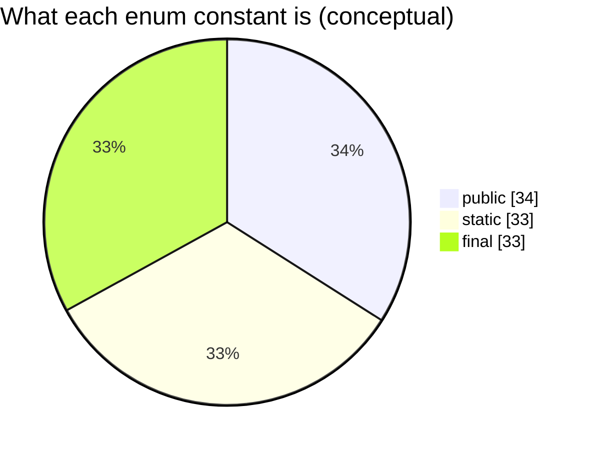

---

## Fruits example (source)

```java
enum Fruits {
    mangoes, pomegrante;
}
```

Runnable copy (package `com.advanced.enumeration`): [`Fruits.java`](../../../demo/src/main/java/com/advanced/enumeration/Fruits.java).

| Constant | Role at runtime |
| -------- | ---------------- |
| `mangoes` | Single `Fruits` instance (singleton within the enum) |
| `pomegrante` | Another distinct `Fruits` instance |

---

## Internal architecture of `Fruits`

The compiler **does not** leave `enum` as a special keyword in the `.class` file. It **desugars** your `enum Fruits { ... }` into a **`final class Fruits`** that **extends `java.lang.Enum<Fruits>`**, with one **static final field** and **one heap object** per constant.

### Source vs compiler-generated shape (Fruits)

**What you write:**

```java
enum Fruits {
    mangoes, pomegrante;
}
```

**Conceptual equivalent (simplified — real bytecode also adds `values()`, `valueOf(String)`, etc.):**

```java
final class Fruits extends Enum<Fruits> {
    public static final Fruits mangoes = new Fruits("mangoes", 0);
    public static final Fruits pomegrante = new Fruits("pomegrante", 1);

    private Fruits(String name, int ordinal) {
        super(name, ordinal);
    }
}
```

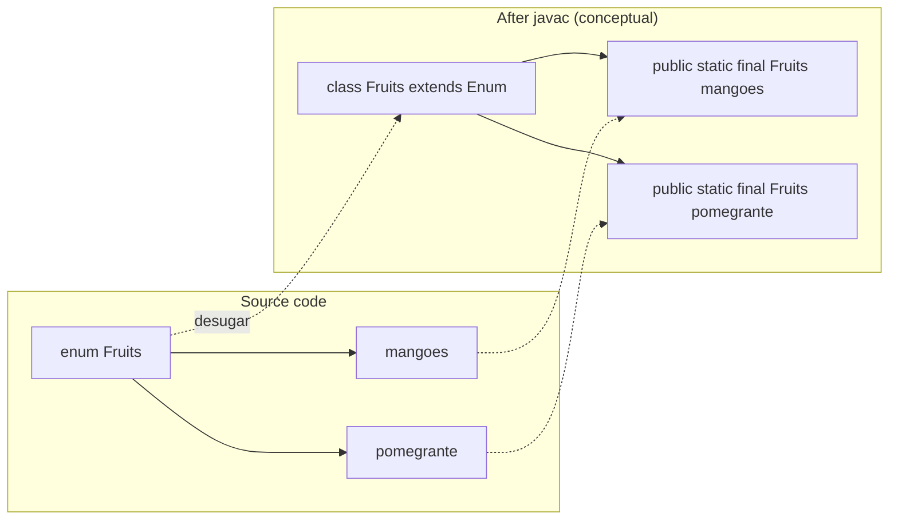

### Memory layout (heap + static area)

Each constant is **`new Fruits(...)` once** when the enum class is initialized. References `Fruits.mangoes` and `Fruits.pomegrante` point to those two objects forever (same references for the life of the class loader).

```text
Method area / static storage              Heap
┌─────────────────────────────┐          ┌──────────────────┐
│ Fruits.mangoes    ───────────┼────────►│ Fruits instance  │  ordinal=0, name="mangoes"
└─────────────────────────────┘          └──────────────────┘
┌─────────────────────────────┐          ┌──────────────────┐
│ Fruits.pomegrante ───────────┼────────►│ Fruits instance  │  ordinal=1, name="pomegrante"
└─────────────────────────────┘          └──────────────────┘
```

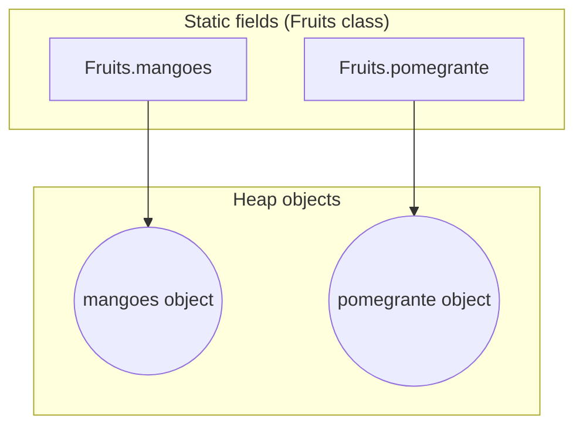

### Identity and comparison

- **`Fruits.mangoes == Fruits.mangoes`** is always `true` (same reference).
- **`==` between two enum constants of the same type** is safe and preferred; `equals()` delegates to identity for enums.
- **`ordinal()`** returns declaration order: `mangoes` → `0`, `pomegrante` → `1`.

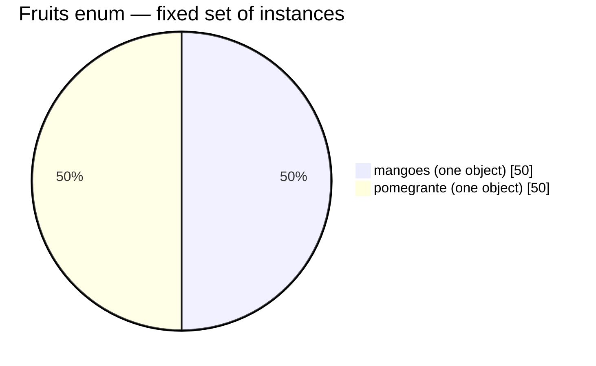

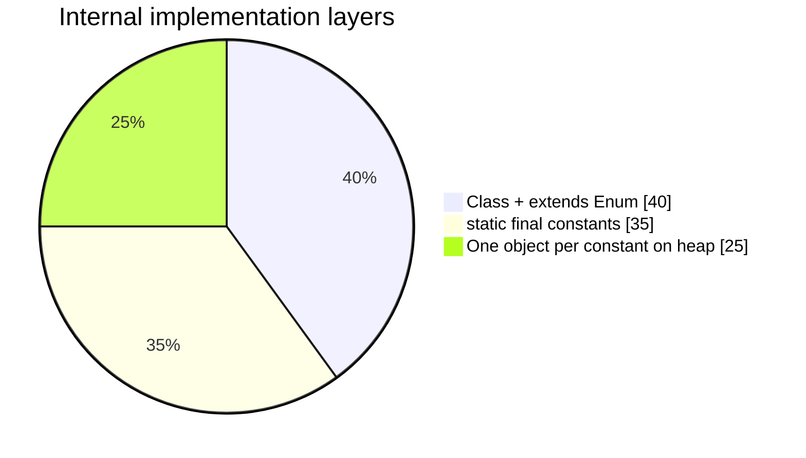

---

## Printing enums and `toString()`

When you pass an enum **reference** to `System.out.println(...)`, you do **not** print the memory address. The JVM converts the object to text by calling **`toString()`** on that reference.

### Demo code

From [`Fruits.java`](../../../demo/src/main/java/com/advanced/enumeration/Fruits.java):

```java
System.out.println(Fruits.mangoes);
System.out.println(Fruits.pomegrante);
```

**Console:**

```text
mangoes
pomegrante
```

The output is the **constant name**, not `Fruits@hashcode`.

### End-to-end flow (`println` on an enum reference)

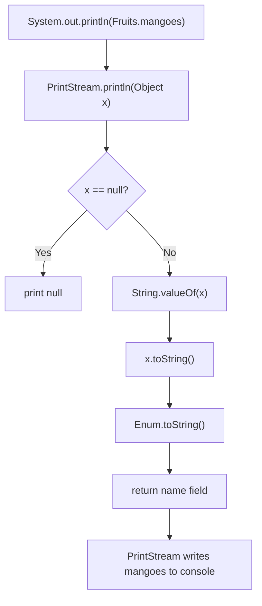

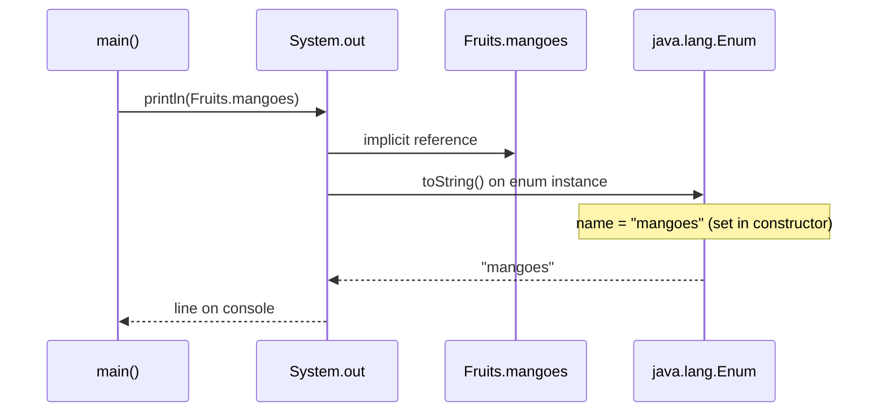

### What `Enum.toString()` does internally

For every enum constant, the compiler passes the **identifier string** into the `Enum` superclass constructor:

```java
// conceptual — inside generated Fruits constructor for mangoes
super("mangoes", 0);  // name + ordinal
```

`java.lang.Enum` stores that `name` and **`toString()` returns it** (unless you override `toString()` in `Fruits`).

| Call | Method actually used | Typical result |
| ---- | -------------------- | -------------- |
| `System.out.println(Fruits.mangoes)` | `Enum.toString()` → `"mangoes"` | Constant name |
| `Fruits.mangoes.name()` | `Enum.name()` | Same string, official API |
| `String.valueOf(Fruits.mangoes)` | delegates to `toString()` | `"mangoes"` |
| Concat: `"Pick " + Fruits.mangoes` | `StringBuilder.append(Object)` → `toString()` | `"Pick mangoes"` |

`Object.toString()` would look like `Fruits@1a2b3c4d`; enums **override** that so logs and UI show readable names.

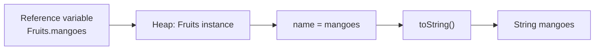

### Pie charts — printing path

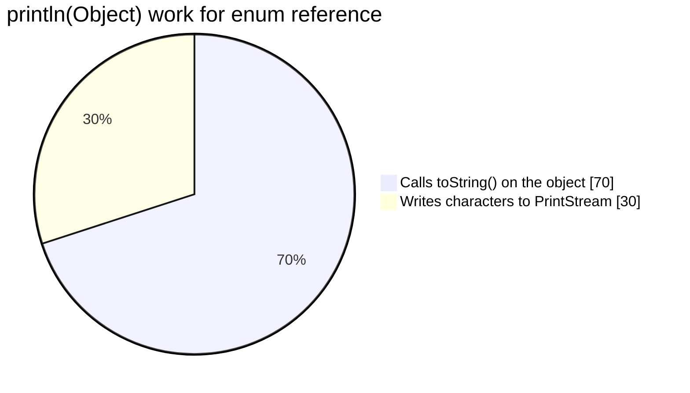

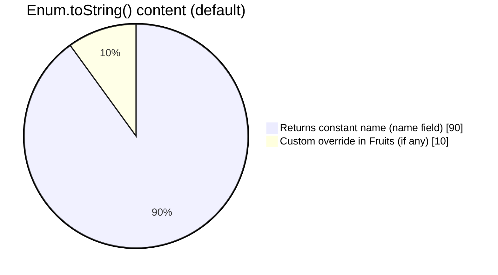

### Reference variable vs printed text

```text
Static field Fruits.mangoes  ──points to──►  [ Fruits object | name="mangoes" | ordinal=0 ]
                                                      │
                                           println ───┘
                                                      ▼
                                              toString() → "mangoes"
```

---

## Compilation flow

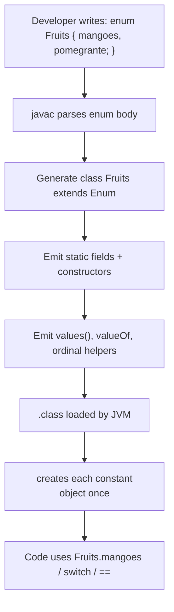

| Phase | What happens |
| ----- | ------------ |
| **Compile** | `enum` keyword removed; replaced by `class` + `Enum` subclass machinery |
| **Class load** | JVM runs static initializer: allocates each constant |
| **Use** | References are stable singletons; no `new Fruits()` allowed in source |

---

## Classroom slide (Beer → Fruits)

The same architecture shown in class for **`enum Beer { KF, RC; }`** applies directly to **`Fruits`**: each enum constant becomes **`public static final`** and **`new EnumType()`**.


| Slide (`Beer`) | This guide (`Fruits`) |
| -------------- | --------------------- |
| `KF` | `mangoes` |
| `RC` | `pomegrante` |
| `enum` → `class Beer` | `enum` → `class Fruits extends Enum<Fruits>` |
| Arrows: constant → `static final` + `new Beer()` | Same: constant → `static final` + `new Fruits(...)` |

---

## Run the demo

```bash
cd demo/src/main/java
javac com/advanced/enumeration/Fruits.java
java com.advanced.enumeration.Fruits
```

Example output:

```text
mangoes
pomegrante
true
class com.advanced.enumeration.Fruits
```

The last line shows runtime type is the enum class itself, not a separate “wrapper” type.
