# Java Enumeration (`enum`)

> Guide: named constants, **`Fruits`** architecture, reflection-style iteration, and **`Enum.valueOf`**.  
> Demos: [`Fruits.java`](../../../demo/src/main/java/com/advanced/enumeration/Fruits.java) · [`enumBasics.java`](../../../demo/src/main/java/com/enumeration/enumBasics.java) · [Switch on enums](./switch.md)

> **Navigation:** Use **Ctrl+click** on Guide map / TOC links to jump to a section in preview.

## Guide map

| Jump to                                                                        | Topic                           |
| ------------------------------------------------------------------------------ | ------------------------------- |
| [Introduction](#introduction)                                                  | Why `enum`                      |
| [Rules of enum constants](#rules-of-enum-constants)                            | `public static final` objects   |
| [Fruits example (source)](#fruits-example-source)                              | Your enum in source             |
| [Internal architecture of `Fruits`](#internal-architecture-of-fruits)          | Class desugaring + memory       |
| [Printing enums and `toString()`](#printing-enums-and-tostring)                | `println` → `toString()` flow   |
| [EnumBasics — `iterateAllInEnums`](#enumbasics--iterateallinenums)             | `Class.getEnumConstants()` loop |
| [EnumBasics — `fetchSingleDataFromEnum`](#enumbasics--fetchsingledatafromenum) | `Enum.valueOf` lookup           |
| [Compilation flow](#compilation-flow)                                          | Source → bytecode               |
| [Classroom slide (Beer → Fruits)](#classroom-slide-beer--fruits)               | Whiteboard reference            |

---

<!-- TOC -->
- [Java Enumeration (`enum`)](#java-enumeration-enum)
  - [Guide map](#guide-map)
  - [Introduction](#introduction)
  - [Rules of enum constants](#rules-of-enum-constants)
  - [Fruits example (source)](#fruits-example-source)
  - [Internal architecture of `Fruits`](#internal-architecture-of-fruits)
    - [Source vs compiler-generated shape (Fruits)](#source-vs-compiler-generated-shape-fruits)
    - [Memory layout (heap + static area)](#memory-layout-heap--static-area)
    - [Identity and comparison](#identity-and-comparison)
  - [Printing enums and `toString()`](#printing-enums-and-tostring)
    - [Demo code](#demo-code)
    - [End-to-end flow (`println` on an enum reference)](#end-to-end-flow-println-on-an-enum-reference)
    - [What `Enum.toString()` does internally](#what-enumtostring-does-internally)
    - [Pie charts — printing path](#pie-charts--printing-path)
    - [Reference variable vs printed text](#reference-variable-vs-printed-text)
  - [EnumBasics — `iterateAllInEnums`](#enumbasics--iterateallinenums)
    - [Point-by-point architecture](#point-by-point-architecture)
  - [EnumBasics — `fetchSingleDataFromEnum`](#enumbasics--fetchsingledatafromenum)
    - [Point-by-point architecture](#point-by-point-architecture-1)
    - [`iterateAllInEnums` vs `fetchSingleDataFromEnum`](#iterateallinenums-vs-fetchsingledatafromenum)
  - [Compilation flow](#compilation-flow)
  - [Classroom slide (Beer → Fruits)](#classroom-slide-beer--fruits)
  - [Run the demo](#run-the-demo)
- [enum vs switch](#enum-vs-switch)
<!-- /TOC -->

---

## Introduction

If we want to represent a group of named constants then we should go for enum

Example:

enum Month
{
    Jan,Feb...Dec;
}

enum temples
{
    Kaashi,tirupathi...Kanchi;
}

The main objective of enum is to define our own datatypes(enumerated datatypes)

Enum concept introduced in 1.5 version when compared with old languages enum java enum is more powerful

---

## Rules of enum constants

1. Every enum is internally implemented by using class concept
2. Every enum constant is always public static final
3. every enum constant represents an object of the type enum

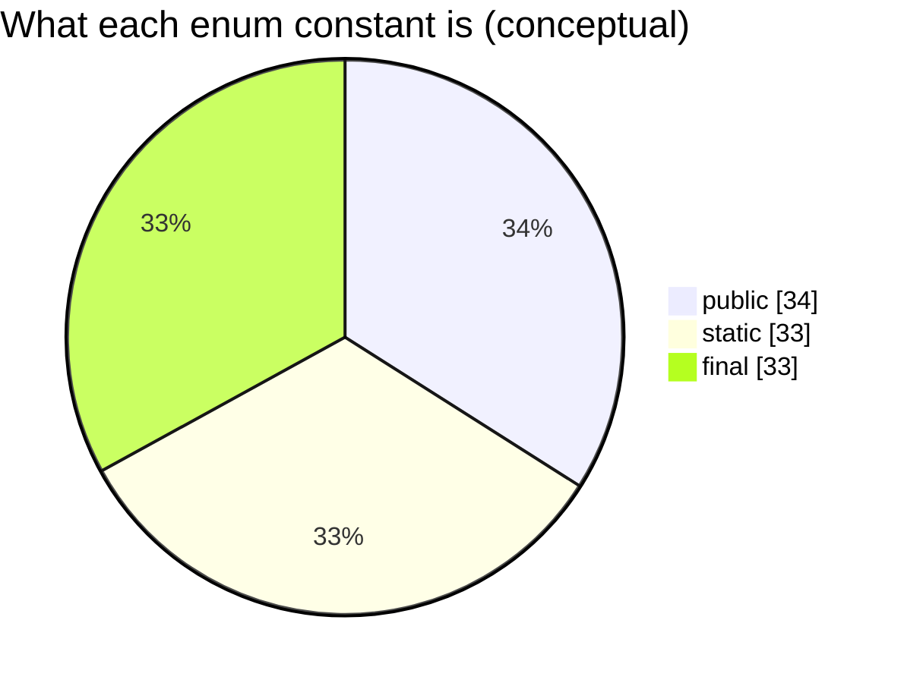

---

## Fruits example (source)

```java
enum Fruits {
    mangoes, pomegrante;
}
```

Runnable copy (package `com.advanced.enumeration`): [`Fruits.java`](../../../demo/src/main/java/com/advanced/enumeration/Fruits.java).

| Constant     | Role at runtime                                      |
| ------------ | ---------------------------------------------------- |
| `mangoes`    | Single `Fruits` instance (singleton within the enum) |
| `pomegrante` | Another distinct `Fruits` instance                   |

---

## Internal architecture of `Fruits`

The compiler **does not** leave `enum` as a special keyword in the `.class` file. It **desugars** your `enum Fruits { ... }` into a **`final class Fruits`** that **extends `java.lang.Enum<Fruits>`**, with one **static final field** and **one heap object** per constant.

### Source vs compiler-generated shape (Fruits)

**What you write:**

```java
enum Fruits {
    mangoes, pomegrante;
}
```

**Conceptual equivalent (simplified — real bytecode also adds `values()`, `valueOf(String)`, etc.):**

```java
final class Fruits extends Enum<Fruits> {
    public static final Fruits mangoes = new Fruits("mangoes", 0);
    public static final Fruits pomegrante = new Fruits("pomegrante", 1);

    private Fruits(String name, int ordinal) {
        super(name, ordinal);
    }
}
```

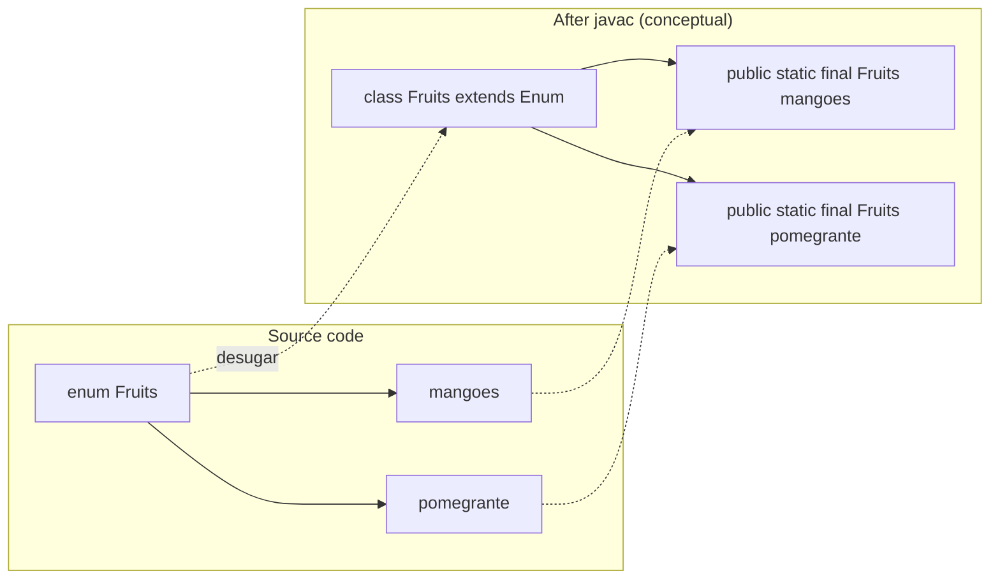

### Memory layout (heap + static area)

Each constant is **`new Fruits(...)` once** when the enum class is initialized. References `Fruits.mangoes` and `Fruits.pomegrante` point to those two objects forever (same references for the life of the class loader).

```text
Method area / static storage              Heap
┌─────────────────────────────┐          ┌──────────────────┐
│ Fruits.mangoes    ───────────┼────────►│ Fruits instance  │  ordinal=0, name="mangoes"
└─────────────────────────────┘          └──────────────────┘
┌─────────────────────────────┐          ┌──────────────────┐
│ Fruits.pomegrante ───────────┼────────►│ Fruits instance  │  ordinal=1, name="pomegrante"
└─────────────────────────────┘          └──────────────────┘
```

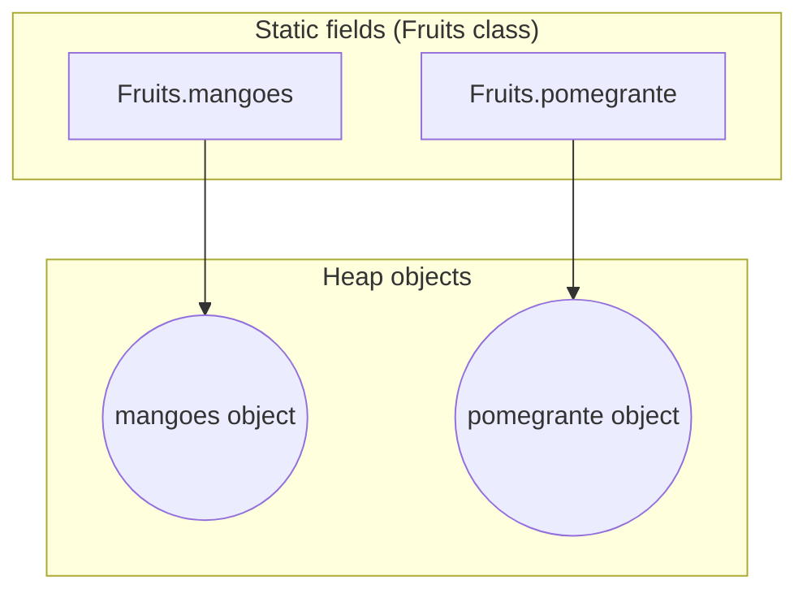

### Identity and comparison

- **`Fruits.mangoes == Fruits.mangoes`** is always `true` (same reference).
- **`==` between two enum constants of the same type** is safe and preferred; `equals()` delegates to identity for enums.
- **`ordinal()`** returns declaration order: `mangoes` → `0`, `pomegrante` → `1`.

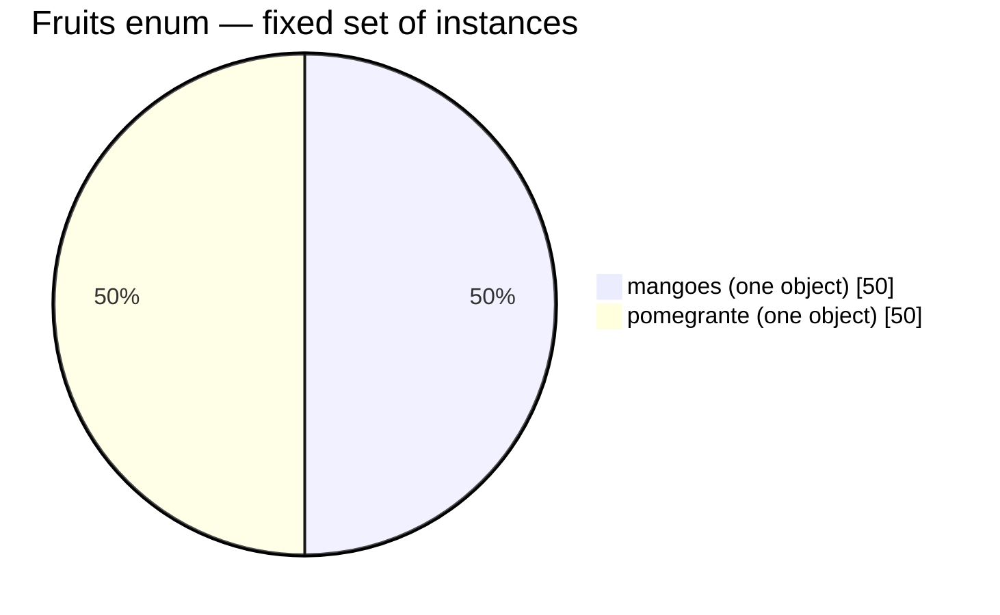

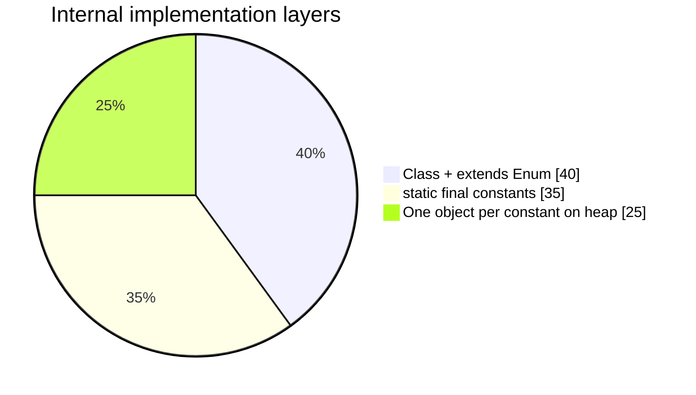

---

## Printing enums and `toString()`

When you pass an enum **reference** to `System.out.println(...)`, you do **not** print the memory address. The JVM converts the object to text by calling **`toString()`** on that reference.

### Demo code

From [`Fruits.java`](../../../demo/src/main/java/com/advanced/enumeration/Fruits.java):

```java
System.out.println(Fruits.mangoes);
System.out.println(Fruits.pomegrante);
```

**Console:**

```text
mangoes
pomegrante
```

The output is the **constant name**, not `Fruits@hashcode`.

### End-to-end flow (`println` on an enum reference)

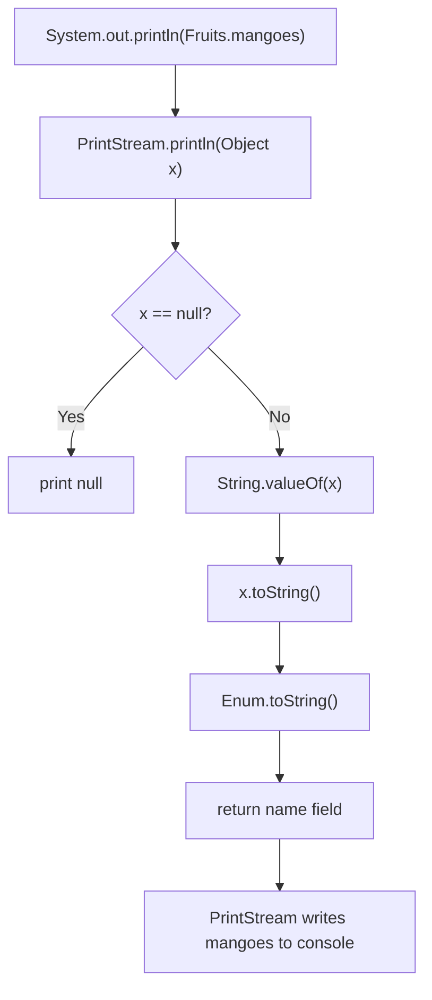

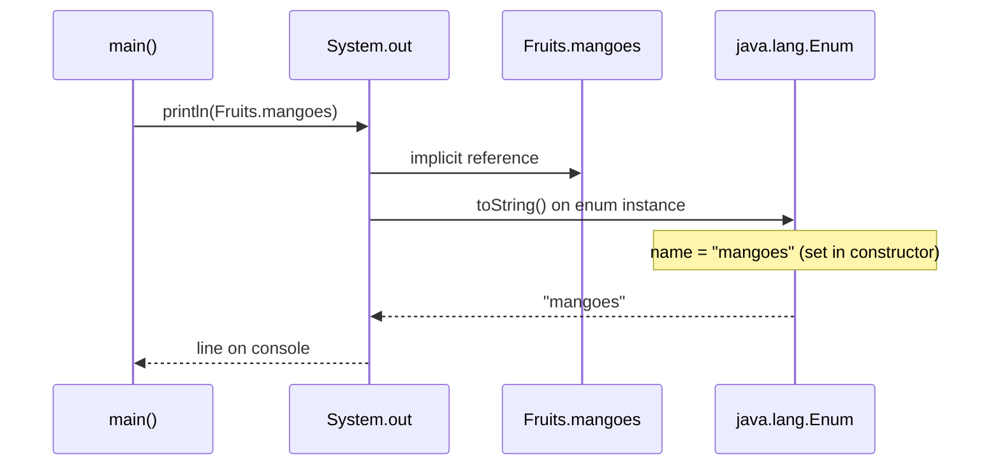

### What `Enum.toString()` does internally

For every enum constant, the compiler passes the **identifier string** into the `Enum` superclass constructor:

```java
// conceptual — inside generated Fruits constructor for mangoes
super("mangoes", 0);  // name + ordinal
```

`java.lang.Enum` stores that `name` and **`toString()` returns it** (unless you override `toString()` in `Fruits`).

| Call                                 | Method actually used                          | Typical result            |
| ------------------------------------ | --------------------------------------------- | ------------------------- |
| `System.out.println(Fruits.mangoes)` | `Enum.toString()` → `"mangoes"`               | Constant name             |
| `Fruits.mangoes.name()`              | `Enum.name()`                                 | Same string, official API |
| `String.valueOf(Fruits.mangoes)`     | delegates to `toString()`                     | `"mangoes"`               |
| Concat: `"Pick " + Fruits.mangoes`   | `StringBuilder.append(Object)` → `toString()` | `"Pick mangoes"`          |

`Object.toString()` would look like `Fruits@1a2b3c4d`; enums **override** that so logs and UI show readable names.


### Pie charts — printing path

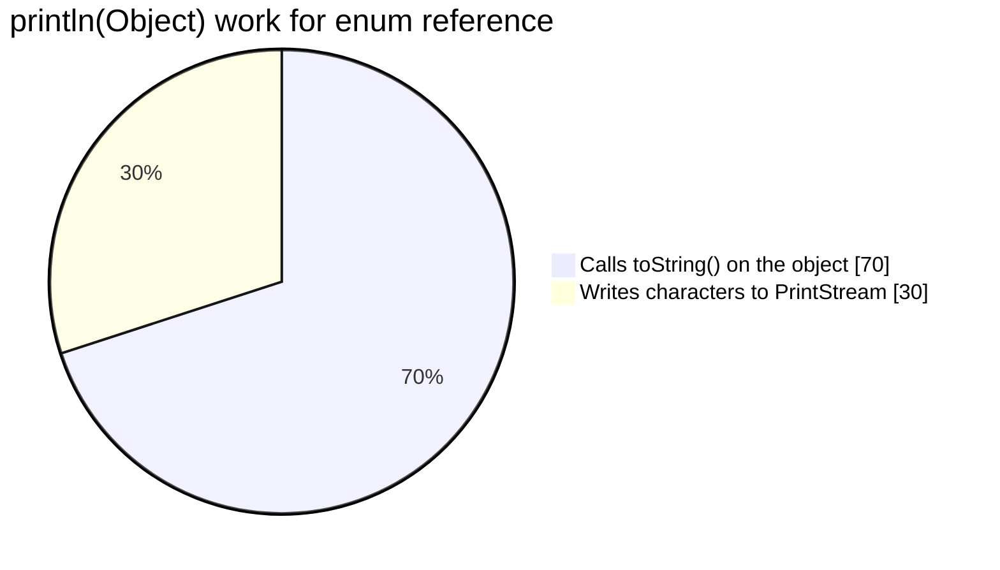

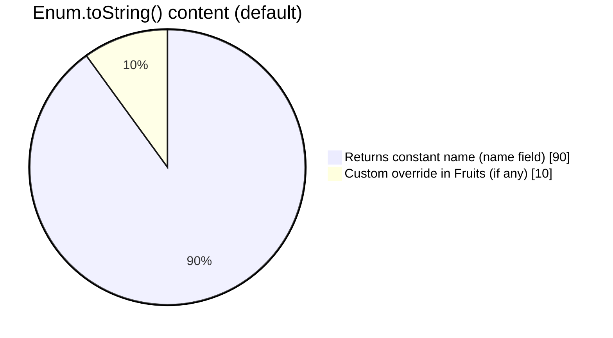

### Reference variable vs printed text

```text
Static field Fruits.mangoes  ──points to──►  [ Fruits object | name="mangoes" | ordinal=0 ]
                                                      │
                                           println ───┘
                                                      ▼
                                              toString() → "mangoes"
```

---

## EnumBasics — `iterateAllInEnums`

Program: [`enumBasics.java`](../../../demo/src/main/java/com/enumeration/enumBasics.java) (`Protein`, nested `food`, and generic helpers).

```java
public static <T extends Enum<T>> void iterateAllInEnums(Class<T> type) {
    System.out.println("--- Iterating " + type.getSimpleName() + " ---");
    for (T p : type.getEnumConstants()) {
        System.out.println(p);
    }
}
```

### Point-by-point architecture

| #   | Line / construct          | What happens internally                                                                                                                            |
| --- | ------------------------- | -------------------------------------------------------------------------------------------------------------------------------------------------- |
| 1   | `<T extends Enum<T>>`     | **Recursive generic bound:** `T` must be an enum type whose superclass is `Enum<T>` (e.g. `Protein`, `food`). Lets one method work for any enum.   |
| 2   | `Class<T> type`           | **Runtime token** for the enum class (e.g. `Protein.class`). JVM uses it to read static metadata compiled into that class.                         |
| 3   | `type.getSimpleName()`    | Reflection: returns short name (`Protein`, `food`) for the header line.                                                                            |
| 4   | `type.getEnumConstants()` | Returns **array of all enum instances** (compiler generated `values()` array, exposed via `Class`). Order = declaration order.                     |
| 5   | `for (T p : ...)`         | Enhanced for-loop over that array; each `p` is a **reference** to an existing singleton object (not `new` per iteration).                          |
| 6   | `System.out.println(p)`   | `println(Object)` → **`p.toString()`** → constant name (`whey`, `fruits`, …). See [Printing enums and `toString()`](#printing-enums-and-tostring). |

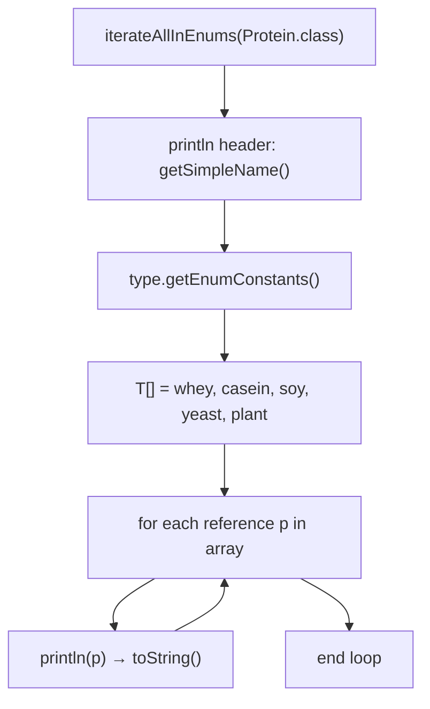

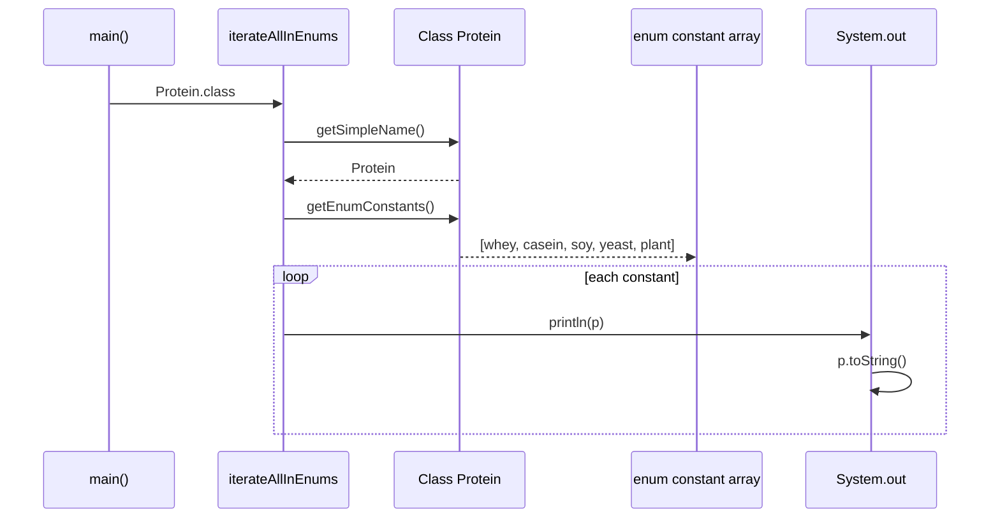

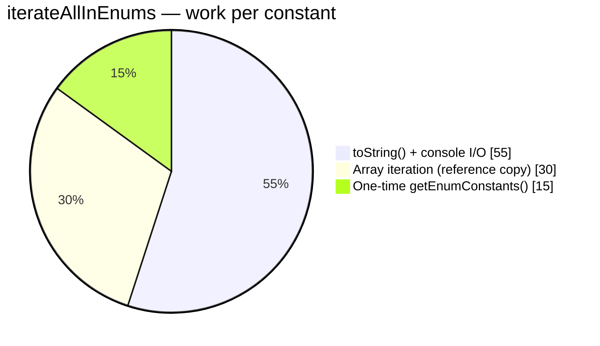

**Call from `main`:** `iterateAllInEnums(Protein.class);` then `iterateAllInEnums(food.class);` — same method, different `Class<T>` → different constant sets.

---

## EnumBasics — `fetchSingleDataFromEnum`

```java
public static <T extends Enum<T>> void fetchSingleDataFromEnum(Class<T> enumClass, String name) {
    try {
        T p = Enum.valueOf(enumClass, name);
        System.out.println("Fetched: " + p);
    } catch (IllegalArgumentException e) {
        System.out.println("Error: " + name + " is not a constant in " + enumClass.getSimpleName());
    }
}
```

### Point-by-point architecture

| #   | Line / construct                   | What happens internally                                                                                                                                     |
| --- | ---------------------------------- | ----------------------------------------------------------------------------------------------------------------------------------------------------------- |
| 1   | `Class<T> enumClass`               | Which enum type to search (`Protein.class`, `food.class`, …).                                                                                               |
| 2   | `String name`                      | Exact constant **identifier** as text (`"whey"`, `"fruits"`). Case-sensitive.                                                                               |
| 3   | `Enum.valueOf(enumClass, name)`    | Delegates to compiler-generated **`enumClass.valueOf(name)`**, which maps name → **existing static instance** (lookup in internal map / switch, not `new`). |
| 4   | `T p`                              | Reference to the singleton constant on the heap.                                                                                                            |
| 5   | `println("Fetched: " + p)`         | String concat calls **`p.toString()`** → prints `Fetched: whey`.                                                                                            |
| 6   | `catch (IllegalArgumentException)` | Thrown when `name` is not a declared constant (e.g. typo or wrong enum class).                                                                              |

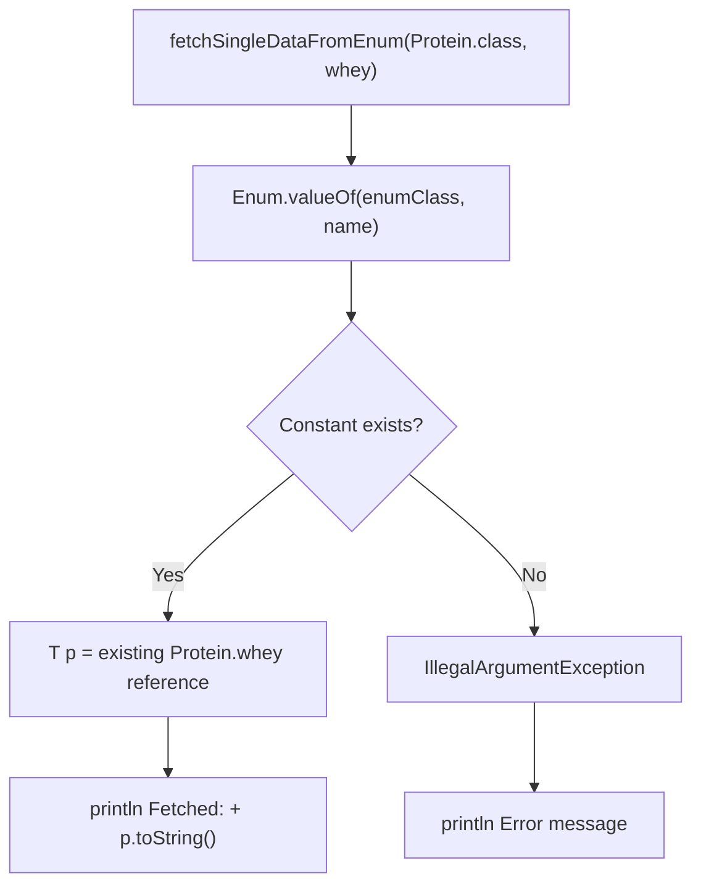

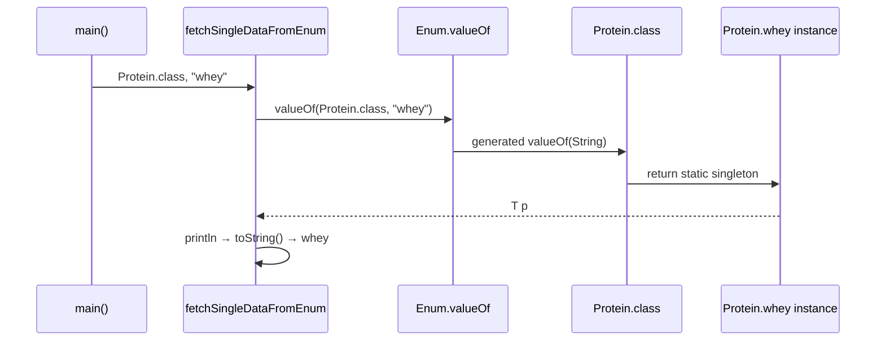

### `iterateAllInEnums` vs `fetchSingleDataFromEnum`

|              | `iterateAllInEnums`      | `fetchSingleDataFromEnum`       |
| ------------ | ------------------------ | ------------------------------- |
| **API**      | `getEnumConstants()`     | `Enum.valueOf(class, name)`     |
| **Input**    | `Class<T>` only          | `Class<T>` + constant name      |
| **Output**   | All constants in order   | One constant or error           |
| **Use case** | Menus, listings, reports | Config keys, parsing user input |

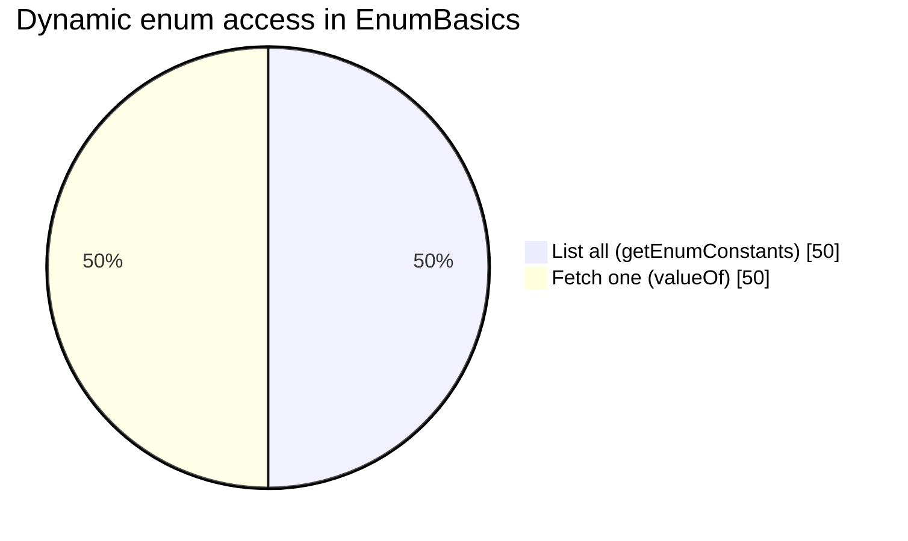

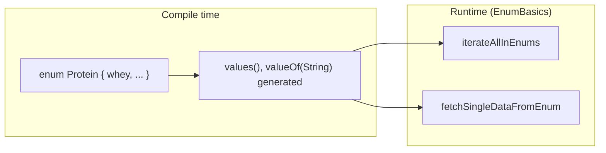

---

## Compilation flow

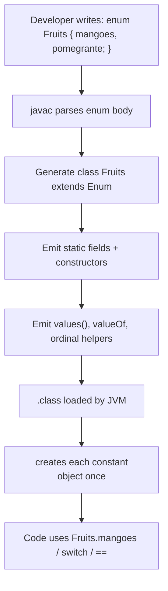

| Phase          | What happens                                                            |
| -------------- | ----------------------------------------------------------------------- |
| **Compile**    | `enum` keyword removed; replaced by `class` + `Enum` subclass machinery |
| **Class load** | JVM runs static initializer: allocates each constant                    |
| **Use**        | References are stable singletons; no `new Fruits()` allowed in source   |

---

## Classroom slide (Beer → Fruits)

The same architecture shown in class for **`enum Beer { KF, RC; }`** applies directly to **`Fruits`**: each enum constant becomes **`public static final`** and **`new EnumType()`**.

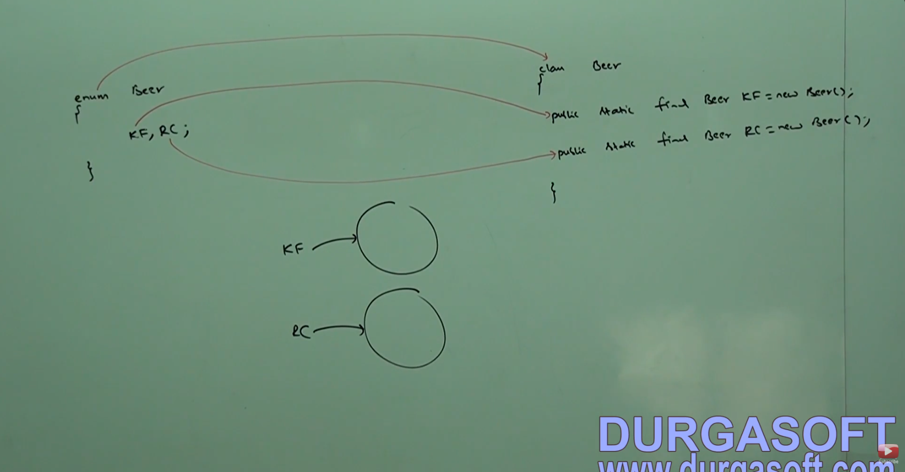

| Slide (`Beer`)                                   | This guide (`Fruits`)                               |
| ------------------------------------------------ | --------------------------------------------------- |
| `KF`                                             | `mangoes`                                           |
| `RC`                                             | `pomegrante`                                        |
| `enum` → `class Beer`                            | `enum` → `class Fruits extends Enum<Fruits>`        |
| Arrows: constant → `static final` + `new Beer()` | Same: constant → `static final` + `new Fruits(...)` |

---

## Run the demo

**Fruits (static references):**

```bash
cd demo/src/main/java
javac com/advanced/enumeration/Fruits.java
java com.advanced.enumeration.Fruits
```

**EnumBasics (generic iteration + `valueOf`):**

```bash
javac com/enumeration/enumBasics.java
java com.enumeration.enumBasics
```

Example (`Fruits`):

```text
mangoes
pomegrante
true
class com.advanced.enumeration.Fruits
```

Example (`EnumBasics` — excerpt):

```text
--- Iterating Protein ---
whey
casein
...
--- Fetching Single Constants ---
Fetched: whey
Fetched: fruits
```

The last line of `Fruits` output shows runtime type is the enum class itself, not a separate “wrapper” type.

Every enum constant is always public static final and hence we can access enum constant by using enum name 

1. enum should be inside or outside of class but enum shouldnt be created inside a method (because static values not allowed in method)
if we are trying to decalre inside a method we will get compile time errror sayign "Enum tyupes must not be local"
2. If we declare enum outside of the class the applicable modifiers are public, default, strictfp
3. If we declare enum inside the class the applicable modifiers are public , default, strictfp,private,public and static.

# enum vs switch

1. until 1.4 version the allowed argument types for the switch statement are byte, short , char, int but from 1.5 version onwards corresponding 
wrapper classes and enum types are allowed 
2. from 1.7 version onwards Strign type also allowed
3. If we pass enum type as argument to switch statement then every case label should be valid enum constant