# Switch with Enums (`enumWithSwitchBasic`)

> **Enhanced switch (`->`)** vs **traditional switch (`:`)** on enum constants — same match result, different control flow.  
> Demo: [`enumWithSwitchBasic.java`](../../../demo/src/main/java/com/enumeration/enumWithSwitchBasic.java)

> **Navigation:** Use **Ctrl+click** on Guide map / TOC links.

## Guide map

| Jump to | Topic |
| ------- | ----- |
| [Overview](#overview) | Why switch on enums |
| [pulses enum & program](#pulses-enum--program) | Source structure |
| [V1 — multi-case arrow](#v1--multi-case-arrow-printenumwithswitchstatementv1) | Combined case labels |
| [V2 — arrow syntax](#v2--arrow-syntax-printenumwithswitchstatementv2) | Java 14+ enhanced switch |
| [V3 — colon syntax](#v3--colon-syntax-printenumwithswitchstatementv3) | Classic switch + `break` |
| [V2 vs V3 comparison](#v2-vs-v3-comparison-table) | Table + slide |
| [Fall-through demo](#fall-through-demo-v3) | Missing `break` |
| [Run the demo](#run-the-demo) | Compile & run |

---

<!-- TOC -->
- [Switch with Enums (`enumWithSwitchBasic`)](#switch-with-enums-enumwithswitchbasic)
  - [Guide map](#guide-map)
  - [Overview](#overview)
  - [pulses enum & program](#pulses-enum--program)
  - [V1 — multi-case arrow (`printEnumWithSwitchStatementV1`)](#v1--multi-case-arrow-printenumwithswitchstatementv1)
  - [V2 — arrow syntax (`printEnumWithSwitchStatementV2`)](#v2--arrow-syntax-printenumwithswitchstatementv2)
  - [V3 — colon syntax (`printEnumWithSwitchStatementV3`)](#v3--colon-syntax-printenumwithswitchstatementv3)
  - [V2 vs V3 comparison table](#v2-vs-v3-comparison-table)
  - [Fall-through demo (V3)](#fall-through-demo-v3)
  - [Run the demo](#run-the-demo)
<!-- /TOC -->

---

## Overview

An **enum** switch compares the **reference** of an enum constant (e.g. `pulses.lentils`) against **case labels** that are enum constants. The JVM uses the constant’s **ordinal** / **name** under the hood, but you write **`case lentils:`** or **`case lentils ->`**.

Both styles in this guide produce the **same output** when written correctly; they differ in **syntax**, **fall-through**, and **minimum Java version**.

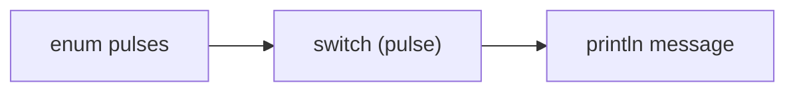

---

## pulses enum & program

```java
enum pulses {
    lentils, chickpeas, beans, peas;
}
```

| Method | Syntax | Role |
| ------ | ------ | ---- |
| `printEnumWithSwitchStatementV1` | `case a, b, c ->` | Multi-label arrow (same body) |
| `printEnumWithSwitchStatementV2` | `case x ->` | Enhanced switch (no `break`) |
| `printEnumWithSwitchStatementV3` | `case x:` + `break` | Traditional switch |
| `printEnumWithSwitchFallThroughDemo` | missing `break` | Shows accidental fall-through |

---

## V1 — multi-case arrow (`printEnumWithSwitchStatementV1`)

```java
public static void printEnumWithSwitchStatementV1(pulses pulse) {
    switch (pulse) {
        case lentils, chickpeas, beans, peas ->
            System.out.println("Pulse: " + pulse);
    }
}
```

| # | Point | Detail |
| - | ----- | ------ |
| 1 | **Multi-case label** | `case lentils, chickpeas, beans, peas` — any of these match the same arrow branch. |
| 2 | **`println(pulse)`** | Uses enum **`toString()`** → prints constant name (`lentils`, etc.). |
| 3 | **No fall-through** | Arrow form still exits after one branch. |

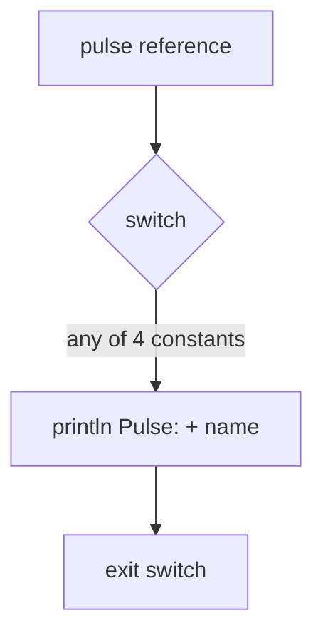

---

## V2 — arrow syntax (`printEnumWithSwitchStatementV2`)

```java
public static void printEnumWithSwitchStatementV2(pulses pulse) {
    switch (pulse) {
        case lentils -> System.out.println("Lentils are great!");
        case chickpeas -> System.out.println("Chickpeas are versatile!");
        case beans -> System.out.println("Beans are nutritious!");
        case peas -> System.out.println("Peas are tasty!");
    }
}
```

### Point-by-point (V2)

| # | Point | Detail |
| - | ----- | ------ |
| 1 | **Java version** | **Java 14+** (enhanced switch / switch rules for `->`). |
| 2 | **`switch (pulse)`** | `pulse` must be an enum reference (`pulses.lentils`, etc.). |
| 3 | **`case lentils ->`** | **Arrow rule:** if match, run **only** the right-hand side, then **exit** the switch (implicit break). |
| 4 | **No fall-through** | Execution does **not** fall into `chickpeas` after `lentils`. |
| 5 | **Scope** | One expression per arrow, or a **`{ }` block** for multiple statements. |
| 6 | **`println`** | Enum reference in string context uses **`toString()`** → constant name if printed directly; here a custom message is used. |

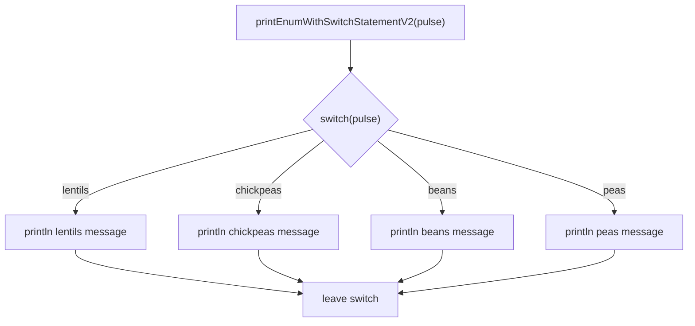

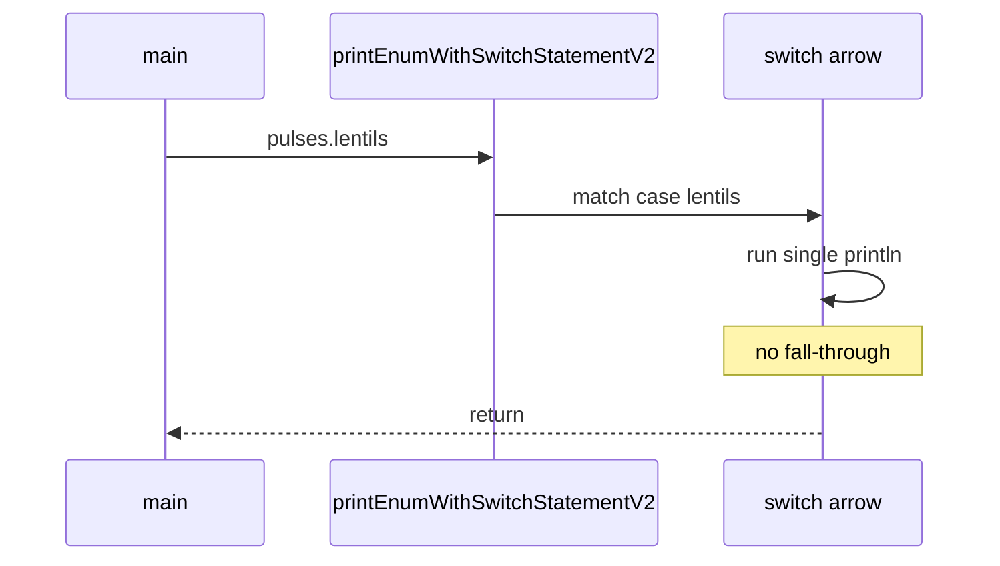

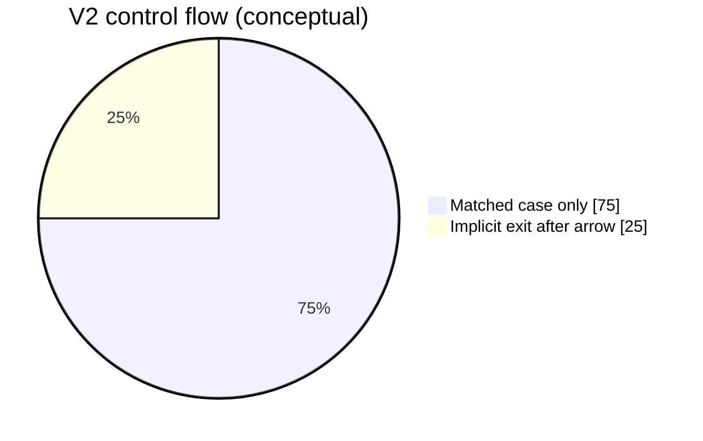

---

## V3 — colon syntax (`printEnumWithSwitchStatementV3`)

```java
public static void printEnumWithSwitchStatementV3(pulses pulse) {
    switch (pulse) {
        case lentils:
            System.out.println("Lentils are great!");
            break;
        case chickpeas:
            System.out.println("Chickpeas are versatile!");
            break;
        // ... beans, peas with break each
    }
}
```

### Point-by-point (V3)

| # | Point | Detail |
| - | ----- | ------ |
| 1 | **Java version** | **Java 1+** (classic switch). |
| 2 | **`case lentils:`** | Colon form: marks a **label**; execution **enters** here when matched. |
| 3 | **`break;`** | **Required** to stop; otherwise execution **falls through** to the next case. |
| 4 | **Fall-through risk** | Forgetting `break` after `lentils` runs **chickpeas** code too (logic bug). |
| 5 | **Boilerplate** | More lines; every case typically ends with `break` or intentional fall-through. |
| 6 | **Same runtime match** | When every case has `break`, output matches V2 for the same `pulse`. |

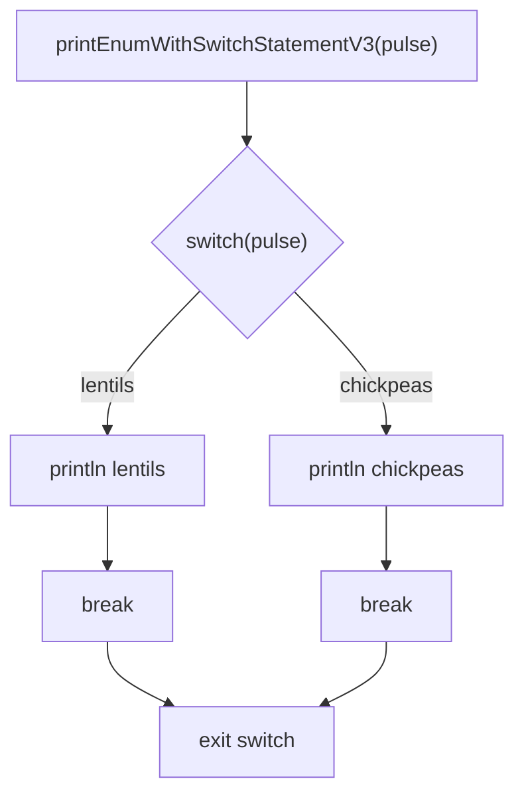

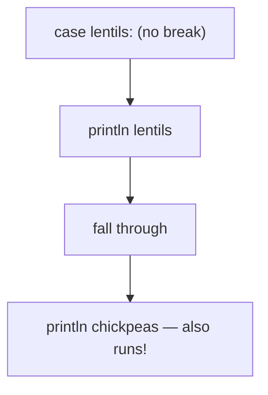

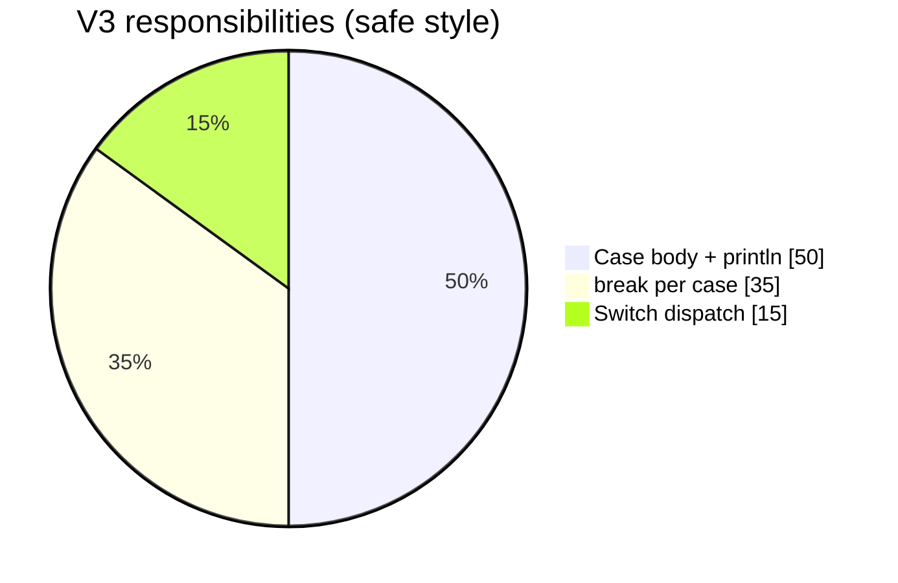

---

## V2 vs V3 comparison table

| Feature | `printEnumWithSwitchStatementV2` (Arrow `->`) | `printEnumWithSwitchStatementV3` (Colon `:`) |
| ------- | --------------------------------------------- | ---------------------------------------------- |
| **Java version** | Introduced in **Java 14** (Enhanced Switch) | Available since **Java 1** (Traditional Switch) |
| **Fall-through behavior** | **No fall-through.** Only the matched case executes. | **Dangerous fall-through.** Requires explicit `break;` statements. |
| **Code scope** | Only executes a single expression or a scoped `{ }` block. | Executes everything sequentially until it hits a `break`. |
| **Boilerplate** | Clean and concise. No `break` keywords needed. | Verbose. Forgetting a `break` causes logic bugs. |

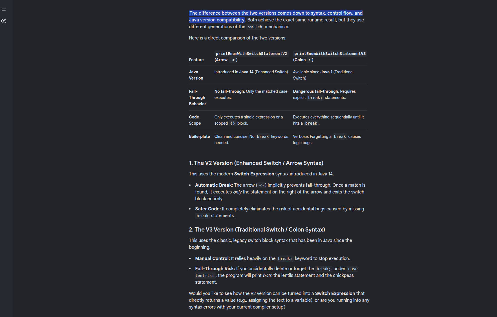

### Classroom summary (from slide)

**V2 (Enhanced Switch / Arrow Syntax)**

- The arrow (`->`) **implicitly prevents fall-through**. Once a match is found, only the statement on the right runs, then the switch **exits**.
- **Safer** — no accidental “forgot `break`” bugs.

**V3 (Traditional Switch / Colon Syntax)**

- Relies on **`break;`** to stop execution.
- If `break` is missing under `case lentils:`, the program can print **both** lentils and chickpeas messages.

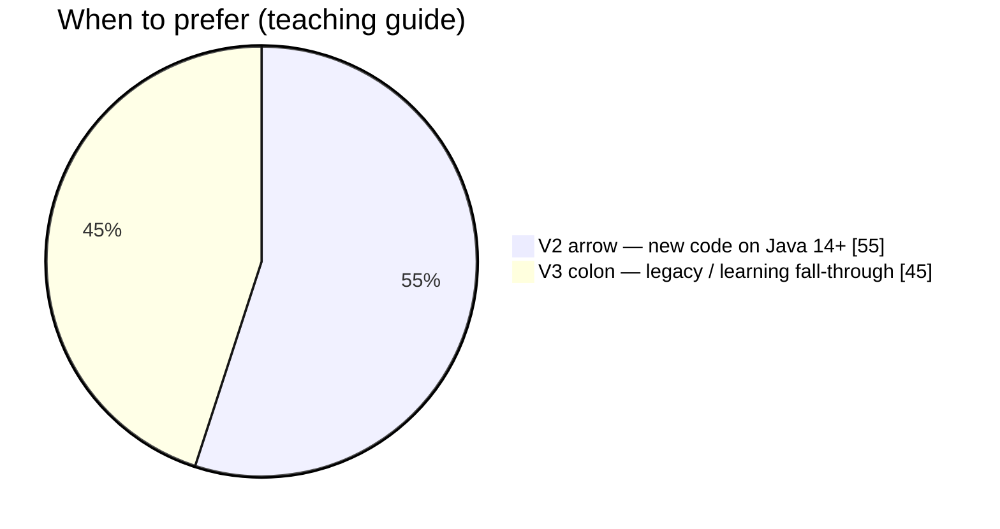

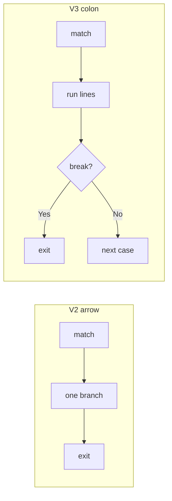

---

## Fall-through demo (V3)

```java
public static void printEnumWithSwitchFallThroughDemo(pulses pulse) {
    switch (pulse) {
        case lentils:
            System.out.println("V3 fall-through: lentils line (no break below)");
        case chickpeas:
            System.out.println("V3 fall-through: chickpeas line also runs");
            break;
        default:
            System.out.println("V3 fall-through: default");
    }
}
```

For `pulses.lentils`, **both** println lines run. V2 arrow syntax **cannot** express this accident without using multiple labels or explicit block logic — another reason enhanced switch is safer for enum dispatch.

---

## Run the demo

```bash
cd demo/src/main/java
javac com/enumeration/enumWithSwitchBasic.java
java com.enumeration.enumWithSwitchBasic
```

**Sample output:**

```text
Pulse: lentils
...
=== V2 arrow -> ===
Lentils are great!
...
=== V3 colon : ===
Lentils are great!
...
=== Fall-through demo ===
V3 fall-through: lentils line (no break below)
V3 fall-through: chickpeas line also runs
```

---

## See also

- [enumeration.md](./enumeration.md) — enum architecture, `toString()` when printing constants
- [enumBasics.java](../../../demo/src/main/java/com/enumeration/enumBasics.java) — iterate / `valueOf` on enums
