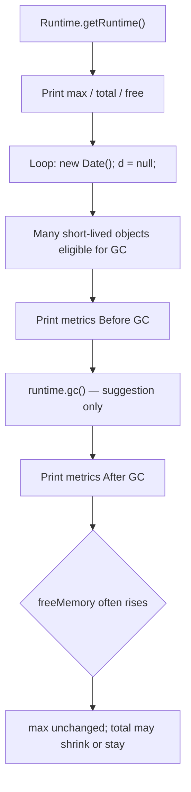
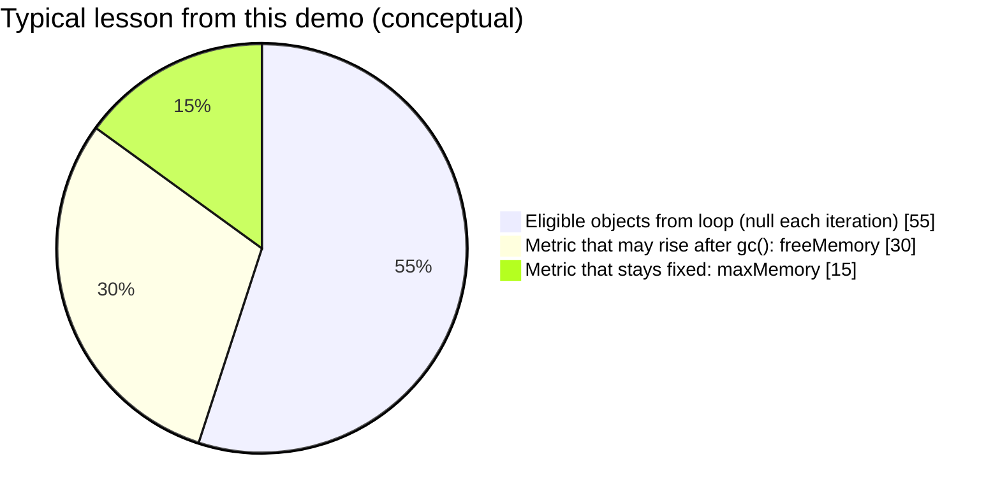
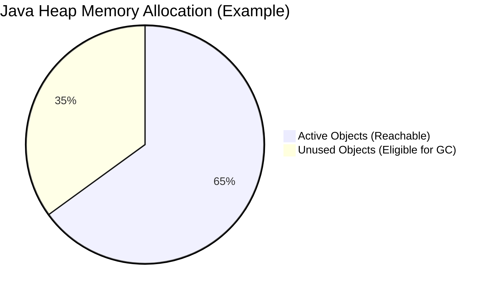
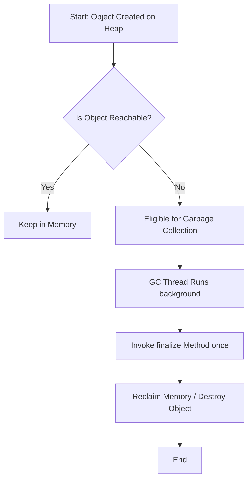

# Java Garbage Collection

> Study guide: eligibility rules, JVM stack/heap mechanics, islands of isolation, explicit GC requests, and `finalize()`.  
> Demos: [`Garbage_Collector.java`](../../../demo/src/main/java/com/advanced/garbagecollection/Garbage_Collector.java) · [`runtimeMemoryAndGc.java`](../../../demo/src/main/java/com/advanced/garbagecollection/runtimeMemoryAndGc.java) · [`garbageCollectorWithMap.java`](../../../demo/src/main/java/com/collection/map/garbageCollectorAndMap/garbageCollectorWithMap.java)

> **Navigation:** Use **Ctrl+click** (or Cmd+click on macOS) on any link below to jump to that section in preview.

## Guide map

| Jump to                                                                                                                              | Section                                                                    |
| ------------------------------------------------------------------------------------------------------------------------------------ | -------------------------------------------------------------------------- |
| [Introduction](#introduction)                                                                                                        | Introduction                                                               |
| [The ways to make an object eligible for garbage coll...](#the-ways-to-make-an-object-eligible-for-garbage-collection)               | The ways to make an object eligible for garbage collection                 |
| [1.Deep Dive: Nullifying Reference Variables for Garb...](#1deep-dive-nullifying-reference-variables-for-garbage-collection-in-java) | 1.Deep Dive: Nullifying Reference Variables for Garbage Collection in Java |
| [2. Reassigning the reference variable](#2-reassigning-the-reference-variable)                                                       | 2. Reassigning the reference variable                                      |
| [JVM Architecture & Memory Internals: Reassigning Ref...](#jvm-architecture-memory-internals-reassigning-reference-variables)        | JVM Architecture & Memory Internals: Reassigning Reference Variables       |
| [Creating Objects inside a method](#creating-objects-inside-a-method)                                                                | Creating Objects inside a method                                           |
| [JVM Architecture & Memory Internals: Creating Object...](#jvm-architecture-memory-internals-creating-objects-inside-a-method)       | JVM Architecture & Memory Internals: Creating Objects Inside a Method      |
| [4. JVM Architecture & Memory Internals: The Island o...](#4-jvm-architecture-memory-internals-the-island-of-isolation)              | 4. JVM Architecture & Memory Internals: The Island of Isolation            |
| [The methods for requesting JVM to run garbage collec...](#the-methods-for-requesting-jvm-to-run-garbage-collection)                 | The methods for requesting JVM to run garbage collection                   |
| [Runtime heap metrics and runtime.gc() demo](#runtime-heap-metrics-and-runtimegc-demo)                                              | `maxMemory` / `totalMemory` / `freeMemory` + loop + `runtime.gc()`       |
| [Finalization](#finalization)                                                                                                        | Finalization                                                               |
| [Understanding Java Garbage Collection (GC)](#understanding-java-garbage-collection-gc)                                              | Understanding Java Garbage Collection (GC)                                 |

---

<!-- TOC -->
- [Java Garbage Collection](#java-garbage-collection)
  - [Guide map](#guide-map)
  - [Introduction](#introduction)
  - [The ways to make an object eligible for garbage collection](#the-ways-to-make-an-object-eligible-for-garbage-collection)
  - [1.Deep Dive: Nullifying Reference Variables for Garbage Collection in Java](#1deep-dive-nullifying-reference-variables-for-garbage-collection-in-java)
    - [Architectural Memory Mechanics: Stack vs. Heap](#architectural-memory-mechanics-stack-vs-heap)
      - [The Allocation Phase](#the-allocation-phase)
      - [The Nullification Trigger](#the-nullification-trigger)
    - [Low-Level JVM Flow: Object Disconnection to Sweep](#low-level-jvm-flow-object-disconnection-to-sweep)
      - [Architectural Flowchart](#architectural-flowchart)
      - [Detailed Phase Execution](#detailed-phase-execution)
    - [Explicit Nullification vs. Natural Out-of-Scope](#explicit-nullification-vs-natural-out-of-scope)
    - [Edge Cases: When Nullification Fails to Yield GC Eligibility](#edge-cases-when-nullification-fails-to-yield-gc-eligibility)
      - [Case A: Shared Reference Aliasing](#case-a-shared-reference-aliasing)
      - [Case B: The Leaked Collection Target](#case-b-the-leaked-collection-target)
  - [2. Reassigning the reference variable](#2-reassigning-the-reference-variable)
  - [JVM Architecture \& Memory Internals: Reassigning Reference Variables](#jvm-architecture--memory-internals-reassigning-reference-variables)
    - [Low-Level Pointer Redirection: Stack vs. Heap](#low-level-pointer-redirection-stack-vs-heap)
      - [State Transitions (Stack and Heap Layout)](#state-transitions-stack-and-heap-layout)
        - [Phase 1: Initial Allocation](#phase-1-initial-allocation)
        - [Phase 2: Reassignment Operation (`ref1 = ref2;`)](#phase-2-reassignment-operation-ref1--ref2)
    - [The JVM Processing Sequence](#the-jvm-processing-sequence)
    - [Bytecode-Level Execution Mechanics](#bytecode-level-execution-mechanics)
      - [Key Bytecode Instructions:](#key-bytecode-instructions)
    - [Object Liveness Graph \& Reachability Tracing](#object-liveness-graph--reachability-tracing)
    - [Architectural Comparison: Reassignment vs. Nullification](#architectural-comparison-reassignment-vs-nullification)
    - [Advanced Edge Case: The Mutator Write Barrier \& Card Tables](#advanced-edge-case-the-mutator-write-barrier--card-tables)
  - [3.Creating Objects inside a method](#3creating-objects-inside-a-method)
  - [JVM Architecture \& Memory Internals: Creating Objects Inside a Method](#jvm-architecture--memory-internals-creating-objects-inside-a-method)
    - [Thread Stack Frame Mechanics \& Heap Interaction](#thread-stack-frame-mechanics--heap-interaction)
      - [Memory Lifecycle Matrix](#memory-lifecycle-matrix)
        - [Phase 1: Method Execution Active](#phase-1-method-execution-active)
        - [Phase 2: Method Return / Frame Eviction](#phase-2-method-return--frame-eviction)
    - [2. The Method Lifecycle Execution Sequence](#2-the-method-lifecycle-execution-sequence)
    - [Bytecode-Level Method Allocations](#bytecode-level-method-allocations)
      - [GC Impact of return:](#gc-impact-of-return)
    - [JIT Compiler Optimization: Escape Analysis \& Scalar Replacement](#jit-compiler-optimization-escape-analysis--scalar-replacement)
      - [The Three Escape States:](#the-three-escape-states)
      - [Scalar Replacement (Bypassing the Heap)](#scalar-replacement-bypassing-the-heap)
      - [Architectural Benefit for GC:](#architectural-benefit-for-gc)
    - [Heap Allocation Optimizations: TLABs](#heap-allocation-optimizations-tlabs)
  - [4. JVM Architecture \& Memory Internals: The Island of Isolation](#4-jvm-architecture--memory-internals-the-island-of-isolation)
    - [Architectural Blueprint: The Cyclic Disconnection](#architectural-blueprint-the-cyclic-disconnection)
      - [State Transitions (Stack and Heap Layout)](#state-transitions-stack-and-heap-layout-1)
        - [Phase 1: Strong Reachability (Active Links)](#phase-1-strong-reachability-active-links)
        - [Phase 2: Severing External Ties (`refA = null; refB = null;`)](#phase-2-severing-external-ties-refa--null-refb--null)
    - [The Isolation Processing \& Sweep Sequence](#the-isolation-processing--sweep-sequence)
    - [Bytecode-Level Structural Graphing](#bytecode-level-structural-graphing)
      - [Execution Insight:](#execution-insight)
    - [Modern Tracing GC Roots \& Reachability Graph Analysis](#modern-tracing-gc-roots--reachability-graph-analysis)
      - [The Live-Object Marking Protocol:](#the-live-object-marking-protocol)
    - [Architectural Memory Traps: Hidden Roots](#architectural-memory-traps-hidden-roots)
  - [The methods for requesting JVM to run garbage collection](#the-methods-for-requesting-jvm-to-run-garbage-collection)
    - [Runtime heap metrics and `runtime.gc()` demo](#runtime-heap-metrics-and-runtimegc-demo)
  - [Finalization](#finalization)
  - [Understanding Java Garbage Collection (GC)](#understanding-java-garbage-collection-gc)
    - [1. How Objects Become Eligible for GC](#1-how-objects-become-eligible-for-gc)
    - [2. The Garbage Collection Flow](#2-the-garbage-collection-flow)
    - [3. Comprehensive Java Code Example](#3-comprehensive-java-code-example)
      - [Expected Output Structure](#expected-output-structure)
<!-- /TOC -->

---

## Introduction 

In old lanaguages like c++, programmer is responsible to create new object and to destroy useless objects usually programmer taking very much care while creating objects and neglecting destruction of useless objects because of this negligence at certain point for creation of new object 
sufficient memory may not be available (because total memory filled with useless objects only) and total application will be down with memory problems, hence OutOfMemoryError is very common problem in old languages like c++.

But in java programmer is responsible only for creation of objects and programmer is not responsible to destroy useless objects sun people provided one assistant to destroy useless objects this assistant is alway running in the background(daemon thread) and destroy useless objects 
just because of this assistant the chance of failing java program with memory problems is very very low.

This assistant is nothing but garbage collector, hence the main objective of the garbage collector is to destroy useless objects

## The ways to make an object eligible for garbage collection 

Eventhough programmer is not responsible to destroy useless objects it is gihly recommonded to make an object eligible for garbage collection 
if it is no longer required

An object is said to be eligible for garbage collection if an only iff it doesn't contain any reference variable 

the following are various ways to make an object eligible for garbage collection 


## 1.Deep Dive: Nullifying Reference Variables for Garbage Collection in Java

This document provides a highly technical, deep-dive architectural analysis of what happens inside the **Java Virtual Machine (JVM)** when a reference variable is explicitly set to `null` to facilitate **Garbage Collection (GC)**.

---

### Architectural Memory Mechanics: Stack vs. Heap

To understand nullification, you must look at how the JVM splits memory between the **Java Virtual Machine Stack** and the **Java Heap**.

```
BEFORE NULLIFICATION:
[ Stack Frame (Local Variable Table) ]            [ Java Heap Memory Space ]
+------------------------------------+            +-------------------------+
| Slot 1: referenceVar ------------->+----------->| Object Instance         |
+------------------------------------+            | - Header (Mark/Klass)   |
                                                  | - Instance Data         |
                                                  +-------------------------+

AFTER NULLIFICATION (`referenceVar = null;`):
[ Stack Frame (Local Variable Table) ]            [ Java Heap Memory Space ]
+------------------------------------+            +-------------------------+
| Slot 1: referenceVar = 0x0 (NULL)  |            | Unreachable Object      |
+------------------------------------+            | (Orphaned in Memory)   |
                                                  | [Eligible for GC]       |
                                                  +-------------------------+
```

#### The Allocation Phase
When you execute `MyObject obj = new MyObject();`:
1. **Heap Allocation:** The JVM allocates contiguous space on the heap for the instance data, including its object header (Mark Word and Klass Word).
2. **Stack Reference:** The address (pointer) of this heap memory location is stored inside a slot in the **Local Variable Table (LVT)** of the executing thread's current Stack Frame.

#### The Nullification Trigger
When you execute `obj = null;`:
* **Bytecode Execution:** The JVM executes an `aconst_null` instruction followed by an `astore` instruction matching the LVT slot.
* **Reference Erasure:** The LVT slot value changes to `0x0` (null pointer). The stack frame **no longer holds a path** to the heap memory address.
* **Heap Impact:** The object on the heap remains entirely unchanged at this exact moment. No memory is freed immediately.

---

### Low-Level JVM Flow: Object Disconnection to Sweep

The process from nullification to physical erasure moves through distinct lifecycle phases managed by the JVM Execution Engine.

#### Architectural Flowchart
```
[ Step 1: Thread Executes `obj = null;` ]
                   │
                   ▼
[ Step 2: Stack Slot Address Cleared to 0x0 ]
                   │
                   ▼
[ Step 3: Object Loses Its Incoming Active Reference Chain ]
                   │
                   ▼
[ Step 4: GC Root Tracing Cycle Begins (e.g., CMS, G1, ZGC) ]
                   │
                   ▼
         Is Object Reachable from Roots?
         ├── YES ──> [ Retained in Heap ]
         └── NO  ──> [ Step 5: Marked as Unreachable (Eligible for GC) ]
                                │
                                ▼
                     [ Step 6: Memory Swept & Reclaimed ]
```

#### Detailed Phase Execution
1. **Root Tracing Disconnection:** During a GC cycle, the Garbage Collector stops or pauses threads (or traces concurrently) to build a **Liveness Graph** starting from **GC Roots** (Thread local variables, Static variables, JNI global references). Because the stack slot is `0x0`, the tracing algorithm terminates at the stack frame and never visits the orphaned object.
2. **Marking Phase:** The object is officially classified as **Unreachable**. It is flagged in the GC's internal marking bitmap or allocation region metadata as dead space.
3. **Reclamation Phase:** Depending on the configured garbage collector (e.g., G1, ZGC), the space occupied by this dead object is either added to a **Free List** or compacted out during a region evacuation.

---

### Explicit Nullification vs. Natural Out-of-Scope

Developers often debate whether to write `obj = null;` explicitly or let it happen naturally. The following comparison highlights the compiler and runtime realities.

| Component / Scenario          | Explicit Nullification (`obj = null;`)                                                                                                 | Natural Out-of-Scope (Method Exit)                                                                                            |
| :---------------------------- | :------------------------------------------------------------------------------------------------------------------------------------- | :---------------------------------------------------------------------------------------------------------------------------- |
| **Mechanics**                 | Manually writing bytecode instructions (`aconst_null`, `astore`) to clear a reference slot ahead of time.                              | The entire stack frame is popped off the execution stack, instantly dropping all references in its LVT.                       |
| **Primary Use Case**          | **Long-lived scopes** (e.g., removing an element from a custom collection array, or inside a loop that runs indefinitely).             | **Short-lived variables** inside localized standard methods or block structures (`{ }`).                                      |
| **JIT Compiler Optimization** | The Just-In-Time (JIT) compiler can sometimes analyze and optimize away redundant explicit null assignments via dead-code elimination. | Highly optimized natively; no extra bytecodes are required because stack pointer manipulation clears the whole frame at once. |
| **Memory Risk Avoidance**     | Prevents **Stale References** from keeping massive objects alive inside an active, ongoing execution context.                          | Relies strictly on proper modular code design to keep memory foot-prints naturally contained.                                 |

---

### Edge Cases: When Nullification Fails to Yield GC Eligibility

Setting a reference variable to `null` does **not** guarantee the object will be garbage collected. Below are the structural conditions where memory remains trapped.

#### Case A: Shared Reference Aliasing
If multiple reference variables point to the exact same heap address, nullifying one variable does nothing to the object's reachability status.

```java
MyObject alpha = new MyObject(); // Count = 1
MyObject beta = alpha;           // Count = 2 (Beta points to the same object)

alpha = null;                    // Count = 1 (Object is STILL reachable via beta!)
// The object remains completely protected from Garbage Collection.
```

#### Case B: The Leaked Collection Target
Adding an object to a collection (like a `HashMap` or `ArrayList`) copies the reference into the collection's internal storage structure.

```java
List<MyObject> list = new ArrayList<>();
MyObject data = new MyObject();

list.add(data); // The internal array inside the list now holds a strong reference
data = null;    // Explicitly nullified here...

// RESULT: The object remains 100% strongly reachable because the 'list' wrapper 
// maintains its reference path back to the heap object.
```

## 2. Reassigning the reference variable 

If an object no longer required then reassign its reference variable to some other object then old object by default eligible for garbage collection 

## JVM Architecture & Memory Internals: Reassigning Reference Variables

In Java, memory management is governed entirely by the Java Virtual Machine (JVM). One of the core mechanisms for rendering an object eligible for **Garbage Collection (GC)** is the **reassignment of a reference variable**. 

Unlike explicit nullification (which clears a reference slot), reassignment shifts a pointer from one heap entity to another in a single atomic bytecode operation. This document provides a deep architectural breakdown of how reference reassignment manipulates the stack, modifies the heap, alters the Object Liveness Graph, and triggers GC cycles.

---

### Low-Level Pointer Redirection: Stack vs. Heap

A reference variable in Java is an entry within the **Local Variable Table (LVT)** of an executing thread’s stack frame. The variable does not hold the object data itself; it holds a **memory address (pointer)** pointing to an object allocated on the managed heap.

When a reference variable is reassigned:
1. The execution thread evaluates the new target object (either an existing object or a newly instantiated one).
2. The 32-bit or 64-bit reference address stored in the stack slot is overwritten.
3. The old object loses that specific incoming edge on the reference graph.

#### State Transitions (Stack and Heap Layout)

##### Phase 1: Initial Allocation
Both variables `ref1` and `ref2` point to separate distinct memory blocks on the heap.

```
STACK (Current Frame LVT)                   HEAP (Young/Old Generation)
+-----------------------+                   +--------------------------+
| Slot 1: ref1          | ----------------> | Object A (Addr: 0x00F1)  |
+-----------------------+                   +--------------------------+
| Slot 2: ref2          | ----------------> | Object B (Addr: 0x00F8)  |
+-----------------------+                   +--------------------------+
```

##### Phase 2: Reassignment Operation (`ref1 = ref2;`)
The pointer inside `Slot 1` is updated to hold `0x00F8`. `Object A` now has **zero active incoming references**.

```
STACK (Current Frame LVT)                   HEAP (Young/Old Generation)
+-----------------------+                   +--------------------------+
| Slot 1: ref1          | -----\            | Object A (Addr: 0x00F1)  | <-- [UNREACHABLE]
+-----------------------+       \---------> +--------------------------+
| Slot 2: ref2          | ----------------> | Object B (Addr: 0x00F8)  |
+-----------------------+                   +--------------------------+
```

---

### The JVM Processing Sequence

The sequence below illustrates the chronological path from a high-level Java source reassignment down to physical memory reclamation by the GC engine.

```
 [Application Thread]                 [Execution Engine]                 [Garbage Collector]
          |                                   |                                   |
    1. Executes reassignment                  |                                   |
       statement (`r1 = r2`)                  |                                   |
          |---------------------------------->|                                   |
          |                                   | 2. Updates LVT Pointer            |
          |                                   |    (Overwrites old Address)       |
          |                                   |---------------------------------->|
          |                                   |                                   | 3. Triggers Concurrent Marking
          |                                   |                                   |    (Finds zero root paths to Object A)
          |                                   |                                   |----------------------------------+
          |                                   |                                   |                                  |
          |                                   |                                   | 4. Identifies Dead Space         |
          |                                   |                                   |    (Sweeps/Compacts Memory block)|
          |                                   |                                   |<---------------------------------+
          |                                   |                                   |
```

---

### Bytecode-Level Execution Mechanics

To understand how the execution engine processes reference reassignments, consider this Java method:

```java
public void processReassignment() {
    Object ref = new Object(); // Initial Object
    ref = new Object();        // Reassignment to a Second Object
}
```

When compiled, the JVM translates this code into specific instructions manipulating the **Operand Stack** and the **Local Variable Table (LVT)**:

```assembly
public void processReassignment();
  Code:
   0: new           #2                  // class java/lang/Object (Allocates memory for Object 1)
   3: dup                               // Duplicates the reference pointer on top of the operand stack
   4: invokespecial #1                  // Method java/lang/Object."<init>":()V (Executes constructor)
   7: astore_1                          // Pops pointer from operand stack and stores it in LVT Slot 1 (ref)
   
   8: new           #2                  // class java/lang/Object (Allocates memory for Object 2)
  11: dup                               // Duplicates the new reference pointer
  12: invokespecial #1                  // Method java/lang/Object."<init>":()V (Executes constructor)
  15: astore_1                          // OVERWRITES LVT Slot 1 with the new pointer. 
                                        // Object 1 is now instantly disconnected and eligible for GC.
  16: return
```

#### Key Bytecode Instructions:
*   `new`: Reserves memory bytes on the heap for the instance fields and object header.
*   `astore_1`: This is where the actual reassignment occurs. It moves the reference reference from the operand stack into local variable slot 1, atomically stripping the reference from the old object instance.

---

### Object Liveness Graph & Reachability Tracing

Modern JVM Garbage Collectors (like **G1, ZGC, or Shenandoah**) use **Tracing Garbage Collection** based on graph reachability rather than simple reference counting. 

1. **GC Roots Identification:** The GC builds a root-set consisting of active thread stacks, local variables, JNI global references, and system-loaded static classes.
2. **Graph Traversal:** The collector traverses all memory references starting outward from these roots.
3. **Dead Node Identification:** If an object cannot be reached by traversing any path starting from the GC Roots, it is designated as a dead node.

When `ref1` is reassigned away from `Object A`, the edge between the **GC Root** and `Object A` is severed. Even if `Object A` retains internal pointers to other objects, the lack of an incoming path from a valid root renders it dead space.

---

### Architectural Comparison: Reassignment vs. Nullification

| Architectural Property                    | Reassignment (`ref = newObj;`)                                                    | Nullification (`ref = null;`)                                              |
| :---------------------------------------- | :-------------------------------------------------------------------------------- | :------------------------------------------------------------------------- |
| **LVT Slot Status**                       | Retains a valid 32/64-bit reference address.                                      | Holds a raw literal value of `0x0` (`null`).                               |
| **Object Lifecycle Impact**               | Instantly swaps eligibility status between two instances.                         | Exclusively drops structural connection to one instance.                   |
| **GC Write Barrier Overhead**             | Triggers write barriers in generational GCs to update **Card Tables**.            | Triggers write barriers to clear tracked generational card references.     |
| **Thread Local Allocation Buffer (TLAB)** | Often utilizes a TLAB slot to place the incoming object directly.                 | No new allocations are made; purely an invalidation mechanism.             |
| **Memory Leak Risk**                      | Low, provided the new object itself does not create a long-lived retention cycle. | Low, used specifically to clear long-lived scopes or array slots manually. |

---

### Advanced Edge Case: The Mutator Write Barrier & Card Tables

In generational garbage collectors like G1, memory is divided into regions. When you reassign an object reference field belonging to an object residing in an older generation to an object in a younger generation, the JVM must track this cross-generational reference without scanning the entire old generation.

This tracking is accomplished using **Write Barriers** and **Card Tables**:
```java
class Node { Node next; }
// ...
nodeA.next = nodeB; // Field Reassignment
```

When this field reassignment runs, the compiler injects an architectural post-write barrier hook:
1. The execution thread mutates the reference pointer field.
2. The post-write barrier executes immediately after.
3. It identifies the byte array card representing the memory location of `nodeA`.
4. It marks that card as **dirty**.
5. During a minor or young generation GC phase, the garbage collector scans only the dirty cards to discover that `nodeB` is strongly reachable, preventing accidental premature collection.

## 3.Creating Objects inside a method 

## JVM Architecture & Memory Internals: Creating Objects Inside a Method

When an object is created within the scope of a Java method, it triggers a tight coordination between the executing **Thread Stack**, the **Managed Heap**, the **Just-In-Time (JIT) Compiler**, and the **Garbage Collector (GC)**. 

Because method execution is short-lived, the lifecycle of objects created inside them represents the most high-volume allocation pattern in Java applications. This document provides a deep architectural breakdown of how these objects are allocated, how their references are bound to stack frames, how the JIT compiler optimizes them away, and how they become eligible for Garbage Collection.

---

### Thread Stack Frame Mechanics & Heap Interaction

Every executing thread in Java has its own private **Thread Stack**. Each time a method is called, a new **Stack Frame** is pushed onto the stack. This frame houses the **Local Variable Table (LVT)** and the **Operand Stack**.

When you write `Object obj = new Object();` inside a method:
1. The physical object data is allocated on the **Heap** (specifically within the Young Generation).
2. The reference address (pointer) to that object is stored in a slot inside the Local Variable Table of the active stack frame.

#### Memory Lifecycle Matrix

##### Phase 1: Method Execution Active
The method is currently running. The reference inside the LVT slot keeps the heap object strongly reachable.

```
STACK (Thread Stack Frame)                  HEAP (Young Gen / TLAB)
+-----------------------+                   +--------------------------+

| Frame: executeMethod  |                   |                          |
|                       |                   |                          |
| Slot 1: obj (Pointer) | ----------------> | Object Data (0x7F91)     |
+-----------------------+                   +--------------------------+
```

##### Phase 2: Method Return / Frame Eviction
The method finishes execution. The entire stack frame is popped off the thread stack. The reference address ceases to exist, leaving the heap object with **zero active root paths**.

```
STACK (Thread Stack Frame)                  HEAP (Young Gen / TLAB)
+-----------------------+                   +--------------------------+

| [ FRAME EVICTED ]     |                   |                          |
|                       |                   |                          |
| (LVT slot destroyed)  |                   | Object Data (0x7F91)     | <-- [UNREACHABLE]
+-----------------------+                   +--------------------------+
```

---

### 2. The Method Lifecycle Execution Sequence

The diagram below maps the runtime timeline of a local object, from method invocation through stack cleanup to ultimate garbage collection sweeping.

```
 [Thread Stack]                     [Execution Engine]                 [Garbage Collector]

        |                                   |                                   |
  1. Method Invoked                         |                                   |
     (Pushes New Stack Frame)               |                                   |

        |                                   |                                   |
  2. Allocates Object                       |                                   |
     (Pointer bound to LVT Slot)            |                                   |

        |                                   |                                   |
        |---------------------------------->|                                   |
        |                                   |                                   |
  3. Method Completes                       |                                   |
     (Pops Frame, Destroys LVT Slot)        |                                   |

        |                                   |                                   |
        |---------------------------------------------------------------------->|
                                                                                | 4. Next GC Cycle Triggers
                                                                                |    (Identifies no live paths)
                                                                                |----------------------------------+

                                                                                |                                  |
                                                                                | 5. Reclaims Heap Memory          |
                                                                                |    (Sweeps/Evacuates allocation) |
                                                                                |<---------------------------------+
```

---

### Bytecode-Level Method Allocations

Consider this standard local method allocation code:

```java
public void executeLocalScope() {
    Object localObj = new Object();
    localObj.hashCode();
}
```

When compiled, the JVM translates this method into the following bytecode structure:

```assembly
public void executeLocalScope();
  Code:
   0: new           #2                  // class java/lang/Object (Allocates heap bytes)
   3: dup                               // Duplicates object reference on top of operand stack
   4: invokespecial #1                  // Method java/lang/Object."<init>":()V (Runs constructor)
   7: astore_1                          // Pops pointer from operand stack, stores in LVT Slot 1 (localObj)
   8: aload_1                           // Loads reference from LVT Slot 1 onto operand stack
   9: invokevirtual #3                  // Method java/lang/Object.hashCode:()I
  12: pop                               // Pops the integer result of hashCode off the stack
  13: return                            // Method returns. Stack frame is discarded instantly.
```

#### GC Impact of return:
Notice that there is no explicit instruction to clear `astore_1` or set it to `null`. The `return` instruction at byte index `13` discards the entire frame context. The reference is broken automatically without any runtime bytecode overhead.

---

### JIT Compiler Optimization: Escape Analysis & Scalar Replacement

The JVM contains a critical runtime optimization engine called **Escape Analysis (EA)**. Before an object is actually allocated on the heap inside a method, the Just-In-Time (JIT) Compiler analyzes the scope of the reference variable to determine if it "escapes" the method.

#### The Three Escape States:
1. **GlobalEscape:** The object escapes the method and the thread (e.g., it is returned from the method, stored in a static global field, or passed into a separate thread). It **must** be allocated on the heap.
2. **ArgEscape:** The object is passed as an argument to another method but does not escape the current thread.
3. **NoEscape:** The object never leaves the executing method. Its lifetime is entirely bounded by the method's stack frame.

#### Scalar Replacement (Bypassing the Heap)
If the JIT compiler determines an object is **NoEscape**, it frequently performs an optimization known as **Scalar Replacement**. 

Instead of allocating a physical object wrapper on the heap, the JIT breaks the object down into its primitive fields (scalars) and maps them directly to **CPU Registers** or individual slots within the thread's stack frame.

```java
// Original Code Analyzed by JIT
public void calculate() {
    Point p = new Point(10, 20);
    int sum = p.x + p.y;
}

// Optimized Execution State (Conceptually)
public void calculate() {
    int p_x = 10; // Stored in CPU register or stack slot
    int p_y = 20; // Stored in CPU register or stack slot
    int sum = p_x + p_y;
}
```

#### Architectural Benefit for GC:
* **Zero Heap Allocation:** No object is created on the heap.
* **Zero GC Overhead:** Because the fields reside natively on the stack frame or registers, they vanish instantly when the method returns. The Garbage Collector never has to scan, track, or sweep this data.

---

### Heap Allocation Optimizations: TLABs

If an object created inside a method cannot be scalar-replaced (e.g., it is too complex or fails escape conditions), the JVM allocates it on the heap. To minimize multi-threaded synchronization slowdowns during high-frequency method calls, the JVM uses **Thread Local Allocation Buffers (TLABs)**.

* The Young Generation heap space is divided into a shared region and multiple small thread-exclusive buffers (TLABs).
* When a method executes `new Object()`, the execution engine attempts to reserve memory for that object inside the calling thread's private TLAB.
* **Performance Impact:** This allows the pointer to advance via a fast, non-blocking sync-free operation ("Bump-the-pointer"). When the method returns, these objects sit quietly in the TLAB until a Minor GC sweep evacuates the surviving references and recycles the dead space in bulk.

## 4. JVM Architecture & Memory Internals: The Island of Isolation

An **Island of Isolation** is a highly specific memory state in Java where two or more objects form a cyclic or bidirectional reference loop with each other, but **no active thread or reference path** from a valid **GC Root** can reach any object within that loop. 

This document provides a deep architectural breakdown of how these circular reference islands are formed, how modern tracing garbage collectors analyze them, and why they do not cause memory leaks in production Java applications.

---

### Architectural Blueprint: The Cyclic Disconnection

In older language runtimes that rely strictly on **Reference Counting** algorithms, islands of isolation cause critical memory leaks because each object's reference counter remains greater than zero. However, the Java Virtual Machine uses a **Tracing (Reachability) Algorithm** which handles this scenario automatically.

When an island is formed:
1. Object A references Object B, and Object B references Object A.
2. The external reference variables residing in the active thread's **Local Variable Table (LVT)** are either nullified or go out of scope.
3. The objects remain linked to each other on the heap, but are structurally isolated from the running application graph.

#### State Transitions (Stack and Heap Layout)

##### Phase 1: Strong Reachability (Active Links)
Local variables `refA` and `refB` inside the running thread stack point directly to their respective objects on the heap. The objects also point to each other.

```
STACK (Thread Stack Frame LVT)              HEAP (Young / Old Generation)
+-----------------------+                   +--------------------------+
| Slot 1: refA          | ----------------> | Object A (Addr: 0x01A)   |
+-----------------------+                   |   - next: 0x01B          |
                                            +--------------------------+
                                                  ^              |
                                                  |              |
                                                  |              v
+-----------------------+                   +--------------------------+
| Slot 2: refB          | ----------------> | Object B (Addr: 0x01B)   |
+-----------------------+                   |   - next: 0x01A          |
                                            +--------------------------+
```

##### Phase 2: Severing External Ties (`refA = null; refB = null;`)
The local variables are overwritten on the stack. The horizontal paths from the stack to the heap are permanently broken. The objects now form an **Island of Isolation**.

```
STACK (Thread Stack Frame LVT)              HEAP (Young / Old Generation)
+-----------------------+                   +--------------------------+
| Slot 1: refA (null)   |                   | Object A (Addr: 0x01A)   |
+-----------------------+                   |   - next: 0x01B          |
                                            +--------------------------+
                                                  ^              |
                                                  |              |
                                                  |              v
+-----------------------+                   +--------------------------+
| Slot 2: refB (null)   |                   | Object B (Addr: 0x01B)   |
+-----------------------+                   |   - next: 0x01A          |
                                            +--------------------------+
```

---

### The Isolation Processing & Sweep Sequence

The chronological pipeline below maps out how a mutator thread discards the external boundaries of the nodes and how the GC engine detects and sweeps the cluster.

```
 [Application Thread]                 [Execution Engine]                 [Garbage Collector]
          |                                   |                                   |
    1. Builds circular bond                   |                                   |
       (node1.next = node2)                   |                                   |
    2. Nullifies roots                        |                                   |
       (node1 = null; node2 = null)           |                                   |
          |---------------------------------->|                                   |
          |                                   | 3. Commutes LVT updates           |
          |                                   |    (Stack values clear to 0x0)    |
          |                                   |---------------------------------->|
          |                                   |                                   | 4. Executes Marking Trace
          |                                   |                                   |    (Scans from GC Roots)
          |                                   |                                   | 5. Misses isolated cycle
          |                                   |                                   |    (Island remains un-marked)
          |                                   |                                   |----------------------------------+
          |                                   |                                   |                                  |
          |                                   |                                   | 6. Collects Unmarked Clusters   |
          |                                   |                                   |    (Sweeps/Evacuates A and B)    |
          |                                   |                                   |<---------------------------------+
```

---

### Bytecode-Level Structural Graphing

Consider the following Java snippet that generates a micro-island:

```java
public void buildIsland() {
    Node nodeA = new Node();
    Node nodeB = new Node();
    
    nodeA.next = nodeB; // Link A to B
    nodeB.next = nodeA; // Link B to A
    
    nodeA = null;       // Drop Root A
    nodeB = null;       // Drop Root B
}
```

When compiled to JVM instructions, the reference looping and ultimate dropping execute via these specific operations:

```assembly
public void buildIsland();
  Code:
   0: new           #2                  // class Node (Instantiates Object A)
   3: dup
   4: invokespecial #3                  // Method Node."<init>":()V
   7: astore_1                          // Stores Object A in LVT Slot 1 (nodeA)
   
   8: new           #2                  // class Node (Instantiates Object B)
  11: dup
  12: invokespecial #3                  // Method Node."<init>":()V
  15: astore_2                          // Stores Object B in LVT Slot 2 (nodeB)
  
  16: aload_1                           // Loads Object A reference
  17: aload_2                           // Loads Object B reference
  18: putfield      #4                  // Field Node.next:LNode; (nodeA.next = nodeB)
  
  21: aload_2                           // Loads Object B reference
  22: aload_1                           // Loads Object A reference
  23: putfield      #4                  // Field Node.next:LNode; (nodeB.next = nodeA)
  
  26: aconst_null                       // Pushes null onto operand stack
  27: astore_1                          // Clears LVT Slot 1 (nodeA = null)
  
  28: aconst_null                       // Pushes null onto operand stack
  29: astore_2                          // Clears LVT Slot 2 (nodeB = null)
  30: return
```

#### Execution Insight:
Instructions `26` through `29` systematically clear the entries from the stack frame table. Even though `putfield` permanently wrote the internal object references directly to the heap memory structures at indexes `18` and `23`, the entry keys from the thread execution frame are completely blank.

---

### Modern Tracing GC Roots & Reachability Graph Analysis

Modern Java Virtual Machines discard the concept of tracking reference totals. Instead, algorithms like **G1 (Garbage-First)**, **ZGC**, and **Parallel GC** utilize a **Root Reachability Graph Analysis**.

#### The Live-Object Marking Protocol:
1. **The Root Set:** The garbage collector establishes an initial array of unmistakable reference origins called **GC Roots**. These include:
   * Local variable tables across all active thread stacks.
   * JNI (Java Native Interface) Global/Local references.
   * System classes loaded into memory by the system bootstrap classloader.
   * Active static variables defined within active classes.

2. **The Tracing Phase:** Starting directly at these GC Roots, the collector traces downstream along every available branch reference pointer, painting every object it comes across as **Live / Marked**.

3. **Island Invalidation:** When the collector attempts to scan toward the Island of Isolation, it scans every live thread stack and static block. Because `astore_1` and `astore_2` were set to `null` (or if the method returned, wiping the stack entirely), there is no pathway connecting any valid GC Root to either `Object A` or `Object B`.

4. **The Sweep Rule:** Because the path tracing tree cannot access the island, the objects receive no marking flags. During the sweep phase, the GC engine ignores the cross-links between `Object A` and `Object B`, treats the entire segment as dead block space, and safely sweeps both components simultaneously.

---

### Architectural Memory Traps: Hidden Roots

While pure islands of isolation are collected instantly by the JVM, developers sometimes accidentally create "pseudo-islands" that leak memory because they remain linked to a hidden GC Root.

| Scenario                  | Structural Mechanics                                                                                                                                    | GC Eligibility                                                                                                   |
| :------------------------ | :------------------------------------------------------------------------------------------------------------------------------------------------------ | :--------------------------------------------------------------------------------------------------------------- |
| **Pure Island**           | Objects reference each other; all external LVT stack pointers are dropped.                                                                              | **Eligible for collection.** Swept automatically on the next cycle.                                              |
| **The Static Hook Leak**  | Objects reference each other, but one node is added to a static `List` or `Map`.                                                                        | **Not Eligible for GC.** The static collection acts as a permanent GC Root, keeping the entire loop alive.       |
| **The Thread Local Trap** | A node loop is linked to a field variable inside an active `ThreadLocal` storage wrapper.                                                               | **Not Eligible for GC** as long as the parent application thread remains alive in the thread pool.               |
| **Inner Class Retention** | An active external framework holds a reference to a non-static nested inner class instance, which implicitly references its outer configuration parent. | **Not Eligible for GC.** The outer class wrapper cannot be swept, retaining all variables mapped to its context. |

## The methods for requesting JVM to run garbage collection

Use `System.gc()` or `Runtime.getRuntime().gc()` to **suggest** that the JVM run garbage collection. The call is not guaranteed to trigger an immediate collection; the collector still decides based on heap usage and policy. The runnable example in [§3 Comprehensive Java Code Example](#3-comprehensive-java-code-example) shows a typical test-style request with `System.gc()`.

### Runtime heap metrics and `runtime.gc()` demo

`Runtime.getRuntime()` exposes **heap sizing hints** (all values are in **bytes**). They are useful in tutorials and diagnostics; production code usually prefers JMX or unified logging instead of calling `gc()` in a loop.

| Method | Meaning |
| ------ | ------- |
| `maxMemory()` | Upper bound the JVM will try to use for the heap (`-Xmx`). |
| `totalMemory()` | Heap currently **committed** to the process (can grow toward `max` as objects are allocated). |
| `freeMemory()` | Free space **within** the committed `totalMemory()` region (not the same as “all unused memory on the machine”). |



Runnable source: [`runtimeMemoryAndGc.java`](../../../demo/src/main/java/com/advanced/garbagecollection/runtimeMemoryAndGc.java)

```java
Runtime runtime = Runtime.getRuntime();
System.out.println("Max Memory: " + runtime.maxMemory());
System.out.println("Total Memory: " + runtime.totalMemory());
System.out.println("Free Memory: " + runtime.freeMemory());

for (int i = 0; i < 10000; i++) {
    Date d = new Date();
    d = null;
}

System.out.println("Before GC - Max Memory: " + runtime.maxMemory());
System.out.println("Before GC - Total Memory: " + runtime.totalMemory());
System.out.println("Before GC - Free Memory: " + runtime.freeMemory());

runtime.gc();

System.out.println("After GC - Max Memory: " + runtime.maxMemory());
System.out.println("After GC - Total Memory: " + runtime.totalMemory());
System.out.println("After GC - Free Memory: " + runtime.freeMemory());
```

**How to read the output**

- **`maxMemory`** — usually **unchanged** across the run; it reflects `-Xmx`, not live usage.
- **`totalMemory`** — may **increase** during the loop as the JVM commits more heap; after GC it may stay the same or drop slightly depending on collector and ergonomics.
- **`freeMemory`** — often **higher after `gc()`** if dead `Date` instances were collected, but the delta is **not guaranteed** (GC is asynchronous; `gc()` is only a hint).



> **Note:** `System.gc()` internally delegates to the same suggestion as `Runtime.getRuntime().gc()`. Avoid relying on either in production for correctness or performance.

---

## Finalization

Before an unreachable object is reclaimed, the JVM may invoke `finalize()` **at most once** (if the class overrides it). Since Java 9, `finalize()` is **deprecated** because it delays reclamation and is unreliable; use try-with-resources, `Cleaner`, or phantom references in production. The closing demo in this file still uses `finalize()` to make collection visible in the console.

---

## Understanding Java Garbage Collection (GC)

In Java, the **Garbage Collector (GC)** is a background thread that automatically manages memory by destroying unused objects. It ensures that the heap memory is freed up for new allocations, preventing `OutOfMemoryError` exceptions.

This guide demonstrates how objects become eligible for garbage collection, how to request explicit collection, and how to track the lifecycle of an object using the `finalize()` method.

---

### 1. How Objects Become Eligible for GC
An object becomes eligible for Garbage Collection when it is no longer reachable by any active thread. This typically happens via:
1. **Nullifying the reference:** Setting the reference variable to `null`.
2. **Reassigning the reference variable:** Pointing the reference to another object.
3. **Object created inside a method:** Going out of scope once the method execution completes.



---

### 2. The Garbage Collection Flow
The JVM continuously monitors object reachability. When memory runs low, or when requested, it executes a multi-phase collection process.



---

### 3. Comprehensive Java Code Example

The following program creates objects, makes them eligible for GC using various techniques, and requests the JVM to run the Garbage Collector using `System.gc()`.

```java
public class GarbageCollectionDemo {

    // Overriding finalize method to track when an object is destroyed
    @Override
    protected void finalize() throws Throwable {
        System.out.println("Garbage Collector successfully destroyed object: " + this);
    }

    public static void main(String[] args) {
        System.out.println("--- Program Execution Started ---");

        // Scenario 1: Object allocation
        GarbageCollectionDemo obj1 = new GarbageCollectionDemo();
        GarbageCollectionDemo obj2 = new GarbageCollectionDemo();

        System.out.println("Objects created: obj1 and obj2");

        // Scenario 2: Making obj1 eligible for GC by nullifying reference
        obj1 = null; 
        System.out.println("obj1 has been nullified. It is now eligible for GC.");

        // Scenario 3: Making obj2 eligible for GC by reassigning reference
        obj2 = new GarbageCollectionDemo(); 
        System.out.println("obj2 reassigned to a new object. The old obj2 is now eligible for GC.");

        // Scenario 4: Object inside a method scope
        createUnusedObject();
        System.out.println("Method execution finished. Out-of-scope object is eligible for GC.");

        // Requesting JVM to run Garbage Collector
        System.out.println("\nRequesting JVM to perform Garbage Collection...");
        System.gc(); // Explicit request (not guaranteed, but usually runs in simple test environments)

        // Adding a small delay to allow the background GC thread to finish processing
        try {
            Thread.sleep(1000);
        } catch (InterruptedException e) {
            e.printStackTrace();
        }

        System.out.println("\n--- Program Execution Ended ---");
    }

    private static void createUnusedObject() {
        GarbageCollectionDemo localObj = new GarbageCollectionDemo();
        // localObj goes out of scope as soon as this method returns
    }
}
```

#### Expected Output Structure
When you run this code, the background GC daemon thread intercepts the dereferenced objects, invokes their `finalize()` blocks, and destroys them:

```text
--- Program Execution Started ---
Objects created: obj1 and obj2
obj1 has been nullified. It is now eligible for GC.
obj2 reassigned to a new object. The old obj2 is now eligible for GC.
Method execution finished. Out-of-scope object is eligible for GC.

Requesting JVM to perform Garbage Collection...
Garbage Collector successfully destroyed object: GarbageCollectionDemo@15db9742
Garbage Collector successfully destroyed object: GarbageCollectionDemo@6d06d69c
Garbage Collector successfully destroyed object: GarbageCollectionDemo@7852e922

--- Program Execution Ended ---
```

> **Note:** The `finalize()` method is deprecated since Java 9 due to performance and reliability constraints, but it remains the most clear, classic educational tool to demonstrate exactly *when* the background GC thread destroys an unused object.
