# Java Generics

> Copy-friendly guide: type safety, type erasure, **generic methods that erase to the same signature**, **`ArrayList<String>` vs raw `ArrayList`** internals.  
> Demo: [`arrayList.java`](../../../demo/src/main/java/com/collection/list/arrayList.java) · Lists: [list.md](../collection/list.md)

The main objectives of generics are to provide **type safety** and to resolve **type-casting** problems.

---

## Guide map

| Section                                                              | Topic                                                                |
| -------------------------------------------------------------------- | -------------------------------------------------------------------- |
| [Case 1: Type safety](#case-1-type-safety)                           | Arrays vs non-generic collections                                    |
| [Case 2: Type casting](#case-2-type-casting-and-collections)         | Why casts were required before generics                              |
| [Conclusions](#conclusions)                                          | Base type vs type parameter; no primitives                           |
| [Pre-1.5 `ArrayList`](#pre-15-non-generic-arraylist-api)             | `Object` add/get                                                     |
| [ArrayList internals](#arraylist-internal-structure-generics-vs-raw) | **`ArrayList<String>`** vs **`ArrayList`** — heap layout, flowcharts |
| [Method erasure & name clash](#method-overloading-type-erasure-and-name-clash) | Why two `m1(ArrayList&lt;T&gt;)` overloads fail; compile-time internal flow |

---

## Case 1: Type safety

Arrays are **type-safe**: we can guarantee the type of elements in the array.

Example: to hold only `String` objects, use a `String[]`. If we try to add another type, we get a **compile-time error** (`incompatible types`).

```java
String[] s = new String[1000];
s[0] = "Shiva";
s[1] = "Shakthi";
// s[2] = new Integer(10);  // compile-time error: incompatible types
```

Collections (without generics) are **not type-safe**: we cannot guarantee element types. Wrong types may compile but fail at **runtime**.

```java
ArrayList al = new ArrayList();
al.add("durga");
al.add("Lakshmi");
al.add(new Integer(10));

String name1 = (String) al.get(0);
String name2 = (String) al.get(1);
String name3 = (String) al.get(2);  // ClassCastException at runtime
```

Hence collections were not type-safe until generics.

**Generic fix:**

```java
ArrayList<String> l = new ArrayList<String>();
l.add("durga");   // valid
l.add("shiva");   // valid
// l.add(new Integer(10));  // compile-time error
```

---

## Case 2: Type casting and collections

For **arrays**, at retrieval **type casting is not required** (element type is known).

```java
String[] s = new String[1000];
s[0] = "Shiva";
String name = s[0];  // no cast
```

For **non-generic collections**, at retrieval **type casting is mandatory** (no guarantee on element type).

```java
ArrayList al = new ArrayList();
al.add("durga");
String name1 = (String) al.get(0);  // cast required
```

For **`ArrayList<String>`**, at retrieval **casting is not required**:

```java
ArrayList<String> l = new ArrayList<String>();
l.add("durga");
String name = l.get(0);  // no cast
```

|                       | Arrays                 | Raw `ArrayList`              | `ArrayList<String>`  |
| --------------------- | ---------------------- | ---------------------------- | -------------------- |
| **On get**            | No cast                | Cast required                | No cast              |
| **Wrong type on add** | Compile error (arrays) | Runtime `ClassCastException` | Compile error on add |

---

## Conclusions

1. **Polymorphism applies only to the base type, not the type parameter** (parent reference to hold child collection type is OK; mismatched type parameters are not):

```java
ArrayList<String> l = new ArrayList<String>();   // base + parameter
List<String> l2 = new ArrayList<String>();      // OK
Collection<String> l3 = new ArrayList<String>(); // OK
// ArrayList<Object> l4 = new ArrayList<String>(); // error: incompatible types
//   found: ArrayList<String>, required: ArrayList<Object>
```

2. Type parameters must be **reference types** (class or interface), **not primitives**:

```java
// ArrayList<int> l = new ArrayList<int>();  // compile error: unexpected type
```

---

## Pre-1.5 non-generic `ArrayList` API

Until Java 1.5, a non-generic `ArrayList` was effectively:

```java
class ArrayList {
    void add(Object o);
    Object get(int index);
}
```

- `add(Object)` — any object could be added → no type safety.  
- `get()` returns `Object` → casting required at retrieval.

---

## ArrayList internal structure: generics vs raw

Compare:

```java
ArrayList<String> l1 = new ArrayList<String>();  // generic (preferred)
ArrayList         l2 = new ArrayList();          // raw type (avoid in new code)
```

Modern style: `ArrayList<String> l1 = new ArrayList<>();`

|                           | `ArrayList<String>`   | Raw `ArrayList`     |
| ------------------------- | --------------------- | ------------------- |
| **Variable type**         | `ArrayList<String>`   | Raw `ArrayList`     |
| **Heap class**            | `java.util.ArrayList` | **Same**            |
| **`l.add("hi")`**         | OK                    | OK                  |
| **`l.add(42)`**           | **Compile error**     | Allowed (unsafe)    |
| **`String s = l.get(0)`** | OK                    | `(String) l.get(0)` |
| **Generics at runtime**   | Type args **erased**  | Same erasure        |

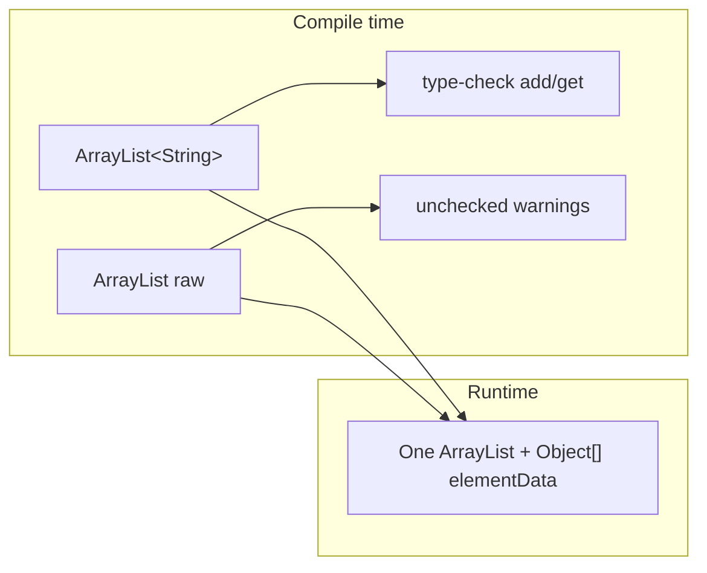

### Runtime layout (same for both declarations)

```text
ArrayList on heap
┌──────────────────────────────────────┐
│ elementData → Object[]               │
│ size        → int                      │
│ modCount    → int (iterator fail-fast) │
└──────────────────────────────────────┘
```

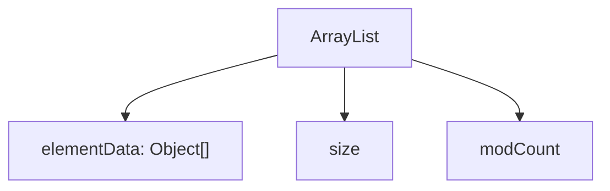

After `add("A"); add("B");` → `elementData[0]="A", [1]="B", size=2`.  
There is **no** `String[]` at runtime — only **`Object[]`** (type erasure).

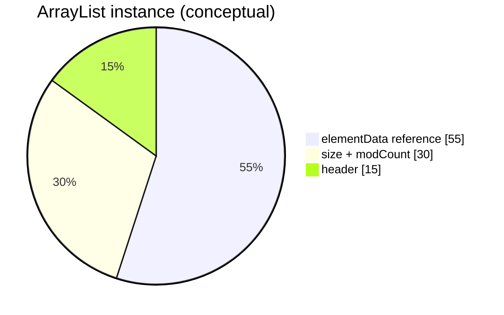

### Type erasure

```mermaid
sequenceDiagram
  participant Src as Source
  participant Comp as javac
  participant JVM as JVM
  Src->>Comp: ArrayList&lt;String&gt;
  Comp->>Comp: check String add/get
  Comp->>JVM: bytecode uses ArrayList + casts
  JVM->>JVM: new ArrayList(), Object[] inside
```

### `add` / `get` flows

```mermaid
flowchart TD
  ADD["l.add(\"hello\") generic"] --> C1{"String?"}
  C1 -- Yes --> M["add to elementData, size++"]
  GET["String s = l.get(0)"] --> CAST["compiler-inserted cast from Object"]
```

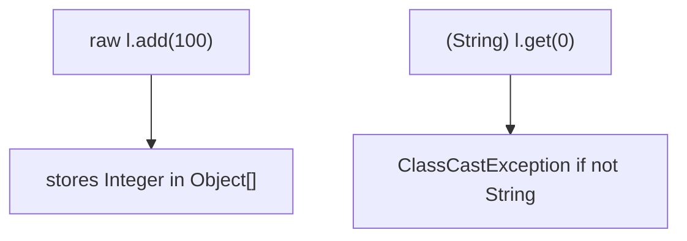

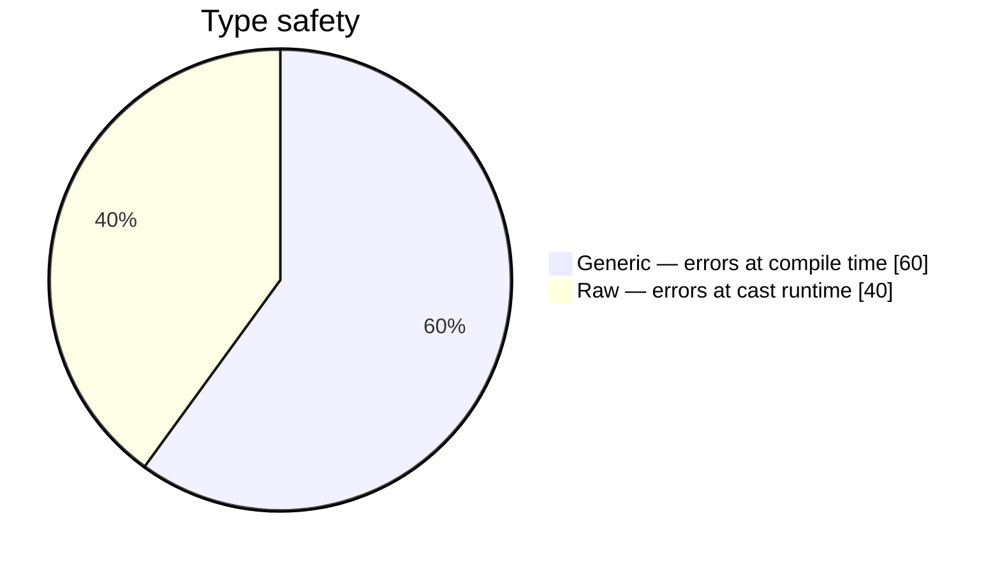

### Growth

When `size` exceeds capacity, `ArrayList` grows the `Object[]` (typically ~1.5×) and copies references.


### Examples

```java
ArrayList<String> g = new ArrayList<String>();
g.add("alpha");
// g.add(1);  // compile error
String x = g.get(0);

ArrayList raw = new ArrayList();
raw.add("alpha");
raw.add(99);
String y = (String) raw.get(0);

System.out.println(new ArrayList<String>().getClass()); // java.util.ArrayList
System.out.println(new ArrayList().getClass());         // java.util.ArrayList
```

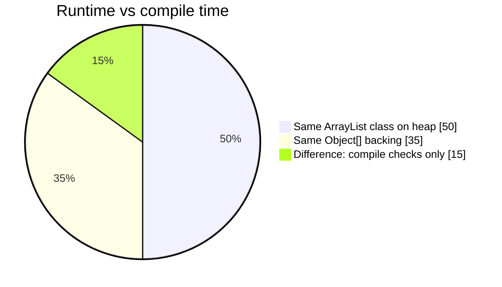

### Quick reference

| Question                                        | Answer                           |
| ----------------------------------------------- | -------------------------------- |
| Different memory layout for generic vs raw?     | **No**                           |
| `ArrayList<String>` uses `String[]` at runtime? | **No** — `Object[]`              |
| Why use generics?                               | Compile-time safety, fewer casts |

---

## Method overloading, type erasure, and name clash

Generics exist for the **compiler**. After compilation, the JVM sees **raw** types. That is why two methods that differ only by a **type parameter on a parameter** (for example `ArrayList<String>` vs `ArrayList<Integer>`) cannot both exist: after **type erasure** they become the **same method signature**.

### Classroom slide (compile-time flow)

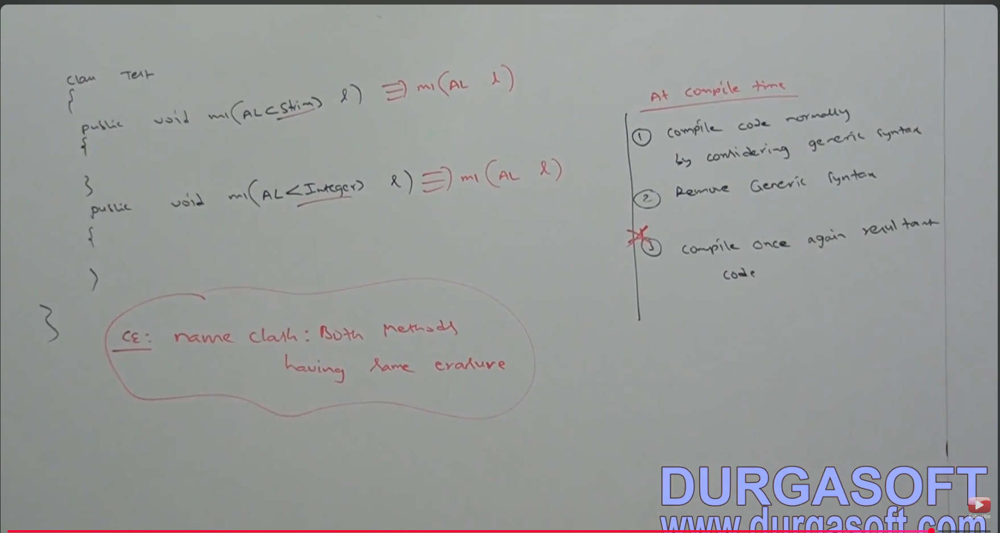

*Figure: two `m1` overloads look different in source, but both erase to `m1(ArrayList l)` → compile-time error (CE).*

### Source code that does not compile

```java
import java.util.ArrayList;

class Test {
    public void m1(ArrayList<String> l) {
        // ...
    }

    public void m1(ArrayList<Integer> l) {
        // ...
    }
}
```

| What you write (source) | After erasure (what the JVM would need) |
| ----------------------- | --------------------------------------- |
| `void m1(ArrayList<String> l)` | `void m1(ArrayList l)` |
| `void m1(ArrayList<Integer> l)` | `void m1(ArrayList l)` |

**Error (typical):** `name clash: m1(ArrayList<String>) and m1(ArrayList<Integer>) have the same erasure`

### Internal flow at compile time

`javac` does **not** ship separate “generic” and “erased” class files for this case. It must reject the program once erasure would create duplicate methods.

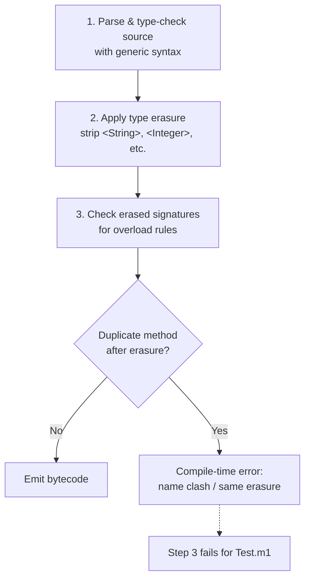

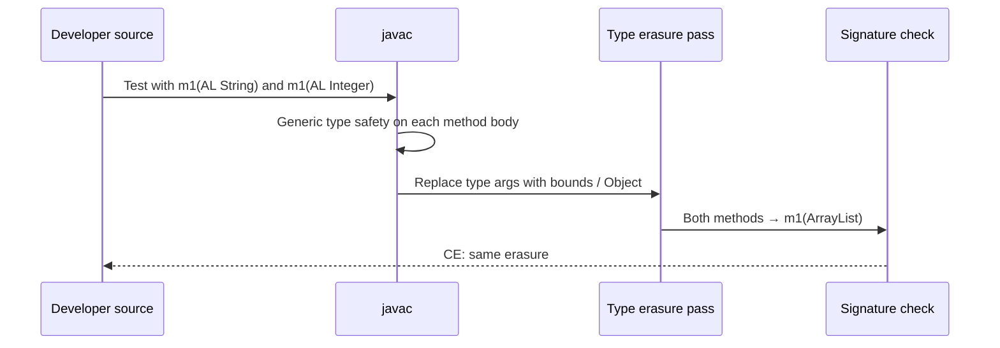

### Erasure arrows (parameter types only)

```text
public void m1(ArrayList<String> l)  ──erase──►  public void m1(ArrayList l)
public void m1(ArrayList<Integer> l) ──erase──►  public void m1(ArrayList l)
                                                      ▲
                                                      └── duplicate → CE
```

### Why runtime cannot tell them apart

At runtime there is **one** `ArrayList` class. Instances do not carry `String` vs `Integer` as part of the method’s parameter type in bytecode.

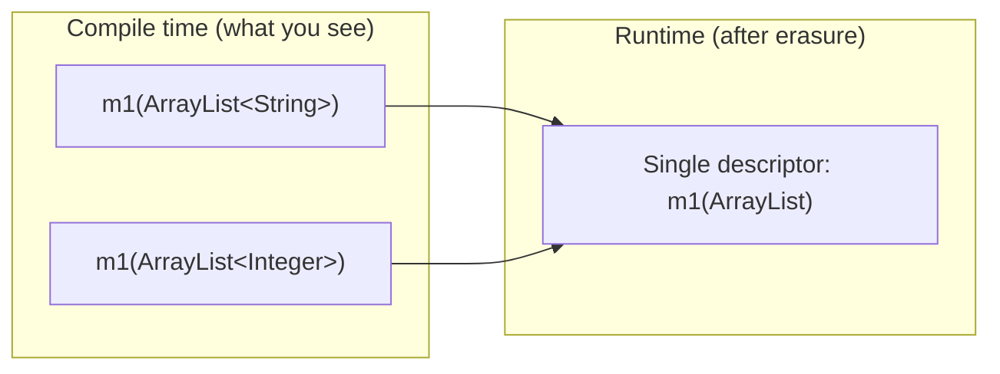

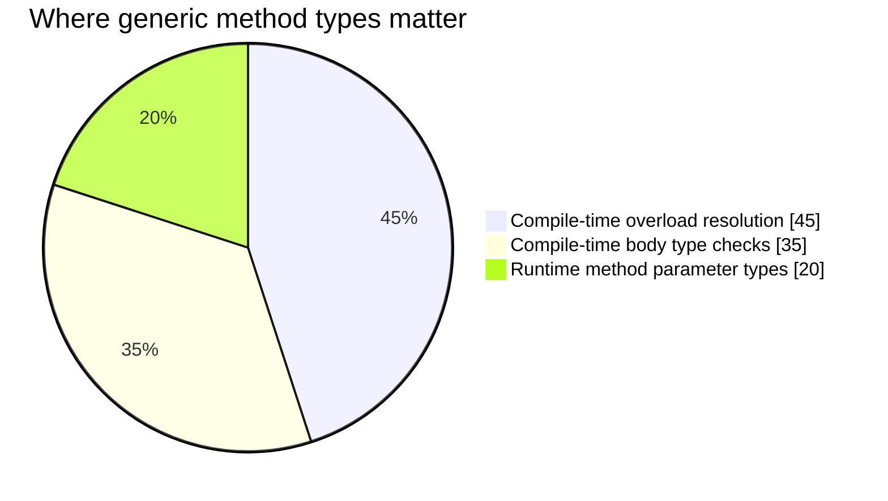

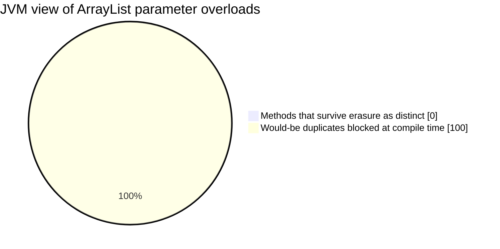

### What *is* allowed instead

Overload on **different raw or non-generic** parameter types, or use **different method names**. Generic **type parameters on the method itself** (`<T> void m1(T x)` vs `<U> void m1(U x)`) also erase in ways that do not create two `m1(ArrayList)` from the example above—but **two methods whose only difference is `ArrayList<SomeType>` on a parameter** are not allowed.

| Approach | Result |
| -------- | ------ |
| `m1(ArrayList<String>)` + `m1(ArrayList<Integer>)` | **Invalid** — same erasure |
| `m1(List<String>)` + `m1(List<Integer>)` | **Invalid** — same erasure (`List`) |
| `m1(ArrayList)` + `m1(LinkedList)` | **Valid** — different erased parameter types |
| `m1Strings(ArrayList<String>)` + `m1Ints(ArrayList<Integer>)` | **Valid** — different method names |

### Link to “generics only at compile time”

The same erasure rule appears later in this guide: sending values between generic and raw areas, wildcards, and bounded types are all checked **before** bytecode is produced. The closing note in [Generic Class & Method](#generic-class--method) applies here as well—**generics syntax is removed as a last compile step**, so the JVM never executes `ArrayList<String>` as a distinct parameter type.

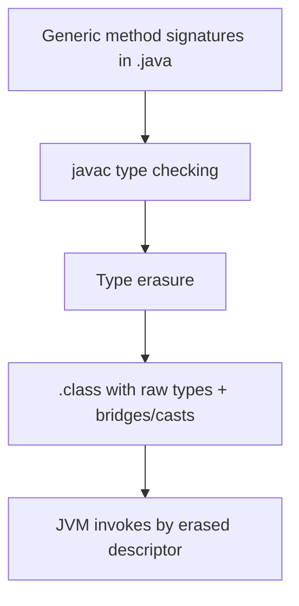

---

## See also

- [list.md — ArrayList execution flow](../collection/list.md#arraylist--complete-execution-flow-arraylistjava)
- [collections.md](../collection/collections.md)

Based on our requirement we can define our own generic classes also 

example : class Account<T>{}

Account<Gold> ac = new Account<Gold>();
Account<Platinum> ac = new Account<Platinum>();

As the type parameter we can pass any type and there are no restrictions and hence it is unbounded type 

syntax for bounded type 

class Test<T extends x>
{
   //
}

x can be either class or interface
if x is class is a class then add the type parameter we can pass either x type or its child classes 
if x is an interface then as a type parameter we can pass either x type or its implementation classes       

We can define bounded types even in combination also 

refer this progam 
>package com.generics.genericWithitsExtendedClasses;
>genericWithMultipleConditions

As the type parameter we can take anything which should be child class of Number and should implements Comparable interface

class Test<T extends Number& Runnable>//valid
class Test<T extends Number & Runnable & Comparable>//valid
class Test<T extends Runnable & Number> // invalid
because we have to take the class first followed by interface
class Test< T extends Number & Thread> // invalid 
because we can't extend more then one class at a time 

# NOTE 

1. We can define bounded types only by using "extends" keyword and we can't use implements and super keywords.
   but we can replace implements keyword purpose with extends keyword
2. As the type parameter <T> we can take any valid java identifier but it is convention to use <T>
3. Based on our requirement we can declare any number of type parameters and all these type parameters should be separated with comma ","

# Generic methods and Wild Card Character(?)

1. m1(ArrayList<String> l)
   We can call this method by passing array list of only String type 
   But within the method we can add only String type of objects to the list by mistake if we are trying to add any other type then we will 
   get compile time error 

   m1(ArrayList<String> l)
   {
   l.add("durga"); //valid 
   l.add("shiva"); //valid
   l.add(null);//valid
   l.add(10); // invalid 
   }
2. m1(ArrayList<?> l)
   We can call this method by passing arraylist of any type 
   But within the method we can't add anything to the list except null because we don't the type exactly 
   <null> is allowed because it is valid value for anytype 
   m1(ArrayList<?> l)
   {
   l.add("durga"); //invalid 
   l.add("shiva"); //invalid
   l.add(null);//valid
   l.add(10); // invalid 
   System.out.println(l); //valid
   }
   This type of methods are best suitable for readonly operation
3. m1(ArrayList< ? extends X > l)
   X can be either class or interface 
   If X is a class then we can call this method by passing ArrayList<either X type or its child classes>
   If X is an interface then we can call this method by passing ArrayLIst<either X type or its implemenation classes>
   But within the method we can't add anything to the list except null because we don't know the type of X exactly 
   This type of methods also best suitable for read only operation
4. m1(ArrayList< ? super X> l)
   X can be either class or interface 
   If X is a class then we can call this method by passing ArrayList<either X type or its super classes> 
   If X is an interface then we can call this method by passing ArrayLIst<either X type or its super class of implemenation classes>
   But within the method we can add X type of Objects and null to the list
   ### The Bound Architecture: Runnable Hierarchy Example
If `Runnable` is our interface base constraint:
* `Runnable` (Interface)
* `Object` (Implicit superclass of all classes/interfaces)

If we create a hierarchy where `Thread` implements `Runnable`:
`Object (Class) ──► Thread (Class) ──► Runnable (Interface)`

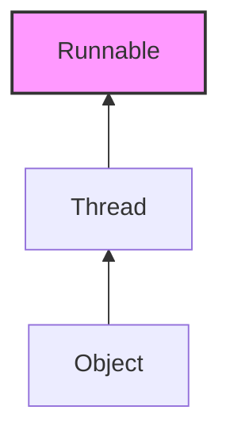

### Code Example Implementation
Below is how you define a method using wildcards to accept `Runnable` or its structural ancestors, allowing secure writing configurations.

```java
import java.util.ArrayList;
import java.util.List;

public class GenericsDemo {

    // Accepts an ArrayList of Runnable or any of its super types (like Object)
    public static void addRunnableAssignments(List<? super Runnable> list) {
        // We can safely add an implementation of Runnable
        list.add(new Thread(() -> System.test.println("Running Task")));
        
        // We can also add anonymous Runnable objects
        list.add(new Runnable() {
            @Override
            public void run() {
                System.out.println("Anonymous Task Running");
            }
        });
    }

    public static void main(String[] args) {
        // Scenario 1: ArrayList of the interface type itself
        List<Runnable> runnableList = new ArrayList<>();
        addRunnableAssignments(runnableList);

        // Scenario 2: ArrayList of a super type (Object is a superclass context of Runnable)
        List<Object> objectList = new ArrayList<>();
        addRunnableAssignments(objectList);
        
        // This provides complete flexibility while maintaining structural type safety at compile time.
    }
}
```
# Generic Class & Method 

We can decalare type parameter either at class level or at method level

>Declaring type parameter at class level 

class Test<T>
{
  we can use T within this class based on our requirement
}

>Declaring type parameter at method level 

class Test
{
  we have to declare type paramter just before return type 
  public <T> void m1(T object)
  {
     We can use T anywhere within this method based on our requirement
  }
}

We can define bounded types even at method level also 

public <T> void m1()
public < T extends Number>
public < T extends Runnable>
public < T extends Number & Runnable>
public < T extends Number & Comparable>
public < T extends Number & Comparable & Runnable>
public < T extends Comparable & Number>// invalid always class comes first then interfaces comes next 
public < T extends Number & Thread>// multiple inheritance is not allowed 

If we send generic object to non-generic area then it starts behaving like non-generic object similarly if we send non-generic object to generic area then it starts behaving like generic object i.e the locatoin in which object present based on that behaviour will be defined 

The main purpose of generics is to provide type safety and to resolve type-casting problems type safety and type casting both are applicable 
at compile time hence generics also applicable only at compile time but not at runtime. At the time of compilation as the last step geerics syantax will be removed and hence for the JVM generics syntax won't be available.


   


