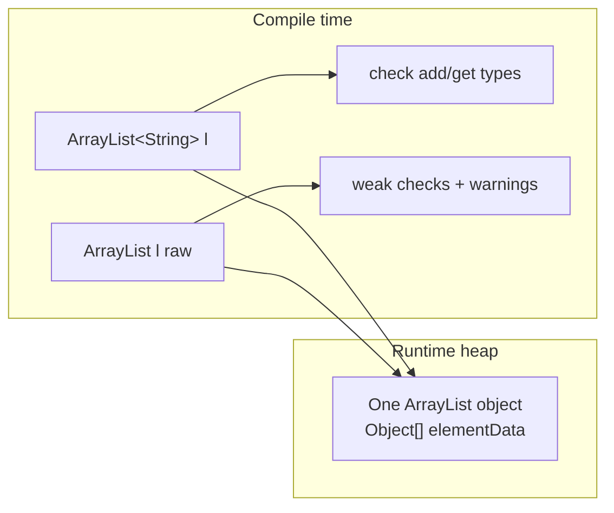
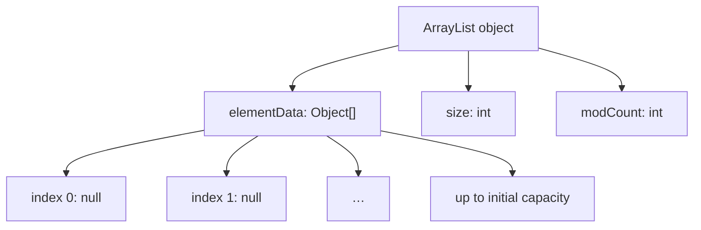
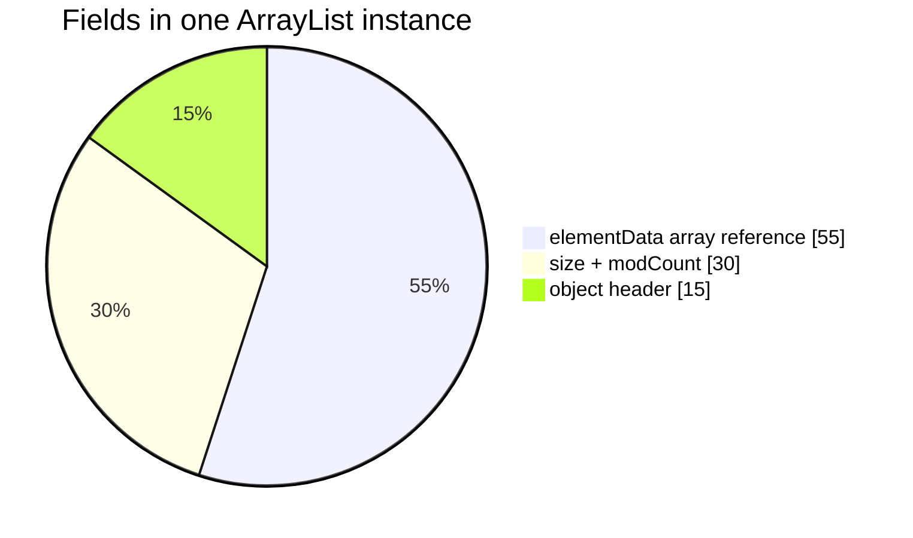
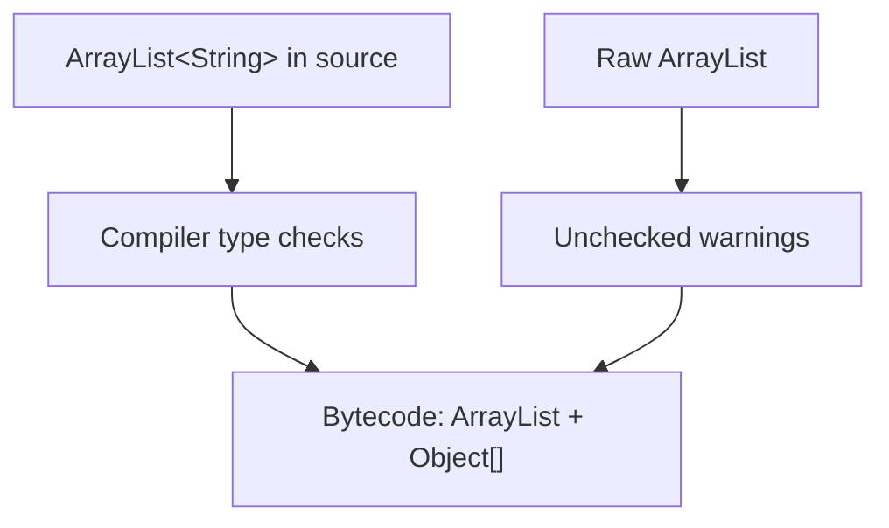
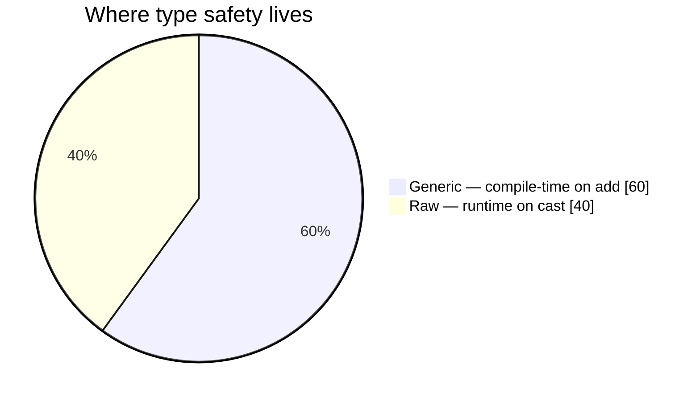
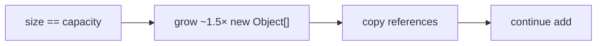
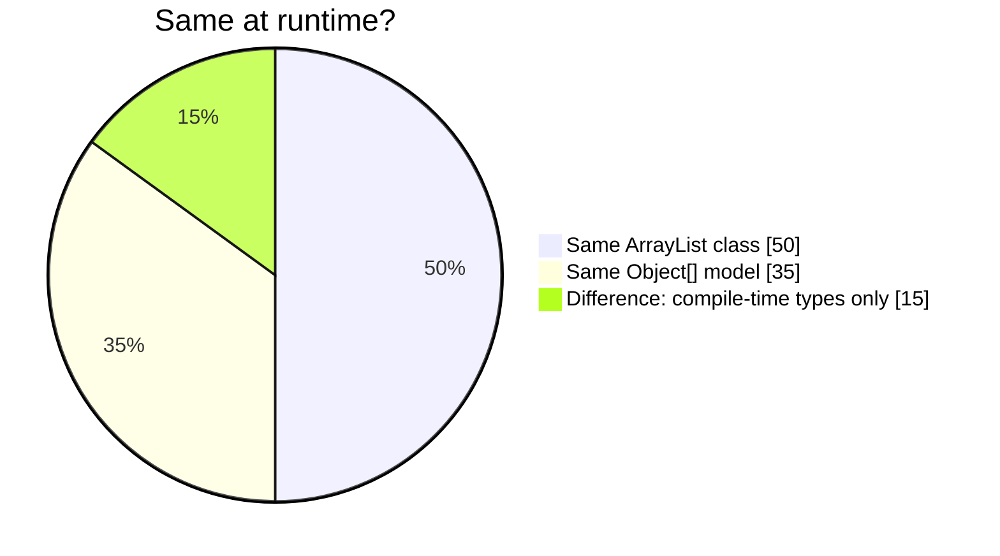
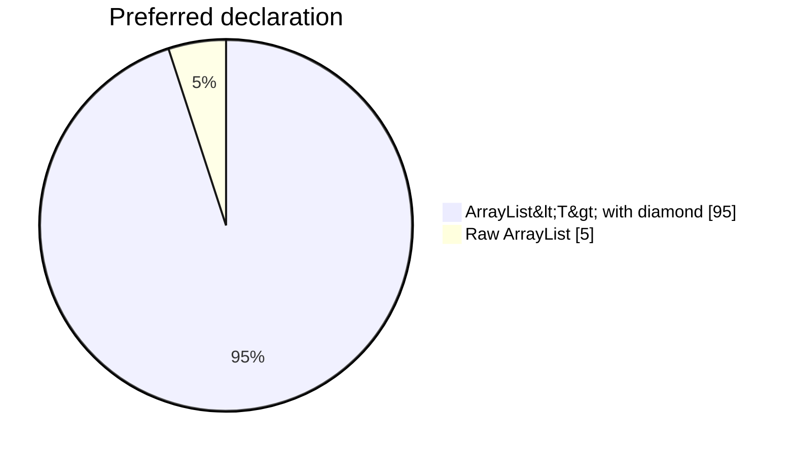

# Java Generics

> Copy-friendly guide (type safety, erasure, **`ArrayList<String>` vs raw `ArrayList`** internals).  
> Demo: [`arrayList.java`](../../../demo/src/main/java/com/collection/list/arrayList.java) · Lists: [list.md](../collection/list.md)

The main goals of generics are **type safety** at compile time and avoiding **unsafe casts** at retrieval.

---

## Guide map

| Section | Topic |
| ------- | ----- |
| [Case 1: Type safety](#case-1-type-safety) | Arrays vs non-generic collections |
| [Case 2: Type casting](#case-2-type-casting-and-collections) | Why casts were required before generics |
| [Conclusions](#conclusions) | Base type vs type parameter; no primitives |
| [Pre-1.5 `ArrayList`](#pre-15-non-generic-arraylist-api) | `Object` add/get |
| [ArrayList internals](#arraylist-internal-structure-generics-vs-raw) | **`ArrayList<String>`** vs **`ArrayList`** — heap layout, flowcharts |

---

## Case 1: Type safety

**Arrays are type-safe:** the element type is fixed at compile time.

```java
String[] s = new String[1000];
s[0] = "Shiva";
s[1] = "Shakthi";
// s[2] = new Integer(10);  // compile-time error: incompatible types
```

**Non-generic collections are not type-safe:** you can add any `Object`, and failures may appear only at **runtime**.

```java
ArrayList al = new ArrayList();
al.add("durga");
al.add("Lakshmi");
al.add(new Integer(10));

String name1 = (String) al.get(0);
String name2 = (String) al.get(1);
String name3 = (String) al.get(2);  // ClassCastException at runtime
```

**Generic `ArrayList<String>`** restores compile-time safety:

```java
ArrayList<String> l = new ArrayList<String>();
l.add("durga");   // OK
l.add("shiva");   // OK
// l.add(new Integer(10));  // compile-time error
```

---

## Case 2: Type casting and collections

| | Arrays | Non-generic `ArrayList` | `ArrayList<String>` |
| --- | ------ | ----------------------- | --------------------- |
| On **get** | No cast (`String s = arr[0]`) | Cast required `(String) al.get(0)` | No cast: `String s = l.get(0)` |
| Wrong element type | Blocked at **compile** time (arrays) | May fail at **runtime** on cast | Blocked at **compile** time on **add** |

---

## Conclusions

1. **Polymorphism applies to the base type, not the type parameter** (you can widen the collection interface, not the element type):

```java
ArrayList<String> l = new ArrayList<String>();  // base + parameter
List<String> l2 = new ArrayList<String>();      // OK
Collection<String> l3 = new ArrayList<String>(); // OK
// ArrayList<Object> l4 = new ArrayList<String>(); // compile error: incompatible types
```

2. **Type parameters** must be **reference types** (class or interface), not primitives:

```java
// ArrayList<int> l = new ArrayList<int>();  // compile error
```

---

## Pre-1.5 non-generic `ArrayList` API

Before Java 5, `ArrayList` was effectively:

```java
class ArrayList {
    void add(Object o);
    Object get(int index);
}
```

- **`add(Object)`** — any type could be stored → no type safety.  
- **`get()` returns `Object`** — retrieval required casting.

Generics fix this at **compile time**; runtime still uses **`Object[]`** inside `ArrayList` (see below).

---

## ArrayList internal structure: generics vs raw

This section answers: **`ArrayList<String> l = new ArrayList<String>()`** vs **`ArrayList l = new ArrayList()`** — same heap object or not?

**Short answer:** **Same runtime structure**; **different compile-time checking** (type erasure).

### Two declarations side by side

```java
ArrayList<String> l1 = new ArrayList<String>();  // generic (preferred)
ArrayList         l2 = new ArrayList();          // raw type (avoid in new code)
```

Modern style:

```java
ArrayList<String> l1 = new ArrayList<>();
```

| | `ArrayList<String> l = new ArrayList<String>()` | `ArrayList l = new ArrayList()` |
| --- | ----------------------------------------------- | ------------------------------- |
| **Variable type** | `ArrayList<String>` — element type **String** | **Raw** `ArrayList` |
| **Heap class** | `java.util.ArrayList` | **Same** `java.util.ArrayList` |
| **Bytecode / generics** | Compile-time checks; type args **erased** at runtime | Unchecked warnings |
| **`l.add("hi")`** | OK | OK |
| **`l.add(42)`** | **Compile error** | **Allowed** (unsafe) |
| **`String s = l.get(0)`** | OK without cast | Cast: `(String) l.get(0)` |
| **Use in new code** | **Yes** | Legacy only |



### Runtime internal structure (one heap object)

After **`new ArrayList()`** or **`new ArrayList<String>()`**, the JVM creates **one** `ArrayList`. Generics do **not** create a separate “String ArrayList” class.

```text
ArrayList instance (heap)
┌─────────────────────────────────────────────┐
│  elementData  ──►  Object[]  (length ≥ capacity)
│  size         ──►  int (elements in use, 0 at start)
│  modCount     ──►  int (iterator fail-fast counter)
└─────────────────────────────────────────────┘

Default no-arg path: capacity growth from DEFAULT_CAPACITY (10) when needed; size = 0
```



After `l.add("A"); l.add("B");` (generic or raw):

```text
elementData: [0]="A"  [1]="B"  [2]=null …
size = 2
```

At runtime the backing store is **`Object[]`**, not `String[]`. Type parameter **`String`** exists for the **compiler only** (erasure).



### Compile time vs runtime (type erasure)

```mermaid
sequenceDiagram
  participant Dev as Source code
  participant Comp as javac
  participant JVM as JVM

  Dev->>Comp: ArrayList&lt;String&gt; l = new ArrayList&lt;&gt;()
  Comp->>Comp: Type-check add/get as String
  Comp->>JVM: bytecode with ArrayList + casts
  JVM->>JVM: new ArrayList() — single class
  Note over JVM: No String field on ArrayList instance
```



| Phase | `ArrayList<String>` | Raw `ArrayList` |
| ----- | ------------------- | --------------- |
| **Compile** | `add` must be `String` | `add` accepts any `Object` |
| **Runtime class** | `ArrayList` | `ArrayList` |
| **Backing array** | `Object[]` | `Object[]` |

### Operation flows: `add` and `get`

**Generic:**

```mermaid
flowchart TD
  ADD["l.add(\"hello\")"] --> C1{"Compiler: String?"}
  C1 -- Yes --> M1["ArrayList.add(E)"]
  M1 --> G1["ensure capacity"]
  G1 --> W1["elementData[size++] = ref"]
  GET["String s = l.get(0)"] --> M2["get returns Object"]
  M2 --> C2["compiler-inserted cast to String"]
```

**Raw misuse:**

```mermaid
flowchart TD
  ADD["l.add(100)"] --> OK["Integer in Object[]"]
  ADD2["l.add(\"text\")"] --> OK2["Also compiles"]
  GET["(String) l.get(0)"] --> RUN["ClassCastException if wrong slot"]
```



### Growth (same for both)



### Code examples

```java
// Generic (recommended)
ArrayList<String> l = new ArrayList<String>();
l.add("alpha");
// l.add(1);  // compile error
String first = l.get(0);

// Raw (legacy)
ArrayList raw = new ArrayList();
raw.add("alpha");
raw.add(99);
String x = (String) raw.get(0);

// Same runtime class
System.out.println(new ArrayList<String>().getClass()); // class java.util.ArrayList
System.out.println(new ArrayList().getClass());         // class java.util.ArrayList
```

### Summary pie charts





### Quick reference

| Question | Answer |
| -------- | ------ |
| Different internal layout? | **No** — same `elementData`, `size`, `modCount` |
| `ArrayList<String>` uses `String[]` at runtime? | **No** — `Object[]` after erasure |
| Why generics? | Compile-time safety, fewer casts |
| Why avoid raw types? | `ClassCastException` at retrieval |

---

## See also

- [list.md — ArrayList execution flow](../collection/list.md#arraylist--complete-execution-flow-arraylistjava)
- [collections.md](../collection/collections.md) — Java Collections hub
