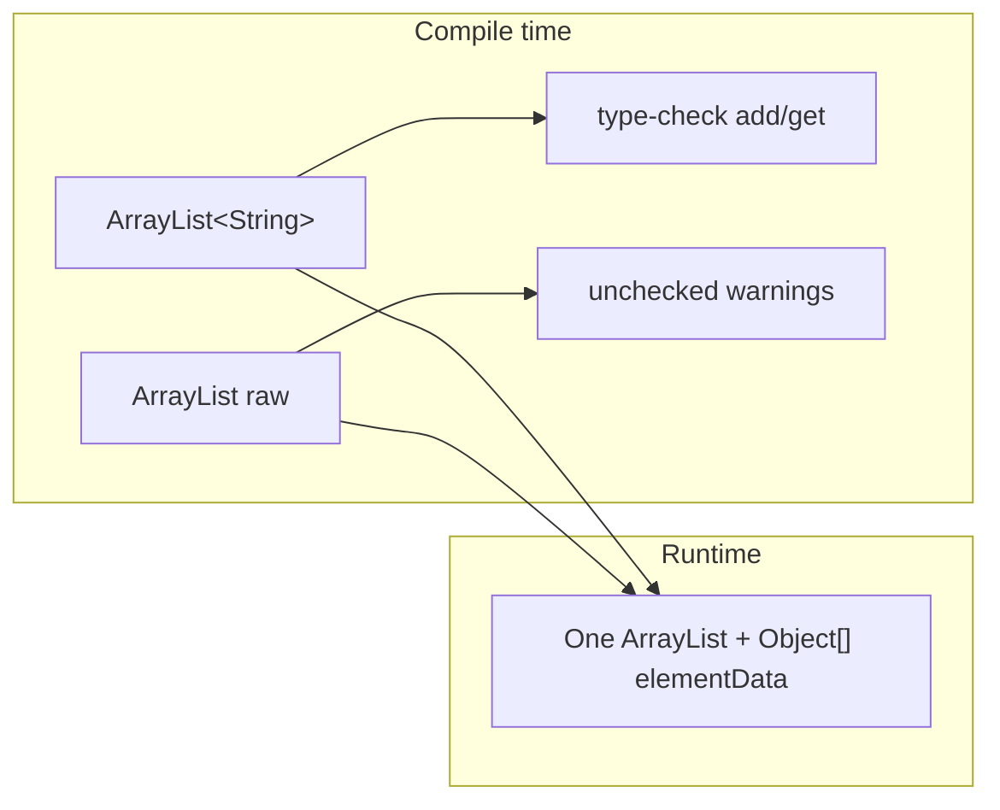
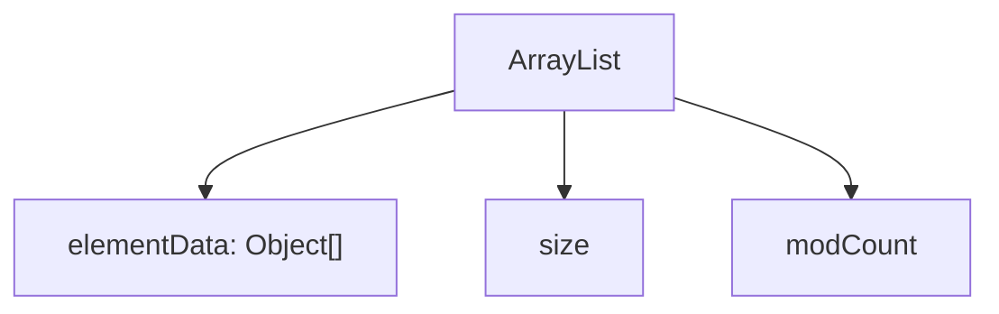
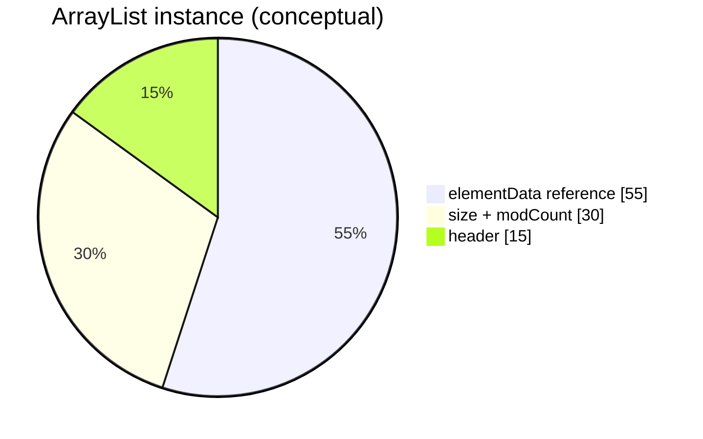
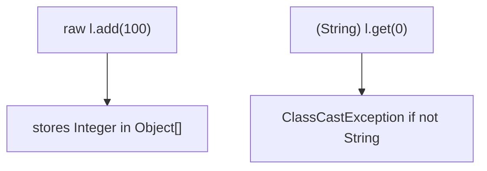
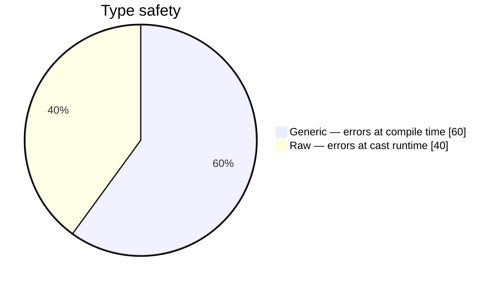
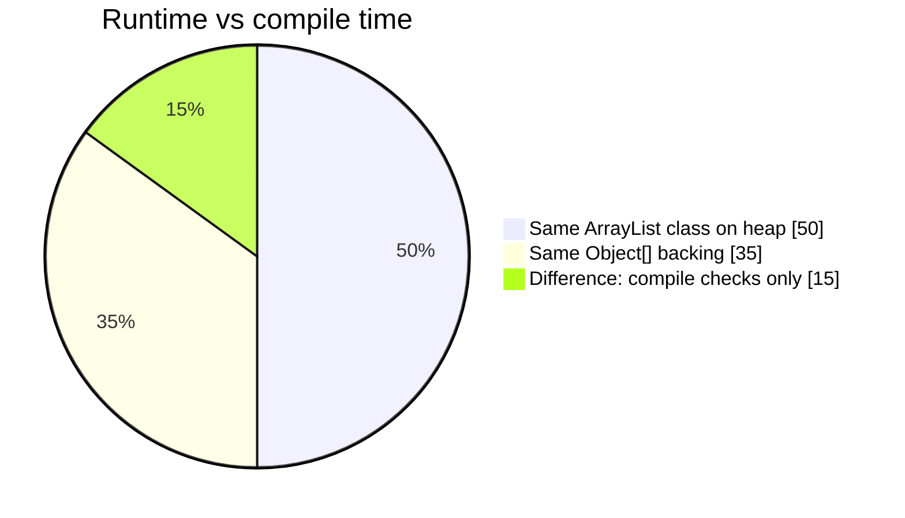

# Java Generics

> Copy-friendly guide: type safety, type erasure, **`ArrayList<String>` vs raw `ArrayList`** internals.  
> Demo: [`arrayList.java`](../../../demo/src/main/java/com/collection/list/arrayList.java) · Lists: [list.md](../collection/list.md)

The main objectives of generics are to provide **type safety** and to resolve **type-casting** problems.

---

## Guide map

| Section | Topic |
| ------- | ----- |
| [Case 1: Type safety](#case-1-type-safety) | Arrays vs non-generic collections |
| [Case 2: Type casting](#case-2-type-casting-and-collections) | Why casts were required before generics |
| [Conclusions](#conclusions) | Base type vs type parameter; no primitives |
| [Pre-1.5 `ArrayList`](#pre-15-non-generic-arraylist-api) | `Object` add/get |
| [ArrayList internals](#arraylist-internal-structure-generics-vs-raw) | **`ArrayList<String>`** vs **`ArrayList`** — heap layout, flowcharts |

---

## Case 1: Type safety

Arrays are **type-safe**: we can guarantee the type of elements in the array.

Example: to hold only `String` objects, use a `String[]`. If we try to add another type, we get a **compile-time error** (`incompatible types`).

```java
String[] s = new String[1000];
s[0] = "Shiva";
s[1] = "Shakthi";
// s[2] = new Integer(10);  // compile-time error: incompatible types
```

Collections (without generics) are **not type-safe**: we cannot guarantee element types. Wrong types may compile but fail at **runtime**.

```java
ArrayList al = new ArrayList();
al.add("durga");
al.add("Lakshmi");
al.add(new Integer(10));

String name1 = (String) al.get(0);
String name2 = (String) al.get(1);
String name3 = (String) al.get(2);  // ClassCastException at runtime
```

Hence collections were not type-safe until generics.

**Generic fix:**

```java
ArrayList<String> l = new ArrayList<String>();
l.add("durga");   // valid
l.add("shiva");   // valid
// l.add(new Integer(10));  // compile-time error
```

---

## Case 2: Type casting and collections

For **arrays**, at retrieval **type casting is not required** (element type is known).

```java
String[] s = new String[1000];
s[0] = "Shiva";
String name = s[0];  // no cast
```

For **non-generic collections**, at retrieval **type casting is mandatory** (no guarantee on element type).

```java
ArrayList al = new ArrayList();
al.add("durga");
String name1 = (String) al.get(0);  // cast required
```

For **`ArrayList<String>`**, at retrieval **casting is not required**:

```java
ArrayList<String> l = new ArrayList<String>();
l.add("durga");
String name = l.get(0);  // no cast
```

| | Arrays | Raw `ArrayList` | `ArrayList<String>` |
| --- | ------ | --------------- | ------------------- |
| **On get** | No cast | Cast required | No cast |
| **Wrong type on add** | Compile error (arrays) | Runtime `ClassCastException` | Compile error on add |

---

## Conclusions

1. **Polymorphism applies only to the base type, not the type parameter** (parent reference to hold child collection type is OK; mismatched type parameters are not):

```java
ArrayList<String> l = new ArrayList<String>();   // base + parameter
List<String> l2 = new ArrayList<String>();      // OK
Collection<String> l3 = new ArrayList<String>(); // OK
// ArrayList<Object> l4 = new ArrayList<String>(); // error: incompatible types
//   found: ArrayList<String>, required: ArrayList<Object>
```

2. Type parameters must be **reference types** (class or interface), **not primitives**:

```java
// ArrayList<int> l = new ArrayList<int>();  // compile error: unexpected type
```

---

## Pre-1.5 non-generic `ArrayList` API

Until Java 1.5, a non-generic `ArrayList` was effectively:

```java
class ArrayList {
    void add(Object o);
    Object get(int index);
}
```

- `add(Object)` — any object could be added → no type safety.  
- `get()` returns `Object` → casting required at retrieval.

---

## ArrayList internal structure: generics vs raw

Compare:

```java
ArrayList<String> l1 = new ArrayList<String>();  // generic (preferred)
ArrayList         l2 = new ArrayList();          // raw type (avoid in new code)
```

Modern style: `ArrayList<String> l1 = new ArrayList<>();`

| | `ArrayList<String>` | Raw `ArrayList` |
| --- | ------------------- | --------------- |
| **Variable type** | `ArrayList<String>` | Raw `ArrayList` |
| **Heap class** | `java.util.ArrayList` | **Same** |
| **`l.add("hi")`** | OK | OK |
| **`l.add(42)`** | **Compile error** | Allowed (unsafe) |
| **`String s = l.get(0)`** | OK | `(String) l.get(0)` |
| **Generics at runtime** | Type args **erased** | Same erasure |



### Runtime layout (same for both declarations)

```text
ArrayList on heap
┌──────────────────────────────────────┐
│ elementData → Object[]               │
│ size        → int                      │
│ modCount    → int (iterator fail-fast) │
└──────────────────────────────────────┘
```



After `add("A"); add("B");` → `elementData[0]="A", [1]="B", size=2`.  
There is **no** `String[]` at runtime — only **`Object[]`** (type erasure).



### Type erasure

```mermaid
sequenceDiagram
  participant Src as Source
  participant Comp as javac
  participant JVM as JVM
  Src->>Comp: ArrayList&lt;String&gt;
  Comp->>Comp: check String add/get
  Comp->>JVM: bytecode uses ArrayList + casts
  JVM->>JVM: new ArrayList(), Object[] inside
```

### `add` / `get` flows

```mermaid
flowchart TD
  ADD["l.add(\"hello\") generic"] --> C1{"String?"}
  C1 -- Yes --> M["add to elementData, size++"]
  GET["String s = l.get(0)"] --> CAST["compiler-inserted cast from Object"]
```





### Growth

When `size` exceeds capacity, `ArrayList` grows the `Object[]` (typically ~1.5×) and copies references.


### Examples

```java
ArrayList<String> g = new ArrayList<String>();
g.add("alpha");
// g.add(1);  // compile error
String x = g.get(0);

ArrayList raw = new ArrayList();
raw.add("alpha");
raw.add(99);
String y = (String) raw.get(0);

System.out.println(new ArrayList<String>().getClass()); // java.util.ArrayList
System.out.println(new ArrayList().getClass());         // java.util.ArrayList
```



### Quick reference

| Question | Answer |
| -------- | ------ |
| Different memory layout for generic vs raw? | **No** |
| `ArrayList<String>` uses `String[]` at runtime? | **No** — `Object[]` |
| Why use generics? | Compile-time safety, fewer casts |

---

## See also

- [list.md — ArrayList execution flow](../collection/list.md#arraylist--complete-execution-flow-arraylistjava)
- [collections.md](../collection/collections.md)
