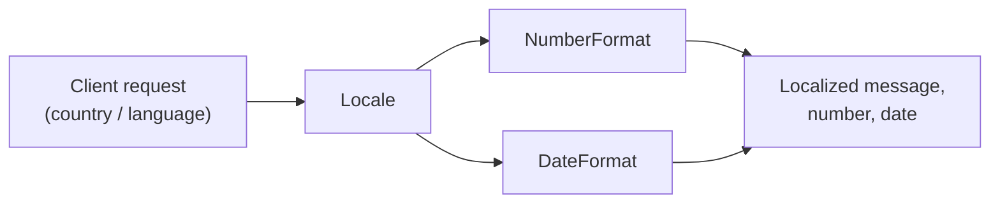
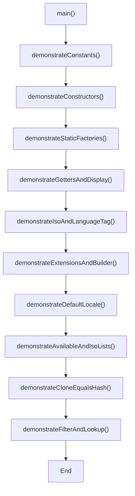
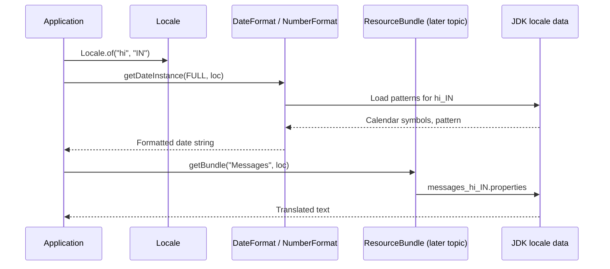
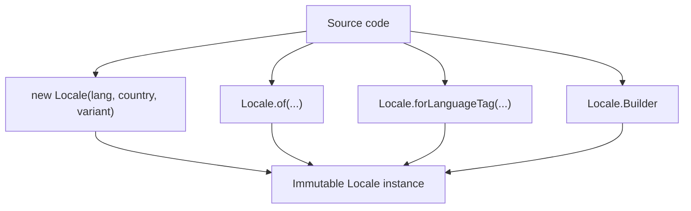
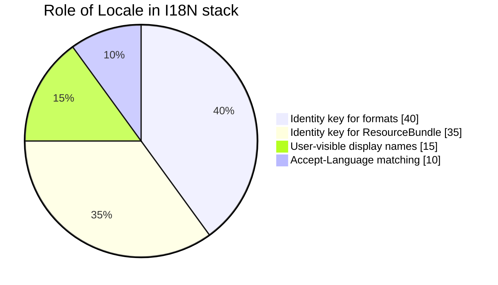

# Java Internationalization (I18N)

> Study guide: **Locale** fundamentals, runnable API tour, execution flow, and JVM internals.  
> Demo: [`localeClass.java`](../../../demo/src/main/java/com/internationalization/localeClass.java)

> **Navigation:** Use **Ctrl+click** on Guide map / TOC links to jump to a section in preview.

## Guide map

| Jump to | Topic |
| ------- | ----- |
| [Introduction](#introduction) | What is I18N |
| [Locale class](#locale-class) | Role of `Locale` |
| [Constructors & constants](#constructors) | How to build locales |
| [Important methods](#important-methods-of-locale-class) | API groups |
| [localeClass.java execution summary](#localeclassjava--execution-summary) | Program walkthrough |
| [Deep internal flow](#locale--deep-internal-flow) | JVM / BCP 47 / defaults |

---

<!-- TOC -->
- [Java Internationalization (I18N)](#java-internationalization-i18n)
  - [Guide map](#guide-map)
  - [Introduction](#introduction)
  - [Locale class](#locale-class)
  - [Constructors](#constructors)
  - [Important methods of Locale class](#important-methods-of-locale-class)
  - [localeClass.java — execution summary](#localeclassjava--execution-summary)
  - [Locale — deep internal flow](#locale--deep-internal-flow)
  - [See also](#see-also)
<!-- /TOC -->

---

## Introduction

The process of designing web applications in such a way that which provides support for various countries and various languages and various currencies automatically without performing any change in the application, is called internationalization(I18N)

For example:

If the request is coming from India then the response should be Indian people understandable form and if the request is coming from USA then the response should be in US people understandable form.

We can implement internationalization by using the following 3 classes

1. Locale
2. NumberFormat
3. DateFormat



---

## Locale class

A locale object represents a geographic location(country) or language or both

example : We can create a locale object to represent india

We can create a locale object to represent English language

1. Locale class present in java.util package
2. It is a final classs and it is the direct child class of object
3. It implements Serializable and Cloneable interfaces

At runtime a `Locale` is an **immutable value object**: once built, language / region / variant / extensions do not change. Formatting classes (`NumberFormat`, `DateFormat`, `ResourceBundle`) read a `Locale` to pick patterns and translated resources.

---

## Constructors

> Locale l = new Locale(String language);
> Locale l = new Locale(String language , String country);

There is also `Locale(String language, String country, String variant)` and the preferred modern factories `Locale.of(...)` (see demo).

Locale class already defined some constants to represent some standard locales we can use these constants directly  
Ex: Locale.US  
    Locale.Nederlands  
    Locale.Germany  
    Locale.English

| Style | Example | Notes |
| ----- | ------- | ----- |
| Constant | `Locale.US`, `Locale.GERMANY`, `Locale.ENGLISH` | Shared, JVM-wide instances |
| Constructor | `new Locale("hi", "IN")` | Still supported; prefer `Locale.of` in new code |
| Factory | `Locale.of("hi", "IN")` | Validates ISO codes where applicable |
| BCP 47 tag | `Locale.forLanguageTag("en-GB")` | Parses `language-script-region` strings |
| Builder | `new Locale.Builder().setLanguage("en").setRegion("GB").build()` | Extensions, Unicode keywords |

---

## Important methods of Locale class

The demo class [`localeClass.java`](../../../demo/src/main/java/com/internationalization/localeClass.java) exercises the public API in groups below.

### Identity & string form

| Method | Purpose |
| ------ | ------- |
| `getLanguage()`, `getCountry()`, `getVariant()`, `getScript()` | Raw identifiers stored in the locale |
| `toString()` | Legacy form e.g. `en_US` |
| `toLanguageTag()` | BCP 47 tag e.g. `en-US` |
| `forLanguageTag(String)`, `caseFoldLanguageTag(String)` | Parse / normalize tags |

### Human-readable labels (for UI)

| Method | Purpose |
| ------ | ------- |
| `getDisplayLanguage()`, `getDisplayCountry()`, `getDisplayName()` | Names in the **default** locale |
| `getDisplayLanguage(Locale)`, `getDisplayCountry(Locale)`, … | Names in a **target** locale (e.g. show “Hindi” to a US user) |
| `getDisplayScript()`, `getDisplayVariant()` | Script / variant labels |

### ISO helpers

| Method | Purpose |
| ------ | ------- |
| `getISO3Language()`, `getISO3Country()` | Three-letter ISO codes (`eng`, `USA`) |
| `getISOCountries()`, `getISOLanguages()` | Full code lists |
| `getISOCountries(IsoCountryCode)` | e.g. alpha-2 set as `Set<String>` |

### JVM default locale

| Method | Purpose |
| ------ | ------- |
| `getDefault()` | Locale used when no locale is passed explicitly |
| `getDefault(Category)` | `DISPLAY` vs `FORMAT` (and other categories) |
| `setDefault(Locale)`, `setDefault(Category, Locale)` | Change defaults for this JVM (global side effect) |

### Discovery

| Method | Purpose |
| ------ | ------- |
| `getAvailableLocales()` | All locales the runtime knows |
| `availableLocales()` | Same data as a `Stream<Locale>` |

### Extensions & builder

| Method | Purpose |
| ------ | ------- |
| `hasExtensions()`, `stripExtensions()`, `getExtension(char)` | BCP 47 extensions (calendar, numbering, etc.) |
| `getUnicodeLocaleKeys()`, `getUnicodeLocaleType(String)` | Unicode locale extension keys |
| `Locale.Builder` | Fluent construction with `setScript`, `setUnicodeLocaleKeyword`, … |

### Matching (HTTP-style)

| Method | Purpose |
| ------ | ------- |
| `LanguageRange.parse(...)` | Parse `Accept-Language` quality lists |
| `filter`, `filterTags` | Rank locales or tags by preference |
| `lookup`, `lookupTag` | Pick best single match |

### Object protocol

| Method | Purpose |
| ------ | ------- |
| `equals`, `hashCode` | Value equality on language/region/variant/extensions |
| `clone()` | Returns another equal `Locale` instance |

---

## localeClass.java — execution summary

Run from `demo/src/main/java`:

```bash
javac com/internationalization/localeClass.java
java com.internationalization.localeClass
```



| Step | What runs | What you learn |
| ---- | --------- | -------------- |
| 1. Constants | `Locale.US`, `GERMANY`, `ENGLISH`, `ROOT`, … | Predefined locales are shared singleton-like constants |
| 2. Constructors | `new Locale(lang)`, `(lang, country)`, `(lang, country, variant)` | Classic triple: language → region → variant |
| 3. Factories | `Locale.of`, `forLanguageTag`, `caseFoldLanguageTag` | Preferred parsing / creation; tags like `zh-Hans-CN` |
| 4. Getters & display | `hi_IN` + `getDisplayName(Locale.US)` | Machine ids vs human labels |
| 5. ISO3 | `getISO3Language` / `getISO3Country` on `Locale.US` | Legacy three-letter codes from ISO tables |
| 6. Builder | `Locale.Builder` + Unicode keyword `nu=latn` | Extensions affect formatting without new language |
| 7. Default locale | `getDefault`, `setDefault`, categories, **restore** | Defaults drive `DateFormat` / `NumberFormat` when omitted |
| 8. Available / ISO lists | `getAvailableLocales()` length, sample ISO arrays | JDK ships many locale data bundles |
| 9. equals / clone | Two `en_US` locales compare equal | Immutability + value semantics |
| 10. filter / lookup | `LanguageRange.parse("en-US;q=0.9,...")` | Same algorithm family as servlet `Accept-Language` |

**Sample console excerpt**

```text
Locale.of("hi", "IN") -> hi_IN
getDisplayName(Locale.US) -> Hindi (India)
After setDefault(fr_FR), getDefault() = fr_FR
filter(ranges, locales) -> [en_US, en_GB, fr_FR]
lookup(ranges, locales) -> en_US
```

---

## Locale — deep internal flow

### 1. What a `Locale` stores (conceptual)

Modern JDK implementations split data into:

- **Base locale** — language, script, region, variant (the “core” identity).
- **Locale extensions** — optional BCP 47 extensions (calendar `ca`, numbering `nu`, etc.) and Unicode keywords.

```text
Locale value (immutable)
┌─────────────────────────────────────────┐
│ language  (ISO 639)     e.g. "en"       │
│ script    (optional)    e.g. "Latn"     │
│ region    (ISO 3166)    e.g. "US"       │
│ variant   (optional)    e.g. "POSIX"    │
│ extensions map          e.g. nu=latn    │
└─────────────────────────────────────────┘
```

`toLanguageTag()` serializes this into a single HTTP-friendly string (`en-US-u-nu-latn`). `forLanguageTag()` parses it back.

### 2. From your code to localized output



`Locale` itself does **not** load property files; it is only the **key** that formatting and bundle lookup use.

### 3. Default locale resolution

When the JVM starts, default locales come from environment and system properties (e.g. `user.language`, `user.country`, `user.script`) and locale providers (JDK / CLDR / host OS).

| API | Typical use |
| --- | ----------- |
| `Locale.getDefault()` | General default |
| `Locale.Category.DISPLAY` | Labels, UI language |
| `Locale.Category.FORMAT` | Dates, numbers, currencies |

`setDefault` updates static fields inside `Locale` (synchronized). That is why the demo **restores** previous defaults after testing — otherwise later code in the same JVM would see French / US format unexpectedly.

### 4. Constructors vs `Locale.of` vs `Builder`



- **Constructors** normalize and validate less strictly than `of` / `Builder` in edge cases.
- **`Builder`** is required for some extension and Unicode keyword combinations.
- All paths end in the same immutable type used by `equals` / `hashCode`.

### 5. `getDisplay*` internals (high level)

Display methods consult **JDK locale data** (CLDR-based in modern JDKs) to map `hi` + `IN` to “Hindi (India)” in the **requested display locale**. That is why `getDisplayName(Locale.US)` and `getDisplayName()` may differ when the JVM default is not US English.

### 6. Filter / lookup (internal behavior)

`LanguageRange.parse` builds weighted ranges (`en-US;q=0.9`). `filter` sorts candidate locales by best matching range; `lookup` returns the first acceptable match — the same model used when a server chooses a resource bundle from `Accept-Language`.

### 7. Serialization & cloning

`Locale` implements `Serializable` so locales can travel in sessions or RMI graphs. `clone()` returns a new instance with identical fields (still immutable in practice).



---

## See also

- Run next topics in the same guide (when added): **NumberFormat**, **DateFormat**
- [`localeClass.java`](../../../demo/src/main/java/com/internationalization/localeClass.java) — full API demonstration
