# Java Internationalization (I18N)

> Study guide: **Locale**, **NumberFormat**, and **DateFormat** — runnable demos, execution summaries, and internal flows.  
> Packages: `com.advanced.internationalization` · `com.advanced.internationalization.classes`

> **Navigation:** Use **Ctrl+click** (Cmd+click on macOS) on Guide map or TOC links to jump to any topic.

| Demo | Source |
| ---- | ------ |
| Locale | [`localeClass.java`](../../../demo/src/main/java/com/advanced/internationalization/classes/localeClass.java) |
| NumberFormat | [`NumberFormat.java`](../../../demo/src/main/java/com/advanced/internationalization/classes/NumberFormat.java) |
| DateFormat (API tour) | [`DateFormat.java`](../../../demo/src/main/java/com/advanced/internationalization/classes/DateFormat.java) |
| String → `Date` (dynamic) | [`dateFormatClassDemo.java`](../../../demo/src/main/java/com/advanced/internationalization/dateFormatClassDemo.java) |

## Guide map

| Jump to | Topic |
| ------- | ----- |
| [Introduction](#introduction) | What is I18N |
| [Locale class](#locale-class) | `java.util.Locale` |
| [localeClass.java execution summary](#localeclassjava-execution-summary) | Locale demo walkthrough |
| [Locale deep internal flow](#locale-deep-internal-flow) | BCP 47, defaults, bundles |
| [NumberFormat class](#numberformat-class) | `java.text.NumberFormat` |
| [NumberFormat.java execution summary](#numberformatjava-execution-summary) | Number demo walkthrough |
| [NumberFormat deep internal flow](#numberformat-deep-internal-flow) | Formatting pipeline |
| [DateFormat class](#dateformat-class) | `java.text.DateFormat` |
| [converStringToJavaDateForm()](#converstringtojavadateform-end-to-end) | Dynamic string → `Date` |
| [DateFormat.java execution summary](#dateformatjava-execution-summary) | Date demo walkthrough |
| [DateFormat deep internal flow](#dateformat-deep-internal-flow) | Calendar, patterns, TZ |
| [End-to-end I18N flow](#end-to-end-i18n-flow) | Locale → formats |
| [Run all demos](#run-all-demos) | Compile & run commands |

---

<!-- TOC -->
- [Java Internationalization (I18N)](#java-internationalization-i18n)
  - [Guide map](#guide-map)
  - [Introduction](#introduction)
  - [Locale class](#locale-class)
    - [Constructors](#constructors)
    - [Important methods of Locale class](#important-methods-of-locale-class)
    - [localeClass.java execution summary](#localeclassjava-execution-summary)
    - [Locale deep internal flow](#locale-deep-internal-flow)
  - [NumberFormat class](#numberformat-class)
    - [NumberFormat factories and configuration](#numberformat-factories-and-configuration)
    - [NumberFormat.java execution summary](#numberformatjava-execution-summary)
    - [NumberFormat deep internal flow](#numberformat-deep-internal-flow)
  - [DateFormat class](#dateformat-class)
    - [DateFormat styles and factories](#dateformat-styles-and-factories)
    - [converStringToJavaDateForm() end-to-end](#converstringtojavadateform-end-to-end)
    - [DateFormat.java execution summary](#dateformatjava-execution-summary)
    - [DateFormat deep internal flow](#dateformat-deep-internal-flow)
  - [End-to-end I18N flow](#end-to-end-i18n-flow)
  - [Run all demos](#run-all-demos)
<!-- /TOC -->

---

## Introduction

The process of designing web applications in such a way that which provides support for various countries and various languages and various currencies automatically without performing any change in the application, is called internationalization(I18N)

For example:

If the request is coming from India then the response should be Indian people understandable form and if the request is coming from USA then the response should be in US people understandable form.

We can implement internationalization by using the following 3 classes

1. Locale
2. NumberFormat
3. DateFormat

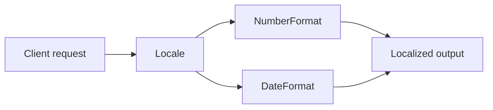

---

## Locale class

A locale object represents a geographic location(country) or language or both

example : We can create a locale object to represent india

We can create a locale object to represent English language

1. Locale class present in java.util package
2. It is a final classs and it is the direct child class of object
3. It implements Serializable and Cloneable interfaces

At runtime a `Locale` is an **immutable value object**. `NumberFormat` and `DateFormat` use it to select patterns and symbols.

### Constructors

> Locale l = new Locale(String language);
> Locale l = new Locale(String language , String country);

There is also `Locale(String language, String country, String variant)` and `Locale.of(...)`.

Locale class already defined some constants to represent some standard locales we can use these constants directly  
Ex: Locale.US  
    Locale.Nederlands  
    Locale.Germany  
    Locale.English

| Style | Example |
| ----- | ------- |
| Constant | `Locale.US`, `Locale.GERMANY` |
| Constructor | `new Locale("hi", "IN")` |
| Factory | `Locale.of("hi", "IN")` |
| Tag | `Locale.forLanguageTag("en-GB")` |
| Builder | `new Locale.Builder().setRegion("IN").build()` |

### Important methods of Locale class

See [`localeClass.java`](../../../demo/src/main/java/com/advanced/internationalization/classes/localeClass.java) for a full runnable tour. API groups:

| Group | Examples |
| ----- | -------- |
| Identity | `getLanguage()`, `getCountry()`, `toLanguageTag()` |
| Display | `getDisplayName()`, `getDisplayCountry(Locale)` |
| Defaults | `getDefault()`, `setDefault(Category, Locale)` |
| Matching | `LanguageRange.parse`, `filter`, `lookup` |

### localeClass.java execution summary

```bash
cd demo/src/main/java
javac com/advanced/internationalization/classes/localeClass.java
java com.advanced.internationalization.classes.localeClass
```

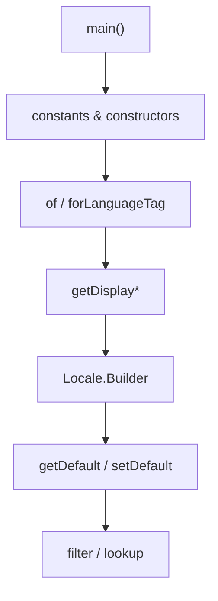

| Step | Focus |
| ---- | ----- |
| Constants | `Locale.US`, `GERMANY`, `ROOT` |
| Constructors | `en`, `en_US`, variant |
| Factories | BCP 47 tags |
| Display | Machine id vs user label |
| Defaults | `DISPLAY` / `FORMAT` categories |
| filter/lookup | Accept-Language style |

### Locale deep internal flow

- **Storage:** language, script, region, variant, extensions (BCP 47).
- **Role:** key for JDK locale data (CLDR); not a resource bundle by itself.
- **`setDefault`:** JVM-wide; demos restore values after tests.

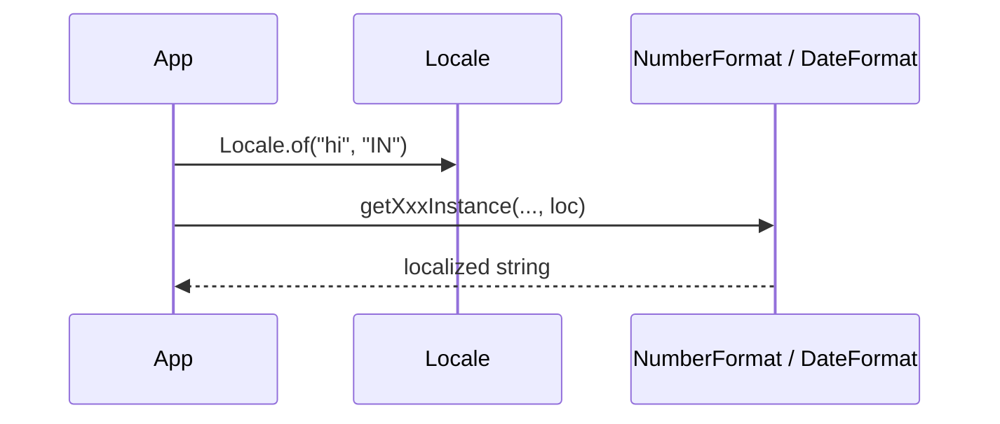

---

## NumberFormat class

`java.text.NumberFormat` is an **abstract** class extending `Format`. It formats and parses **numbers**, **currency**, **percentages**, and **compact** values for a `Locale`.

1. NumberFormat class present in `java.text` package
2. Concrete JDK implementation is usually `DecimalFormat`
3. You obtain instances via **static factory methods** (no public constructors on `NumberFormat` itself); custom patterns use `DecimalFormat` constructors

### NumberFormat factories and configuration

| Factory | Use |
| ------- | --- |
| `getInstance()` / `getNumberInstance(locale)` | General numbers |
| `getIntegerInstance(locale)` | No fraction digits |
| `getCurrencyInstance(locale)` | Money |
| `getPercentInstance(locale)` | Percent |
| `getCompactNumberInstance(locale, style)` | 1.5K / 1.5 thousand |

| Configuration | Methods |
| ------------- | ------- |
| Digits | `setMinimumFractionDigits`, `setMaximumIntegerDigits`, … |
| Grouping | `setGroupingUsed` |
| Currency | `setCurrency`, `getCurrency` |
| Rounding | `setRoundingMode` |
| Parse mode | `setParseIntegerOnly` |

`DecimalFormat` **constructors:** `new DecimalFormat(pattern)`, `new DecimalFormat(pattern, DecimalFormatSymbols)`.

### NumberFormat.java execution summary

Demo class: [`NumberFormat.java`](../../../demo/src/main/java/com/advanced/internationalization/classes/NumberFormat.java) (`com.advanced.internationalization.classes.NumberFormat`).

```bash
javac com/advanced/internationalization/classes/NumberFormat.java
java com.advanced.internationalization.classes.NumberFormat
```

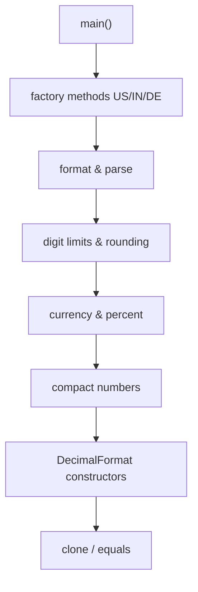

| Section | Output idea |
| ------- | ----------- |
| US number | `1,234,567.891` |
| IN integer | `1,234,568` |
| DE currency | `1.234.567,89 €` |
| Percent | `75%` |
| Compact | `1.5K` (locale-dependent) |

**Sample excerpt**

```text
getNumberInstance(US)= 1,234,567.891
getCurrencyInstance(DE)= 1.234.567,89 €
parse("1,234.56") = 1234.56
```

### NumberFormat deep internal flow

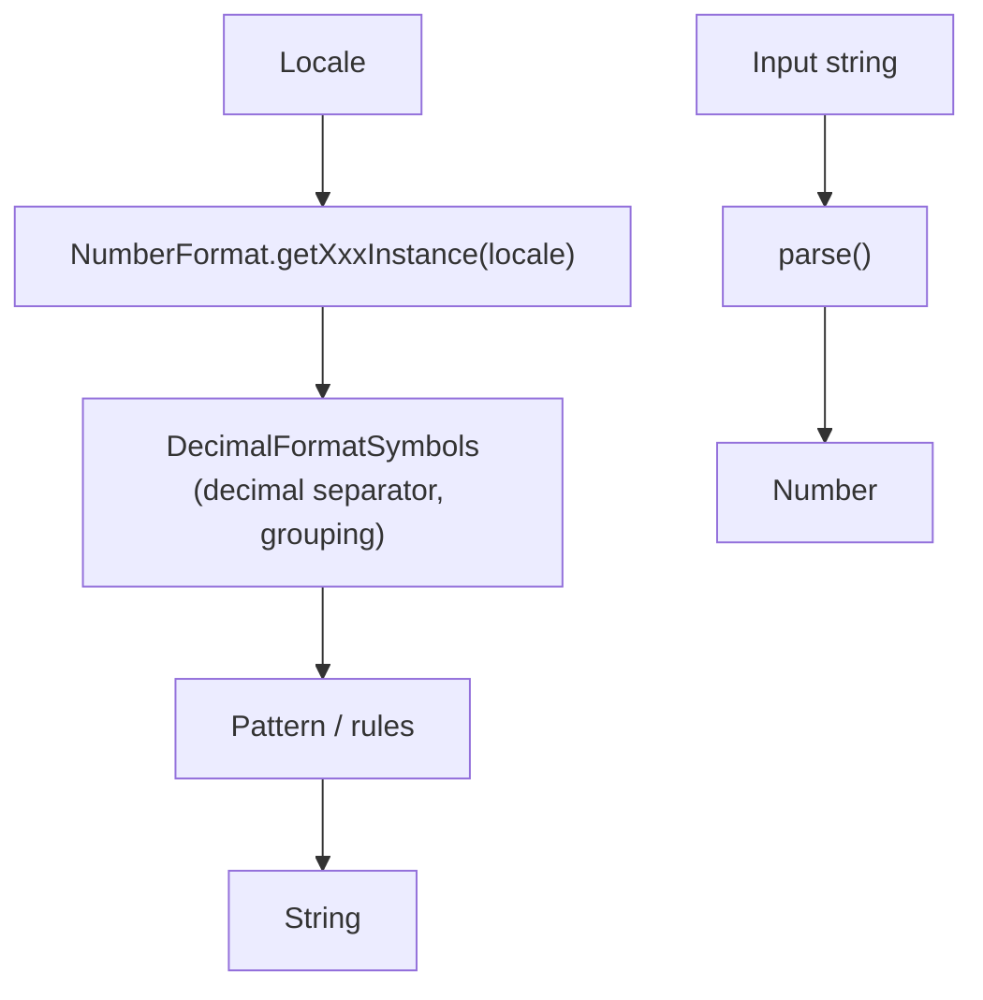

1. **Factory** loads locale-specific symbols (`,` vs `.`, currency symbol).
2. **format(double)** rounds per `RoundingMode` and digit limits.
3. **parse** walks input with `ParsePosition` for partial parsing.
4. **clone** duplicates formatter state for per-thread copies.

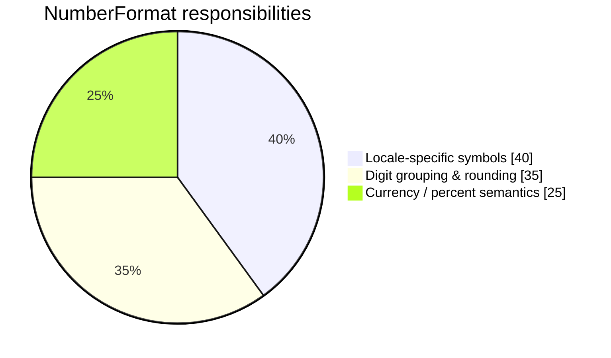

---

## DateFormat class

`java.text.DateFormat` is **abstract**; it formats and parses `java.util.Date` using locale calendars and patterns. Common concrete class: `SimpleDateFormat`.

1. DateFormat class present in `java.text` package
2. Style constants: `FULL`, `LONG`, `MEDIUM`, `SHORT`, `DEFAULT`
3. Factories combine **date style** + **time style** + `Locale`

### DateFormat styles and factories

| API | Description |
| --- | ----------- |
| `getDateInstance(style, locale)` | Date only |
| `getTimeInstance(style, locale)` | Time only |
| `getDateTimeInstance(dateStyle, timeStyle, locale)` | Both |
| `getInstance()` | SHORT date + time for default locale |

| Style | Typical use |
| ----- | ----------- |
| `SHORT` | `8/15/25` |
| `MEDIUM` | `Aug 15, 2025` |
| `LONG` / `FULL` | Weekday, time zone name |

**Instance settings:** `setTimeZone`, `setCalendar`, `setLenient`, `getNumberFormat` / `setNumberFormat`.

**SimpleDateFormat constructors:** default, `(pattern)`, `(pattern, locale)`, `(pattern, DateFormatSymbols)`; `applyPattern`, `toPattern`.

### converStringToJavaDateForm() end-to-end

Classroom demo: [`dateFormatClassDemo.java`](../../../demo/src/main/java/com/advanced/internationalization/dateFormatClassDemo.java) — method **`converStringToJavaDateForm(String dateString)`** turns a **human-entered date string** into a **`java.util.Date`**, without knowing the format in advance.

#### Public method (entry point)

```java
public static void converStringToJavaDateForm(String dateString) {
    try {
        ParseOutcome outcome = parseDateDynamically(dateString);
        System.out.println("Converted date: " + outcome.date());
        System.out.println("Matched using: " + outcome.matchedUsing());
    } catch (ParseException e) {
        System.out.println("Error parsing date: " + e.getMessage());
    }
}
```

| Step | What happens |
| ---- | -------------- |
| 1 | Caller passes any date text (e.g. `2024-06-15`, `15/06/2024`, `June 15, 2024`). |
| 2 | `parseDateDynamically` trims input and runs **ordered strategies** until one consumes the **entire** string. |
| 3 | On success, prints `Date` (millis since epoch) and which strategy matched. |
| 4 | On failure, `ParseException` message is printed (empty input or unrecognized format). |

#### High-level flowchart

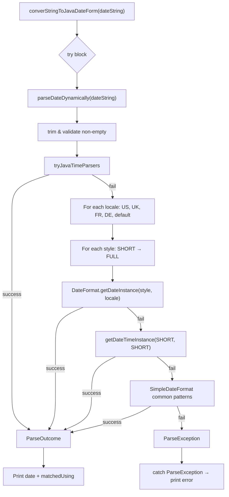

#### Sequence (runtime)

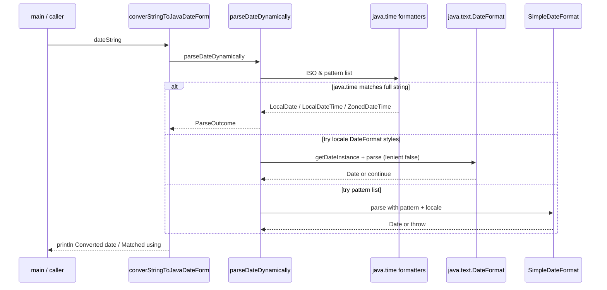

#### Internal pipeline (`parseDateDynamically`)

```text
Input string
    │
    ▼
┌───────────────────────────────────────┐
│ 1. java.time (DateTimeFormatter)      │  ISO-8601, dd/MM/yyyy, MMM dd, yyyy, …
└───────────────────────────────────────┘
    │ no match
    ▼
┌───────────────────────────────────────┐
│ 2. DateFormat per locale × style      │  SHORT, MEDIUM, LONG, FULL
│    + getDateTimeInstance(SHORT×2)     │
└───────────────────────────────────────┘
    │ no match
    ▼
┌───────────────────────────────────────┐
│ 3. SimpleDateFormat pattern table     │  yyyy-MM-dd, dd.MM.yyyy, …
└───────────────────────────────────────┘
    │ no match
    ▼
 ParseException("Unrecognized date format")
```

Each attempt uses **`setLenient(false)`** and checks that parsing consumed **all characters** (`ParsePosition` index == string length), so `15/06/2024extra` does not silently succeed.

#### Strategy mix (conceptual)

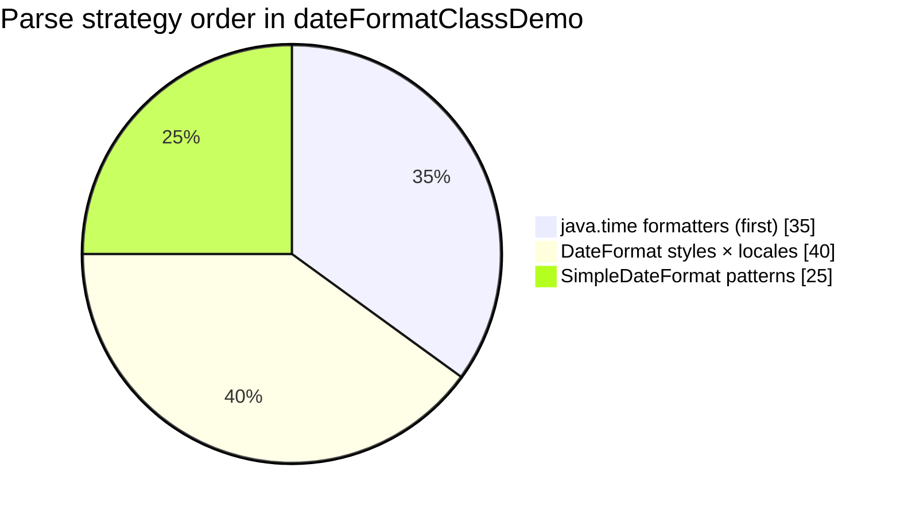

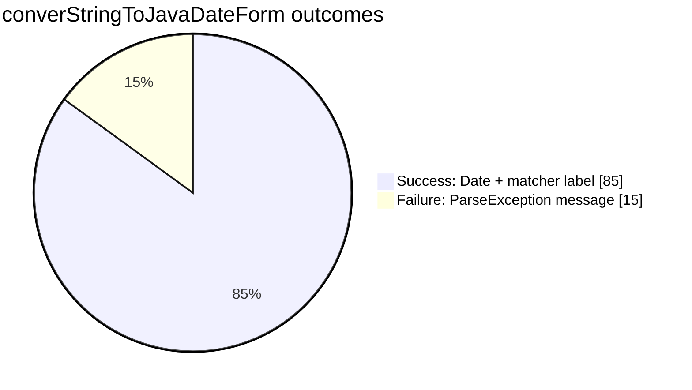

#### Example console output

```text
Converted date: Sat Jun 15 00:00:00 UTC 2024
Matched using: java.time LocalDate

Converted date: Sat Jun 15 00:00:00 UTC 2024
Matched using: java.time LocalDate

Converted date: Sat Jun 15 00:00:00 UTC 2024
Matched using: java.time LocalDate
```

(Exact `Matched using` text may show `DateFormat.getDateInstance(...)` when `java.time` does not match first.)

#### Run only this demo

```bash
cd demo/src/main/java
javac com/advanced/internationalization/dateFormatClassDemo.java
java com.advanced.internationalization.dateFormatClassDemo
```

**Related:** [`DynamicDateParser.java`](../../../demo/src/main/java/com/advanced/internationalization/DynamicDateParser.java) implements the same multi-strategy logic as a reusable helper (optional; the demo inlines it in `parseDateDynamically`).

### DateFormat.java execution summary

Demo: [`DateFormat.java`](../../../demo/src/main/java/com/advanced/internationalization/classes/DateFormat.java).

```bash
javac com/advanced/internationalization/classes/DateFormat.java
java com.advanced.internationalization.classes.DateFormat
```

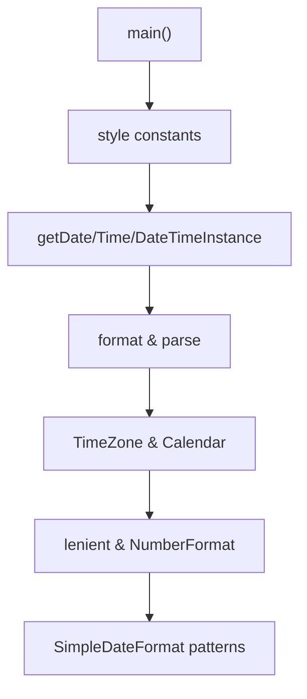

| Section | Behavior |
| ------- | -------- |
| US SHORT date | `8/15/25` |
| IN LONG date | Locale-specific long date |
| UTC | `setTimeZone(UTC)` changes formatted output |
| Pattern | `yyyy-MM-dd HH:mm:ss` |

**Sample excerpt**

```text
getDateInstance(SHORT, US) = 8/15/25
format in UTC = ... (full weekday string in UTC)
toPattern() = yyyy-MM-dd HH:mm:ss
```

### DateFormat deep internal flow

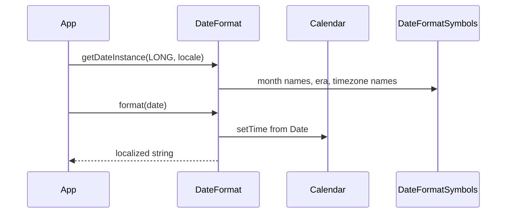

1. **Calendar** holds fields (YEAR, MONTH, …); `DateFormat` reads/writes through it.
2. **TimeZone** on the formatter shifts fields before formatting.
3. **Lenient** `false` rejects invalid dates (e.g. Feb 30).
4. **SimpleDateFormat** compiles pattern letters (`yyyy`, `MM`, `dd`) into a formatter (not thread-safe — use `ThreadLocal` or `java.time` in modern apps).

Field constants (`YEAR_FIELD`, `MONTH_FIELD`, …) support `FieldPosition` when writing to `StringBuffer`.

---

## End-to-end I18N flow

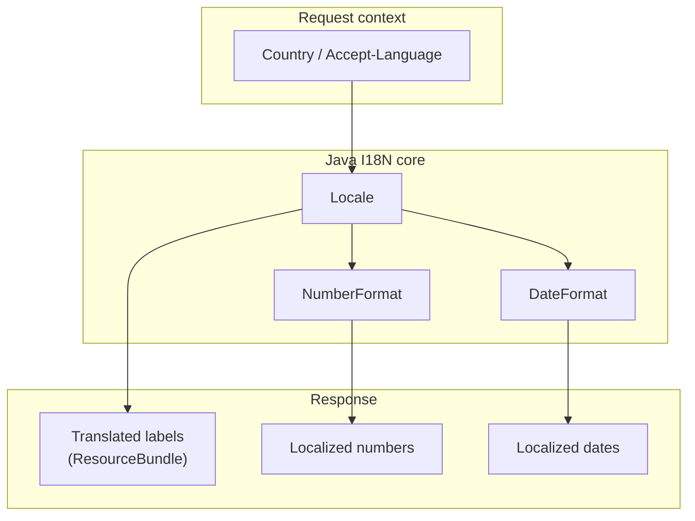

Typical server flow:

1. Choose `Locale` (user profile, `Accept-Language`, or default).
2. Format numbers with `NumberFormat.getCurrencyInstance(locale)`.
3. Format timestamps with `DateFormat.getDateTimeInstance(..., locale)` and correct `TimeZone`.
4. Load messages with `ResourceBundle.getBundle(baseName, locale)` (next topic).

---

## Run all demos

From repository root:

```bash
cd demo/src/main/java
javac com/advanced/internationalization/classes/localeClass.java \
      com/advanced/internationalization/classes/NumberFormat.java \
      com/advanced/internationalization/classes/DateFormat.java
javac com/advanced/internationalization/dateFormatClassDemo.java

java com.advanced.internationalization.classes.localeClass
java com.advanced.internationalization.classes.NumberFormat
java com.advanced.internationalization.classes.DateFormat
java com.advanced.internationalization.dateFormatClassDemo
```

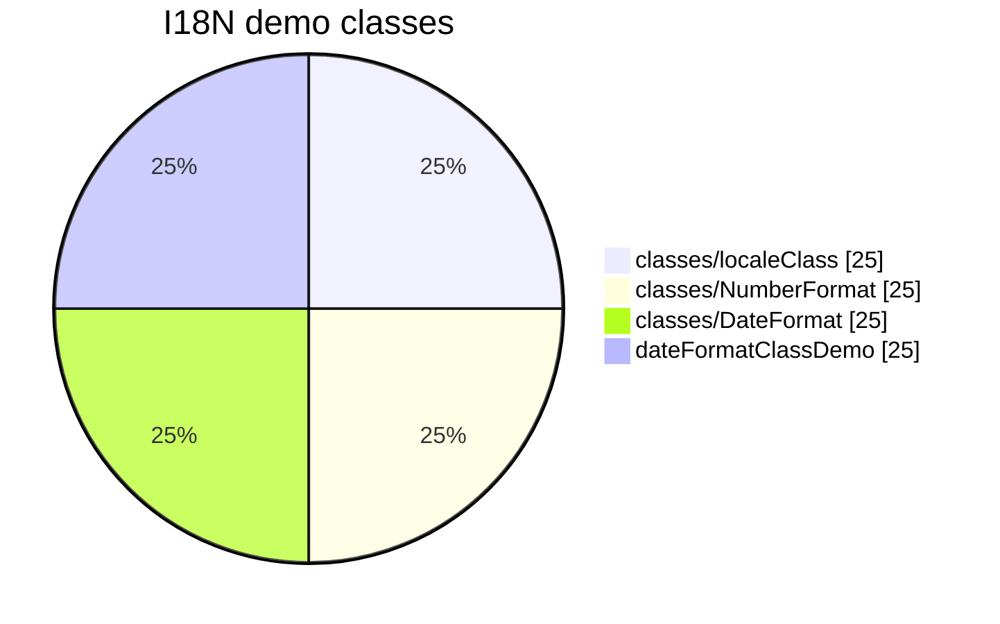

Sources:

- `demo/src/main/java/com/advanced/internationalization/classes/`
- `demo/src/main/java/com/advanced/internationalization/dateFormatClassDemo.java`
