# JVM Architecture

> Topic list from Notepad++ classroom notes (two screenshots, **part 1 → part 2**).  
> **You add descriptions** under each heading; this file provides structure and **Ctrl+click** navigation only.

> **Navigation:** Use **Ctrl+click** on [Guide map](#guide-map) or [TOC](#table-of-contents) links in **Markdown Preview** (`Ctrl+Shift+V`) to jump to any topic.

**Source screenshots:** [Part 1](images/notepad-syllabus-part-1.png) · [Part 2](images/notepad-syllabus-part-2.png)

---

## Guide map

| Jump to                                                                                     | Topic (Notepad++)                           |
| ------------------------------------------------------------------------------------------- | ------------------------------------------- |
| [Virtual Machine](#virtual-machine)                                                         | Virtual Machine                             |
| [Type of Virtual Machines](#type-of-virtual-machines)                                       | Type of Virtual Machines                    |
| [Hard ware Based VM](#hard-ware-based-vm)                                                   | ↳ 1. Hard ware Based VM                     |
| [Application Based VM](#application-based-vm)                                               | ↳ 2. Application Based VM                   |
| [Basic Architecture of JVM](#basic-architecture-of-jvm)                                     | Basic Architecture of JVM                   |
| [Class Loader SubSystem](#class-loader-subsystem)                                           | Class Loader SubSystem                      |
| [Loading](#loading)                                                                         | ↳ 1. Loading                                |
| [Linking](#linking)                                                                         | ↳ 2. Linking                                |
| [Initialization](#initialization)                                                           | ↳ 3. Initialization                         |
| [Types of Class Loaders](#types-of-class-loaders)                                           | Types of Class Loaders                      |
| [Bootstrap Class Loader](#bootstrap-class-loader)                                           | ↳ 1. Bootstrap Class Loader                 |
| [Extension Class Loader](#extension-class-loader)                                           | ↳ 2. Extension Class Loader                 |
| [Application Class Loader](#application-class-loader)                                       | ↳ 3. Application Class Loader               |
| [How Class Loader works](#how-class-loader-works)                                           | How Class Loader works                      |
| [What is the need of Customized Class Loader](#what-is-the-need-of-customized-class-loader) | What is the need of Customized Class Loader |
| [Psuedo code for Customized Class Loader](#psuedo-code-for-customized-class-loader)         | Psuedo code for Customized Class Loader     |
| [Various Memory Areas of JVM](#various-memory-areas-of-jvm)                                 | Various Memory Areas of JVM                 |
| [Method Area](#method-area)                                                                 | ↳ 1. Method Area                            |
| [Heap Area](#heap-area)                                                                     | ↳ 2. Heap Area                              |
| [Stack Area](#stack-area)                                                                   | ↳ 3. Stack Area                             |
| [PC Registers](#pc-registers)                                                               | ↳ 4. PC Registers                           |
| [Native Method Stacks](#native-method-stacks)                                               | ↳ 5. Native Method Stacks                   |
| [Program to display heap memory statistics](#program-to-display-heap-memory-statistics)     | Program to display heap memory statistics   |
| [How to set Maximum and Minimum heap size?](#how-to-set-maximum-and-minimum-heap-size)      | How to set Maximum and Minimum heap size?   |
| [Execution Engine](#execution-engine)                                                       | Execution Engine                            |
| [Interpreter](#interpreter)                                                                 | ↳ 1. Interpreter                            |
| [JIT Compilers](#jit-compilers)                                                             | ↳ 2. JIT Compilers                          |
| [Java Native Interface (JNI)](#java-native-interface-jni)                                   | Java Native Interface(JNI)                  |
| [Complete Architecture Diagram of JVM](#complete-architecture-diagram-of-jvm)               | Complete Architecture Diagram of JVM        |
| [Class File Structure](#class-file-structure)                                               | Class File Structure                        |

---

## Table of contents

<!-- TOC -->
- [JVM Architecture](#jvm-architecture)
  - [Guide map](#guide-map)
  - [Table of contents](#table-of-contents)
  - [Virtual Machine](#virtual-machine)
  - [Type of Virtual Machines](#type-of-virtual-machines)
    - [Hard ware Based VM](#hard-ware-based-vm)
    - [Application Based VM](#application-based-vm)
  - [Basic Architecture of JVM](#basic-architecture-of-jvm)
  - [Class Loader SubSystem](#class-loader-subsystem)
    - [Loading](#loading)
    - [Linking](#linking)
    - [Initialization](#initialization)
  - [Types of Class Loaders](#types-of-class-loaders)
    - [Bootstrap Class Loader](#bootstrap-class-loader)
    - [Extension Class Loader](#extension-class-loader)
    - [Application Class Loader or System Class Loader](#application-class-loader-or-system-class-loader)
  - [How Class Loader works](#how-class-loader-works)
  - [What is the need of Customized Class Loader](#what-is-the-need-of-customized-class-loader)
  - [Psuedo code for Customized Class Loader](#psuedo-code-for-customized-class-loader)
  - [Various Memory Areas of JVM](#various-memory-areas-of-jvm)
    - [Method Area](#method-area)
    - [Heap Area](#heap-area)
    - [Stack Area](#stack-area)
    - [PC Registers](#pc-registers)
    - [Native Method Stacks](#native-method-stacks)
  - [Program to display heap memory statistics](#program-to-display-heap-memory-statistics)
  - [How to set Maximum and Minimum heap size?](#how-to-set-maximum-and-minimum-heap-size)
  - [Execution Engine](#execution-engine)
    - [Interpreter](#interpreter)
    - [JIT Compilers](#jit-compilers)
  - [Java Native Interface (JNI)](#java-native-interface-jni)
  - [Complete Architecture Diagram of JVM](#complete-architecture-diagram-of-jvm)
  - [Class File Structure](#class-file-structure)
<!-- /TOC -->

---

## Virtual Machine

## Type of Virtual Machines

It is a software simulation of a machine which perform operation like a physical machine. There are 2 types of virual machines 
1. Hardware based or system based virtual machine 
2. Application based or process based virtual machine 

### Hard ware Based VM

1. Hardware based or system based virtual machine

It provides several logical systems on the same computer with strong isolation from each other i.e on one physical machine we are defining multiple logical machines 

The main advantage of hardware based virtual machines is hardware resources sharing and improves utlization of 
hardware resources

Ex: KVM[kernal based virtual machine for linux systems], VMware,Xen, cloud computing etc.

### Application Based VM

2. Applicatin based or process based virtual machine 
   
These virtual machines acts as runtime engines to run a particular programming languages applications 
Ex: JVM[Java Virtual Machine ] ---> Acts as runtime engine to run Java based applications 
    PVM[Parrot Virtual Machine] ---> Acts as runtime engine to run peral based applications 
    CLR[Coomon Language Runtime] ---> Acts as runtime engine to run .NET based applications 
    
JVM is the part of JRE and it is resposible to load and run java .class (class files)

## Basic Architecture of JVM

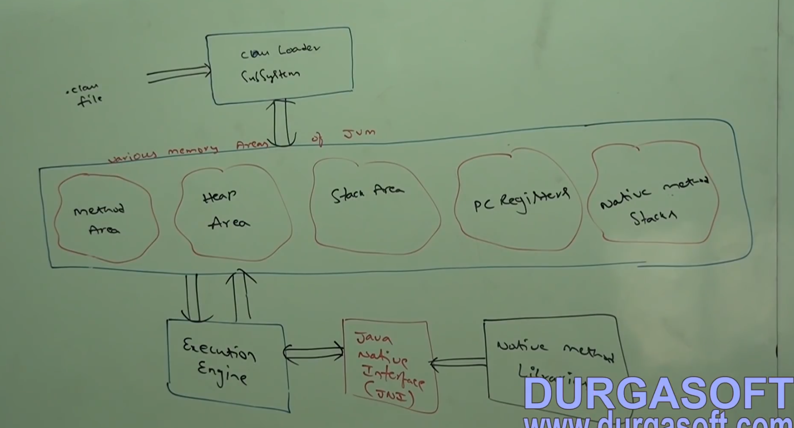

The board shows **three layers**: class loading (top), **runtime data areas** (middle), and **execution + native** (bottom). Arrows are **bidirectional** where drawn with double heads on the slide.

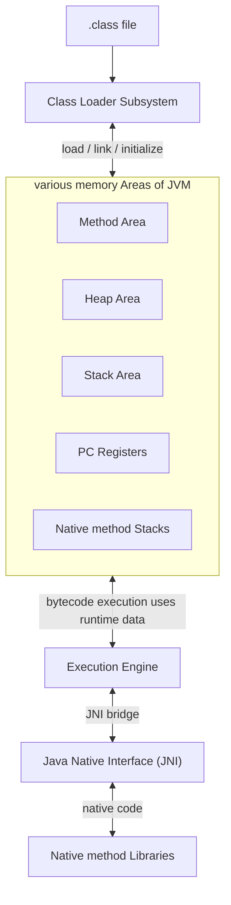
```mermaid
flowchart TB
  CF[".class file"] --> CLS["Class Loader Subsystem"]

  CLS <-->|"load / link / initialize"| RUNTIME

  subgraph RUNTIME ["various memory Areas of JVM"]
    direction LR
    MA["Method Area"]
    HEAP["Heap Area"]
    STACK["Stack Area"]
    PC["PC Registers"]
    NMS["Native method Stacks"]
  end

  RUNTIME <-->|"bytecode execution uses runtime data"| EE["Execution Engine"]

  EE <-->|"JNI bridge"| JNI["Java Native Interface (JNI)"]
  JNI <-->|"native code"| NML["Native method Libraries"]
```

**Data flow (same as whiteboard, top → bottom):**

| Step | From                   | To                      | Meaning                                                                                                                                          |
| ---- | ---------------------- | ----------------------- | ------------------------------------------------------------------------------------------------------------------------------------------------ |
| 1    | `.class file`          | Class Loader Subsystem  | Bytecode enters the JVM; loaders read `.class` (or JAR) bytes.                                                                                   |
| 2    | Class Loader Subsystem | various memory Areas    | Loaded types and static state land in **Method Area**; objects in **Heap**; frames in **Stack**; per-thread **PC** and **Native method Stacks**. |
| 3    | various memory Areas   | Execution Engine        | Interpreter / JIT reads bytecode and uses stack, heap, and method metadata.                                                                      |
| 4    | Execution Engine       | JNI                     | Calls into platform-specific native code when needed.                                                                                            |
| 5    | JNI                    | Native method Libraries | OS / C libraries backing `native` methods.                                                                                                       |

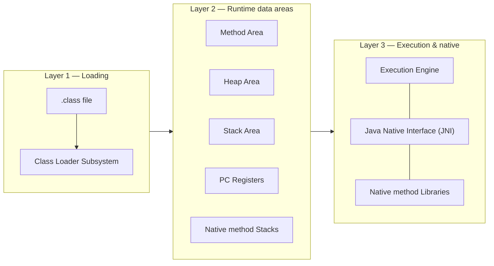
```mermaid
flowchart LR
  subgraph layer1 ["Layer 1 — Loading"]
    A[".class file"] --> B["Class Loader Subsystem"]
  end
  subgraph layer2 ["Layer 2 — Runtime data areas"]
    direction LR
    M1["Method Area"]
    M2["Heap Area"]
    M3["Stack Area"]
    M4["PC Registers"]
    M5["Native method Stacks"]
  end
  subgraph layer3 ["Layer 3 — Execution & native"]
    E["Execution Engine"]
    J["Java Native Interface (JNI)"]
    N["Native method Libraries"]
    E --- J --- N
  end
  layer1 --> layer2
  layer2 --> layer3
```

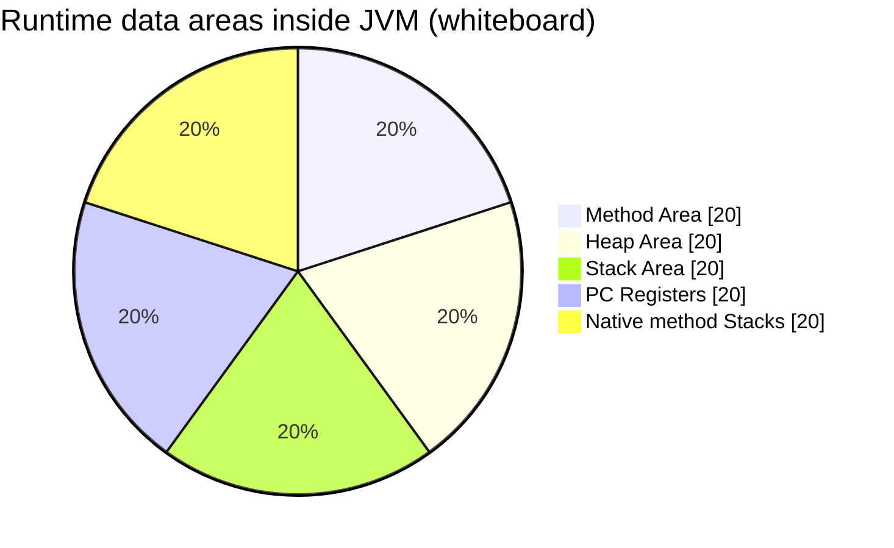
```mermaid
pie showData
    title Runtime data areas inside JVM (whiteboard)
    "Method Area" : 20
    "Heap Area" : 20
    "Stack Area" : 20
    "PC Registers" : 20
    "Native method Stacks" : 20
```

## Class Loader SubSystem

clas Loader Subsystem is responsible for the following 3 activities 

1. Loading 
2. Linking 
3. Initialization

### Loading

Loading means reading .class files and store corresponsing binary data in method area, for each class file JVM 
will store corresponding information in the method area 
1. Fully qualified name of class 
2. Fully qualified name of immediate parent class 
3. Methods information 
4. Variables information 
5. Constructtors information 
6. Modifiers information 
7. Constant pool information etc.

After loading .class file immediately JVM creates an object for that loaded class and the heap memory of type 
java.lang.class 

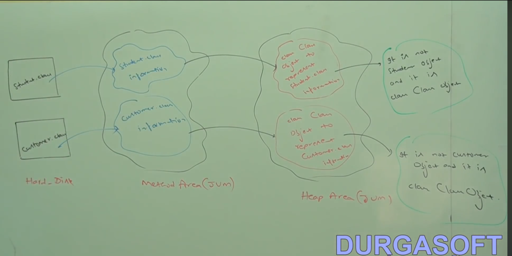

**Loading phase flow (whiteboard):** `.class` files on disk → **Method Area** metadata → **`java.lang.Class` object on Heap** (not application instances).

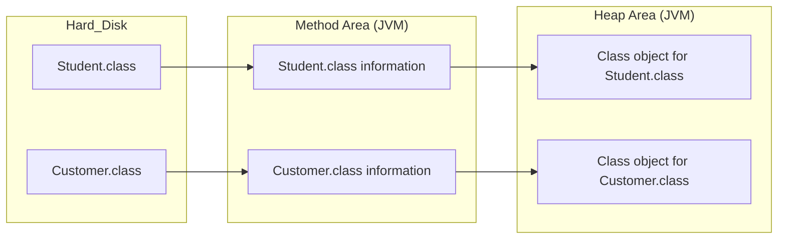
```mermaid
flowchart LR
  subgraph DISK ["Hard_Disk"]
    SCF["Student.class"]
    CCF["Customer.class"]
  end

  subgraph METHOD ["Method Area (JVM)"]
    SMI["Student.class information"]
    CMI["Customer.class information"]
  end

  subgraph HEAP ["Heap Area (JVM)"]
    SCO["Class object for Student.class"]
    CCO["Class object for Customer.class"]
  end

  SCF --> SMI
  CCF --> CMI
  SMI --> SCO
  CMI --> CCO
```

| Stage           | `Student.class` track                                                   | `Customer.class` track                                   |
| --------------- | ----------------------------------------------------------------------- | -------------------------------------------------------- |
| **Hard disk**   | `Student.class` bytecode file                                           | `Customer.class` bytecode file                           |
| **Method Area** | Student.class **information** (name, methods, fields, constant pool, …) | Customer.class **information**                           |
| **Heap Area**   | One **`java.lang.Class`** instance representing Student                 | One **`java.lang.Class`** instance representing Customer |

**Slide notes (green clouds on board):**

- It is **not** a `Student` **object** — it is a **`Class` object** for `Student.class`.
- It is **not** a `customer` **object** — it is a **`Class` object** for `Customer.class`.

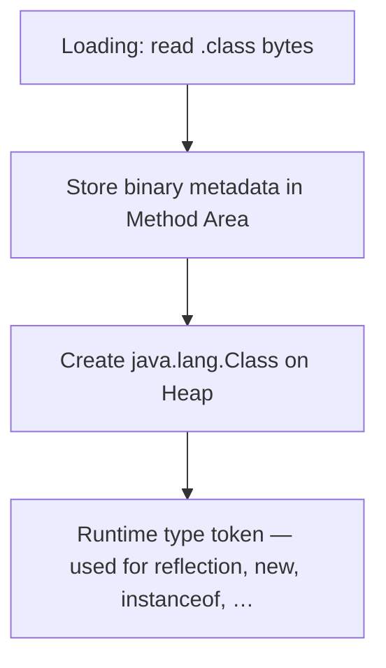
```mermaid
flowchart TB
  LOAD["Loading: read .class bytes"] --> MA["Store binary metadata in Method Area"]
  MA --> HO["Create java.lang.Class on Heap"]
  HO --> NOTE["Runtime type token — used for reflection, new, instanceof, …"]
```

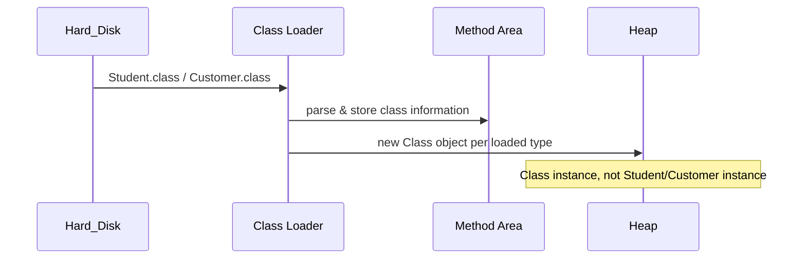
```mermaid
sequenceDiagram
  participant HD as Hard_Disk
  participant CL as Class Loader
  participant MA as Method Area
  participant HP as Heap
  HD->>CL: Student.class / Customer.class
  CL->>MA: parse & store class information
  CL->>HP: new Class object per loaded type
  Note over HP: Class instance, not Student/Customer instance
```

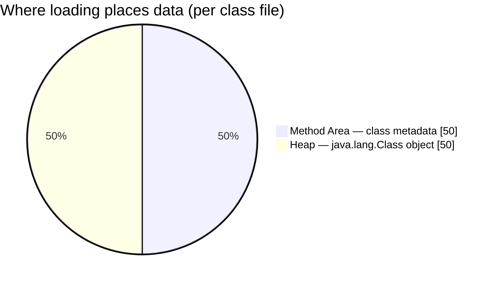
```mermaid
pie showData
    title Where loading places data (per class file)
    "Method Area — class metadata" : 50
    "Heap — java.lang.Class object" : 50
```

Class class object can be used by programmer to get class level information like 
1. methods information 
2. variables information 
3. constructors informaton etc

Example program: [VerifyMethodsUsingClassclass](../../../demo/src/main/java/com/jvmArchitecture/ClassclassDefinition/VerifyMethodsUsingClassclass.java)
   
NOTE 

For every loaded type only one class object will be created eventhough we are using the class multiple times in our program

In the program eventhough we are using student class multiple times only one Class class object got created 

### Linking

Linking consists of 3 activities 

a. verify 
b. prepare 
c. resolve

Verification:

1. It is the process of ensuring that binary representation of a class is structurally correct or not i.e JVM will check if .class file is generated by valid compiler or not i.e if .class file is properly formatted or not 
2. Internally byte code verifier is responsible for this activity , byet code verifier is the part of class loader subsystem
3. If verification fails we will get runtime exception saying "java.lang.VerifyError"

Preparation: 

1. In this phase JVM will allocate memory for class level static variables and assign default values 

NOTE: 

In initialization phase oroginal values will be assigned to the static variables and here only default values will be assigned.

Resolution: 

It is the process of replacing symbolic names inout program with original memory references from method area 

Ex: 

class test
{
   public static void main(String[] args)
   {
     String s = new String("durga");
     Student s1 = new Student();
   }
}

For the above class class loader loads 

1. Test.class
2. String.class
3. Student.class
4. Object.class

The names of these classes are stored in constant pool of test class, In resolution phase these names are replaced with original memory level references from method area 

### Initialization

<!-- description -->

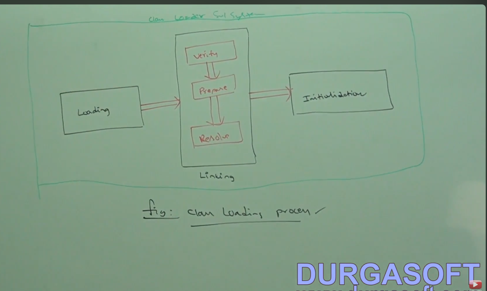

**fig: Class Loading process** — all three activities run inside the **Class Loader Sub System**, in order: **Loading** → **Linking** → **Initialization**.

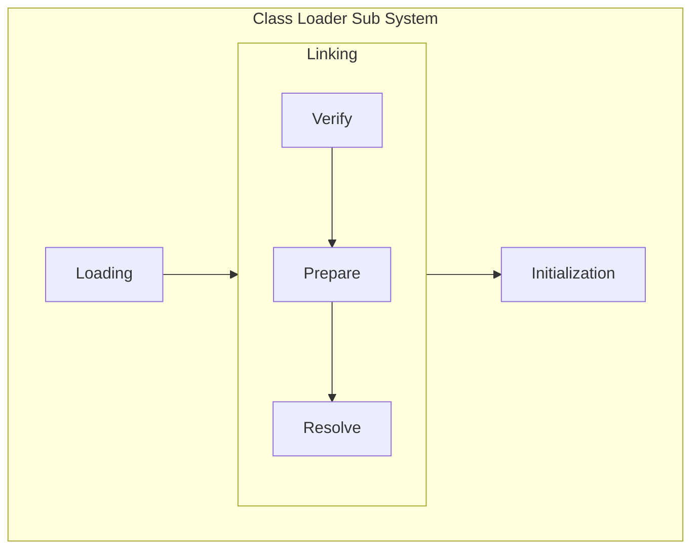
```mermaid
flowchart LR
  subgraph CLS ["Class Loader Sub System"]
    direction LR
    LOAD["Loading"]
    subgraph LINK ["Linking"]
      direction TB
      VER["Verify"]
      PRE["Prepare"]
      RES["Resolve"]
      VER --> PRE --> RES
    end
    INIT["Initialization"]
    LOAD --> LINK
    LINK --> INIT
  end
```

| Phase              | Role (high level)                                                                                  |
| ------------------ | -------------------------------------------------------------------------------------------------- |
| **Loading**        | Read `.class` bytes; place metadata in **Method Area**; create **`java.lang.Class`** on **Heap**   |
| **Linking**        | **Verify** bytecode → **Prepare** static fields (default values) → **Resolve** symbolic references |
| **Initialization** | Run `<clinit>`; assign static fields; class is ready for use                                       |

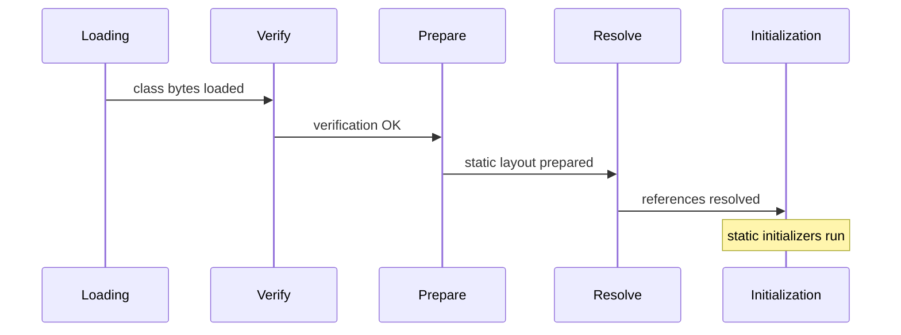
```mermaid
sequenceDiagram
  participant L as Loading
  participant V as Verify
  participant P as Prepare
  participant R as Resolve
  participant I as Initialization
  L->>V: class bytes loaded
  V->>P: verification OK
  P->>R: static layout prepared
  R->>I: references resolved
  Note over I: static initializers run
```

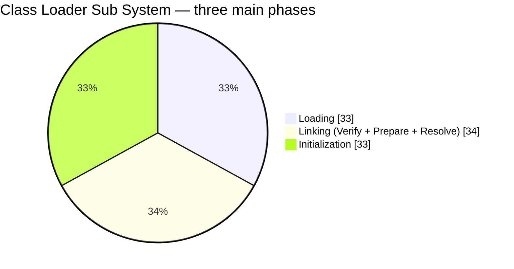
```mermaid
pie showData
    title Class Loader Sub System — three main phases
    "Loading" : 33
    "Linking (Verify + Prepare + Resolve)" : 34
    "Initialization" : 33
```

---
In this all static variables are assigned with original values and static blocks will be executed from parent to child and from top to bottom.

While loading , linking and initialization if any error occurs then we wil get RuntimeException saying 
"java.lang.linkageError"

## Types of Class Loaders

Class Loader SubSystems contains the following three types of classloaders 

1. BootStrap class Loader/Premordial class Loader
2. Extension class loader 
3. Application class loader/System class loader 

### Bootstrap Class Loader

BootStrap class Loader is responsible to load core jave API class i.e that classes presen in rt.jar

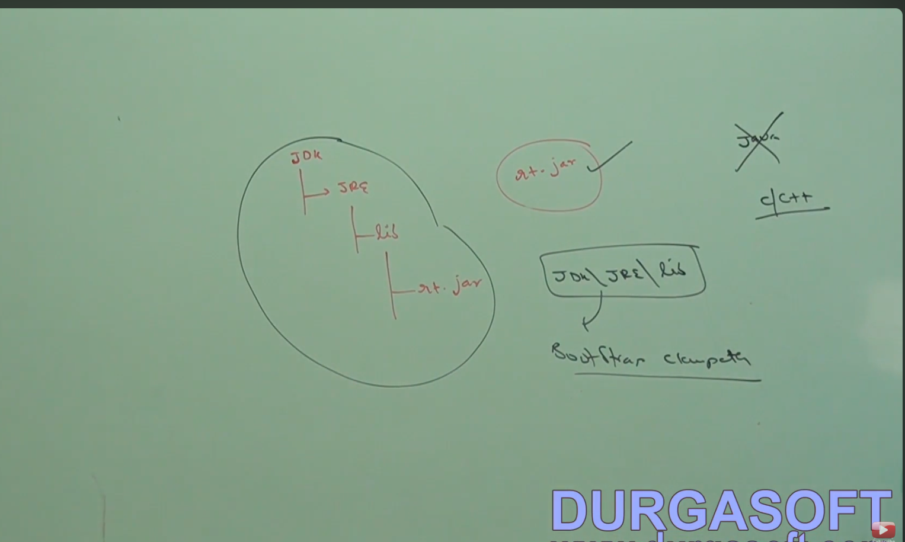

**Bootstrap classpath (slide):** core platform libraries under **`JDK\JRE\lib`** (classic layout: **`rt.jar`** holds fundamental `java.*` types).

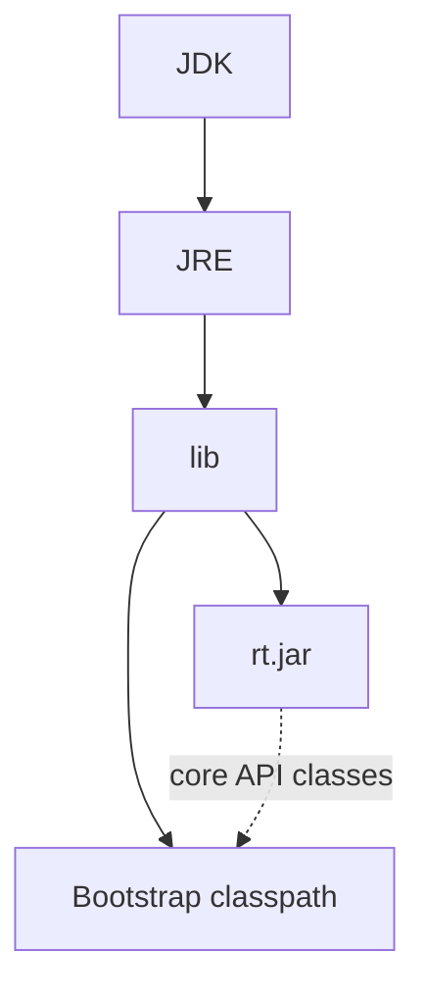
```mermaid
flowchart TB
  JDK["JDK"]
  JRE["JRE"]
  LIB["lib"]
  RT["rt.jar"]
  JDK --> JRE --> LIB --> RT
  LIB --> BCP["Bootstrap classpath"]
  RT -.->|"core API classes"| BCP
```

| Item                         | Whiteboard meaning                                                                                                        |
| ---------------------------- | ------------------------------------------------------------------------------------------------------------------------- |
| **JDK → JRE → lib → rt.jar** | Directory tree where bootstrap/platform classes are loaded from                                                           |
| **`JDK\JRE\lib`**            | Labeled **Bootstrap classpath** on the board                                                                              |
| **`rt.jar`**                 | Run-time archive of core Java classes (teaching diagram; module-based JDKs expose the same role via **jimage** / modules) |
| **Implementation**           | **Not Java** — bootstrap loader is **native (C/C++)**, drawn with **Java ✗** and **C/C++** underlined on the slide        |

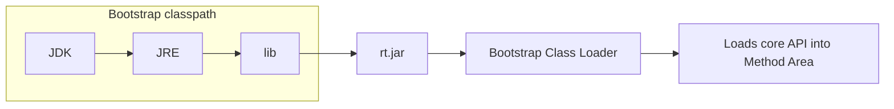
```mermaid
flowchart LR
  subgraph PATH ["Bootstrap classpath"]
    direction TB
    P1["JDK"]
    P2["JRE"]
    P3["lib"]
    P1 --> P2 --> P3
  end
  P3 --> RTJAR["rt.jar"]
  RTJAR --> BCL["Bootstrap Class Loader"]
  BCL --> MA["Loads core API into Method Area"]
```

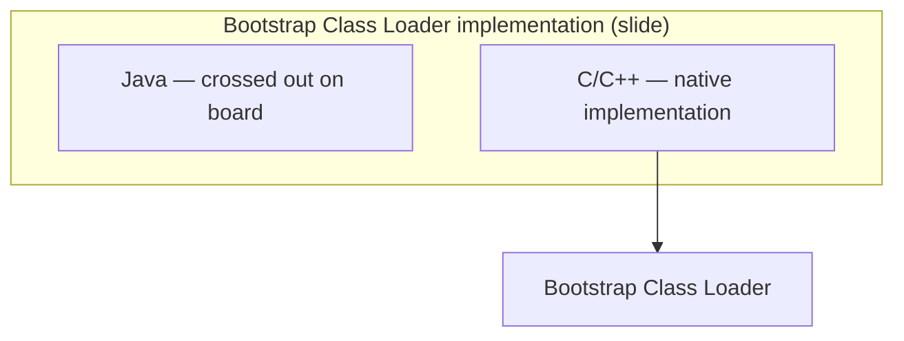
```mermaid
flowchart TB
  subgraph IMPL ["Bootstrap Class Loader implementation (slide)"]
    J["Java — crossed out on board"]
    N["C/C++ — native implementation"]
  end
  N --> BCL2["Bootstrap Class Loader"]
```

| Property          | Detail                                                 |
| ----------------- | ------------------------------------------------------ |
| **Parent**        | None — top of delegation chain                         |
| **`getParent()`** | Returns **`null`** (bootstrap convention)              |
| **Loads**         | Core `java.*` / platform classes (slide: **`rt.jar`**) |

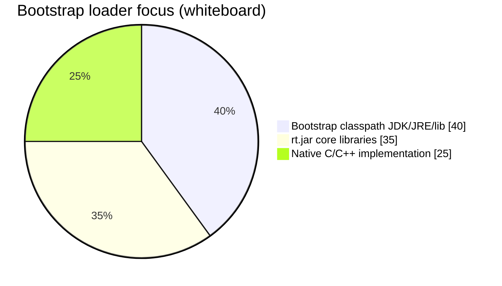
```mermaid
pie showData
    title Bootstrap loader focus (whiteboard)
    "Bootstrap classpath JDK/JRE/lib" : 40
    "rt.jar core libraries" : 35
    "Native C/C++ implementation" : 25
```
1. JDK/JRE/lib this location is called bootStrap classpath i.e BootStrap classloader is responsible to load classes from BootStrap classpath 
2. BootStrap class loader is by defautl available with every JVM , it is implemented in native languages like 
   C/C++ and not implemented in java.
    
### Extension Class Loader

1. Extension Class Loader is the child class of BootStrap class Loader 

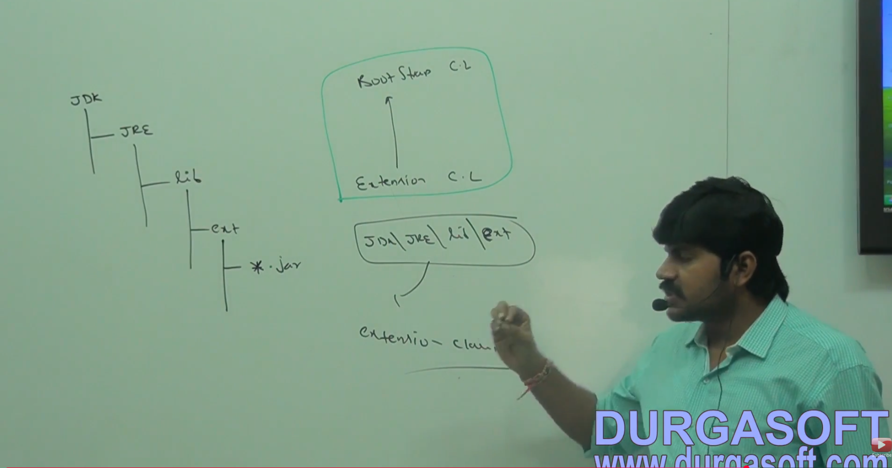

**Extension classpath (slide):** **`JDK\JRE\lib\ext`** — loads classes from **`*.jar`** files in the **ext** directory (and paths from **`java.ext.dirs`** when configured).

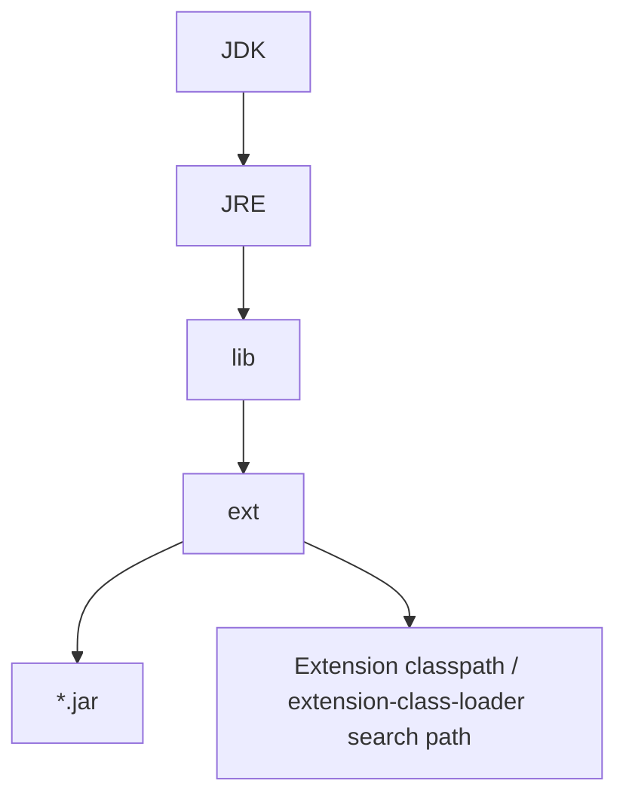
```mermaid
flowchart TB
  JDK["JDK"]
  JRE["JRE"]
  LIB["lib"]
  EXT["ext"]
  JARS["*.jar"]
  JDK --> JRE --> LIB --> EXT --> JARS
  EXT --> ECP["Extension classpath / extension-class-loader search path"]
```

| Item                               | Whiteboard meaning                                                                |
| ---------------------------------- | --------------------------------------------------------------------------------- |
| **JDK → JRE → lib → ext → \*.jar** | Tree of where extension JARs live                                                 |
| **`JDK\JRE\lib\ext`**              | Bubble on board → **extension class loader** search path                          |
| **Delegation**                     | **Extension C.L** delegates **up** to **Bootstrap C.L** before loading from `ext` |

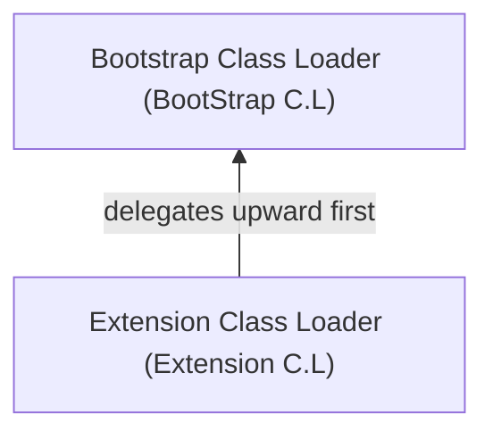
```mermaid
flowchart BT
  BOOT["Bootstrap Class Loader (BootStrap C.L)"]
  EXTCL["Extension Class Loader (Extension C.L)"]
  EXTCL -->|"delegates upward first"| BOOT
```

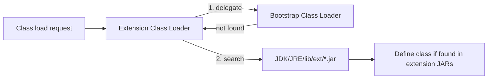
```mermaid
flowchart LR
  REQ["Class load request"] --> EXTCL2["Extension Class Loader"]
  EXTCL2 -->|"1. delegate"| BOOT2["Bootstrap Class Loader"]
  BOOT2 -->|"not found"| EXTCL2
  EXTCL2 -->|"2. search"| EXTD["JDK/JRE/lib/ext/*.jar"]
  EXTD --> LOAD["Define class if found in extension JARs"]
```

| Property         | Detail                                                    |
| ---------------- | --------------------------------------------------------- |
| **Parent**       | **Bootstrap** (via delegation)                            |
| **Typical path** | `$JAVA_HOME/jre/lib/ext` (classic layout on slide)        |
| **Also**         | Directories listed in **`java.ext.dirs`** system property |

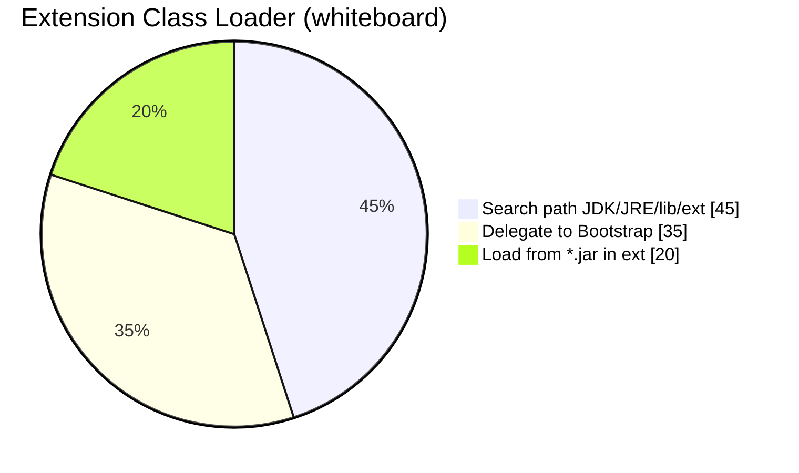
```mermaid
pie showData
    title Extension Class Loader (whiteboard)
    "Search path JDK/JRE/lib/ext" : 45
    "Delegate to Bootstrap" : 35
    "Load from *.jar in ext" : 20
```
Extention Class Loader is responsible to load classes from exctension classpath(jdk\jre\lib\ext) 

Extention Class Loader is implemented in java and the corresponding .class file is 

>sun.misc.Launcher$extClassLoader.class

### Application Class Loader or System Class Loader

1. Application class Loader is the child class of Extension class Loader 
2. This class Loader is responsible to load classes from application classpath 
3. It internally uses environment variable classpath 

Application Class Loader is implemented in java and the corresponding .class file is 

>sun.misc.Launcher$AppClassLoader.class 

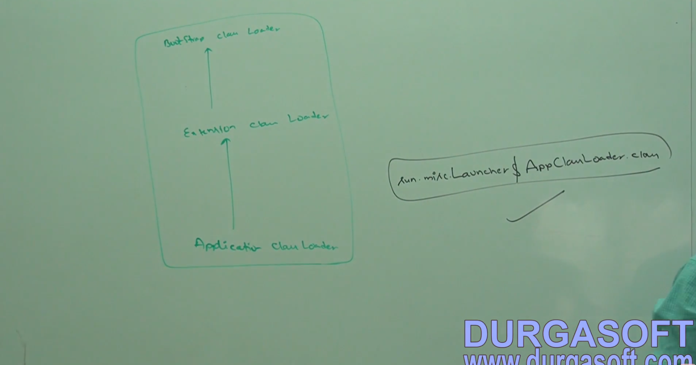

**Delegation hierarchy (slide):** upward arrows — **Application Class Loader** → **Extension Class Loader** → **Bootstrap Class Loader**.

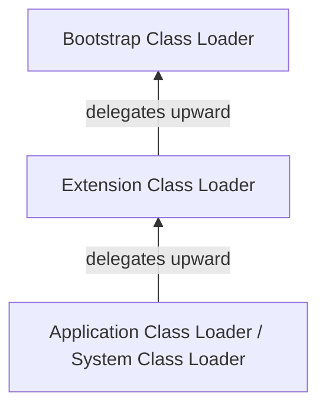
```mermaid
flowchart BT
  BOOT["Bootstrap Class Loader"]
  EXT["Extension Class Loader"]
  APP["Application Class Loader / System Class Loader"]
  APP -->|"delegates upward"| EXT
  EXT -->|"delegates upward"| BOOT
```

| Loader                   | Role on the board                                                      |
| ------------------------ | ---------------------------------------------------------------------- |
| **Application / System** | Loads classes from **application classpath** (`CLASSPATH`, `-cp`, CWD) |
| **Extension**            | Parent in hierarchy — searches `ext` after delegating up               |
| **Bootstrap**            | Top of chain — platform/core classes                                   |

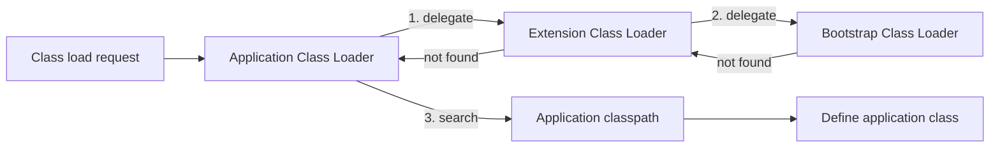
```mermaid
flowchart LR
  REQ["Class load request"] --> APPCL["Application Class Loader"]
  APPCL -->|"1. delegate"| EXTCL["Extension Class Loader"]
  EXTCL -->|"2. delegate"| BOOTCL["Bootstrap Class Loader"]
  BOOTCL -->|"not found"| EXTCL
  EXTCL -->|"not found"| APPCL
  APPCL -->|"3. search"| CP["Application classpath"]
  CP --> DEF["Define application class"]
```

**Implementation (whiteboard checkmark):**

```text
sun.misc.Launcher$AppClassLoader.class
```

```mermaid
flowchart TB
  subgraph IMPL ["Application Class Loader — Java implementation"]
    FILE["sun.misc.Launcher$AppClassLoader.class"]
    ROLE["Loads user / app classes from classpath"]
    FILE --> ROLE
  end
```

```mermaid
pie showData
    title Application Class Loader (whiteboard focus)
    "Child of Extension Class Loader" : 35
    "Application classpath (CLASSPATH)" : 40
    "AppClassLoader .class in Java" : 25
```

## How Class Loader works

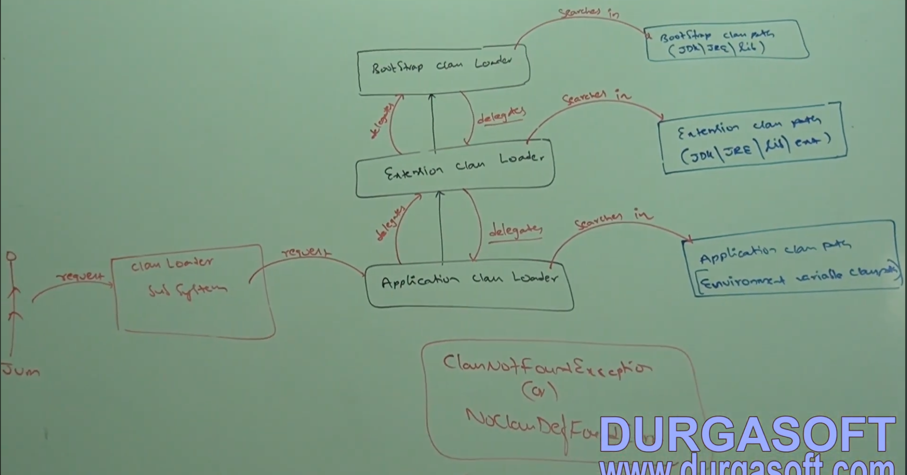

**Flow (slide):** **JVM** sends a **request** → **Class Loader Subsystem** → **Application Class Loader** first, then **delegate upward**; each level **searches** its classpath if parents do not define the class.

```mermaid
flowchart LR
  JVM["JVM"] -->|"request"| CLS["Class Loader Subsystem"]
  CLS -->|"request"| APP["Application Class Loader"]
```

```mermaid
flowchart BT
  BOOT["Bootstrap Class Loader"]
  EXT["Extension Class Loader"]
  APP["Application Class Loader"]
  APP -->|"delegates"| EXT
  EXT -->|"delegates"| BOOT
```

| Level           | Searches in (whiteboard)                                                  |
| --------------- | ------------------------------------------------------------------------- |
| **Bootstrap**   | **Bootstrap class path** — `JDK \| JRE \| lib`                            |
| **Extension**   | **Extension class path** — `JDK \| JRE \| lib \| ext`                     |
| **Application** | **Application class path** — environment variable **`classpath`** / `-cp` |

```mermaid
flowchart TB
  APP2["Application Class Loader"] -->|"delegates"| EXT2["Extension Class Loader"]
  EXT2 -->|"delegates"| BOOT2["Bootstrap Class Loader"]
  BOOT2 -->|"searches"| BCP["Bootstrap class path JDK/JRE/lib"]
  BOOT2 -->|"not found — delegates down"| EXT2
  EXT2 -->|"searches"| ECP["Extension class path JDK/JRE/lib/ext"]
  EXT2 -->|"not found — delegates down"| APP2
  APP2 -->|"searches"| ACP["Application class path CLASSPATH"]
  APP2 -->|"still not found"| ERR["ClassNotFoundException or NoClassDefFoundError"]
```

**Point-by-point (delegation model):**

1. **JVM** asks the **Class Loader Subsystem** to load a type (by binary name).
2. **Application Class Loader** receives the request and **delegates upward** to **Extension**, then **Bootstrap**.
3. **Bootstrap** searches **JDK/JRE/lib** (bootstrap classpath). If it cannot define the class, control returns down the chain.
4. **Extension** searches **JDK/JRE/lib/ext**. If not found, delegates back to **Application**.
5. **Application** searches **application classpath** (`CLASSPATH`, `-cp`, etc.).
6. If **no loader** defines the class → **`ClassNotFoundException`** (load time) or later **`NoClassDefFoundError`** (use without successful load).

```mermaid
sequenceDiagram
  participant JVM
  participant App as Application C.L
  participant Ext as Extension C.L
  participant Boot as Bootstrap C.L
  JVM->>App: loadClass request
  App->>Ext: delegate parent first
  Ext->>Boot: delegate parent first
  Boot->>Boot: search bootstrap path
  Boot-->>Ext: not found
  Ext->>Ext: search ext path
  Ext-->>App: not found
  App->>App: search application classpath
  alt class found
    App-->>JVM: Class defined
  else not found
    App-->>JVM: ClassNotFoundException
  end
```

```mermaid
pie showData
    title Class loader search responsibility (conceptual)
    "Bootstrap path JDK/JRE/lib" : 33
    "Extension path lib/ext" : 33
    "Application CLASSPATH" : 34
```

1. Class Loader follows delegation hierarchy principle 
2. Whenever JVM come across a particular class first it will check if corresponding .class is already loaded or  not if it is already loaded in method area then JVM will consider that loaded class, if it is not laded then JVM requests class Loader subsystem to load that particular class
   Then class loader subsystem handovers the request to application class loader 
   Application class loader delegates the request to extension class loader which inturn delegates the rtequest to bootstrap class loader
3. Then bootstrap class loader will search in bootstrap classpath if it is available then the corresposding .class will be loaded by bootstrap class loader if it is not available then bootstrap class loader delegates the request to extension class loader 
4. Extension class loader will search in extension classpath if it is available then it will be loaded otherwise 
   extension class loader delegates the request to application class loader 
5. Application class loader will search in application classpath if it is available then it will be loaded otherwise we will get runtime exception saying NoClassDefFoundError or ClassNotFoundException


## What is the need of Customized Class Loader

<!-- description -->

---

## Psuedo code for Customized Class Loader

<!-- description -->

---

## Various Memory Areas of JVM

<!-- description -->

### Method Area

<!-- description -->

### Heap Area

<!-- description -->

### Stack Area

<!-- description -->

### PC Registers

<!-- description -->

### Native Method Stacks

<!-- description -->

---

## Program to display heap memory statistics

<!-- description -->

---

## How to set Maximum and Minimum heap size?

<!-- description -->

---

## Execution Engine

<!-- description -->

### Interpreter

<!-- description -->

### JIT Compilers

<!-- description -->

---

## Java Native Interface (JNI)

<!-- description -->

---

## Complete Architecture Diagram of JVM

<!-- description -->

---

## Class File Structure

<!-- description -->
