# JVM Architecture

> Topic list from Notepad++ classroom notes (two screenshots, **part 1 → part 2**).  
> **You add descriptions** under each heading; this file provides structure and **Ctrl+click** navigation only.

> **Navigation:** Use **Ctrl+click** on [Guide map](#guide-map) or [TOC](#table-of-contents) links in **Markdown Preview** (`Ctrl+Shift+V`) to jump to any topic.

**Source screenshots:** [Part 1](images/notepad-syllabus-part-1.png) · [Part 2](images/notepad-syllabus-part-2.png)

---

## Guide map

| Jump to                                                                                     | Topic (Notepad++)                           |
| ------------------------------------------------------------------------------------------- | ------------------------------------------- |
| [Virtual Machine](#virtual-machine)                                                         | Virtual Machine                             |
| [Type of Virtual Machines](#type-of-virtual-machines)                                       | Type of Virtual Machines                    |
| [Hard ware Based VM](#hard-ware-based-vm)                                                   | ↳ 1. Hard ware Based VM                     |
| [Application Based VM](#application-based-vm)                                               | ↳ 2. Application Based VM                   |
| [Basic Architecture of JVM](#basic-architecture-of-jvm)                                     | Basic Architecture of JVM                   |
| [Class Loader SubSystem](#class-loader-subsystem)                                           | Class Loader SubSystem                      |
| [Loading](#loading)                                                                         | ↳ 1. Loading                                |
| [Linking](#linking)                                                                         | ↳ 2. Linking                                |
| [Initialization](#initialization)                                                           | ↳ 3. Initialization                         |
| [Types of Class Loaders](#types-of-class-loaders)                                           | Types of Class Loaders                      |
| [Bootstrap Class Loader](#bootstrap-class-loader)                                           | ↳ 1. Bootstrap Class Loader                 |
| [Extension Class Loader](#extension-class-loader)                                           | ↳ 2. Extension Class Loader                 |
| [Application Class Loader](#application-class-loader)                                       | ↳ 3. Application Class Loader               |
| [How Class Loader works](#how-class-loader-works)                                           | How Class Loader works                      |
| [What is the need of Customized Class Loader](#what-is-the-need-of-customized-class-loader) | What is the need of Customized Class Loader |
| [Psuedo code for Customized Class Loader](#psuedo-code-for-customized-class-loader)         | Psuedo code for Customized Class Loader     |
| [Various Memory Areas of JVM](#various-memory-areas-of-jvm)                                 | Various Memory Areas of JVM                 |
| [Method Area](#method-area)                                                                 | ↳ 1. Method Area                            |
| [Heap Area](#heap-area)                                                                     | ↳ 2. Heap Area                              |
| [Stack Area](#stack-area)                                                                   | ↳ 3. Stack Area                             |
| [PC Registers](#pc-registers)                                                               | ↳ 4. PC Registers                           |
| [Native Method Stacks](#native-method-stacks)                                               | ↳ 5. Native Method Stacks                   |
| [Program to display heap memory statistics](#program-to-display-heap-memory-statistics)     | Program to display heap memory statistics   |
| [How to set Maximum and Minimum heap size?](#how-to-set-maximum-and-minimum-heap-size)      | How to set Maximum and Minimum heap size?   |
| [Execution Engine](#execution-engine)                                                       | Execution Engine                            |
| [Interpreter](#interpreter)                                                                 | ↳ 1. Interpreter                            |
| [JIT Compilers](#jit-compilers)                                                             | ↳ 2. JIT Compilers                          |
| [Java Native Interface (JNI)](#java-native-interface-jni)                                   | Java Native Interface(JNI)                  |
| [Complete Architecture Diagram of JVM](#complete-architecture-diagram-of-jvm)               | Complete Architecture Diagram of JVM        |
| [Class File Structure](#class-file-structure)                                               | Class File Structure                        |

---

## Table of contents

<!-- TOC -->
- [JVM Architecture](#jvm-architecture)
  - [Guide map](#guide-map)
  - [Table of contents](#table-of-contents)
  - [Virtual Machine](#virtual-machine)
  - [Type of Virtual Machines](#type-of-virtual-machines)
    - [Hard ware Based VM](#hard-ware-based-vm)
    - [Application Based VM](#application-based-vm)
  - [Basic Architecture of JVM](#basic-architecture-of-jvm)
  - [Class Loader SubSystem](#class-loader-subsystem)
    - [Loading](#loading)
    - [Linking](#linking)
    - [Initialization](#initialization)
  - [Types of Class Loaders](#types-of-class-loaders)
    - [Bootstrap Class Loader](#bootstrap-class-loader)
    - [Extension Class Loader](#extension-class-loader)
    - [Application Class Loader or System Class Loader](#application-class-loader-or-system-class-loader)
  - [How Class Loader works](#how-class-loader-works)
    - [Execution summary](#execution-summary)
  - [What is the need of Customized Class Loader](#what-is-the-need-of-customized-class-loader)
  - [Psuedo code for Customized Class Loader or How to define customized Class Loader](#psuedo-code-for-customized-class-loader-or-how-to-define-customized-class-loader)
  - [Various Memory Areas of JVM](#various-memory-areas-of-jvm)
    - [Method Area](#method-area)
    - [Heap Area](#heap-area)
    - [Stack Area](#stack-area)
      - [Stack frame Structure](#stack-frame-structure)
    - [PC Registers](#pc-registers)
    - [Native Method Stacks](#native-method-stacks)
  - [Program to display heap memory statistics](#program-to-display-heap-memory-statistics)
  - [How to set Maximum and Minimum heap size?](#how-to-set-maximum-and-minimum-heap-size)
  - [Execution Engine](#execution-engine)
    - [Interpreter](#interpreter)
    - [JIT Compilers](#jit-compilers)
  - [Java Native Interface (JNI)](#java-native-interface-jni)
  - [Complete Architecture Diagram of JVM](#complete-architecture-diagram-of-jvm)
  - [Class File Structure](#class-file-structure)
<!-- /TOC -->

---

## Virtual Machine

## Type of Virtual Machines

It is a software simulation of a machine which perform operation like a physical machine. There are 2 types of virual machines 
1. Hardware based or system based virtual machine 
2. Application based or process based virtual machine 

### Hard ware Based VM

1. Hardware based or system based virtual machine

It provides several logical systems on the same computer with strong isolation from each other i.e on one physical machine we are defining multiple logical machines 

The main advantage of hardware based virtual machines is hardware resources sharing and improves utlization of 
hardware resources

Ex: KVM[kernal based virtual machine for linux systems], VMware,Xen, cloud computing etc.

### Application Based VM

2. Applicatin based or process based virtual machine 
   
These virtual machines acts as runtime engines to run a particular programming languages applications 
Ex: JVM[Java Virtual Machine ] ---> Acts as runtime engine to run Java based applications 
    PVM[Parrot Virtual Machine] ---> Acts as runtime engine to run peral based applications 
    CLR[Coomon Language Runtime] ---> Acts as runtime engine to run .NET based applications 
    
JVM is the part of JRE and it is resposible to load and run java .class (class files)

## Basic Architecture of JVM


The board shows **three layers**: class loading (top), **runtime data areas** (middle), and **execution + native** (bottom). Arrows are **bidirectional** where drawn with double heads on the slide.

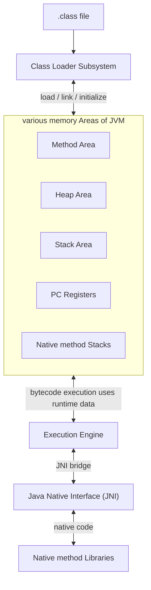
```mermaid
flowchart TB
  CF[".class file"] --> CLS["Class Loader Subsystem"]

  CLS <-->|"load / link / initialize"| RUNTIME

  subgraph RUNTIME ["various memory Areas of JVM"]
    direction LR
    MA["Method Area"]
    HEAP["Heap Area"]
    STACK["Stack Area"]
    PC["PC Registers"]
    NMS["Native method Stacks"]
  end

  RUNTIME <-->|"bytecode execution uses runtime data"| EE["Execution Engine"]

  EE <-->|"JNI bridge"| JNI["Java Native Interface (JNI)"]
  JNI <-->|"native code"| NML["Native method Libraries"]
```

**Data flow (same as whiteboard, top → bottom):**

| Step | From                   | To                      | Meaning                                                                                                                                          |
| ---- | ---------------------- | ----------------------- | ------------------------------------------------------------------------------------------------------------------------------------------------ |
| 1    | `.class file`          | Class Loader Subsystem  | Bytecode enters the JVM; loaders read `.class` (or JAR) bytes.                                                                                   |
| 2    | Class Loader Subsystem | various memory Areas    | Loaded types and static state land in **Method Area**; objects in **Heap**; frames in **Stack**; per-thread **PC** and **Native method Stacks**. |
| 3    | various memory Areas   | Execution Engine        | Interpreter / JIT reads bytecode and uses stack, heap, and method metadata.                                                                      |
| 4    | Execution Engine       | JNI                     | Calls into platform-specific native code when needed.                                                                                            |
| 5    | JNI                    | Native method Libraries | OS / C libraries backing `native` methods.                                                                                                       |

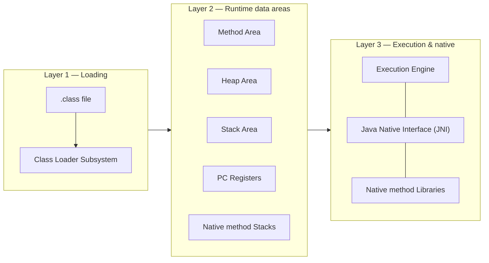
```mermaid
flowchart LR
  subgraph layer1 ["Layer 1 — Loading"]
    A[".class file"] --> B["Class Loader Subsystem"]
  end
  subgraph layer2 ["Layer 2 — Runtime data areas"]
    direction LR
    M1["Method Area"]
    M2["Heap Area"]
    M3["Stack Area"]
    M4["PC Registers"]
    M5["Native method Stacks"]
  end
  subgraph layer3 ["Layer 3 — Execution & native"]
    E["Execution Engine"]
    J["Java Native Interface (JNI)"]
    N["Native method Libraries"]
    E --- J --- N
  end
  layer1 --> layer2
  layer2 --> layer3
```

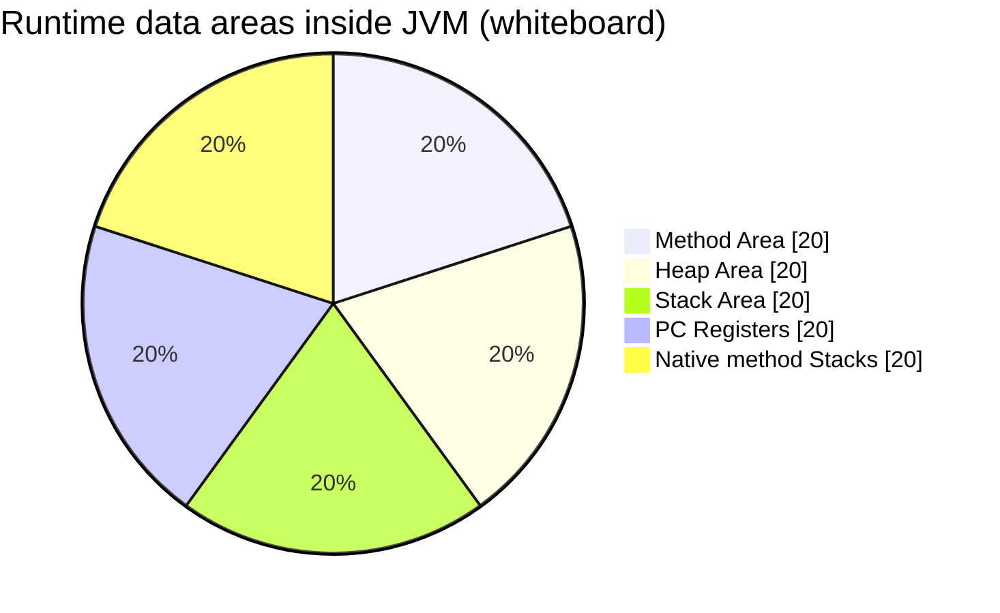
```mermaid
pie showData
    title Runtime data areas inside JVM (whiteboard)
    "Method Area" : 20
    "Heap Area" : 20
    "Stack Area" : 20
    "PC Registers" : 20
    "Native method Stacks" : 20
```

## Class Loader SubSystem

clas Loader Subsystem is responsible for the following 3 activities 

1. Loading 
2. Linking 
3. Initialization

### Loading

Loading means reading .class files and store corresponsing binary data in method area, for each class file JVM 
will store corresponding information in the method area 
1. Fully qualified name of class 
2. Fully qualified name of immediate parent class 
3. Methods information 
4. Variables information 
5. Constructtors information 
6. Modifiers information 
7. Constant pool information etc.

After loading .class file immediately JVM creates an object for that loaded class and the heap memory of type 
java.lang.class 


**Loading phase flow (whiteboard):** `.class` files on disk → **Method Area** metadata → **`java.lang.Class` object on Heap** (not application instances).

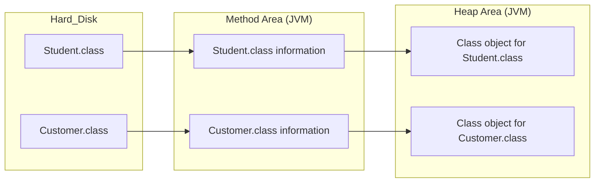
```mermaid
flowchart LR
  subgraph DISK ["Hard_Disk"]
    SCF["Student.class"]
    CCF["Customer.class"]
  end

  subgraph METHOD ["Method Area (JVM)"]
    SMI["Student.class information"]
    CMI["Customer.class information"]
  end

  subgraph HEAP ["Heap Area (JVM)"]
    SCO["Class object for Student.class"]
    CCO["Class object for Customer.class"]
  end

  SCF --> SMI
  CCF --> CMI
  SMI --> SCO
  CMI --> CCO
```

| Stage           | `Student.class` track                                                   | `Customer.class` track                                   |
| --------------- | ----------------------------------------------------------------------- | -------------------------------------------------------- |
| **Hard disk**   | `Student.class` bytecode file                                           | `Customer.class` bytecode file                           |
| **Method Area** | Student.class **information** (name, methods, fields, constant pool, …) | Customer.class **information**                           |
| **Heap Area**   | One **`java.lang.Class`** instance representing Student                 | One **`java.lang.Class`** instance representing Customer |

**Slide notes (green clouds on board):**

- It is **not** a `Student` **object** — it is a **`Class` object** for `Student.class`.
- It is **not** a `customer` **object** — it is a **`Class` object** for `Customer.class`.

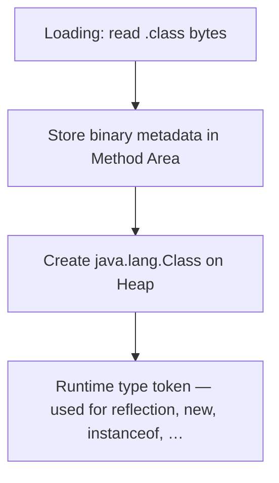
```mermaid
flowchart TB
  LOAD["Loading: read .class bytes"] --> MA["Store binary metadata in Method Area"]
  MA --> HO["Create java.lang.Class on Heap"]
  HO --> NOTE["Runtime type token — used for reflection, new, instanceof, …"]
```

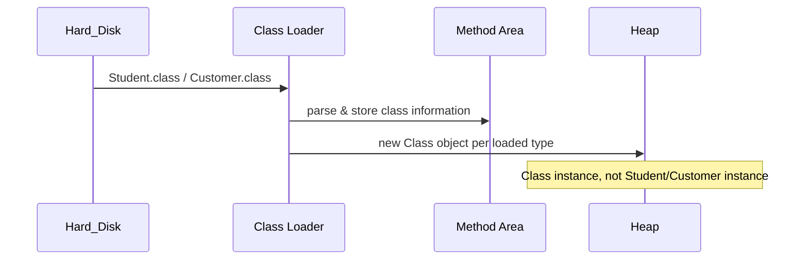
```mermaid
sequenceDiagram
  participant HD as Hard_Disk
  participant CL as Class Loader
  participant MA as Method Area
  participant HP as Heap
  HD->>CL: Student.class / Customer.class
  CL->>MA: parse & store class information
  CL->>HP: new Class object per loaded type
  Note over HP: Class instance, not Student/Customer instance
```

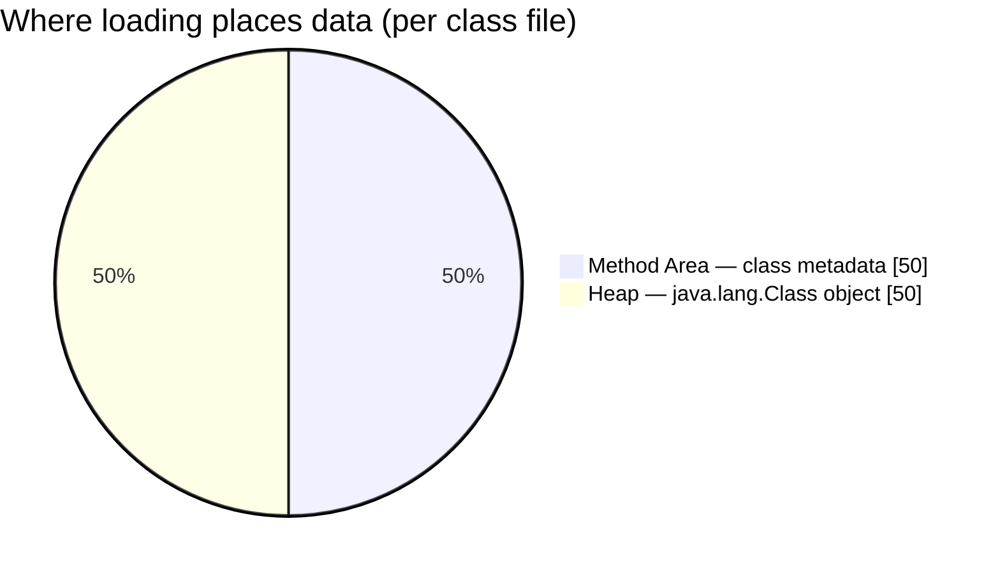
```mermaid
pie showData
    title Where loading places data (per class file)
    "Method Area — class metadata" : 50
    "Heap — java.lang.Class object" : 50
```

Class class object can be used by programmer to get class level information like 
1. methods information 
2. variables information 
3. constructors informaton etc

Example program: [VerifyMethodsUsingClassclass](../../../demo/src/main/java/com/jvmArchitecture/ClassclassDefinition/VerifyMethodsUsingClassclass.java)
   
NOTE 

For every loaded type only one class object will be created eventhough we are using the class multiple times in our program

In the program eventhough we are using student class multiple times only one Class class object got created 

### Linking

Linking consists of 3 activities 

a. verify 
b. prepare 
c. resolve

Verification:

1. It is the process of ensuring that binary representation of a class is structurally correct or not i.e JVM will check if .class file is generated by valid compiler or not i.e if .class file is properly formatted or not 
2. Internally byte code verifier is responsible for this activity , byet code verifier is the part of class loader subsystem
3. If verification fails we will get runtime exception saying "java.lang.VerifyError"

Preparation: 

1. In this phase JVM will allocate memory for class level static variables and assign default values 

NOTE: 

In initialization phase oroginal values will be assigned to the static variables and here only default values will be assigned.

Resolution: 

It is the process of replacing symbolic names inout program with original memory references from method area 

Ex: 

class test
{
   public static void main(String[] args)
   {
     String s = new String("durga");
     Student s1 = new Student();
   }
}

For the above class class loader loads 

1. Test.class
2. String.class
3. Student.class
4. Object.class

The names of these classes are stored in constant pool of test class, In resolution phase these names are replaced with original memory level references from method area 

### Initialization

<!-- description -->


**fig: Class Loading process** — all three activities run inside the **Class Loader Sub System**, in order: **Loading** → **Linking** → **Initialization**.

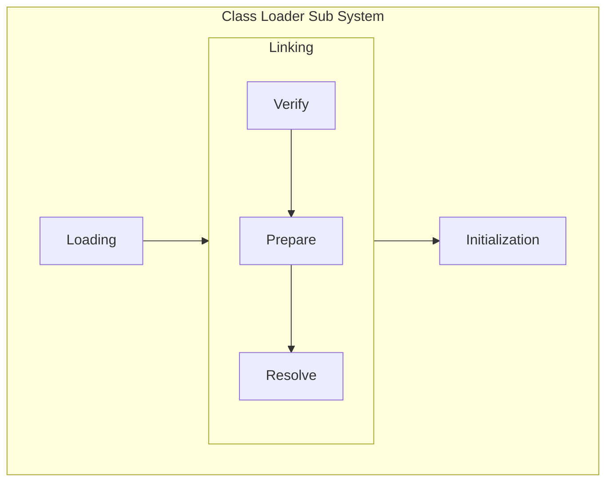
```mermaid
flowchart LR
  subgraph CLS ["Class Loader Sub System"]
    direction LR
    LOAD["Loading"]
    subgraph LINK ["Linking"]
      direction TB
      VER["Verify"]
      PRE["Prepare"]
      RES["Resolve"]
      VER --> PRE --> RES
    end
    INIT["Initialization"]
    LOAD --> LINK
    LINK --> INIT
  end
```

| Phase              | Role (high level)                                                                                  |
| ------------------ | -------------------------------------------------------------------------------------------------- |
| **Loading**        | Read `.class` bytes; place metadata in **Method Area**; create **`java.lang.Class`** on **Heap**   |
| **Linking**        | **Verify** bytecode → **Prepare** static fields (default values) → **Resolve** symbolic references |
| **Initialization** | Run `<clinit>`; assign static fields; class is ready for use                                       |

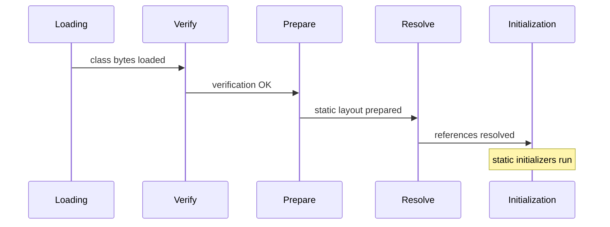
```mermaid
sequenceDiagram
  participant L as Loading
  participant V as Verify
  participant P as Prepare
  participant R as Resolve
  participant I as Initialization
  L->>V: class bytes loaded
  V->>P: verification OK
  P->>R: static layout prepared
  R->>I: references resolved
  Note over I: static initializers run
```

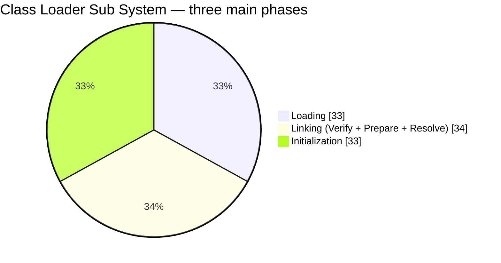
```mermaid
pie showData
    title Class Loader Sub System — three main phases
    "Loading" : 33
    "Linking (Verify + Prepare + Resolve)" : 34
    "Initialization" : 33
```

---
In this all static variables are assigned with original values and static blocks will be executed from parent to child and from top to bottom.

While loading , linking and initialization if any error occurs then we wil get RuntimeException saying 
"java.lang.linkageError"

## Types of Class Loaders

Class Loader SubSystems contains the following three types of classloaders 

1. BootStrap class Loader/Premordial class Loader
2. Extension class loader 
3. Application class loader/System class loader 

### Bootstrap Class Loader

BootStrap class Loader is responsible to load core jave API class i.e that classes presen in rt.jar


**Bootstrap classpath (slide):** core platform libraries under **`JDK\JRE\lib`** (classic layout: **`rt.jar`** holds fundamental `java.*` types).

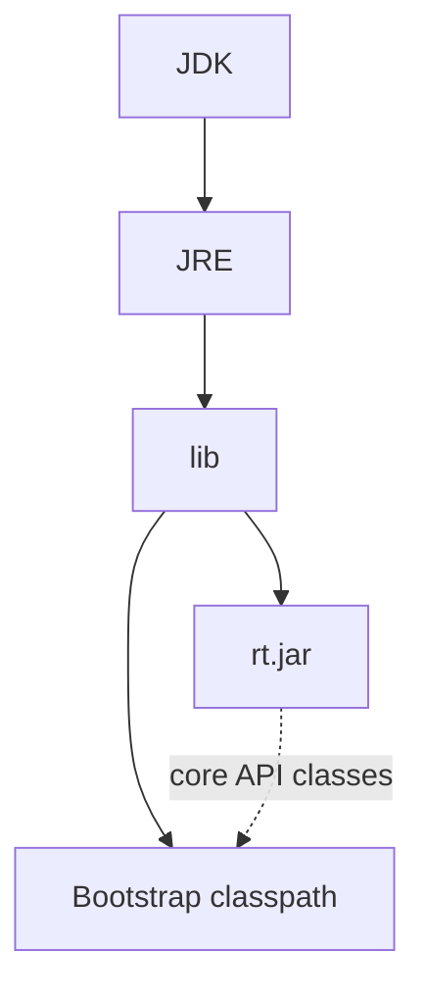
```mermaid
flowchart TB
  JDK["JDK"]
  JRE["JRE"]
  LIB["lib"]
  RT["rt.jar"]
  JDK --> JRE --> LIB --> RT
  LIB --> BCP["Bootstrap classpath"]
  RT -.->|"core API classes"| BCP
```

| Item                         | Whiteboard meaning                                                                                                        |
| ---------------------------- | ------------------------------------------------------------------------------------------------------------------------- |
| **JDK → JRE → lib → rt.jar** | Directory tree where bootstrap/platform classes are loaded from                                                           |
| **`JDK\JRE\lib`**            | Labeled **Bootstrap classpath** on the board                                                                              |
| **`rt.jar`**                 | Run-time archive of core Java classes (teaching diagram; module-based JDKs expose the same role via **jimage** / modules) |
| **Implementation**           | **Not Java** — bootstrap loader is **native (C/C++)**, drawn with **Java ✗** and **C/C++** underlined on the slide        |

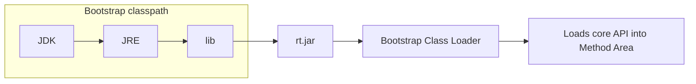
```mermaid
flowchart LR
  subgraph PATH ["Bootstrap classpath"]
    direction TB
    P1["JDK"]
    P2["JRE"]
    P3["lib"]
    P1 --> P2 --> P3
  end
  P3 --> RTJAR["rt.jar"]
  RTJAR --> BCL["Bootstrap Class Loader"]
  BCL --> MA["Loads core API into Method Area"]
```

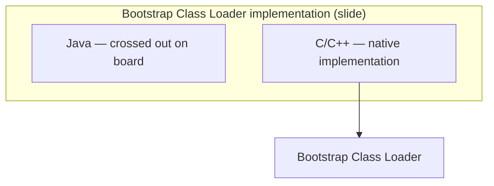
```mermaid
flowchart TB
  subgraph IMPL ["Bootstrap Class Loader implementation (slide)"]
    J["Java — crossed out on board"]
    N["C/C++ — native implementation"]
  end
  N --> BCL2["Bootstrap Class Loader"]
```

| Property          | Detail                                                 |
| ----------------- | ------------------------------------------------------ |
| **Parent**        | None — top of delegation chain                         |
| **`getParent()`** | Returns **`null`** (bootstrap convention)              |
| **Loads**         | Core `java.*` / platform classes (slide: **`rt.jar`**) |

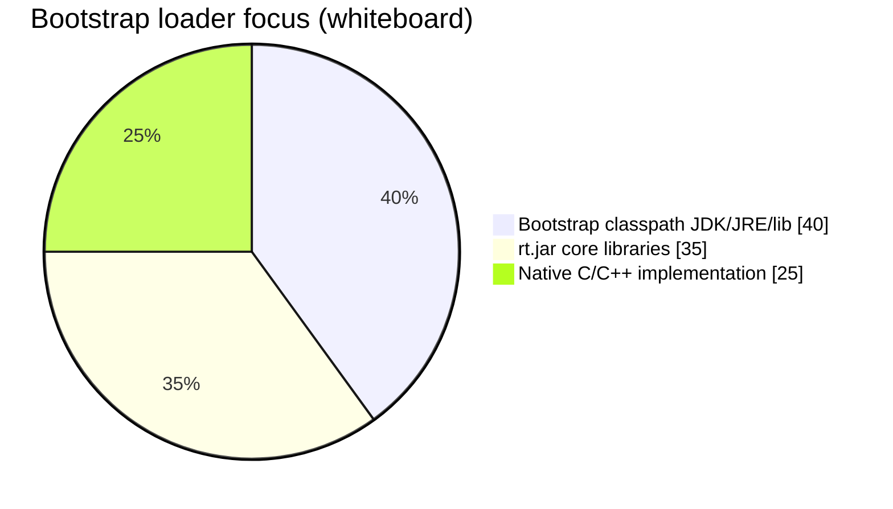
```mermaid
pie showData
    title Bootstrap loader focus (whiteboard)
    "Bootstrap classpath JDK/JRE/lib" : 40
    "rt.jar core libraries" : 35
    "Native C/C++ implementation" : 25
```
1. JDK/JRE/lib this location is called bootStrap classpath i.e BootStrap classloader is responsible to load classes from BootStrap classpath 
2. BootStrap class loader is by defautl available with every JVM , it is implemented in native languages like 
   C/C++ and not implemented in java.
    
### Extension Class Loader

1. Extension Class Loader is the child class of BootStrap class Loader 


**Extension classpath (slide):** **`JDK\JRE\lib\ext`** — loads classes from **`*.jar`** files in the **ext** directory (and paths from **`java.ext.dirs`** when configured).

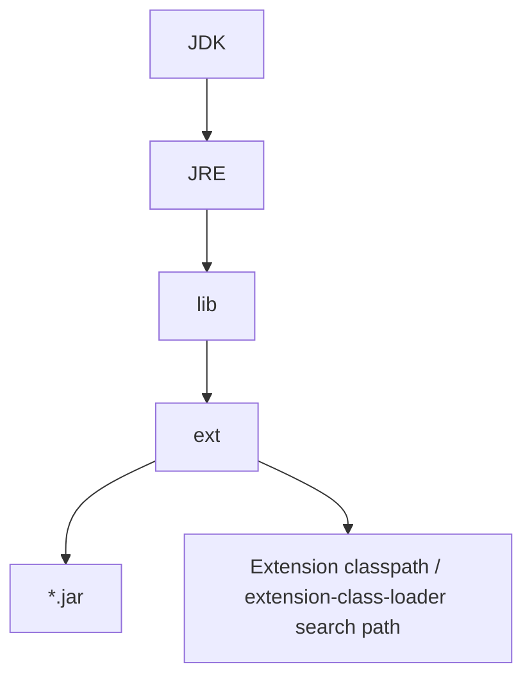
```mermaid
flowchart TB
  JDK["JDK"]
  JRE["JRE"]
  LIB["lib"]
  EXT["ext"]
  JARS["*.jar"]
  JDK --> JRE --> LIB --> EXT --> JARS
  EXT --> ECP["Extension classpath / extension-class-loader search path"]
```

| Item                               | Whiteboard meaning                                                                |
| ---------------------------------- | --------------------------------------------------------------------------------- |
| **JDK → JRE → lib → ext → \*.jar** | Tree of where extension JARs live                                                 |
| **`JDK\JRE\lib\ext`**              | Bubble on board → **extension class loader** search path                          |
| **Delegation**                     | **Extension C.L** delegates **up** to **Bootstrap C.L** before loading from `ext` |

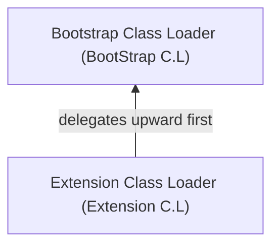
```mermaid
flowchart BT
  BOOT["Bootstrap Class Loader (BootStrap C.L)"]
  EXTCL["Extension Class Loader (Extension C.L)"]
  EXTCL -->|"delegates upward first"| BOOT
```

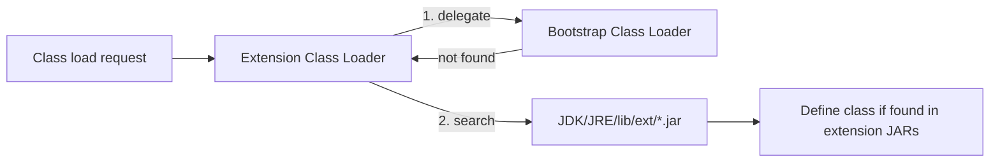
```mermaid
flowchart LR
  REQ["Class load request"] --> EXTCL2["Extension Class Loader"]
  EXTCL2 -->|"1. delegate"| BOOT2["Bootstrap Class Loader"]
  BOOT2 -->|"not found"| EXTCL2
  EXTCL2 -->|"2. search"| EXTD["JDK/JRE/lib/ext/*.jar"]
  EXTD --> LOAD["Define class if found in extension JARs"]
```

| Property         | Detail                                                    |
| ---------------- | --------------------------------------------------------- |
| **Parent**       | **Bootstrap** (via delegation)                            |
| **Typical path** | `$JAVA_HOME/jre/lib/ext` (classic layout on slide)        |
| **Also**         | Directories listed in **`java.ext.dirs`** system property |

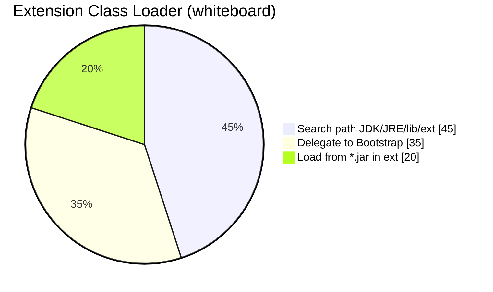
```mermaid
pie showData
    title Extension Class Loader (whiteboard)
    "Search path JDK/JRE/lib/ext" : 45
    "Delegate to Bootstrap" : 35
    "Load from *.jar in ext" : 20
```
Extention Class Loader is responsible to load classes from exctension classpath(jdk\jre\lib\ext) 

Extention Class Loader is implemented in java and the corresponding .class file is 

>sun.misc.Launcher$extClassLoader.class

### Application Class Loader or System Class Loader

1. Application class Loader is the child class of Extension class Loader 
2. This class Loader is responsible to load classes from application classpath 
3. It internally uses environment variable classpath 

Application Class Loader is implemented in java and the corresponding .class file is 

>sun.misc.Launcher$AppClassLoader.class 


**Delegation hierarchy (slide):** upward arrows — **Application Class Loader** → **Extension Class Loader** → **Bootstrap Class Loader**.

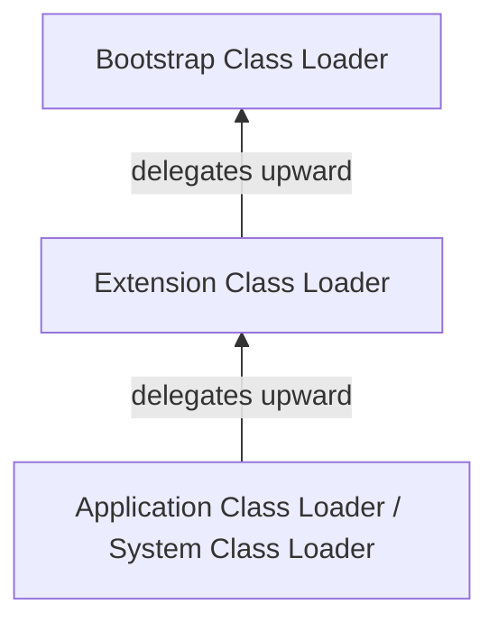
```mermaid
flowchart BT
  BOOT["Bootstrap Class Loader"]
  EXT["Extension Class Loader"]
  APP["Application Class Loader / System Class Loader"]
  APP -->|"delegates upward"| EXT
  EXT -->|"delegates upward"| BOOT
```

| Loader                   | Role on the board                                                      |
| ------------------------ | ---------------------------------------------------------------------- |
| **Application / System** | Loads classes from **application classpath** (`CLASSPATH`, `-cp`, CWD) |
| **Extension**            | Parent in hierarchy — searches `ext` after delegating up               |
| **Bootstrap**            | Top of chain — platform/core classes                                   |

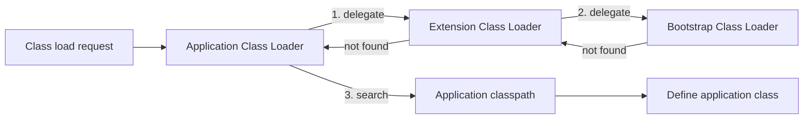
```mermaid
flowchart LR
  REQ["Class load request"] --> APPCL["Application Class Loader"]
  APPCL -->|"1. delegate"| EXTCL["Extension Class Loader"]
  EXTCL -->|"2. delegate"| BOOTCL["Bootstrap Class Loader"]
  BOOTCL -->|"not found"| EXTCL
  EXTCL -->|"not found"| APPCL
  APPCL -->|"3. search"| CP["Application classpath"]
  CP --> DEF["Define application class"]
```

**Implementation (whiteboard checkmark):**

```text
sun.misc.Launcher$AppClassLoader.class
```

```mermaid
flowchart TB
  subgraph IMPL ["Application Class Loader — Java implementation"]
    FILE["sun.misc.Launcher$AppClassLoader.class"]
    ROLE["Loads user / app classes from classpath"]
    FILE --> ROLE
  end
```

```mermaid
pie showData
    title Application Class Loader (whiteboard focus)
    "Child of Extension Class Loader" : 35
    "Application classpath (CLASSPATH)" : 40
    "AppClassLoader .class in Java" : 25
```

## How Class Loader works


**Flow (slide):** **JVM** sends a **request** → **Class Loader Subsystem** → **Application Class Loader** first, then **delegate upward**; each level **searches** its classpath if parents do not define the class.

```mermaid
flowchart LR
  JVM["JVM"] -->|"request"| CLS["Class Loader Subsystem"]
  CLS -->|"request"| APP["Application Class Loader"]
```

```mermaid
flowchart BT
  BOOT["Bootstrap Class Loader"]
  EXT["Extension Class Loader"]
  APP["Application Class Loader"]
  APP -->|"delegates"| EXT
  EXT -->|"delegates"| BOOT
```

| Level           | Searches in (whiteboard)                                                  |
| --------------- | ------------------------------------------------------------------------- |
| **Bootstrap**   | **Bootstrap class path** — `JDK \| JRE \| lib`                            |
| **Extension**   | **Extension class path** — `JDK \| JRE \| lib \| ext`                     |
| **Application** | **Application class path** — environment variable **`classpath`** / `-cp` |

```mermaid
flowchart TB
  APP2["Application Class Loader"] -->|"delegates"| EXT2["Extension Class Loader"]
  EXT2 -->|"delegates"| BOOT2["Bootstrap Class Loader"]
  BOOT2 -->|"searches"| BCP["Bootstrap class path JDK/JRE/lib"]
  BOOT2 -->|"not found — delegates down"| EXT2
  EXT2 -->|"searches"| ECP["Extension class path JDK/JRE/lib/ext"]
  EXT2 -->|"not found — delegates down"| APP2
  APP2 -->|"searches"| ACP["Application class path CLASSPATH"]
  APP2 -->|"still not found"| ERR["ClassNotFoundException or NoClassDefFoundError"]
```

**Point-by-point (delegation model):**

1. **JVM** asks the **Class Loader Subsystem** to load a type (by binary name).
2. **Application Class Loader** receives the request and **delegates upward** to **Extension**, then **Bootstrap**.
3. **Bootstrap** searches **JDK/JRE/lib** (bootstrap classpath). If it cannot define the class, control returns down the chain.
4. **Extension** searches **JDK/JRE/lib/ext**. If not found, delegates back to **Application**.
5. **Application** searches **application classpath** (`CLASSPATH`, `-cp`, etc.).
6. If **no loader** defines the class → **`ClassNotFoundException`** (load time) or later **`NoClassDefFoundError`** (use without successful load).

```mermaid
sequenceDiagram
  participant JVM
  participant App as Application C.L
  participant Ext as Extension C.L
  participant Boot as Bootstrap C.L
  JVM->>App: loadClass request
  App->>Ext: delegate parent first
  Ext->>Boot: delegate parent first
  Boot->>Boot: search bootstrap path
  Boot-->>Ext: not found
  Ext->>Ext: search ext path
  Ext-->>App: not found
  App->>App: search application classpath
  alt class found
    App-->>JVM: Class defined
  else not found
    App-->>JVM: ClassNotFoundException
  end
```

```mermaid
pie showData
    title Class loader search responsibility (conceptual)
    "Bootstrap path JDK/JRE/lib" : 33
    "Extension path lib/ext" : 33
    "Application CLASSPATH" : 34
```

1. Class Loader follows delegation hierarchy principle 
2. Whenever JVM come across a particular class first it will check if corresponding .class is already loaded or  not if it is already loaded in method area then JVM will consider that loaded class, if it is not laded then JVM requests class Loader subsystem to load that particular class
   Then class loader subsystem handovers the request to application class loader 
   Application class loader delegates the request to extension class loader which inturn delegates the rtequest to bootstrap class loader
3. Then bootstrap class loader will search in bootstrap classpath if it is available then the corresposding .class will be loaded by bootstrap class loader if it is not available then bootstrap class loader delegates the request to extension class loader 
4. Extension class loader will search in extension classpath if it is available then it will be loaded otherwise 
   extension class loader delegates the request to application class loader 
5. Application class loader will search in application classpath if it is available then it will be loaded otherwise we will get runtime exception saying NoClassDefFoundError or ClassNotFoundException

When the same `.class` is available on **both** the extension classpath and the application classpath, the **extension** loader defines it first (after bootstrap does not find it). Core types such as `String` report a **`null`** loader (bootstrap). The classroom program below prints which loader defined each type.

**Assumptions for the demo**

- `Customer.class` is present on **extension** and **application** class paths.
- `Test.class` is present on the **application** classpath only.

Example program: [Test](../../../demo/src/main/java/com/jvmArchitecture/HowClassLoaderWorks/Test.java)

```java
class Test
{
    public static void main(String[] args)
    {
        System.out.println(String.class.getClassLoader());
        System.out.println(Test.class.getClassLoader());
        System.out.println(Customer.class.getClassLoader());
    }
}
```

Run from the `demo` module (uses JDK 8 `java.ext.dirs` so extension classpath behavior matches classic slides):

```bash
./scripts/run-classloader-test.sh
```

### Execution summary

| Line | Class      | Typical loader printed               |
| ---- | ---------- | ------------------------------------ |
| 1    | `String`   | `null` (bootstrap)                   |
| 2    | `Test`     | `sun.misc.Launcher$AppClassLoader@…` |
| 3    | `Customer` | `sun.misc.Launcher$ExtClassLoader@…` |

Sample console output (hash suffix varies per run):

```text
null
sun.misc.Launcher$AppClassLoader@15db9742
sun.misc.Launcher$ExtClassLoader@55f96302
```

On **JDK 9+**, `-Djava.ext.dirs` is not supported; the lab script compiles bytecode for Java 8 and runs with a **JDK 8** runtime so the three loaders match the whiteboard.

NOTE : 

1. Boot strap class loader is not java object , hence we got null in the first case but extension and application class loaders are java objects.Hence we are getting corresponding output for the remaining 2 sop's 
[classname@hashcode_in_hexadecimalform]

2. Class loader subsystem will give the highest priority for Boot strap classpath and then extension classpath followed by application classpath 


## What is the need of Customized Class Loader

1. Default class loaders will load .class file only once eventhough we are using multiple times that class in our program 
2. After loading .class file if it is modified outside then default class loader won't load updated version of class file(because .class file already availabel in method area)
3. We can resolve this problem by defining our own customized class loader 
4. The main advantage of customized class loader is we can control class loading mechanism based on our requirement 
5. For example we can load .class file separately every time so that updated version available to our program 

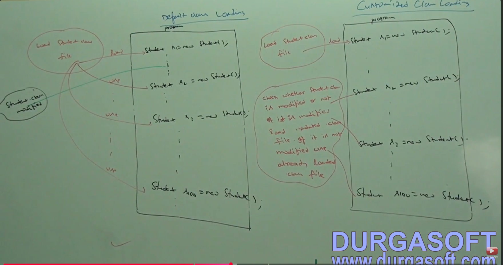

**Flow (slide):** In the **program**, many references such as `Student s1 = new Student()` … `Student s100 = new Student()` need the same type. **Default** loaders **load once** and **reuse** the `Class` in the **Method Area** even if `Student.class` is **modified on disk** later. A **customized** loader can **check for modification** before each use and **reload** the updated `.class` when needed.

```mermaid
flowchart LR
  subgraph PROG ["Program (whiteboard)"]
    direction TB
    S1["Student s1 = new Student()"]
    S2["Student s2 = new Student()"]
    S3["Student s3 = new Student()"]
    DOTS["…"]
    S100["Student s100 = new Student()"]
    S1 --> S2 --> S3 --> DOTS --> S100
  end
```

| Model                        | First `new Student()`         | Later `new Student()` (s2 … s100)                       | `Student.class` modified on disk       |
| ---------------------------- | ----------------------------- | ------------------------------------------------------- | -------------------------------------- |
| **Default class loading**    | **load** `Student.class` once | **use** already loaded class                            | Still **use** old class in Method Area |
| **Customized class loading** | **load** `Student.class`      | **check** modified → **load** updated or **use** cached | Can **reload** updated `.class`        |

```mermaid
flowchart TB
  subgraph DEFAULT ["Default class loading"]
    DLOAD["Load Student.class file"]
    DS1["s1 = new Student()"]
    DREST["s2 … s100 = new Student()"]
    DMOD["Student.class modified"]
    DLOAD -->|"load"| DS1
    DLOAD -->|"use (same Class in Method Area)"| DREST
    DMOD -.->|"no reload"| DREST
  end
```

```mermaid
flowchart TB
  subgraph CUSTOM ["Customized class loading"]
    CLOAD["Load Student.class file"]
    CS1["s1 = new Student()"]
    CCHK["Check whether Student.class is modified"]
    CYES["Load updated .class file"]
    CNO["Use already loaded .class file"]
    CREST["s2 … s100 = new Student()"]
    CLOAD -->|"load"| CS1
    CS1 --> CREST
    CREST --> CCHK
    CCHK -->|"modified"| CYES --> CREST
    CCHK -->|"not modified"| CNO --> CREST
  end
```

```mermaid
sequenceDiagram
  participant P as Program
  participant D as Default class loader
  participant M as Method Area
  participant F as Student.class on disk
  P->>D: new Student() — first time
  D->>F: read .class
  D->>M: define Student (once)
  P->>D: new Student() — again
  D->>M: use existing Class
  Note over F,M: File updated on disk
  P->>D: new Student() — again
  D->>M: still use old Class
```

```mermaid
sequenceDiagram
  participant P as Program
  participant C as Customized class loader
  participant M as Method Area
  participant F as Student.class on disk
  P->>C: new Student() — first time
  C->>F: read .class
  C->>M: define Student
  P->>C: new Student() — again
  C->>F: check last modified / checksum
  alt not modified
    C->>M: use already loaded Class
  else modified
    C->>F: read updated .class
    C->>M: load new version
  end
```

```mermaid
pie showData
    title Why customize class loading? (slide focus)
    "Load once — default reuse" : 35
    "Detect .class file changes" : 35
    "Reload updated bytecode" : 30
```

## Psuedo code for Customized Class Loader or How to define customized Class Loader

We can define our own customized class loader by extending **`java.lang.ClassLoader`**. Override **`loadClass(String cname)`** (slide spelling) so the loader **checks for updates**, **loads the updated `.class` file** when needed, and **returns** the corresponding **`Class`** object.

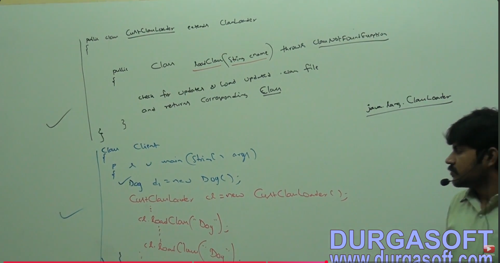

**Flow (slide):** Define **`CustClassLoader extends ClassLoader`** → override **`loadClass`** with custom reload logic → in **`Client`**, use default loading once (`new Dog()`), then call **`cl.loadClass("Dog")`** on your custom loader whenever you want an update check.

**Pseudo code (whiteboard)**

```java
public class CustClassLoader extends ClassLoader {

    public Class loadClass(String cname) throws ClassNotFoundException {
        // check for updates & load updated .class file
        // and return corresponding Class object
    }
}
```

```java
class Client {

    public static void main(String[] args) {
        Dog d1 = new Dog();

        CustClassLoader cl = new CustClassLoader();
        cl.loadClass("Dog");
        // ...
        cl.loadClass("Dog");
    }
}
```

| Piece                                     | Role on the board                                               |
| ----------------------------------------- | --------------------------------------------------------------- |
| **`CustClassLoader extends ClassLoader`** | Custom loader type; parent API is **`java.lang.ClassLoader`**   |
| **`loadClass(String cname)`**             | Entry point — inspect / reload bytecode for binary name `cname` |
| **`new Dog()`**                           | Normal **default** class loading (application loader)           |
| **`cl.loadClass("Dog")`**                 | Explicit load through **custom** logic (can repeat for updates) |

```mermaid
flowchart TB
  subgraph DEFINE ["Define customized class loader"]
    BASE["java.lang.ClassLoader"]
    CUST["CustClassLoader extends ClassLoader"]
    LC["loadClass(String cname)"]
    LOGIC["Check for updates → load updated .class → return Class"]
    BASE --> CUST --> LC --> LOGIC
  end
```

```mermaid
flowchart TB
  subgraph CLIENT ["Client.main (whiteboard)"]
    D["Dog d1 = new Dog()"]
    CL["CustClassLoader cl = new CustClassLoader()"]
    L1["cl.loadClass(\"Dog\")"]
    L2["cl.loadClass(\"Dog\") …"]
    D --> CL --> L1 --> L2
  end
  DEF["Loaded by Default class Loader"]
  CUST["Loaded by Customized class Loader"]
  D -.-> DEF
  L1 -.-> CUST
  L2 -.-> CUST
```

```mermaid
flowchart LR
  subgraph DEFAULT_PATH ["Default loading"]
    ND["new Dog()"]
    APP["Application / System ClassLoader"]
    MA["Method Area — Dog Class cached"]
    ND --> APP --> MA
  end
  subgraph CUSTOM_PATH ["Customized loading"]
    LC["cl.loadClass(\"Dog\")"]
    CCL["CustClassLoader.loadClass"]
    UPD["Check updates → load .class if needed"]
    RET["Return Class object"]
    LC --> CCL --> UPD --> RET
  end
```

```mermaid
flowchart TB
  START["Client calls cl.loadClass(\"Dog\")"]
  CHK["CustClassLoader: check whether Dog.class updated"]
  RELOAD["Read updated .class bytes from disk"]
  DEFINE["defineClass / link → Class object"]
  CACHE["Return already loaded Class"]
  RET["Return Class to Client"]
  START --> CHK
  CHK -->|"modified"| RELOAD --> DEFINE --> RET
  CHK -->|"not modified"| CACHE --> RET
```

```mermaid
sequenceDiagram
  participant C as Client
  participant App as Default class loader
  participant Cust as CustClassLoader
  participant Disk as Dog.class on disk
  C->>App: new Dog() — first reference
  App->>Disk: load if not present
  App-->>C: Dog instance d1
  C->>Cust: loadClass("Dog")
  Cust->>Disk: check / read .class
  Cust-->>C: Class for Dog
  C->>Cust: loadClass("Dog") again
  Cust->>Disk: check for updates
  alt updated on disk
    Cust->>Cust: load new bytecode
  else unchanged
    Cust->>Cust: use cached definition
  end
  Cust-->>C: Class for Dog
```

```mermaid
pie showData
    title Customized loader pseudo code (slide focus)
    "Extend java.lang.ClassLoader" : 30
    "Override loadClass" : 35
    "Client calls loadClass repeatedly" : 35
```
While designing WebServers and application servers usualll we can go for customized class loaders to customize 
class loading mechanism 

What is the need of classloader class ?

we can use **`java.lang.ClassLoader`** class to define our own customized class loaders, every class ooader in java should be child class of **`java.lang.ClassLoader`** class either directly or indirectly, hence this class acts as base class for all cutomized class loaders 

## Various Memory Areas of JVM

Whenever JVM loads and runs a java program it needs memory to store several things like bytecode, objects and variables etc 
             Total JVM memory organized into following 5 categories 

1. Method area 
2. Heap area 
3. Stack memory
4. PC registers 
5. Native method Stacks 

### Method Area

1. For every JVM one Method area will be available 
2. Method area will be created at the time of jvm startup 
3. Inside Method area class level binary data including static variables will be stored 
4. Constant pools of a class will be stored inside Method area 

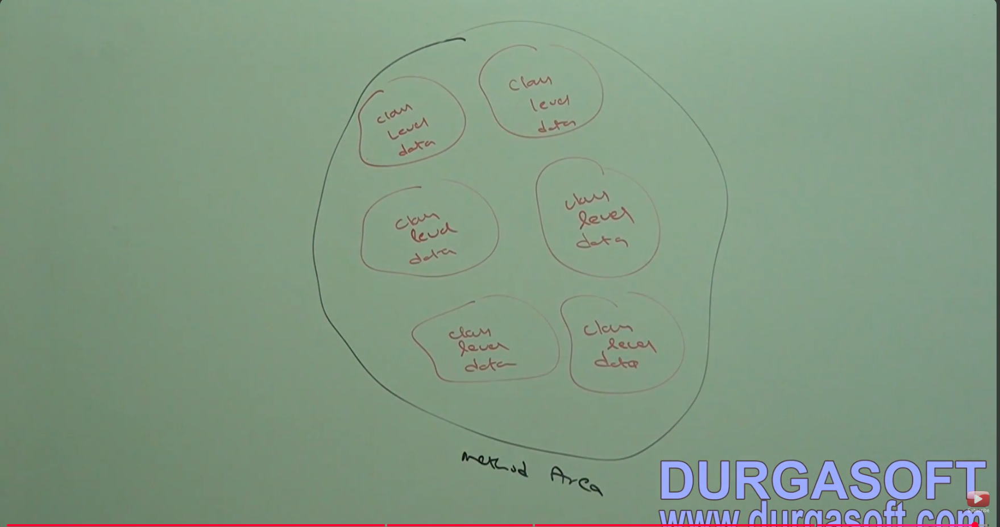

**Flow (slide):** One shared **Method Area** contains **many** entries; each loaded class occupies its own **class level data** region (the board shows six as an example).

```mermaid
flowchart TB
  subgraph MA ["Method Area"]
    direction TB
    C1["class level data"]
    C2["class level data"]
    C3["class level data"]
    C4["class level data"]
    C5["class level data"]
    C6["class level data"]
  end
```

| Whiteboard element                       | Meaning                                                 |
| ---------------------------------------- | ------------------------------------------------------- |
| **Outer boundary — Method Area**         | Single per-JVM region for type metadata                 |
| **Each inner bubble — class level data** | Per-class binary metadata (methods, constants, statics) |
| **Multiple bubbles**                     | Several classes loaded concurrently                     |

```mermaid
flowchart LR
  CL["Class Loader Subsystem"] -->|"loads .class"| DEFINE["Define class"]
  DEFINE -->|"stores class level data"| MA2["Method Area"]
  MA2 --> D1["Loaded class 1"]
  MA2 --> D2["Loaded class 2"]
  MA2 --> D3["Loaded class 3"]
  MA2 --> MORE["…"]
```

```mermaid
flowchart TB
  subgraph ENTRY ["One class — class level data (points 3 & 4)"]
    BIN["Class-level binary data"]
    STATIC["Static variables"]
    POOL["Constant pool"]
    BIN --- STATIC
    STATIC --- POOL
  end
```

```mermaid
sequenceDiagram
  participant JVM
  participant MA as Method Area
  participant CL as Class loader
  JVM->>MA: create at JVM startup (point 2)
  CL->>MA: store class level data on load (points 3–4)
  Note over MA: One Method Area — many classes
```

```mermaid
pie showData
    title Method Area (whiteboard focus)
    "Class-level binary data" : 40
    "Static variables" : 30
    "Constant pools" : 30
```
Method Area can bve accessed by multiple threads simultaneously

### Heap Area

1. For every JVM one heap area is available 
2. Heap area will be created at the time of JVM startup 
3. Objects and corresponding instance variables will be stored in the heap area.
4. Every array in java is object only, hence arrays also stored in the heap area.
5. Heap Area can be accessed by multiple threads and hence the data stored in th heap memory is not thread safe.
6. Heap Area need be continuous.

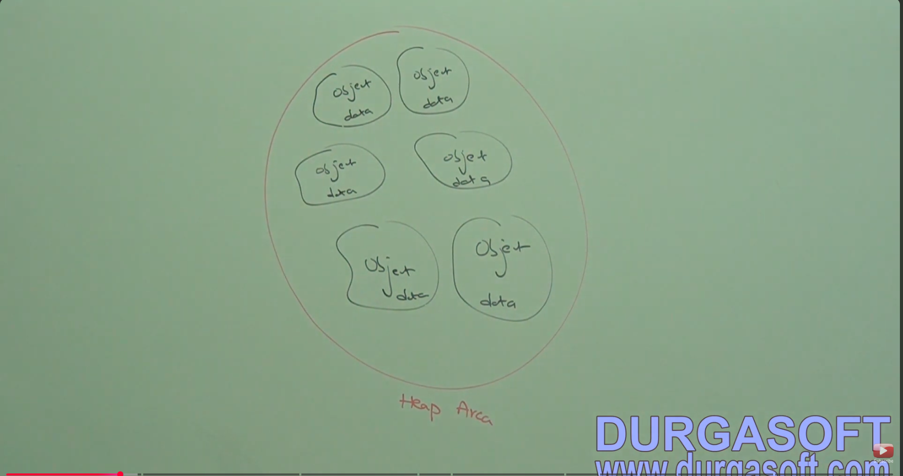

**Flow (slide):** One shared **Heap Area** holds **many** runtime objects; each instance contributes its own **object data** entry (the board shows six as an example). Class metadata lives in the **Method Area**; **objects and instance fields** live on the **Heap** (points 3–4).

```mermaid
flowchart TB
  subgraph HEAP ["Heap Area"]
    direction TB
    O1["object data"]
    O2["object data"]
    O3["object data"]
    O4["object data"]
    O5["object data"]
    O6["object data"]
  end
```

| Whiteboard element                 | Meaning                                                 |
| ---------------------------------- | ------------------------------------------------------- |
| **Outer boundary — Heap Area**     | Single per-JVM region for object instances (point 1)    |
| **Each inner shape — object data** | One object’s instance data on the heap (point 3)        |
| **Multiple shapes**                | Many objects (and arrays — point 4) allocated over time |

```mermaid
flowchart LR
  NEW["new Student() / new int[]"] --> ALLOC["Allocate on Heap"]
  ALLOC --> HEAP2["Heap Area"]
  HEAP2 --> OD1["Object 1 — object data"]
  HEAP2 --> OD2["Object 2 — object data"]
  HEAP2 --> OD3["Array — object data"]
  HEAP2 --> MORE["…"]
```

```mermaid
flowchart TB
  subgraph ONE ["One object — object data (point 3)"]
    INST["Instance variables"]
    REF["References to other objects"]
    ARR["Array elements (arrays are objects — point 4)"]
    INST --- REF
    REF --- ARR
  end
```

```mermaid
sequenceDiagram
  participant JVM
  participant Heap as Heap Area
  participant T1 as Thread 1
  participant T2 as Thread 2
  JVM->>Heap: create at JVM startup (point 2)
  T1->>Heap: new object — object data
  T2->>Heap: new object — object data
  Note over Heap: Shared heap — points 5–6 (multi-thread access; layout concerns)
```

```mermaid
pie showData
    title Heap Area (whiteboard focus)
    "Object instance data" : 45
    "Arrays as objects" : 25
    "Shared across threads" : 30
```

1. A java application can communicate with JVM by using Runtime object 
2. Runtime class present in java.lang package and it is a singleton class 
3. We can create Runtime Object as follows 
   Runtime R = Runtime.getRuntime();
4. once we get runtime objects we can call the following methods on that object 
5. >R.maxMemory():
   It returns the number of bytes of maxmemory allocated to the heap 
6. >R.totalMemory():
   It returns number of bytes of total memory allocated to the heap(initial memory)
7. >R.freeMemory():
   It returns number of bytes of free memory present in the heap
8. Heap memory is finite memory but based on our requirement we can set maximum and minimum heap sizes i.e 
   We can increase or decrease the heap size based on our requirement 
9. We can use the following flags with java command
   -Xmx : to set maximum heap size (maxMemory)
   Ex: java -Xmx512M HeapDemo 
   This command will set maximum heap size as 512 MB
   -Xms : we can use this command to set minimum heap size 
   Ex: java -Xms64M HeapDemo
   To set minimum heap size as 64 MB i.e totalMemory

   
### Stack Area

1. For every thread jvm will create a separate stack at the time of thread creation 
2. Each and every method call performed by that thread will be stored in the stack including loacl variables  also
3. After completing a method the corresponding entry from the stack will be removed 
4. After completing all method calls the stakc will become empty and that empty stack will be destroyed by the jvm just before terminating the thread.
5. Each entry in the stack is called stack frame or activation record 
6. The data stored in the stack is available for the corresponding thread and not available to the remaining threads, hence this data is thread safe

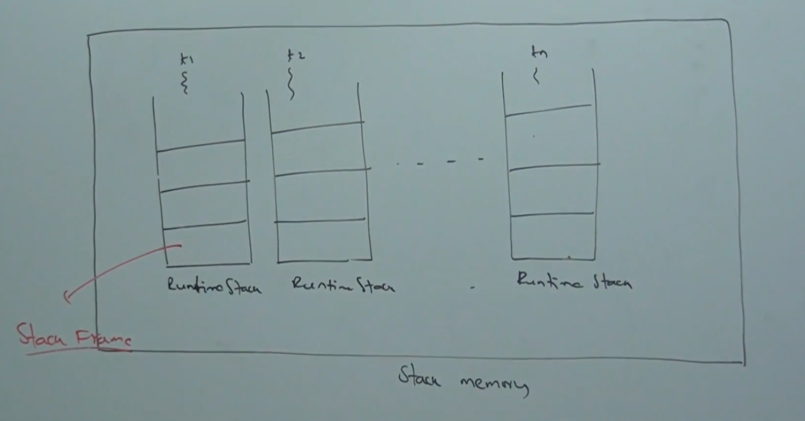

**Flow (slide):** **Stack memory** holds one **Runtime Stack** per thread (**t1**, **t2**, … **tn**). Each method call pushes a **Stack Frame** (activation record); when the method returns, that frame is popped (points 2–3). When the thread ends, its empty stack is destroyed (point 4).

```mermaid
flowchart TB
  subgraph SM ["Stack memory"]
    direction LR
    subgraph RS1 ["Runtime Stack — t1"]
      direction TB
      F1a["Stack Frame"]
      F1b["Stack Frame"]
      F1c["Stack Frame"]
    end
    subgraph RS2 ["Runtime Stack — t2"]
      direction TB
      F2a["Stack Frame"]
      F2b["Stack Frame"]
    end
    DOTS["…"]
    subgraph RSn ["Runtime Stack — tn"]
      direction TB
      Fna["Stack Frame"]
      Fnb["Stack Frame"]
    end
    RS1 --- DOTS --- RSn
  end
```

| Whiteboard element               | Maps to notes                                                 |
| -------------------------------- | ------------------------------------------------------------- |
| **Stack memory**                 | JVM region for thread stacks (one stack per thread — point 1) |
| **t1, t2, … tn**                 | Each **thread** gets its own **Runtime Stack**                |
| **Stack Frame**                  | One **method call** + **local variables** (points 2, 5)       |
| **Frames removed / empty stack** | Method return (point 3); thread exit (point 4)                |

```mermaid
flowchart LR
  T1["Thread t1"] --> ST1["Runtime Stack t1"]
  T2["Thread t2"] --> ST2["Runtime Stack t2"]
  TN["Thread tn"] --> STN["Runtime Stack tn"]
  ST1 --> PRIV1["Thread-safe — only t1 sees this data (point 6)"]
  ST2 --> PRIV2["Thread-safe — only t2 sees this data"]
```

```mermaid
flowchart TB
  CALL["Method call by thread"] --> PUSH["Push Stack Frame"]
  PUSH --> RUN["Execute — locals on frame (point 2)"]
  RUN --> RET["Method completes"]
  RET --> POP["Pop frame from stack (point 3)"]
  POP --> MORE{More calls?}
  MORE -->|yes| CALL
  MORE -->|no — thread ends| EMPTY["Stack empty → destroyed (point 4)"]
```

```mermaid
sequenceDiagram
  participant T as Thread t1
  participant RS as Runtime Stack
  T->>RS: push frame — main()
  T->>RS: push frame — m1() (locals)
  T->>RS: pop frame — m1 returns
  T->>RS: pop frame — main returns
  Note over RS: Each entry is a Stack Frame (point 5)
```

```mermaid
pie showData
    title Stack memory (whiteboard focus)
    "One Runtime Stack per thread" : 35
    "Stack Frame per method call" : 40
    "Thread-private / thread-safe data" : 25
```
#### Stack frame Structure 

Each stack frame contains 3 parts:

1. **Local variable array** — storage for method parameters and local variables  
2. **Operand stack** — workspace for bytecode execution (push/pop operands)  
3. **Frame data** — metadata for the frame (constant pool reference, return address, exception handling, etc.)

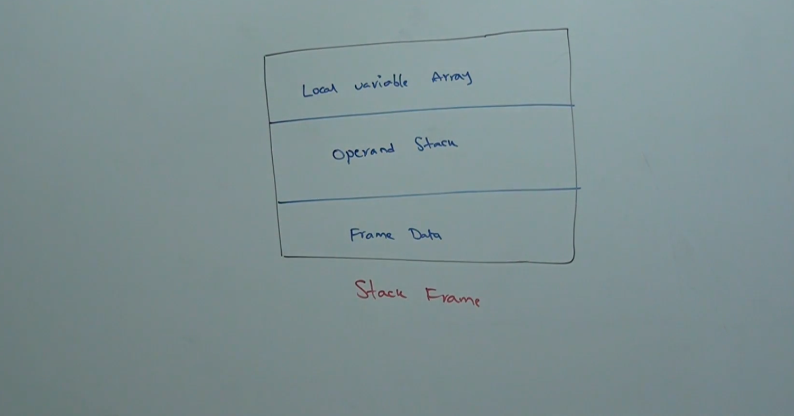

**Flow (slide):** One **Stack Frame** is a vertical block with three sections — **Local variable Array** (top), **Operand Stack** (middle), and **Frame Data** (bottom).

```mermaid
flowchart TB
  subgraph SF ["Stack Frame"]
    direction TB
    LV["Local variable Array"]
    OS["Operand Stack"]
    FD["Frame Data"]
    LV --> OS --> FD
  end
```

| Section (top → bottom)   | Role                                                                 |
| ------------------------ | -------------------------------------------------------------------- |
| **Local variable Array** | Holds parameters and locals for the current method                   |
| **Operand Stack**        | Evaluates expressions — operands and partial results                 |
| **Frame Data**           | Links to constant pool, return address, dynamic dispatch, exceptions |

```mermaid
flowchart LR
  BYTE["Bytecode instruction"] --> OS2["Operand Stack"]
  OS2 --> LV2["Local variable Array"]
  OS2 --> FD2["Frame Data"]
  FD2 --> CP["Constant pool / return info"]
```

```mermaid
sequenceDiagram
  participant M as Method invocation
  participant SF as Stack Frame
  M->>SF: create frame — push on Runtime Stack
  SF->>SF: allocate Local variable Array
  SF->>SF: initialize Operand Stack
  SF->>SF: set Frame Data
  Note over SF: Bytecode runs using operand stack + locals
  M->>SF: return — pop frame
```

```mermaid
pie showData
    title Stack Frame structure (whiteboard)
    "Local variable Array" : 35
    "Operand Stack" : 35
    "Frame Data" : 30
```

-Local variable Array : 
1. It contains all parameters and local variables of the method 
2. Each slot in the array is of 4 bytes 
3. Values of type int , float and reference(Object) occupy one entry in the array 
4. Values of double and long occupy 2 consecutive entries in the array
5. byte, short and char values will be converted to int type before storing and occupy one slot But the way of storing boolean values is varied form jvm to jvm.But most of the jvm's follow one slot for boolean values 

### PC Registers

<!-- description -->

### Native Method Stacks

<!-- description -->

---

## Program to display heap memory statistics

<!-- description -->

---

## How to set Maximum and Minimum heap size?

<!-- description -->

---

## Execution Engine

<!-- description -->

### Interpreter

<!-- description -->

### JIT Compilers

<!-- description -->

---

## Java Native Interface (JNI)

<!-- description -->

---

## Complete Architecture Diagram of JVM

<!-- description -->

---

## Class File Structure

<!-- description -->
