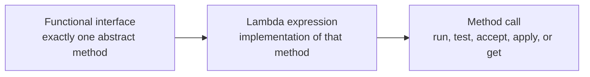
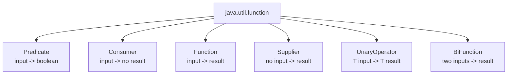
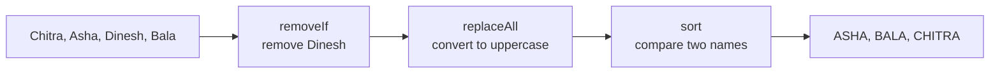
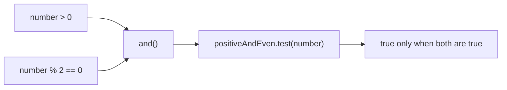
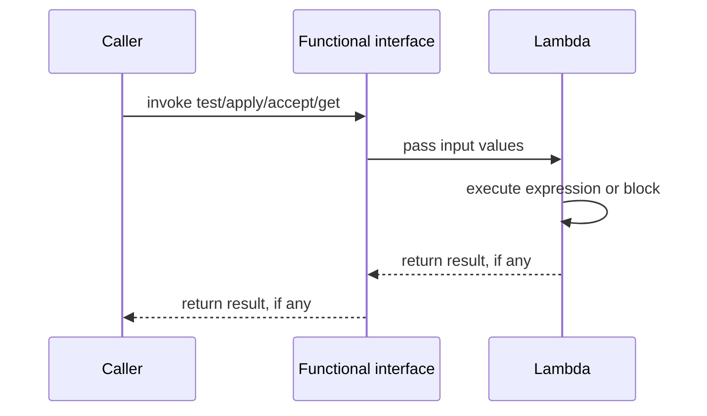

# Lambda Functions in Java

<!-- TOC -->
- [Lambda Functions in Java](#lambda-functions-in-java)
  - [Source program](#source-program)
  - [What is a lambda expression?](#what-is-a-lambda-expression)
  - [Lambda syntax](#lambda-syntax)
  - [Built-in functional interfaces](#built-in-functional-interfaces)
    - [`Predicate<T>`](#predicatet)
    - [`Consumer<T>`](#consumert)
    - [`Function<T, R>`](#functiont-r)
    - [`Supplier<T>`](#suppliert)
    - [`UnaryOperator<T>`](#unaryoperatort)
    - [`BiFunction<T, U, R>`](#bifunctiont-u-r)
  - [Lambdas with collections](#lambdas-with-collections)
  - [Method references](#method-references)
  - [Combining lambdas](#combining-lambdas)
  - [Lambda execution flow](#lambda-execution-flow)
  - [Lambda rules and limitations](#lambda-rules-and-limitations)
  - [Anonymous class comparison](#anonymous-class-comparison)
  - [Summary](#summary)
<!-- /TOC -->

## Source program

The complete runnable class is available here:

[lambdaFunctions.java](../../demo/src/main/java/com/lambda/lambdaFunctions.java)

Run this class to execute every example:

```text
No parameter lambda
One parameter: Hello lambda
Multiple parameters: 30
Block body result: 10
Predicate 8 is even: true
Predicate 7 is even: false
JAVA LAMBDA
Length of Java: 4
Hello from Supplier
Square of 6: 36
Collection result: [ASHA, BALA, CHITRA]
...
6 is positive and even: true
-4 is positive and even: false
```

## What is a lambda expression?

A lambda expression is a short way to provide the implementation of a method that belongs to a **functional interface**.

A functional interface has exactly one abstract method. The lambda supplies the code for that one method without requiring a separate class or an anonymous class.



For example:

```java
Predicate<Integer> isEven = number -> number % 2 == 0;
boolean result = isEven.test(8);
```

Here, `number -> number % 2 == 0` is the lambda. It receives an integer and returns whether that integer is even.

## Lambda syntax

The general form is:

```text
(parameters) -> expression
```

When more than one statement is required, use a block body:

```text
(parameters) -> {
    statements;
    return result;
}
```

### No parameter

```java
Runnable task = () -> System.out.println("Running");
task.run();
```

The empty parentheses mean that the lambda receives no arguments.

### One parameter

```java
Consumer<String> printer = message -> System.out.println(message);
```

Parentheses around one inferred parameter are optional. This is equivalent:

```java
Consumer<String> printer = (String message) -> System.out.println(message);
```

### Multiple parameters

```java
BiFunction<Integer, Integer, Integer> add = (first, second) -> first + second;
```

Parentheses are required when there are two or more parameters.

### Expression body and block body

An expression body returns its value automatically:

```java
Function<Integer, Integer> doubleNumber = number -> number * 2;
```

A block body needs an explicit `return` when the functional method returns a value:

```java
Function<Integer, Integer> doubleNumber = number -> {
    int result = number * 2;
    return result;
};
```

These two lambdas produce the same result.

## Built-in functional interfaces

Java provides common functional interfaces in `java.util.function` so you do not need to define one for every simple operation.



### `Predicate<T>`

`Predicate<T>` accepts one value and returns `boolean`.

```java
Predicate<Integer> isEven = number -> number % 2 == 0;
boolean answer = isEven.test(8);
```

Use it for conditions, filtering, validation, and searching.

| Method        | Meaning                                     |
| ------------- | ------------------------------------------- |
| `test(value)` | Evaluates the condition.                    |
| `and(other)`  | Requires both conditions to be true.        |
| `or(other)`   | Requires at least one condition to be true. |
| `negate()`    | Reverses the result.                        |

### `Consumer<T>`

`Consumer<T>` accepts one value and returns nothing.

```java
Consumer<String> printUpperCase = value -> System.out.println(value.toUpperCase());
printUpperCase.accept("java lambda");
```

Use it for printing, logging, or updating an external object.

### `Function<T, R>`

`Function<T, R>` accepts a value of type `T` and returns a value of type `R`.

```java
Function<String, Integer> textLength = text -> text.length();
int length = textLength.apply("Java");
```

Use it for transformation or conversion.

### `Supplier<T>`

`Supplier<T>` accepts no input and produces a value when `get()` is called.

```java
Supplier<String> greeting = () -> "Hello from Supplier";
String message = greeting.get();
```

Use it for lazy value creation, default values, or object construction.

### `UnaryOperator<T>`

`UnaryOperator<T>` is a specialized `Function<T, T>`: the input and output have the same type.

```java
UnaryOperator<Integer> square = number -> number * number;
int result = square.apply(6);
```

### `BiFunction<T, U, R>`

`BiFunction<T, U, R>` accepts two inputs and returns a result.

```java
BiFunction<Integer, Integer, Integer> add = (first, second) -> first + second;
int result = add.apply(10, 20);
```

## Lambdas with collections

Lambda expressions work naturally with collection methods:

```java
List<String> names = new ArrayList<>(List.of("Chitra", "Asha", "Dinesh", "Bala"));
names.removeIf(name -> name.startsWith("D"));
names.replaceAll(name -> name.toUpperCase());
names.sort((first, second) -> first.compareTo(second));
```

The operations happen in this order:



## Method references

A method reference is an even shorter form of a lambda when an existing method already has the required shape.

```java
names.forEach(System.out::println);
names.stream().map(String::length).forEach(System.out::println);
```

The equivalent lambdas are:

```java
names.forEach(value -> System.out.println(value));
names.stream().map(value -> value.length()).forEach(value -> System.out.println(value));
```

| Method reference      | Equivalent lambda                    |
| --------------------- | ------------------------------------ |
| `System.out::println` | `value -> System.out.println(value)` |
| `String::length`      | `value -> value.length()`            |
| `Integer::parseInt`   | `text -> Integer.parseInt(text)`     |

## Combining lambdas

Functional interfaces often provide methods for composing operations.

```java
Predicate<Integer> positive = number -> number > 0;
Predicate<Integer> even = number -> number % 2 == 0;
Predicate<Integer> positiveAndEven = positive.and(even);
```



Other useful composition examples:

```java
Predicate<Integer> positiveOrEven = positive.or(even);
Predicate<Integer> odd = even.negate();
Function<String, Integer> length = String::length;
Function<Integer, Integer> doubleValue = number -> number * 2;
Function<String, Integer> doubledLength = length.andThen(doubleValue);
```

## Lambda execution flow



For `Predicate<Integer> isEven = number -> number % 2 == 0`, the call `isEven.test(8)` passes `8` into `number`, evaluates the expression, and returns `true`.

## Lambda rules and limitations

1. A lambda can target only a functional interface.
2. The parameter types are usually inferred from the target interface.
3. A block body must use `return` when the functional method returns a value.
4. Local variables used inside a lambda must be final or effectively final.
5. A lambda does not create a new named class; it supplies behavior for an interface.
6. A lambda can capture an enclosing instance field, but changing local variables from inside the lambda is not allowed.

Example of an effectively final variable:

```java
String prefix = "Name: ";
names.forEach(name -> System.out.println(prefix + name));
```

`prefix` is effectively final because it is assigned once and never changed.

## Anonymous class comparison

Lambda form:

```java
Runnable task = () -> System.out.println("Running");
```

Equivalent anonymous class:

```java
Runnable task = new Runnable() {
    @Override
    public void run() {
        System.out.println("Running");
    }
};
```

The lambda is preferred when only the behavior of one functional method is needed. Anonymous classes are still useful when a type needs multiple methods, state, or a named identity.

## Summary

- A lambda is a concise implementation of one abstract method.
- `Predicate` returns a boolean.
- `Consumer` accepts a value and returns nothing.
- `Function` transforms one type into another.
- `Supplier` creates or supplies a value without input.
- `UnaryOperator` transforms a type into the same type.
- `BiFunction` accepts two inputs and returns a result.
- Method references shorten lambdas that call an existing method.
- Lambdas are especially useful with collections, streams, sorting, filtering, and validation.
