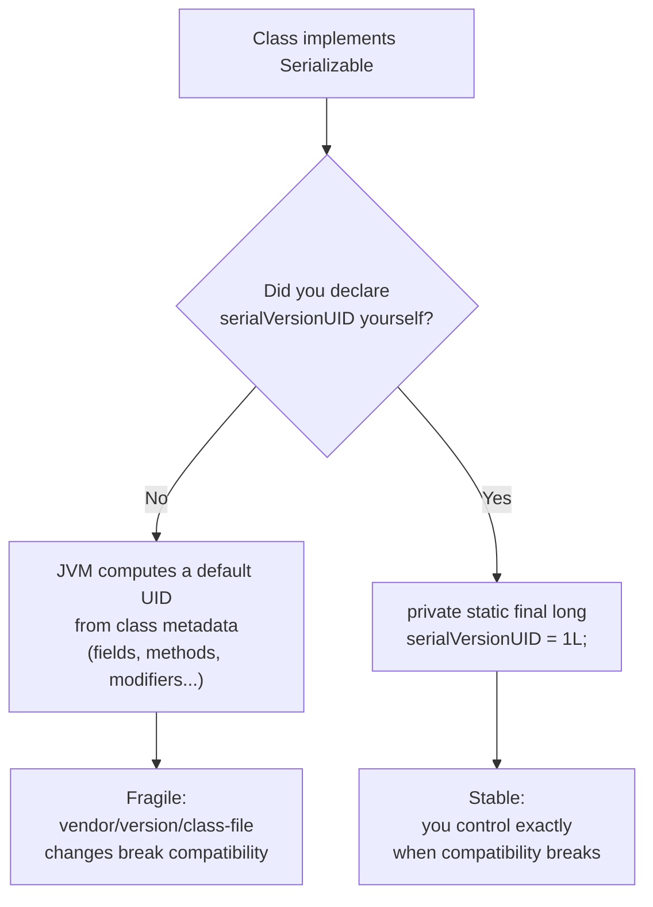
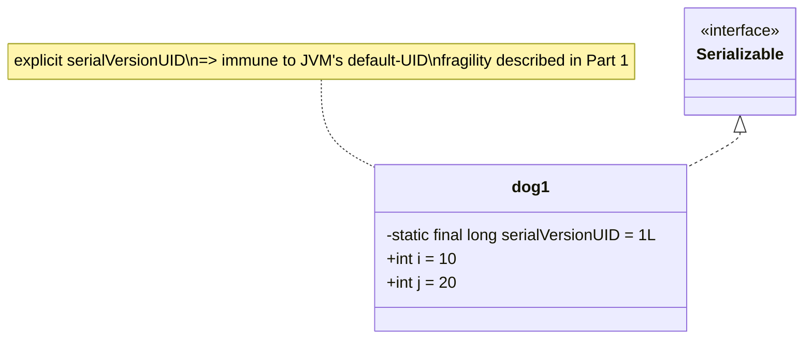
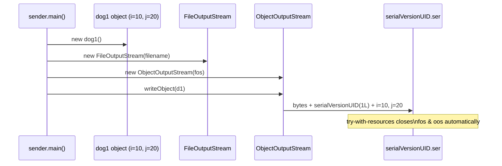
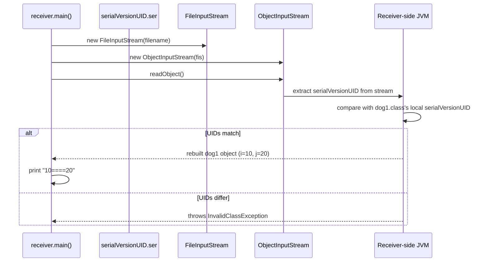
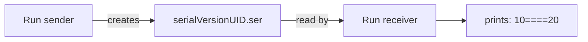

# `serialVersionUID` — Why It Exists and How It Protects Deserialization

<!-- TOC -->
- [`serialVersionUID` — Why It Exists and How It Protects Deserialization](#serialversionuid--why-it-exists-and-how-it-protects-deserialization)
    - [Part 1 — Concept (`serialUIDBasics.java`)](#part-1--concept-serialuidbasicsjava)
    - [Part 2 — `dog1.java`](#part-2--dog1java)
    - [Part 3 — `sender.java`](#part-3--senderjava)
    - [Part 4 — `receiver.java`](#part-4--receiverjava)
    - [Related Files](#related-files)
<!-- /TOC -->

| Part                                           | File                   | Scenario                                                     |
| ---------------------------------------------- | ---------------------- | ------------------------------------------------------------ |
| [Part 1](#part-1--concept-serialuidbasicsjava) | `serialUIDBasics.java` | Pure concept notes — no runnable code, just the theory       |
| [Part 2](#part-2--dog1java)                    | `dog1.java`            | The `Serializable` class with an explicit `serialVersionUID` |
| [Part 3](#part-3--senderjava)                  | `sender.java`          | Writes a `dog1` object to a `.ser` file                      |
| [Part 4](#part-4--receiverjava)                | `receiver.java`        | Reads the `.ser` file back into a `dog1` object              |

---

## Part 1 — Concept (`serialUIDBasics.java`)

**File:** [serialUIDBasics.java](../../../demo/src/main/java/com/advanced/serialization/serialVersionUID/serialUIDBasics.java)

This file contains only comments — it is the "theory page" for the demo. Read sequentially:

1. **Sender and receiver can be completely different.** Different person, different machine, different location — serialization only requires both sides to have the `.class` file for the type being sent. What actually travels over the wire/file is the **state** of the object, not the code.
2. **Every serialized object carries a unique identifier — the `serialVersionUID`.** At serialization time, the sender-side JVM computes/attaches this ID based on the `.class` file. At deserialization time, the receiver-side JVM compares the ID embedded in the incoming stream against the ID of the **locally available** `.class` file.
3. **If the two IDs don't match → `InvalidClassException` at runtime.** If they match, deserialization proceeds normally.
4. **Problems with relying on the JVM's auto-generated `serialVersionUID`:**
   - **Vendor/version/platform sensitivity** — the default ID is computed from class details (fields, methods, modifiers, interfaces, etc.) using an internal algorithm that can differ across JVM vendors/versions. Sender and receiver JVMs must match exactly, or deserialization can fail even when the class "looks" unchanged.
   - **Class-file version sensitivity** — any change to the `.class` file after the object was serialized (e.g. adding a field) changes the computed ID, so old serialized data can no longer be read.
   - **Performance cost** — computing the default ID uses a non-trivial algorithm (based on `SHA` digest of class metadata), which is extra work the JVM must do.
5. **The fix:** declare your own fixed `serialVersionUID` explicitly, instead of letting the JVM compute one:
   ```java
   private static final long serialVersionUID = 1L;
   ```
   This freezes compatibility to *whatever you decide*, independent of JVM vendor/version and (within reason) independent of minor class changes.

### 📄 Original notes (verbatim, from the source file)

```
In Serialization both sender and receiver need not be same person need not to use same machine
and need not be from the same location the persons may be different , the machines may be different
and locations may be different
In Serialization both sender and receiver should have .class file at the beginning only
just state of object is travelling from sender to receiver
At the time of serialization with every object sender side JVM will save a unique identifier
JVM is responsible to generate this unique identifier based on .class file.
At the time of deserialization receiver side JVM will compare unique identifier associated with the object with
local class unique identifier if both are matched then only deserialization will be performed otherwise we will
runtime exception saying InvalidClassException. this unique identifier is nothing but serialVersionUID.
==================
problems of depending on default serialVersionUID generated by JVM
1.Both sender and receiver should use same JVM with respect to vendor , version and platform otherwise receiver
  unable to deserialize because different serialVerrsionUID's
2.Both sender and receiver should use same .class file version after serialization if there is any change
  in .class file at receiver's side then receiver unable to deserialize
3.To generate SerialVersionUID internally JVM may use complex algorithm which may create performance problems.
4.We can solve above problems by configuring our own serialversionUID.
5.We can configure our own serialVersionUID as follows
   private static final long serialVersionUID = 1L;
```



---

## Part 2 — `dog1.java`

**File:** [dog1.java](../../../demo/src/main/java/com/advanced/serialization/serialVersionUID/dog1.java)

```java
public class dog1 implements Serializable {
    private static final long serialVersionUID = 1L;
    int i = 10;
    int j = 20;
}
```

`dog1` is deliberately simple — it exists only to be serialized/deserialized. Unlike the other demos in this package (`transientKeyword`, `serializationBasics`, etc.), it does **not** extend `serializeBase`; it just implements `Serializable` directly and pins its own `serialVersionUID`.



---

## Part 3 — `sender.java`

**File:** [sender.java](../../../demo/src/main/java/com/advanced/serialization/serialVersionUID/sender.java)

```java
public class sender extends serializeBase {
    public static void main(String[] args) {
        dog1 d1 = new dog1();
        String filename = sampleDataPath("serialization", "serialVersionUID.ser").toString();
        try (FileOutputStream fos = new FileOutputStream(filename);
             ObjectOutputStream oos = new ObjectOutputStream(fos)) {
            oos.writeObject(d1);
        } catch (Exception e) {
            e.printStackTrace();
        }
    }
}
```

`sender` extends `serializeBase` purely to reuse its inherited `sampleDataPath(...)` helper (which resolves a path under `demo/sample-data/...`) — it writes the object manually with its own `ObjectOutputStream`, rather than calling `serializeBase.serialize()`.



---

## Part 4 — `receiver.java`

**File:** [receiver.java](../../../demo/src/main/java/com/advanced/serialization/serialVersionUID/receiver.java)

```java
public class receiver extends serializeBase {
    public static void main(String[] args) {
        String filename = sampleDataPath("serialization", "serialVersionUID.ser").toString();
        try (FileInputStream fis = new FileInputStream(filename);
             ObjectInputStream ois = new ObjectInputStream(fis)) {
            dog1 d2 = (dog1) ois.readObject();
            System.out.println(d2.i + "====" + d2.j);
        } catch (Exception e) {
            e.printStackTrace();
        }
    }
}
```



### 📄 Original trailing note (verbatim, from the source file)

```
In the above program after serialization if we perform any change to the .class file at receiver's side
We won't get any problem at the time of deserialization because the serialVersionUID ensures compatibility.
In this case sender and receiver not required to maintain same JVM versions
NOTE: some IDE's prompt programmer to explicitly to enter/declare serialVersionUID in the class.
some IDE's may generate serialVersionUID automatically
```

This is the payoff of Part 1's fix: because `dog1` pins `serialVersionUID = 1L` explicitly, minor changes to `dog1.class` after the file was serialized won't break deserialization, and sender/receiver JVM versions don't need to match.

### ⚠️ Run order matters
`receiver` reads a file that only `sender` creates. Running `receiver` first throws `FileNotFoundException` (the `.ser` file doesn't exist yet), **not** an `InvalidClassException` — that one only happens once a file *does* exist but its embedded `serialVersionUID` no longer matches `dog1.class`.



### ✅ Verified Output
```
10====20
```
(`d2.i` = `10`, `d2.j` = `20` — both fields round-trip unchanged because `serialVersionUID` matches between write and read.)

## 🔗 Related Files
- [serializationBasics.md](./serializationBasics.md) — the shared `serializeBase` parent class and its reflection-based field classifier (not used directly here, but `sampleDataPath()` comes from it).
- [transientKeyword.md](./transientKeyword.md) — another `serializeBase` subclass, contrasting field-level serialization control with this file's class-level version control.
