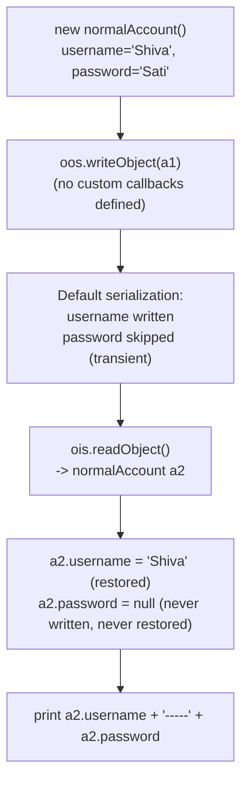

# Customized Serialization: Complete Flow

<!-- TOC -->
- [Customized Serialization: Complete Flow](#customized-serialization-complete-flow)
  - [Source and Output Locations](#source-and-output-locations)
  - [Classes Used](#classes-used)
  - [Why Customized Serialization Is Needed](#why-customized-serialization-is-needed)
  - [Complete Execution Flow](#complete-execution-flow)
  - [Serialization Phase](#serialization-phase)
  - [What `defaultWriteObject()` Does](#what-defaultwriteobject-does)
  - [Important Note About `encryptPwd()`](#important-note-about-encryptpwd)
  - [Deserialization Phase](#deserialization-phase)
  - [What `defaultReadObject()` Does](#what-defaultreadobject-does)
  - [Why the Write and Read Order Must Match](#why-the-write-and-read-order-must-match)
  - [Expected Output](#expected-output)
  - [Exception Handling](#exception-handling)
  - [Final Summary](#final-summary)
  - [Part 2 — normalSer.java: the baseline without customization](#part-2--normalserjava-the-baseline-without-customization)
<!-- /TOC -->

This guide explains the customized serialization example and maps it to the Java source file.

| Part                                                                | File                 | Scenario                                                                      |
| ------------------------------------------------------------------- | -------------------- | ----------------------------------------------------------------------------- |
| [Part 1](#source-and-output-locations)                              | `customizedSer.java` | `writeObject()`/`readObject()` callbacks encode a transient password manually |
| [Part 2](#part-2--normalserjava-the-baseline-without-customization) | `normalSer.java`     | Default serialization only — shows the data loss customization fixes          |

## Source and Output Locations

Java source file:

```text
demo/src/main/java/com/advanced/serialization/customizedSerialization/customizedSer.java
```

Serialized output file created by the current program:

```text
demo/sample-data/serialization/custom,ser
```

The comma in `custom,ser` is part of the current filename. The extension is only a naming convention; `.ser` or `.dat` would also work.

## Classes Used

```text
customizedSer
      |
      +-- account
            |
            +-- username = "Rama"
            +-- password = "Sita"       transient
```

The `account` class extends `serializeBase`, so it inherits the common serialization helper methods. It also implements customized serialization callbacks named `writeObject()` and `readObject()`.

## Why Customized Serialization Is Needed

Normally, Java's default serialization writes non-transient fields and skips transient fields.

```java
String username = "Rama";       // Written normally
transient String password = "Sita"; // Skipped normally
```

The password is marked `transient` so its plain value is not written automatically. The custom callback writes a transformed representation instead.

## Complete Execution Flow

```text
main()
  |
  v
Create account a1
  |
  v
Open custom,ser for writing
  |
  v
writeObject(a1) is called by the JVM
  |
  +--> defaultWriteObject()
  |       |
  |       +--> username is written
  |       +--> password is skipped because it is transient
  |
  +--> encryptPwd(password)
  |       |
  |       +--> "Sita" becomes Base64 text "U2l0YQ=="
  |
  +--> os.writeObject(encryptedText)
          |
          +--> transformed password is written manually
  |
  v
Close output streams
  |
  v
Open custom,ser for reading
  |
  v
readObject() is called by the JVM
  |
  +--> defaultReadObject()
  |       |
  |       +--> username is restored as "Rama"
  |       +--> password remains null because it was transient
  |
  +--> is.readObject()
  |       |
  |       +--> read "U2l0YQ=="
  |
  +--> decryptPwd(encryptedpwd)
          |
          +--> "U2l0YQ==" becomes "Sita"
  |
  v
password is assigned the restored value
  |
  v
Print: Rama===Sita
```

## Serialization Phase

The main method creates the object:

```java
account a1 = new account();
```

Then it opens the output streams and writes the object:

```java
try (FileOutputStream fos = new FileOutputStream(filename);
     ObjectOutputStream oos = new ObjectOutputStream(fos)) {
    oos.writeObject(a1);
}
```

When `oos.writeObject(a1)` runs, Java automatically looks for this private callback inside `account`:

```java
private void writeObject(ObjectOutputStream os)
```

The callback is not called directly by `main()`. Java's serialization mechanism calls it automatically.

## What `defaultWriteObject()` Does

```java
os.defaultWriteObject();
```

This asks Java to perform its normal serialization behavior for the current object:

- `username` is written because it is a normal field.
- `password` is skipped because it is `transient`.

After that, the program handles the password manually:

```java
String encryptedText = encryptPwd(password);
os.writeObject(encryptedText);
```

The transformed password must be explicitly written because `password` itself was excluded by `transient`.

## Important Note About `encryptPwd()`

In the current `serializeBase` implementation, `encryptPwd()` uses Base64 encoding:

```java
Base64.getEncoder().encodeToString(password.getBytes())
```

Base64 is not encryption. It is an encoding technique that can be decoded by anyone.

```text
Original text:  Sita
Encoded text:  U2l0YQ==
Decoded text:  Sita
```

This example is useful for learning customized serialization and callback methods, but real password protection should use a proper password-hashing or encryption design.

## Deserialization Phase

The program opens the serialized file for reading:

```java
try (FileInputStream fos = new FileInputStream(filename);
     ObjectInputStream ois = new ObjectInputStream(fos)) {
    account a2 = (account) ois.readObject();
}
```

When `ois.readObject()` runs, Java automatically calls:

```java
private void readObject(ObjectInputStream is)
```

The callback performs the reverse custom process.

## What `defaultReadObject()` Does

```java
is.defaultReadObject();
```

This restores the fields that were written by `defaultWriteObject()`:

```text
username -> "Rama"
password -> not restored because it was transient
```

Then the manually written transformed password is read:

```java
String encryptedpwd = (String) is.readObject();
```

Finally, the value is decoded and assigned:

```java
password = decryptPwd(encryptedpwd);
```

## Why the Write and Read Order Must Match

The custom stream contains data in this order:

```text
defaultWriteObject() data
transformed password
```

The read callback must consume data in the same order:

```text
defaultReadObject() data
transformed password
```

If `is.readObject()` is called before `defaultReadObject()`, or if the extra password value is not written, the stream becomes unbalanced and deserialization can fail.

## Expected Output

```text
Encoded: U2l0YQ==
Encrypted (Base64): U2l0YQ==
Decoded: Sita
Rama===Sita
```

The final line proves that:

- `username` was restored by default serialization.
- `password` was restored manually by the custom callback.
- The transient field was not written automatically.

## Exception Handling

The current callbacks catch exceptions and print a short message:

```java
catch (Exception e) {
    System.out.println("Unable to serialize : " + e.getMessage());
}
```

The main method also catches exceptions around file creation, stream handling, and object reading. These problems can include:

- `IOException` when a file cannot be opened or read.
- `ClassNotFoundException` when the serialized class cannot be found during reading.
- `NotSerializableException` when a required object is not serializable.
- `IllegalArgumentException` or decoding errors if transformed data is invalid.

## Final Summary

```text
Default serialization:
username is written
password is skipped because it is transient

Customized serialization:
username is written by defaultWriteObject()
password is converted and written manually

Customized deserialization:
username is restored by defaultReadObject()
converted password is read, decoded, and assigned manually

programmer cant calls private directly from outside of the class 
but JVM can call private methods directly from outside of the class
```

The central lesson is:

> `writeObject()` and `readObject()` are private callback methods that allow a class to add its own behavior around Java's default serialization process.

---

## Part 2 — normalSer.java: the baseline without customization

**File:** [normalSer.java](../../../demo/src/main/java/com/advanced/serialization/customizedSerialization/normalSer.java)

### 📌 Concept

> This is the "before" picture: `normalAccount` has the exact same shape as `account` (a normal `username` field and a `transient password` field) but defines **no** `writeObject()`/`readObject()` callbacks. Default serialization silently drops the transient field — there is no way to recover it after deserialization.



### ✅ Verified Output
```
Shiva-----null
```

### Part 1 vs. Part 2 — the direct comparison

|                                         | `normalSer.java` (Part 2) | `customizedSer.java` (Part 1)     |
| --------------------------------------- | ------------------------- | --------------------------------- |
| `writeObject()`/`readObject()` defined? | ❌ No                      | ✅ Yes                             |
| Transient `password` after deserialize  | `null` (lost)             | Restored via manual encode/decode |
| Output                                  | `Shiva-----null`          | `Rama===Sita`                     |

This pair proves the exact problem statement in `normalSer.java`'s own comment: *"During default serialization there may be a chance of loss of information because of transient keyword."* `customizedSer.java` is the fix.
