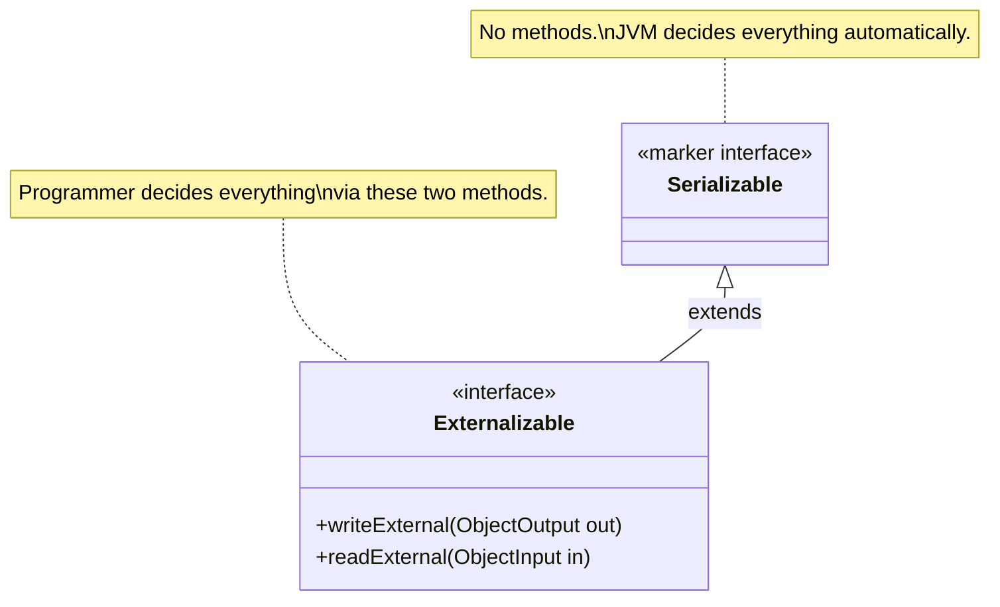
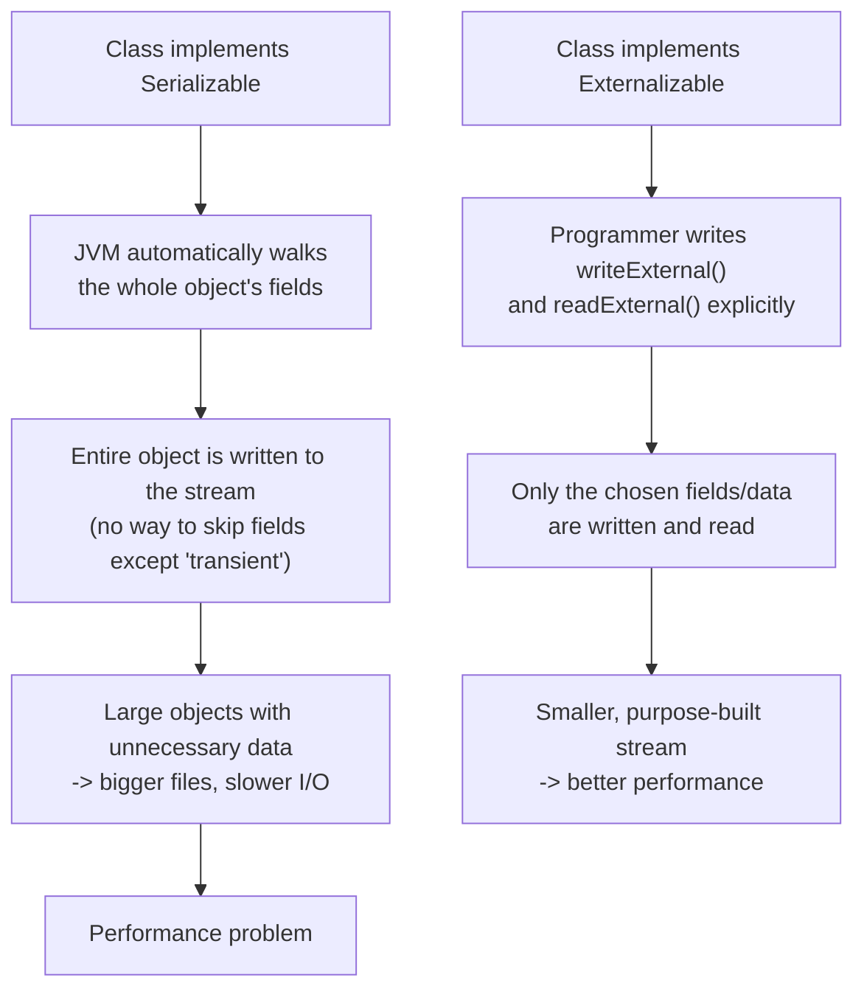
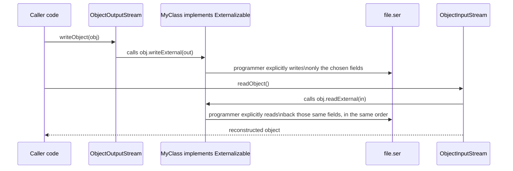
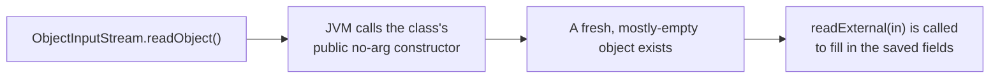
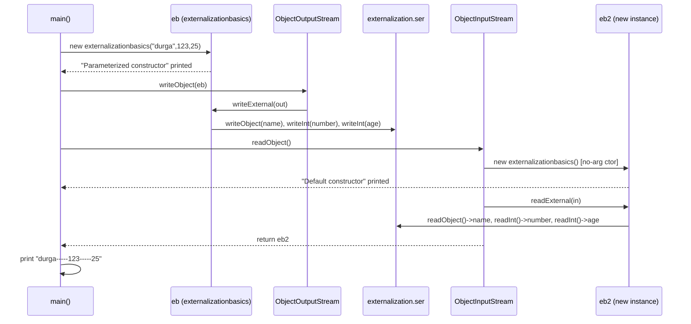
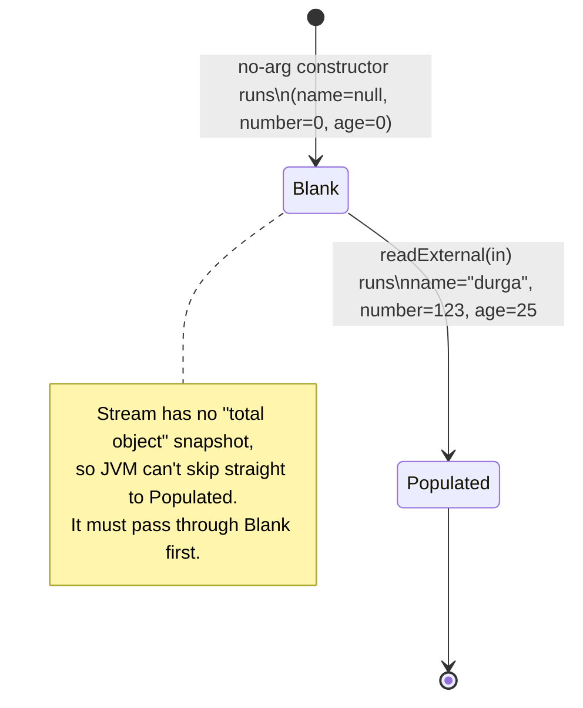
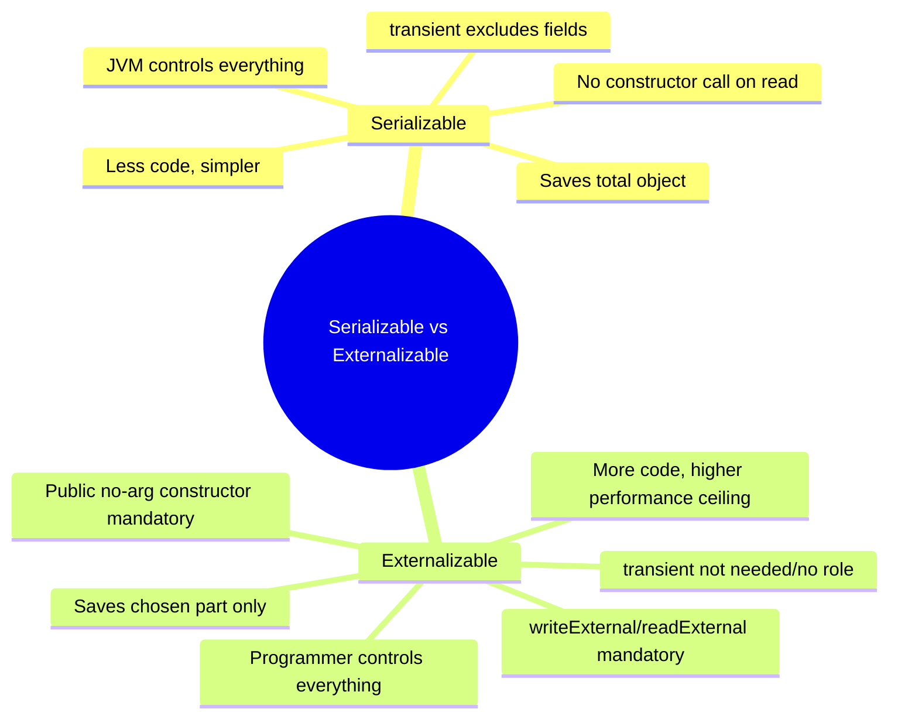

# Externalization Basics

<!-- TOC -->
- [Externalization Basics](#externalization-basics)
    - [Concept](#concept)
    - [Why Externalization Exists — The Problem It Solves](#why-externalization-exists--the-problem-it-solves)
    - [How It Works — The Two Callback Methods](#how-it-works--the-two-callback-methods)
    - [Important Rule: Public No-Arg Constructor Required](#important-rule-public-no-arg-constructor-required)
    - [Summary](#summary)
    - [Worked Example — Complete Execution Summary](#worked-example--complete-execution-summary)
    - [Serializable vs. Externalizable — Final Comparison](#serializable-vs-externalizable--final-comparison)
<!-- /TOC -->

**File:** [externalizationbasics.java](../../../demo/src/main/java/com/advanced/serialization/externalization/externalizationbasics.java)

## 📌 Concept

> **Serialization gives the JVM full control over what gets saved — always the whole object. Externalization gives the programmer full control instead, so only the required part of the object needs to be saved, which can improve performance.**

|                                       | `Serializable`                     | `Externalizable`                                    |
| ------------------------------------- | ---------------------------------- | --------------------------------------------------- |
| Who controls what gets saved?         | JVM (automatic, default mechanism) | Programmer (manual, explicit code)                  |
| Can you save only part of an object?  | ❌ No — always the total object     | ✅ Yes — save only what you choose                   |
| Performance for large/partial objects | Can be worse (saves everything)    | Can be better (saves only what's needed)            |
| Methods to implement                  | None required (marker interface)   | `writeExternal()` and `readExternal()` (compulsory) |
| Introduced in                         | Java 1.1                           | Java 1.1                                            |
| Interface type                        | Marker interface (no methods)      | Regular interface (2 methods to override)           |



> `Externalizable` actually **extends** `Serializable` — every `Externalizable` object is still a `Serializable` object, but it overrides the JVM's automatic behavior with its own explicit read/write logic.

---

## 🧭 Why Externalization Exists — The Problem It Solves



---

## 🔍 How It Works — The Two Callback Methods



- `writeExternal(ObjectOutput out)` — called automatically by the stream during serialization. Whatever the programmer does **not** explicitly write here is simply **not saved** — there's no "default" fallback like `defaultWriteObject()` provides for normal serialization.
- `readExternal(ObjectInput in)` — called automatically during deserialization. It must read fields back in **exactly the same order** they were written, or the data will be misread.
- Because the programmer owns both methods completely, saving "part of the object" (e.g. skipping large caches, computed values, or sensitive fields) is trivial — just don't write them.

---

## ⚠️ Important Rule: Public No-Arg Constructor Required

Unlike normal serialization (which can rebuild an object without ever calling its constructor), **`Externalizable` classes are re-constructed using the public no-arg constructor first**, and only then does `readExternal()` populate the fields.



- If the class has no accessible public no-arg constructor, deserialization fails with `InvalidClassException`.
- This is a stricter requirement than plain `Serializable`, which doesn't invoke any constructor of the serializable class itself.

---

---

## ✅ Summary

- Both interfaces exist since Java 1.1.
- `Serializable` = automatic, all-or-nothing, JVM-controlled.
- `Externalizable` = manual, selective, programmer-controlled — implement `writeExternal()`/`readExternal()` and provide a public no-arg constructor.
- Choose `Externalizable` when an object is large, only part of its state needs persisting, or serialization performance matters.

---

## 🧪 Worked Example — Complete Execution Summary

The class fields are `String name`, `int number`, `int age`, and the demo runs:

```java
externalizationbasics eb = new externalizationbasics("durga", 123, 25);
oos.writeObject(eb);
...
externalizationbasics eb2 = (externalizationbasics) ois.readObject();
```

```mermaid
flowchart TD
    A["new externalizationbasics(\"durga\", 123, 25)"] --> B["Parameterized constructor runs\nname=durga, number=123, age=25"]
    B --> C["oos.writeObject(eb)"]
    C --> D["JVM calls eb.writeExternal(out)\n-> out.writeObject(name)\n-> out.writeInt(number)\n-> out.writeInt(age)"]
    D --> E["externalization.ser now holds ONLY\nwhat writeExternal() chose to write\n(NOT a full snapshot of the object)"]
    E --> F["ois.readObject()"]
    F --> G["Stream does not contain a total object,\nso the JVM cannot just 'rebuild' one from bytes"]
    G --> H["JVM executes the PUBLIC NO-ARG constructor\n-> 'Default constructor' prints\n-> a fresh eb2 exists (name=null, number=0, age=0)"]
    H --> I["JVM then calls eb2.readExternal(in)\n-> name = in.readObject()\n-> number = in.readInt()\n-> age = in.readInt()"]
    I --> J["eb2 now holds the restored values\nin the SAME order they were written"]
    J --> K["print eb2.name + '-----' + eb2.number + '-----' + eb2.age"]
```





### 🔑 The key deserialization rule (why the no-arg constructor runs)

> Because `writeExternal()` writes only whatever the programmer chose — never an automatic full snapshot of the object — the serialized file does **not** contain "the total object". So, unlike default serialization, the JVM has no byte-for-byte blueprint it can just materialize directly into a new instance. Instead, it first **executes the class's no-arg constructor to create a blank object**, and only then invokes `readExternal()` on that object to populate it field-by-field from the stream.

This is exactly why the console shows:
```
Parameterized constructor
Default constructor
durga-----123-----25
```
- `"Parameterized constructor"` → printed once, when `eb` is first created with `new externalizationbasics("durga", 123, 25)`.
- `"Default constructor"` → printed a second time, purely because `ObjectInputStream.readObject()` had to invoke the **no-arg constructor** to build `eb2` before `readExternal()` could fill it in.
- `durga-----123-----25` → proves `readExternal()` correctly restored all three fields, in the same order `writeExternal()` wrote them.

### ⚠️ What would break this
| Change                                                                     | Effect                                                                                                                                                                                                   |
| -------------------------------------------------------------------------- | -------------------------------------------------------------------------------------------------------------------------------------------------------------------------------------------------------- |
| Remove the public no-arg constructor                                       | `readObject()` throws `InvalidClassException` — the JVM has no way to create the blank object before calling `readExternal()`.                                                                           |
| Swap the read order in `readExternal()` (e.g. read `number` before `name`) | Stream corruption / wrong values or `StreamCorruptedException`, since `writeExternal()` wrote `name` first.                                                                                              |
| Forget to write a field in `writeExternal()`                               | That field is never restored — `readExternal()` would have nothing to read for it, so it stays at its constructor-assigned value (here, the no-arg constructor leaves it at Java's default: `null`/`0`). |

> 📎 This confirms empirically: **Externalizable deserialization = (1) call the no-arg constructor to get a blank object, then (2) call `readExternal()` to populate exactly what `writeExternal()` chose to save.** Contrast this with plain `Serializable`, which never calls the class's own constructor at all — it reconstructs the object directly from the stream's full field snapshot.

---

## 📊 Serializable vs. Externalizable — Final Comparison

| Serializable                                                                                                                            | Externalizable                                                                                                          |
| --------------------------------------------------------------------------------------------------------------------------------------- | ----------------------------------------------------------------------------------------------------------------------- |
| Used to implement default serialization.                                                                                                | Used to implement externalization.                                                                                      |
| A marker interface — it does not declare any method.                                                                                    | Not a marker interface — it declares two methods, `writeExternal()` and `readExternal()`.                               |
| Hands the responsibility of saving the object to the JVM; the programmer has no control, and the JVM follows its own default algorithm. | Hands the entire responsibility of saving the object to the programmer; the JVM has no control over the process.        |
| Generally has weaker performance, since the JVM always processes every non-`transient` field.                                           | Generally has better performance, since only the fields the programmer chooses are written.                             |
| Does not require any no-arg constructor.                                                                                                | Requires a public no-arg constructor — the JVM calls it before `readExternal()` runs.                                   |
| Harder to safely change the class structure later, since altering fields can silently break existing serialized data.                   | Easier to safely change the class structure later, since the programmer has complete control over the read/write logic. |
| Always saves the total object — saving only part of it is not possible.                                                                 | Can save either the total object or only part of it, based on what the programmer writes.                               |
| The `transient` keyword plays an important role, since it is the only way to exclude a field.                                           | The `transient` keyword plays no role at all, since the programmer already decides exactly what gets written.           |



