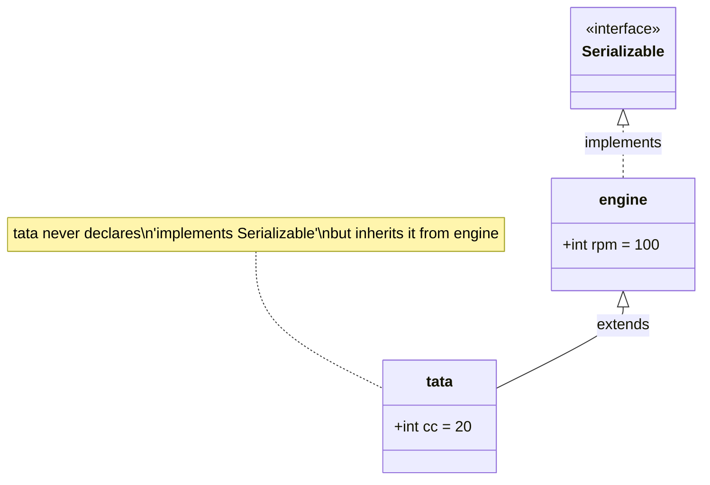
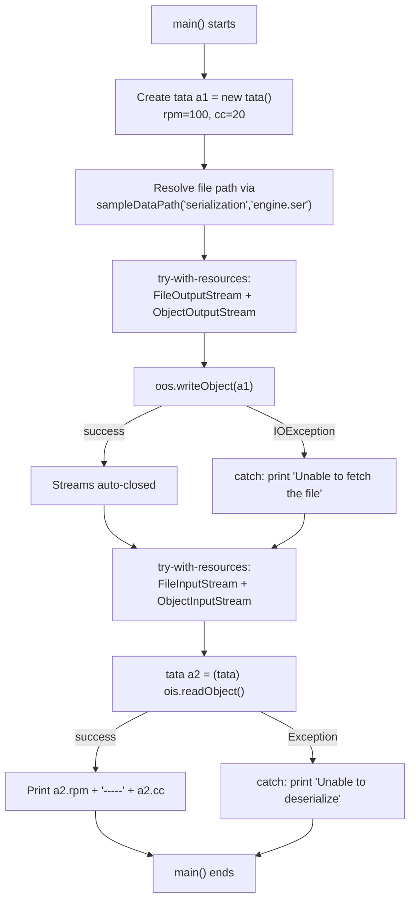
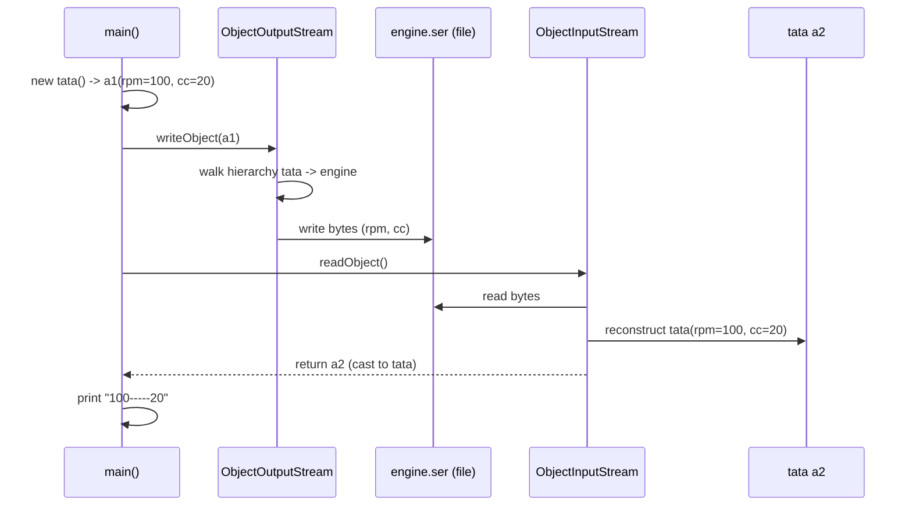
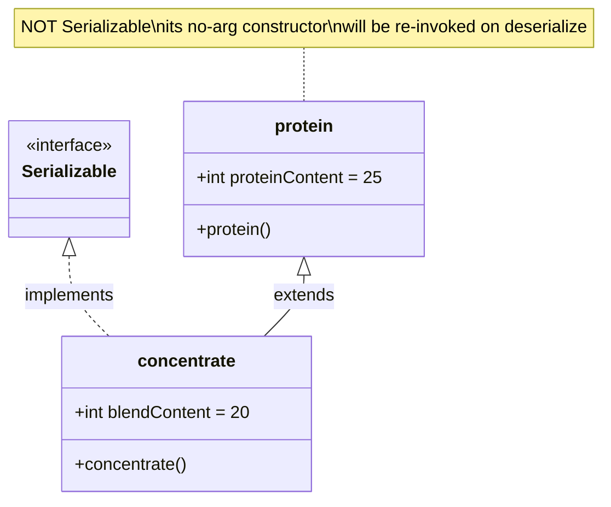
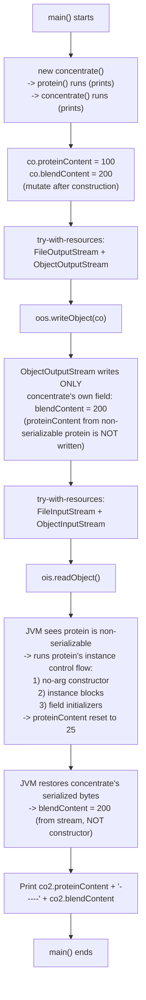
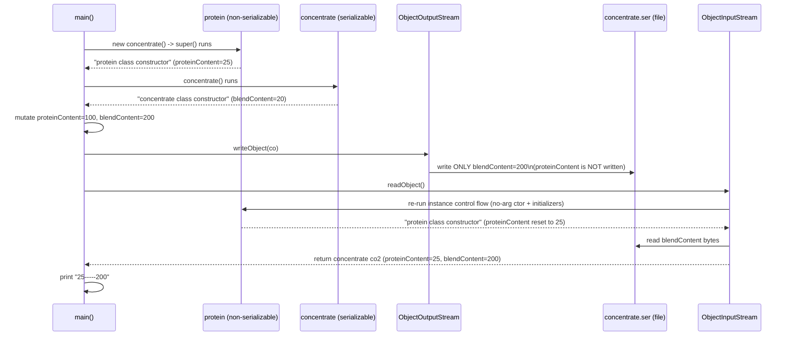

# Inheritance Serialization Basics

This doc covers **two complementary scenarios** of inheritance + serialization, both living in
`demo/src/main/java/com/advanced/serialization/inheritanceSerialization/`:

| Part | File | Scenario |
|---|---|---|
| [Part 1](#part-1--parent-is-serializable) | `inheritanceSerOne.java` | Parent **implements** `Serializable` → child inherits it for free |
| [Part 2](#part-2--parent-is-not-serializable) | `inheritanceSerTwo.java` | Parent **does not** implement `Serializable`, only the child does |

---

## Part 1 — Parent IS Serializable

**File:** [inheritanceSerOne.java](../../../demo/src/main/java/com/advanced/serialization/inheritanceSerialization/inheritanceSerOne.java)

### 📌 Concept

> **If a parent class implements `Serializable`, every child class is serializable automatically — even if the child class does not implement `Serializable` itself.**

Serializability is an *inherited* trait in Java. It flows from parent to child, not the other way around.

This file proves that rule using two tiny classes:

| Class | Declaration | Implements `Serializable`? | Fields |
|---|---|---|---|
| `engine` | `class engine implements Serializable` | ✅ Yes (explicitly) | `int rpm = 100` |
| `tata` | `class tata extends engine` | ✅ Yes (inherited from `engine`) | `int cc = 20` |



---

## 🧭 End-to-End Flow



---

## 🔍 Step-by-Step Breakdown

### 1. Object creation
```java
tata a1 = new tata();
```
- `a1` is a `tata` object containing **both** `rpm` (inherited from `engine`) and `cc` (declared in `tata`).

### 2. Resolve the target file
```java
String filename = sampleDataPath("serialization","engine.ser").toString();
```
- `sampleDataPath(...)` (inherited from `fileBasicMethods` via `serializeBase`) resolves to:
  `demo/sample-data/serialization/engine.ser` (or `sample-data/serialization/engine.ser` if run from repo root).

### 3. Serialize (write object → bytes → file)
```java
try (FileOutputStream fos = new FileOutputStream(filename);
     ObjectOutputStream oos = new ObjectOutputStream(fos)) {
    oos.writeObject(a1);
}
```
- `ObjectOutputStream.writeObject()` walks the object's **entire class hierarchy** (`tata` → `engine`), serializing every non-`transient`, non-`static` field it finds at each level.
- Both `cc` (from `tata`) and `rpm` (from `engine`) get written, because `engine implements Serializable` makes the whole chain serializable.
- try-with-resources guarantees `fos`/`oos` are closed automatically, even on error.

### 4. Deserialize (file → bytes → object)
```java
try (FileInputStream fis = new FileInputStream(filename);
     ObjectInputStream ois = new ObjectInputStream(fis)) {
    tata a2 = (tata) ois.readObject();
    System.out.println(a2.rpm + "-----" + a2.cc);
}
```
- `readObject()` rebuilds a brand-new `tata` instance from the bytes, restoring both `rpm` and `cc`.
- Cast back to `tata` since `readObject()` returns `Object`.

### 5. Error handling
- Two independent `try/catch` blocks — a failure while writing does **not** prevent the read attempt from being tried (though it would then fail too, since the file wouldn't exist/would be incomplete).
- `catch(Exception e)` on the read side also covers `ClassNotFoundException`, which `readObject()` can throw.

---

## 🗂️ Sequence Diagram (runtime interaction)



---

## ✅ Expected Output

```
100-----20
```

## ⚠️ Things That Would Break This

| Change | Effect |
|---|---|
| `engine` does **not** implement `Serializable` | `NotSerializableException` on `writeObject(a1)` |
| `rpm` marked `transient` in `engine` | Output becomes `0-----20` (rpm not restored) |
| `tata` field `cc` renamed/removed between serialize & deserialize | `readObject()` still works, but `cc` may take its default value or throw depending on `serialVersionUID` mismatch |
| No explicit `serialVersionUID` on `engine`/`tata` | JVM auto-generates one from class shape; any structural change to either class after serializing risks `InvalidClassException` on deserialize |

---

## 🔗 Related Files

- [serializeBase.java](../../../demo/src/main/java/com/advanced/serialization/serializeBase.java) — parent class providing `sampleDataPath()`, `serialize()`, and reflection-based helpers.
- [fileBasicMethods.java](../../../demo/src/main/java/com/javaIOPackage/baseMethodsInFileOperations/fileBasicMethods.java) — defines `sampleDataPath(String...)`.

---
---

## Part 2 — Parent is NOT Serializable

**File:** [inheritanceSerTwo.java](../../../demo/src/main/java/com/advanced/serialization/inheritanceSerialization/inheritanceSerTwo.java)

### 📌 Concept

> **A child class can be serialized even if its parent does NOT implement `Serializable` — but only the child's own state survives the round-trip. The parent's state is always rebuilt from scratch by re-running the parent's no-arg constructor (and its field initializers / instance blocks) during deserialization.**

This is the mirror image of Part 1. Here, only the child opts into `Serializable`; the parent stays a plain class.

| Class | Declaration | Implements `Serializable`? | Fields |
|---|---|---|---|
| `protein` | `class protein` | ❌ No | `int proteinContent = 25` (+ a no-arg constructor that prints a message) |
| `concentrate` | `class concentrate extends protein implements Serializable` | ✅ Yes (explicitly) | `int blendContent = 20` (+ a no-arg constructor that prints a message) |



---

### 🧭 End-to-End Flow



---

### 🔍 Step-by-Step Breakdown (point by point)

#### 1. Parent does NOT need to be `Serializable` for the child to be serializable
```java
class protein { ... }                                   // no "implements Serializable"
class concentrate extends protein implements Serializable { ... }
```
- Only `concentrate` needs to implement `Serializable`. Serializability does **not** need to flow from parent → child here; the child declares it itself.

#### 2. What happens at SERIALIZATION time
```java
concentrate co = new concentrate();
co.proteinContent = 100;   // inherited field, belongs to non-serializable protein
co.blendContent  = 200;    // own field, belongs to serializable concentrate
oos.writeObject(co);
```
- `ObjectOutputStream` only writes fields declared in `concentrate` (the serializable part of the hierarchy).
- `proteinContent` (declared in the **non-serializable** `protein`) is **skipped entirely** — its current value of `100` is never written to `concentrate.ser`. Only `blendContent = 200` goes into the stream.

#### 3. What happens at DESERIALIZATION time — the instance control flow
```java
concentrate co2 = (concentrate) ois.readObject();
```
Because `protein` is non-serializable, the JVM cannot rebuild `proteinContent` from stream bytes (there are none). Instead, for **every non-serializable class in the hierarchy**, it runs that class's normal object-initialization sequence — the *instance control flow* — and shares the resulting field values with the new object:

1. **No-arg constructor** of `protein` (compiler-supplied or programmer-written) — the JVM *always* invokes this specifically; a parameterized-only constructor would make deserialization fail with `InvalidClassException`.
2. **Instance initializer block(s)** of `protein`, if any (`{ ... }` blocks outside methods) — executed in source order.
3. **Instance field initializers** of `protein` (e.g. `int proteinContent = 25;`) — executed alongside the instance blocks, in source order.

This is exactly why the console prints `"protein class constructor"` **twice**: once for the original `new concentrate()`, and once more purely for deserialization — but `"concentrate class constructor"` prints only **once** (concentrate's state comes from the stream, not from re-running its constructor).

- ✅ `concentrate.blendContent` → restored from the stream → stays **200**.
- ✅ `protein.proteinContent` → rebuilt by re-running `protein`'s constructor/initializers → resets to its initializer value **25** (the `100` mutation is lost — it was never in the stream to begin with).

> ⚠️ **Important nuance:** this is *not* a JVM "reset field to `0`/`null`" rule. It is "re-run the non-serializable parent's construction logic and take whatever value falls out of it." Here that happens to be the initializer's `25`. If `protein` had no field initializer at all, *then* the field would come out as the true default (`0`), but that's a side effect of the constructor doing nothing to it — not a special serialization rule.

#### 4. Why the constructor is mandatory
- `protein()` (no-arg) is required. If `protein` only had a parameterized constructor, deserialization of any subclass would throw `InvalidClassException: <ClassName>; no valid constructor` — because the JVM has no way to invoke a no-arg super-construction chain.

#### 5. Error handling
- Same pattern as Part 1: independent `try/catch` around serialize and deserialize, each printing a distinct failure message.

---

### 🗂️ Sequence Diagram (runtime interaction)



---

### ✅ Expected Output (verified by running the program)

```
protein class constructor
concentrate class constructor
protein class constructor
25-----200
```

### 📊 Serialized vs. Reconstructed — at a glance

| Field | Declared in | Serializable class? | Value before serialize | Written to stream? | Value after deserialize | How it was restored |
|---|---|---|---|---|---|---|
| `proteinContent` | `protein` | ❌ No | `100` | ❌ No | `25` | `protein`'s no-arg constructor + field initializer re-run |
| `blendContent` | `concentrate` | ✅ Yes | `200` | ✅ Yes | `200` | Read directly from the serialized bytes |

### ⚠️ Things That Would Break This

| Change | Effect |
|---|---|
| `protein` only has a parameterized constructor (no no-arg constructor) | `InvalidClassException: concentrate; no valid constructor` at deserialization |
| `protein` also implements `Serializable` | `proteinContent` would now be written/restored from the stream too → output becomes `100-----200` (Part 1 behavior) |
| `blendContent` marked `transient` in `concentrate` | Output becomes `25-----0` (blendContent not restored from stream) |
| `protein`'s no-arg constructor sets `proteinContent = 999` instead of using a field initializer | Deserialized value would be `999`, not `25` — proving it's "re-run constructor logic," not "reset to default" |
