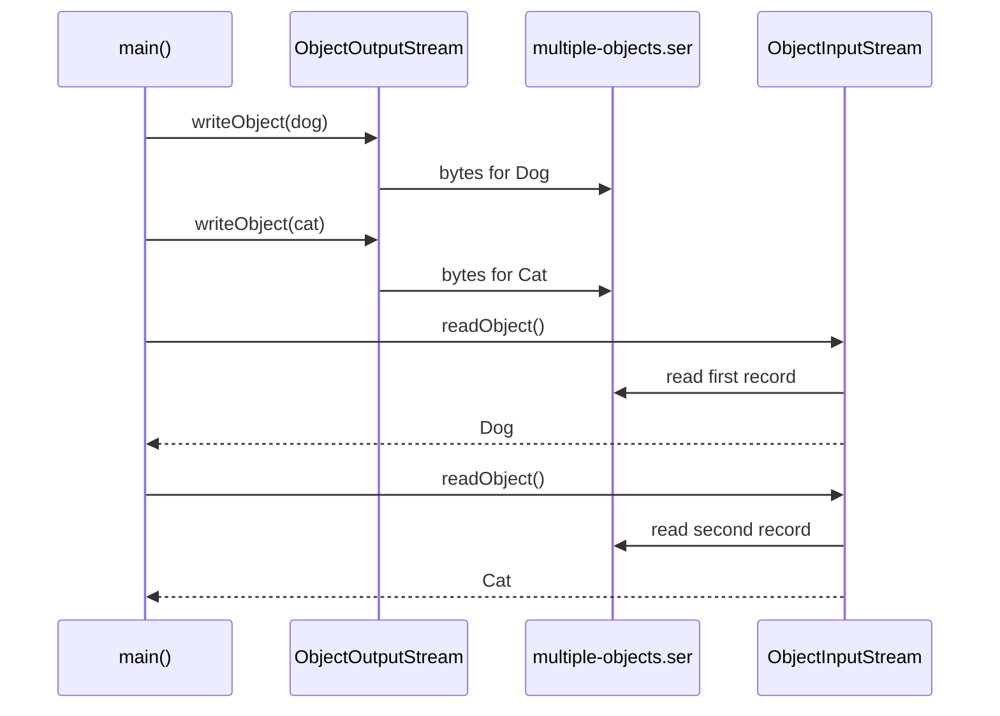
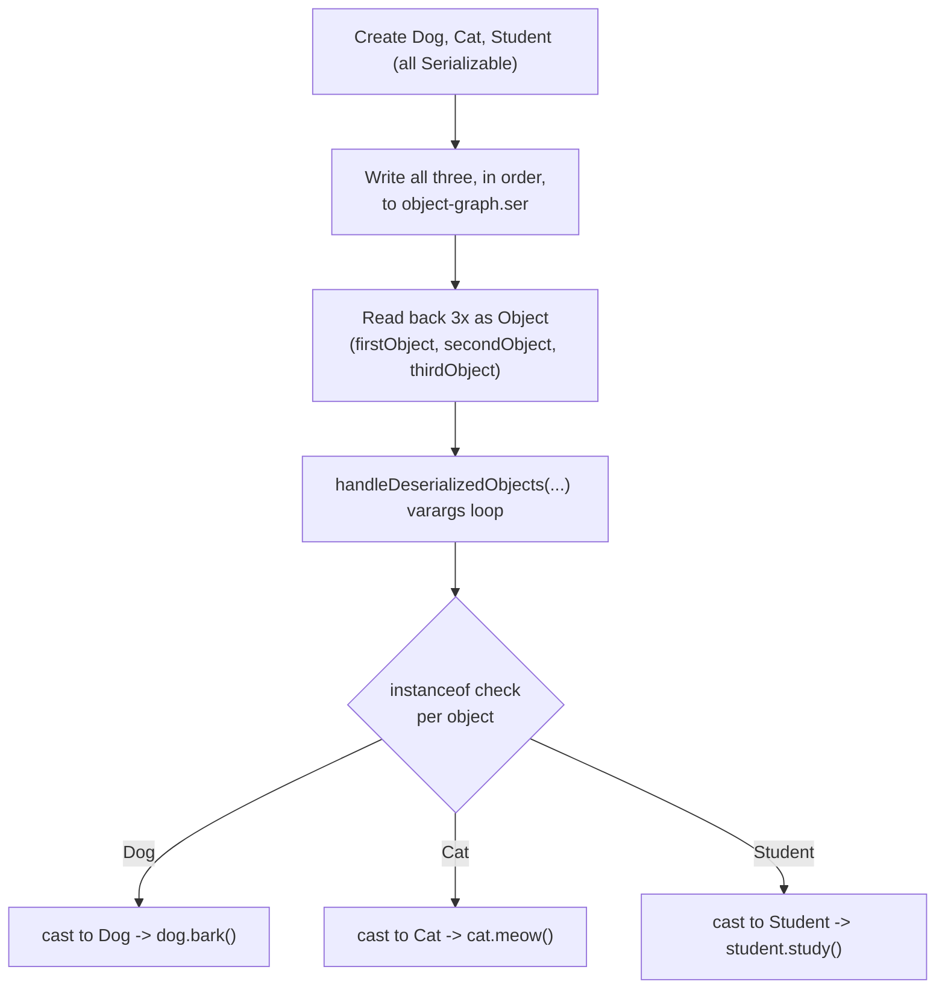

# Serializing Multiple Objects to One File

<!-- TOC -->
- [Serializing Multiple Objects to One File](#serializing-multiple-objects-to-one-file)
    - [Part 1 — sequenceOfMultpleObjects.java](#part-1--sequenceofmultpleobjectsjava)
    - [Part 2 — instanceOfMultipleObjects.java](#part-2--instanceofmultipleobjectsjava)
    - [Related Files](#related-files)
<!-- /TOC -->

| Part                                             | File                             | Scenario                                                                    |
| ------------------------------------------------ | -------------------------------- | --------------------------------------------------------------------------- |
| [Part 1](#part-1--sequenceofmultpleobjectsjava)  | `sequenceOfMultpleObjects.java`  | Two known, fixed types (`Dog`, `Cat`) written and read back in strict order |
| [Part 2](#part-2--instanceofmultipleobjectsjava) | `instanceOfMultipleObjects.java` | An unknown mix of types, safely identified with `instanceof` after reading  |

---

## Part 1 — sequenceOfMultpleObjects.java

**File:** [sequenceOfMultpleObjects.java](../../../demo/src/main/java/com/advanced/serialization/sequenceOfMultpleObjects.java)

### 📌 Concept

> A single `ObjectOutputStream` can write several objects back-to-back into the same file. There is no built-in index or count stored in the file — the reader **must** call `readObject()` the same number of times, in the same order, as the writer called `writeObject()`.



- Both `Dog` and `Cat` are empty marker classes that just implement `Serializable` with a `serialVersionUID`.
- Casting `(Dog) input.readObject()` on the *first* call and `(Cat) input.readObject()` on the *second* call only works because the caller already knows the exact write order in advance.
- If the order were swapped on read, the first object really is a `Dog`, so casting it to `Cat` throws `ClassCastException`.

### ✅ Verified Output
```
First object: Dog
Second object: Cat
```

---

## Part 2 — instanceOfMultipleObjects.java

**File:** [instanceOfMultipleObjects.java](../../../demo/src/main/java/com/advanced/serialization/instanceOfMultipleObjects.java)

### 📌 Concept

> When the reader does **not** know (or doesn't want to hard-code) the exact type at each stream position, read every object as plain `Object`, then use `instanceof` to safely discover the real type before casting and calling type-specific methods.



### 🔍 Why `instanceof` is required here
- `readObject()`'s return type is `Object` — the compiler doesn't know which subtype came back at runtime.
- `Object` doesn't declare `bark()`, `meow()`, or `study()` — calling them requires a cast to the specific class first.
- `instanceof` checks the object's **actual runtime type** before casting, avoiding an unsafe/blind cast that could throw `ClassCastException`.
- The varargs helper `handleDeserializedObjects(Object... objects)` lets one loop process any number of mixed-type objects instead of writing repetitive per-object code.

### ✅ Verified Output
```
Object received: Dog
Dog-specific method: bark()
Object received: Cat
Cat-specific method: meow()
Object received: Student
Student-specific method: study()
```

### Part 1 vs. Part 2 — when to use which
|                                                      | Part 1 (`sequenceOfMultpleObjects`)    | Part 2 (`instanceOfMultipleObjects`) |
| ---------------------------------------------------- | -------------------------------------- | ------------------------------------ |
| Reader knows the type at each position ahead of time | ✅ Yes — casts directly                 | ❌ No — discovers type at runtime     |
| Safety mechanism                                     | None (relies on programmer discipline) | `instanceof` before every cast       |
| Best for                                             | Fixed, well-known schemas              | Polymorphic / mixed-type streams     |

## 🔗 Related Files
- [objectGraphBasics.md](./objectGraphBasics.md) — covers *nested* object graphs (an object referencing other objects), a different multi-object scenario than these top-level sequential writes.
