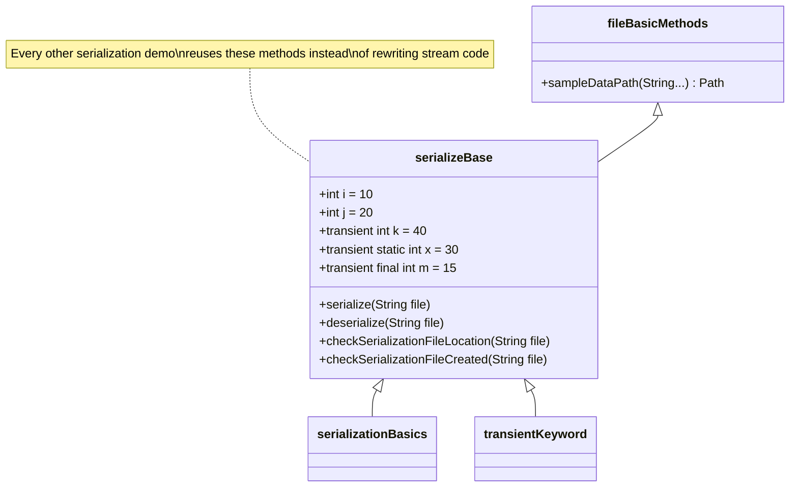
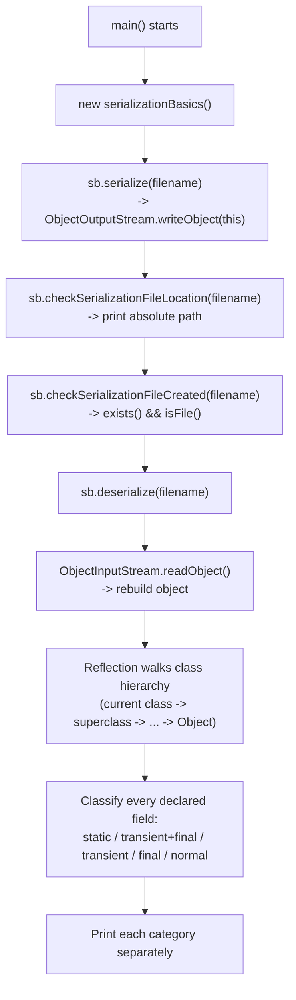

# Serialization Basics — The Foundation

<!-- TOC -->
- [Serialization Basics — The Foundation](#serialization-basics--the-foundation)
  - [Concept](#concept)
  - [End-to-End Flow (serializationBasics.java)](#end-to-end-flow-serializationbasicsjava)
  - [Why `deserialize()` uses reflection instead of direct field access](#why-deserialize-uses-reflection-instead-of-direct-field-access)
  - [Verified Output](#verified-output)
  - [Related Files](#related-files)
<!-- /TOC -->

**Files:**
- [serializationBasics.java](../../../demo/src/main/java/com/advanced/serialization/serializationBasics.java) — the runnable demo.
- [serializeBase.java](../../../demo/src/main/java/com/advanced/serialization/serializeBase.java) — the shared parent class every other serialization demo in this package extends. It owns `serialize()`, `deserialize()`, and the file-check helpers used everywhere else.

## 📌 Concept

> Serialization converts an in-memory Java object into a stream of bytes; deserialization reverses that process. Only classes that implement `Serializable` (directly or via inheritance) are eligible.



## 🧭 End-to-End Flow (serializationBasics.java)



## 🔍 Why `deserialize()` uses reflection instead of direct field access

`serializeBase.deserialize()` (see [serializeBase.java](../../../demo/src/main/java/com/advanced/serialization/serializeBase.java)) walks `getClass()` up to (but excluding) `Object`, and for every `Field` found via `getDeclaredFields()`:

| Modifier combination  | Bucket                         | Why                                                                                                         |
| --------------------- | ------------------------------ | ----------------------------------------------------------------------------------------------------------- |
| `static`              | Static fields                  | Belongs to the class, not the object — not part of serialized state at all (`field.get(null)`).             |
| `transient` + `final` | Transient **and** Final fields | `final` blocks reassignment; `transient` blocks serialization — both apply, so it's listed in both buckets. |
| `transient` only      | Transient fields               | Skipped during serialization; deserialized value is whatever the field's default/initializer produces.      |
| `final` only          | Normal **and** Final fields    | Serialized normally; also final so it can't be reassigned after construction.                               |
| none of the above     | Normal fields                  | Regular serializable state, fully restored from the stream.                                                 |

This reflection-based approach is needed (instead of e.g. `this.i == restoredObject.i`) because **field values alone can't tell you a field's modifiers** — only reflection can answer "is this transient/static/final?".

## ✅ Verified Output

```
Serialization file location: .../demo/sample-data/serialization/fileObject.ser
Serialization file was created successfully.
Normal serialized fields:
  i = 10
  j = 20
Transient fields (not restored from the file):
  k = 0
  m = 0
Static fields (not part of object state):
  x = 30
Final fields:
  m = 0
```

- `i`, `j` → normal fields, restored exactly as serialized (10, 20).
- `k` → transient, not in the stream, comes back as the `int` default `0`.
- `m` → `transient final`, same story: default `0` (its initializer `= 15` never gets a chance to run because deserialization for a *serializable* class does **not** re-invoke field initializers/constructors — this is the key difference from Part 2 of [inheritanceSerializationbasics.md](./inheritanceSerializationbasics.md), where the parent is *non-serializable* and its constructor **does** re-run).
- `x` → `static`, printed from the class itself (`field.get(null)`), never touched by (de)serialization.

## 🔗 Related Files

- [inheritanceSerializationbasics.md](./inheritanceSerializationbasics.md) — contrasts what happens when a class in the hierarchy is *not* serializable (constructor re-runs) vs. this file's case where everything is serializable (defaults are used instead).
- [transientKeyword.md](./transientKeyword.md) — deep dive on `transient`/`final` semantics.
