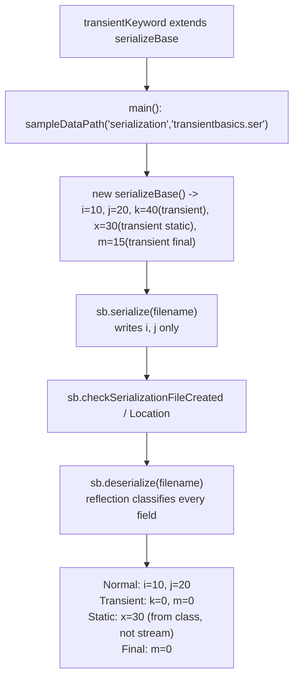
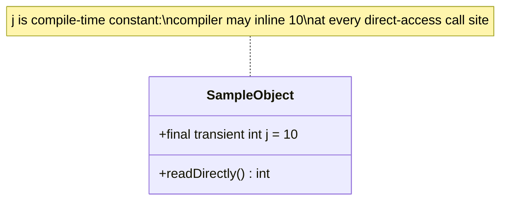
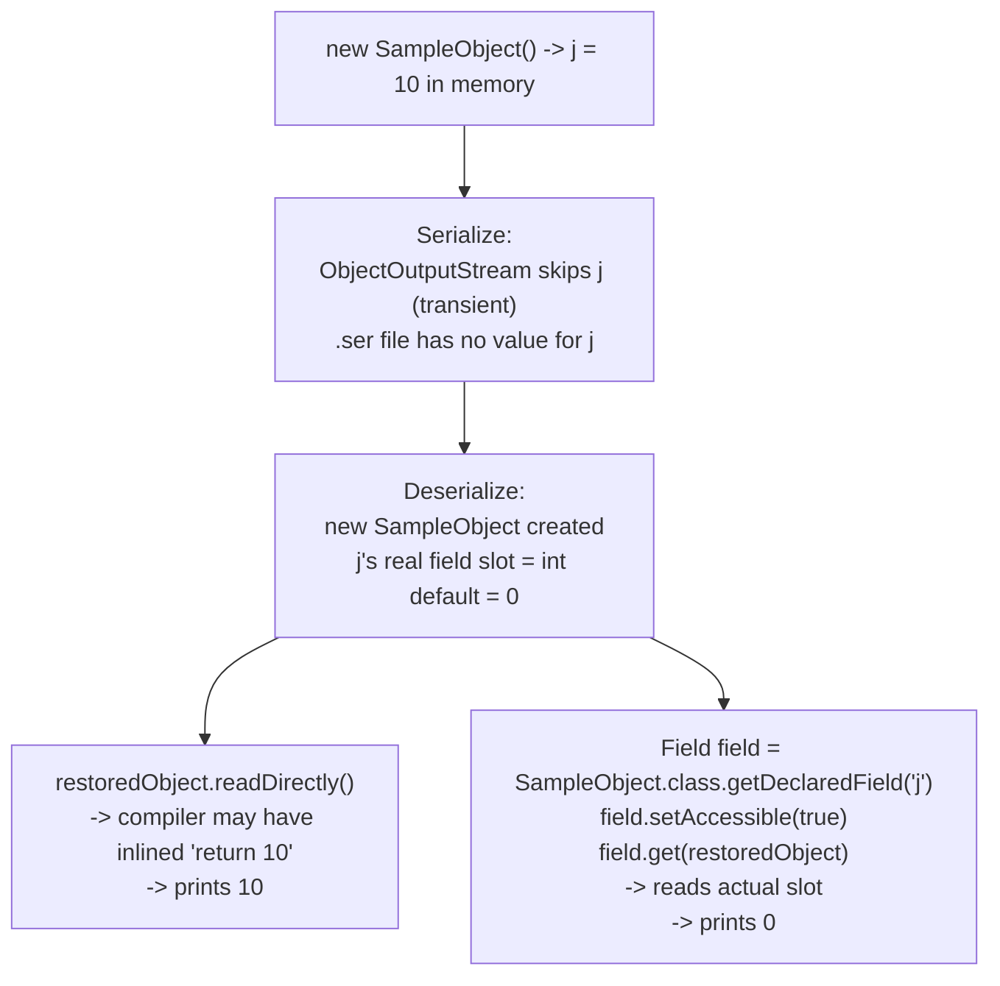

# The `transient` Keyword — Basics and the `final transient` Edge Case

| Part | File | Scenario |
|---|---|---|
| [Part 1](#part-1--transientkeywordjava) | `transientKeyword.java` | `transient` hides a field's value from the serialized file |
| [Part 2](#part-2--reflectionvsdirectaccessjava) | `reflectionVsDirectAccess.java` | `final transient` + compiler constant-inlining vs. reflection |

---

## Part 1 — transientKeyword.java

**File:** [transientKeyword.java](../../../demo/src/main/java/com/advanced/serialization/transientKeyword.java)

### 📌 Concept

> `transient` applies only to variables (not methods/classes). It tells the JVM to skip writing that field's value to the serialized stream — usually for security (passwords, secrets) or because the value is derivable/irrelevant after restore.



### Key rules demonstrated
- **`static` vs `transient`:** a static field is never part of object state, so marking it `transient` too is redundant — it was never going to be serialized anyway.
- **`final` vs `transient`:** they control different things — `final` blocks *reassignment*, `transient` blocks *serialization*. A `final transient` field is still excluded from the file; the `.ser` file is created, but never contains that value.

### ✅ Verified Output
```
Serialization file was created successfully.
Serialization file location: .../demo/sample-data/serialization/transientbasics.ser
Normal serialized fields:
  i = 10
  j = 20
Transient fields (not restored from the file):
  k = 0
  m = 0
Static fields (not part of object state):
  x = 30
Final fields:
  m = 0
```

This is identical in shape to [serializationBasics.md](./serializationBasics.md)'s output, because both classes serialize a plain `serializeBase` object — this file's whole point is highlighting *why* `k`, `m`, and `x` come out the way they do.

> 📎 The file itself notes: *"For final transient scenario refer the program reflectionVsDirectAccess.java program"* — see Part 2 below.

---

## Part 2 — reflectionVsDirectAccess.java

**File:** [reflectionVsDirectAccess.java](../../../demo/src/main/java/com/advanced/serialization/reflectionVsDirectAccess.java)

### 📌 Concept

> `final transient int j = 10;` — the compiler treats `j` as a **compile-time constant** because it is `final` and initialized with a constant literal. Code that reads `j` directly may get the inlined constant `10` even after deserialization wipes the real field slot back to `0`. Reflection bypasses that inlining and reads the true field value.



### 🧭 End-to-End Flow



### 🔍 Step-by-step
1. **Compilation:** `j` is `final` + a constant literal, so `readDirectly() { return j; }` may be compiled as `return 10;` directly in bytecode (constant folding). This inlining is independent of serialization.
2. **Serialization:** `j` is `transient`, so its value is never written to `reflection-demo.ser`.
3. **Deserialization:** since there's no data for `j` in the stream, the new object's `j` slot is left at the `int` default, `0`. (Unlike Part 2 of [inheritanceSerializationbasics.md](./inheritanceSerializationbasics.md), `SampleObject` itself *is* serializable — there's no non-serializable-parent constructor to re-run and re-apply the `= 10` initializer here; `transient` fields on a serializable class simply come back as their type's zero value.)
4. **Direct access (`readDirectly()`):** may still print `10` — the compiler-inlined constant, not the real (now-zero) field.
5. **Reflection (`field.get(restoredObject)`):** reads the actual runtime field slot, bypassing any inlining — prints `0`.

### ✅ Verified Output
```
Without reflection: 10
With reflection: 0
Expected result: direct access may show 10, reflection shows 0.
```

### ⚠️ Things That Would Change This
| Change | Effect |
|---|---|
| Remove `final` (keep `transient`) | No more compile-time constant folding — `readDirectly()` would also print `0`, matching reflection. |
| Remove `transient` (keep `final`) | `j = 10` would actually be serialized/restored — both direct access and reflection print `10`. |
| Initialize `j` from a non-constant expression (e.g. a method call) | Compiler can't inline it — direct access would also read the real (zero) slot. |

## 🔗 Related Files
- [serializationBasics.md](./serializationBasics.md) — the `serializeBase` reflection-based field classifier used across these demos.
- [inheritanceSerializationbasics.md](./inheritanceSerializationbasics.md) — contrasts what happens to fields owned by a *non-serializable parent* (constructor re-runs) vs. a `transient` field on a serializable class (simple zero-default, as seen here).
