# Java End-to-End CI Pipeline Guide

<!-- TOC -->
- [Java End-to-End CI Pipeline Guide](#java-end-to-end-ci-pipeline-guide)
    - [Pipeline Overview](#pipeline-overview)
    - [Triggers and Shared Values](#triggers-and-shared-values)
    - [Job Details](#job-details)
    - [Required Secrets](#required-secrets)
    - [Docker Image Registry](#docker-image-registry)
    - [Program Execution and HTML Report](#program-execution-and-html-report)
    - [Report Attachment in Email](#report-attachment-in-email)
    - [Program Counts in the Email](#program-counts-in-the-email)
    - [Failure Behavior](#failure-behavior)
    - [Troubleshooting Known Failures](#troubleshooting-known-failures)
        - [Gmail SMTP: 535 BadCredentials](#gmail-smtp-535-badcredentials)
        - [GHCR Docker Push: unknown blob](#ghcr-docker-push-unknown-blob)
<!-- /TOC -->

This document describes the design and behaviour of the
`.github/workflows/java-end-to-end_ci.yml` workflow.

## Pipeline Overview

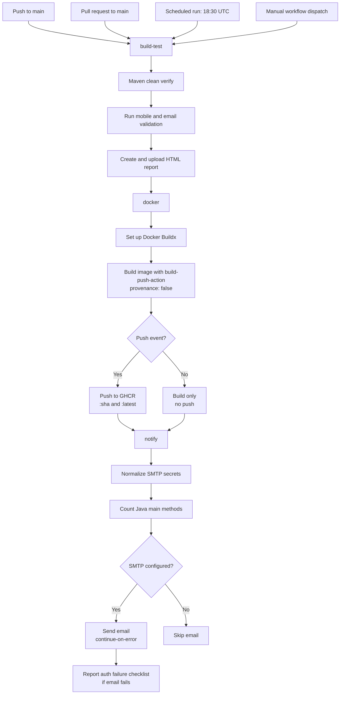

## Triggers and Shared Values

The workflow runs for pushes and pull requests to `main`, every day at `18:30` UTC, and when started manually with `workflow_dispatch` from the GitHub Actions page.

| Variable        | Purpose                                                |
| --------------- | ------------------------------------------------------ |
| `IMAGE_NAME`    | Base GitHub Container Registry image name.             |
| `MOBILE_NUMBER` | Sample input for the mobile-number validation program. |
| `EMAIL_ID`      | Sample input for the email-address validation program. |

The mobile number and email address are workflow environment variables, not values hard-coded into the Java command. Update them in the top-level `env` section to try different known-valid examples.

## Job Details

### `build-test`

| Step                  | Description                                                                                                                          |
| --------------------- | ------------------------------------------------------------------------------------------------------------------------------------ |
| Checkout              | `actions/checkout@v4`                                                                                                                |
| Set up JDK 21         | Temurin distribution with Maven cache                                                                                                |
| Build and test        | Runs `mvn -B clean verify` in `demo/`; it cleans old output, compiles source, runs configured tests, and verifies the build.         |
| Execute Java programs | Runs the two configured `checkNumber` scenarios, then discovers and runs every Java source file containing a `main` method.          |
| Create report         | Writes `target/ci-reports/execution-report.html` with folder, program, arguments, output, exit code, and status for every execution. |
| Upload artifacts      | Uploads the HTML as `java-execution-report` and Surefire XML as `surefire-reports`.                                                  |

### `docker`

| Step              | Description                                                                                      |
| ----------------- | ------------------------------------------------------------------------------------------------ |
| Set push flag     | Output `pushed=true` only on `push` events                                                       |
| GHCR login        | `docker/login-action@v3` using `GITHUB_TOKEN` (push only)                                        |
| Set up Buildx     | `docker/setup-buildx-action@v3` enables BuildKit-based builds                                    |
| Build and push    | `docker/build-push-action@v6` tags `:sha` and `:latest`; pushes only on `push` events            |
| Provenance off    | `provenance: false` and `sbom: false` prevent GHCR `unknown blob` push failures (see below)     |

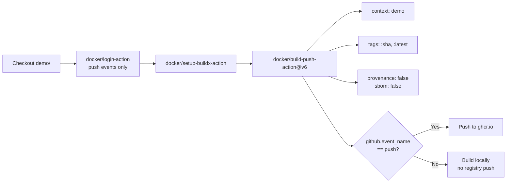

### `notify`

Runs after both previous jobs regardless of their outcome (`if: always()`).

| Step                    | Description                                                                                       |
| ----------------------- | ------------------------------------------------------------------------------------------------- |
| Download artifact       | Retrieves `java-execution-report` from `build-test` into `ci-report/`                             |
| Count programs          | Scans `demo/src/main/java/com` for `public static void main(...)` declarations                    |
| Check SMTP config       | Trims whitespace from secrets; aligns `SMTP_FROM` with `SMTP_USERNAME` for Gmail                  |
| Send email              | `dawidd6/action-send-mail@v18` with `continue-on-error: true` so auth failures do not fail the job |
| Report delivery failure | Prints a Gmail App Password checklist when SMTP authentication is rejected                        |

The email includes:
- Repo, branch, commit SHA, trigger event
- Result of each upstream job
- Full Docker image name and both tags
- Whether images were pushed
- Java program counts (total and per-folder)
- HTML execution report attached as `execution-report.html`

## Required Secrets

| Secret          | Purpose                            |
| --------------- | ---------------------------------- |
| `SMTP_SERVER`   | SMTP host (e.g. `smtp.gmail.com`)  |
| `SMTP_PORT`     | SMTP port (e.g. `587`)             |
| `SMTP_USERNAME` | SMTP login username (full email)   |
| `SMTP_PASSWORD` | Gmail **App Password** (16 chars)  |
| `SMTP_FROM`     | Sender email (must match username for Gmail) |
| `SMTP_TO`       | Recipient email address            |

If any secret is missing the email step is skipped gracefully.

For Gmail, see [Gmail SMTP: 535 BadCredentials](#gmail-smtp-535-badcredentials) for setup and troubleshooting.

## Docker Image Registry

Images are stored in the GitHub Container Registry (GHCR):

```
ghcr.io/<owner>/java-project:<git-sha>
ghcr.io/<owner>/java-project:latest
```

`<owner>` is resolved automatically from `github.repository_owner`.

Images are pushed **only** on `push` to `main`.  
Pull-request runs build the image locally for validation but do **not** push.

## Program Execution and HTML Report

The `Execute Java programs and create HTML report` step runs with `if: always()`. It creates a report even after a Maven failure, so the workflow retains execution evidence.

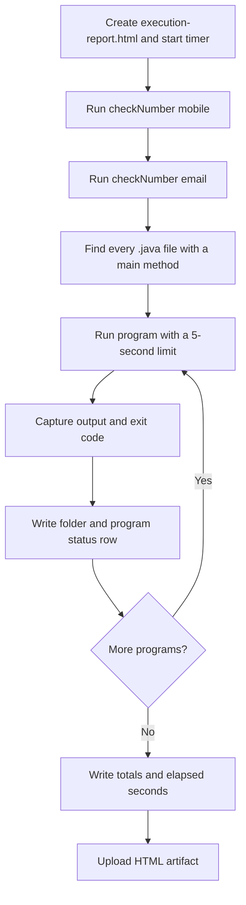

### What is executed

The two `checkNumber` cases run first because they require command-line arguments:

```bash
java -cp target/classes com.regularExpressions.checkNumber mobile "$MOBILE_NUMBER"
java -cp target/classes com.regularExpressions.checkNumber email "$EMAIL_ID"
```

Afterward, the workflow searches `src/main/java` for files that declare `public static void main(...)`. Each eligible source-file class is converted to its fully qualified class name and executed with no arguments, unless that program was already run earlier with required command-line arguments.

| Item                                 | Explanation                                                                                                        |
| ------------------------------------ | ------------------------------------------------------------------------------------------------------------------ |
| `find "$source_root" -name '*.java'` | Finds all Java source files.                                                                                       |
| `grep` with `main_pattern`           | Keeps only source files containing a `main` method declaration.                                                    |
| `java -cp target/classes <class>`    | Starts the compiled Java program.                                                                                  |
| `timeout --kill-after=2s 5s`         | Stops a program that takes more than five seconds; an extra two seconds allows cleanup before it is force-stopped. |
| `head -c 20000`                      | Limits captured output to 20,000 bytes per program, keeping the report manageable.                                 |
| `SECONDS=0`                          | Starts Bash's elapsed-time timer for the complete program scan.                                                    |

### Dynamic entry-point detection and base classes

The pipeline does **not** hard-code a source filename to decide whether a class should run. It uses the Java entry-point declaration as the rule:

```text
public static void main(...)
```

Every `.java` file is compiled during `mvn -B clean verify`, including reusable base classes, parent classes, helpers, models, and interfaces. The later runtime scan only starts classes that independently declare `main()`. Therefore, a reusable base class such as `collectionBasics`, even when many child classes inherit it, is compiled and available to its children but is never started as a Java application when it has no `main()` method.

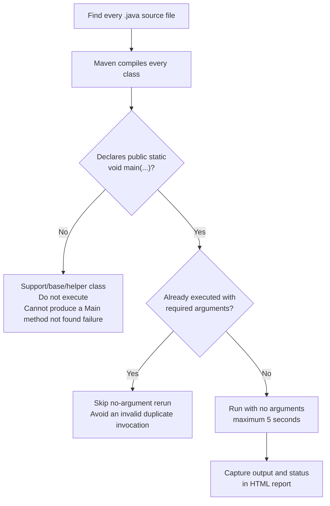

#### Why inheritance is not used as the filter

The workflow deliberately does not infer that a class is non-runnable merely because other classes extend it. A base class can legally contain its own `main()` method for a demonstration or standalone tool. The presence of an entry point is the safe and objective rule.

| Source-file type                                       | Maven compile | Runtime scan                    | Reason                                                                                |
| ------------------------------------------------------ | ------------- | ------------------------------- | ------------------------------------------------------------------------------------- |
| Base/parent class with no `main()`                     | Yes           | Skipped                         | It supplies inherited behavior, not an application entry point.                       |
| Helper, model, or interface with no `main()`           | Yes           | Skipped                         | It cannot be launched with `java <class>`.                                            |
| Runnable class with `main()`                           | Yes           | Executed once without arguments | It is a standalone Java application.                                                  |
| Runnable class already started with required arguments | Yes           | Not rerun without arguments     | The workflow records the earlier configured invocation and prevents a duplicate call. |

#### Argument-driven program registry

Some programs require command-line arguments. For example, the validator is deliberately executed twice: once with the `mobile` scenario and once with the `email` scenario. Whenever `run_program` receives a non-empty argument string, it records the fully qualified class name in `programs_run_with_arguments`.

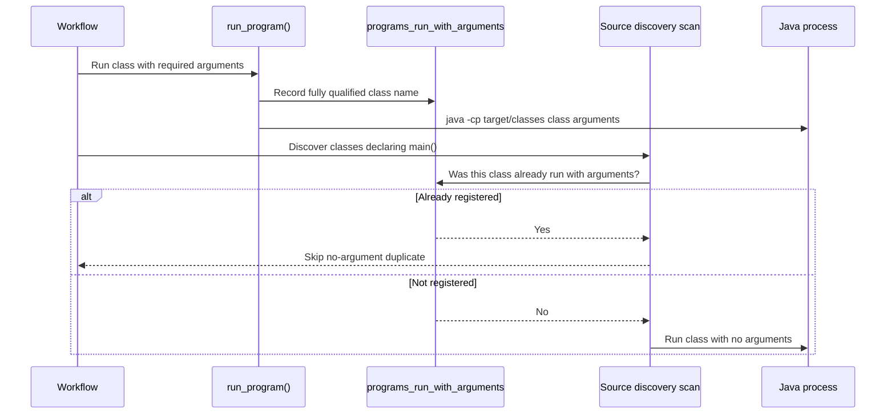

This is dynamic: adding another argument-driven program only requires calling `run_program` with its arguments. No source-file path or class-name exception needs to be added to the discovery loop.

### Execution status

Every run is printed to the GitHub Actions log and added to the HTML report.

| Status      | Meaning                                               |
| ----------- | ----------------------------------------------------- |
| `PASSED`    | The Java process ended with exit code `0`.            |
| `FAILED`    | The program ended with a non-zero exit code.          |
| `TIMED OUT` | The program exceeded the five-second execution limit. |

The workflow records failures and timeouts in the report but continues scanning the remaining programs. This allows one complete inventory instead of stopping at the first failing example.

### HTML report contents

Each HTML row has this structure:

| Folder               | Program                              | Arguments        | Output                 | Exit Code | Status   |
| -------------------- | ------------------------------------ | ---------------- | ---------------------- | --------- | -------- |
| `regularExpressions` | `com.regularExpressions.checkNumber` | `mobile <value>` | Program console output | `0`       | `PASSED` |

At the end, the report includes an execution summary showing the number of scanned programs, passed programs, failed programs, timed-out programs, and the total execution time in seconds.

### Downloading the report

The pipeline uploads this file as the `java-execution-report` artifact:

```text
demo/target/ci-reports/execution-report.html
```

Open a completed GitHub Actions run and download `java-execution-report` from the **Artifacts** section. The report is generated on the GitHub runner, so it does not appear as a committed file in the repository.

## Report Attachment in Email

The `build-test` and `notify` jobs use separate GitHub runners. The report must therefore be uploaded by `build-test` and downloaded again in `notify` before it can be attached to an email.

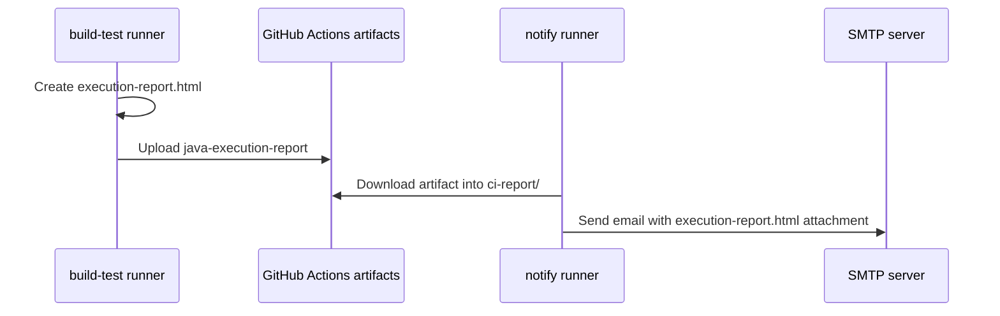

The notification job uses `actions/download-artifact@v4` to download the artifact to `ci-report/`. The email action attaches `ci-report/execution-report.html`, so the recipient receives the same report available from the GitHub Actions artifact list.

The workflow uses `dawidd6/action-send-mail@v18`, which supports Node 24. This replaces the former v3 action and avoids the Node 20 deprecation warning.

## Program Counts in the Email

Before sending the email, the `notify` job checks out the source code and scans `demo/src/main/java/com` for methods declared as:

```text
public static void main(...)
```

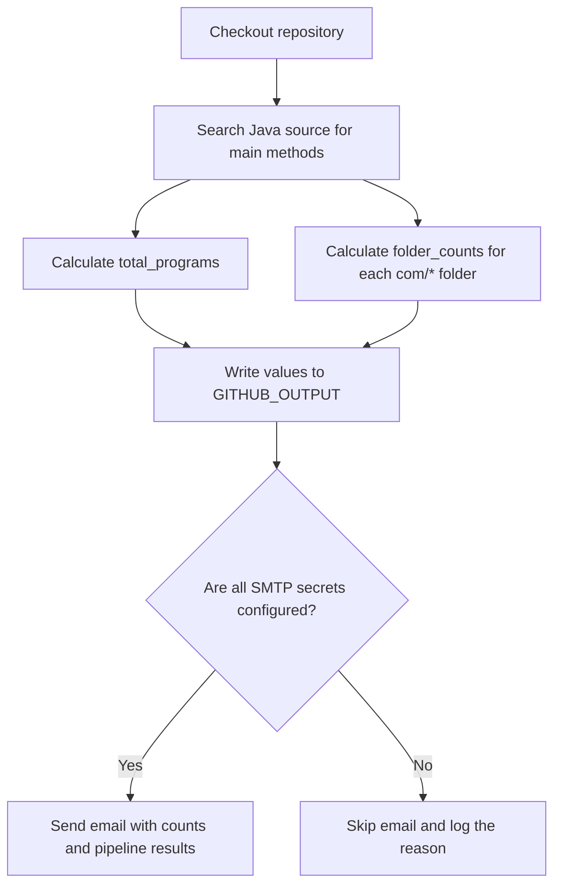

| Generated value  | Meaning                                                                                                               |
| ---------------- | --------------------------------------------------------------------------------------------------------------------- |
| `total_programs` | Number of declared `main` methods found across the Java source tree.                                                  |
| `folder_counts`  | `main`-method totals for each top-level source folder, including `advanced`, `collections`, and `regularExpressions`. |

### How the count is calculated

The workflow uses `grep` to find the `main` method signature and `wc -l` to count the matching lines:

```bash
main_pattern='public[[:space:]]+static[[:space:]]+void[[:space:]]+main[[:space:]]*\('
total_programs=$(grep -R -E -h "$main_pattern" "demo/src/main/java/com" | wc -l)
```

| Command part   | Explanation                                                                       |
| -------------- | --------------------------------------------------------------------------------- |
| `main_pattern` | Regex that recognizes `public static void main(` even when spaces or tabs differ. |
| `grep -R`      | Searches recursively through the Java source folders.                             |
| `-E`           | Enables extended regular-expression syntax.                                       |
| `-h`           | Hides file names so only matching method declarations are counted.                |
| `wc -l`        | Counts the matching lines, producing the total number of entry points.            |

The `for folder in "$source_root"/*` loop repeats the same search for every immediate folder under `com`. For example, it separately counts `com/advanced`, `com/collections`, and `com/regularExpressions`, then combines them into `folder_counts`.

This count measures **runnable Java entry points**, not Maven/JUnit test cases. A Java class is counted only when it declares `public static void main(...)`; helper classes and regular test methods are not included.

### Example email content

At the time of writing, the source scan produces a total of `261` main methods. The email renders the dynamically calculated values in this form:

```text
Java Program Counts
-------------------
Total main methods in repository : 261
By top-level source folder        : advanced: 89; collections: 3; examples: 1; exceptionHandling: 19; flowcontrol: 6; fundamentals: 36; imports: 4; javaIOPackage: 15; javalangPackage: 32; objectoriented: 51; regularExpressions: 5;
```

These numbers change automatically as programs are added or removed; the values above are only an example from the current repository state.

The values are recalculated for every workflow run. They are not hard-coded. If one Java file declares more than one `main` method, each entry point is included in the total.

The email now contains a **Java Program Counts** section with the total and per-folder summary, in addition to repository details, job results, Docker tags, and image push status.

## Failure Behavior

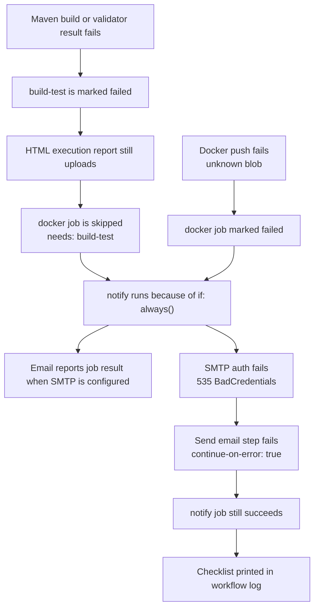

This behavior makes failures diagnosable: execution output is visible in the workflow log, the HTML artifact records each validator result, Surefire XML is retained when available, and the email can report the final status. Email and Docker failures are isolated so one subsystem does not silently block diagnostics from the other.

## Troubleshooting Known Failures

This section documents production failures observed in `.github/workflows/java-end-to-end_ci.yml`, their root causes, and the workflow changes that resolve them.

### Summary

| Error | Job | Root cause | Resolution |
| ----- | --- | ---------- | ---------- |
| `535-5.7.8 BadCredentials` (`gsmtp`) | `notify` | Gmail rejects regular passwords or stale App Passwords | Use a current Gmail App Password; align `SMTP_FROM` with `SMTP_USERNAME` |
| `unknown blob` | `docker` | BuildKit provenance attestation manifests rejected by GHCR | `provenance: false` and `sbom: false` in `docker/build-push-action@v6` |
| Email step skipped | `notify` | One or more SMTP secrets missing | Configure all six SMTP secrets in repository settings |
| Docker push `unauthorized` | `docker` | `GITHUB_TOKEN` lacks package write permission | Ensure `permissions: packages: write` and GHCR package visibility |

---

### Gmail SMTP: 535 BadCredentials

#### Symptom

The `Send email notification` step fails with:

```text
Invalid login: 535-5.7.8 Username and Password not accepted. For more information, go to
535 5.7.8  https://support.google.com/mail/?p=BadCredentials ... - gsmtp
```

The `gsmtp` suffix confirms traffic is going through **Google SMTP** (`smtp.gmail.com`).

#### Failure flow

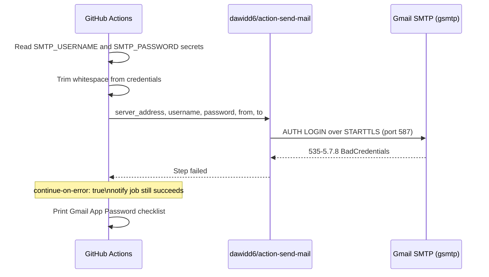

#### Root causes

| Cause | Explanation |
| ----- | ----------- |
| Regular Gmail password used | Google no longer accepts account login passwords for SMTP; an **App Password** is required. |
| Stale App Password | Generating a new App Password **immediately revokes** the previous one. GitHub secrets must be updated at the same time. |
| `SMTP_FROM` mismatch | Gmail requires the sender address to match the authenticated account. |
| Whitespace in secret | App Passwords are shown as four groups (`abcd efgh ijkl mnop`). Extra spaces in the secret can break auth if not trimmed. |
| 2-Step Verification off | App Passwords cannot be created without 2-Step Verification enabled on the Google account. |

#### Resolution

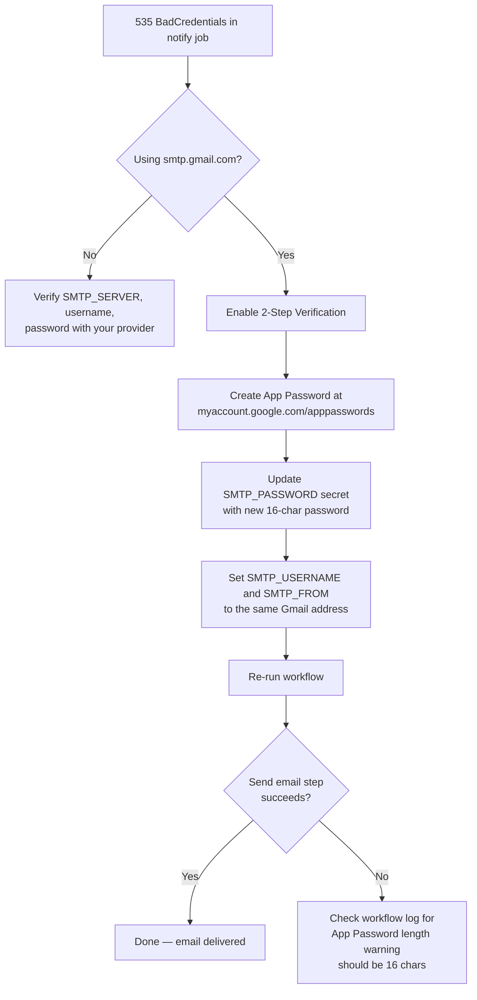

**Steps:**

1. Enable [2-Step Verification](https://myaccount.google.com/signinoptions/two-step-verification).
2. Create an App Password at [myaccount.google.com/apppasswords](https://myaccount.google.com/apppasswords) (App: **Mail**, Device: **Other** → `GitHub Actions`).
3. Update **`SMTP_PASSWORD`** in **Settings → Secrets and variables → Actions**.
4. Set **`SMTP_USERNAME`** and **`SMTP_FROM`** to the same full address (e.g. `you@gmail.com`).
5. Re-run the workflow.

**Workflow safeguards already in place:**

| Safeguard | YAML location | Effect |
| --------- | ------------- | ------ |
| Whitespace trimming | `Check SMTP configuration` step | Removes spaces from pasted App Passwords |
| From-address alignment | Same step, Gmail branch | Forces `SMTP_FROM = SMTP_USERNAME` when using Gmail |
| Length warning | Same step | Warns if password is not 16 characters after trimming |
| `continue-on-error: true` | `Send email notification` step | SMTP failure does not fail the entire `notify` job |
| Failure checklist | `Report email delivery failure` step | Prints actionable steps in the workflow log |

---

### GHCR Docker Push: unknown blob

#### Symptom

The `Build and push Docker image` step fails during push:

```text
168f4b64baaa: Pushed
unknown blob
Error: Process completed with exit code 1.
```

Image **layers upload successfully**, but the **manifest push** fails. This is not an authentication error.

#### Failure flow

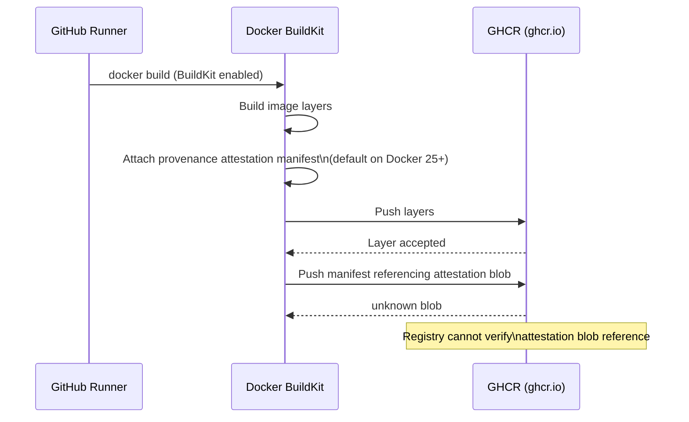

#### Root cause

Recent Docker / BuildKit versions attach **SLSA provenance attestation manifests** by default. GHCR rejects the extra blob references during manifest upload, producing `unknown blob` even when all image layers were pushed.

This became visible when GitHub `ubuntu-latest` runners upgraded to Docker 25+, which changed BuildKit's default manifest generation.

#### Resolution

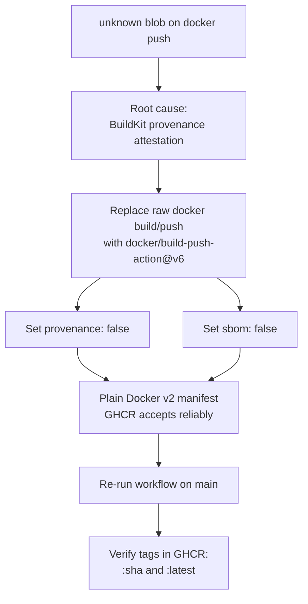

**Workflow configuration (current):**

```yaml
- name: Set up Docker Buildx
  uses: docker/setup-buildx-action@v3

- name: Build and push Docker image
  uses: docker/build-push-action@v6
  with:
    context: demo
    push: ${{ github.event_name == 'push' }}
    tags: |
      ghcr.io/${{ github.repository_owner }}/java-project:${{ github.sha }}
      ghcr.io/${{ github.repository_owner }}/java-project:latest
    provenance: false
    sbom: false
```

| Setting | Purpose |
| ------- | ------- |
| `docker/setup-buildx-action@v3` | Enables BuildKit builder on the runner |
| `docker/build-push-action@v6` | Atomic build-and-push with attestation control |
| `provenance: false` | Disables SLSA provenance manifest that triggers `unknown blob` |
| `sbom: false` | Disables SBOM attestation for the same class of GHCR issues |
| `push: ${{ github.event_name == 'push' }}` | Preserves existing behaviour: push only on `main` pushes, not PRs |

#### Before vs after

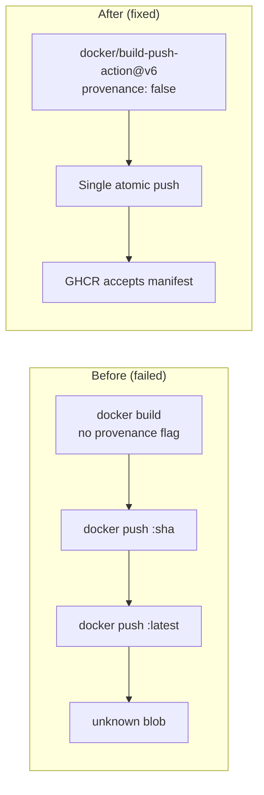

---

### Verifying a healthy run

After both fixes are applied, a successful `main` push run should show:

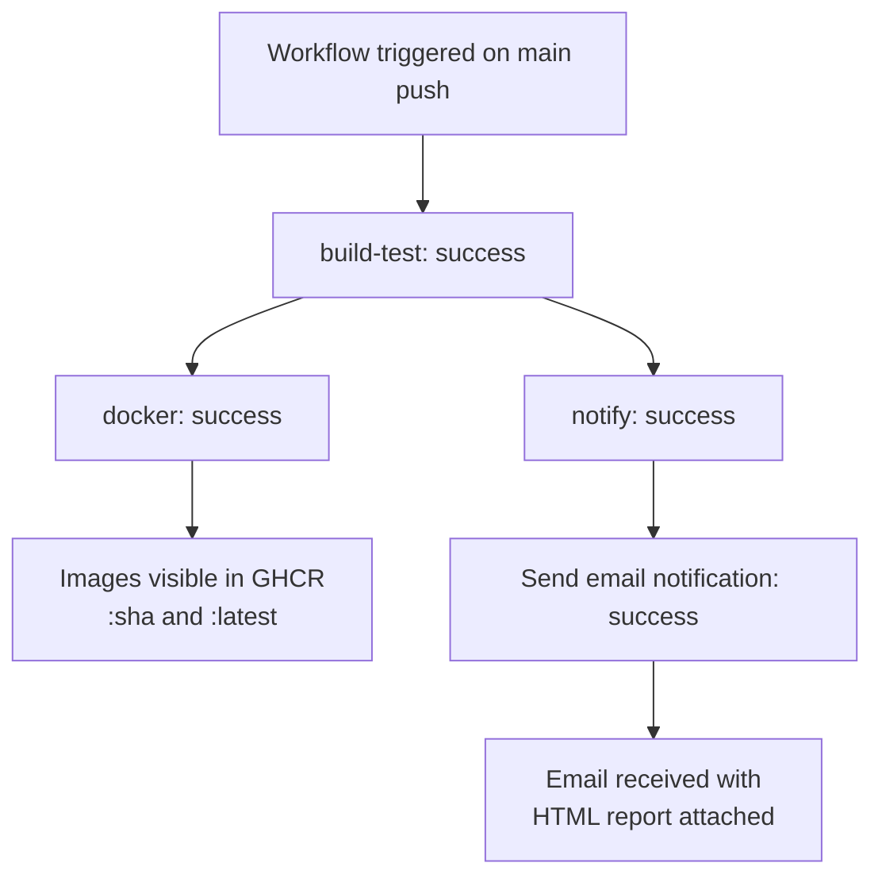

| Job | Expected step outcome |
| --- | --------------------- |
| `Build & Test` | `success` |
| `Docker Build & Push` | `Build and push Docker image` → `success` |
| `Notify via Email` | `Send email notification` → `success` |

Check results:

```bash
gh run list --workflow java-end-to-end_ci.yml --limit 3
gh run view <run-id> --json conclusion,jobs --jq '.jobs[] | {name,conclusion}'
```
