# Java End-to-End CI Pipeline Guide

<!-- TOC -->
- [Java End-to-End CI Pipeline Guide](#java-end-to-end-ci-pipeline-guide)
    - [Pipeline Overview](#pipeline-overview)
    - [Triggers and Shared Values](#triggers-and-shared-values)
    - [Job Details](#job-details)
    - [Required Secrets](#required-secrets)
    - [Docker Image Registry](#docker-image-registry)
    - [Program Execution and HTML Report](#program-execution-and-html-report)
    - [Report Attachment in Email](#report-attachment-in-email)
    - [Program Counts in the Email](#program-counts-in-the-email)
    - [Failure Behavior](#failure-behavior)
    - [Troubleshooting and Resolution Guide](#troubleshooting-and-resolution-guide)
        - [Resolution timeline](#resolution-timeline)
        - [Error summary](#error-summary)
        - [1. Gmail SMTP: 535 BadCredentials (invalid App Password)](#1-gmail-smtp-535-badcredentials-invalid-app-password)
        - [2. Gmail SMTP: ENETUNREACH (IPv6)](#2-gmail-smtp-enetunreach-ipv6)
        - [3. Python SMTP: starttls TypeError](#3-python-smtp-starttls-typeerror)
        - [4. Gmail SMTP: 535 from GitHub Actions IPs](#4-gmail-smtp-535-from-github-actions-ips)
        - [5. Resend API (recommended email provider)](#5-resend-api-recommended-email-provider)
        - [6. GHCR Docker push: unknown blob](#6-ghcr-docker-push-unknown-blob)
        - [7. Verifying a healthy run](#7-verifying-a-healthy-run)
<!-- /TOC -->

This document describes the design and behaviour of the
`.github/workflows/java-end-to-end_ci.yml` workflow.

## Pipeline Overview

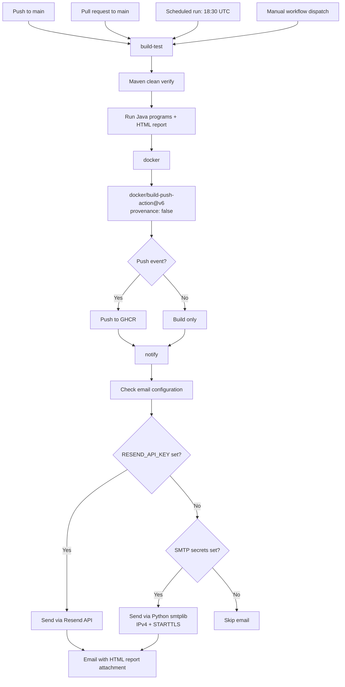
```mermaid
flowchart TD
    A["Push to main"] --> E["build-test"]
    B["Pull request to main"] --> E
    C["Scheduled run: 18:30 UTC"] --> E
    D["Manual workflow dispatch"] --> E
    E --> F["Maven clean verify"]
    F --> G["Run Java programs + HTML report"]
    G --> H["docker"]
    H --> I["docker/build-push-action@v6\nprovenance: false"]
    I --> J{"Push event?"}
    J -- Yes --> K["Push to GHCR"]
    J -- No --> L["Build only"]
    K --> M["notify"]
    L --> M
    M --> N["Check email configuration"]
    N --> O{"RESEND_API_KEY set?"}
    O -- Yes --> P["Send via Resend API"]
    O -- No --> Q{"SMTP secrets set?"}
    Q -- Yes --> R["Send via Python smtplib\nIPv4 + STARTTLS"]
    Q -- No --> S["Skip email"]
    P --> T["Email with HTML report attachment"]
    R --> T
```

## Triggers and Shared Values

The workflow runs for pushes and pull requests to `main`, every day at `18:30` UTC, and when started manually with `workflow_dispatch` from the GitHub Actions page.

| Variable        | Purpose                                                |
| --------------- | ------------------------------------------------------ |
| `IMAGE_NAME`    | Base GitHub Container Registry image name.             |
| `MOBILE_NUMBER` | Sample input for the mobile-number validation program. |
| `EMAIL_ID`      | Sample input for the email-address validation program. |

The mobile number and email address are workflow environment variables, not values hard-coded into the Java command. Update them in the top-level `env` section to try different known-valid examples.

## Job Details

### `build-test`

| Step                  | Description                                                                                                                          |
| --------------------- | ------------------------------------------------------------------------------------------------------------------------------------ |
| Checkout              | `actions/checkout@v4`                                                                                                                |
| Set up JDK 21         | Temurin distribution with Maven cache                                                                                                |
| Build and test        | Runs `mvn -B clean verify` in `demo/`; it cleans old output, compiles source, runs configured tests, and verifies the build.         |
| Execute Java programs | Runs the two configured `checkNumber` scenarios, then discovers and runs every Java source file containing a `main` method.          |
| Create report         | Writes `target/ci-reports/execution-report.html` with folder, program, arguments, output, exit code, and status for every execution. |
| Upload artifacts      | Uploads the HTML as `java-execution-report` and Surefire XML as `surefire-reports`.                                                  |

### `docker`

| Step              | Description                                                                                      |
| ----------------- | ------------------------------------------------------------------------------------------------ |
| Set push flag     | Output `pushed=true` only on `push` events                                                       |
| GHCR login        | `docker/login-action@v3` using `GITHUB_TOKEN` (push only)                                        |
| Set up Buildx     | `docker/setup-buildx-action@v3` enables BuildKit-based builds                                    |
| Build and push    | `docker/build-push-action@v6` tags `:sha` and `:latest`; pushes only on `push` events            |
| Provenance off    | `provenance: false` and `sbom: false` prevent GHCR `unknown blob` push failures (see below)     |

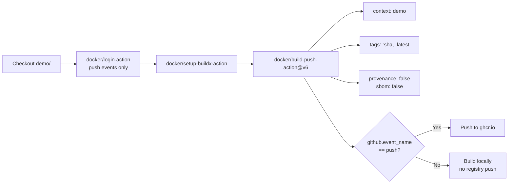
```mermaid
flowchart LR
    A["Checkout demo/"] --> B["docker/login-action\npush events only"]
    B --> C["docker/setup-buildx-action"]
    C --> D["docker/build-push-action@v6"]
    D --> E["context: demo"]
    D --> F["tags: :sha, :latest"]
    D --> G["provenance: false\nsbom: false"]
    D --> H{"github.event_name\n== push?"}
    H -- Yes --> I["Push to ghcr.io"]
    H -- No --> J["Build locally\nno registry push"]
```

### `notify`

Runs after both previous jobs regardless of their outcome (`if: always()`).

| Step                      | Description                                                                                       |
| ------------------------- | ------------------------------------------------------------------------------------------------- |
| Download artifact         | Retrieves `java-execution-report` from `build-test` into `ci-report/`                             |
| Count programs            | Scans `demo/src/main/java/com` for `public static void main(...)` declarations                    |
| Check email configuration | Selects **Resend API** (preferred) or **Gmail SMTP** (fallback); validates secrets                |
| Send email notification   | Python script sends via Resend HTTP API or `smtplib` over IPv4; `continue-on-error: true`         |
| Report delivery failure   | Prints provider-specific fix guidance when sending fails                                          |

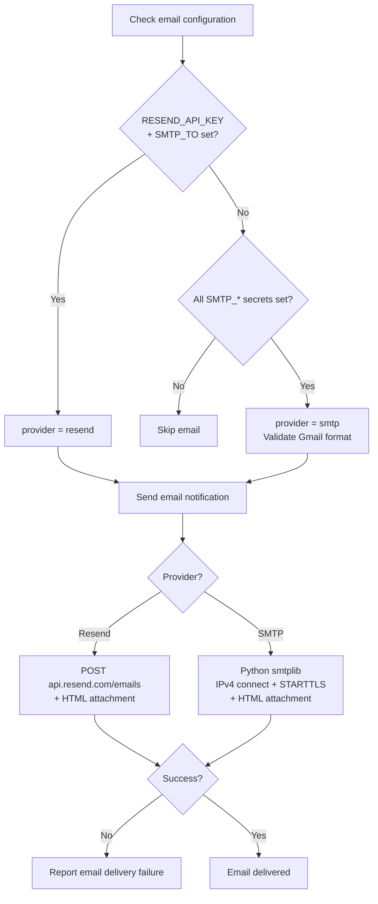
```mermaid
flowchart TD
    A["Check email configuration"] --> B{"RESEND_API_KEY\n+ SMTP_TO set?"}
    B -- Yes --> C["provider = resend"]
    B -- No --> D{"All SMTP_* secrets set?"}
    D -- No --> E["Skip email"]
    D -- Yes --> F["provider = smtp\nValidate Gmail format"]
    C --> G["Send email notification"]
    F --> G
    G --> H{"Provider?"}
    H -- Resend --> I["POST api.resend.com/emails\n+ HTML attachment"]
    H -- SMTP --> J["Python smtplib\nIPv4 connect + STARTTLS\n+ HTML attachment"]
    I --> K{"Success?"}
    J --> K
    K -- No --> L["Report email delivery failure"]
    K -- Yes --> M["Email delivered"]
```

The email includes:
- Repo, branch, commit SHA, trigger event
- Result of each upstream job
- Full Docker image name and both tags
- Whether images were pushed
- Java program counts (total and per-folder)
- HTML execution report attached as `execution-report.html`

## Required Secrets

### Recommended: Resend API (reliable from GitHub Actions)

| Secret           | Purpose                                              |
| ---------------- | ---------------------------------------------------- |
| `RESEND_API_KEY` | API key from [resend.com/api-keys](https://resend.com/api-keys) |
| `RESEND_FROM`    | Optional sender (defaults to `Java E2E CI <onboarding@resend.dev>`) |
| `SMTP_TO`        | Recipient email address                              |

When `RESEND_API_KEY` is set, the workflow uses Resend and **does not use Gmail SMTP**.

### Legacy fallback: Gmail SMTP

| Secret          | Purpose                                      |
| --------------- | -------------------------------------------- |
| `SMTP_SERVER`   | `smtp.gmail.com`                             |
| `SMTP_PORT`     | `587` (STARTTLS) or `465` (SSL)              |
| `SMTP_USERNAME` | Full `@gmail.com` address                    |
| `SMTP_PASSWORD` | 16-character Gmail App Password              |
| `SMTP_FROM`     | Same as `SMTP_USERNAME`                      |
| `SMTP_TO`       | Recipient email address                      |

Gmail SMTP often returns `535 BadCredentials` from GitHub-hosted runners even with a valid App Password. Prefer Resend for CI notifications.

See [Troubleshooting and Resolution Guide](#troubleshooting-and-resolution-guide) for every error encountered and its fix.

## Docker Image Registry

Images are stored in the GitHub Container Registry (GHCR):

```
ghcr.io/<owner>/java-project:<git-sha>
ghcr.io/<owner>/java-project:latest
```

`<owner>` is resolved automatically from `github.repository_owner`.

Images are pushed **only** on `push` to `main`.  
Pull-request runs build the image locally for validation but do **not** push.

## Program Execution and HTML Report

The `Execute Java programs and create HTML report` step runs with `if: always()`. It creates a report even after a Maven failure, so the workflow retains execution evidence.

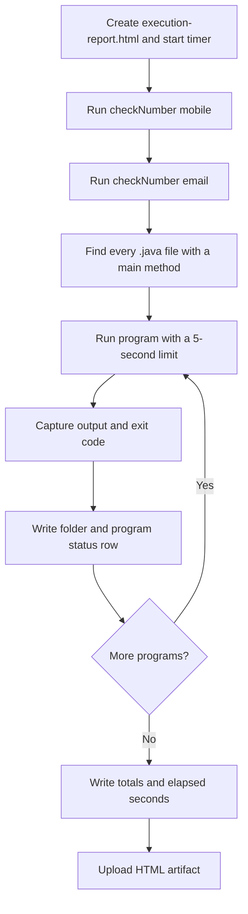
```mermaid
flowchart TD
    A["Create execution-report.html and start timer"] --> B["Run checkNumber mobile"]
    B --> C["Run checkNumber email"]
    C --> D["Find every .java file with a main method"]
    D --> E["Run program with a 5-second limit"]
    E --> F["Capture output and exit code"]
    F --> G["Write folder and program status row"]
    G --> H{"More programs?"}
    H -- Yes --> E
    H -- No --> I["Write totals and elapsed seconds"]
    I --> J["Upload HTML artifact"]
```

### What is executed

The two `checkNumber` cases run first because they require command-line arguments:

```bash
java -cp target/classes com.regularExpressions.checkNumber mobile "$MOBILE_NUMBER"
java -cp target/classes com.regularExpressions.checkNumber email "$EMAIL_ID"
```

Afterward, the workflow searches `src/main/java` for files that declare `public static void main(...)`. Each eligible source-file class is converted to its fully qualified class name and executed with no arguments, unless that program was already run earlier with required command-line arguments.

| Item                                 | Explanation                                                                                                        |
| ------------------------------------ | ------------------------------------------------------------------------------------------------------------------ |
| `find "$source_root" -name '*.java'` | Finds all Java source files.                                                                                       |
| `grep` with `main_pattern`           | Keeps only source files containing a `main` method declaration.                                                    |
| `java -cp target/classes <class>`    | Starts the compiled Java program.                                                                                  |
| `timeout --kill-after=2s 5s`         | Stops a program that takes more than five seconds; an extra two seconds allows cleanup before it is force-stopped. |
| `head -c 20000`                      | Limits captured output to 20,000 bytes per program, keeping the report manageable.                                 |
| `SECONDS=0`                          | Starts Bash's elapsed-time timer for the complete program scan.                                                    |

### Dynamic entry-point detection and base classes

The pipeline does **not** hard-code a source filename to decide whether a class should run. It uses the Java entry-point declaration as the rule:

```text
public static void main(...)
```

Every `.java` file is compiled during `mvn -B clean verify`, including reusable base classes, parent classes, helpers, models, and interfaces. The later runtime scan only starts classes that independently declare `main()`. Therefore, a reusable base class such as `collectionBasics`, even when many child classes inherit it, is compiled and available to its children but is never started as a Java application when it has no `main()` method.

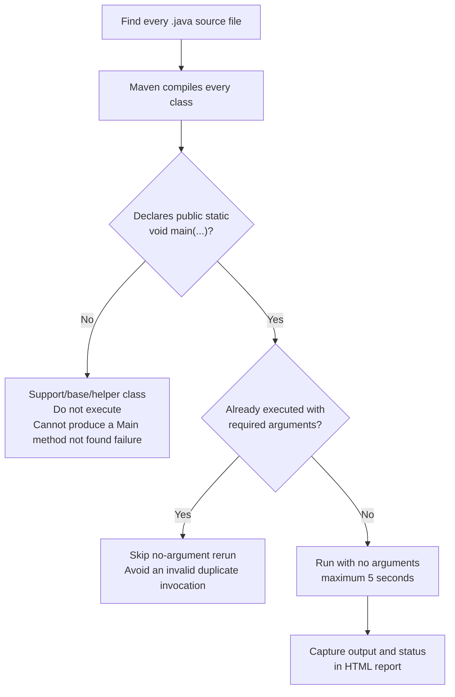
```mermaid
flowchart TD
    A["Find every .java source file"] --> B["Maven compiles every class"]
    B --> C{"Declares public static\nvoid main(...)?"}
    C -- No --> D["Support/base/helper class\nDo not execute\nCannot produce a Main method not found failure"]
    C -- Yes --> E{"Already executed with\nrequired arguments?"}
    E -- Yes --> F["Skip no-argument rerun\nAvoid an invalid duplicate invocation"]
    E -- No --> G["Run with no arguments\nmaximum 5 seconds"]
    G --> H["Capture output and status\nin HTML report"]
```

#### Why inheritance is not used as the filter

The workflow deliberately does not infer that a class is non-runnable merely because other classes extend it. A base class can legally contain its own `main()` method for a demonstration or standalone tool. The presence of an entry point is the safe and objective rule.

| Source-file type                                       | Maven compile | Runtime scan                    | Reason                                                                                |
| ------------------------------------------------------ | ------------- | ------------------------------- | ------------------------------------------------------------------------------------- |
| Base/parent class with no `main()`                     | Yes           | Skipped                         | It supplies inherited behavior, not an application entry point.                       |
| Helper, model, or interface with no `main()`           | Yes           | Skipped                         | It cannot be launched with `java <class>`.                                            |
| Runnable class with `main()`                           | Yes           | Executed once without arguments | It is a standalone Java application.                                                  |
| Runnable class already started with required arguments | Yes           | Not rerun without arguments     | The workflow records the earlier configured invocation and prevents a duplicate call. |

#### Argument-driven program registry

Some programs require command-line arguments. For example, the validator is deliberately executed twice: once with the `mobile` scenario and once with the `email` scenario. Whenever `run_program` receives a non-empty argument string, it records the fully qualified class name in `programs_run_with_arguments`.

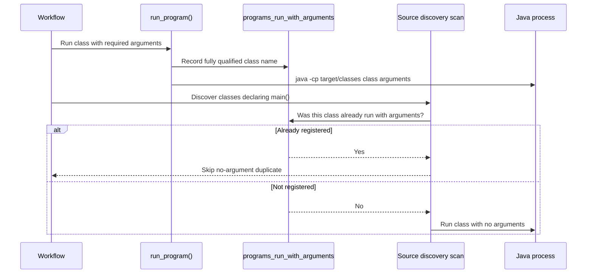
```mermaid
sequenceDiagram
    participant W as Workflow
    participant R as run_program()
    participant Registry as programs_run_with_arguments
    participant Scan as Source discovery scan
    participant JVM as Java process

    W->>R: Run class with required arguments
    R->>Registry: Record fully qualified class name
    R->>JVM: java -cp target/classes class arguments
    W->>Scan: Discover classes declaring main()
    Scan->>Registry: Was this class already run with arguments?
    alt Already registered
        Registry-->>Scan: Yes
        Scan-->>W: Skip no-argument duplicate
    else Not registered
        Registry-->>Scan: No
        Scan->>JVM: Run class with no arguments
    end
```

This is dynamic: adding another argument-driven program only requires calling `run_program` with its arguments. No source-file path or class-name exception needs to be added to the discovery loop.

### Execution status

Every run is printed to the GitHub Actions log and added to the HTML report.

| Status      | Meaning                                               |
| ----------- | ----------------------------------------------------- |
| `PASSED`    | The Java process ended with exit code `0`.            |
| `FAILED`    | The program ended with a non-zero exit code.          |
| `TIMED OUT` | The program exceeded the five-second execution limit. |

The workflow records failures and timeouts in the report but continues scanning the remaining programs. This allows one complete inventory instead of stopping at the first failing example.

### HTML report contents

Each HTML row has this structure:

| Folder               | Program                              | Arguments        | Output                 | Exit Code | Status   |
| -------------------- | ------------------------------------ | ---------------- | ---------------------- | --------- | -------- |
| `regularExpressions` | `com.regularExpressions.checkNumber` | `mobile <value>` | Program console output | `0`       | `PASSED` |

At the end, the report includes an execution summary showing the number of scanned programs, passed programs, failed programs, timed-out programs, and the total execution time in seconds.

### Downloading the report

The pipeline uploads this file as the `java-execution-report` artifact:

```text
demo/target/ci-reports/execution-report.html
```

Open a completed GitHub Actions run and download `java-execution-report` from the **Artifacts** section. The report is generated on the GitHub runner, so it does not appear as a committed file in the repository.

## Report Attachment in Email

The `build-test` and `notify` jobs use separate GitHub runners. The report must therefore be uploaded by `build-test` and downloaded again in `notify` before it can be attached to an email.

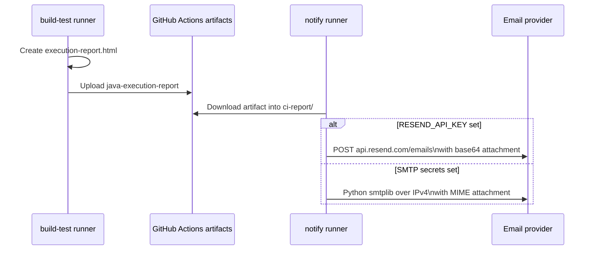
```mermaid
sequenceDiagram
    participant B as build-test runner
    participant A as GitHub Actions artifacts
    participant N as notify runner
    participant E as Email provider
    B->>B: Create execution-report.html
    B->>A: Upload java-execution-report
    N->>A: Download artifact into ci-report/
    alt RESEND_API_KEY set
        N->>E: POST api.resend.com/emails\nwith base64 attachment
    else SMTP secrets set
        N->>E: Python smtplib over IPv4\nwith MIME attachment
    end
```

The notification job uses `actions/download-artifact@v4` to download the artifact to `ci-report/`. The Python send step attaches `ci-report/execution-report.html` via Resend API or SMTP MIME, so the recipient receives the same report available from the GitHub Actions artifact list.

## Program Counts in the Email

Before sending the email, the `notify` job checks out the source code and scans `demo/src/main/java/com` for methods declared as:

```text
public static void main(...)
```

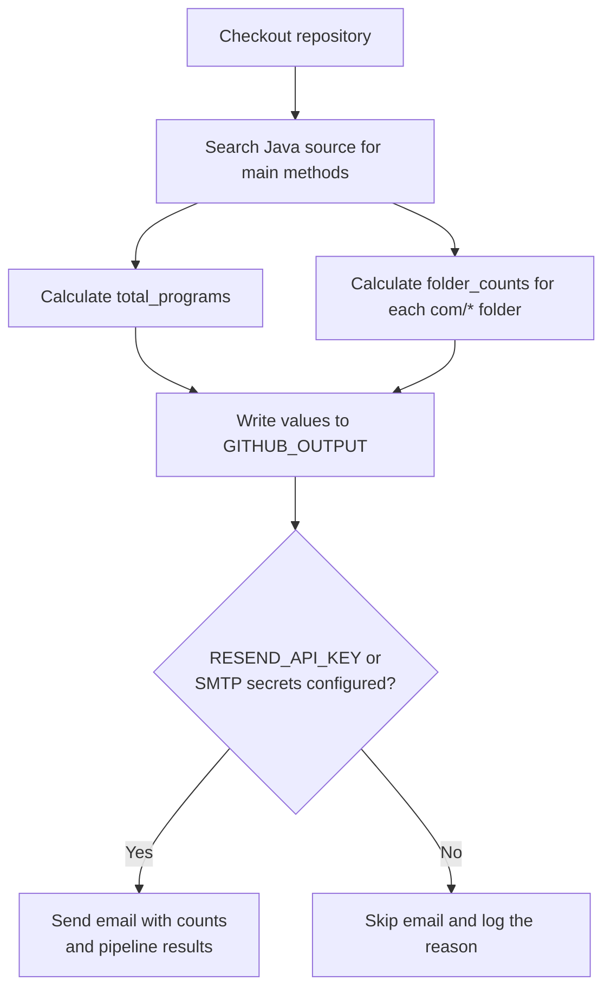
```mermaid
flowchart TD
    A["Checkout repository"] --> B["Search Java source for main methods"]
    B --> C["Calculate total_programs"]
    B --> D["Calculate folder_counts for each com/* folder"]
    C --> E["Write values to GITHUB_OUTPUT"]
    D --> E
    E --> F{"RESEND_API_KEY or\nSMTP secrets configured?"}
    F -- Yes --> G["Send email with counts\nand pipeline results"]
    F -- No --> H["Skip email and log the reason"]
```

| Generated value  | Meaning                                                                                                               |
| ---------------- | --------------------------------------------------------------------------------------------------------------------- |
| `total_programs` | Number of declared `main` methods found across the Java source tree.                                                  |
| `folder_counts`  | `main`-method totals for each top-level source folder, including `advanced`, `collections`, and `regularExpressions`. |

### How the count is calculated

The workflow uses `grep` to find the `main` method signature and `wc -l` to count the matching lines:

```bash
main_pattern='public[[:space:]]+static[[:space:]]+void[[:space:]]+main[[:space:]]*\('
total_programs=$(grep -R -E -h "$main_pattern" "demo/src/main/java/com" | wc -l)
```

| Command part   | Explanation                                                                       |
| -------------- | --------------------------------------------------------------------------------- |
| `main_pattern` | Regex that recognizes `public static void main(` even when spaces or tabs differ. |
| `grep -R`      | Searches recursively through the Java source folders.                             |
| `-E`           | Enables extended regular-expression syntax.                                       |
| `-h`           | Hides file names so only matching method declarations are counted.                |
| `wc -l`        | Counts the matching lines, producing the total number of entry points.            |

The `for folder in "$source_root"/*` loop repeats the same search for every immediate folder under `com`. For example, it separately counts `com/advanced`, `com/collections`, and `com/regularExpressions`, then combines them into `folder_counts`.

This count measures **runnable Java entry points**, not Maven/JUnit test cases. A Java class is counted only when it declares `public static void main(...)`; helper classes and regular test methods are not included.

### Example email content

At the time of writing, the source scan produces a total of `261` main methods. The email renders the dynamically calculated values in this form:

```text
Java Program Counts
-------------------
Total main methods in repository : 261
By top-level source folder        : advanced: 89; collections: 3; examples: 1; exceptionHandling: 19; flowcontrol: 6; fundamentals: 36; imports: 4; javaIOPackage: 15; javalangPackage: 32; objectoriented: 51; regularExpressions: 5;
```

These numbers change automatically as programs are added or removed; the values above are only an example from the current repository state.

The values are recalculated for every workflow run. They are not hard-coded. If one Java file declares more than one `main` method, each entry point is included in the total.

The email now contains a **Java Program Counts** section with the total and per-folder summary, in addition to repository details, job results, Docker tags, and image push status.

## Failure Behavior

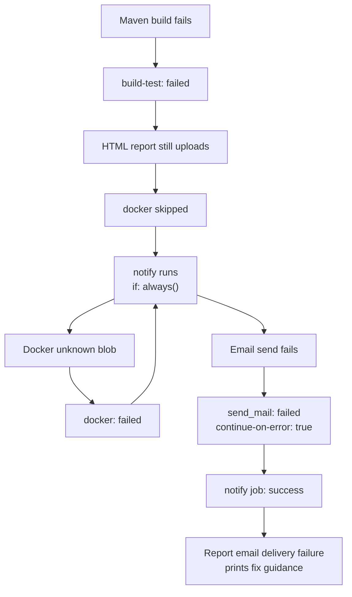
```mermaid
flowchart TD
    A["Maven build fails"] --> B["build-test: failed"]
    B --> C["HTML report still uploads"]
    C --> D["docker skipped"]
    D --> E["notify runs\nif: always()"]

    F["Docker unknown blob"] --> G["docker: failed"]
    G --> E

    H["Email send fails"] --> I["send_mail: failed\ncontinue-on-error: true"]
    I --> J["notify job: success"]
    J --> K["Report email delivery failure\nprints fix guidance"]
    E --> H
    E --> F
```

The pipeline isolates failures so diagnostics remain available: the HTML artifact uploads even when Maven fails, Docker and email failures do not block each other, and the notify job prints actionable fix guidance when email delivery fails.

## Troubleshooting and Resolution Guide

This section documents every production failure encountered in `.github/workflows/java-end-to-end_ci.yml`, the root cause, the workflow fix applied, and what you must configure in GitHub secrets.

Workflow file: `.github/workflows/java-end-to-end_ci.yml`

### Resolution timeline

The CI pipeline was hardened through a sequence of failures and fixes:

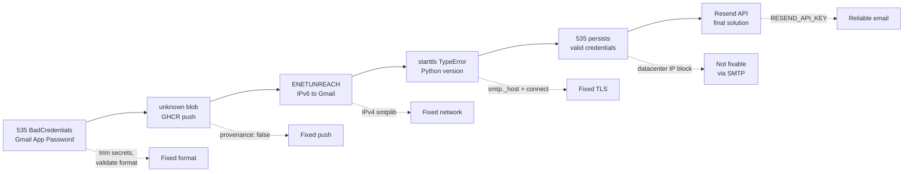
```mermaid
flowchart LR
    A["535 BadCredentials\nGmail App Password"] --> B["unknown blob\nGHCR push"]
    B --> C["ENETUNREACH\nIPv6 to Gmail"]
    C --> D["starttls TypeError\nPython version"]
    D --> E["535 persists\nvalid credentials"]
    E --> F["Resend API\nfinal solution"]

    A -.->|"trim secrets,\nvalidate format"| A1["Fixed format"]
    B -.->|"provenance: false"| B1["Fixed push"]
    C -.->|"IPv4 smtplib"| C1["Fixed network"]
    D -.->|"smtp._host + connect"| D1["Fixed TLS"]
    E -.->|"datacenter IP block"| E1["Not fixable\nvia SMTP"]
    F -.->|"RESEND_API_KEY"| F1["Reliable email"]
```

### Error summary

| # | Error | Job | Root cause | Workflow fix | User action |
| - | ----- | --- | ---------- | ------------ | ----------- |
| 1 | `535 BadCredentials` | `notify` | Wrong or stale Gmail App Password | Trim/normalize secrets; validate 16-char length | Update `SMTP_PASSWORD` with current App Password |
| 2 | `unknown blob` | `docker` | BuildKit provenance attestation rejected by GHCR | `provenance: false`, `sbom: false` | None — merge latest workflow |
| 3 | `ENETUNREACH 2607:f8b0:...` | `notify` | Runner tried Gmail over unreachable IPv6 | Python `smtplib` with explicit IPv4 | None — merge latest workflow |
| 4 | `starttls() unexpected keyword 'server_hostname'` | `notify` | GitHub runner Python lacks that parameter | `smtp._host = host` + `smtp.connect(ipv4, port)` | None — merge latest workflow |
| 5 | `535` with valid 16-char password | `notify` | Gmail rejects SMTP from datacenter IPs | Added **Resend API** provider | Add `RESEND_API_KEY` secret |
| 6 | Email step skipped | `notify` | No email secrets configured | Graceful skip with log message | Add `RESEND_API_KEY` or all SMTP secrets |

---

### 1. Gmail SMTP: 535 BadCredentials (invalid App Password)

#### Symptom

```text
Invalid login: 535-5.7.8 Username and Password not accepted ... - gsmtp
```

#### Root causes

| Cause | Explanation |
| ----- | ----------- |
| Regular Gmail password used | Google requires a 16-character **App Password**, not your login password |
| Stale App Password | Creating a new App Password **revokes** the previous one immediately |
| `SMTP_FROM` mismatch | Sender must match the authenticated Gmail account |
| Whitespace or quotes in secret | App Password pasted as `abcd efgh ijkl mnop` or wrapped in quotes |
| Wrong account | App Password created on a different Google account than `SMTP_USERNAME` |

#### Resolution

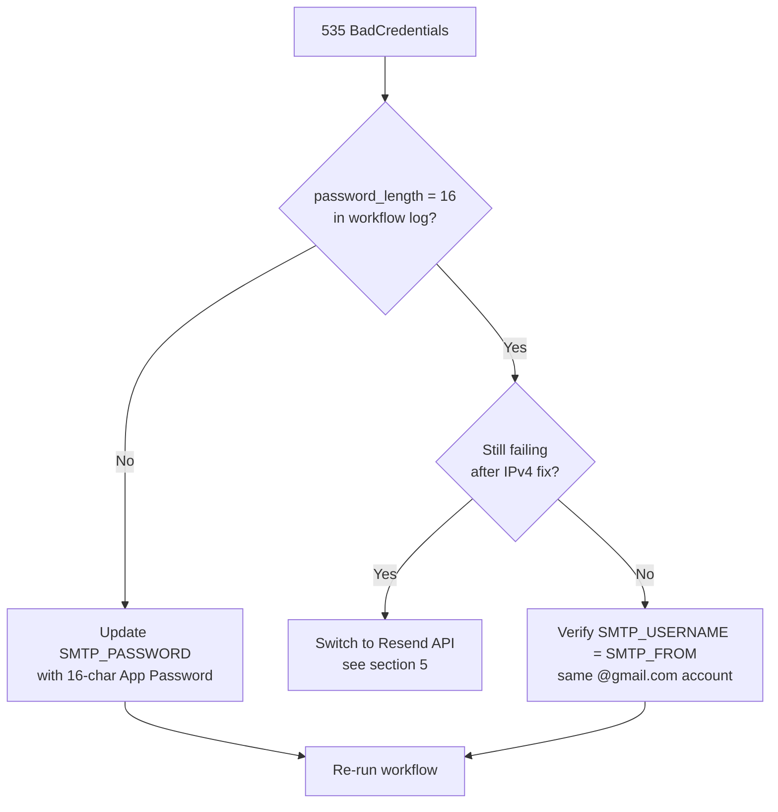
```mermaid
flowchart TD
    A["535 BadCredentials"] --> B{"password_length = 16\nin workflow log?"}
    B -- No --> C["Update SMTP_PASSWORD\nwith 16-char App Password"]
    B -- Yes --> D{"Still failing\nafter IPv4 fix?"}
    D -- Yes --> E["Switch to Resend API\nsee section 5"]
    D -- No --> F["Verify SMTP_USERNAME = SMTP_FROM\nsame @gmail.com account"]
    C --> G["Re-run workflow"]
    F --> G
```

**Steps:**

1. Enable [2-Step Verification](https://myaccount.google.com/signinoptions/two-step-verification)
2. Create an App Password at [myaccount.google.com/apppasswords](https://myaccount.google.com/apppasswords)
3. Update `SMTP_PASSWORD` in **Settings → Secrets and variables → Actions**
4. Set `SMTP_USERNAME` and `SMTP_FROM` to the same `@gmail.com` address

**Workflow safeguards:**

| Safeguard | Effect |
| --------- | ------ |
| Whitespace/quote stripping | Cleans pasted App Passwords |
| 16-character validation | Fails fast before send attempt |
| Password fingerprint in log | e.g. `ne********sl` — verify first/last two chars match your App Password |

---

### 2. Gmail SMTP: ENETUNREACH (IPv6)

#### Symptom

```text
Error: connect ENETUNREACH 2607:f8b0:4004:c19::6d:587 - Local (:::0)
```

#### Root cause

GitHub-hosted runners resolve `smtp.gmail.com` to an **IPv6** address (AAAA record). The runner has no working IPv6 route to Google, so the connection fails before authentication.

#### Failure flow

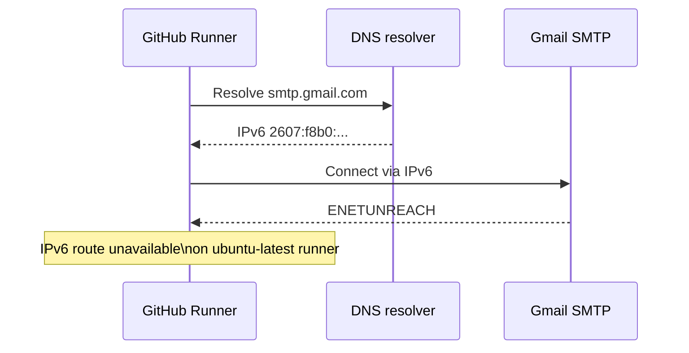
```mermaid
sequenceDiagram
    participant R as GitHub Runner
    participant DNS as DNS resolver
    participant G as Gmail SMTP

    R->>DNS: Resolve smtp.gmail.com
    DNS-->>R: IPv6 2607:f8b0:...
    R->>G: Connect via IPv6
    G-->>R: ENETUNREACH
    Note over R: IPv6 route unavailable\non ubuntu-latest runner
```

#### Resolution

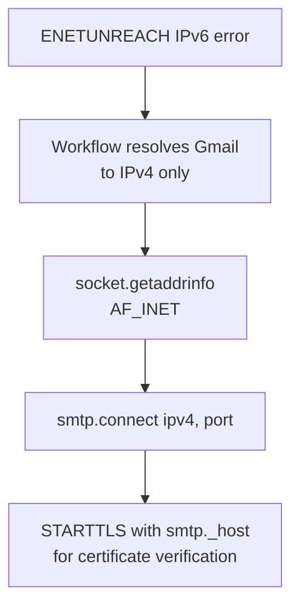
```mermaid
flowchart TD
    A["ENETUNREACH IPv6 error"] --> B["Workflow resolves Gmail\nto IPv4 only"]
    B --> C["socket.getaddrinfo\nAF_INET"]
    C --> D["smtp.connect ipv4, port"]
    D --> E["STARTTLS with smtp._host\nfor certificate verification"]
```

**Workflow fix:** Replaced `dawidd6/action-send-mail` with Python `smtplib` that resolves Gmail to IPv4 via `socket.getaddrinfo(host, port, socket.AF_INET)` and connects to the IPv4 address directly.

No secret changes required.

---

### 3. Python SMTP: starttls TypeError

#### Symptom

```text
TypeError: SMTP.starttls() got an unexpected keyword argument 'server_hostname'
```

#### Root cause

The GitHub runner Python version does not accept `server_hostname` as a keyword argument on `SMTP.starttls()`.

#### Resolution

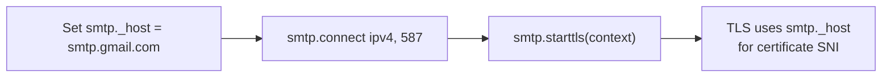
```mermaid
flowchart LR
    A["Set smtp._host = smtp.gmail.com"] --> B["smtp.connect ipv4, 587"]
    B --> C["smtp.starttls(context)"]
    C --> D["TLS uses smtp._host\nfor certificate SNI"]
```

**Workflow fix:**

```python
with smtplib.SMTP(timeout=60) as smtp:
    smtp._host = host          # smtp.gmail.com for TLS certificate
    smtp.connect(ipv4, port)   # connect to IPv4 address
    smtp.ehlo()
    smtp.starttls(context=context)
    smtp.ehlo()
    smtp.login(user, password)
```

No secret changes required.

---

### 4. Gmail SMTP: 535 from GitHub Actions IPs

#### Symptom

Network and TLS succeed, credentials look correct, but Gmail still rejects login:

```text
Authenticating as q***2@gmail.com with app-password fingerprint ne********sl
Connecting to smtp.gmail.com via IPv4 142.251.167.109:587
SMTPAuthenticationError: (535, b'5.7.8 Username and Password not accepted ... gsmtp')
```

Workflow diagnostics show `username_domain=@gmail.com`, `password_length=16`, `from_matches_user=yes`.

#### Root cause

Gmail frequently **rejects App Password SMTP authentication from cloud datacenter IPs** (including GitHub Actions runners), even when:

- The App Password is valid and freshly generated
- The same credentials work on a local machine
- All secret formatting is correct

This is a Google-side policy restriction, not a workflow bug.

#### Failure flow

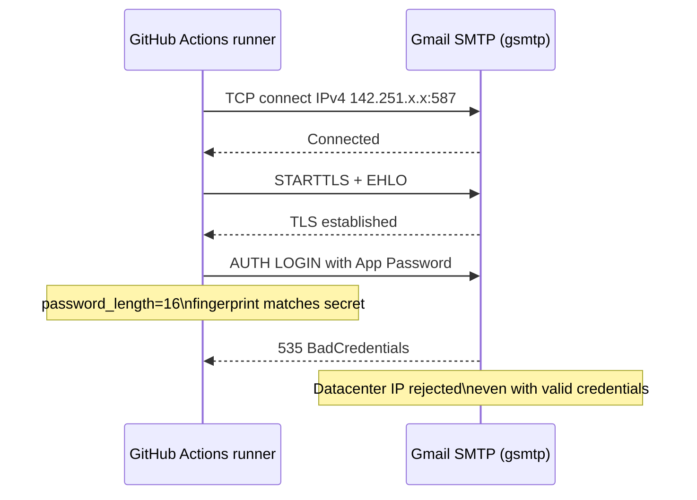
```mermaid
sequenceDiagram
    participant W as GitHub Actions runner
    participant G as Gmail SMTP (gsmtp)

    W->>G: TCP connect IPv4 142.251.x.x:587
    G-->>W: Connected
    W->>G: STARTTLS + EHLO
    G-->>W: TLS established
    W->>G: AUTH LOGIN with App Password
    Note over W: password_length=16\nfingerprint matches secret
    G-->>W: 535 BadCredentials
    Note over G: Datacenter IP rejected\neven with valid credentials
```

#### Resolution

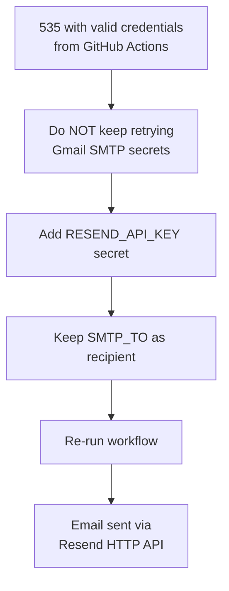
```mermaid
flowchart TD
    A["535 with valid credentials\nfrom GitHub Actions"] --> B["Do NOT keep retrying\nGmail SMTP secrets"]
    B --> C["Add RESEND_API_KEY secret"]
    C --> D["Keep SMTP_TO as recipient"]
    D --> E["Re-run workflow"]
    E --> F["Email sent via\nResend HTTP API"]
```

**This cannot be fixed by changing Gmail App Passwords alone.** Switch to Resend (section 5).

---

### 5. Resend API (recommended email provider)

#### Why Resend

| Approach | Works from GitHub Actions? | Setup complexity |
| -------- | -------------------------- | ---------------- |
| Gmail SMTP + App Password | Often **no** (535 from datacenter IPs) | Medium |
| **Resend API** | **Yes** | Low (one API key) |

#### Setup

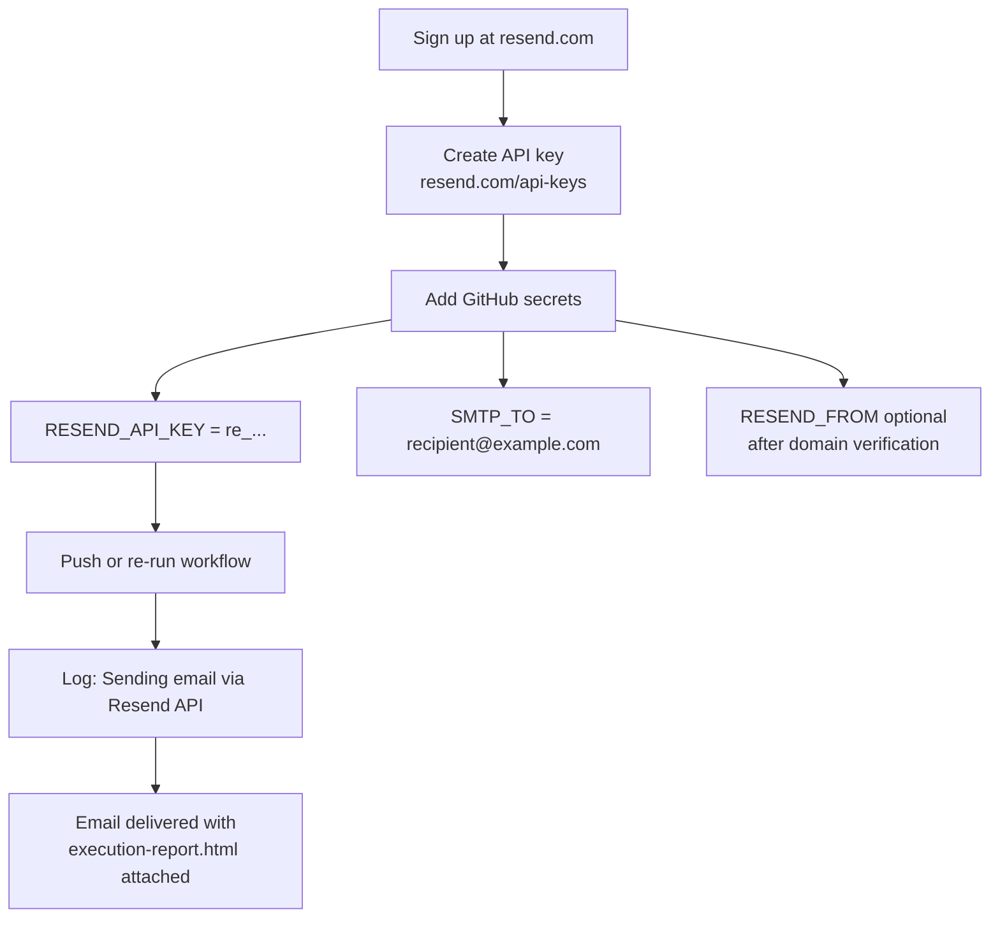
```mermaid
flowchart TD
    A["Sign up at resend.com"] --> B["Create API key\nresend.com/api-keys"]
    B --> C["Add GitHub secrets"]
    C --> D["RESEND_API_KEY = re_..."]
    C --> E["SMTP_TO = recipient@example.com"]
    C --> F["RESEND_FROM optional\nafter domain verification"]
    D --> G["Push or re-run workflow"]
    G --> H["Log: Sending email via Resend API"]
    H --> I["Email delivered with\nexecution-report.html attached"]
```

**GitHub secrets:**

| Secret | Required | Example |
| ------ | -------- | ------- |
| `RESEND_API_KEY` | Yes | `re_xxxxxxxxxxxx` |
| `SMTP_TO` | Yes | `team@example.com` |
| `RESEND_FROM` | No | `Java CI <notifications@yourdomain.com>` |

If `RESEND_FROM` is omitted, the workflow uses `Java E2E CI <onboarding@resend.dev>`.

#### Email provider selection in workflow

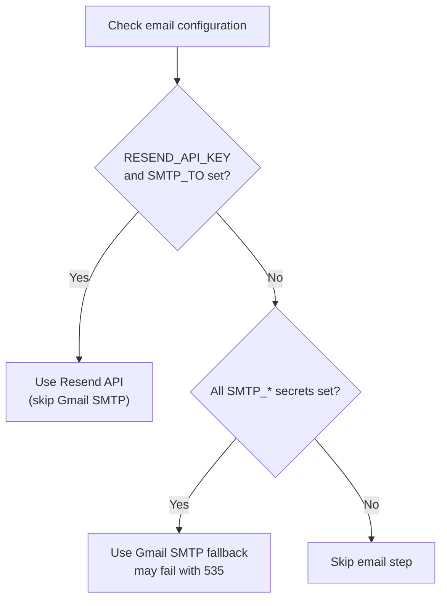
```mermaid
flowchart TD
    A["Check email configuration"] --> B{"RESEND_API_KEY\nand SMTP_TO set?"}
    B -- Yes --> C["Use Resend API\n(skip Gmail SMTP)"]
    B -- No --> D{"All SMTP_* secrets set?"}
    D -- Yes --> E["Use Gmail SMTP fallback\nmay fail with 535"]
    D -- No --> F["Skip email step"]
```

**Workflow code (Resend path):**

```python
request = urllib.request.Request(
    "https://api.resend.com/emails",
    data=json.dumps({
        "from": from_addr,
        "to": [to_addr],
        "subject": subject,
        "text": body,
        "attachments": [{"filename": "execution-report.html", "content": base64_content}],
    }).encode(),
    headers={"Authorization": f"Bearer {api_key}", "Content-Type": "application/json"},
    method="POST",
)
```

---

### 6. GHCR Docker push: unknown blob

#### Symptom

```text
168f4b64baaa: Pushed
unknown blob
Error: Process completed with exit code 1.
```

Image layers upload successfully; the **manifest push** fails.

#### Root cause

Docker BuildKit attaches **SLSA provenance attestation manifests** by default on GitHub `ubuntu-latest` runners (Docker 25+). GHCR rejects the extra blob references.

#### Failure flow

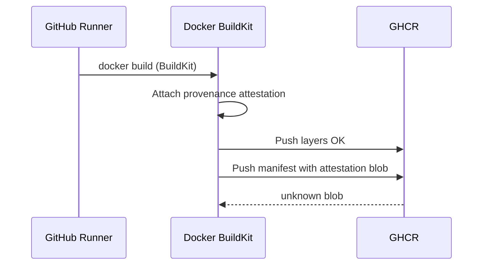
```mermaid
sequenceDiagram
    participant R as GitHub Runner
    participant BK as Docker BuildKit
    participant GH as GHCR

    R->>BK: docker build (BuildKit)
    BK->>BK: Attach provenance attestation
    BK->>GH: Push layers OK
    BK->>GH: Push manifest with attestation blob
    GH-->>BK: unknown blob
```

#### Resolution

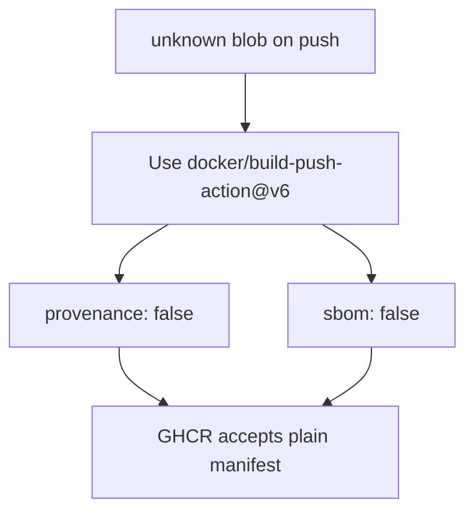
```mermaid
flowchart TD
    A["unknown blob on push"] --> B["Use docker/build-push-action@v6"]
    B --> C["provenance: false"]
    B --> D["sbom: false"]
    C --> E["GHCR accepts plain manifest"]
    D --> E
```

**Workflow configuration:**

```yaml
- name: Set up Docker Buildx
  uses: docker/setup-buildx-action@v3

- name: Build and push Docker image
  uses: docker/build-push-action@v6
  with:
    context: demo
    push: ${{ github.event_name == 'push' }}
    tags: |
      ghcr.io/${{ github.repository_owner }}/java-project:${{ github.sha }}
      ghcr.io/${{ github.repository_owner }}/java-project:latest
    provenance: false
    sbom: false
```

#### Before vs after

```mermaid
flowchart LR
    subgraph before ["Before (failed)"]
        B1["docker build"] --> B2["docker push"]
        B2 --> B3["unknown blob"]
    end

    subgraph after ["After (fixed)"]
        A1["build-push-action@v6\nprovenance: false"] --> A2["Atomic push to GHCR"]
        A2 --> A3["Success"]
    end
```

No secret changes required.

---

### 7. Verifying a healthy run

After all fixes are applied and `RESEND_API_KEY` is configured:

```mermaid
flowchart TD
    A["Push to main"] --> B["build-test: success"]
    B --> C["docker: success"]
    C --> D["GHCR tags :sha and :latest"]
    B --> E["notify: success"]
    E --> F["Check email configuration:\nEmail provider: Resend API"]
    F --> G["Send email notification:\nSending email via Resend API"]
    G --> H["Email sent successfully"]
    H --> I["Recipient receives email\nwith execution-report.html"]
```

| Job | Expected log / outcome |
| --- | ---------------------- |
| `Build & Test` | `success` |
| `Docker Build & Push` | `Build and push Docker image` → `success` |
| `Notify via Email` | `Email provider: Resend API` → `Email sent successfully` |

**Verify from the command line:**

```bash
gh run list --workflow java-end-to-end_ci.yml --limit 3
gh run view <run-id> --json conclusion,jobs --jq '.jobs[] | {name,conclusion}'
gh run view <run-id> --log | rg "Email provider|Email sent|Resend API response"
```

**Verify Docker images:**

```bash
docker pull ghcr.io/<owner>/java-project:latest
```

**Minimum secrets for a fully passing pipeline:**

| Secret | Purpose |
| ------ | ------- |
| `RESEND_API_KEY` | Send CI notification emails |
| `SMTP_TO` | Email recipient |
| *(none extra for Docker)* | `GITHUB_TOKEN` handles GHCR push automatically |
